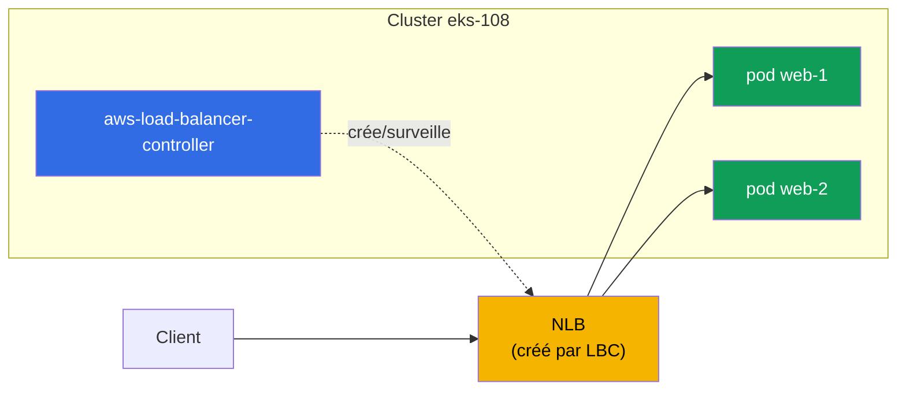
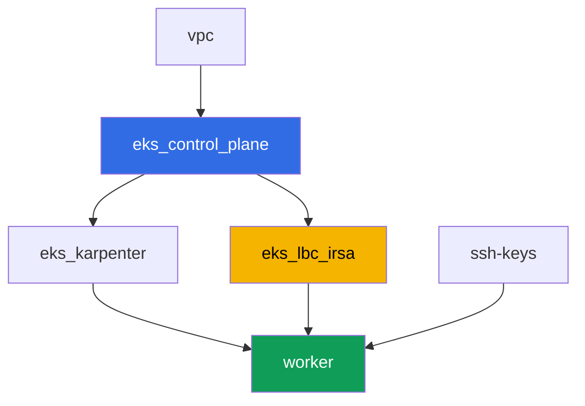

[Русская версия](README_RU.MD) · [Eng version](README.MD) · [Versión en español](README_ES.MD) · [Deutsche Version](README_DE.MD) · [ქართული ვერსია](README_GE.MD) · [繁體中文版](README_TW.MD) · [日本語版](README_JP.MD)

# Lab 108 - AWS Load Balancer Controller : NLB pour un Service de type LoadBalancer

## Description

Le premier laboratoire de la Partie 5 du cours - réseau et trafic. Vous installez ici l'AWS
Load Balancer Controller (LBC) et basculez la réconciliation d'un Service de type
LoadBalancer de l'in-tree cloud provider obsolète vers le contrôleur moderne, qui crée un
Network Load Balancer (NLB) - un load balancer L4 avec des targets sur les IP des pods.
Vous verrez comment l'annotation du Service décide quel contrôleur prend en charge l'objet,
comment choisir le type de target et le schéma d'accès, et comment lire les logs du
contrôleur pour distinguer une réconciliation normale d'un échec dû aux droits IAM.

Les tâches sont écrites dans un style de production : un énoncé court plus des critères
d'acceptation. La vérification est automatique, via la commande `check_result`.

## Objectif

Consolider le contenu du chapitre suivant du cours :

- [Chapitre 26. AWS Load Balancer Controller et un Service de type LoadBalancer : NLB](../../course/26/fr.md) - le contrôleur, les annotations, NLB contre CLB

## Ce que nous créons

Le cluster est déjà déployé en tant que code (control plane, Fargate pour les pods
système, Karpenter pour la charge de travail). Vous installez le LBC et construisez autour
de lui une charge de travail et un Service.

| Objet | Ce que c'est | Pourquoi dans ce laboratoire |
|--------|---------|-------------------|
| Namespace `eks-108` | une section du cluster pour la charge du laboratoire | garde les ressources séparées de celles du système |
| ServiceAccount `aws-load-balancer-controller` | une SA dans `kube-system` avec un rôle IRSA | donne au contrôleur l'accès à l'API ELBv2 |
| Deployment `aws-load-balancer-controller` | le contrôleur lui-même (chart Helm `eks/aws-load-balancer-controller`) | surveille les objets Service/Ingress et crée des load balancers |
| Deployment `web` (2 réplicas) | l'application ping_pong | la charge de travail que nous publions vers l'extérieur |
| Service `web` (LoadBalancer) | un Service avec les annotations `external`, `nlb-target-type: ip`, `scheme` | force LBC à créer un NLB avec des targets sur les IP des pods |
| Artefacts `nlb.txt`, `targets.txt`, `reconcile.txt` | sortie d'AWS CLI et explication des logs | confirment le type de load balancer, le type de target et la frontière de responsabilité IAM |

Vue finale du trafic :



## Infrastructure

L'environnement est déployé sur AWS (`eu-central-1`) via Terragrunt. Chaque dossier du
laboratoire est un composant avec son propre `terragrunt.hcl`, qui référence un module
partagé dans `terraform/modules/` et déclare ses dépendances via des blocs `dependency`.

### Modules et dépendances

| Dossier (composant) | Module (`terraform/modules/`) | Dépend de | Ce qu'il crée |
|---------------------|-------------------------------|------------|-------------|
| `vpc` | `vpc_v3` | - | VPC `10.10.0.0/16`, sous-réseaux dans deux AZ, NAT |
| `ssh-keys` | `ssh-keys` | - | une paire de clés SSH pour la machine de travail |
| `eks_control_plane` | `eks_v2_control_plane` | `vpc` | control plane EKS `1.36`, fournisseur OIDC |
| `eks_fargate_system` | `eks_v2_fargate` | `vpc`, `eks_control_plane` | profil Fargate pour `kube-system` et `karpenter` |
| `eks_addons` | `eks_v2_addons` | `eks_control_plane`, `eks_fargate_system` | coredns, kube-proxy, vpc-cni, pod-identity |
| `eks_karpenter` | `eks_v2_karpenter` | `vpc`, `eks_control_plane`, `eks_addons`, `eks_fargate_system` | contrôleur Karpenter, rôle IAM des nœuds |
| `eks_karpenter_default_vng` | `eks_v2_karpenter_vng` | `vpc`, `eks_control_plane`, `eks_karpenter` | NodePool par défaut sur AL2023 |
| `eks_lbc_irsa` | `eks_v2_lbc_irsa` | `eks_control_plane` | rôle et politique IAM IRSA pour l'AWS Load Balancer Controller |
| `worker` | `eks_v2_work_pc` | `ssh-keys`, `vpc`, `eks_control_plane`, `eks_karpenter`, `eks_lbc_irsa` | machine de travail avec kubectl, tests et `check_result` |

Le module `eks_v2_lbc_irsa` crée uniquement un rôle IAM qui fait confiance au fournisseur
OIDC du cluster (une condition `sub` sur
`system:serviceaccount:kube-system:aws-load-balancer-controller`) et une politique avec les
permissions ELBv2/EC2 nécessaires au contrôleur. Le contrôleur lui-même n'est pas un add-on
managé EKS - l'étudiant l'installe manuellement via Helm dans la tâche 2.

Graphe de dépendances (ce qui est appliqué en premier est plus bas dans la flèche) :



Les composants `eks_fargate_system`, `eks_addons`, `eks_karpenter_default_vng` ne sont pas
inclus dans le graphe ci-dessus pour des raisons de lisibilité (pas plus de 8 nœuds) - ils
sont appliqués dans l'ordre standard entre `eks_control_plane` et `eks_karpenter`, comme
dans le laboratoire 101.

### Où chaque chose est configurée

`env.hcl` (paramètres communs de l'environnement) :

| Paramètre | Valeur dans le laboratoire | Ce qu'il affecte |
|----------|-----------------|---------------|
| `region` | `eu-central-1` | région de toutes les ressources |
| `vpc_default_cidr`, `subnets` | `10.10.0.0/16`, sous-réseaux par AZ | plan d'adressage du VPC, source des IP targets du NLB |
| `prefix` | `eks-task108` | préfixe des noms de ressources et des tags |
| `stack_name` | `eks108` | permet de construire `env_name`, le nom du cluster |
| `k8_version` | `1.36.0` | version de kubectl sur la machine de travail |
| `instance_type_worker` | `t3.medium` | type d'instance de la machine de travail |
| `ssh_password_enable`, `access_cidrs` | `true`, `0.0.0.0/0` | accès SSH à la machine de travail |

`inputs` dans le `terragrunt.hcl` de chaque composant :

| Fichier | Réglages clés |
|------|--------------------|
| `eks_control_plane/terragrunt.hcl` | `eks.version = "1.36"`, sous-réseaux pour le control plane et les nœuds |
| `eks_lbc_irsa/terragrunt.hcl` | `name` (cluster) et `oidc_provider_arn` pour la politique de confiance du rôle |
| `eks_karpenter_default_vng/terragrunt.hcl` | `requirements` du NodePool, `disruption`, `budgets` |
| `worker/terragrunt.hcl` | `test_url`, `task_script_url` pour les fichiers du laboratoire 108 ; dépendance à `eks_lbc_irsa` |

## Déploiement

```bash
TASK=108 make run_eks_task
```

Le déploiement prend environ 15 à 20 minutes. Dans la sortie, repérez la ligne avec la
connexion SSH vers la machine de travail et connectez-vous. kubectl y est déjà configuré
pour le bon cluster.

Commandes utiles sur la machine de travail :

```bash
time_left       # temps restant de l'environnement
check_result    # vérifier la solution
```

> Sécurité du banc de test. Dans `env.hcl`, `ssh_password_enable = true` et
> `access_cidrs = ["0.0.0.0/0"]` sont activés - pratique pour un environnement de formation,
> mais à ne pas faire en production. Selon les standards du cours (chapitres 0.2, 2, 19),
> l'accès aux machines de travail passe par AWS SSM Session Manager sans port SSH public
> exposé, et `access_cidrs` est restreint à des adresses précises. Ici, le SSH public est
> laissé uniquement pour simplifier le démarrage.

## Tâches

---
|        **1**        | **Namespace pour la charge du laboratoire**                             |
| :-----------------: | :---------------------------------------------------------- |
| Ce qu'on fait          | Créez un namespace nommé `eks-108`. Tous les objets du laboratoire (sauf le contrôleur et son ServiceAccount, qui vivent dans `kube-system`) sont créés à l'intérieur. |
| Critères d'acceptation    | - le namespace `eks-108` existe. |
---
|        **2**        | **ServiceAccount et installation de l'AWS Load Balancer Controller**  |
| :-----------------: | :---------------------------------------------------------- |
| Ce qu'on fait          | Trouvez l'ARN du rôle IAM créé par terraform pour le contrôleur (nom du rôle `<cluster-name>-lbc-irsa`), et créez le ServiceAccount `aws-load-balancer-controller` dans `kube-system` avec l'annotation `eks.amazonaws.com/role-arn` pointant vers ce rôle. Installez ensuite l'AWS Load Balancer Controller via Helm (dépôt `https://aws.github.io/eks-charts`, chart `aws-load-balancer-controller`) avec les flags `--set serviceAccount.create=false --set serviceAccount.name=aws-load-balancer-controller`, `--set clusterName=<nom-du-cluster>`, `--set region=eu-central-1` et `--set vpcId=<ID-du-VPC-du-labo>`. Les flags `region`/`vpcId` sont obligatoires : le contrôleur tourne sur Fargate (namespace `kube-system` sous le profil Fargate), et sur Fargate il n'y a pas d'instance metadata EC2 - sans ces flags le contrôleur essaie de déterminer le VPC ID via IMDS et tombe en `CrashLoopBackOff`. Vous pouvez obtenir le VPC ID via `aws eks describe-cluster --name <cluster-name> --query 'cluster.resourcesVpcConfig.vpcId'`. Attendez que le Deployment `aws-load-balancer-controller` dans `kube-system` devienne `Running` (tous les réplicas Ready). |
| Critères d'acceptation    | - ServiceAccount `aws-load-balancer-controller` dans `kube-system` avec une annotation vers le rôle `lbc-irsa` ;<br/>- Deployment `aws-load-balancer-controller` dans `kube-system` a au moins un réplica prêt. |
---
|        **3**        | **Charge de travail pour la publication vers l'extérieur**                           |
| :-----------------: | :---------------------------------------------------------- |
| Ce qu'on fait          | Dans le namespace `eks-108`, créez le Deployment `web`, image `viktoruj/ping_pong:latest`, `2` réplicas. Attendez que les deux réplicas soient Ready. |
| Critères d'acceptation    | - Deployment `web` dans `eks-108`, image `viktoruj/ping_pong` ;<br/>- `2` réplicas prêts. |
---
|        **4**        | **Service de type LoadBalancer : NLB au lieu d'un Classic Load Balancer** |
| :-----------------: | :---------------------------------------------------------- |
| Ce qu'on fait          | Créez le Service `web` de type `LoadBalancer` avec le sélecteur `app: web`, le port `80` vers `targetPort: 8080`, et trois annotations : `service.beta.kubernetes.io/aws-load-balancer-type: external` (transfère la réconciliation à LBC au lieu de l'in-tree provider, qui aurait créé un Classic Load Balancer obsolète), `service.beta.kubernetes.io/aws-load-balancer-nlb-target-type: ip`, `service.beta.kubernetes.io/aws-load-balancer-scheme: internet-facing`. Attendez l'adresse externe (`kubectl get svc web -n eks-108 -w`). Via `aws elbv2 describe-load-balancers` confirmez qu'un load balancer `Type: network` (NLB, pas `classic`) avec `Scheme: internet-facing` a été créé, et enregistrez la sortie dans `/var/work/tests/artifacts/4/nlb.txt`. |
| Critères d'acceptation    | - Service `web` dans `eks-108` avec les trois annotations et une adresse externe (`status.loadBalancer.ingress[0].hostname`) ;<br/>- le fichier `nlb.txt` n'est pas vide et contient `network` et `internet-facing`. |
---
|        **5**        | **Vérification des targets : IP des pods, pas ID des nœuds**                 |
| :-----------------: | :---------------------------------------------------------- |
| Ce qu'on fait          | Via `aws elbv2 describe-target-groups` trouvez le target group du NLB créé, puis via `aws elbv2 describe-target-health` regardez la liste des targets. Enregistrez les deux sorties dans `/var/work/tests/artifacts/5/targets.txt`. Vérifiez que `TargetType` est égal à `ip`, et que les identifiants des targets sont des adresses IP issues de `10.10.0.0/16` (adresses des pods), pas `i-...` (ID d'instance des nœuds). |
| Critères d'acceptation    | - le fichier `targets.txt` n'est pas vide ;<br/>- il contient `"TargetType": "ip"` et au moins un target avec une adresse issue de `10.10.0.0/16` ;<br/>- il ne contient aucun target de la forme `i-...`. |
---
|        **6**        | **Diagnostic : réconciliation réussie face à AccessDenied**  |
| :-----------------: | :---------------------------------------------------------- |
| Ce qu'on fait          | Regardez le log du contrôleur (`kubectl logs -n kube-system deploy/aws-load-balancer-controller`) et trouvez les lignes de réconciliation réussie du Service `web` - on y trouve l'ARN du load balancer créé (`arn:aws:elasticloadbalancing:...`). Dans l'artefact `/var/work/tests/artifacts/6/reconcile.txt` décrivez les deux situations : à quoi ressemble une réconciliation normale (avec cet ARN) et à quoi ressemblerait une erreur due à des droits IAM manquants - un message `AccessDenied` sur l'appel `elasticloadbalancing:CreateLoadBalancer`, qui laisserait le Service sans adresse externe. |
| Critères d'acceptation    | - le fichier `reconcile.txt` n'est pas vide ;<br/>- il contient une ligne avec `arn:aws:elasticloadbalancing` (le log réel de la réconciliation réussie) ;<br/>- il contient le mot `AccessDenied` (description du symptôme attendu en l'absence de droits). |
---

## Vérification du résultat

Sur la machine de travail, lancez la vérification automatique :

```bash
check_result
```

Le script exécutera les tests et affichera le pourcentage de tâches accomplies.

## Solution

Solution de référence : [worker/files/solutions/1_FR.MD](worker/files/solutions/1_FR.MD)

## Suppression du cluster et des ressources

> Avant de supprimer. Le Service `web` de type `LoadBalancer` de la tâche 4 a créé un vrai
> NLB et deux security groups directement via l'API ELBv2/EC2 (AWS Load Balancer
> Controller), pas terraform - le state n'en sait rien. La bonne façon de les retirer est
> de supprimer le Service et de laisser LBC appeler lui-même l'API AWS pour les supprimer
> (un finalizer sur le Service empêchera l'objet d'être retiré d'etcd tant que LBC n'a pas
> confirmé que le NLB et les deux SG sont réellement supprimés) - c'est plus fiable et plus
> simple que de nettoyer le NLB/SG à la main via AWS CLI :
>
> ```bash
> kubectl delete svc web -n eks-108
> # on attend que le finalizer soit retiré - ce qui signifie "LBC a supprimé le NLB et le SG"
> kubectl wait --for=delete svc/web -n eks-108 --timeout=120s
> ```
>
> Faites bien cela AVANT `terragrunt destroy`. Si le control plane est déjà supprimé avant
> le Service (LBC ne peut plus exécuter le finalizer), le NLB et ses SG resteront orphelins
> et retiendront des ENI dans les sous-réseaux publics - le VPC et l'Internet Gateway
> resteront bloqués sur `Still destroying...` pour toujours. Dans ce cas LBC ne peut plus
> aider, et il ne reste qu'à nettoyer à la main via AWS CLI :
>
> ```bash
> VPC_ID=<ID-du-VPC-de-ce-labo>
> LB_ARN=$(aws elbv2 describe-load-balancers \
>   --query "LoadBalancers[?contains(LoadBalancerName,'eks108')].LoadBalancerArn" --output text)
> aws elbv2 delete-load-balancer --load-balancer-arn "$LB_ARN"
> # attendez que les ENI dans les sous-réseaux se libèrent, puis supprimez les SG restants :
> aws ec2 describe-security-groups --filters "Name=vpc-id,Values=$VPC_ID" \
>   --query "SecurityGroups[?GroupName!='default'].GroupId" --output text | \
>   xargs -n1 aws ec2 delete-security-group --group-id
> ```

```bash
TASK=108 make delete_eks_task
```
