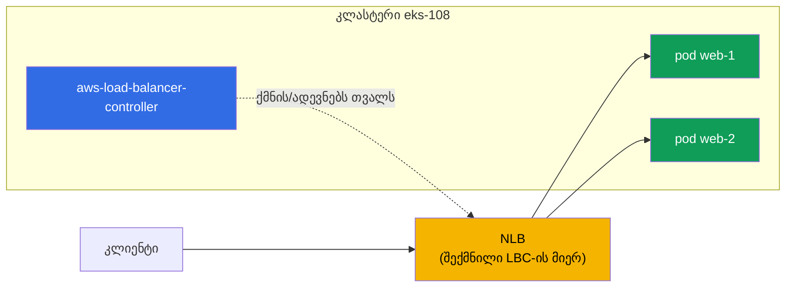
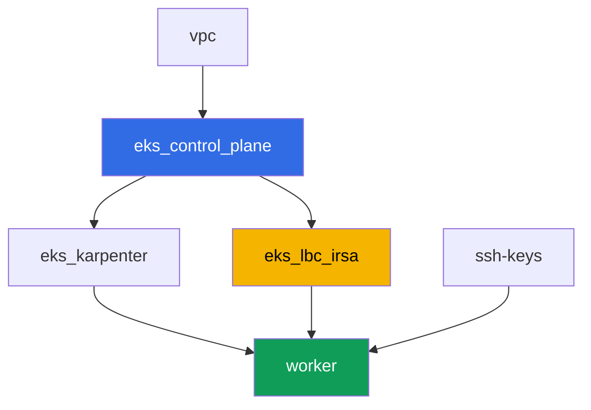

[Русская версия](README_RU.MD) · [Eng version](README.MD) · [Versión en español](README_ES.MD) · [Version française](README_FR.MD) · [Deutsche Version](README_DE.MD) · [繁體中文版](README_TW.MD) · [日本語版](README_JP.MD)

# ლაბა 108 - AWS Load Balancer Controller: NLB LoadBalancer ტიპის Service-ისთვის

## აღწერა

კურსის 5-ე ნაწილის პირველი ლაბა - ქსელი და ტრაფიკი. აქ თქვენ ავყენებთ AWS Load Balancer
Controller-ს (LBC) და გადამორთავთ LoadBalancer ტიპის Service-ის რეკონსილაციას
მოძველებული in-tree cloud provider-იდან თანამედროვე კონტროლერზე, რომელიც ქმნის Network
Load Balancer-ს (NLB) - L4-ბალანსერი, target-ებით პოდების IP-ებზე. თქვენ ხედავთ, როგორ
წყვეტს Service-ის ანოტაცია, რომელი კონტროლერი იღებს ობიექტს, როგორ ავირჩიოთ target-ის
ტიპი და წვდომის schema, და როგორ წაკითხოთ კონტროლერის ლოგები, რომ განასხვავოთ ნორმალური
რეკონსილაცია IAM-უფლებების არარსებობით გამოწვეული ჩავარდნისგან.

დავალებები დაწერილია production-სტილში: მოკლე დავალება პლუს მიღების კრიტერიუმები.
შემოწმება ავტომატურია, ბრძანებით `check_result`.

## მიზანი

გავამყაროთ კურსის შემდეგი თავის მასალა:

- [თავი 26. AWS Load Balancer Controller და LoadBalancer ტიპის Service: NLB](../../course/26/ru.md) - კონტროლერი, ანოტაციები, NLB vs CLB

## რას ვქმნით

კლასტერი უკვე დეპლოირებულია როგორც კოდი (control plane, Fargate სისტემური პოდებისთვის,
Karpenter დატვირთვისთვის). თქვენ ავყენებთ LBC-ს და მის გარშემო ქმნით დატვირთვასა და
Service-ს.

| ობიექტი | რა არის ეს | რისთვის ამ ლაბაში |
|--------|---------|-------------------|
| Namespace `eks-108` | კლასტერის სექცია ლაბის დატვირთვისთვის | ინახავს რესურსებს განცალკევებულად სისტემურებისგან |
| ServiceAccount `aws-load-balancer-controller` | SA `kube-system`-ში IRSA-როლით | აძლევს კონტროლერს წვდომას ELBv2 API-ზე |
| Deployment `aws-load-balancer-controller` | თავად კონტროლერი (Helm-chart `eks/aws-load-balancer-controller`) | ადევნებს თვალს Service/Ingress ობიექტებს და ქმნის ბალანსერებს |
| Deployment `web` (2 რეპლიკა) | ping_pong აპლიკაცია | დატვირთვა, რომელსაც ვაქვეყნებთ გარეთ |
| Service `web` (LoadBalancer) | Service ანოტაციებით `external`, `nlb-target-type: ip`, `scheme` | აიძულებს LBC-ს შექმნას NLB target-ებით პოდების IP-ებზე |
| არტეფაქტები `nlb.txt`, `targets.txt`, `reconcile.txt` | AWS CLI-ის output და ლოგების განმარტება | ვადასტურებთ ბალანსერის ტიპს, target-ის ტიპსა და IAM-პასუხისმგებლობის საზღვარს |

ტრაფიკის საბოლოო სურათი:



## ინფრასტრუქტურა

გარემო დეპლოირდება AWS-ში (`eu-central-1`) Terragrunt-ის მეშვეობით. ლაბის ყოველი
დირექტორია ერთი კომპონენტია საკუთარი `terragrunt.hcl`-ით, რომელიც მიმართავს საერთო
მოდულს `terraform/modules/`-ში და აცხადებს დამოკიდებულებებს `dependency` ბლოკებით.

### მოდულები და დამოკიდებულებები

| დირექტორია (კომპონენტი) | მოდული (`terraform/modules/`) | დამოკიდებულია | რას ქმნის |
|---------------------|-------------------------------|------------|-------------|
| `vpc` | `vpc_v3` | - | VPC `10.10.0.0/16`, ქვექსელები ორ AZ-ში, NAT |
| `ssh-keys` | `ssh-keys` | - | SSH-გასაღებების წყვილი სამუშაო მანქანისთვის |
| `eks_control_plane` | `eks_v2_control_plane` | `vpc` | EKS control plane `1.36`, OIDC-პროვაიდერი |
| `eks_fargate_system` | `eks_v2_fargate` | `vpc`, `eks_control_plane` | Fargate-პროფილი `kube-system`-ისთვის და `karpenter`-ისთვის |
| `eks_addons` | `eks_v2_addons` | `eks_control_plane`, `eks_fargate_system` | coredns, kube-proxy, vpc-cni, pod-identity |
| `eks_karpenter` | `eks_v2_karpenter` | `vpc`, `eks_control_plane`, `eks_addons`, `eks_fargate_system` | Karpenter-ის კონტროლერი, ნოუდების IAM-როლი |
| `eks_karpenter_default_vng` | `eks_v2_karpenter_vng` | `vpc`, `eks_control_plane`, `eks_karpenter` | ნაგულისხმევი NodePool AL2023-ზე |
| `eks_lbc_irsa` | `eks_v2_lbc_irsa` | `eks_control_plane` | IRSA IAM-როლი და პოლიტიკა AWS Load Balancer Controller-ისთვის |
| `worker` | `eks_v2_work_pc` | `ssh-keys`, `vpc`, `eks_control_plane`, `eks_karpenter`, `eks_lbc_irsa` | სამუშაო მანქანა kubectl-ით, ტესტებით და `check_result`-ით |

მოდული `eks_v2_lbc_irsa` ქმნის მხოლოდ IAM-როლს, რომელსაც ევალება კლასტერის
OIDC-პროვაიდერი (`sub`-პირობა
`system:serviceaccount:kube-system:aws-load-balancer-controller`-ზე), და პოლიტიკას
ELBv2/EC2 უფლებებით, რომლებიც კონტროლერს სჭირდება. თავად კონტროლერი არ არის EKS-ის
მართული add-on - მას სტუდენტი ხელით აყენებს Helm-ის მეშვეობით დავალება 2-ში.

დამოკიდებულებების გრაფი (რაც უფრო ადრე აპლიცირდება, ის ხრიხისკენ ქვემოთაა):



კომპონენტები `eks_fargate_system`, `eks_addons`, `eks_karpenter_default_vng` ზემოთ
გრაფში არ არის შეტანილი წაკითხვადობის გულისთვის (არა უმეტეს 8 კვანძისა) - ისინი
აპლიცირდებიან სტანდარტული თანმიმდევრობით `eks_control_plane`-სა და
`eks_karpenter`-ს შორის, როგორც ლაბა 101-ში.

### სად რა კონფიგურირდება

`env.hcl` (გარემოს საერთო პარამეტრები):

| პარამეტრი | მნიშვნელობა ლაბაში | რაზე ახდენს გავლენას |
|----------|-----------------|---------------|
| `region` | `eu-central-1` | ყველა რესურსის რეგიონი |
| `vpc_default_cidr`, `subnets` | `10.10.0.0/16`, ქვექსელები AZ-ების მიხედვით | VPC-ის მისამართების გეგმა, აქედან იღებს NLB-ის IP-target-ები |
| `prefix` | `eks-task108` | რესურსების სახელებისა და ტეგების პრეფიქსი |
| `stack_name` | `eks108` | მისგან იწყობა `env_name` - კლასტერის სახელი |
| `k8_version` | `1.36.0` | kubectl-ის ვერსია სამუშაო მანქანაზე |
| `instance_type_worker` | `t3.medium` | სამუშაო მანქანის instance-ის ტიპი |
| `ssh_password_enable`, `access_cidrs` | `true`, `0.0.0.0/0` | SSH-წვდომა სამუშაო მანქანაზე |

`inputs` თითოეული კომპონენტის `terragrunt.hcl`-ში:

| ფაილი | ძირითადი პარამეტრები |
|------|--------------------|
| `eks_control_plane/terragrunt.hcl` | `eks.version = "1.36"`, ქვექსელები control plane-ისთვის და ნოუდებისთვის |
| `eks_lbc_irsa/terragrunt.hcl` | `name` (კლასტერი) და `oidc_provider_arn` როლის trust-პოლიტიკისთვის |
| `eks_karpenter_default_vng/terragrunt.hcl` | NodePool-ის `requirements`, `disruption`, `budgets` |
| `worker/terragrunt.hcl` | `test_url`, `task_script_url` ლაბა 108-ის ფაილებზე; დამოკიდებულება `eks_lbc_irsa`-ზე |

## განლაგება

```bash
TASK=108 make run_eks_task
```

განლაგება გრძელდება დაახლოებით 15-20 წუთი. output-ში მოძებნეთ ხაზი SSH-შეერთებით
სამუშაო მანქანასთან და დაუკავშირდით მას. kubectl იქ უკვე კონფიგურირებულია საჭირო
კლასტერზე.

სასარგებლო ბრძანებები სამუშაო მანქანაზე:

```bash
time_left       # რამდენი დრო დარჩა გარემოს
check_result    # გადამოწმება
```

> სტენდის უსაფრთხოება. `env.hcl`-ში ჩართულია `ssh_password_enable = true` და
> `access_cidrs = ["0.0.0.0/0"]` - ეს მოსახერხებელია სასწავლო გარემოსთვის, მაგრამ ასე არ
> უნდა გავხადოთ production-ში. კურსის სტანდარტების მიხედვით (თავები 0.2, 2, 19) სამუშაო
> მანქანებზე წვდომა იხსნება AWS SSM Session Manager-ის მეშვეობით, საჯარო SSH-პორტების
> გარეთ გამოტანის გარეშე, ხოლო `access_cidrs` ვიწროვდება კონკრეტულ მისამართებზე. აქ
> საჯარო SSH დარჩენილია მხოლოდ გაშვების გასამარტივებლად.

## დავალებები

---
|        **1**        | **Namespace ლაბის დატვირთვისთვის**                             |
| :-----------------: | :---------------------------------------------------------- |
| რას ვაკეთებთ          | შექმენით namespace სახელით `eks-108`. ლაბის ყველა ობიექტი (გარდა კონტროლერისა და მისი ServiceAccount-ისა, რომლებიც ცხოვრობენ `kube-system`-ში) შექმნილია მის შიგნით. |
| მიღების კრიტერიუმები    | - namespace `eks-108` არსებობს. |
---
|        **2**        | **ServiceAccount და AWS Load Balancer Controller-ის ინსტალაცია**  |
| :-----------------: | :---------------------------------------------------------- |
| რას ვაკეთებთ          | იპოვეთ terraform-ის მიერ კონტროლერისთვის შექმნილი IAM-როლის ARN (როლის სახელი `<cluster-name>-lbc-irsa`), და შექმენით ServiceAccount `aws-load-balancer-controller` `kube-system`-ში ანოტაციით `eks.amazonaws.com/role-arn` ამ როლზე. შემდეგ ავყენოთ AWS Load Balancer Controller Helm-ის მეშვეობით (repository `https://aws.github.io/eks-charts`, chart `aws-load-balancer-controller`) ფლაგებით `--set serviceAccount.create=false --set serviceAccount.name=aws-load-balancer-controller`, `--set clusterName=<კლასტერის-სახელი>`, `--set region=eu-central-1` და `--set vpcId=<ლაბის-VPC-ID>`. ფლაგები `region`/`vpcId` სავალდებულოა: კონტროლერი მუშაობს Fargate-ზე (namespace `kube-system` Fargate-პროფილის ქვეშ), ხოლო Fargate-ზე არ არსებობს EC2 instance metadata - ამ ფლაგების გარეშე კონტროლერი ცდილობს VPC ID-ის დადგენას IMDS-ით და ვარდება `CrashLoopBackOff`-ში. VPC ID-ის მიღება შესაძლებელია `aws eks describe-cluster --name <cluster-name> --query 'cluster.resourcesVpcConfig.vpcId'`-ით. დაელოდეთ, სანამ Deployment `aws-load-balancer-controller` `kube-system`-ში გახდება `Running` (ყველა რეპლიკა Ready). |
| მიღების კრიტერიუმები    | - ServiceAccount `aws-load-balancer-controller` `kube-system`-ში, ანოტაციით როლზე `lbc-irsa`;<br/>- Deployment `aws-load-balancer-controller` `kube-system`-ში აქვს მინიმუმ ერთი მზა რეპლიკა. |
---
|        **3**        | **დატვირთვა გარეთ გამოსაქვეყნებლად**                           |
| :-----------------: | :---------------------------------------------------------- |
| რას ვაკეთებთ          | Namespace `eks-108`-ში შექმენით Deployment `web`, image `viktoruj/ping_pong:latest`, `2` რეპლიკა. დაელოდეთ, სანამ ორივე რეპლიკა გახდება Ready. |
| მიღების კრიტერიუმები    | - Deployment `web` `eks-108`-ში, image `viktoruj/ping_pong`;<br/>- `2` მზა რეპლიკა. |
---
|        **4**        | **Service LoadBalancer ტიპით: NLB Classic Load Balancer-ის ნაცვლად** |
| :-----------------: | :---------------------------------------------------------- |
| რას ვაკეთებთ          | შექმენით Service `web` ტიპით `LoadBalancer`, სელექტორით `app: web`, პორტით `80` `targetPort: 8080`-ზე, და სამი ანოტაციით: `service.beta.kubernetes.io/aws-load-balancer-type: external` (გადასცემს რეკონსილაციას LBC-ს in-tree provider-ის ნაცვლად, რომელიც შექმნიდა მოძველებულ Classic Load Balancer-ს), `service.beta.kubernetes.io/aws-load-balancer-nlb-target-type: ip`, `service.beta.kubernetes.io/aws-load-balancer-scheme: internet-facing`. დაელოდეთ გარეთა მისამართს (`kubectl get svc web -n eks-108 -w`). `aws elbv2 describe-load-balancers`-ის მეშვეობით დაადასტურეთ, რომ შექმნილია ბალანსერი `Type: network`-ით (NLB, არა `classic`) და `Scheme: internet-facing`-ით, და შეინახეთ output ფაილში `/var/work/tests/artifacts/4/nlb.txt`. |
| მიღების კრიტერიუმები    | - Service `web` `eks-108`-ში სამი ანოტაციითა და გარეთა მისამართით (`status.loadBalancer.ingress[0].hostname`);<br/>- ფაილი `nlb.txt` არ არის ცარიელი და შეიცავს `network`-ს და `internet-facing`-ს. |
---
|        **5**        | **Target-ების შემოწმება: პოდების IP, არა ნოუდების ID**                 |
| :-----------------: | :---------------------------------------------------------- |
| რას ვაკეთებთ          | `aws elbv2 describe-target-groups`-ის მეშვეობით იპოვეთ შექმნილი NLB-ის target group, შემდეგ `aws elbv2 describe-target-health`-ით გადახედეთ target-ების სიას. შეინახეთ ორივე output ფაილში `/var/work/tests/artifacts/5/targets.txt`. დარწმუნდით, რომ `TargetType` ტოლია `ip`-ის, ხოლო target-ების იდენტიფიკატორები არის IP-მისამართები `10.10.0.0/16`-დან (პოდების მისამართები), არა `i-...` (ნოუდების instance ID). |
| მიღების კრიტერიუმები    | - ფაილი `targets.txt` არ არის ცარიელი;<br/>- შეიცავს `"TargetType": "ip"`-ს და მინიმუმ ერთ target-ს მისამართით `10.10.0.0/16`-დან;<br/>- არ შეიცავს target-ებს `i-...` ფორმის. |
---
|        **6**        | **დიაგნოსტიკა: წარმატებული რეკონსილაცია AccessDenied-ის წინააღმდეგ**  |
| :-----------------: | :---------------------------------------------------------- |
| რას ვაკეთებთ          | გადახედეთ კონტროლერის ლოგს (`kubectl logs -n kube-system deploy/aws-load-balancer-controller`) და იპოვეთ Service `web`-ის წარმატებული რეკონსილაციის ხაზები - მათში გვხვდება შექმნილი ბალანსერის ARN (`arn:aws:elasticloadbalancing:...`). არტეფაქტში `/var/work/tests/artifacts/6/reconcile.txt` აღწერეთ ორივე სიტუაცია: როგორ გამოიყურება ნორმალური რეკონსილაცია (ამ ARN-ით) და როგორ გამოიყურებოდა შეცდომა IAM-უფლებების არარსებობის შემთხვევაში - `AccessDenied` შეტყობინება `elasticloadbalancing:CreateLoadBalancer`-ის გამოძახებაზე, რის გამოც Service დარჩებოდა გარეთა მისამართის გარეშე. |
| მიღების კრიტერიუმები    | - ფაილი `reconcile.txt` არ არის ცარიელი;<br/>- შეიცავს ხაზს `arn:aws:elasticloadbalancing`-ით (წარმატებული რეკონსილაციის რეალური ლოგი);<br/>- შეიცავს სიტყვას `AccessDenied` (უფლებების არარსებობის შემთხვევაში მოსალოდნელი სიმპტომის აღწერა). |
---

## შედეგის შემოწმება

სამუშაო მანქანაზე გაუშვით ავტომატური შემოწმება:

```bash
check_result
```

სკრიპტი გაუშვებს ტესტებს და გამოაჩენს შესრულებული დავალებების პროცენტს.

## გადაწყვეტა

ეტალონური გადაწყვეტა: [worker/files/solutions/1_GE.MD](worker/files/solutions/1_GE.MD)

## კლასტერისა და რესურსების წაშლა

> წაშლის წინ. Service `web` ტიპით `LoadBalancer` დავალება 4-იდან შექმნა რეალური NLB და
> ორი security group პირდაპირ ELBv2/EC2 API-ის მეშვეობით (AWS Load Balancer Controller),
> არა terraform - state-ს მათზე არაფერი ცოდნია. მათი მოხსნის სწორი გზაა Service-ის
> წაშლა და LBC-სთვის თავად AWS API-ის გამოძახების მიცემა მოსახსნელად (finalizer
> Service-ზე არ დაშლის ობიექტს etcd-დან, სანამ LBC არ დაადასტურებს, რომ NLB და ორივე SG
> რეალურად მოხსნილია) - ეს უფრო საიმედო და მარტივია, ვიდრე NLB/SG-ის ხელით გასუფთავება
> AWS CLI-ის მეშვეობით:
>
> ```bash
> kubectl delete svc web -n eks-108
> # ველოდებით, სანამ finalizer მოხსნის - ეს ნიშნავს "LBC-მ წაშალა NLB და SG"
> kubectl wait --for=delete svc/web -n eks-108 --timeout=120s
> ```
>
> აუცილებლად გააკეთეთ ეს `terragrunt destroy`-მდე. თუ control plane უკვე
> წაშლილია Service-ზე ადრე (LBC-ს არ შეუძლია finalizer-ის შესრულება), NLB და მისი SG
> დარჩება მიმტოვებული და დაიჭერს ENI-ებს საჯარო ქვექსელებში - VPC და Internet Gateway
> სამუდამოდ დარჩება `Still destroying...`-ზე. ამ შემთხვევაში LBC უკვე არ დაგვეხმარება,
> და რჩება მხოლოდ ხელით გასუფთავება AWS CLI-ის მეშვეობით:
>
> ```bash
> VPC_ID=<ამ-ლაბის-VPC-ID>
> LB_ARN=$(aws elbv2 describe-load-balancers \
>   --query "LoadBalancers[?contains(LoadBalancerName,'eks108')].LoadBalancerArn" --output text)
> aws elbv2 delete-load-balancer --load-balancer-arn "$LB_ARN"
> # დაელოდეთ, სანამ ENI-ები ქვექსელებში გათავისუფლდება, შემდეგ წაშალეთ დარჩენილი SG-ები:
> aws ec2 describe-security-groups --filters "Name=vpc-id,Values=$VPC_ID" \
>   --query "SecurityGroups[?GroupName!='default'].GroupId" --output text | \
>   xargs -n1 aws ec2 delete-security-group --group-id
> ```

```bash
TASK=108 make delete_eks_task
```
