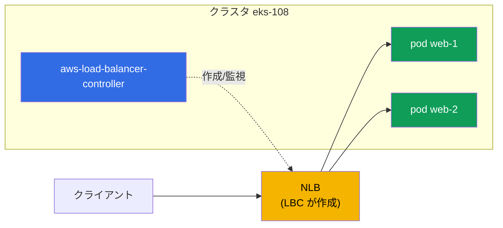
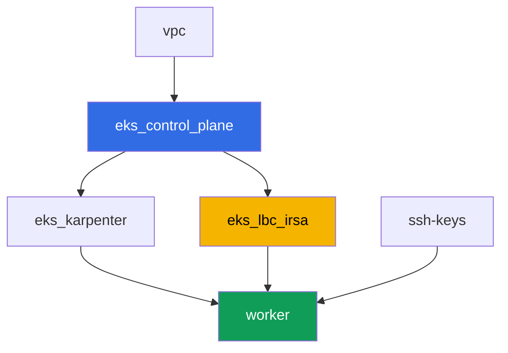

[Русская версия](README_RU.MD) · [Eng version](README.MD) · [Versión en español](README_ES.MD) · [Version française](README_FR.MD) · [Deutsche Version](README_DE.MD) · [ქართული ვერსია](README_GE.MD) · [繁體中文版](README_TW.MD)

# ラボ 108 - AWS Load Balancer Controller:LoadBalancer タイプの Service 用の NLB

## 説明

コースのパート 5(ネットワークとトラフィック)の最初のラボです。ここでは AWS Load
Balancer Controller(LBC)をインストールし、LoadBalancer タイプの Service の
リコンサイルを、古い in-tree cloud provider から、Pod の IP をターゲットとする
Network Load Balancer(NLB、L4 ロードバランサー)を作成する現代的なコントローラへ
切り替えます。Service のアノテーションがどのコントローラがオブジェクトを引き受ける
かを決めること、ターゲットタイプとアクセススキームの選び方、そして正常なリコンサイル
と IAM 権限不足による失敗をコントローラのログから見分ける方法を学びます。

タスクは production スタイルで書かれています:短い課題文とアクセプタンス基準。検証は
`check_result` コマンドによって自動的に行われます。

## 目的

コースの以下の章の内容を定着させます:

- [第 26 章。AWS Load Balancer Controller と LoadBalancer タイプの Service:NLB](../../course/26/jp.md) - コントローラ、アノテーション、NLB 対 CLB

## 作成するもの

クラスタは既にコードとしてデプロイされています(control plane、システム Pod 用の
Fargate、ワークロード用の Karpenter)。あなたは LBC をインストールし、その周りに
ワークロードと Service を構築します。

| オブジェクト | 何か | このラボでの目的 |
|--------|---------|-------------------|
| Namespace `eks-108` | ラボのワークロード用のクラスタ区画 | システムのリソースと分離する |
| ServiceAccount `aws-load-balancer-controller` | `kube-system` にある IRSA ロール付きの SA | コントローラに ELBv2 API へのアクセス権を与える |
| Deployment `aws-load-balancer-controller` | コントローラ本体(Helm chart `eks/aws-load-balancer-controller`) | Service/Ingress オブジェクトを監視し、ロードバランサーを作成する |
| Deployment `web`(2 レプリカ) | ping_pong アプリケーション | 外部に公開するワークロード |
| Service `web`(LoadBalancer) | `external`、`nlb-target-type: ip`、`scheme` アノテーション付きの Service | LBC に Pod IP をターゲットとする NLB を作成させる |
| アーティファクト `nlb.txt`、`targets.txt`、`reconcile.txt` | AWS CLI の出力とログの説明 | ロードバランサーのタイプ、ターゲットタイプ、IAM の責任境界を確認する |

最終的なトラフィックの構成図:



## インフラストラクチャ

環境は Terragrunt によって AWS(`eu-central-1`)にデプロイされます。ラボの各ディレクト
リは 1 つのコンポーネントであり、それぞれ独自の `terragrunt.hcl` を持ち、
`terraform/modules/` の共有モジュールを参照し、`dependency` ブロックで依存関係を宣言
します。

### モジュールと依存関係

| ディレクトリ(コンポーネント) | モジュール(`terraform/modules/`) | 依存先 | 作成されるもの |
|---------------------|-------------------------------|------------|-------------|
| `vpc` | `vpc_v3` | - | VPC `10.10.0.0/16`、2 つの AZ にあるサブネット、NAT |
| `ssh-keys` | `ssh-keys` | - | ワーカーマシン用の SSH キーペア |
| `eks_control_plane` | `eks_v2_control_plane` | `vpc` | EKS control plane `1.36`、OIDC プロバイダ |
| `eks_fargate_system` | `eks_v2_fargate` | `vpc`、`eks_control_plane` | `kube-system` と `karpenter` 用の Fargate profile |
| `eks_addons` | `eks_v2_addons` | `eks_control_plane`、`eks_fargate_system` | coredns、kube-proxy、vpc-cni、pod-identity |
| `eks_karpenter` | `eks_v2_karpenter` | `vpc`、`eks_control_plane`、`eks_addons`、`eks_fargate_system` | Karpenter コントローラ、ノードの IAM ロール |
| `eks_karpenter_default_vng` | `eks_v2_karpenter_vng` | `vpc`、`eks_control_plane`、`eks_karpenter` | AL2023 上のデフォルト NodePool |
| `eks_lbc_irsa` | `eks_v2_lbc_irsa` | `eks_control_plane` | AWS Load Balancer Controller 用の IRSA IAM ロールとポリシー |
| `worker` | `eks_v2_work_pc` | `ssh-keys`、`vpc`、`eks_control_plane`、`eks_karpenter`、`eks_lbc_irsa` | kubectl、テスト、`check_result` を備えたワーカーマシン |

`eks_v2_lbc_irsa` モジュールは、クラスタの OIDC プロバイダを信頼する IAM ロール
(`system:serviceaccount:kube-system:aws-load-balancer-controller` に対する `sub`
条件)と、コントローラに必要な ELBv2/EC2 権限を持つポリシーのみを作成します。
コントローラ自体は EKS のマネージドアドオンではなく、タスク 2 で学生が Helm を通じて
手動でインストールします。

依存関係グラフ(先に適用されるものほど矢印の下側にある):



コンポーネント `eks_fargate_system`、`eks_addons`、`eks_karpenter_default_vng` は
見やすさのため上記のグラフには含まれていません(ノード数を 8 個以内に収めるため) -
これらはラボ 101 と同様に、`eks_control_plane` と `eks_karpenter` の間で標準的な順序
で適用されます。

### どこで何が設定されるか

`env.hcl`(共通の環境パラメータ):

| パラメータ | ラボでの値 | 影響範囲 |
|----------|-----------------|---------------|
| `region` | `eu-central-1` | すべてのリソースのリージョン |
| `vpc_default_cidr`、`subnets` | `10.10.0.0/16`、AZ ごとのサブネット | VPC のアドレス計画、NLB の IP ターゲットの出どころ |
| `prefix` | `eks-task108` | リソース名とタグのプレフィックス |
| `stack_name` | `eks108` | ここから `env_name`(クラスタ名)が組み立てられる |
| `k8_version` | `1.36.0` | ワーカーマシン上の kubectl のバージョン |
| `instance_type_worker` | `t3.medium` | ワーカーマシンのインスタンスタイプ |
| `ssh_password_enable`、`access_cidrs` | `true`、`0.0.0.0/0` | ワーカーマシンへの SSH アクセス |

各コンポーネントの `terragrunt.hcl` の `inputs`:

| ファイル | 主な設定 |
|------|--------------------|
| `eks_control_plane/terragrunt.hcl` | `eks.version = "1.36"`、control plane とノード用のサブネット |
| `eks_lbc_irsa/terragrunt.hcl` | ロールの信頼ポリシー用の `name`(クラスタ)と `oidc_provider_arn` |
| `eks_karpenter_default_vng/terragrunt.hcl` | NodePool の `requirements`、`disruption`、`budgets` |
| `worker/terragrunt.hcl` | ラボ 108 のファイルを指す `test_url` と `task_script_url`;`eks_lbc_irsa` への依存 |

## デプロイ

```bash
TASK=108 make run_eks_task
```

デプロイには約 15-20 分かかります。出力の中からワーカーマシンへの SSH 接続の行を見つけ
て接続してください。そこでは kubectl が既に正しいクラスタ向けに設定されています。

ワーカーマシン上で使える便利なコマンド:

```bash
time_left       # 環境の残り時間
check_result    # 解答の確認
```

> 検証環境のセキュリティについて。`env.hcl` では `ssh_password_enable = true` と
> `access_cidrs = ["0.0.0.0/0"]` が有効になっています。学習用環境としては便利ですが、
> 本番環境ではこのようにしてはいけません。コースの標準(第 0.2、2、19 章)によれば、
> ワーカーマシンへのアクセスは公開 SSH ポートを外に出さずに AWS SSM Session Manager を
> 経由して開き、`access_cidrs` は具体的なアドレスに絞り込みます。ここでは、セットアップ
> を簡単にするためだけに公開 SSH を残しています。

## タスク

---
|        **1**        | **ラボのワークロード用の Namespace**                             |
| :-----------------: | :---------------------------------------------------------- |
| やること          | `eks-108` という名前の namespace を作成してください。ラボのすべてのオブジェクト(`kube-system` に存在するコントローラとその ServiceAccount を除く)はこの中に作成されます。 |
| アクセプタンス基準    | - namespace `eks-108` が存在する。 |
---
|        **2**        | **ServiceAccount と AWS Load Balancer Controller のインストール**  |
| :-----------------: | :---------------------------------------------------------- |
| やること          | terraform がコントローラ用に作成した IAM ロールの ARN(ロール名 `<cluster-name>-lbc-irsa`)を見つけ、そのロールを指すアノテーション `eks.amazonaws.com/role-arn` を付けて `kube-system` に ServiceAccount `aws-load-balancer-controller` を作成してください。続いて Helm(リポジトリ `https://aws.github.io/eks-charts`、chart `aws-load-balancer-controller`)で AWS Load Balancer Controller を、フラグ `--set serviceAccount.create=false --set serviceAccount.name=aws-load-balancer-controller`、`--set clusterName=<クラスタ名>`、`--set region=eu-central-1`、`--set vpcId=<ラボの-VPC-ID>` を付けてインストールしてください。`region`/`vpcId` フラグは必須です:コントローラは Fargate 上で動作し(namespace `kube-system` は Fargate profile の下にあります)、Fargate には EC2 instance metadata が存在しないため、これらのフラグがないとコントローラは IMDS で VPC ID を取得しようとして `CrashLoopBackOff` に陥ります。VPC ID は `aws eks describe-cluster --name <cluster-name> --query 'cluster.resourcesVpcConfig.vpcId'` で取得できます。`kube-system` の Deployment `aws-load-balancer-controller` が `Running`(すべてのレプリカが Ready)になるまで待ってください。 |
| アクセプタンス基準    | - `kube-system` に ServiceAccount `aws-load-balancer-controller`、`lbc-irsa` ロールを指すアノテーション付き;<br/>- `kube-system` の Deployment `aws-load-balancer-controller` に少なくとも 1 つの Ready なレプリカがある。 |
---
|        **3**        | **外部公開用のワークロード**                           |
| :-----------------: | :---------------------------------------------------------- |
| やること          | namespace `eks-108` に Deployment `web` を作成してください。イメージは `viktoruj/ping_pong:latest`、レプリカ数は `2` です。両方のレプリカが Ready になるまで待ってください。 |
| アクセプタンス基準    | - `eks-108` に Deployment `web`、イメージ `viktoruj/ping_pong`;<br/>- `2` 個の Ready なレプリカ。 |
---
|        **4**        | **LoadBalancer タイプの Service:CLB ではなく NLB** |
| :-----------------: | :---------------------------------------------------------- |
| やること          | セレクタ `app: web`、ポート `80` から `targetPort: 8080`、そして 3 つのアノテーション:`service.beta.kubernetes.io/aws-load-balancer-type: external`(リコンサイルを in-tree provider ではなく LBC に渡す。そうでなければ古い Classic Load Balancer が作成される)、`service.beta.kubernetes.io/aws-load-balancer-nlb-target-type: ip`、`service.beta.kubernetes.io/aws-load-balancer-scheme: internet-facing` を持つ、`LoadBalancer` タイプの Service `web` を作成してください。外部アドレスを待ちます(`kubectl get svc web -n eks-108 -w`)。`aws elbv2 describe-load-balancers` で、`Type: network`(NLB、`classic` ではない)、`Scheme: internet-facing` のロードバランサーが作成されたことを確認し、その出力を `/var/work/tests/artifacts/4/nlb.txt` に保存してください。 |
| アクセプタンス基準    | - `eks-108` に 3 つのアノテーションと外部アドレス(`status.loadBalancer.ingress[0].hostname`)を持つ Service `web`;<br/>- ファイル `nlb.txt` が空でなく、`network` と `internet-facing` を含む。 |
---
|        **5**        | **ターゲットの確認:ノードの instance ID ではなく Pod の IP**                 |
| :-----------------: | :---------------------------------------------------------- |
| やること          | `aws elbv2 describe-target-groups` で作成された NLB のターゲットグループを見つけ、`aws elbv2 describe-target-health` でターゲットの一覧を確認してください。両方の出力を `/var/work/tests/artifacts/5/targets.txt` に保存してください。`TargetType` が `ip` であること、そしてターゲットの識別子が `10.10.0.0/16`(Pod のアドレス)からのアドレスであり、`i-...`(ノードの instance ID)ではないことを確認してください。 |
| アクセプタンス基準    | - ファイル `targets.txt` が空でない;<br/>- `"TargetType": "ip"` と、`10.10.0.0/16` からのアドレスを持つターゲットが少なくとも 1 つ含まれている;<br/>- `i-...` 形式のターゲットが含まれていない。 |
---
|        **6**        | **診断:成功したリコンサイルと AccessDenied**  |
| :-----------------: | :---------------------------------------------------------- |
| やること          | コントローラのログ(`kubectl logs -n kube-system deploy/aws-load-balancer-controller`)を見て、Service `web` の成功したリコンサイルの行を見つけてください - そこには作成されたロードバランサーの ARN(`arn:aws:elasticloadbalancing:...`)が含まれます。アーティファクト `/var/work/tests/artifacts/6/reconcile.txt` に両方の状況を記述してください:正常なリコンサイルがどのように見えるか(その ARN を含む)、そして IAM 権限が不足している場合のエラーがどのように見えるか - `elasticloadbalancing:CreateLoadBalancer` 呼び出しに対する `AccessDenied` メッセージで、Service が外部アドレスを持たないまま残るというものです。 |
| アクセプタンス基準    | - ファイル `reconcile.txt` が空でない;<br/>- `arn:aws:elasticloadbalancing` を含む行がある(成功したリコンサイルの実際のログ);<br/>- `AccessDenied` という単語が含まれている(権限不足時に想定される症状の説明)。 |
---

## 結果の確認

ワーカーマシン上で自動チェックを実行してください:

```bash
check_result
```

スクリプトがテストを実行し、完了したタスクの割合を表示します。

## 解答

参考解答:[worker/files/solutions/1_JP.MD](worker/files/solutions/1_JP.MD)

## クラスタとリソースの削除

> 削除の前に。タスク 4 の `LoadBalancer` タイプの Service `web` は、terraform ではなく
> ELBv2/EC2 API(AWS Load Balancer Controller)を通じて直接、実際の NLB と 2 つの
> security group を作成しました - state はそれらについて何も知りません。それらを
> 正しく取り除く方法は、Service を削除し、LBC 自身に AWS API を呼び出させて削除させる
> ことです(Service 上の finalizer は、LBC が NLB と両方の SG が本当に削除されたことを
> 確認するまで、オブジェクトが etcd から削除されるのを防ぎます) - これは AWS CLI で
> 手動で NLB/SG を片付けるよりも確実で簡単です:
>
> ```bash
> kubectl delete svc web -n eks-108
> # finalizer が外れるのを待つ - これが「LBC が NLB と SG を削除した」ことを意味する
> kubectl wait --for=delete svc/web -n eks-108 --timeout=120s
> ```
>
> これは必ず `terragrunt destroy` の前に行ってください。もし Service より先に control
> plane が削除されてしまうと(LBC はもう finalizer を実行できません)、NLB とその SG
> は孤立したまま残り、パブリックサブネットの ENI を保持し続けます - VPC と Internet
> Gateway は永遠に `Still destroying...` のまま止まってしまいます。この場合 LBC は
> もう助けにならず、AWS CLI での手動クリーンアップしか残っていません:
>
> ```bash
> VPC_ID=<このラボの-VPC-ID>
> LB_ARN=$(aws elbv2 describe-load-balancers \
>   --query "LoadBalancers[?contains(LoadBalancerName,'eks108')].LoadBalancerArn" --output text)
> aws elbv2 delete-load-balancer --load-balancer-arn "$LB_ARN"
> # サブネット内の ENI が解放されるのを待ち、残っている SG を削除する:
> aws ec2 describe-security-groups --filters "Name=vpc-id,Values=$VPC_ID" \
>   --query "SecurityGroups[?GroupName!='default'].GroupId" --output text | \
>   xargs -n1 aws ec2 delete-security-group --group-id
> ```

```bash
TASK=108 make delete_eks_task
```
