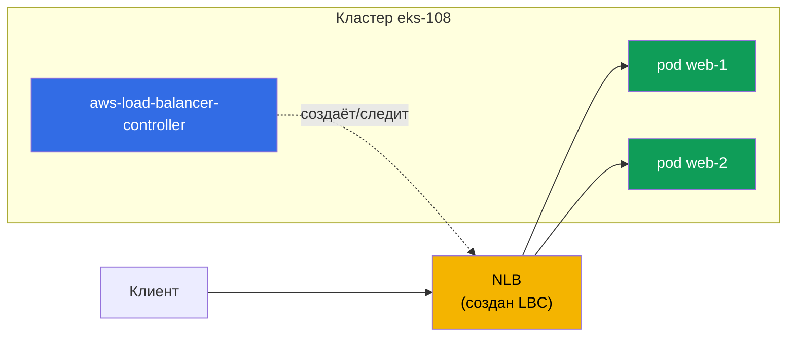
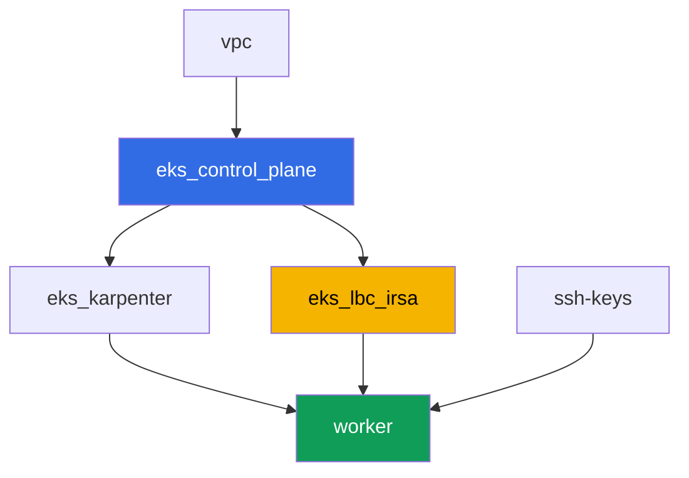

[Eng version](README.MD) · [Versión en español](README_ES.MD) · [Version française](README_FR.MD) · [Deutsche Version](README_DE.MD) · [ქართული ვერსია](README_GE.MD) · [繁體中文版](README_TW.MD) · [日本語版](README_JP.MD)

# Лаба 108 - AWS Load Balancer Controller: NLB для Service типа LoadBalancer

## Описание

Первая лаба Части 5 курса - про сеть и трафик. Здесь вы ставите AWS Load Balancer
Controller (LBC) и переключаете реконсиляцию Service типа LoadBalancer с устаревшего
in-tree cloud provider на современный контроллер, который создаёт Network Load Balancer
(NLB) - L4-балансировщик с таргетами на IP подов. Вы увидите, как аннотация Service решает,
какой контроллер забирает объект, как выбрать тип таргетов и схему доступа, и как читать
логи контроллера, чтобы отличить нормальную реконсиляцию от отказа по правам IAM.

Задания в продакшн-стиле: короткая постановка плюс критерии приёмки. Проверка -
автоматическая, командой `check_result`.

## Цель

Закрепить материал главы курса:

- [Глава 26. AWS Load Balancer Controller и Service типа LoadBalancer: NLB](../../course/26/ru.md) - контроллер, аннотации, NLB против CLB

## Что мы создаём

Кластер уже развёрнут как код (control plane, Fargate под системные поды, Karpenter под
нагрузку). Вы ставите LBC и создаёте вокруг него нагрузку и Service.

| Объект | Что это | Зачем в этой лабе |
|--------|---------|-------------------|
| Namespace `eks-108` | раздел кластера под нагрузку лабы | держим ресурсы отдельно от системных |
| ServiceAccount `aws-load-balancer-controller` | SA в `kube-system` с ролью IRSA | даёт контроллеру права на ELBv2 API |
| Deployment `aws-load-balancer-controller` | сам контроллер (Helm-чарт `eks/aws-load-balancer-controller`) | следит за Service/Ingress и создаёт балансировщики |
| Deployment `web` (2 реплики) | приложение ping_pong | нагрузка, которую публикуем наружу |
| Service `web` (LoadBalancer) | Service с аннотациями `external`, `nlb-target-type: ip`, `scheme` | заставляет LBC создать NLB с таргетами на IP подов |
| Артефакты `nlb.txt`, `targets.txt`, `reconcile.txt` | вывод AWS CLI и объяснение логов | подтверждаем тип балансировщика, тип таргетов и границу ответственности IAM |

Итоговая картина трафика:



## Инфраструктура

Окружение разворачивается в AWS (`eu-central-1`) через Terragrunt. Каждый каталог лабы -
это один компонент со своим `terragrunt.hcl`, который ссылается на общий модуль в
`terraform/modules/` и объявляет зависимости через блоки `dependency`.

### Модули и зависимости

| Каталог (компонент) | Модуль (`terraform/modules/`) | Зависит от | Что создаёт |
|---------------------|-------------------------------|------------|-------------|
| `vpc` | `vpc_v3` | - | VPC `10.10.0.0/16`, подсети в двух AZ, NAT |
| `ssh-keys` | `ssh-keys` | - | пара SSH-ключей для рабочей машины |
| `eks_control_plane` | `eks_v2_control_plane` | `vpc` | control plane EKS `1.36`, OIDC-провайдер |
| `eks_fargate_system` | `eks_v2_fargate` | `vpc`, `eks_control_plane` | Fargate-профиль для `kube-system` и `karpenter` |
| `eks_addons` | `eks_v2_addons` | `eks_control_plane`, `eks_fargate_system` | coredns, kube-proxy, vpc-cni, pod-identity |
| `eks_karpenter` | `eks_v2_karpenter` | `vpc`, `eks_control_plane`, `eks_addons`, `eks_fargate_system` | контроллер Karpenter, IAM-роль нод |
| `eks_karpenter_default_vng` | `eks_v2_karpenter_vng` | `vpc`, `eks_control_plane`, `eks_karpenter` | дефолтный NodePool на AL2023 |
| `eks_lbc_irsa` | `eks_v2_lbc_irsa` | `eks_control_plane` | IAM-роль IRSA и политика для AWS Load Balancer Controller |
| `worker` | `eks_v2_work_pc` | `ssh-keys`, `vpc`, `eks_control_plane`, `eks_karpenter`, `eks_lbc_irsa` | рабочая машина с kubectl, тестами и `check_result` |

Модуль `eks_v2_lbc_irsa` создаёт только IAM-роль с доверием OIDC-провайдеру кластера
(условие `sub` на `system:serviceaccount:kube-system:aws-load-balancer-controller`) и
политику с разрешениями ELBv2/EC2, нужными контроллеру. Сам контроллер - не managed addon
EKS, его ставит студент вручную через Helm в задании 2.

Граф зависимостей (что применяется раньше, то ниже по стрелке):



Компоненты `eks_fargate_system`, `eks_addons`, `eks_karpenter_default_vng` в граф выше не
включены ради читаемости (не больше 8 узлов) - они применяются в стандартном порядке
между `eks_control_plane` и `eks_karpenter`, как в лабе 101.

### Где что настраивается

`env.hcl` (общие параметры окружения):

| Параметр | Значение в лабе | На что влияет |
|----------|-----------------|---------------|
| `region` | `eu-central-1` | регион всех ресурсов |
| `vpc_default_cidr`, `subnets` | `10.10.0.0/16`, подсети по AZ | адресный план VPC, из него берут IP таргеты NLB |
| `prefix` | `eks-task108` | префикс имён ресурсов и тегов |
| `stack_name` | `eks108` | из него собирается `env_name` - имя кластера |
| `k8_version` | `1.36.0` | версия kubectl на рабочей машине |
| `instance_type_worker` | `t3.medium` | тип инстанса рабочей машины |
| `ssh_password_enable`, `access_cidrs` | `true`, `0.0.0.0/0` | доступ по SSH к рабочей машине |

`inputs` в `terragrunt.hcl` каждого компонента:

| Файл | Ключевые настройки |
|------|--------------------|
| `eks_control_plane/terragrunt.hcl` | `eks.version = "1.36"`, подсети под control plane и ноды |
| `eks_lbc_irsa/terragrunt.hcl` | `name` (кластер) и `oidc_provider_arn` для доверительной политики роли |
| `eks_karpenter_default_vng/terragrunt.hcl` | `requirements` NodePool, `disruption`, `budgets` |
| `worker/terragrunt.hcl` | `test_url`, `task_script_url` на файлы лабы 108; зависимость от `eks_lbc_irsa` |

## Развёртывание

```bash
TASK=108 make run_eks_task
```

Развёртывание занимает примерно 15-20 минут. В выводе найдите строку с SSH-подключением к
рабочей машине и подключитесь к ней. kubectl там уже настроен на нужный кластер.

Полезные команды на рабочей машине:

```bash
time_left       # сколько осталось времени окружения
check_result    # проверить решение
```

> Безопасность стенда. В `env.hcl` включены `ssh_password_enable = true` и
> `access_cidrs = ["0.0.0.0/0"]` - это удобно для учебного окружения, но так делать в
> продакшене нельзя. По стандартам курса (главы 0.2, 2, 19) доступ к рабочим машинам
> открывают через AWS SSM Session Manager без публичных SSH-портов наружу, а `access_cidrs`
> сужают до конкретных адресов. Здесь публичный SSH оставлен только ради простоты запуска.

## Задания

---
|        **1**        | **Namespace для нагрузки лабы**                             |
| :-----------------: | :---------------------------------------------------------- |
| Что делаем          | Создайте namespace с именем `eks-108`. Все объекты лабы (кроме контроллера и его ServiceAccount, которые живут в `kube-system`) создаются внутри него. |
| Критерии приёмки    | - namespace `eks-108` существует. |
---
|        **2**        | **ServiceAccount и установка AWS Load Balancer Controller**  |
| :-----------------: | :---------------------------------------------------------- |
| Что делаем          | Найдите ARN IAM-роли, созданной terraform для контроллера (имя роли `<cluster-name>-lbc-irsa`), и создайте ServiceAccount `aws-load-balancer-controller` в `kube-system` с аннотацией `eks.amazonaws.com/role-arn` на эту роль. Затем поставьте AWS Load Balancer Controller через Helm (репозиторий `https://aws.github.io/eks-charts`, чарт `aws-load-balancer-controller`) с флагами `--set serviceAccount.create=false --set serviceAccount.name=aws-load-balancer-controller`, `--set clusterName=<имя кластера>`, `--set region=eu-central-1` и `--set vpcId=<ID VPC лабы>`. Флаги `region`/`vpcId` обязательны: контроллер работает на Fargate (namespace `kube-system` под Fargate-профилем), а на Fargate нет EC2 instance metadata - без этих флагов контроллер пытается определить VPC ID через IMDS и падает в `CrashLoopBackOff`. VPC ID можно получить через `aws eks describe-cluster --name <cluster-name> --query 'cluster.resourcesVpcConfig.vpcId'`. Дождитесь, пока Deployment `aws-load-balancer-controller` в `kube-system` станет `Running` (все реплики Ready). |
| Критерии приёмки    | - ServiceAccount `aws-load-balancer-controller` в `kube-system` с аннотацией на роль `lbc-irsa`;<br/>- Deployment `aws-load-balancer-controller` в `kube-system` имеет хотя бы одну готовую реплику. |
---
|        **3**        | **Нагрузка для публикации наружу**                           |
| :-----------------: | :---------------------------------------------------------- |
| Что делаем          | В namespace `eks-108` создайте Deployment `web`, образ `viktoruj/ping_pong:latest`, `2` реплики. Дождитесь, пока обе реплики станут Ready. |
| Критерии приёмки    | - Deployment `web` в `eks-108`, образ `viktoruj/ping_pong`;<br/>- `2` готовые реплики. |
---
|        **4**        | **Service типа LoadBalancer: NLB вместо Classic Load Balancer** |
| :-----------------: | :---------------------------------------------------------- |
| Что делаем          | Создайте Service `web` типа `LoadBalancer` с селектором `app: web`, портом `80` на `targetPort: 8080`, и тремя аннотациями: `service.beta.kubernetes.io/aws-load-balancer-type: external` (передаёт реконсиляцию LBC вместо in-tree provider, который создал бы устаревший Classic Load Balancer), `service.beta.kubernetes.io/aws-load-balancer-nlb-target-type: ip`, `service.beta.kubernetes.io/aws-load-balancer-scheme: internet-facing`. Дождитесь внешнего адреса (`kubectl get svc web -n eks-108 -w`). Через `aws elbv2 describe-load-balancers` подтвердите, что создан балансировщик `Type: network` (NLB, не `classic`) со `Scheme: internet-facing`, и сохраните вывод в `/var/work/tests/artifacts/4/nlb.txt`. |
| Критерии приёмки    | - Service `web` в `eks-108` с тремя аннотациями и внешним адресом (`status.loadBalancer.ingress[0].hostname`);<br/>- файл `nlb.txt` не пуст и содержит `network` и `internet-facing`. |
---
|        **5**        | **Проверка таргетов: IP подов, а не ID нод**                 |
| :-----------------: | :---------------------------------------------------------- |
| Что делаем          | Через `aws elbv2 describe-target-groups` найдите target group созданного NLB, затем через `aws elbv2 describe-target-health` посмотрите список таргетов. Сохраните оба вывода в `/var/work/tests/artifacts/5/targets.txt`. Убедитесь, что `TargetType` равен `ip`, а идентификаторы таргетов - это IP-адреса из `10.10.0.0/16` (адреса подов), а не `i-...` (ID инстансов нод). |
| Критерии приёмки    | - файл `targets.txt` не пуст;<br/>- содержит `"TargetType": "ip"` и хотя бы один таргет с адресом из `10.10.0.0/16`;<br/>- не содержит таргетов вида `i-...`. |
---
|        **6**        | **Диагностика: успешная реконсиляция против AccessDenied**  |
| :-----------------: | :---------------------------------------------------------- |
| Что делаем          | Посмотрите лог контроллера (`kubectl logs -n kube-system deploy/aws-load-balancer-controller`) и найдите строки успешной реконсиляции Service `web` - в них встречается ARN созданного балансировщика (`arn:aws:elasticloadbalancing:...`). Опишите в артефакте `/var/work/tests/artifacts/6/reconcile.txt` обе ситуации: как выглядит нормальная реконсиляция (с этим ARN) и как выглядела бы ошибка при недостающих правах IAM - сообщение `AccessDenied` при вызове `elasticloadbalancing:CreateLoadBalancer`, из-за которого Service остаётся без внешнего адреса. |
| Критерии приёмки    | - файл `reconcile.txt` не пуст;<br/>- содержит строку с `arn:aws:elasticloadbalancing` (реальный лог успешной реконсиляции);<br/>- содержит слово `AccessDenied` (описание ожидаемого симптома при отсутствии прав). |
---

## Проверка результата

На рабочей машине запустите автоматическую проверку:

```bash
check_result
```

Скрипт прогонит тесты и покажет процент выполненных заданий.

## Решение

Эталонное решение: [worker/files/solutions/1_RU.MD](worker/files/solutions/1_RU.MD)

## Удаление кластера и ресурсов

> Перед удалением. Service `web` типа `LoadBalancer` из задания 4 создал реальный NLB и
> две security group напрямую через ELBv2/EC2 API (AWS Load Balancer Controller), а не
> terraform - state о них ничего не знает. Правильный способ их убрать - удалить Service
> и дать LBC самому вызвать AWS API на удаление (finalizer на Service не даст объекту
> удалиться из etcd, пока LBC не подтвердит, что NLB и обе SG реально снесены) - это
> надёжнее и проще, чем чистить NLB/SG руками через AWS CLI:
>
> ```bash
> kubectl delete svc web -n eks-108
> # ждём, пока finalizer снимется - это и означает "LBC удалил NLB и SG"
> kubectl wait --for=delete svc/web -n eks-108 --timeout=120s
> ```
>
> Обязательно сделайте это ДО `terragrunt destroy`. Если control plane уже удалён раньше
> Service (LBC больше не может выполнить finalizer), NLB и его SG останутся осиротевшими
> и будут держать ENI в публичных подсетях - VPC и Internet Gateway зависнут в
> `Still destroying...` навечно. В этом случае LBC уже не поможет, и остаётся только
> чистить вручную через AWS CLI:
>
> ```bash
> VPC_ID=<ID VPC этой лабы>
> LB_ARN=$(aws elbv2 describe-load-balancers \
>   --query "LoadBalancers[?contains(LoadBalancerName,'eks108')].LoadBalancerArn" --output text)
> aws elbv2 delete-load-balancer --load-balancer-arn "$LB_ARN"
> # подождите, пока ENI в подсетях освободятся, затем удалите оставшиеся SG:
> aws ec2 describe-security-groups --filters "Name=vpc-id,Values=$VPC_ID" \
>   --query "SecurityGroups[?GroupName!='default'].GroupId" --output text | \
>   xargs -n1 aws ec2 delete-security-group --group-id
> ```

```bash
TASK=108 make delete_eks_task
```
