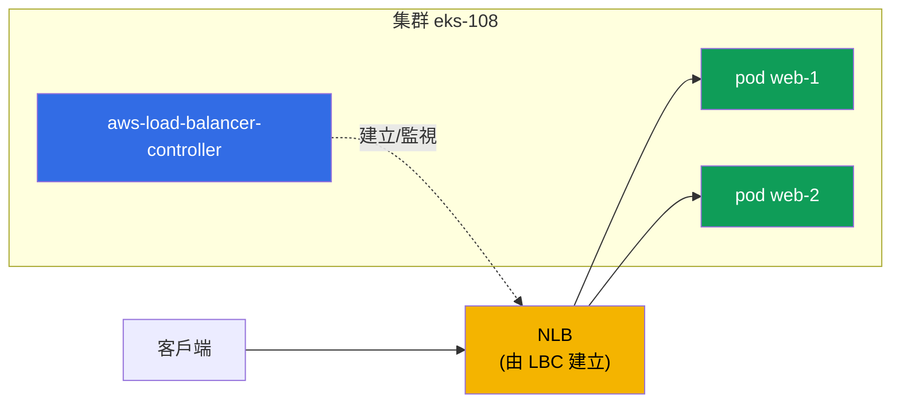
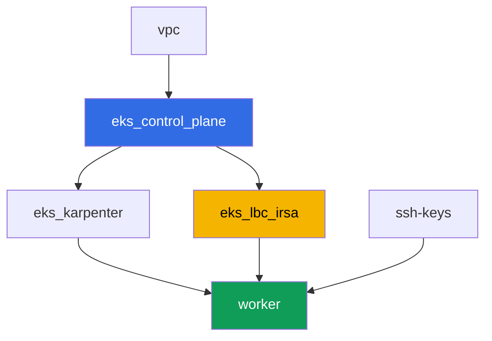

[Русская версия](README_RU.MD) · [Eng version](README.MD) · [Versión en español](README_ES.MD) · [Version française](README_FR.MD) · [Deutsche Version](README_DE.MD) · [ქართული ვერსია](README_GE.MD) · [日本語版](README_JP.MD)

# 實驗 108 - AWS Load Balancer Controller:為 LoadBalancer 類型的 Service 建立 NLB

## 說明

課程第 5 部分(網路與流量)的第一個實驗。在這裡你會安裝 AWS Load Balancer Controller
(LBC),並將 LoadBalancer 類型 Service 的協調(reconciliation)從過時的 in-tree cloud
provider 切換到現代化的控制器,由它創建 Network Load Balancer(NLB) - 一個以 Pod IP
為 target 的 L4 負載平衡器。你會看到 Service 的註解如何決定由哪個控制器接管該對象,如何
選擇 target 類型與存取 scheme,以及如何讀取控制器日誌來區分正常的協調與因 IAM 權限
不足而失敗的情況。

任務以生產風格編寫:簡短的任務描述加驗收標準。驗證是自動的,透過 `check_result` 命令
完成。

## 目標

鞏固以下課程章節的內容:

- [第 26 章。AWS Load Balancer Controller 與 LoadBalancer 類型的 Service:NLB](../../course/26/ru.md) - 控制器、註解、NLB 對比 CLB

## 我們要創建什麼

集群已經以代碼方式部署完成(control plane、供系統 Pod 使用的 Fargate、供負載使用的
Karpenter)。你要安裝 LBC,並圍繞它建立負載與 Service。

| 對象 | 這是什麼 | 在這個實驗中的作用 |
|--------|---------|-------------------|
| Namespace `eks-108` | 供實驗負載使用的集群區域 | 讓資源與系統資源保持隔離 |
| ServiceAccount `aws-load-balancer-controller` | `kube-system` 中帶有 IRSA 角色的 SA | 賦予控制器存取 ELBv2 API 的權限 |
| Deployment `aws-load-balancer-controller` | 控制器本身(Helm chart `eks/aws-load-balancer-controller`) | 監視 Service/Ingress 對象並創建負載平衡器 |
| Deployment `web`(2 個副本) | ping_pong 應用程式 | 我們要對外發布的負載 |
| Service `web`(LoadBalancer) | 帶有 `external`、`nlb-target-type: ip`、`scheme` 註解的 Service | 強制 LBC 創建以 Pod IP 為 target 的 NLB |
| 產物 `nlb.txt`、`targets.txt`、`reconcile.txt` | AWS CLI 輸出與日誌說明 | 確認負載平衡器類型、target 類型與 IAM 職責邊界 |

最終的流量圖景:



## 基礎設施

環境透過 Terragrunt 部署在 AWS(`eu-central-1`)。實驗中的每個目錄都是一個組件,擁有
自己的 `terragrunt.hcl`,它引用 `terraform/modules/` 中的共用模組,並透過 `dependency`
區塊聲明依賴關係。

### 模組與依賴關係

| 目錄(組件) | 模組(`terraform/modules/`) | 依賴於 | 創建了什麼 |
|---------------------|-------------------------------|------------|-------------|
| `vpc` | `vpc_v3` | - | VPC `10.10.0.0/16`,兩個 AZ 中的子網,NAT |
| `ssh-keys` | `ssh-keys` | - | 供工作機使用的一對 SSH 金鑰 |
| `eks_control_plane` | `eks_v2_control_plane` | `vpc` | EKS control plane `1.36`、OIDC 提供者 |
| `eks_fargate_system` | `eks_v2_fargate` | `vpc`、`eks_control_plane` | `kube-system` 與 `karpenter` 的 Fargate 配置檔 |
| `eks_addons` | `eks_v2_addons` | `eks_control_plane`、`eks_fargate_system` | coredns、kube-proxy、vpc-cni、pod-identity |
| `eks_karpenter` | `eks_v2_karpenter` | `vpc`、`eks_control_plane`、`eks_addons`、`eks_fargate_system` | Karpenter 控制器、節點 IAM 角色 |
| `eks_karpenter_default_vng` | `eks_v2_karpenter_vng` | `vpc`、`eks_control_plane`、`eks_karpenter` | 基於 AL2023 的預設 NodePool |
| `eks_lbc_irsa` | `eks_v2_lbc_irsa` | `eks_control_plane` | 供 AWS Load Balancer Controller 使用的 IRSA IAM 角色與政策 |
| `worker` | `eks_v2_work_pc` | `ssh-keys`、`vpc`、`eks_control_plane`、`eks_karpenter`、`eks_lbc_irsa` | 帶有 kubectl、測試腳本和 `check_result` 的工作機 |

模組 `eks_v2_lbc_irsa` 只創建一個信任集群 OIDC 提供者的 IAM 角色(針對
`system:serviceaccount:kube-system:aws-load-balancer-controller` 的 `sub` 條件),以及
一個包含控制器所需的 ELBv2/EC2 權限的政策。控制器本身並不是 EKS 的受管附加元件 -
它由學生在任務 2 中透過 Helm 手動安裝。

依賴關係圖(較早套用的組件位於箭頭下方):



組件 `eks_fargate_system`、`eks_addons`、`eks_karpenter_default_vng` 為了可讀性沒有
包含在上面的圖中(不超過 8 個節點) - 它們以標準順序套用在 `eks_control_plane` 與
`eks_karpenter` 之間,如同實驗 101 中一樣。

### 各項設定在哪裡配置

`env.hcl`(共用的環境參數):

| 參數 | 實驗中的值 | 影響什麼 |
|----------|-----------------|---------------|
| `region` | `eu-central-1` | 所有資源的區域 |
| `vpc_default_cidr`、`subnets` | `10.10.0.0/16`,依 AZ 劃分的子網 | VPC 的位址規劃,NLB 的 IP target 就來自這裡 |
| `prefix` | `eks-task108` | 資源名稱與標籤的前綴 |
| `stack_name` | `eks108` | 用於構建 `env_name` - 集群名稱 |
| `k8_version` | `1.36.0` | 工作機上 kubectl 的版本 |
| `instance_type_worker` | `t3.medium` | 工作機的 instance 類型 |
| `ssh_password_enable`、`access_cidrs` | `true`、`0.0.0.0/0` | 對工作機的 SSH 存取 |

每個組件 `terragrunt.hcl` 中的 `inputs`:

| 檔案 | 關鍵設定 |
|------|--------------------|
| `eks_control_plane/terragrunt.hcl` | `eks.version = "1.36"`,control plane 與節點所用的子網 |
| `eks_lbc_irsa/terragrunt.hcl` | `name`(集群)與 `oidc_provider_arn`,用於角色的信任政策 |
| `eks_karpenter_default_vng/terragrunt.hcl` | NodePool 的 `requirements`、`disruption`、`budgets` |
| `worker/terragrunt.hcl` | 指向實驗 108 檔案的 `test_url` 與 `task_script_url`;依賴 `eks_lbc_irsa` |

## 部署

```bash
TASK=108 make run_eks_task
```

部署大約需要 15-20 分鐘。在輸出中找到連接工作機的 SSH 那一行並連接上去。kubectl 在那
裡已經配置好指向正確的集群。

工作機上的常用命令:

```bash
time_left       # 環境剩餘的時間
check_result    # 檢查解答
```

> 測試環境的安全性。`env.hcl` 中啟用了 `ssh_password_enable = true` 和
> `access_cidrs = ["0.0.0.0/0"]` - 這對於學習環境很方便,但在生產環境中不應該這樣做。
> 依照課程標準(第 0.2、2、19 章),對工作機的存取應透過 AWS SSM Session Manager 進行,
> 不對外暴露公開的 SSH 端口,並將 `access_cidrs` 限制到具體的位址。這裡保留公開 SSH 只
> 是為了簡化啟動流程。

## 任務

---
|        **1**        | **供實驗負載使用的 Namespace**                             |
| :-----------------: | :---------------------------------------------------------- |
| 我們要做什麼          | 創建一個名為 `eks-108` 的 namespace。實驗中的所有對象(除了住在 `kube-system` 中的控制器和它的 ServiceAccount 之外)都在其中創建。 |
| 驗收標準    | - namespace `eks-108` 存在。 |
---
|        **2**        | **ServiceAccount 與安裝 AWS Load Balancer Controller**  |
| :-----------------: | :---------------------------------------------------------- |
| 我們要做什麼          | 找出 terraform 為控制器創建的 IAM 角色的 ARN(角色名稱 `<cluster-name>-lbc-irsa`),並在 `kube-system` 中創建 ServiceAccount `aws-load-balancer-controller`,附上指向該角色的 `eks.amazonaws.com/role-arn` 註解。然後透過 Helm 安裝 AWS Load Balancer Controller(倉庫 `https://aws.github.io/eks-charts`,chart `aws-load-balancer-controller`),使用旗標 `--set serviceAccount.create=false --set serviceAccount.name=aws-load-balancer-controller`、`--set clusterName=<集群名稱>`、`--set region=eu-central-1` 及 `--set vpcId=<實驗的-VPC-ID>`。`region`/`vpcId` 這兩個旗標是必須的:控制器運行在 Fargate 上(namespace `kube-system` 位於 Fargate profile 之下),而 Fargate 上根本沒有 EC2 instance metadata - 沒有這些旗標,控制器會嘗試透過 IMDS 取得 VPC ID,並陷入 `CrashLoopBackOff`。可以透過 `aws eks describe-cluster --name <cluster-name> --query 'cluster.resourcesVpcConfig.vpcId'` 取得 VPC ID。等待 `kube-system` 中的 Deployment `aws-load-balancer-controller` 變為 `Running`(所有副本 Ready)。 |
| 驗收標準    | - ServiceAccount `aws-load-balancer-controller` 位於 `kube-system`,帶有指向 `lbc-irsa` 角色的註解;<br/>- Deployment `aws-load-balancer-controller` 在 `kube-system` 中至少有一個就緒副本。 |
---
|        **3**        | **供對外發布的負載**                           |
| :-----------------: | :---------------------------------------------------------- |
| 我們要做什麼          | 在 namespace `eks-108` 中創建 Deployment `web`,映像 `viktoruj/ping_pong:latest`,`2` 個副本。等待兩個副本都變為 Ready。 |
| 驗收標準    | - Deployment `web` 位於 `eks-108`,映像 `viktoruj/ping_pong`;<br/>- `2` 個就緒副本。 |
---
|        **4**        | **LoadBalancer 類型的 Service:NLB 而非 Classic Load Balancer** |
| :-----------------: | :---------------------------------------------------------- |
| 我們要做什麼          | 創建 Service `web`,類型為 `LoadBalancer`,選擇器 `app: web`,端口 `80` 對應 `targetPort: 8080`,並加上三個註解:`service.beta.kubernetes.io/aws-load-balancer-type: external`(將協調工作交給 LBC,而非會創建過時 Classic Load Balancer 的 in-tree provider)、`service.beta.kubernetes.io/aws-load-balancer-nlb-target-type: ip`、`service.beta.kubernetes.io/aws-load-balancer-scheme: internet-facing`。等待外部位址(`kubectl get svc web -n eks-108 -w`)。透過 `aws elbv2 describe-load-balancers` 確認建立的負載平衡器 `Type` 為 `network`(NLB,不是 `classic`),且 `Scheme` 為 `internet-facing`,並將輸出保存到 `/var/work/tests/artifacts/4/nlb.txt`。 |
| 驗收標準    | - Service `web` 位於 `eks-108`,帶有三個註解及外部位址(`status.loadBalancer.ingress[0].hostname`);<br/>- 檔案 `nlb.txt` 不為空,且包含 `network` 和 `internet-facing`。 |
---
|        **5**        | **檢查 target:Pod 的 IP,而非節點的 ID**                 |
| :-----------------: | :---------------------------------------------------------- |
| 我們要做什麼          | 透過 `aws elbv2 describe-target-groups` 找出所建立 NLB 的 target group,然後透過 `aws elbv2 describe-target-health` 查看 target 列表。將兩者的輸出保存到 `/var/work/tests/artifacts/5/targets.txt`。確認 `TargetType` 等於 `ip`,且 target 的識別碼是來自 `10.10.0.0/16`(Pod 位址)的 IP 位址,而不是 `i-...`(節點的 instance ID)。 |
| 驗收標準    | - 檔案 `targets.txt` 不為空;<br/>- 包含 `"TargetType": "ip"` 以及至少一個位址來自 `10.10.0.0/16` 的 target;<br/>- 不包含任何 `i-...` 形式的 target。 |
---
|        **6**        | **診斷:成功的協調對比 AccessDenied**  |
| :-----------------: | :---------------------------------------------------------- |
| 我們要做什麼          | 查看控制器日誌(`kubectl logs -n kube-system deploy/aws-load-balancer-controller`),找出 Service `web` 成功協調的那些行 - 其中會出現所建立負載平衡器的 ARN(`arn:aws:elasticloadbalancing:...`)。在產物 `/var/work/tests/artifacts/6/reconcile.txt` 中描述兩種情況:正常協調的樣子(帶有這個 ARN)以及缺少必要 IAM 權限時錯誤的樣子 - 呼叫 `elasticloadbalancing:CreateLoadBalancer` 時出現 `AccessDenied` 訊息,導致 Service 沒有外部位址。 |
| 驗收標準    | - 檔案 `reconcile.txt` 不為空;<br/>- 包含帶有 `arn:aws:elasticloadbalancing` 的一行(成功協調的真實日誌);<br/>- 包含 `AccessDenied` 這個詞(缺少權限時預期症狀的描述)。 |
---

## 檢查結果

在工作機上執行自動檢查:

```bash
check_result
```

腳本會執行測試並顯示已完成任務的百分比。

## 解答

參考解答:[worker/files/solutions/1_TW.MD](worker/files/solutions/1_TW.MD)

## 刪除集群與資源

> 刪除之前。任務 4 中 `LoadBalancer` 類型的 Service `web` 直接透過 ELBv2/EC2 API(AWS
> Load Balancer Controller)創建了一個真正的 NLB 以及兩個 security group,並不是透過
> terraform - state 對它們一無所知。正確的移除方式是刪除 Service,讓 LBC 自己呼叫
> AWS API 進行刪除(Service 上的 finalizer 會阻止該對象從 etcd 中移除,直到 LBC 確認
> NLB 與兩個 SG 真的都被移除) - 這比透過 AWS CLI 手動清理 NLB/SG 更可靠也更簡單:
>
> ```bash
> kubectl delete svc web -n eks-108
> # 等待 finalizer 被移除 - 這就意味著「LBC 已經刪除了 NLB 和 SG」
> kubectl wait --for=delete svc/web -n eks-108 --timeout=120s
> ```
>
> 一定要在 `terragrunt destroy` 之前完成這個步驟。如果 control plane 在 Service 之前
> 就已經被刪除(LBC 已經無法執行 finalizer),NLB 及其 SG 將會變成孤兒,並持續佔用
> 公有子網中的 ENI - VPC 和 Internet Gateway 會永遠卡在 `Still destroying...`。這種
> 情況下 LBC 已經無法幫忙,只能透過 AWS CLI 手動清理:
>
> ```bash
> VPC_ID=<這個實驗的-VPC-ID>
> LB_ARN=$(aws elbv2 describe-load-balancers \
>   --query "LoadBalancers[?contains(LoadBalancerName,'eks108')].LoadBalancerArn" --output text)
> aws elbv2 delete-load-balancer --load-balancer-arn "$LB_ARN"
> # 等待子網中的 ENI 釋放,然後刪除剩餘的 SG:
> aws ec2 describe-security-groups --filters "Name=vpc-id,Values=$VPC_ID" \
>   --query "SecurityGroups[?GroupName!='default'].GroupId" --output text | \
>   xargs -n1 aws ec2 delete-security-group --group-id
> ```

```bash
TASK=108 make delete_eks_task
```
