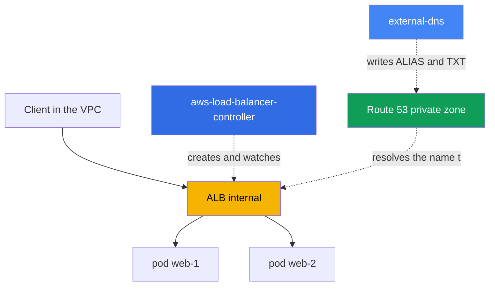
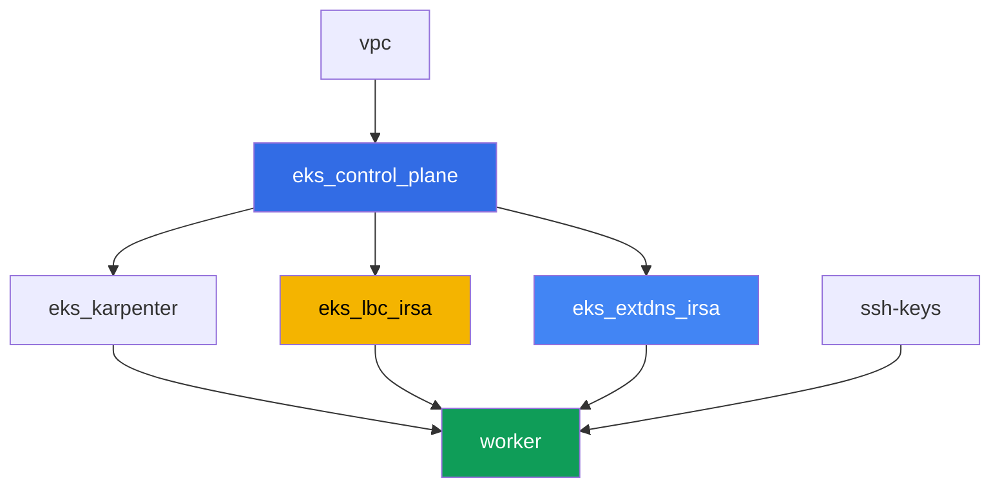

[Русская версия](README_RU.MD) · [Versión en español](README_ES.MD) · [Version française](README_FR.MD) · [Deutsche Version](README_DE.MD) · [ქართული ვერსია](README_GE.MD) · [繁體中文版](README_TW.MD) · [日本語版](README_JP.MD)

# Lab 109 - Ingress through ALB with an ACM certificate, external-dns and Route 53

## Description

Here the whole L7 entry point comes together: an Ingress creates an Application Load
Balancer through the AWS Load Balancer Controller (LBC), the ALB gets a TLS certificate
from ACM attached, and external-dns sets up the external DNS name for the ALB in a
private Route 53 hosted zone. You will go through the entire path - from a bare Ingress
with no address to a working HTTPS entry point with a DNS record and an ownership TXT
marker - and you'll also work through a typical symptom where the Ingress doesn't
produce an ALB.

You don't need a real public domain of your own for this lab: the private hosted zone is
created by the lab's terraform and attached to the VPC, and the certificate is
self-signed, imported into ACM. This doesn't reduce the value of the tasks: the ALB
annotations, the mechanics of `certificate-arn`, `listen-ports`, `ssl-redirect`,
IngressGroup, and external-dns records work the same way for both the private and the
public case.

Tasks are written in a production style: a short statement plus acceptance criteria.
Checking is automatic, via the `check_result` command.

## Goal

Reinforce the material from these course chapters:

- [Chapter 27. Ingress through ALB: target-type, annotations, TLS and ACM, WAF](../../course/27/ru.md)
- [Chapter 29. DNS and certificates: external-dns, Route 53, cert-manager](../../course/29/ru.md)

## What we're creating

The cluster is already deployed as code (control plane, Fargate for system pods,
Karpenter for the workload). Terraform also creates a private hosted zone and a
self-signed certificate in ACM. You install LBC and external-dns and build the whole
entry point around them.

| Object | What it is | Why it's in this lab |
|--------|---------|-------------------|
| Namespace `eks-109` | a cluster section for the lab's workload | keeps resources separate from system ones |
| Route 53 private zone `eks-task109.internal` | created by terraform, attached to the lab's VPC | the zone external-dns writes to |
| ACM certificate (self-signed) | created by terraform via `tls_self_signed_cert` + import | `certificate-arn` for the ALB's HTTPS listener |
| Deployment `web` (2 replicas) + Service `web` | ping_pong application | the workload the Ingress publishes |
| ServiceAccount + Deployment `aws-load-balancer-controller` | Helm chart, role via IRSA | creates an ALB from the Ingress |
| Ingress `web` | `ingressClassName: alb`, TLS, IngressGroup | the entry point itself: ALB, HTTPS, DNS name |
| ServiceAccount + Deployment `external-dns` | Helm chart, role via IRSA | syncs ALIAS and TXT records in Route 53 |

The resulting picture of traffic and DNS:



## Infrastructure

The environment is deployed in AWS (`eu-central-1`) via Terragrunt. Each lab directory is
one component with its own `terragrunt.hcl`, which references a shared module in
`terraform/modules/` and declares dependencies through `dependency` blocks.

### Modules and dependencies

| Directory (component) | Module (`terraform/modules/`) | Depends on | What it creates |
|---------------------|-------------------------------|------------|-------------|
| `vpc` | `vpc_v3` | - | VPC `10.10.0.0/16`, subnets in two AZs, NAT |
| `ssh-keys` | `ssh-keys` | - | an SSH key pair for the worker machine |
| `eks_control_plane` | `eks_v2_control_plane` | `vpc` | EKS control plane `1.36`, OIDC provider |
| `eks_fargate_system` | `eks_v2_fargate` | `vpc`, `eks_control_plane` | Fargate profile for `kube-system` and `karpenter` |
| `eks_addons` | `eks_v2_addons` | `eks_control_plane`, `eks_fargate_system` | coredns, kube-proxy, vpc-cni, pod-identity |
| `eks_karpenter` | `eks_v2_karpenter` | `vpc`, `eks_control_plane`, `eks_addons`, `eks_fargate_system` | Karpenter controller, node IAM role |
| `eks_karpenter_default_vng` | `eks_v2_karpenter_vng` | `vpc`, `eks_control_plane`, `eks_karpenter` | default NodePool on AL2023 |
| `eks_lbc_irsa` | `eks_v2_lbc_irsa` | `eks_control_plane` | IRSA IAM role for the AWS Load Balancer Controller |
| `eks_extdns_irsa` | `eks_v2_extdns_irsa` | `vpc`, `eks_control_plane` | IRSA IAM role for external-dns, private hosted zone, self-signed ACM certificate |
| `worker` | `eks_v2_work_pc` | `ssh-keys`, `vpc`, `eks_control_plane`, `eks_karpenter`, `eks_lbc_irsa`, `eks_extdns_irsa` | worker machine with kubectl, tests, and `check_result` |

Module `eks_v2_extdns_irsa` is new for this lab, modeled after `eks_v2_lbc_irsa` and
`eks_v2_ebs_irsa` (`var.tf`, `locals.tf`, `data.tf`, `aws.tf`, `cmdb.tf`, `iam_irsa.tf`,
`output.tf`, `versions.tf`). It also creates an `aws_route53_zone` (private, attached to
the VPC) and an `aws_acm_certificate` from a self-signed certificate generated by the
`tls` provider (`tls_private_key` + `tls_self_signed_cert`). The IAM role trusts the
cluster's OIDC with a `sub` condition on
`system:serviceaccount:kube-system:external-dns` and carries a minimal external-dns
policy (`route53:ChangeResourceRecordSets`, `ListResourceRecordSets`,
`ListTagsForResources` on the zones, `ListHostedZones` on `*`).

Dependency graph (what gets applied earlier is lower down the arrow):



Components `eks_fargate_system`, `eks_addons`, `eks_karpenter_default_vng` are not
included in the graph above for readability (no more than 8 nodes) - they are applied in
the standard order between `eks_control_plane` and `eks_karpenter`, as in lab 101.

### Where things are configured

`env.hcl` (shared environment parameters):

| Parameter | Value in the lab | What it affects |
|----------|-----------------|---------------|
| `region` | `eu-central-1` | region for all resources |
| `vpc_default_cidr`, `subnets` | `10.10.0.0/16`, subnets per AZ | VPC address plan |
| `prefix` | `eks-task109` | prefix for resource names and tags |
| `stack_name` | `eks109` | used to build `env_name` - the cluster name |
| `zone_domain` | `eks-task109.internal` | name of the private Route 53 hosted zone |
| `cert_common_name` | `app.eks-task109.internal` | Common Name of the self-signed ACM certificate |
| `k8_version` | `1.36.0` | kubectl version on the worker machine |
| `instance_type_worker` | `t3.medium` | worker machine instance type |
| `ssh_password_enable`, `access_cidrs` | `true`, `0.0.0.0/0` | SSH access to the worker machine |

`inputs` in each component's `terragrunt.hcl`:

| File | Key settings |
|------|--------------------|
| `eks_control_plane/terragrunt.hcl` | `eks.version = "1.36"`, subnets for the control plane and nodes |
| `eks_lbc_irsa/terragrunt.hcl` | `name` (cluster) and `oidc_provider_arn` for the LBC role's trust policy |
| `eks_extdns_irsa/terragrunt.hcl` | `name`, `oidc_provider_arn`, `vpc_id`, `zone_domain`, `cert_common_name` |
| `worker/terragrunt.hcl` | `test_url`, `task_script_url` pointing to the lab 109 files; dependencies on `eks_lbc_irsa` and `eks_extdns_irsa` |

## Deployment

```bash
TASK=109 make run_eks_task
```

Deployment takes roughly 15-20 minutes. In the output, find the line with the SSH
connection to the worker machine and connect to it. kubectl there is already configured
for the right cluster.

Useful commands on the worker machine:

```bash
time_left       # how much environment time is left
check_result    # check the solution
```

> Environment security. `env.hcl` has `ssh_password_enable = true` and
> `access_cidrs = ["0.0.0.0/0"]` enabled - convenient for a training environment, but this
> is not something to do in production. Per the course standards (chapters 0.2, 2, 19),
> access to worker machines should go through AWS SSM Session Manager without exposing
> public SSH ports, and `access_cidrs` should be narrowed down to specific addresses. Here
> public SSH is left in place only to keep the setup simple.

## Tasks

---
|        **1**        | **Namespace, Service, and the ping_pong workload**                  |
| :-----------------: | :---------------------------------------------------------- |
| What to do          | Create namespace `eks-109`. Inside it, deploy a Deployment `web`, image `viktoruj/ping_pong:latest`, `2` replicas, container port `8080`. Create a Service `web` of type `ClusterIP` with port `80`, `targetPort: 8080`, selector `app: web`. Wait for `2` ready replicas. |
| Acceptance criteria    | - namespace `eks-109` exists;<br/>- Deployment `web` with image `viktoruj/ping_pong` and `2` ready replicas;<br/>- Service `web` of type `ClusterIP` on port `80`. |
---
|        **2**        | **ServiceAccount and installing the AWS Load Balancer Controller**  |
| :-----------------: | :---------------------------------------------------------- |
| What to do          | Find the ARN of the IAM role created by terraform for the controller (role name `<cluster-name>-lbc-irsa`), and create a ServiceAccount `aws-load-balancer-controller` in `kube-system` with the annotation `eks.amazonaws.com/role-arn` pointing to this role. Install the AWS Load Balancer Controller via Helm (repository `https://aws.github.io/eks-charts`, chart `aws-load-balancer-controller`) with the flags `--set serviceAccount.create=false --set serviceAccount.name=aws-load-balancer-controller` and `--set clusterName=<cluster name>`. Wait for a ready replica of Deployment `aws-load-balancer-controller`. |
| Acceptance criteria    | - ServiceAccount `aws-load-balancer-controller` in `kube-system` with an annotation pointing to the `lbc-irsa` role;<br/>- Deployment `aws-load-balancer-controller` in `kube-system` has at least one ready replica. |
---
|        **3**        | **Ingress through ALB: internal, target-type ip**              |
| :-----------------: | :---------------------------------------------------------- |
| What to do          | Create Ingress `web` in namespace `eks-109` with `ingressClassName: alb`, annotations `alb.ingress.kubernetes.io/scheme: internal`, `alb.ingress.kubernetes.io/target-type: ip`, `alb.ingress.kubernetes.io/group.name: eks-task109-web`, a rule with `host: app.eks-task109.internal`, path `/` to Service `web` port `80`. Wait for an address (`kubectl get ingress web -n eks-109 -w`). Using `aws elbv2 describe-load-balancers` and `aws elbv2 describe-listeners`, confirm a load balancer of `Type: application`, `Scheme: internal`, and a listener on `80`, save both outputs to `/var/work/tests/artifacts/3/alb.txt`. |
| Acceptance criteria    | - Ingress `web` with `ingressClassName: alb` and an address in `status.loadBalancer.ingress[0].hostname`;<br/>- file `alb.txt` is not empty, contains `"Type": "application"`, `"Scheme": "internal"`, and `"Port": 80`. |
---
|        **4**        | **TLS: ACM certificate, HTTPS listener, redirect**             |
| :-----------------: | :---------------------------------------------------------- |
| What to do          | Find the ARN of the self-signed certificate created by terraform (`aws acm list-certificates`, domain `app.eks-task109.internal`). Add to Ingress `web` the annotations `alb.ingress.kubernetes.io/certificate-arn` (this ARN), `alb.ingress.kubernetes.io/listen-ports: '[{"HTTP": 80}, {"HTTPS": 443}]'`, `alb.ingress.kubernetes.io/ssl-redirect: '443'`, and `spec.tls` with `hosts: ["app.eks-task109.internal"]`. Using `aws elbv2 describe-listeners`, confirm that a listener on `443` with protocol `HTTPS` and the specified `CertificateArn` has appeared, save the output to `/var/work/tests/artifacts/4/https.txt`. |
| Acceptance criteria    | - Ingress `web` has the `certificate-arn` annotation and `spec.tls` with the right host;<br/>- file `https.txt` is not empty and contains `"Protocol": "HTTPS"` and `"Port": 443`. |
---
|        **5**        | **external-dns: ALIAS and TXT in the private hosted zone**         |
| :-----------------: | :---------------------------------------------------------- |
| What to do          | Find the ARN of IAM role `<cluster-name>-extdns-irsa` and the ID of private hosted zone `eks-task109.internal` (`aws route53 list-hosted-zones-by-name`). Create a ServiceAccount `external-dns` in `kube-system` with an annotation pointing to the role, then install external-dns via Helm (repository `https://kubernetes-sigs.github.io/external-dns/`, chart `external-dns`) with `provider.name: aws`, `policy: upsert-only`, `registry: txt`, a unique `txtOwnerId`, `domainFilters: [eks-task109.internal]`, `sources: [ingress]`, `extraArgs.aws-zone-type: private`, `serviceAccount.create: false`, `serviceAccount.name: external-dns`. Wait for the records to appear and save `aws route53 list-resource-record-sets` for this zone to `/var/work/tests/artifacts/5/dns.txt`. |
| Acceptance criteria    | - Deployment `external-dns` in `kube-system` with at least one ready replica;<br/>- file `dns.txt` is not empty, contains a record `app.eks-task109.internal` of type `A` (ALIAS) and an ownership TXT record. |
---
|        **6**        | **Diagnosis: wrong ingressClassName and IngressGroup**     |
| :-----------------: | :---------------------------------------------------------- |
| What to do          | Create an `IngressClass` `wrong-class` with `spec.controller: example.com/not-alb` (a real object is needed because the LBC admission webhook rejects an Ingress that references a non-existent class), then a second Ingress `status` in `eks-109` with `ingressClassName: wrong-class` (path `/status` to Service `web` port `80`). Confirm that it has no address (LBC only watches classes with controller `ingress.k8s.aws/alb`), and describe the reason in `/var/work/tests/artifacts/6/groupfix.txt`. Then fix it: set `ingressClassName: alb`, add `alb.ingress.kubernetes.io/scheme: internal`, `alb.ingress.kubernetes.io/target-type: ip`, `alb.ingress.kubernetes.io/group.name: eks-task109-web` (the same group name as the `web` Ingress) and `group.order: '10'`. Wait for an address and add to the same file that the `status` address matches the `web` address - both Ingresses share one ALB through the IngressGroup. |
| Acceptance criteria    | - file `groupfix.txt` is not empty, contains `ingressClassName` and `wrong-class` (explanation of the symptom);<br/>- Ingress `status` after the fix has `ingressClassName: alb` and the same address as Ingress `web` (`status.loadBalancer.ingress[0].hostname`). |
---

## Checking the result

On the worker machine, run the automatic check:

```bash
check_result
```

The script will run the tests and show the percentage of completed tasks.

## Solution

Reference solution: [worker/files/solutions/1.MD](worker/files/solutions/1.MD)

## Deleting the cluster and resources

> Before deleting. Ingress `web` and `status` created a real ALB and two security groups
> directly through the ELBv2/EC2 API (AWS Load Balancer Controller) - none of that is in
> terraform state. Delete the Ingresses and let LBC itself call the AWS API to delete the
> ALB and SGs (a finalizer won't let the objects be removed from etcd until LBC confirms
> cleanup):
>
> ```bash
> kubectl delete ingress web status -n eks-109
> kubectl wait --for=delete ingress/web ingress/status -n eks-109 --timeout=120s
> ```
>
> external-dns from task 5 will NOT remove the `A`/`AAAA`/`TXT` records on its own: the
> `policy: upsert-only` you explicitly set at install time is a deliberate "create and
> update only" mode, with no deletion - a documented behavior of the project (protection
> against accidentally losing DNS records when the controller restarts). Delete them
> manually via the AWS CLI - otherwise the hosted zone will keep records beyond
> `NS`/`SOA`, and terraform won't be able to delete the zone itself:
>
> ```bash
> ZONE_ID=$(aws route53 list-hosted-zones-by-name --dns-name eks-task109.internal \
>   --query "HostedZones[0].Id" --output text)
> aws route53 change-resource-record-sets --hosted-zone-id "$ZONE_ID" --change-batch '{
>   "Changes": [
>     {"Action": "DELETE", "ResourceRecordSet": {"Name": "app.eks-task109.internal.", "Type": "A", "AliasTarget": {"HostedZoneId": "<CanonicalHostedZoneId ALB>", "DNSName": "<DNSName ALB>.", "EvaluateTargetHealth": true}}},
>     {"Action": "DELETE", "ResourceRecordSet": {"Name": "app.eks-task109.internal.", "Type": "AAAA", "AliasTarget": {"HostedZoneId": "<CanonicalHostedZoneId ALB>", "DNSName": "<DNSName ALB>.", "EvaluateTargetHealth": true}}},
>     {"Action": "DELETE", "ResourceRecordSet": {"Name": "aaaa-app.eks-task109.internal.", "Type": "TXT", "TTL": 300, "ResourceRecords": [{"Value": "\"heritage=external-dns,external-dns/owner=eks-task109,external-dns/resource=ingress/eks-109/web\""}]}},
>     {"Action": "DELETE", "ResourceRecordSet": {"Name": "cname-app.eks-task109.internal.", "Type": "TXT", "TTL": 300, "ResourceRecords": [{"Value": "\"heritage=external-dns,external-dns/owner=eks-task109,external-dns/resource=ingress/eks-109/web\""}]}}
>   ]
> }'
> # simpler: check the exact values before deleting and substitute them above
> aws route53 list-resource-record-sets --hosted-zone-id "$ZONE_ID"
> ```
>
> Be sure to delete the Ingresses BEFORE `terragrunt destroy`. If the control plane gets
> deleted before them, the ALB and its SGs will be left orphaned (holding ENIs in the
> subnets - the VPC and Internet Gateway will hang in `Still destroying...`), and LBC
> won't be able to help anymore - manual cleanup via the AWS CLI is the only option left:
>
> ```bash
> VPC_ID=<ID of this lab's VPC>
> LB_ARN=$(aws elbv2 describe-load-balancers \
>   --query "LoadBalancers[?contains(LoadBalancerName,'eks109')].LoadBalancerArn" --output text)
> aws elbv2 delete-load-balancer --load-balancer-arn "$LB_ARN"
> # wait until the ENIs in the subnets free up, then delete the remaining SGs:
> aws ec2 describe-security-groups --filters "Name=vpc-id,Values=$VPC_ID" \
>   --query "SecurityGroups[?GroupName!='default'].GroupId" --output text | \
>   xargs -n1 aws ec2 delete-security-group --group-id
> ```

```bash
TASK=109 make delete_eks_task
```
