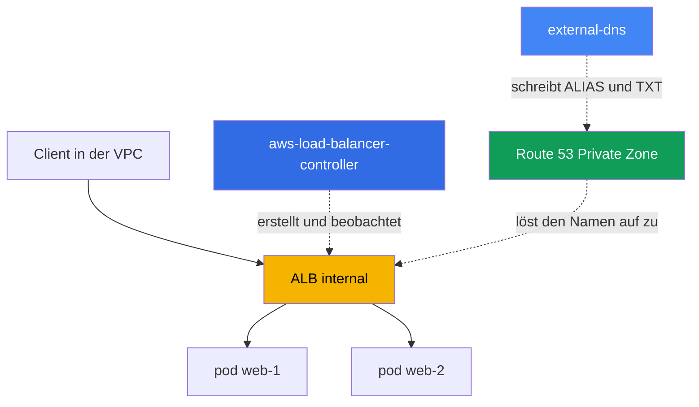
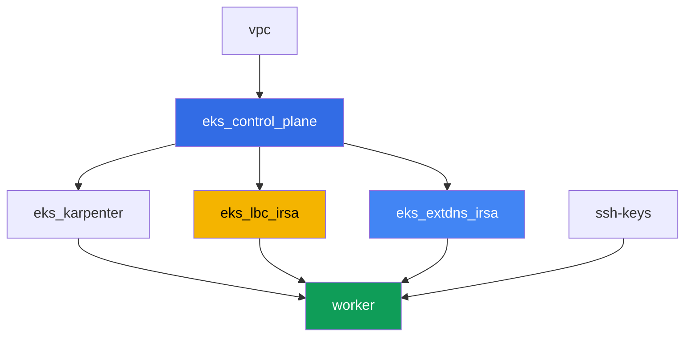

[Русская версия](README_RU.MD) · [Eng version](README.MD) · [Versión en español](README_ES.MD) · [Version française](README_FR.MD) · [ქართული ვერსია](README_GE.MD) · [繁體中文版](README_TW.MD) · [日本語版](README_JP.MD)

# Lab 109 - Ingress über ALB mit ACM-Zertifikat, external-dns und Route 53

## Beschreibung

Hier kommt der gesamte L7-Einstiegspunkt zusammen: ein Ingress erstellt einen Application
Load Balancer über den AWS Load Balancer Controller (LBC), der ALB bekommt ein
TLS-Zertifikat aus ACM angehängt, und external-dns richtet den externen DNS-Namen für den
ALB in einer privaten Route 53 Hosted Zone ein. Sie gehen den gesamten Pfad durch - von
einem nackten Ingress ohne Adresse bis zu einem funktionierenden HTTPS-Einstiegspunkt mit
DNS-Eintrag und einem Ownership-TXT-Marker - und arbeiten sich außerdem durch ein
typisches Symptom, bei dem der Ingress keinen ALB erzeugt.

Sie brauchen für dieses Lab keine echte öffentliche Domain: Die private Hosted Zone wird
vom Terraform des Labs erstellt und an die VPC angehängt, und das Zertifikat ist
selbstsigniert und in ACM importiert. Das schmälert den Wert der Aufgaben nicht: die
ALB-Annotationen, die Mechanik von `certificate-arn`, `listen-ports`, `ssl-redirect`,
IngressGroup und die external-dns-Einträge funktionieren für den privaten und den
öffentlichen Fall gleich.

Die Aufgaben sind im Produktionsstil geschrieben: eine kurze Aufgabenstellung plus
Abnahmekriterien. Die Prüfung erfolgt automatisch über den Befehl `check_result`.

## Ziel

Den Stoff dieser Kurskapitel vertiefen:

- [Kapitel 27. Ingress über ALB: target-type, Annotationen, TLS und ACM, WAF](../../course/27/de.md)
- [Kapitel 29. DNS und Zertifikate: external-dns, Route 53, cert-manager](../../course/29/de.md)

## Was wir erstellen

Der Cluster ist bereits als Code deployt (Control Plane, Fargate für System-Pods,
Karpenter für die Workload). Terraform erstellt außerdem eine private Hosted Zone und ein
selbstsigniertes Zertifikat in ACM. Sie installieren LBC und external-dns und bauen den
gesamten Einstiegspunkt darum herum auf.

| Objekt | Was es ist | Wofür in diesem Lab |
|--------|---------|-------------------|
| Namespace `eks-109` | ein Cluster-Bereich für die Lab-Workload | hält Ressourcen getrennt von den System-Ressourcen |
| Route 53 Private Zone `eks-task109.internal` | von Terraform erstellt, an die VPC des Labs angehängt | die Zone, in die external-dns schreibt |
| ACM-Zertifikat (selbstsigniert) | von Terraform erstellt über `tls_self_signed_cert` + Import | `certificate-arn` für den HTTPS-Listener des ALB |
| Deployment `web` (2 Replicas) + Service `web` | ping_pong-Anwendung | die Workload, die der Ingress veröffentlicht |
| ServiceAccount + Deployment `aws-load-balancer-controller` | Helm-Chart, Rolle über IRSA | erstellt einen ALB aus dem Ingress |
| Ingress `web` | `ingressClassName: alb`, TLS, IngressGroup | der Einstiegspunkt selbst: ALB, HTTPS, DNS-Name |
| ServiceAccount + Deployment `external-dns` | Helm-Chart, Rolle über IRSA | synchronisiert ALIAS- und TXT-Einträge in Route 53 |

Das resultierende Bild von Traffic und DNS:



## Infrastruktur

Die Umgebung wird in AWS (`eu-central-1`) über Terragrunt deployt. Jedes Lab-Verzeichnis
ist eine Komponente mit eigenem `terragrunt.hcl`, das auf ein gemeinsames Modul in
`terraform/modules/` verweist und seine Abhängigkeiten über `dependency`-Blöcke deklariert.

### Module und Abhängigkeiten

| Verzeichnis (Komponente) | Modul (`terraform/modules/`) | Abhängig von | Was es erstellt |
|---------------------|-------------------------------|------------|-------------|
| `vpc` | `vpc_v3` | - | VPC `10.10.0.0/16`, Subnetze in zwei AZ, NAT |
| `ssh-keys` | `ssh-keys` | - | ein SSH-Schlüsselpaar für die Worker-Maschine |
| `eks_control_plane` | `eks_v2_control_plane` | `vpc` | EKS Control Plane `1.36`, OIDC-Provider |
| `eks_fargate_system` | `eks_v2_fargate` | `vpc`, `eks_control_plane` | Fargate-Profil für `kube-system` und `karpenter` |
| `eks_addons` | `eks_v2_addons` | `eks_control_plane`, `eks_fargate_system` | coredns, kube-proxy, vpc-cni, pod-identity |
| `eks_karpenter` | `eks_v2_karpenter` | `vpc`, `eks_control_plane`, `eks_addons`, `eks_fargate_system` | Karpenter-Controller, IAM-Rolle der Nodes |
| `eks_karpenter_default_vng` | `eks_v2_karpenter_vng` | `vpc`, `eks_control_plane`, `eks_karpenter` | Standard-NodePool auf AL2023 |
| `eks_lbc_irsa` | `eks_v2_lbc_irsa` | `eks_control_plane` | IRSA-IAM-Rolle für den AWS Load Balancer Controller |
| `eks_extdns_irsa` | `eks_v2_extdns_irsa` | `vpc`, `eks_control_plane` | IRSA-IAM-Rolle für external-dns, private Hosted Zone, selbstsigniertes ACM-Zertifikat |
| `worker` | `eks_v2_work_pc` | `ssh-keys`, `vpc`, `eks_control_plane`, `eks_karpenter`, `eks_lbc_irsa`, `eks_extdns_irsa` | Worker-Maschine mit kubectl, Tests und `check_result` |

Modul `eks_v2_extdns_irsa` ist neu für dieses Lab, aufgebaut nach dem Vorbild von
`eks_v2_lbc_irsa` und `eks_v2_ebs_irsa` (`var.tf`, `locals.tf`, `data.tf`, `aws.tf`,
`cmdb.tf`, `iam_irsa.tf`, `output.tf`, `versions.tf`). Es erstellt außerdem eine
`aws_route53_zone` (privat, an die VPC angehängt) und ein `aws_acm_certificate` aus einem
selbstsignierten Zertifikat, das vom `tls`-Provider erzeugt wird (`tls_private_key` +
`tls_self_signed_cert`). Die IAM-Rolle vertraut der OIDC des Clusters mit einer
`sub`-Bedingung auf `system:serviceaccount:kube-system:external-dns` und trägt eine
minimale external-dns-Policy (`route53:ChangeResourceRecordSets`,
`ListResourceRecordSets`, `ListTagsForResources` auf den Zonen, `ListHostedZones` auf
`*`).

Abhängigkeitsgraph (was früher angewendet wird, steht weiter unten am Pfeil):



Die Komponenten `eks_fargate_system`, `eks_addons`, `eks_karpenter_default_vng` sind aus
Gründen der Lesbarkeit nicht im obigen Graphen enthalten (nicht mehr als 8 Knoten) - sie
werden in der Standardreihenfolge zwischen `eks_control_plane` und `eks_karpenter`
angewendet, wie in Lab 101.

### Wo was konfiguriert wird

`env.hcl` (gemeinsame Umgebungsparameter):

| Parameter | Wert im Lab | Was er beeinflusst |
|----------|-----------------|---------------|
| `region` | `eu-central-1` | Region aller Ressourcen |
| `vpc_default_cidr`, `subnets` | `10.10.0.0/16`, Subnetze pro AZ | Adressplan der VPC |
| `prefix` | `eks-task109` | Präfix für Ressourcennamen und Tags |
| `stack_name` | `eks109` | wird verwendet, um `env_name` zu bilden - der Clustername |
| `zone_domain` | `eks-task109.internal` | Name der privaten Route 53 Hosted Zone |
| `cert_common_name` | `app.eks-task109.internal` | Common Name des selbstsignierten ACM-Zertifikats |
| `k8_version` | `1.36.0` | kubectl-Version auf der Worker-Maschine |
| `instance_type_worker` | `t3.medium` | Instanztyp der Worker-Maschine |
| `ssh_password_enable`, `access_cidrs` | `true`, `0.0.0.0/0` | SSH-Zugriff auf die Worker-Maschine |

`inputs` im `terragrunt.hcl` jeder Komponente:

| Datei | Wichtige Einstellungen |
|------|--------------------|
| `eks_control_plane/terragrunt.hcl` | `eks.version = "1.36"`, Subnetze für die Control Plane und die Nodes |
| `eks_lbc_irsa/terragrunt.hcl` | `name` (Cluster) und `oidc_provider_arn` für die Trust-Policy der LBC-Rolle |
| `eks_extdns_irsa/terragrunt.hcl` | `name`, `oidc_provider_arn`, `vpc_id`, `zone_domain`, `cert_common_name` |
| `worker/terragrunt.hcl` | `test_url`, `task_script_url` zeigen auf die Dateien von Lab 109; Abhängigkeiten von `eks_lbc_irsa` und `eks_extdns_irsa` |

## Deployment

```bash
TASK=109 make run_eks_task
```

Das Deployment dauert etwa 15-20 Minuten. Suchen Sie in der Ausgabe die Zeile mit der
SSH-Verbindung zur Worker-Maschine und verbinden Sie sich damit. kubectl ist dort bereits
für den richtigen Cluster konfiguriert.

Nützliche Befehle auf der Worker-Maschine:

```bash
time_left       # verbleibende Zeit der Umgebung
check_result    # Lösung prüfen
```

> Sicherheit der Testumgebung. In `env.hcl` sind `ssh_password_enable = true` und
> `access_cidrs = ["0.0.0.0/0"]` aktiviert - praktisch für eine Lernumgebung, aber so
> sollte man es in Produktion nicht machen. Nach den Standards des Kurses (Kapitel 0.2, 2,
> 19) wird der Zugriff auf Worker-Maschinen über AWS SSM Session Manager geöffnet, ohne
> öffentliche SSH-Ports nach außen, und `access_cidrs` wird auf konkrete Adressen
> eingeschränkt. Hier bleibt öffentliches SSH nur der Einfachheit halber bestehen.

## Aufgaben

---
|        **1**        | **Namespace, Service und die ping_pong-Workload**                  |
| :-----------------: | :---------------------------------------------------------- |
| Was wir tun          | Erstellen Sie den Namespace `eks-109`. Deployen Sie darin ein Deployment `web`, Image `viktoruj/ping_pong:latest`, `2` Replicas, Container-Port `8080`. Erstellen Sie einen Service `web` vom Typ `ClusterIP` mit Port `80`, `targetPort: 8080`, Selektor `app: web`. Warten Sie auf `2` bereite Replicas. |
| Abnahmekriterien    | - Namespace `eks-109` existiert;<br/>- Deployment `web` mit Image `viktoruj/ping_pong` und `2` bereiten Replicas;<br/>- Service `web` vom Typ `ClusterIP` auf Port `80`. |
---
|        **2**        | **ServiceAccount und Installation des AWS Load Balancer Controllers**  |
| :-----------------: | :---------------------------------------------------------- |
| Was wir tun          | Ermitteln Sie den ARN der von Terraform für den Controller erstellten IAM-Rolle (Rollenname `<cluster-name>-lbc-irsa`) und erstellen Sie einen ServiceAccount `aws-load-balancer-controller` in `kube-system` mit der Annotation `eks.amazonaws.com/role-arn`, die auf diese Rolle zeigt. Installieren Sie den AWS Load Balancer Controller über Helm (Repository `https://aws.github.io/eks-charts`, Chart `aws-load-balancer-controller`) mit den Flags `--set serviceAccount.create=false --set serviceAccount.name=aws-load-balancer-controller` und `--set clusterName=<cluster name>`. Warten Sie auf eine bereite Replica des Deployments `aws-load-balancer-controller`. |
| Abnahmekriterien    | - ServiceAccount `aws-load-balancer-controller` in `kube-system` mit einer Annotation, die auf die Rolle `lbc-irsa` zeigt;<br/>- Deployment `aws-load-balancer-controller` in `kube-system` hat mindestens eine bereite Replica. |
---
|        **3**        | **Ingress über ALB: internal, target-type ip**              |
| :-----------------: | :---------------------------------------------------------- |
| Was wir tun          | Erstellen Sie Ingress `web` im Namespace `eks-109` mit `ingressClassName: alb`, Annotationen `alb.ingress.kubernetes.io/scheme: internal`, `alb.ingress.kubernetes.io/target-type: ip`, `alb.ingress.kubernetes.io/group.name: eks-task109-web`, einer Regel mit `host: app.eks-task109.internal`, Pfad `/` zum Service `web` Port `80`. Warten Sie auf eine Adresse (`kubectl get ingress web -n eks-109 -w`). Bestätigen Sie mit `aws elbv2 describe-load-balancers` und `aws elbv2 describe-listeners` einen Load Balancer vom `Type: application`, `Scheme: internal`, und einen Listener auf `80`, speichern Sie beide Ausgaben in `/var/work/tests/artifacts/3/alb.txt`. |
| Abnahmekriterien    | - Ingress `web` mit `ingressClassName: alb` und einer Adresse in `status.loadBalancer.ingress[0].hostname`;<br/>- Datei `alb.txt` ist nicht leer, enthält `"Type": "application"`, `"Scheme": "internal"` und `"Port": 80`. |
---
|        **4**        | **TLS: ACM-Zertifikat, HTTPS-Listener, Redirect**             |
| :-----------------: | :---------------------------------------------------------- |
| Was wir tun          | Ermitteln Sie den ARN des von Terraform erstellten selbstsignierten Zertifikats (`aws acm list-certificates`, Domain `app.eks-task109.internal`). Fügen Sie zum Ingress `web` die Annotationen `alb.ingress.kubernetes.io/certificate-arn` (dieser ARN), `alb.ingress.kubernetes.io/listen-ports: '[{"HTTP": 80}, {"HTTPS": 443}]'`, `alb.ingress.kubernetes.io/ssl-redirect: '443'` und `spec.tls` mit `hosts: ["app.eks-task109.internal"]` hinzu. Bestätigen Sie mit `aws elbv2 describe-listeners`, dass ein Listener auf `443` mit Protokoll `HTTPS` und dem angegebenen `CertificateArn` erschienen ist, speichern Sie die Ausgabe in `/var/work/tests/artifacts/4/https.txt`. |
| Abnahmekriterien    | - Ingress `web` hat die Annotation `certificate-arn` und `spec.tls` mit dem richtigen Host;<br/>- Datei `https.txt` ist nicht leer und enthält `"Protocol": "HTTPS"` und `"Port": 443`. |
---
|        **5**        | **external-dns: ALIAS und TXT in der privaten Hosted Zone**         |
| :-----------------: | :---------------------------------------------------------- |
| Was wir tun          | Ermitteln Sie den ARN der IAM-Rolle `<cluster-name>-extdns-irsa` und die ID der privaten Hosted Zone `eks-task109.internal` (`aws route53 list-hosted-zones-by-name`). Erstellen Sie einen ServiceAccount `external-dns` in `kube-system` mit einer Annotation, die auf die Rolle zeigt, und installieren Sie dann external-dns über Helm (Repository `https://kubernetes-sigs.github.io/external-dns/`, Chart `external-dns`) mit `provider.name: aws`, `policy: upsert-only`, `registry: txt`, einer eindeutigen `txtOwnerId`, `domainFilters: [eks-task109.internal]`, `sources: [ingress]`, `extraArgs.aws-zone-type: private`, `serviceAccount.create: false`, `serviceAccount.name: external-dns`. Warten Sie, bis die Einträge erscheinen, und speichern Sie `aws route53 list-resource-record-sets` für diese Zone in `/var/work/tests/artifacts/5/dns.txt`. |
| Abnahmekriterien    | - Deployment `external-dns` in `kube-system` mit mindestens einer bereiten Replica;<br/>- Datei `dns.txt` ist nicht leer, enthält einen Eintrag `app.eks-task109.internal` vom Typ `A` (ALIAS) und einen Ownership-TXT-Eintrag. |
---
|        **6**        | **Diagnose: falsche ingressClassName und IngressGroup**     |
| :-----------------: | :---------------------------------------------------------- |
| Was wir tun          | Erstellen Sie eine `IngressClass` `wrong-class` mit `spec.controller: example.com/not-alb` (ein echtes Objekt ist nötig, weil der Admission-Webhook des LBC einen Ingress ablehnt, der auf eine nicht existierende Klasse verweist), dann einen zweiten Ingress `status` in `eks-109` mit `ingressClassName: wrong-class` (Pfad `/status` zum Service `web` Port `80`). Bestätigen Sie, dass er keine Adresse bekommt (LBC beobachtet nur Klassen mit Controller `ingress.k8s.aws/alb`), und beschreiben Sie den Grund in `/var/work/tests/artifacts/6/groupfix.txt`. Beheben Sie es dann: setzen Sie `ingressClassName: alb`, fügen Sie `alb.ingress.kubernetes.io/scheme: internal`, `alb.ingress.kubernetes.io/target-type: ip`, `alb.ingress.kubernetes.io/group.name: eks-task109-web` (derselbe Gruppenname wie beim Ingress `web`) und `group.order: '10'` hinzu. Warten Sie auf eine Adresse und ergänzen Sie in derselben Datei, dass die Adresse von `status` mit der Adresse von `web` übereinstimmt - beide Ingresses teilen sich einen ALB über die IngressGroup. |
| Abnahmekriterien    | - Datei `groupfix.txt` ist nicht leer, enthält `ingressClassName` und `wrong-class` (Erklärung des Symptoms);<br/>- Ingress `status` hat nach der Behebung `ingressClassName: alb` und dieselbe Adresse wie Ingress `web` (`status.loadBalancer.ingress[0].hostname`). |
---

## Ergebnis prüfen

Führen Sie auf der Worker-Maschine die automatische Prüfung aus:

```bash
check_result
```

Das Skript führt die Tests aus und zeigt den Prozentsatz erledigter Aufgaben.

## Lösung

Referenzlösung: [worker/files/solutions/1_DE.MD](worker/files/solutions/1_DE.MD)

## Cluster und Ressourcen löschen

> Vor dem Löschen. Die Ingresses `web` und `status` haben direkt über die
> ELBv2/EC2-API (AWS Load Balancer Controller) einen echten ALB und zwei Security Groups
> erstellt - nichts davon steht im Terraform-State. Löschen Sie die Ingresses und lassen
> Sie LBC selbst die AWS-API aufrufen, um den ALB und die SGs zu löschen (ein Finalizer
> lässt die Objekte nicht aus etcd entfernen, bis LBC das Cleanup bestätigt):
>
> ```bash
> kubectl delete ingress web status -n eks-109
> kubectl wait --for=delete ingress/web ingress/status -n eks-109 --timeout=120s
> ```
>
> external-dns aus Aufgabe 5 entfernt die `A`/`AAAA`/`TXT`-Einträge NICHT von selbst: das
> beim Installieren bewusst gesetzte `policy: upsert-only` ist ein absichtlicher
> "nur erstellen und aktualisieren"-Modus, ohne Löschung - ein dokumentiertes Verhalten
> des Projekts (Schutz vor versehentlichem Verlust von DNS-Einträgen bei einem Neustart
> des Controllers). Löschen Sie sie manuell über die AWS CLI - sonst bleiben in der
> Hosted Zone Einträge über `NS`/`SOA` hinaus bestehen, und Terraform kann die Zone selbst
> nicht löschen:
>
> ```bash
> ZONE_ID=$(aws route53 list-hosted-zones-by-name --dns-name eks-task109.internal \
>   --query "HostedZones[0].Id" --output text)
> aws route53 change-resource-record-sets --hosted-zone-id "$ZONE_ID" --change-batch '{
>   "Changes": [
>     {"Action": "DELETE", "ResourceRecordSet": {"Name": "app.eks-task109.internal.", "Type": "A", "AliasTarget": {"HostedZoneId": "<CanonicalHostedZoneId ALB>", "DNSName": "<DNSName ALB>.", "EvaluateTargetHealth": true}}},
>     {"Action": "DELETE", "ResourceRecordSet": {"Name": "app.eks-task109.internal.", "Type": "AAAA", "AliasTarget": {"HostedZoneId": "<CanonicalHostedZoneId ALB>", "DNSName": "<DNSName ALB>.", "EvaluateTargetHealth": true}}},
>     {"Action": "DELETE", "ResourceRecordSet": {"Name": "aaaa-app.eks-task109.internal.", "Type": "TXT", "TTL": 300, "ResourceRecords": [{"Value": "\"heritage=external-dns,external-dns/owner=eks-task109,external-dns/resource=ingress/eks-109/web\""}]}},
>     {"Action": "DELETE", "ResourceRecordSet": {"Name": "cname-app.eks-task109.internal.", "Type": "TXT", "TTL": 300, "ResourceRecords": [{"Value": "\"heritage=external-dns,external-dns/owner=eks-task109,external-dns/resource=ingress/eks-109/web\""}]}}
>   ]
> }'
> # einfacher: prüfen Sie vor dem Löschen die genauen Werte und setzen Sie diese oben ein
> aws route53 list-resource-record-sets --hosted-zone-id "$ZONE_ID"
> ```
>
> Löschen Sie die Ingresses unbedingt VOR `terragrunt destroy`. Wird die Control Plane vor
> ihnen gelöscht, bleiben der ALB und seine SGs verwaist (sie halten ENIs in den
> Subnetzen fest - VPC und Internet Gateway bleiben bei `Still destroying...` hängen), und
> LBC kann dann nicht mehr helfen - manuelles Aufräumen über die AWS CLI ist die einzige
> verbleibende Option:
>
> ```bash
> VPC_ID=<ID der VPC dieses Labs>
> LB_ARN=$(aws elbv2 describe-load-balancers \
>   --query "LoadBalancers[?contains(LoadBalancerName,'eks109')].LoadBalancerArn" --output text)
> aws elbv2 delete-load-balancer --load-balancer-arn "$LB_ARN"
> # warten, bis die ENIs in den Subnetzen frei werden, dann die restlichen SGs löschen:
> aws ec2 describe-security-groups --filters "Name=vpc-id,Values=$VPC_ID" \
>   --query "SecurityGroups[?GroupName!='default'].GroupId" --output text | \
>   xargs -n1 aws ec2 delete-security-group --group-id
> ```

```bash
TASK=109 make delete_eks_task
```
