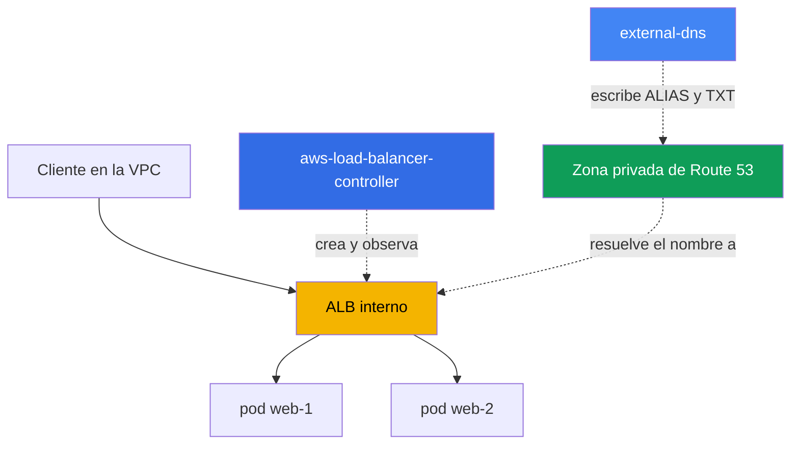
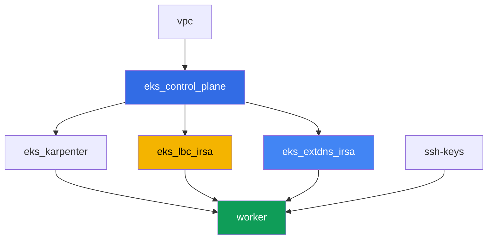

[Русская версия](README_RU.MD) · [Eng version](README.MD) · [Version française](README_FR.MD) · [Deutsche Version](README_DE.MD) · [ქართული ვერსია](README_GE.MD) · [繁體中文版](README_TW.MD) · [日本語版](README_JP.MD)

# Lab 109 - Ingress a través de ALB con un certificado ACM, external-dns y Route 53

## Descripción

Aquí se junta todo el punto de entrada L7: un Ingress crea un Application Load Balancer
mediante el AWS Load Balancer Controller (LBC), al ALB se le adjunta un certificado TLS
desde ACM, y external-dns configura el nombre DNS externo del ALB en una zona privada de
Route 53. Recorrerás todo el camino - desde un Ingress desnudo sin dirección hasta un
punto de entrada HTTPS funcional con un registro DNS y un marcador TXT de propiedad - y
también trabajarás sobre un síntoma típico en el que el Ingress no produce un ALB.

No necesitas un dominio público real propio para este laboratorio: la zona privada la
crea el terraform del laboratorio y queda asociada a la VPC, y el certificado es
autofirmado, importado a ACM. Esto no reduce el valor de las tareas: las anotaciones del
ALB, la mecánica de `certificate-arn`, `listen-ports`, `ssl-redirect`, IngressGroup, y los
registros de external-dns funcionan igual tanto para el caso privado como para el
público.

Las tareas están escritas en estilo de producción: un enunciado breve más criterios de
aceptación. La verificación es automática, mediante el comando `check_result`.

## Objetivo

Refuerza el material de estos capítulos del curso:

- [Capítulo 27. Ingress a través de ALB: target-type, anotaciones, TLS y ACM, WAF](../../course/27/ru.md)
- [Capítulo 29. DNS y certificados: external-dns, Route 53, cert-manager](../../course/29/ru.md)

## Qué vamos a crear

El clúster ya está desplegado como código (control plane, Fargate para los pods de
sistema, Karpenter para la carga de trabajo). Terraform también crea una zona privada y
un certificado autofirmado en ACM. Instalas LBC y external-dns y construyes todo el punto
de entrada alrededor de ellos.

| Objeto | Qué es | Por qué está en este laboratorio |
|--------|---------|-------------------|
| Namespace `eks-109` | una sección del clúster para la carga del laboratorio | mantiene los recursos separados de los de sistema |
| Zona privada de Route 53 `eks-task109.internal` | creada por terraform, asociada a la VPC del laboratorio | la zona en la que escribe external-dns |
| Certificado ACM (autofirmado) | creado por terraform mediante `tls_self_signed_cert` + import | `certificate-arn` para el listener HTTPS del ALB |
| Deployment `web` (2 réplicas) + Service `web` | aplicación ping_pong | la carga de trabajo que publica el Ingress |
| ServiceAccount + Deployment `aws-load-balancer-controller` | chart de Helm, rol mediante IRSA | crea un ALB a partir del Ingress |
| Ingress `web` | `ingressClassName: alb`, TLS, IngressGroup | el propio punto de entrada: ALB, HTTPS, nombre DNS |
| ServiceAccount + Deployment `external-dns` | chart de Helm, rol mediante IRSA | sincroniza los registros ALIAS y TXT en Route 53 |

La imagen resultante del tráfico y el DNS:



## Infraestructura

El entorno se despliega en AWS (`eu-central-1`) mediante Terragrunt. Cada carpeta del
laboratorio es un componente con su propio `terragrunt.hcl`, que hace referencia a un
módulo compartido en `terraform/modules/` y declara sus dependencias mediante bloques
`dependency`.

### Módulos y dependencias

| Carpeta (componente) | Módulo (`terraform/modules/`) | Depende de | Qué crea |
|---------------------|-------------------------------|------------|-------------|
| `vpc` | `vpc_v3` | - | VPC `10.10.0.0/16`, subredes en dos AZ, NAT |
| `ssh-keys` | `ssh-keys` | - | un par de claves SSH para la máquina de trabajo |
| `eks_control_plane` | `eks_v2_control_plane` | `vpc` | control plane de EKS `1.36`, proveedor OIDC |
| `eks_fargate_system` | `eks_v2_fargate` | `vpc`, `eks_control_plane` | perfil de Fargate para `kube-system` y `karpenter` |
| `eks_addons` | `eks_v2_addons` | `eks_control_plane`, `eks_fargate_system` | coredns, kube-proxy, vpc-cni, pod-identity |
| `eks_karpenter` | `eks_v2_karpenter` | `vpc`, `eks_control_plane`, `eks_addons`, `eks_fargate_system` | controlador de Karpenter, rol IAM de los nodos |
| `eks_karpenter_default_vng` | `eks_v2_karpenter_vng` | `vpc`, `eks_control_plane`, `eks_karpenter` | NodePool por defecto sobre AL2023 |
| `eks_lbc_irsa` | `eks_v2_lbc_irsa` | `eks_control_plane` | rol IAM IRSA para el AWS Load Balancer Controller |
| `eks_extdns_irsa` | `eks_v2_extdns_irsa` | `vpc`, `eks_control_plane` | rol IAM IRSA para external-dns, zona privada, certificado ACM autofirmado |
| `worker` | `eks_v2_work_pc` | `ssh-keys`, `vpc`, `eks_control_plane`, `eks_karpenter`, `eks_lbc_irsa`, `eks_extdns_irsa` | máquina de trabajo con kubectl, tests y `check_result` |

El módulo `eks_v2_extdns_irsa` es nuevo para este laboratorio, inspirado en
`eks_v2_lbc_irsa` y `eks_v2_ebs_irsa` (`var.tf`, `locals.tf`, `data.tf`, `aws.tf`,
`cmdb.tf`, `iam_irsa.tf`, `output.tf`, `versions.tf`). También crea una
`aws_route53_zone` (privada, asociada a la VPC) y un `aws_acm_certificate` a partir de un
certificado autofirmado generado por el proveedor `tls` (`tls_private_key` +
`tls_self_signed_cert`). El rol IAM confía en el OIDC del clúster con una condición `sub`
sobre `system:serviceaccount:kube-system:external-dns` y lleva una política mínima de
external-dns (`route53:ChangeResourceRecordSets`, `ListResourceRecordSets`,
`ListTagsForResources` sobre las zonas, `ListHostedZones` sobre `*`).

Grafo de dependencias (lo que se aplica antes está más abajo en la flecha):



Los componentes `eks_fargate_system`, `eks_addons`, `eks_karpenter_default_vng` no se
incluyen en el grafo anterior por claridad (no más de 8 nodos) - se aplican en el orden
estándar entre `eks_control_plane` y `eks_karpenter`, como en el laboratorio 101.

### Dónde se configura cada cosa

`env.hcl` (parámetros comunes del entorno):

| Parámetro | Valor en el laboratorio | Qué afecta |
|----------|-----------------|---------------|
| `region` | `eu-central-1` | región de todos los recursos |
| `vpc_default_cidr`, `subnets` | `10.10.0.0/16`, subredes por AZ | plan de direcciones de la VPC |
| `prefix` | `eks-task109` | prefijo de nombres de recursos y etiquetas |
| `stack_name` | `eks109` | con él se construye `env_name` - el nombre del clúster |
| `zone_domain` | `eks-task109.internal` | nombre de la zona privada de Route 53 |
| `cert_common_name` | `app.eks-task109.internal` | Common Name del certificado ACM autofirmado |
| `k8_version` | `1.36.0` | versión de kubectl en la máquina de trabajo |
| `instance_type_worker` | `t3.medium` | tipo de instancia de la máquina de trabajo |
| `ssh_password_enable`, `access_cidrs` | `true`, `0.0.0.0/0` | acceso SSH a la máquina de trabajo |

`inputs` en el `terragrunt.hcl` de cada componente:

| Archivo | Ajustes clave |
|------|--------------------|
| `eks_control_plane/terragrunt.hcl` | `eks.version = "1.36"`, subredes para el control plane y los nodos |
| `eks_lbc_irsa/terragrunt.hcl` | `name` (clúster) y `oidc_provider_arn` para la política de confianza del rol LBC |
| `eks_extdns_irsa/terragrunt.hcl` | `name`, `oidc_provider_arn`, `vpc_id`, `zone_domain`, `cert_common_name` |
| `worker/terragrunt.hcl` | `test_url`, `task_script_url` apuntando a los archivos del laboratorio 109; dependencias en `eks_lbc_irsa` y `eks_extdns_irsa` |

## Despliegue

```bash
TASK=109 make run_eks_task
```

El despliegue tarda aproximadamente 15-20 minutos. En la salida, busca la línea con la
conexión SSH a la máquina de trabajo y conéctate a ella. kubectl ya está configurado allí
para el clúster correcto.

Comandos útiles en la máquina de trabajo:

```bash
time_left       # cuánto tiempo queda del entorno
check_result    # verificar la solución
```

> Seguridad del entorno. En `env.hcl` están activados `ssh_password_enable = true` y
> `access_cidrs = ["0.0.0.0/0"]` - cómodo para un entorno de formación, pero no es algo que
> se deba hacer en producción. Según los estándares del curso (capítulos 0.2, 2, 19), el
> acceso a las máquinas de trabajo se abre mediante AWS SSM Session Manager sin exponer
> puertos SSH públicos, y `access_cidrs` debe restringirse a direcciones concretas. Aquí se
> deja SSH público solo para simplificar el montaje.

## Tareas

---
|        **1**        | **Namespace, Service y la carga de trabajo ping_pong**                  |
| :-----------------: | :---------------------------------------------------------- |
| Qué hacemos          | Crea el namespace `eks-109`. Dentro de él, despliega un Deployment `web`, imagen `viktoruj/ping_pong:latest`, `2` réplicas, puerto de contenedor `8080`. Crea un Service `web` de tipo `ClusterIP` con puerto `80`, `targetPort: 8080`, selector `app: web`. Espera a que haya `2` réplicas listas. |
| Criterios de aceptación    | - el namespace `eks-109` existe;<br/>- Deployment `web` con imagen `viktoruj/ping_pong` y `2` réplicas listas;<br/>- Service `web` de tipo `ClusterIP` en el puerto `80`. |
---
|        **2**        | **ServiceAccount e instalación del AWS Load Balancer Controller**  |
| :-----------------: | :---------------------------------------------------------- |
| Qué hacemos          | Encuentra el ARN del rol IAM creado por terraform para el controlador (nombre del rol `<cluster-name>-lbc-irsa`), y crea un ServiceAccount `aws-load-balancer-controller` en `kube-system` con la anotación `eks.amazonaws.com/role-arn` apuntando a este rol. Instala el AWS Load Balancer Controller mediante Helm (repositorio `https://aws.github.io/eks-charts`, chart `aws-load-balancer-controller`) con los flags `--set serviceAccount.create=false --set serviceAccount.name=aws-load-balancer-controller` y `--set clusterName=<nombre del clúster>`. Espera a que haya una réplica lista del Deployment `aws-load-balancer-controller`. |
| Criterios de aceptación    | - ServiceAccount `aws-load-balancer-controller` en `kube-system` con una anotación que apunta al rol `lbc-irsa`;<br/>- Deployment `aws-load-balancer-controller` en `kube-system` tiene al menos una réplica lista. |
---
|        **3**        | **Ingress a través de ALB: internal, target-type ip**              |
| :-----------------: | :---------------------------------------------------------- |
| Qué hacemos          | Crea el Ingress `web` en el namespace `eks-109` con `ingressClassName: alb`, anotaciones `alb.ingress.kubernetes.io/scheme: internal`, `alb.ingress.kubernetes.io/target-type: ip`, `alb.ingress.kubernetes.io/group.name: eks-task109-web`, una regla con `host: app.eks-task109.internal`, path `/` hacia el Service `web` puerto `80`. Espera a que aparezca una dirección (`kubectl get ingress web -n eks-109 -w`). Con `aws elbv2 describe-load-balancers` y `aws elbv2 describe-listeners`, confirma un balanceador de `Type: application`, `Scheme: internal`, y un listener en `80`, guarda ambas salidas en `/var/work/tests/artifacts/3/alb.txt`. |
| Criterios de aceptación    | - Ingress `web` con `ingressClassName: alb` y una dirección en `status.loadBalancer.ingress[0].hostname`;<br/>- el archivo `alb.txt` no está vacío, contiene `"Type": "application"`, `"Scheme": "internal"`, y `"Port": 80`. |
---
|        **4**        | **TLS: certificado ACM, listener HTTPS, redirección**             |
| :-----------------: | :---------------------------------------------------------- |
| Qué hacemos          | Encuentra el ARN del certificado autofirmado creado por terraform (`aws acm list-certificates`, dominio `app.eks-task109.internal`). Añade al Ingress `web` las anotaciones `alb.ingress.kubernetes.io/certificate-arn` (este ARN), `alb.ingress.kubernetes.io/listen-ports: '[{"HTTP": 80}, {"HTTPS": 443}]'`, `alb.ingress.kubernetes.io/ssl-redirect: '443'`, y `spec.tls` con `hosts: ["app.eks-task109.internal"]`. Con `aws elbv2 describe-listeners`, confirma que ha aparecido un listener en `443` con protocolo `HTTPS` y el `CertificateArn` indicado, guarda la salida en `/var/work/tests/artifacts/4/https.txt`. |
| Criterios de aceptación    | - Ingress `web` tiene la anotación `certificate-arn` y `spec.tls` con el host correcto;<br/>- el archivo `https.txt` no está vacío y contiene `"Protocol": "HTTPS"` y `"Port": 443`. |
---
|        **5**        | **external-dns: ALIAS y TXT en la zona privada**         |
| :-----------------: | :---------------------------------------------------------- |
| Qué hacemos          | Encuentra el ARN del rol IAM `<cluster-name>-extdns-irsa` y el ID de la zona privada `eks-task109.internal` (`aws route53 list-hosted-zones-by-name`). Crea un ServiceAccount `external-dns` en `kube-system` con una anotación que apunte al rol, luego instala external-dns mediante Helm (repositorio `https://kubernetes-sigs.github.io/external-dns/`, chart `external-dns`) con `provider.name: aws`, `policy: upsert-only`, `registry: txt`, un `txtOwnerId` único, `domainFilters: [eks-task109.internal]`, `sources: [ingress]`, `extraArgs.aws-zone-type: private`, `serviceAccount.create: false`, `serviceAccount.name: external-dns`. Espera a que aparezcan los registros y guarda `aws route53 list-resource-record-sets` de esta zona en `/var/work/tests/artifacts/5/dns.txt`. |
| Criterios de aceptación    | - Deployment `external-dns` en `kube-system` con al menos una réplica lista;<br/>- el archivo `dns.txt` no está vacío, contiene un registro `app.eks-task109.internal` de tipo `A` (ALIAS) y un registro TXT de propiedad. |
---
|        **6**        | **Diagnóstico: ingressClassName incorrecto e IngressGroup**     |
| :-----------------: | :---------------------------------------------------------- |
| Qué hacemos          | Crea un `IngressClass` llamado `wrong-class` con `spec.controller: example.com/not-alb` (se necesita un objeto real porque el admission webhook de LBC rechaza un Ingress que referencia una clase inexistente), y luego un segundo Ingress `status` en `eks-109` con `ingressClassName: wrong-class` (path `/status` hacia el Service `web` puerto `80`). Confirma que no tiene dirección (LBC solo observa las clases con controlador `ingress.k8s.aws/alb`), y describe el motivo en `/var/work/tests/artifacts/6/groupfix.txt`. Después corrígelo: fija `ingressClassName: alb`, añade `alb.ingress.kubernetes.io/scheme: internal`, `alb.ingress.kubernetes.io/target-type: ip`, `alb.ingress.kubernetes.io/group.name: eks-task109-web` (el mismo nombre de grupo que el Ingress `web`) y `group.order: '10'`. Espera a que aparezca una dirección y añade al mismo archivo que la dirección de `status` coincide con la dirección de `web` - ambos Ingress comparten un mismo ALB a través del IngressGroup. |
| Criterios de aceptación    | - el archivo `groupfix.txt` no está vacío, contiene `ingressClassName` y `wrong-class` (explicación del síntoma);<br/>- el Ingress `status` después de la corrección tiene `ingressClassName: alb` y la misma dirección que el Ingress `web` (`status.loadBalancer.ingress[0].hostname`). |
---

## Verificación del resultado

En la máquina de trabajo, ejecuta la verificación automática:

```bash
check_result
```

El script ejecutará los tests y mostrará el porcentaje de tareas completadas.

## Solución

Solución de referencia: [worker/files/solutions/1_ES.MD](worker/files/solutions/1_ES.MD)

## Eliminación del clúster y los recursos

> Antes de eliminar. Los Ingress `web` y `status` crearon un ALB real y dos security
> groups directamente a través de la API de ELBv2/EC2 (AWS Load Balancer Controller) -
> nada de esto está en el estado de terraform. Elimina los Ingress y deja que el propio
> LBC llame a la API de AWS para eliminar el ALB y los SG (un finalizer no permitirá que
> los objetos se eliminen de etcd hasta que LBC confirme la limpieza):
>
> ```bash
> kubectl delete ingress web status -n eks-109
> kubectl wait --for=delete ingress/web ingress/status -n eks-109 --timeout=120s
> ```
>
> external-dns de la tarea 5 NO eliminará los registros `A`/`AAAA`/`TXT` por sí mismo: el
> modo `policy: upsert-only` que fijaste explícitamente al instalarlo es un modo
> deliberado de "solo crear y actualizar", sin eliminación - un comportamiento
> documentado del proyecto (protección contra la pérdida accidental de registros DNS
> cuando el controlador se reinicia). Elimínalos manualmente mediante la AWS CLI - de lo
> contrario la zona conservará registros además de `NS`/`SOA`, y terraform no podrá
> eliminar la propia zona:
>
> ```bash
> ZONE_ID=$(aws route53 list-hosted-zones-by-name --dns-name eks-task109.internal \
>   --query "HostedZones[0].Id" --output text)
> aws route53 change-resource-record-sets --hosted-zone-id "$ZONE_ID" --change-batch '{
>   "Changes": [
>     {"Action": "DELETE", "ResourceRecordSet": {"Name": "app.eks-task109.internal.", "Type": "A", "AliasTarget": {"HostedZoneId": "<CanonicalHostedZoneId ALB>", "DNSName": "<DNSName ALB>.", "EvaluateTargetHealth": true}}},
>     {"Action": "DELETE", "ResourceRecordSet": {"Name": "app.eks-task109.internal.", "Type": "AAAA", "AliasTarget": {"HostedZoneId": "<CanonicalHostedZoneId ALB>", "DNSName": "<DNSName ALB>.", "EvaluateTargetHealth": true}}},
>     {"Action": "DELETE", "ResourceRecordSet": {"Name": "aaaa-app.eks-task109.internal.", "Type": "TXT", "TTL": 300, "ResourceRecords": [{"Value": "\"heritage=external-dns,external-dns/owner=eks-task109,external-dns/resource=ingress/eks-109/web\""}]}},
>     {"Action": "DELETE", "ResourceRecordSet": {"Name": "cname-app.eks-task109.internal.", "Type": "TXT", "TTL": 300, "ResourceRecords": [{"Value": "\"heritage=external-dns,external-dns/owner=eks-task109,external-dns/resource=ingress/eks-109/web\""}]}}
>   ]
> }'
> # más simple: comprueba los valores exactos antes de eliminar y sustitúyelos arriba
> aws route53 list-resource-record-sets --hosted-zone-id "$ZONE_ID"
> ```
>
> Asegúrate de eliminar los Ingress ANTES de `terragrunt destroy`. Si el control plane se
> elimina antes que ellos, el ALB y sus SG quedarán huérfanos (retienen ENIs en las
> subredes - la VPC y el Internet Gateway se quedarán colgados en `Still
> destroying...`), y LBC ya no podrá ayudar - la limpieza manual mediante la AWS CLI será
> la única opción que queda:
>
> ```bash
> VPC_ID=<ID de la VPC de este laboratorio>
> LB_ARN=$(aws elbv2 describe-load-balancers \
>   --query "LoadBalancers[?contains(LoadBalancerName,'eks109')].LoadBalancerArn" --output text)
> aws elbv2 delete-load-balancer --load-balancer-arn "$LB_ARN"
> # espera hasta que los ENIs en las subredes se liberen, luego elimina los SG restantes:
> aws ec2 describe-security-groups --filters "Name=vpc-id,Values=$VPC_ID" \
>   --query "SecurityGroups[?GroupName!='default'].GroupId" --output text | \
>   xargs -n1 aws ec2 delete-security-group --group-id
> ```

```bash
TASK=109 make delete_eks_task
```
