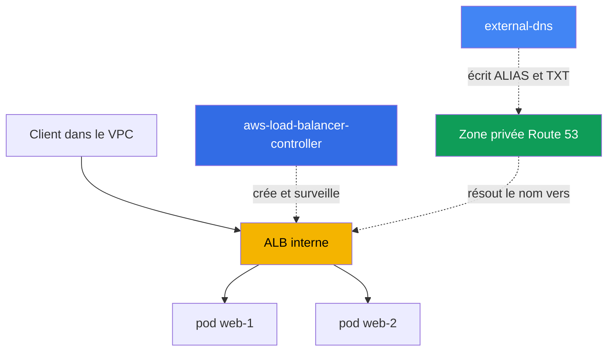
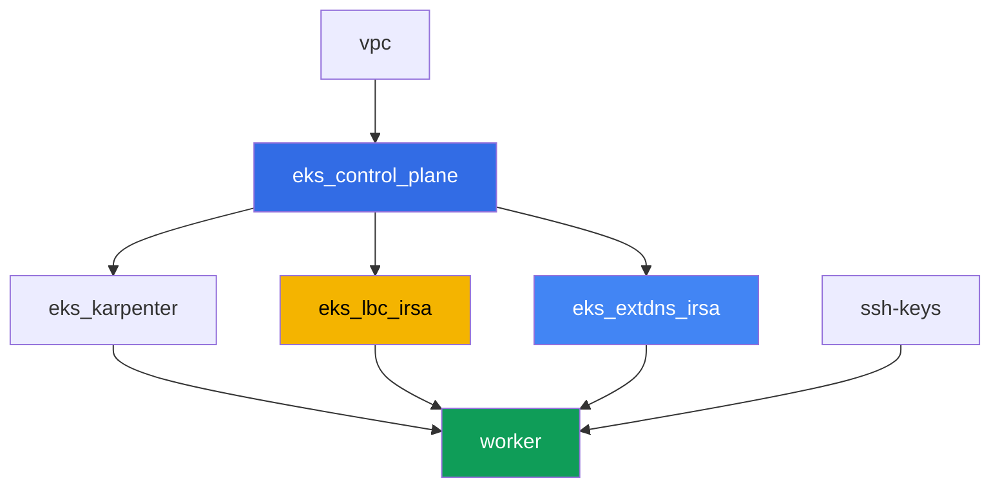

[Русская версия](README_RU.MD) · [Eng version](README.MD) · [Versión en español](README_ES.MD) · [Deutsche Version](README_DE.MD) · [ქართული ვერსია](README_GE.MD) · [繁體中文版](README_TW.MD) · [日本語版](README_JP.MD)

# Lab 109 - Ingress via ALB avec un certificat ACM, external-dns et Route 53

## Description

Ici, tout le point d'entrée L7 se met en place : un Ingress crée un Application Load
Balancer via l'AWS Load Balancer Controller (LBC), l'ALB reçoit un certificat TLS attaché
depuis ACM, et external-dns configure le nom DNS externe de l'ALB dans une zone hébergée
Route 53 privée. Vous allez parcourir tout le chemin - d'un Ingress nu sans adresse jusqu'à
un point d'entrée HTTPS fonctionnel avec un enregistrement DNS et un marqueur TXT de
propriété - et vous traiterez aussi un symptôme typique où l'Ingress ne produit pas d'ALB.

Vous n'avez pas besoin d'un vrai domaine public pour ce laboratoire : la zone hébergée
privée est créée par le terraform du laboratoire et attachée au VPC, et le certificat est
auto-signé, importé dans ACM. Cela ne réduit pas la valeur des tâches : les annotations
ALB, la mécanique de `certificate-arn`, `listen-ports`, `ssl-redirect`, IngressGroup, et
les enregistrements external-dns fonctionnent de la même façon pour le cas privé et pour
le cas public.

Les tâches sont écrites dans un style de production : un énoncé court plus des critères
d'acceptation. La vérification est automatique, via la commande `check_result`.

## Objectif

Consolider le contenu des chapitres suivants du cours :

- [Chapitre 27. Ingress via ALB : target-type, annotations, TLS et ACM, WAF](../../course/27/ru.md)
- [Chapitre 29. DNS et certificats : external-dns, Route 53, cert-manager](../../course/29/ru.md)

## Ce que nous créons

Le cluster est déjà déployé en tant que code (control plane, Fargate pour les pods
système, Karpenter pour la charge de travail). Terraform crée aussi une zone hébergée
privée et un certificat auto-signé dans ACM. Vous installez LBC et external-dns et
construisez tout le point d'entrée autour d'eux.

| Objet | Ce que c'est | Pourquoi dans ce laboratoire |
|--------|---------|-------------------|
| Namespace `eks-109` | une section du cluster pour la charge du laboratoire | garde les ressources séparées de celles du système |
| Zone privée Route 53 `eks-task109.internal` | créée par terraform, attachée au VPC du laboratoire | la zone dans laquelle external-dns écrit |
| Certificat ACM (auto-signé) | créé par terraform via `tls_self_signed_cert` + import | `certificate-arn` pour le listener HTTPS de l'ALB |
| Deployment `web` (2 réplicas) + Service `web` | l'application ping_pong | la charge de travail que l'Ingress publie |
| ServiceAccount + Deployment `aws-load-balancer-controller` | chart Helm, rôle via IRSA | crée un ALB à partir de l'Ingress |
| Ingress `web` | `ingressClassName: alb`, TLS, IngressGroup | le point d'entrée lui-même : ALB, HTTPS, nom DNS |
| ServiceAccount + Deployment `external-dns` | chart Helm, rôle via IRSA | synchronise les enregistrements ALIAS et TXT dans Route 53 |

Le schéma final du trafic et du DNS :



## Infrastructure

L'environnement est déployé sur AWS (`eu-central-1`) via Terragrunt. Chaque dossier du
laboratoire est un composant avec son propre `terragrunt.hcl`, qui référence un module
partagé dans `terraform/modules/` et déclare ses dépendances via des blocs `dependency`.

### Modules et dépendances

| Dossier (composant) | Module (`terraform/modules/`) | Dépend de | Ce qu'il crée |
|---------------------|-------------------------------|------------|-------------|
| `vpc` | `vpc_v3` | - | VPC `10.10.0.0/16`, sous-réseaux dans deux AZ, NAT |
| `ssh-keys` | `ssh-keys` | - | une paire de clés SSH pour la machine de travail |
| `eks_control_plane` | `eks_v2_control_plane` | `vpc` | control plane EKS `1.36`, fournisseur OIDC |
| `eks_fargate_system` | `eks_v2_fargate` | `vpc`, `eks_control_plane` | profil Fargate pour `kube-system` et `karpenter` |
| `eks_addons` | `eks_v2_addons` | `eks_control_plane`, `eks_fargate_system` | coredns, kube-proxy, vpc-cni, pod-identity |
| `eks_karpenter` | `eks_v2_karpenter` | `vpc`, `eks_control_plane`, `eks_addons`, `eks_fargate_system` | contrôleur Karpenter, rôle IAM des nœuds |
| `eks_karpenter_default_vng` | `eks_v2_karpenter_vng` | `vpc`, `eks_control_plane`, `eks_karpenter` | NodePool par défaut sur AL2023 |
| `eks_lbc_irsa` | `eks_v2_lbc_irsa` | `eks_control_plane` | rôle IAM IRSA pour l'AWS Load Balancer Controller |
| `eks_extdns_irsa` | `eks_v2_extdns_irsa` | `vpc`, `eks_control_plane` | rôle IAM IRSA pour external-dns, zone hébergée privée, certificat ACM auto-signé |
| `worker` | `eks_v2_work_pc` | `ssh-keys`, `vpc`, `eks_control_plane`, `eks_karpenter`, `eks_lbc_irsa`, `eks_extdns_irsa` | machine de travail avec kubectl, tests et `check_result` |

Le module `eks_v2_extdns_irsa` est nouveau pour ce laboratoire, conçu sur le modèle de
`eks_v2_lbc_irsa` et `eks_v2_ebs_irsa` (`var.tf`, `locals.tf`, `data.tf`, `aws.tf`,
`cmdb.tf`, `iam_irsa.tf`, `output.tf`, `versions.tf`). Il crée aussi une
`aws_route53_zone` (privée, attachée au VPC) et un `aws_acm_certificate` à partir d'un
certificat auto-signé généré par le provider `tls` (`tls_private_key` +
`tls_self_signed_cert`). Le rôle IAM fait confiance à l'OIDC du cluster avec une condition
`sub` sur `system:serviceaccount:kube-system:external-dns` et porte une politique minimale
pour external-dns (`route53:ChangeResourceRecordSets`, `ListResourceRecordSets`,
`ListTagsForResources` sur les zones, `ListHostedZones` sur `*`).

Graphe de dépendances (ce qui est appliqué en premier est plus bas dans la flèche) :



Les composants `eks_fargate_system`, `eks_addons`, `eks_karpenter_default_vng` ne
figurent pas dans le graphe ci-dessus pour la lisibilité (pas plus de 8 nœuds) - ils sont
appliqués dans l'ordre standard entre `eks_control_plane` et `eks_karpenter`, comme dans
le laboratoire 101.

### Où chaque chose est configurée

`env.hcl` (paramètres communs de l'environnement) :

| Paramètre | Valeur dans le laboratoire | Ce qu'il affecte |
|----------|-----------------|---------------|
| `region` | `eu-central-1` | région de toutes les ressources |
| `vpc_default_cidr`, `subnets` | `10.10.0.0/16`, sous-réseaux par AZ | plan d'adressage du VPC |
| `prefix` | `eks-task109` | préfixe des noms de ressources et des tags |
| `stack_name` | `eks109` | permet de construire `env_name`, le nom du cluster |
| `zone_domain` | `eks-task109.internal` | nom de la zone hébergée privée Route 53 |
| `cert_common_name` | `app.eks-task109.internal` | Common Name du certificat ACM auto-signé |
| `k8_version` | `1.36.0` | version de kubectl sur la machine de travail |
| `instance_type_worker` | `t3.medium` | type d'instance de la machine de travail |
| `ssh_password_enable`, `access_cidrs` | `true`, `0.0.0.0/0` | accès SSH à la machine de travail |

`inputs` dans le `terragrunt.hcl` de chaque composant :

| Fichier | Réglages clés |
|------|--------------------|
| `eks_control_plane/terragrunt.hcl` | `eks.version = "1.36"`, sous-réseaux pour le control plane et les nœuds |
| `eks_lbc_irsa/terragrunt.hcl` | `name` (cluster) et `oidc_provider_arn` pour la trust policy du rôle LBC |
| `eks_extdns_irsa/terragrunt.hcl` | `name`, `oidc_provider_arn`, `vpc_id`, `zone_domain`, `cert_common_name` |
| `worker/terragrunt.hcl` | `test_url`, `task_script_url` pointant vers les fichiers du laboratoire 109 ; dépendances sur `eks_lbc_irsa` et `eks_extdns_irsa` |

## Déploiement

```bash
TASK=109 make run_eks_task
```

Le déploiement prend environ 15 à 20 minutes. Dans la sortie, repérez la ligne avec la
connexion SSH vers la machine de travail et connectez-vous. kubectl y est déjà configuré
pour le bon cluster.

Commandes utiles sur la machine de travail :

```bash
time_left       # temps restant de l'environnement
check_result    # vérifier la solution
```

> Sécurité de l'environnement. Dans `env.hcl`, `ssh_password_enable = true` et
> `access_cidrs = ["0.0.0.0/0"]` sont activés - pratique pour un environnement de
> formation, mais à ne pas faire en production. Selon les standards du cours (chapitres
> 0.2, 2, 19), l'accès aux machines de travail doit passer par AWS SSM Session Manager
> sans exposer de port SSH public, et `access_cidrs` doit être restreint à des adresses
> précises. Ici, le SSH public est laissé uniquement pour simplifier la configuration.

## Tâches

---
|        **1**        | **Namespace, Service et la charge de travail ping_pong**                  |
| :-----------------: | :---------------------------------------------------------- |
| Ce qu'on fait          | Créez le namespace `eks-109`. À l'intérieur, déployez un Deployment `web`, image `viktoruj/ping_pong:latest`, `2` réplicas, port de conteneur `8080`. Créez un Service `web` de type `ClusterIP` avec le port `80`, `targetPort: 8080`, sélecteur `app: web`. Attendez `2` réplicas prêts. |
| Critères d'acceptation    | - le namespace `eks-109` existe ;<br/>- Deployment `web` avec l'image `viktoruj/ping_pong` et `2` réplicas prêts ;<br/>- Service `web` de type `ClusterIP` sur le port `80`. |
---
|        **2**        | **ServiceAccount et installation de l'AWS Load Balancer Controller**  |
| :-----------------: | :---------------------------------------------------------- |
| Ce qu'on fait          | Trouvez l'ARN du rôle IAM créé par terraform pour le contrôleur (nom du rôle `<cluster-name>-lbc-irsa`), et créez un ServiceAccount `aws-load-balancer-controller` dans `kube-system` avec l'annotation `eks.amazonaws.com/role-arn` pointant vers ce rôle. Installez l'AWS Load Balancer Controller via Helm (dépôt `https://aws.github.io/eks-charts`, chart `aws-load-balancer-controller`) avec les flags `--set serviceAccount.create=false --set serviceAccount.name=aws-load-balancer-controller` et `--set clusterName=<cluster name>`. Attendez une réplica prête du Deployment `aws-load-balancer-controller`. |
| Critères d'acceptation    | - ServiceAccount `aws-load-balancer-controller` dans `kube-system` avec une annotation pointant vers le rôle `lbc-irsa` ;<br/>- Deployment `aws-load-balancer-controller` dans `kube-system` a au moins une réplica prête. |
---
|        **3**        | **Ingress via ALB : internal, target-type ip**              |
| :-----------------: | :---------------------------------------------------------- |
| Ce qu'on fait          | Créez l'Ingress `web` dans le namespace `eks-109` avec `ingressClassName: alb`, les annotations `alb.ingress.kubernetes.io/scheme: internal`, `alb.ingress.kubernetes.io/target-type: ip`, `alb.ingress.kubernetes.io/group.name: eks-task109-web`, une règle avec `host: app.eks-task109.internal`, chemin `/` vers le Service `web` port `80`. Attendez une adresse (`kubectl get ingress web -n eks-109 -w`). Avec `aws elbv2 describe-load-balancers` et `aws elbv2 describe-listeners`, confirmez un load balancer de `Type: application`, `Scheme: internal`, et un listener sur `80`, enregistrez les deux sorties dans `/var/work/tests/artifacts/3/alb.txt`. |
| Critères d'acceptation    | - Ingress `web` avec `ingressClassName: alb` et une adresse dans `status.loadBalancer.ingress[0].hostname` ;<br/>- le fichier `alb.txt` n'est pas vide, contient `"Type": "application"`, `"Scheme": "internal"`, et `"Port": 80`. |
---
|        **4**        | **TLS : certificat ACM, listener HTTPS, redirection**             |
| :-----------------: | :---------------------------------------------------------- |
| Ce qu'on fait          | Trouvez l'ARN du certificat auto-signé créé par terraform (`aws acm list-certificates`, domaine `app.eks-task109.internal`). Ajoutez à l'Ingress `web` les annotations `alb.ingress.kubernetes.io/certificate-arn` (cet ARN), `alb.ingress.kubernetes.io/listen-ports: '[{"HTTP": 80}, {"HTTPS": 443}]'`, `alb.ingress.kubernetes.io/ssl-redirect: '443'`, et `spec.tls` avec `hosts: ["app.eks-task109.internal"]`. Avec `aws elbv2 describe-listeners`, confirmez qu'un listener sur `443` avec le protocole `HTTPS` et le `CertificateArn` indiqué est apparu, enregistrez la sortie dans `/var/work/tests/artifacts/4/https.txt`. |
| Critères d'acceptation    | - l'Ingress `web` a l'annotation `certificate-arn` et `spec.tls` avec le bon host ;<br/>- le fichier `https.txt` n'est pas vide et contient `"Protocol": "HTTPS"` et `"Port": 443`. |
---
|        **5**        | **external-dns : ALIAS et TXT dans la zone hébergée privée**         |
| :-----------------: | :---------------------------------------------------------- |
| Ce qu'on fait          | Trouvez l'ARN du rôle IAM `<cluster-name>-extdns-irsa` et l'ID de la zone hébergée privée `eks-task109.internal` (`aws route53 list-hosted-zones-by-name`). Créez un ServiceAccount `external-dns` dans `kube-system` avec une annotation pointant vers le rôle, puis installez external-dns via Helm (dépôt `https://kubernetes-sigs.github.io/external-dns/`, chart `external-dns`) avec `provider.name: aws`, `policy: upsert-only`, `registry: txt`, un `txtOwnerId` unique, `domainFilters: [eks-task109.internal]`, `sources: [ingress]`, `extraArgs.aws-zone-type: private`, `serviceAccount.create: false`, `serviceAccount.name: external-dns`. Attendez que les enregistrements apparaissent et enregistrez `aws route53 list-resource-record-sets` pour cette zone dans `/var/work/tests/artifacts/5/dns.txt`. |
| Critères d'acceptation    | - Deployment `external-dns` dans `kube-system` avec au moins une réplica prête ;<br/>- le fichier `dns.txt` n'est pas vide, contient un enregistrement `app.eks-task109.internal` de type `A` (ALIAS) et un enregistrement TXT de propriété. |
---
|        **6**        | **Diagnostic : ingressClassName erroné et IngressGroup**     |
| :-----------------: | :---------------------------------------------------------- |
| Ce qu'on fait          | Créez un `IngressClass` `wrong-class` avec `spec.controller: example.com/not-alb` (un objet réel est nécessaire car le webhook d'admission de LBC rejette un Ingress qui référence une classe inexistante), puis un deuxième Ingress `status` dans `eks-109` avec `ingressClassName: wrong-class` (chemin `/status` vers le Service `web` port `80`). Confirmez qu'il n'a pas d'adresse (LBC ne surveille que les classes avec le controller `ingress.k8s.aws/alb`), et décrivez la raison dans `/var/work/tests/artifacts/6/groupfix.txt`. Corrigez ensuite : définissez `ingressClassName: alb`, ajoutez `alb.ingress.kubernetes.io/scheme: internal`, `alb.ingress.kubernetes.io/target-type: ip`, `alb.ingress.kubernetes.io/group.name: eks-task109-web` (le même nom de groupe que l'Ingress `web`) et `group.order: '10'`. Attendez une adresse et ajoutez dans le même fichier que l'adresse de `status` correspond à celle de `web` - les deux Ingress partagent un seul ALB via l'IngressGroup. |
| Critères d'acceptation    | - le fichier `groupfix.txt` n'est pas vide, contient `ingressClassName` et `wrong-class` (explication du symptôme) ;<br/>- l'Ingress `status` après correction a `ingressClassName: alb` et la même adresse que l'Ingress `web` (`status.loadBalancer.ingress[0].hostname`). |
---

## Vérification du résultat

Sur la machine de travail, lancez la vérification automatique :

```bash
check_result
```

Le script exécutera les tests et affichera le pourcentage de tâches accomplies.

## Solution

Solution de référence : [worker/files/solutions/1_FR.MD](worker/files/solutions/1_FR.MD)

## Suppression du cluster et des ressources

> Avant de supprimer. Les Ingress `web` et `status` ont créé un vrai ALB et deux security
> groups directement via l'API ELBv2/EC2 (AWS Load Balancer Controller) - rien de tout
> cela n'est dans le state terraform. Supprimez les Ingress et laissez LBC lui-même
> appeler l'API AWS pour supprimer l'ALB et les SG (un finalizer empêchera la suppression
> des objets d'etcd jusqu'à ce que LBC confirme le nettoyage) :
>
> ```bash
> kubectl delete ingress web status -n eks-109
> kubectl wait --for=delete ingress/web ingress/status -n eks-109 --timeout=120s
> ```
>
> external-dns de la tâche 5 ne supprimera PAS les enregistrements `A`/`AAAA`/`TXT` de
> lui-même : la `policy: upsert-only` que vous avez explicitement définie à
> l'installation est un mode délibéré « création et mise à jour uniquement », sans
> suppression - un comportement documenté du projet (protection contre la perte
> accidentelle d'enregistrements DNS lors du redémarrage du contrôleur). Supprimez-les
> manuellement via l'AWS CLI - sinon la zone hébergée conservera des enregistrements
> au-delà de `NS`/`SOA`, et terraform ne pourra pas supprimer la zone elle-même :
>
> ```bash
> ZONE_ID=$(aws route53 list-hosted-zones-by-name --dns-name eks-task109.internal \
>   --query "HostedZones[0].Id" --output text)
> aws route53 change-resource-record-sets --hosted-zone-id "$ZONE_ID" --change-batch '{
>   "Changes": [
>     {"Action": "DELETE", "ResourceRecordSet": {"Name": "app.eks-task109.internal.", "Type": "A", "AliasTarget": {"HostedZoneId": "<CanonicalHostedZoneId ALB>", "DNSName": "<DNSName ALB>.", "EvaluateTargetHealth": true}}},
>     {"Action": "DELETE", "ResourceRecordSet": {"Name": "app.eks-task109.internal.", "Type": "AAAA", "AliasTarget": {"HostedZoneId": "<CanonicalHostedZoneId ALB>", "DNSName": "<DNSName ALB>.", "EvaluateTargetHealth": true}}},
>     {"Action": "DELETE", "ResourceRecordSet": {"Name": "aaaa-app.eks-task109.internal.", "Type": "TXT", "TTL": 300, "ResourceRecords": [{"Value": "\"heritage=external-dns,external-dns/owner=eks-task109,external-dns/resource=ingress/eks-109/web\""}]}},
>     {"Action": "DELETE", "ResourceRecordSet": {"Name": "cname-app.eks-task109.internal.", "Type": "TXT", "TTL": 300, "ResourceRecords": [{"Value": "\"heritage=external-dns,external-dns/owner=eks-task109,external-dns/resource=ingress/eks-109/web\""}]}}
>   ]
> }'
> # plus simple : vérifiez les valeurs exactes avant de supprimer et substituez-les ci-dessus
> aws route53 list-resource-record-sets --hosted-zone-id "$ZONE_ID"
> ```
>
> Veillez à supprimer les Ingress AVANT `terragrunt destroy`. Si le control plane est
> supprimé avant eux, l'ALB et ses SG resteront orphelins (retenant des ENI dans les
> sous-réseaux - le VPC et l'Internet Gateway resteront bloqués sur `Still
> destroying...`), et LBC ne pourra plus aider - le nettoyage manuel via l'AWS CLI est la
> seule option restante :
>
> ```bash
> VPC_ID=<ID du VPC de ce laboratoire>
> LB_ARN=$(aws elbv2 describe-load-balancers \
>   --query "LoadBalancers[?contains(LoadBalancerName,'eks109')].LoadBalancerArn" --output text)
> aws elbv2 delete-load-balancer --load-balancer-arn "$LB_ARN"
> # attendez que les ENI dans les sous-réseaux se libèrent, puis supprimez les SG restants :
> aws ec2 describe-security-groups --filters "Name=vpc-id,Values=$VPC_ID" \
>   --query "SecurityGroups[?GroupName!='default'].GroupId" --output text | \
>   xargs -n1 aws ec2 delete-security-group --group-id
> ```

```bash
TASK=109 make delete_eks_task
```
