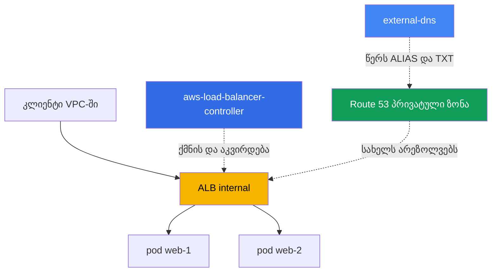
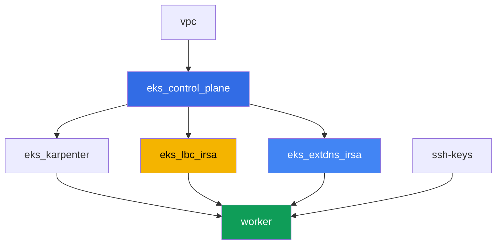

[Русская версия](README_RU.MD) · [Eng version](README.MD) · [Versión en español](README_ES.MD) · [Version française](README_FR.MD) · [Deutsche Version](README_DE.MD) · [繁體中文版](README_TW.MD) · [日本語版](README_JP.MD)

# ლაბა 109 - Ingress ALB-ის მეშვეობით ACM სერტიფიკატით, external-dns და Route 53

## აღწერა

აქ იკვრება მთელი L7 შესასვლელი წერტილი: Ingress ქმნის Application Load Balancer-ს AWS
Load Balancer Controller-ის (LBC) მეშვეობით, ALB-ს ერთვის TLS სერტიფიკატი ACM-იდან,
ხოლო external-dns აყენებს ALB-ისთვის გარეშე DNS სახელს პრივატულ Route 53 hosted
zone-ში. თქვენ გაივლით მთელ გზას - სუფთა Ingress-იდან, მისამართის გარეშე, სამუშაო
HTTPS შესასვლელ წერტილამდე DNS ჩანაწერითა და მფლობელობის TXT მარკერით - და ასევე
გაიმუშავებთ ტიპურ სიმპტომს, როცა Ingress არ წარმოქმნის ALB-ს.

ამ ლაბისთვის არ გჭირდებათ საკუთარი ნამდვილი საჯარო დომენი: პრივატულ hosted zone-ს
ქმნის ლაბის terraform და ის მიბმულია VPC-ზე, ხოლო სერტიფიკატი არის self-signed,
იმპორტირებული ACM-ში. ეს არ ამცირებს დავალებების ღირებულებას: ALB-ის ანოტაციები,
`certificate-arn`-ის, `listen-ports`-ის, `ssl-redirect`-ის, IngressGroup-ის და
external-dns ჩანაწერების მექანიკა ერთნაირად მუშაობს პრივატული და საჯარო
შემთხვევებისთვისაც.

დავალებები დაწერილია production-სტილში: მოკლე დავალება პლუს მიღების კრიტერიუმები.
შემოწმება ავტომატურია, ბრძანებით `check_result`.

## მიზანი

გავამყაროთ კურსის ამ თავების მასალა:

- [თავი 27. Ingress ALB-ის მეშვეობით: target-type, ანოტაციები, TLS და ACM, WAF](../../course/27/ge.md)
- [თავი 29. DNS და სერტიფიკატები: external-dns, Route 53, cert-manager](../../course/29/ge.md)

## რას ვქმნით

კლასტერი უკვე დეპლოირებულია როგორც კოდი (control plane, Fargate სისტემური
პოდებისთვის, Karpenter დატვირთვისთვის). Terraform ასევე ქმნის პრივატულ hosted
zone-ს და self-signed სერტიფიკატს ACM-ში. თქვენ აყენებთ LBC-სა და external-dns-ს
და მათზე ზემოთ აწყობთ მთელ შესასვლელ წერტილს.

| ობიექტი | რა არის ეს | რისთვის ამ ლაბაში |
|--------|---------|-------------------|
| Namespace `eks-109` | კლასტერის სექცია ლაბის დატვირთვისთვის | ინახავს რესურსებს სისტემურებისგან განცალკევებულად |
| Route 53 პრივატული ზონა `eks-task109.internal` | შექმნილია terraform-ის მიერ, მიბმული ლაბის VPC-ზე | ზონა, რომელშიც წერს external-dns |
| ACM სერტიფიკატი (self-signed) | შექმნილია terraform-ის მიერ `tls_self_signed_cert`-ისა და იმპორტის მეშვეობით | `certificate-arn` ALB-ის HTTPS listener-ისთვის |
| Deployment `web` (2 რეპლიკა) + Service `web` | ping_pong აპლიკაცია | დატვირთვა, რომელსაც აქვეყნებს Ingress |
| ServiceAccount + Deployment `aws-load-balancer-controller` | Helm chart, როლი IRSA-ის მეშვეობით | ქმნის ALB-ს Ingress-იდან |
| Ingress `web` | `ingressClassName: alb`, TLS, IngressGroup | თავად შესასვლელი წერტილი: ALB, HTTPS, DNS სახელი |
| ServiceAccount + Deployment `external-dns` | Helm chart, როლი IRSA-ის მეშვეობით | სინქრონიზაციას უწევს ALIAS და TXT ჩანაწერებს Route 53-ში |

ტრაფიკისა და DNS-ის შედეგიანი სურათი:



## ინფრასტრუქტურა

გარემო დეპლოირდება AWS-ში (`eu-central-1`) Terragrunt-ის მეშვეობით. ლაბის ყოველი
დირექტორია ერთი კომპონენტია საკუთარი `terragrunt.hcl`-ით, რომელიც მიმართავს საერთო
მოდულს `terraform/modules/`-ში და აცხადებს დამოკიდებულებებს `dependency` ბლოკებით.

### მოდულები და დამოკიდებულებები

| დირექტორია (კომპონენტი) | მოდული (`terraform/modules/`) | დამოკიდებულია | რას ქმნის |
|---------------------|-------------------------------|------------|-------------|
| `vpc` | `vpc_v3` | - | VPC `10.10.0.0/16`, ქვექსელები ორ AZ-ში, NAT |
| `ssh-keys` | `ssh-keys` | - | SSH-გასაღებების წყვილი სამუშაო მანქანისთვის |
| `eks_control_plane` | `eks_v2_control_plane` | `vpc` | EKS control plane `1.36`, OIDC provider |
| `eks_fargate_system` | `eks_v2_fargate` | `vpc`, `eks_control_plane` | Fargate-პროფილი `kube-system`-ისთვის და `karpenter`-ისთვის |
| `eks_addons` | `eks_v2_addons` | `eks_control_plane`, `eks_fargate_system` | დამატებები coredns, kube-proxy, vpc-cni, pod-identity |
| `eks_karpenter` | `eks_v2_karpenter` | `vpc`, `eks_control_plane`, `eks_addons`, `eks_fargate_system` | Karpenter-ის კონტროლერი, ნოუდების IAM-როლი |
| `eks_karpenter_default_vng` | `eks_v2_karpenter_vng` | `vpc`, `eks_control_plane`, `eks_karpenter` | ნაგულისხმევი NodePool AL2023-ზე |
| `eks_lbc_irsa` | `eks_v2_lbc_irsa` | `eks_control_plane` | IRSA IAM-როლი AWS Load Balancer Controller-ისთვის |
| `eks_extdns_irsa` | `eks_v2_extdns_irsa` | `vpc`, `eks_control_plane` | IRSA IAM-როლი external-dns-ისთვის, პრივატული hosted zone, self-signed ACM სერტიფიკატი |
| `worker` | `eks_v2_work_pc` | `ssh-keys`, `vpc`, `eks_control_plane`, `eks_karpenter`, `eks_lbc_irsa`, `eks_extdns_irsa` | სამუშაო მანქანა kubectl-ით, ტესტებით და `check_result`-ით |

მოდული `eks_v2_extdns_irsa` ახალია ამ ლაბისთვის, აწყობილი `eks_v2_lbc_irsa`-სა და
`eks_v2_ebs_irsa`-ს მოდელით (`var.tf`, `locals.tf`, `data.tf`, `aws.tf`, `cmdb.tf`,
`iam_irsa.tf`, `output.tf`, `versions.tf`). ის ასევე ქმნის `aws_route53_zone`-ს
(პრივატული, მიბმული VPC-ზე) და `aws_acm_certificate`-ს self-signed სერტიფიკატიდან,
რომელსაც აგენერირებს `tls` provider (`tls_private_key` + `tls_self_signed_cert`).
IAM-როლი ეხება ნდობით კლასტერის OIDC-ს `sub`-პირობით
`system:serviceaccount:kube-system:external-dns`-ზე და ატარებს მინიმალურ
external-dns პოლიტიკას (`route53:ChangeResourceRecordSets`,
`ListResourceRecordSets`, `ListTagsForResources` ზონებზე, `ListHostedZones`
`*`-ზე).

დამოკიდებულებების გრაფი (რაც უფრო ადრე აპლიცირდება, ის ხრიხისკენ ქვემოთაა):



კომპონენტები `eks_fargate_system`, `eks_addons`, `eks_karpenter_default_vng` არ
არის ჩართული ზემოთ მოცემულ გრაფში წაკითხვადობისთვის (არა უმეტეს 8 კვანძის) - ისინი
აპლიცირდება სტანდარტული თანმიმდევრობით `eks_control_plane`-სა და
`eks_karpenter`-ს შორის, როგორც ლაბა 101-ში.

### სად რა კონფიგურირდება

`env.hcl` (გარემოს საერთო პარამეტრები):

| პარამეტრი | მნიშვნელობა ლაბაში | რაზე ახდენს გავლენას |
|----------|-----------------|---------------|
| `region` | `eu-central-1` | ყველა რესურსის რეგიონი |
| `vpc_default_cidr`, `subnets` | `10.10.0.0/16`, ქვექსელები AZ-ების მიხედვით | VPC-ის მისამართების გეგმა |
| `prefix` | `eks-task109` | რესურსების სახელებისა და ტეგების პრეფიქსი |
| `stack_name` | `eks109` | მისგან იწყობა `env_name` - კლასტერის სახელი |
| `zone_domain` | `eks-task109.internal` | პრივატული Route 53 hosted zone-ის სახელი |
| `cert_common_name` | `app.eks-task109.internal` | self-signed ACM სერტიფიკატის Common Name |
| `k8_version` | `1.36.0` | kubectl-ის ვერსია სამუშაო მანქანაზე |
| `instance_type_worker` | `t3.medium` | სამუშაო მანქანის instance-ის ტიპი |
| `ssh_password_enable`, `access_cidrs` | `true`, `0.0.0.0/0` | SSH-წვდომა სამუშაო მანქანაზე |

`inputs` თითოეული კომპონენტის `terragrunt.hcl`-ში:

| ფაილი | ძირითადი პარამეტრები |
|------|--------------------|
| `eks_control_plane/terragrunt.hcl` | `eks.version = "1.36"`, ქვექსელები control plane-სთვის და ნოუდებისთვის |
| `eks_lbc_irsa/terragrunt.hcl` | `name` (კლასტერი) და `oidc_provider_arn` LBC-როლის trust policy-სთვის |
| `eks_extdns_irsa/terragrunt.hcl` | `name`, `oidc_provider_arn`, `vpc_id`, `zone_domain`, `cert_common_name` |
| `worker/terragrunt.hcl` | `test_url`, `task_script_url`, რომლებიც მიუთითებენ ლაბა 109-ის ფაილებზე; დამოკიდებულებები `eks_lbc_irsa`-სა და `eks_extdns_irsa`-ზე |

## განლაგება

```bash
TASK=109 make run_eks_task
```

განლაგება გრძელდება დაახლოებით 15-20 წუთი. output-ში მოძებნეთ ხაზი SSH-შეერთებით
სამუშაო მანქანასთან და დაუკავშირდით მას. kubectl იქ უკვე კონფიგურირებულია საჭირო
კლასტერზე.

სასარგებლო ბრძანებები სამუშაო მანქანაზე:

```bash
time_left       # რამდენი დრო დარჩა გარემოს
check_result    # გადამოწმება
```

> სტენდის უსაფრთხოება. `env.hcl`-ში ჩართულია `ssh_password_enable = true` და
> `access_cidrs = ["0.0.0.0/0"]` - ეს მოსახერხებელია სასწავლო გარემოსთვის, მაგრამ ასე არ
> უნდა გავხადოთ production-ში. კურსის სტანდარტების მიხედვით (თავები 0.2, 2, 19) სამუშაო
> მანქანებზე წვდომა იხსნება AWS SSM Session Manager-ის მეშვეობით, საჯარო SSH-პორტების
> გარეთ გამოტანის გარეშე, ხოლო `access_cidrs` ვიწროვდება კონკრეტულ მისამართებზე. აქ
> საჯარო SSH დარჩენილია მხოლოდ გაშვების გასამარტივებლად.

## დავალებები

---
|        **1**        | **Namespace, Service და ping_pong დატვირთვა**                  |
| :-----------------: | :---------------------------------------------------------- |
| რას ვაკეთებთ          | შექმენით namespace `eks-109`. მის შიგნით განალაგეთ Deployment `web`, image `viktoruj/ping_pong:latest`, `2` რეპლიკა, კონტეინერის პორტი `8080`. შექმენით Service `web` ტიპით `ClusterIP` პორტით `80`, `targetPort: 8080`, სელექტორით `app: web`. დაელოდეთ `2` მზა რეპლიკას. |
| მიღების კრიტერიუმები    | - namespace `eks-109` არსებობს;<br/>- Deployment `web` image-ით `viktoruj/ping_pong` და `2` მზა რეპლიკა;<br/>- Service `web` ტიპით `ClusterIP` პორტზე `80`. |
---
|        **2**        | **ServiceAccount და AWS Load Balancer Controller-ის დაინსტალირება**  |
| :-----------------: | :---------------------------------------------------------- |
| რას ვაკეთებთ          | მოძებნეთ IAM-როლის ARN, რომელიც terraform-ის მიერ შექმნილია კონტროლერისთვის (როლის სახელი `<cluster-name>-lbc-irsa`), და შექმენით ServiceAccount `aws-load-balancer-controller` `kube-system`-ში ანოტაციით `eks.amazonaws.com/role-arn`, რომელიც მიუთითებს ამ როლზე. დააინსტალირეთ AWS Load Balancer Controller Helm-ის მეშვეობით (რეპოზიტორია `https://aws.github.io/eks-charts`, chart `aws-load-balancer-controller`) ფლაგებით `--set serviceAccount.create=false --set serviceAccount.name=aws-load-balancer-controller` და `--set clusterName=<cluster name>`. დაელოდეთ Deployment `aws-load-balancer-controller`-ის მზა რეპლიკას. |
| მიღების კრიტერიუმები    | - ServiceAccount `aws-load-balancer-controller` `kube-system`-ში ანოტაციით, რომელიც მიუთითებს `lbc-irsa` როლზე;<br/>- Deployment `aws-load-balancer-controller` `kube-system`-ში აქვს მინიმუმ ერთი მზა რეპლიკა. |
---
|        **3**        | **Ingress ALB-ის მეშვეობით: internal, target-type ip**              |
| :-----------------: | :---------------------------------------------------------- |
| რას ვაკეთებთ          | შექმენით Ingress `web` namespace `eks-109`-ში `ingressClassName: alb`-ით, ანოტაციებით `alb.ingress.kubernetes.io/scheme: internal`, `alb.ingress.kubernetes.io/target-type: ip`, `alb.ingress.kubernetes.io/group.name: eks-task109-web`, წესით `host: app.eks-task109.internal`-ით, path `/` Service `web`-ის პორტ `80`-ზე. დაელოდეთ მისამართს (`kubectl get ingress web -n eks-109 -w`). `aws elbv2 describe-load-balancers`-ისა და `aws elbv2 describe-listeners`-ის მეშვეობით დაადასტურეთ load balancer ტიპით `Type: application`, `Scheme: internal`, და listener პორტ `80`-ზე, შეინახეთ ორივე output ფაილში `/var/work/tests/artifacts/3/alb.txt`. |
| მიღების კრიტერიუმები    | - Ingress `web` `ingressClassName: alb`-ით და მისამართით `status.loadBalancer.ingress[0].hostname`-ში;<br/>- ფაილი `alb.txt` არ არის ცარიელი, შეიცავს `"Type": "application"`, `"Scheme": "internal"` და `"Port": 80`. |
---
|        **4**        | **TLS: ACM სერტიფიკატი, HTTPS listener, redirect**             |
| :-----------------: | :---------------------------------------------------------- |
| რას ვაკეთებთ          | მოძებნეთ terraform-ის მიერ შექმნილი self-signed სერტიფიკატის ARN (`aws acm list-certificates`, დომენი `app.eks-task109.internal`). დაამატეთ Ingress `web`-ს ანოტაციები `alb.ingress.kubernetes.io/certificate-arn` (ეს ARN), `alb.ingress.kubernetes.io/listen-ports: '[{"HTTP": 80}, {"HTTPS": 443}]'`, `alb.ingress.kubernetes.io/ssl-redirect: '443'`, და `spec.tls` `hosts: ["app.eks-task109.internal"]`-ით. `aws elbv2 describe-listeners`-ის მეშვეობით დაადასტურეთ, რომ გამოჩნდა listener `443`-ზე პროტოკოლით `HTTPS` და მითითებული `CertificateArn`-ით, შეინახეთ output ფაილში `/var/work/tests/artifacts/4/https.txt`. |
| მიღების კრიტერიუმები    | - Ingress `web`-ს აქვს `certificate-arn` ანოტაცია და `spec.tls` სწორი host-ით;<br/>- ფაილი `https.txt` არ არის ცარიელი და შეიცავს `"Protocol": "HTTPS"` და `"Port": 443`. |
---
|        **5**        | **external-dns: ALIAS და TXT პრივატულ hosted zone-ში**         |
| :-----------------: | :---------------------------------------------------------- |
| რას ვაკეთებთ          | მოძებნეთ IAM-როლის ARN `<cluster-name>-extdns-irsa` და პრივატული hosted zone `eks-task109.internal`-ის ID (`aws route53 list-hosted-zones-by-name`). შექმენით ServiceAccount `external-dns` `kube-system`-ში ანოტაციით, რომელიც მიუთითებს ამ როლზე, შემდეგ დააინსტალირეთ external-dns Helm-ის მეშვეობით (რეპოზიტორია `https://kubernetes-sigs.github.io/external-dns/`, chart `external-dns`) `provider.name: aws`, `policy: upsert-only`, `registry: txt`, უნიკალური `txtOwnerId`, `domainFilters: [eks-task109.internal]`, `sources: [ingress]`, `extraArgs.aws-zone-type: private`, `serviceAccount.create: false`, `serviceAccount.name: external-dns`-ით. დაელოდეთ ჩანაწერების გამოჩენას და შეინახეთ ამ ზონისთვის `aws route53 list-resource-record-sets` ფაილში `/var/work/tests/artifacts/5/dns.txt`. |
| მიღების კრიტერიუმები    | - Deployment `external-dns` `kube-system`-ში მინიმუმ ერთი მზა რეპლიკით;<br/>- ფაილი `dns.txt` არ არის ცარიელი, შეიცავს ჩანაწერს `app.eks-task109.internal` ტიპით `A` (ALIAS) და მფლობელობის TXT ჩანაწერს. |
---
|        **6**        | **დიაგნოსტიკა: არასწორი ingressClassName და IngressGroup**     |
| :-----------------: | :---------------------------------------------------------- |
| რას ვაკეთებთ          | შექმენით `IngressClass` `wrong-class` `spec.controller: example.com/not-alb`-ით (ნამდვილი ობიექტი საჭიროა, რადგან LBC-ის admission webhook უკუაგდებს Ingress-ს, რომელიც მიუთითებს არარსებულ კლასზე), შემდეგ მეორე Ingress `status` `eks-109`-ში `ingressClassName: wrong-class`-ით (path `/status` Service `web`-ის პორტ `80`-ზე). დაადასტურეთ, რომ მას არ აქვს მისამართი (LBC აკვირდება მხოლოდ კლასებს კონტროლერით `ingress.k8s.aws/alb`), და აღწერეთ მიზეზი ფაილში `/var/work/tests/artifacts/6/groupfix.txt`. შემდეგ გამოასწორეთ: დააყენეთ `ingressClassName: alb`, დაამატეთ `alb.ingress.kubernetes.io/scheme: internal`, `alb.ingress.kubernetes.io/target-type: ip`, `alb.ingress.kubernetes.io/group.name: eks-task109-web` (იგივე ჯგუფის სახელი, რაც `web` Ingress-ს) და `group.order: '10'`. დაელოდეთ მისამართს და დაამატეთ იმავე ფაილში, რომ `status`-ის მისამართი ემთხვევა `web`-ის მისამართს - ორივე Ingress იზიარებს ერთ ALB-ს IngressGroup-ის მეშვეობით. |
| მიღების კრიტერიუმები    | - ფაილი `groupfix.txt` არ არის ცარიელი, შეიცავს `ingressClassName`-ს და `wrong-class`-ს (სიმპტომის განმარტება);<br/>- Ingress `status` გამოსწორების შემდეგ არის `ingressClassName: alb`-ით და აქვს იგივე მისამართი, რაც Ingress `web`-ს (`status.loadBalancer.ingress[0].hostname`). |
---

## შედეგის შემოწმება

სამუშაო მანქანაზე გაუშვით ავტომატური შემოწმება:

```bash
check_result
```

სკრიპტი გაუშვებს ტესტებს და გამოაჩენს შესრულებული დავალებების პროცენტს.

## გადაწყვეტა

ეტალონური გადაწყვეტა: [worker/files/solutions/1_GE.MD](worker/files/solutions/1_GE.MD)

## კლასტერისა და რესურსების წაშლა

> წაშლის წინ. Ingress `web`-მა და `status`-მა შექმნეს ნამდვილი ALB და ორი security
> group პირდაპირ ELBv2/EC2 API-ის მეშვეობით (AWS Load Balancer Controller) - ეს
> ყველაფერი terraform-ის state-ში არ არსებობს. წაშალეთ Ingress-ები და მიეცეთ LBC-ს
> თავად გამოიძახოს AWS API ALB-ისა და SG-ების წასაშლელად (finalizer არ დაანებებს
> ობიექტებს etcd-იდან წაშლას, სანამ LBC არ დაადასტურებს გასუფთავებას):
>
> ```bash
> kubectl delete ingress web status -n eks-109
> kubectl wait --for=delete ingress/web ingress/status -n eks-109 --timeout=120s
> ```
>
> external-dns დავალება 5-იდან თავად არ წაშლის `A`/`AAAA`/`TXT` ჩანაწერებს:
> `policy: upsert-only`, რომელიც ცალსახად დააყენეთ დაინსტალირებისას, არის განზრახ
> „მხოლოდ შექმნა და განახლება" რეჟიმი, წაშლის გარეშე - პროექტის დოკუმენტირებული ქცევა
> (დაცვა DNS ჩანაწერების უნებლიე დაკარგვისგან კონტროლერის გადატვირთვისას). წაშალეთ
> ისინი ხელით AWS CLI-ის მეშვეობით - სხვაგვარად hosted zone შეინარჩუნებს ჩანაწერებს
> `NS`/`SOA`-ს გარდა, და terraform არ შეძლებს თავად ზონის წაშლას:
>
> ```bash
> ZONE_ID=$(aws route53 list-hosted-zones-by-name --dns-name eks-task109.internal \
>   --query "HostedZones[0].Id" --output text)
> aws route53 change-resource-record-sets --hosted-zone-id "$ZONE_ID" --change-batch '{
>   "Changes": [
>     {"Action": "DELETE", "ResourceRecordSet": {"Name": "app.eks-task109.internal.", "Type": "A", "AliasTarget": {"HostedZoneId": "<CanonicalHostedZoneId ALB>", "DNSName": "<DNSName ALB>.", "EvaluateTargetHealth": true}}},
>     {"Action": "DELETE", "ResourceRecordSet": {"Name": "app.eks-task109.internal.", "Type": "AAAA", "AliasTarget": {"HostedZoneId": "<CanonicalHostedZoneId ALB>", "DNSName": "<DNSName ALB>.", "EvaluateTargetHealth": true}}},
>     {"Action": "DELETE", "ResourceRecordSet": {"Name": "aaaa-app.eks-task109.internal.", "Type": "TXT", "TTL": 300, "ResourceRecords": [{"Value": "\"heritage=external-dns,external-dns/owner=eks-task109,external-dns/resource=ingress/eks-109/web\""}]}},
>     {"Action": "DELETE", "ResourceRecordSet": {"Name": "cname-app.eks-task109.internal.", "Type": "TXT", "TTL": 300, "ResourceRecords": [{"Value": "\"heritage=external-dns,external-dns/owner=eks-task109,external-dns/resource=ingress/eks-109/web\""}]}}
>   ]
> }'
> # უფრო მარტივია: შეამოწმეთ ზუსტი მნიშვნელობები წაშლამდე და ჩაანაცვლეთ ისინი ზემოთ
> aws route53 list-resource-record-sets --hosted-zone-id "$ZONE_ID"
> ```
>
> აუცილებლად წაშალეთ Ingress-ები `terragrunt destroy`-ის წინ. თუ control plane
> წაიშლება მათზე ადრე, ALB და მისი SG-ები დარჩება უპატრონოდ (ENI-ებს დაიჭერენ
> ქვექსელებში - VPC და Internet Gateway ჩამოკიდულები დარჩება `Still
> destroying...`-ში), და LBC-ს მეტად ვერ დაგვეხმარება - ხელით გასუფთავება AWS
> CLI-ის მეშვეობით ერთადერთი დარჩენილი გამოსავალია:
>
> ```bash
> VPC_ID=<ამ ლაბის VPC-ის ID>
> LB_ARN=$(aws elbv2 describe-load-balancers \
>   --query "LoadBalancers[?contains(LoadBalancerName,'eks109')].LoadBalancerArn" --output text)
> aws elbv2 delete-load-balancer --load-balancer-arn "$LB_ARN"
> # დაელოდეთ, სანამ ENI-ები ქვექსელებში გათავისუფლდება, შემდეგ წაშალეთ დარჩენილი SG-ები:
> aws ec2 describe-security-groups --filters "Name=vpc-id,Values=$VPC_ID" \
>   --query "SecurityGroups[?GroupName!='default'].GroupId" --output text | \
>   xargs -n1 aws ec2 delete-security-group --group-id
> ```

```bash
TASK=109 make delete_eks_task
```
