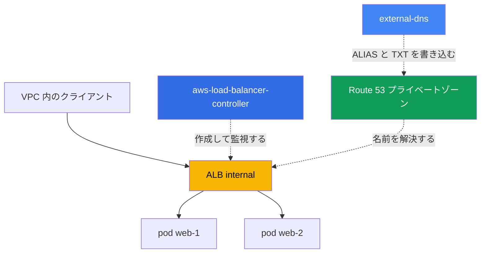
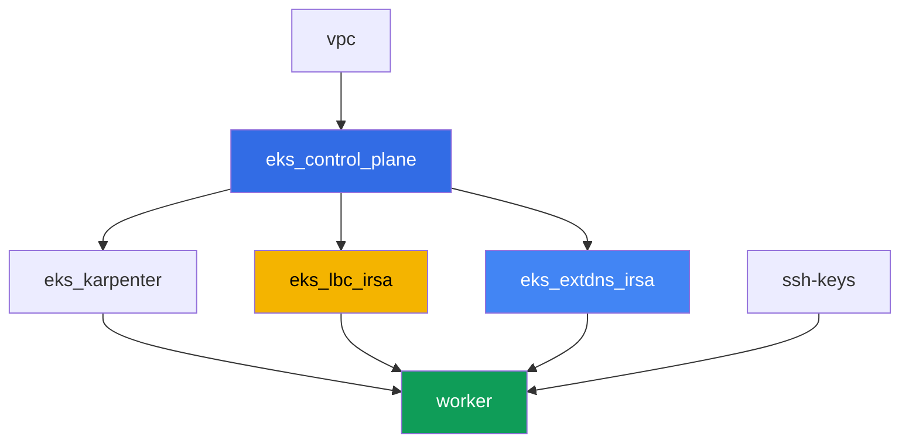

[Русская версия](README_RU.MD) · [Eng version](README.MD) · [Versión en español](README_ES.MD) · [Version française](README_FR.MD) · [Deutsche Version](README_DE.MD) · [ქართული ვერსია](README_GE.MD) · [繁體中文版](README_TW.MD)

# ラボ 109 - ACM 証明書、external-dns、Route 53 を使った ALB 経由の Ingress

## 説明

ここで L7 のエントリポイント全体が組み上がります: Ingress が AWS Load Balancer
Controller(LBC)を通じて Application Load Balancer を作成し、その ALB に ACM から TLS
証明書がアタッチされ、external-dns がプライベートの Route 53 hosted zone に ALB の外部
DNS 名を設定します。あなたはアドレスを持たない素の Ingress から、DNS レコードと所有権を
示す TXT マーカーを備えた実際に動く HTTPS エントリポイントまで、一連の流れをすべて通り
抜けます。そして、Ingress が ALB を作らないという典型的な症状にも取り組みます。

このラボでは自分の実際のパブリックドメインは不要です: プライベート hosted zone はラボの
terraform によって作成され VPC にアタッチされており、証明書は自己署名で ACM に
インポートされています。これは課題の価値を減らすものではありません: ALB の annotation、
`certificate-arn`、`listen-ports`、`ssl-redirect`、IngressGroup の仕組み、external-dns の
レコードは、プライベートの場合もパブリックの場合も同じように動作します。

タスクは production スタイルで書かれています: 短い課題文とアクセプタンス基準。検証は
`check_result` コマンドによって自動的に行われます。

## 目的

コースの以下の章の内容を定着させます:

- [第 27 章。ALB 経由の Ingress: target-type、annotation、TLS と ACM、WAF](../../course/27/jp.md)
- [第 29 章。DNS と証明書: external-dns、Route 53、cert-manager](../../course/29/jp.md)

## 作成するもの

クラスタは既にコードとしてデプロイされています(control plane、システム Pod 用の
Fargate、ワークロード用の Karpenter)。Terraform はプライベートの hosted zone と、ACM の
自己署名証明書も作成します。あなたは LBC と external-dns をインストールし、それらを
中心にエントリポイント全体を構築します。

| オブジェクト | 何か | このラボでの目的 |
|--------|---------|-------------------|
| Namespace `eks-109` | ラボのワークロード用のクラスタ区画 | システムのリソースからリソースを分離する |
| Route 53 プライベートゾーン `eks-task109.internal` | terraform によって作成され、ラボの VPC にアタッチされている | external-dns が書き込む先のゾーン |
| ACM 証明書(自己署名) | `tls_self_signed_cert` + インポートによって terraform が作成 | ALB の HTTPS リスナー用の `certificate-arn` |
| Deployment `web`(2 レプリカ)+ Service `web` | ping_pong アプリケーション | Ingress が公開するワークロード |
| ServiceAccount + Deployment `aws-load-balancer-controller` | Helm チャート、IRSA によるロール | Ingress から ALB を作成する |
| Ingress `web` | `ingressClassName: alb`、TLS、IngressGroup | エントリポイント本体: ALB、HTTPS、DNS 名 |
| ServiceAccount + Deployment `external-dns` | Helm チャート、IRSA によるロール | Route 53 の ALIAS と TXT レコードを同期する |

トラフィックと DNS の最終的な構成図:



## インフラストラクチャ

環境は Terragrunt によって AWS(`eu-central-1`)にデプロイされます。ラボの各ディレクト
リは 1 つのコンポーネントであり、それぞれ独自の `terragrunt.hcl` を持ち、
`terraform/modules/` の共有モジュールを参照し、`dependency` ブロックで依存関係を宣言
します。

### モジュールと依存関係

| ディレクトリ(コンポーネント) | モジュール(`terraform/modules/`) | 依存先 | 作成されるもの |
|---------------------|-------------------------------|------------|-------------|
| `vpc` | `vpc_v3` | - | VPC `10.10.0.0/16`、2 つの AZ のサブネット、NAT |
| `ssh-keys` | `ssh-keys` | - | ワーカーマシン用の SSH キーペア |
| `eks_control_plane` | `eks_v2_control_plane` | `vpc` | EKS control plane `1.36`、OIDC provider |
| `eks_fargate_system` | `eks_v2_fargate` | `vpc`、`eks_control_plane` | `kube-system` と `karpenter` 用の Fargate profile |
| `eks_addons` | `eks_v2_addons` | `eks_control_plane`、`eks_fargate_system` | coredns、kube-proxy、vpc-cni、pod-identity |
| `eks_karpenter` | `eks_v2_karpenter` | `vpc`、`eks_control_plane`、`eks_addons`、`eks_fargate_system` | Karpenter コントローラ、ノードの IAM ロール |
| `eks_karpenter_default_vng` | `eks_v2_karpenter_vng` | `vpc`、`eks_control_plane`、`eks_karpenter` | AL2023 上のデフォルト NodePool |
| `eks_lbc_irsa` | `eks_v2_lbc_irsa` | `eks_control_plane` | AWS Load Balancer Controller 用の IRSA IAM ロール |
| `eks_extdns_irsa` | `eks_v2_extdns_irsa` | `vpc`、`eks_control_plane` | external-dns 用の IRSA IAM ロール、プライベート hosted zone、自己署名 ACM 証明書 |
| `worker` | `eks_v2_work_pc` | `ssh-keys`、`vpc`、`eks_control_plane`、`eks_karpenter`、`eks_lbc_irsa`、`eks_extdns_irsa` | kubectl、テスト、`check_result` を備えたワーカーマシン |

モジュール `eks_v2_extdns_irsa` はこのラボで新規に追加されたもので、`eks_v2_lbc_irsa`
と `eks_v2_ebs_irsa` を手本にしています(`var.tf`、`locals.tf`、`data.tf`、`aws.tf`、
`cmdb.tf`、`iam_irsa.tf`、`output.tf`、`versions.tf`)。また `aws_route53_zone`
(プライベート、VPC にアタッチ)と、`tls` provider が生成した自己署名証明書
(`tls_private_key` + `tls_self_signed_cert`)から作られる `aws_acm_certificate` も
作成します。IAM ロールは、`system:serviceaccount:kube-system:external-dns` への `sub`
条件付きでクラスタの OIDC を信頼し、最小限の external-dns 用ポリシー
(ゾーンに対する `route53:ChangeResourceRecordSets`、`ListResourceRecordSets`、
`ListTagsForResources`、`*` に対する `ListHostedZones`)を持ちます。

依存関係グラフ(先に適用されるものほど矢印の下側にある):



コンポーネント `eks_fargate_system`、`eks_addons`、`eks_karpenter_default_vng` は
見やすさのため上のグラフには含めていません(ノード数を 8 以下に抑えるため) - これらは
ラボ 101 と同様に、`eks_control_plane` と `eks_karpenter` の間で標準的な順序で適用され
ます。

### どこで何が設定されるか

`env.hcl`(共通の環境パラメータ):

| パラメータ | ラボでの値 | 影響範囲 |
|----------|-----------------|---------------|
| `region` | `eu-central-1` | すべてのリソースのリージョン |
| `vpc_default_cidr`、`subnets` | `10.10.0.0/16`、AZ ごとのサブネット | VPC のアドレス計画 |
| `prefix` | `eks-task109` | リソース名とタグのプレフィックス |
| `stack_name` | `eks109` | `env_name`(クラスタ名)を組み立てるために使われる |
| `zone_domain` | `eks-task109.internal` | プライベート Route 53 hosted zone の名前 |
| `cert_common_name` | `app.eks-task109.internal` | 自己署名 ACM 証明書の Common Name |
| `k8_version` | `1.36.0` | ワーカーマシン上の kubectl のバージョン |
| `instance_type_worker` | `t3.medium` | ワーカーマシンのインスタンスタイプ |
| `ssh_password_enable`、`access_cidrs` | `true`、`0.0.0.0/0` | ワーカーマシンへの SSH アクセス |

各コンポーネントの `terragrunt.hcl` の `inputs`:

| ファイル | 主な設定 |
|------|--------------------|
| `eks_control_plane/terragrunt.hcl` | `eks.version = "1.36"`、control plane とノード用のサブネット |
| `eks_lbc_irsa/terragrunt.hcl` | LBC ロールの trust policy 用の `name`(クラスタ)と `oidc_provider_arn` |
| `eks_extdns_irsa/terragrunt.hcl` | `name`、`oidc_provider_arn`、`vpc_id`、`zone_domain`、`cert_common_name` |
| `worker/terragrunt.hcl` | ラボ 109 のファイルを指す `test_url`、`task_script_url`;`eks_lbc_irsa` と `eks_extdns_irsa` への依存 |

## デプロイ

```bash
TASK=109 make run_eks_task
```

デプロイには約 15-20 分かかります。出力の中からワーカーマシンへの SSH 接続の行を見つけ
て接続してください。そこでは kubectl が既に正しいクラスタ向けに設定されています。

ワーカーマシン上で使える便利なコマンド:

```bash
time_left       # 環境の残り時間
check_result    # 解答の確認
```

> 検証環境のセキュリティについて。`env.hcl` では `ssh_password_enable = true` と
> `access_cidrs = ["0.0.0.0/0"]` が有効になっています。学習用環境としては便利ですが、
> 本番環境ではこのようにしてはいけません。コースの標準(第 0.2、2、19 章)によれば、
> ワーカーマシンへのアクセスは公開 SSH ポートを外に出さずに AWS SSM Session Manager を
> 経由して開き、`access_cidrs` は具体的なアドレスに絞り込みます。ここでは、セットアップ
> を簡単にするためだけに公開 SSH を残しています。

## タスク

---
|        **1**        | **Namespace、Service、ping_pong ワークロード**                  |
| :-----------------: | :---------------------------------------------------------- |
| やること          | namespace `eks-109` を作成してください。その中に、イメージ `viktoruj/ping_pong:latest`、レプリカ数 `2`、コンテナポート `8080` の Deployment `web` をデプロイしてください。ポート `80`、`targetPort: 8080`、セレクタ `app: web` を持つ `ClusterIP` 型の Service `web` を作成してください。`2` 個の Ready なレプリカを待ってください。 |
| アクセプタンス基準    | - namespace `eks-109` が存在する;<br/>- イメージ `viktoruj/ping_pong` を持ち `2` 個の Ready なレプリカを持つ Deployment `web`;<br/>- ポート `80` の `ClusterIP` 型 Service `web`。 |
---
|        **2**        | **ServiceAccount と AWS Load Balancer Controller のインストール**  |
| :-----------------: | :---------------------------------------------------------- |
| やること          | terraform がコントローラ用に作成した IAM ロールの ARN(ロール名 `<cluster-name>-lbc-irsa`)を見つけ、`kube-system` に annotation `eks.amazonaws.com/role-arn` でこのロールを指す ServiceAccount `aws-load-balancer-controller` を作成してください。Helm(リポジトリ `https://aws.github.io/eks-charts`、チャート `aws-load-balancer-controller`)経由で AWS Load Balancer Controller を、フラグ `--set serviceAccount.create=false --set serviceAccount.name=aws-load-balancer-controller` と `--set clusterName=<クラスタ名>` を付けてインストールしてください。Deployment `aws-load-balancer-controller` の Ready なレプリカを待ってください。 |
| アクセプタンス基準    | - `kube-system` に、`lbc-irsa` ロールを指す annotation を持つ ServiceAccount `aws-load-balancer-controller`;<br/>- `kube-system` の Deployment `aws-load-balancer-controller` が少なくとも 1 つの Ready なレプリカを持つ。 |
---
|        **3**        | **ALB 経由の Ingress: internal、target-type ip**              |
| :-----------------: | :---------------------------------------------------------- |
| やること          | namespace `eks-109` に、`ingressClassName: alb`、annotation `alb.ingress.kubernetes.io/scheme: internal`、`alb.ingress.kubernetes.io/target-type: ip`、`alb.ingress.kubernetes.io/group.name: eks-task109-web`、`host: app.eks-task109.internal` を持つルール、パス `/` から Service `web` のポート `80` へのルーティングを持つ Ingress `web` を作成してください。アドレスが付与されるまで待ってください(`kubectl get ingress web -n eks-109 -w`)。`aws elbv2 describe-load-balancers` と `aws elbv2 describe-listeners` を使って、`Type: application`、`Scheme: internal` のロードバランサと、ポート `80` のリスナーがあることを確認し、両方の出力を `/var/work/tests/artifacts/3/alb.txt` に保存してください。 |
| アクセプタンス基準    | - `ingressClassName: alb` を持ち、`status.loadBalancer.ingress[0].hostname` にアドレスを持つ Ingress `web`;<br/>- ファイル `alb.txt` が空でなく、`"Type": "application"`、`"Scheme": "internal"`、`"Port": 80` を含む。 |
---
|        **4**        | **TLS: ACM 証明書、HTTPS リスナー、リダイレクト**             |
| :-----------------: | :---------------------------------------------------------- |
| やること          | terraform が作成した自己署名証明書の ARN を見つけてください(`aws acm list-certificates`、ドメイン `app.eks-task109.internal`)。Ingress `web` に annotation `alb.ingress.kubernetes.io/certificate-arn`(この ARN)、`alb.ingress.kubernetes.io/listen-ports: '[{"HTTP": 80}, {"HTTPS": 443}]'`、`alb.ingress.kubernetes.io/ssl-redirect: '443'`、そして `hosts: ["app.eks-task109.internal"]` を持つ `spec.tls` を追加してください。`aws elbv2 describe-listeners` を使って、ポート `443` に、プロトコル `HTTPS` と指定した `CertificateArn` を持つリスナーが現れたことを確認し、出力を `/var/work/tests/artifacts/4/https.txt` に保存してください。 |
| アクセプタンス基準    | - Ingress `web` が `certificate-arn` annotation と、正しいホストを持つ `spec.tls` を持つ;<br/>- ファイル `https.txt` が空でなく、`"Protocol": "HTTPS"` と `"Port": 443` を含む。 |
---
|        **5**        | **external-dns: プライベート hosted zone 内の ALIAS と TXT**         |
| :-----------------: | :---------------------------------------------------------- |
| やること          | IAM ロール `<cluster-name>-extdns-irsa` の ARN と、プライベート hosted zone `eks-task109.internal` の ID(`aws route53 list-hosted-zones-by-name`)を見つけてください。`kube-system` に、そのロールを指す annotation を持つ ServiceAccount `external-dns` を作成し、続いて Helm(リポジトリ `https://kubernetes-sigs.github.io/external-dns/`、チャート `external-dns`)経由で external-dns を、`provider.name: aws`、`policy: upsert-only`、`registry: txt`、一意な `txtOwnerId`、`domainFilters: [eks-task109.internal]`、`sources: [ingress]`、`extraArgs.aws-zone-type: private`、`serviceAccount.create: false`、`serviceAccount.name: external-dns` の設定でインストールしてください。レコードが現れるまで待ち、このゾーンに対する `aws route53 list-resource-record-sets` の結果を `/var/work/tests/artifacts/5/dns.txt` に保存してください。 |
| アクセプタンス基準    | - `kube-system` の Deployment `external-dns` が少なくとも 1 つの Ready なレプリカを持つ;<br/>- ファイル `dns.txt` が空でなく、`A`(ALIAS)型の `app.eks-task109.internal` レコードと、所有権を示す TXT レコードを含む。 |
---
|        **6**        | **診断: 誤った ingressClassName と IngressGroup**     |
| :-----------------: | :---------------------------------------------------------- |
| やること          | `spec.controller: example.com/not-alb` を持つ `IngressClass` `wrong-class` を作成してください(存在しないクラスを参照する Ingress は LBC の admission webhook によって拒否されるため、実在するオブジェクトが必要です)。続いて、`eks-109` に `ingressClassName: wrong-class` を持つ 2 つ目の Ingress `status`(パス `/status` から Service `web` のポート `80` へ)を作成してください。アドレスが付与されないことを確認してください(LBC はコントローラ `ingress.k8s.aws/alb` を持つクラスのみを監視します)。その理由を `/var/work/tests/artifacts/6/groupfix.txt` に記述してください。そのうえで修正してください: `ingressClassName: alb` を設定し、`alb.ingress.kubernetes.io/scheme: internal`、`alb.ingress.kubernetes.io/target-type: ip`、`alb.ingress.kubernetes.io/group.name: eks-task109-web`(Ingress `web` と同じグループ名)、`group.order: '10'` を追加してください。アドレスが付与されるまで待ち、`status` のアドレスが `web` のアドレスと一致すること(両方の Ingress が IngressGroup を通じて 1 つの ALB を共有していること)を同じファイルに追記してください。 |
| アクセプタンス基準    | - ファイル `groupfix.txt` が空でなく、`ingressClassName` と `wrong-class`(症状の説明)を含む;<br/>- 修正後の Ingress `status` が `ingressClassName: alb` を持ち、Ingress `web` と同じアドレス(`status.loadBalancer.ingress[0].hostname`)を持つ。 |
---

## 結果の確認

ワーカーマシン上で自動チェックを実行してください:

```bash
check_result
```

スクリプトがテストを実行し、完了したタスクの割合を表示します。

## 解答

参考解答: [worker/files/solutions/1_JP.MD](worker/files/solutions/1_JP.MD)

## クラスタとリソースの削除

> 削除の前に。Ingress `web` と `status` は、terraform state には含まれない実際の ALB
> と 2 つの security group を、ELBv2/EC2 API 経由で直接(AWS Load Balancer Controller
> を通じて)作成しました。Ingress を削除し、LBC 自身が AWS API を呼び出して ALB と SG
> を削除するようにしてください(finalizer が働くため、LBC がクリーンアップを確認する
> までオブジェクトは etcd から削除されません):
>
> ```bash
> kubectl delete ingress web status -n eks-109
> kubectl wait --for=delete ingress/web ingress/status -n eks-109 --timeout=120s
> ```
>
> タスク 5 の external-dns は `A`/`AAAA`/`TXT` レコードを自動では削除しません:
> インストール時に明示的に設定した `policy: upsert-only` は、意図的に「作成と更新の
> みを行う」モードであり、削除は行いません - これはプロジェクトの文書化された挙動です
> (コントローラの再起動時に DNS レコードを誤って失うことを防ぐための保護)。AWS CLI 経由
> で手動で削除してください - そうしないと hosted zone に `NS`/`SOA` 以外のレコードが
> 残ってしまい、terraform はゾーン自体を削除できなくなります:
>
> ```bash
> ZONE_ID=$(aws route53 list-hosted-zones-by-name --dns-name eks-task109.internal \
>   --query "HostedZones[0].Id" --output text)
> aws route53 change-resource-record-sets --hosted-zone-id "$ZONE_ID" --change-batch '{
>   "Changes": [
>     {"Action": "DELETE", "ResourceRecordSet": {"Name": "app.eks-task109.internal.", "Type": "A", "AliasTarget": {"HostedZoneId": "<CanonicalHostedZoneId ALB>", "DNSName": "<DNSName ALB>.", "EvaluateTargetHealth": true}}},
>     {"Action": "DELETE", "ResourceRecordSet": {"Name": "app.eks-task109.internal.", "Type": "AAAA", "AliasTarget": {"HostedZoneId": "<CanonicalHostedZoneId ALB>", "DNSName": "<DNSName ALB>.", "EvaluateTargetHealth": true}}},
>     {"Action": "DELETE", "ResourceRecordSet": {"Name": "aaaa-app.eks-task109.internal.", "Type": "TXT", "TTL": 300, "ResourceRecords": [{"Value": "\"heritage=external-dns,external-dns/owner=eks-task109,external-dns/resource=ingress/eks-109/web\""}]}},
>     {"Action": "DELETE", "ResourceRecordSet": {"Name": "cname-app.eks-task109.internal.", "Type": "TXT", "TTL": 300, "ResourceRecords": [{"Value": "\"heritage=external-dns,external-dns/owner=eks-task109,external-dns/resource=ingress/eks-109/web\""}]}}
>   ]
> }'
> # より簡単な方法: 削除前に実際の値を確認し、上記に置き換えてください
> aws route53 list-resource-record-sets --hosted-zone-id "$ZONE_ID"
> ```
>
> Ingress は必ず `terragrunt destroy` の前に削除してください。control plane がそれより
> 先に削除されると、ALB とその SG が孤立して残ってしまい(サブネット内で ENI を保持し
> 続け、VPC と Internet Gateway が `Still destroying...` のまま止まってしまいます)、
> LBC はもう助けてくれません - 残された手段は AWS CLI 経由の手動クリーンアップのみです:
>
> ```bash
> VPC_ID=<このラボの VPC の ID>
> LB_ARN=$(aws elbv2 describe-load-balancers \
>   --query "LoadBalancers[?contains(LoadBalancerName,'eks109')].LoadBalancerArn" --output text)
> aws elbv2 delete-load-balancer --load-balancer-arn "$LB_ARN"
> # サブネット内の ENI が解放されるまで待ち、残った SG を削除する:
> aws ec2 describe-security-groups --filters "Name=vpc-id,Values=$VPC_ID" \
>   --query "SecurityGroups[?GroupName!='default'].GroupId" --output text | \
>   xargs -n1 aws ec2 delete-security-group --group-id
> ```

```bash
TASK=109 make delete_eks_task
```
