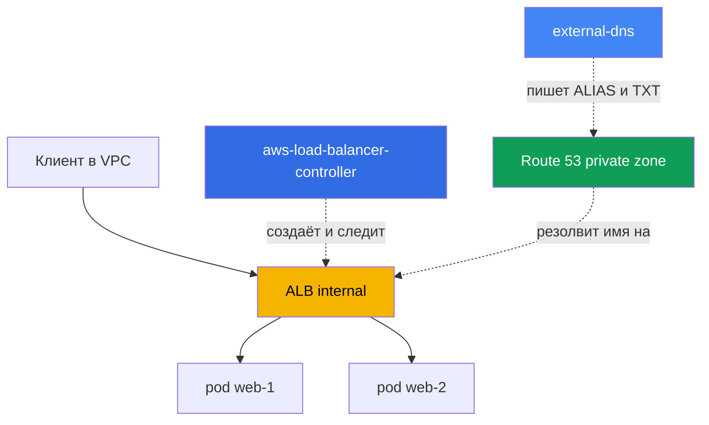
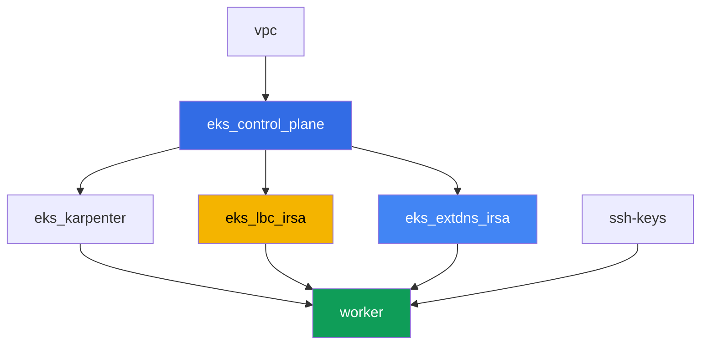

# Лаба 109 - Ingress через ALB с сертификатом ACM, external-dns и Route 53

## Описание

Здесь L7-вход собирается целиком: Ingress создаёт Application Load Balancer через AWS Load
Balancer Controller (LBC), на ALB подключается TLS-сертификат из ACM, а внешнее DNS-имя на
ALB заводит external-dns в приватной hosted zone Route 53. Вы пройдёте весь путь - от голого
Ingress без адреса до рабочего HTTPS-входа с DNS-записью и TXT-маркером владения, а также
разберёте типичный симптом, когда Ingress не порождает ALB.

Настоящий публичный домен во владении читателя для этой лабы не нужен: приватная hosted
zone создаётся terraform-ом лабы и привязана к VPC, а сертификат - самоподписанный,
импортированный в ACM. Это не снижает ценность заданий: аннотации ALB, механика
`certificate-arn`, `listen-ports`, `ssl-redirect`, IngressGroup и записи external-dns
работают одинаково для приватного и публичного случая.

Задания в продакшн-стиле: короткая постановка плюс критерии приёмки. Проверка -
автоматическая, командой `check_result`.

## Цель

Закрепить материал глав курса:

- [Глава 27. Ingress через ALB: target-type, аннотации, TLS и ACM, WAF](../../course/27/ru.md)
- [Глава 29. DNS и сертификаты: external-dns, Route 53, cert-manager](../../course/29/ru.md)

## Что мы создаём

Кластер уже развёрнут как код (control plane, Fargate под системные поды, Karpenter под
нагрузку). Terraform также создаёт приватную hosted zone и самоподписанный сертификат в ACM.
Вы ставите LBC и external-dns и собираете вокруг них вход целиком.

| Объект | Что это | Зачем в этой лабе |
|--------|---------|-------------------|
| Namespace `eks-109` | раздел кластера под нагрузку лабы | держим ресурсы отдельно от системных |
| Route 53 private zone `eks-task109.internal` | создана terraform, привязана к VPC лабы | зона, в которую пишет external-dns |
| ACM сертификат (самоподписанный) | создан terraform через `tls_self_signed_cert` + импорт | `certificate-arn` для HTTPS listener'а ALB |
| Deployment `web` (2 реплики) + Service `web` | приложение ping_pong | нагрузка, которую публикует Ingress |
| ServiceAccount + Deployment `aws-load-balancer-controller` | Helm-чарт, роль через IRSA | создаёт ALB из Ingress |
| Ingress `web` | `ingressClassName: alb`, TLS, IngressGroup | сам вход: ALB, HTTPS, DNS-имя |
| ServiceAccount + Deployment `external-dns` | Helm-чарт, роль через IRSA | синхронизирует ALIAS и TXT в Route 53 |

Итоговая картина трафика и DNS:



## Инфраструктура

Окружение разворачивается в AWS (`eu-central-1`) через Terragrunt. Каждый каталог лабы -
это один компонент со своим `terragrunt.hcl`, который ссылается на общий модуль в
`terraform/modules/` и объявляет зависимости через блоки `dependency`.

### Модули и зависимости

| Каталог (компонент) | Модуль (`terraform/modules/`) | Зависит от | Что создаёт |
|---------------------|-------------------------------|------------|-------------|
| `vpc` | `vpc_v3` | - | VPC `10.10.0.0/16`, подсети в двух AZ, NAT |
| `ssh-keys` | `ssh-keys` | - | пара SSH-ключей для рабочей машины |
| `eks_control_plane` | `eks_v2_control_plane` | `vpc` | control plane EKS `1.36`, OIDC-провайдер |
| `eks_fargate_system` | `eks_v2_fargate` | `vpc`, `eks_control_plane` | Fargate-профиль для `kube-system` и `karpenter` |
| `eks_addons` | `eks_v2_addons` | `eks_control_plane`, `eks_fargate_system` | coredns, kube-proxy, vpc-cni, pod-identity |
| `eks_karpenter` | `eks_v2_karpenter` | `vpc`, `eks_control_plane`, `eks_addons`, `eks_fargate_system` | контроллер Karpenter, IAM-роль нод |
| `eks_karpenter_default_vng` | `eks_v2_karpenter_vng` | `vpc`, `eks_control_plane`, `eks_karpenter` | дефолтный NodePool на AL2023 |
| `eks_lbc_irsa` | `eks_v2_lbc_irsa` | `eks_control_plane` | IAM-роль IRSA для AWS Load Balancer Controller |
| `eks_extdns_irsa` | `eks_v2_extdns_irsa` | `vpc`, `eks_control_plane` | IAM-роль IRSA для external-dns, private hosted zone, самоподписанный сертификат в ACM |
| `worker` | `eks_v2_work_pc` | `ssh-keys`, `vpc`, `eks_control_plane`, `eks_karpenter`, `eks_lbc_irsa`, `eks_extdns_irsa` | рабочая машина с kubectl, тестами и `check_result` |

Модуль `eks_v2_extdns_irsa` - новый для этой лабы, по образцу `eks_v2_lbc_irsa` и
`eks_v2_ebs_irsa` (`var.tf`, `locals.tf`, `data.tf`, `aws.tf`, `cmdb.tf`, `iam_irsa.tf`,
`output.tf`, `versions.tf`). Дополнительно он создаёт `aws_route53_zone` (private,
привязана к VPC) и `aws_acm_certificate` из самоподписанного сертификата, сгенерированного
провайдером `tls` (`tls_private_key` + `tls_self_signed_cert`). IAM-роль доверяет OIDC
кластера с условием `sub` на `system:serviceaccount:kube-system:external-dns` и несёт
минимальную политику external-dns (`route53:ChangeResourceRecordSets`,
`ListResourceRecordSets`, `ListTagsForResources` на зоны, `ListHostedZones` на `*`).

Граф зависимостей (что применяется раньше, то ниже по стрелке):



Компоненты `eks_fargate_system`, `eks_addons`, `eks_karpenter_default_vng` в граф выше не
включены ради читаемости (не больше 8 узлов) - они применяются в стандартном порядке
между `eks_control_plane` и `eks_karpenter`, как в лабе 101.

### Где что настраивается

`env.hcl` (общие параметры окружения):

| Параметр | Значение в лабе | На что влияет |
|----------|-----------------|---------------|
| `region` | `eu-central-1` | регион всех ресурсов |
| `vpc_default_cidr`, `subnets` | `10.10.0.0/16`, подсети по AZ | адресный план VPC |
| `prefix` | `eks-task109` | префикс имён ресурсов и тегов |
| `stack_name` | `eks109` | из него собирается `env_name` - имя кластера |
| `zone_domain` | `eks-task109.internal` | имя приватной hosted zone Route 53 |
| `cert_common_name` | `app.eks-task109.internal` | Common Name самоподписанного сертификата в ACM |
| `k8_version` | `1.36.0` | версия kubectl на рабочей машине |
| `instance_type_worker` | `t3.medium` | тип инстанса рабочей машины |
| `ssh_password_enable`, `access_cidrs` | `true`, `0.0.0.0/0` | доступ по SSH к рабочей машине |

`inputs` в `terragrunt.hcl` каждого компонента:

| Файл | Ключевые настройки |
|------|--------------------|
| `eks_control_plane/terragrunt.hcl` | `eks.version = "1.36"`, подсети под control plane и ноды |
| `eks_lbc_irsa/terragrunt.hcl` | `name` (кластер) и `oidc_provider_arn` для доверительной политики роли LBC |
| `eks_extdns_irsa/terragrunt.hcl` | `name`, `oidc_provider_arn`, `vpc_id`, `zone_domain`, `cert_common_name` |
| `worker/terragrunt.hcl` | `test_url`, `task_script_url` на файлы лабы 109; зависимости от `eks_lbc_irsa` и `eks_extdns_irsa` |

## Развёртывание

```bash
TASK=109 make run_eks_task
```

Развёртывание занимает примерно 15-20 минут. В выводе найдите строку с SSH-подключением к
рабочей машине и подключитесь к ней. kubectl там уже настроен на нужный кластер.

Полезные команды на рабочей машине:

```bash
time_left       # сколько осталось времени окружения
check_result    # проверить решение
```

> Безопасность стенда. В `env.hcl` включены `ssh_password_enable = true` и
> `access_cidrs = ["0.0.0.0/0"]` - это удобно для учебного окружения, но так делать в
> продакшене нельзя. По стандартам курса (главы 0.2, 2, 19) доступ к рабочим машинам
> открывают через AWS SSM Session Manager без публичных SSH-портов наружу, а `access_cidrs`
> сужают до конкретных адресов. Здесь публичный SSH оставлен только ради простоты запуска.

## Задания

---
|        **1**        | **Namespace, Service и нагрузка ping_pong**                  |
| :-----------------: | :---------------------------------------------------------- |
| Что делаем          | Создайте namespace `eks-109`. В нём разверните Deployment `web`, образ `viktoruj/ping_pong:latest`, `2` реплики, порт контейнера `8080`. Создайте Service `web` типа `ClusterIP` с портом `80`, `targetPort: 8080`, селектором `app: web`. Дождитесь `2` готовых реплик. |
| Критерии приёмки    | - namespace `eks-109` существует;<br/>- Deployment `web` с образом `viktoruj/ping_pong` и `2` готовыми репликами;<br/>- Service `web` типа `ClusterIP` на порту `80`. |
---
|        **2**        | **ServiceAccount и установка AWS Load Balancer Controller**  |
| :-----------------: | :---------------------------------------------------------- |
| Что делаем          | Найдите ARN IAM-роли, созданной terraform для контроллера (имя роли `<cluster-name>-lbc-irsa`), и создайте ServiceAccount `aws-load-balancer-controller` в `kube-system` с аннотацией `eks.amazonaws.com/role-arn` на эту роль. Поставьте AWS Load Balancer Controller через Helm (репозиторий `https://aws.github.io/eks-charts`, чарт `aws-load-balancer-controller`) с флагами `--set serviceAccount.create=false --set serviceAccount.name=aws-load-balancer-controller` и `--set clusterName=<имя кластера>`. Дождитесь готовой реплики Deployment `aws-load-balancer-controller`. |
| Критерии приёмки    | - ServiceAccount `aws-load-balancer-controller` в `kube-system` с аннотацией на роль `lbc-irsa`;<br/>- Deployment `aws-load-balancer-controller` в `kube-system` имеет хотя бы одну готовую реплику. |
---
|        **3**        | **Ingress через ALB: internal, target-type ip**              |
| :-----------------: | :---------------------------------------------------------- |
| Что делаем          | Создайте Ingress `web` в namespace `eks-109` с `ingressClassName: alb`, аннотациями `alb.ingress.kubernetes.io/scheme: internal`, `alb.ingress.kubernetes.io/target-type: ip`, `alb.ingress.kubernetes.io/group.name: eks-task109-web`, правилом с `host: app.eks-task109.internal`, путём `/` на Service `web` порт `80`. Дождитесь адреса (`kubectl get ingress web -n eks-109 -w`). Через `aws elbv2 describe-load-balancers` и `aws elbv2 describe-listeners` подтвердите балансировщик `Type: application`, `Scheme: internal` и listener на `80`, сохраните оба вывода в `/var/work/tests/artifacts/3/alb.txt`. |
| Критерии приёмки    | - Ingress `web` с `ingressClassName: alb` и адресом в `status.loadBalancer.ingress[0].hostname`;<br/>- файл `alb.txt` не пуст, содержит `"Type": "application"`, `"Scheme": "internal"` и `"Port": 80`. |
---
|        **4**        | **TLS: сертификат ACM, HTTPS listener, редирект**             |
| :-----------------: | :---------------------------------------------------------- |
| Что делаем          | Найдите ARN самоподписанного сертификата, созданного terraform (`aws acm list-certificates`, домен `app.eks-task109.internal`). Добавьте на Ingress `web` аннотации `alb.ingress.kubernetes.io/certificate-arn` (этот ARN), `alb.ingress.kubernetes.io/listen-ports: '[{"HTTP": 80}, {"HTTPS": 443}]'`, `alb.ingress.kubernetes.io/ssl-redirect: '443'`, и `spec.tls` с `hosts: ["app.eks-task109.internal"]`. Через `aws elbv2 describe-listeners` подтвердите, что появился listener на `443` с протоколом `HTTPS` и указанным `CertificateArn`, сохраните вывод в `/var/work/tests/artifacts/4/https.txt`. |
| Критерии приёмки    | - Ingress `web` имеет аннотацию `certificate-arn` и `spec.tls` с нужным host;<br/>- файл `https.txt` не пуст и содержит `"Protocol": "HTTPS"` и `"Port": 443`. |
---
|        **5**        | **external-dns: ALIAS и TXT в приватной hosted zone**         |
| :-----------------: | :---------------------------------------------------------- |
| Что делаем          | Найдите ARN IAM-роли `<cluster-name>-extdns-irsa` и ID приватной hosted zone `eks-task109.internal` (`aws route53 list-hosted-zones-by-name`). Создайте ServiceAccount `external-dns` в `kube-system` с аннотацией на роль, затем поставьте external-dns через Helm (репозиторий `https://kubernetes-sigs.github.io/external-dns/`, чарт `external-dns`) с `provider.name: aws`, `policy: upsert-only`, `registry: txt`, уникальным `txtOwnerId`, `domainFilters: [eks-task109.internal]`, `sources: [ingress]`, `extraArgs.aws-zone-type: private`, `serviceAccount.create: false`, `serviceAccount.name: external-dns`. Дождитесь появления записей и сохраните `aws route53 list-resource-record-sets` по этой зоне в `/var/work/tests/artifacts/5/dns.txt`. |
| Критерии приёмки    | - Deployment `external-dns` в `kube-system` с хотя бы одной готовой репликой;<br/>- файл `dns.txt` не пуст, содержит запись `app.eks-task109.internal` типа `A` (ALIAS) и TXT-запись владения. |
---
|        **6**        | **Диагностика: неверный ingressClassName и IngressGroup**     |
| :-----------------: | :---------------------------------------------------------- |
| Что делаем          | Создайте второй Ingress `status` в `eks-109` с намеренно неверным `ingressClassName: wrong-class` (путь `/status` на Service `web` порт `80`). Убедитесь, что у него нет адреса (LBC не реконсилирует Ingress с чужим классом), и опишите причину в `/var/work/tests/artifacts/6/groupfix.txt`. Затем исправьте: поставьте `ingressClassName: alb`, добавьте `alb.ingress.kubernetes.io/scheme: internal`, `alb.ingress.kubernetes.io/target-type: ip`, `alb.ingress.kubernetes.io/group.name: eks-task109-web` (то же имя группы, что у Ingress `web`) и `group.order: '10'`. Дождитесь адреса и допишите в тот же файл, что адрес `status` совпал с адресом `web` - оба Ingress делят один ALB через IngressGroup. |
| Критерии приёмки    | - файл `groupfix.txt` не пуст, содержит `ingressClassName` и `wrong-class` (объяснение симптома);<br/>- Ingress `status` после фикса имеет `ingressClassName: alb` и тот же адрес, что Ingress `web` (`status.loadBalancer.ingress[0].hostname`). |
---

## Проверка результата

На рабочей машине запустите автоматическую проверку:

```bash
check_result
```

Скрипт прогонит тесты и покажет процент выполненных заданий.

## Решение

Эталонное решение: [worker/files/solutions/1.MD](worker/files/solutions/1.MD)

## Удаление кластера и ресурсов

```bash
TASK=109 make delete_eks_task
```
