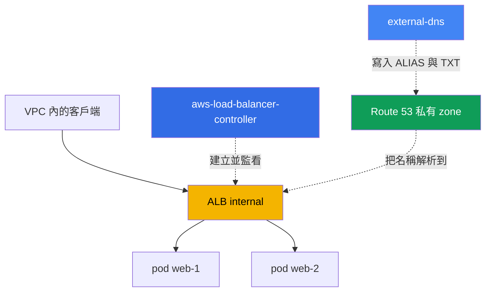
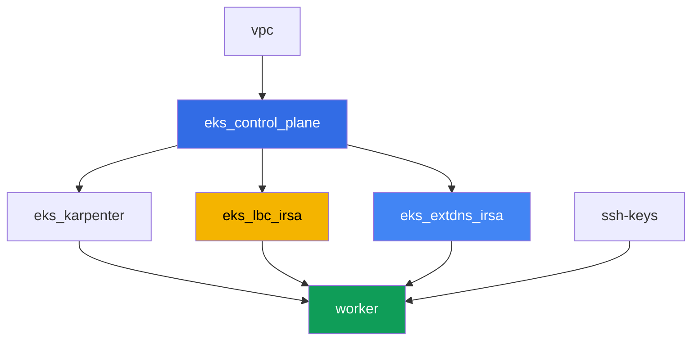

[Русская версия](README_RU.MD) · [Eng version](README.MD) · [Versión en español](README_ES.MD) · [Version française](README_FR.MD) · [Deutsche Version](README_DE.MD) · [ქართული ვერსია](README_GE.MD) · [日本語版](README_JP.MD)

# 實驗 109 - 透過 ALB 的 Ingress:ACM 憑證、external-dns 與 Route 53

## 說明

在這個實驗中,整個 L7 入口點會被拼在一起:一個 Ingress 透過 AWS Load Balancer
Controller(LBC)建立一個 Application Load Balancer,ALB 會掛上一張來自 ACM 的 TLS 憑
證,而 external-dns 則在一個私有的 Route 53 hosted zone 中為 ALB 設定外部 DNS 名稱。你
會走完整條路徑 - 從一個沒有位址的空 Ingress,到一個帶有 DNS 記錄與所有權 TXT 標記的、
可正常運作的 HTTPS 入口點 - 同時也會處理一個 Ingress 無法產生 ALB 的典型症狀。

這個實驗不需要你自己擁有一個真正的公開網域:私有 hosted zone 由實驗的 terraform 建立
並掛接到 VPC 上,而憑證是自我簽署後匯入 ACM 的。這並不會降低任務的價值:ALB 的
annotation、`certificate-arn`、`listen-ports`、`ssl-redirect` 的運作機制,以及
IngressGroup 與 external-dns 記錄的運作方式,對私有場景和公開場景都是一樣的。

任務以生產風格編寫:簡短的任務描述加驗收標準。驗證是自動的,透過 `check_result` 命令
完成。

## 目標

鞏固以下課程章節的內容:

- [第 27 章。透過 ALB 的 Ingress:target-type、annotation、TLS 與 ACM、WAF](../../course/27/tw.md)
- [第 29 章。DNS 與憑證:external-dns、Route 53、cert-manager](../../course/29/tw.md)

## 我們要創建什麼

集群已經以代碼方式部署完成(control plane、承載系統 Pod 的 Fargate、承載負載的
Karpenter)。Terraform 也會建立一個私有 hosted zone 和一張 ACM 中的自我簽署憑證。你要
安裝 LBC 和 external-dns,並圍繞它們建構整個入口點。

| 物件 | 這是什麼 | 在這個實驗中的作用 |
|--------|---------|-------------------|
| Namespace `eks-109` | 供實驗負載使用的集群區域 | 讓資源與系統資源分開 |
| Route 53 私有 hosted zone `eks-task109.internal` | 由 terraform 建立,掛接在實驗的 VPC 上 | external-dns 寫入記錄的目標 zone |
| ACM 憑證(自我簽署) | 由 terraform 透過 `tls_self_signed_cert` 建立並匯入 | ALB 的 HTTPS listener 用的 `certificate-arn` |
| Deployment `web`(2 個副本)+ Service `web` | ping_pong 應用程式 | Ingress 要對外發布的負載 |
| ServiceAccount + Deployment `aws-load-balancer-controller` | Helm chart,角色透過 IRSA 取得 | 從 Ingress 建立出 ALB |
| Ingress `web` | `ingressClassName: alb`、TLS、IngressGroup | 入口點本身:ALB、HTTPS、DNS 名稱 |
| ServiceAccount + Deployment `external-dns` | Helm chart,角色透過 IRSA 取得 | 在 Route 53 中同步 ALIAS 與 TXT 記錄 |

最終的流量與 DNS 圖景:



## 基礎設施

環境透過 Terragrunt 部署在 AWS(`eu-central-1`)。實驗中的每個目錄都是一個組件,擁有
自己的 `terragrunt.hcl`,它引用 `terraform/modules/` 中的共用模組,並透過 `dependency`
區塊聲明依賴關係。

### 模組與依賴關係

| 目錄(組件) | 模組(`terraform/modules/`) | 依賴於 | 創建了什麼 |
|---------------------|-------------------------------|------------|-------------|
| `vpc` | `vpc_v3` | - | VPC `10.10.0.0/16`,兩個 AZ 中的子網,NAT |
| `ssh-keys` | `ssh-keys` | - | 供工作機使用的一對 SSH 金鑰 |
| `eks_control_plane` | `eks_v2_control_plane` | `vpc` | EKS control plane `1.36`、OIDC provider |
| `eks_fargate_system` | `eks_v2_fargate` | `vpc`、`eks_control_plane` | `kube-system` 與 `karpenter` 的 Fargate 配置檔 |
| `eks_addons` | `eks_v2_addons` | `eks_control_plane`、`eks_fargate_system` | coredns、kube-proxy、vpc-cni、pod-identity |
| `eks_karpenter` | `eks_v2_karpenter` | `vpc`、`eks_control_plane`、`eks_addons`、`eks_fargate_system` | Karpenter 控制器、節點 IAM 角色 |
| `eks_karpenter_default_vng` | `eks_v2_karpenter_vng` | `vpc`、`eks_control_plane`、`eks_karpenter` | 建立在 AL2023 上的預設 NodePool |
| `eks_lbc_irsa` | `eks_v2_lbc_irsa` | `eks_control_plane` | AWS Load Balancer Controller 用的 IRSA IAM 角色 |
| `eks_extdns_irsa` | `eks_v2_extdns_irsa` | `vpc`、`eks_control_plane` | external-dns 用的 IRSA IAM 角色、私有 hosted zone、自我簽署的 ACM 憑證 |
| `worker` | `eks_v2_work_pc` | `ssh-keys`、`vpc`、`eks_control_plane`、`eks_karpenter`、`eks_lbc_irsa`、`eks_extdns_irsa` | 帶有 kubectl、測試腳本和 `check_result` 的工作機 |

模組 `eks_v2_extdns_irsa` 是這個實驗新增的,仿照 `eks_v2_lbc_irsa` 和 `eks_v2_ebs_irsa`
建構(`var.tf`、`locals.tf`、`data.tf`、`aws.tf`、`cmdb.tf`、`iam_irsa.tf`、
`output.tf`、`versions.tf`)。它還會建立一個 `aws_route53_zone`(私有,掛接在 VPC
上)以及一個 `aws_acm_certificate`,來源是 `tls` provider 產生的自我簽署憑證
(`tls_private_key` + `tls_self_signed_cert`)。IAM 角色信任集群的 OIDC,並附帶對
`system:serviceaccount:kube-system:external-dns` 的 `sub` 條件,同時帶有一組最小化的
external-dns policy(對 zone 的 `route53:ChangeResourceRecordSets`、
`ListResourceRecordSets`、`ListTagsForResources`,以及對 `*` 的
`ListHostedZones`)。

依賴關係圖(較早套用的組件位於箭頭下方):



組件 `eks_fargate_system`、`eks_addons`、`eks_karpenter_default_vng` 為了讓上圖保持可
讀性(不超過 8 個節點)而未列入 - 它們按標準順序套用在 `eks_control_plane` 和
`eks_karpenter` 之間,如同實驗 101。

### 各項設定在哪裡配置

`env.hcl`(共用的環境參數):

| 參數 | 實驗中的值 | 影響什麼 |
|----------|-----------------|---------------|
| `region` | `eu-central-1` | 所有資源的區域 |
| `vpc_default_cidr`、`subnets` | `10.10.0.0/16`,依 AZ 劃分的子網 | VPC 的位址規劃 |
| `prefix` | `eks-task109` | 資源名稱與標籤的前綴 |
| `stack_name` | `eks109` | 用於構建 `env_name` - 集群名稱 |
| `zone_domain` | `eks-task109.internal` | 私有 Route 53 hosted zone 的名稱 |
| `cert_common_name` | `app.eks-task109.internal` | 自我簽署 ACM 憑證的 Common Name |
| `k8_version` | `1.36.0` | 工作機上 kubectl 的版本 |
| `instance_type_worker` | `t3.medium` | 工作機的 instance 類型 |
| `ssh_password_enable`、`access_cidrs` | `true`、`0.0.0.0/0` | 對工作機的 SSH 存取 |

每個組件 `terragrunt.hcl` 中的 `inputs`:

| 檔案 | 關鍵設定 |
|------|--------------------|
| `eks_control_plane/terragrunt.hcl` | `eks.version = "1.36"`,control plane 和節點使用的子網 |
| `eks_lbc_irsa/terragrunt.hcl` | LBC 角色信任政策所需的 `name`(集群)與 `oidc_provider_arn` |
| `eks_extdns_irsa/terragrunt.hcl` | `name`、`oidc_provider_arn`、`vpc_id`、`zone_domain`、`cert_common_name` |
| `worker/terragrunt.hcl` | 指向實驗 109 檔案的 `test_url`、`task_script_url`;依賴於 `eks_lbc_irsa` 和 `eks_extdns_irsa` |

## 部署

```bash
TASK=109 make run_eks_task
```

部署大約需要 15-20 分鐘。在輸出中找到連接工作機的 SSH 那一行並連接上去。kubectl 在那
裡已經配置好指向正確的集群。

工作機上的常用命令:

```bash
time_left       # 環境剩餘的時間
check_result    # 檢查解答
```

> 測試環境的安全性。`env.hcl` 中啟用了 `ssh_password_enable = true` 和
> `access_cidrs = ["0.0.0.0/0"]` - 這對於學習環境很方便,但在生產環境中不應該這樣做。
> 依照課程標準(第 0.2、2、19 章),對工作機的存取應透過 AWS SSM Session Manager 進行,
> 不對外暴露公開的 SSH 端口,並將 `access_cidrs` 限制到具體的位址。這裡保留公開 SSH 只
> 是為了簡化啟動流程。

## 任務

---
|        **1**        | **Namespace、Service 與 ping_pong 負載**                  |
| :-----------------: | :---------------------------------------------------------- |
| 我們要做什麼          | 創建 namespace `eks-109`。在其中部署一個 Deployment `web`,映像 `viktoruj/ping_pong:latest`,`2` 個副本,容器 port `8080`。創建一個類型為 `ClusterIP` 的 Service `web`,port `80`,`targetPort: 8080`,selector `app: web`。等待 `2` 個就緒副本。 |
| 驗收標準    | - namespace `eks-109` 存在;<br/>- Deployment `web` 使用映像 `viktoruj/ping_pong`,並有 `2` 個就緒副本;<br/>- Service `web` 類型為 `ClusterIP`,port `80`。 |
---
|        **2**        | **ServiceAccount 與安裝 AWS Load Balancer Controller**  |
| :-----------------: | :---------------------------------------------------------- |
| 我們要做什麼          | 找出 terraform 為控制器建立的 IAM 角色的 ARN(角色名稱 `<cluster-name>-lbc-irsa`),並在 `kube-system` 中創建一個 ServiceAccount `aws-load-balancer-controller`,附上指向該角色的 annotation `eks.amazonaws.com/role-arn`。透過 Helm(repository `https://aws.github.io/eks-charts`,chart `aws-load-balancer-controller`)安裝 AWS Load Balancer Controller,並帶上旗標 `--set serviceAccount.create=false --set serviceAccount.name=aws-load-balancer-controller` 和 `--set clusterName=<集群名稱>`。等待 Deployment `aws-load-balancer-controller` 出現一個就緒副本。 |
| 驗收標準    | - `kube-system` 中的 ServiceAccount `aws-load-balancer-controller` 帶有指向 `lbc-irsa` 角色的 annotation;<br/>- `kube-system` 中的 Deployment `aws-load-balancer-controller` 至少有一個就緒副本。 |
---
|        **3**        | **透過 ALB 的 Ingress:internal,target-type ip**              |
| :-----------------: | :---------------------------------------------------------- |
| 我們要做什麼          | 在 namespace `eks-109` 中創建 Ingress `web`,`ingressClassName: alb`,annotation `alb.ingress.kubernetes.io/scheme: internal`、`alb.ingress.kubernetes.io/target-type: ip`、`alb.ingress.kubernetes.io/group.name: eks-task109-web`,一條規則 `host: app.eks-task109.internal`,path `/` 指向 Service `web` port `80`。等待出現位址(`kubectl get ingress web -n eks-109 -w`)。使用 `aws elbv2 describe-load-balancers` 和 `aws elbv2 describe-listeners`,確認有一個 `Type: application`、`Scheme: internal` 的 load balancer,以及一個 `80` 上的 listener,把兩個輸出都存到 `/var/work/tests/artifacts/3/alb.txt`。 |
| 驗收標準    | - Ingress `web` 的 `ingressClassName: alb`,且 `status.loadBalancer.ingress[0].hostname` 中有位址;<br/>- 檔案 `alb.txt` 不為空,包含 `"Type": "application"`、`"Scheme": "internal"` 和 `"Port": 80`。 |
---
|        **4**        | **TLS:ACM 憑證、HTTPS listener、redirect**             |
| :-----------------: | :---------------------------------------------------------- |
| 我們要做什麼          | 找出 terraform 建立的自我簽署憑證的 ARN(`aws acm list-certificates`,網域 `app.eks-task109.internal`)。在 Ingress `web` 上加入 annotation `alb.ingress.kubernetes.io/certificate-arn`(該 ARN)、`alb.ingress.kubernetes.io/listen-ports: '[{"HTTP": 80}, {"HTTPS": 443}]'`、`alb.ingress.kubernetes.io/ssl-redirect: '443'`,以及 `spec.tls`,`hosts: ["app.eks-task109.internal"]`。使用 `aws elbv2 describe-listeners`,確認出現了一個 protocol 為 `HTTPS`、port 為 `443`,且帶有指定 `CertificateArn` 的 listener,把輸出存到 `/var/work/tests/artifacts/4/https.txt`。 |
| 驗收標準    | - Ingress `web` 帶有 `certificate-arn` annotation 和帶有正確 host 的 `spec.tls`;<br/>- 檔案 `https.txt` 不為空,且包含 `"Protocol": "HTTPS"` 和 `"Port": 443`。 |
---
|        **5**        | **external-dns:私有 hosted zone 中的 ALIAS 與 TXT**         |
| :-----------------: | :---------------------------------------------------------- |
| 我們要做什麼          | 找出 IAM 角色 `<cluster-name>-extdns-irsa` 的 ARN,以及私有 hosted zone `eks-task109.internal` 的 ID(`aws route53 list-hosted-zones-by-name`)。在 `kube-system` 中創建 ServiceAccount `external-dns`,附上指向該角色的 annotation,然後透過 Helm(repository `https://kubernetes-sigs.github.io/external-dns/`,chart `external-dns`)安裝 external-dns,設定 `provider.name: aws`、`policy: upsert-only`、`registry: txt`、一個唯一的 `txtOwnerId`、`domainFilters: [eks-task109.internal]`、`sources: [ingress]`、`extraArgs.aws-zone-type: private`、`serviceAccount.create: false`、`serviceAccount.name: external-dns`。等待記錄出現,並把該 zone 的 `aws route53 list-resource-record-sets` 輸出存到 `/var/work/tests/artifacts/5/dns.txt`。 |
| 驗收標準    | - `kube-system` 中的 Deployment `external-dns` 至少有一個就緒副本;<br/>- 檔案 `dns.txt` 不為空,包含一筆類型為 `A`(ALIAS)的 `app.eks-task109.internal` 記錄,以及一筆所有權 TXT 記錄。 |
---
|        **6**        | **診斷:錯誤的 ingressClassName 與 IngressGroup**     |
| :-----------------: | :---------------------------------------------------------- |
| 我們要做什麼          | 創建一個 `IngressClass` `wrong-class`,`spec.controller: example.com/not-alb`(需要一個真實的物件,因為 LBC 的 admission webhook 會拒絕引用不存在類別的 Ingress),然後在 `eks-109` 中創建第二個 Ingress `status`,`ingressClassName: wrong-class`(path `/status` 指向 Service `web` port `80`)。確認它沒有位址(LBC 只監看 controller 為 `ingress.k8s.aws/alb` 的類別),並把原因寫在 `/var/work/tests/artifacts/6/groupfix.txt`。然後修復它:設定 `ingressClassName: alb`,加上 `alb.ingress.kubernetes.io/scheme: internal`、`alb.ingress.kubernetes.io/target-type: ip`、`alb.ingress.kubernetes.io/group.name: eks-task109-web`(與 Ingress `web` 相同的 group 名稱)以及 `group.order: '10'`。等待出現位址,並在同一個檔案中補上:`status` 的位址與 `web` 的位址一致 - 兩個 Ingress 透過 IngressGroup 共用同一個 ALB。 |
| 驗收標準    | - 檔案 `groupfix.txt` 不為空,包含 `ingressClassName` 和 `wrong-class`(對症狀的解釋);<br/>- 修復後的 Ingress `status` 帶有 `ingressClassName: alb`,且位址(`status.loadBalancer.ingress[0].hostname`)與 Ingress `web` 相同。 |
---

## 檢查結果

在工作機上執行自動檢查:

```bash
check_result
```

腳本會執行測試並顯示已完成任務的百分比。

## 解答

參考解答:[worker/files/solutions/1_TW.MD](worker/files/solutions/1_TW.MD)

## 刪除集群與資源

> 刪除之前。Ingress `web` 和 `status` 透過 ELBv2/EC2 API(AWS Load Balancer Controller)
> 直接建立了一個真實的 ALB 和兩個 security group - 這些都不在 terraform state 中。刪除
> Ingress,讓 LBC 自己呼叫 AWS API 去刪除 ALB 和 SG(finalizer 會阻止物件從 etcd 中被移
> 除,直到 LBC 確認清理完成):
>
> ```bash
> kubectl delete ingress web status -n eks-109
> kubectl wait --for=delete ingress/web ingress/status -n eks-109 --timeout=120s
> ```
>
> 任務 5 中的 external-dns 不會自動移除 `A`/`AAAA`/`TXT` 記錄:你在安裝時明確設定的
> `policy: upsert-only` 是一種刻意的「只創建和更新」模式,不會刪除 - 這是該項目已記載
> 的行為(防止控制器重啟時意外遺失 DNS 記錄)。請透過 AWS CLI 手動刪除它們 - 否則 hosted
> zone 會保留超出 `NS`/`SOA` 之外的記錄,terraform 也就無法刪除該 zone 本身:
>
> ```bash
> ZONE_ID=$(aws route53 list-hosted-zones-by-name --dns-name eks-task109.internal \
>   --query "HostedZones[0].Id" --output text)
> aws route53 change-resource-record-sets --hosted-zone-id "$ZONE_ID" --change-batch '{
>   "Changes": [
>     {"Action": "DELETE", "ResourceRecordSet": {"Name": "app.eks-task109.internal.", "Type": "A", "AliasTarget": {"HostedZoneId": "<CanonicalHostedZoneId ALB>", "DNSName": "<DNSName ALB>.", "EvaluateTargetHealth": true}}},
>     {"Action": "DELETE", "ResourceRecordSet": {"Name": "app.eks-task109.internal.", "Type": "AAAA", "AliasTarget": {"HostedZoneId": "<CanonicalHostedZoneId ALB>", "DNSName": "<DNSName ALB>.", "EvaluateTargetHealth": true}}},
>     {"Action": "DELETE", "ResourceRecordSet": {"Name": "aaaa-app.eks-task109.internal.", "Type": "TXT", "TTL": 300, "ResourceRecords": [{"Value": "\"heritage=external-dns,external-dns/owner=eks-task109,external-dns/resource=ingress/eks-109/web\""}]}},
>     {"Action": "DELETE", "ResourceRecordSet": {"Name": "cname-app.eks-task109.internal.", "Type": "TXT", "TTL": 300, "ResourceRecords": [{"Value": "\"heritage=external-dns,external-dns/owner=eks-task109,external-dns/resource=ingress/eks-109/web\""}]}}
>   ]
> }'
> # 更簡單的做法:刪除前先確認實際的數值,再代入上面的命令中
> aws route53 list-resource-record-sets --hosted-zone-id "$ZONE_ID"
> ```
>
> 一定要在 `terragrunt destroy` **之前**刪除這些 Ingress。如果 control plane 在它們之前
> 被刪除,ALB 和它的 SG 就會變成孤兒(佔用子網中的 ENI - VPC 和 Internet Gateway 會卡在
> `Still destroying...`),LBC 也再幫不上忙了 - 唯一的辦法就是透過 AWS CLI 手動清理:
>
> ```bash
> VPC_ID=<這個實驗的 VPC ID>
> LB_ARN=$(aws elbv2 describe-load-balancers \
>   --query "LoadBalancers[?contains(LoadBalancerName,'eks109')].LoadBalancerArn" --output text)
> aws elbv2 delete-load-balancer --load-balancer-arn "$LB_ARN"
> # 等待子網中的 ENI 釋放,再刪除剩下的 SG:
> aws ec2 describe-security-groups --filters "Name=vpc-id,Values=$VPC_ID" \
>   --query "SecurityGroups[?GroupName!='default'].GroupId" --output text | \
>   xargs -n1 aws ec2 delete-security-group --group-id
> ```

```bash
TASK=109 make delete_eks_task
```
