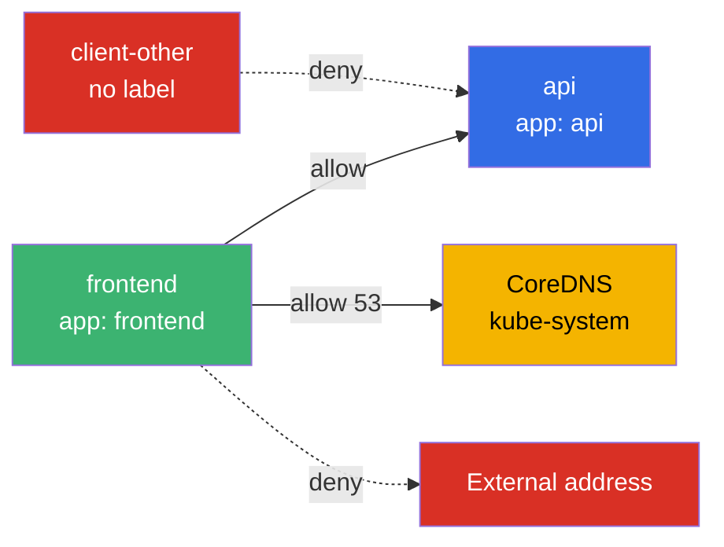
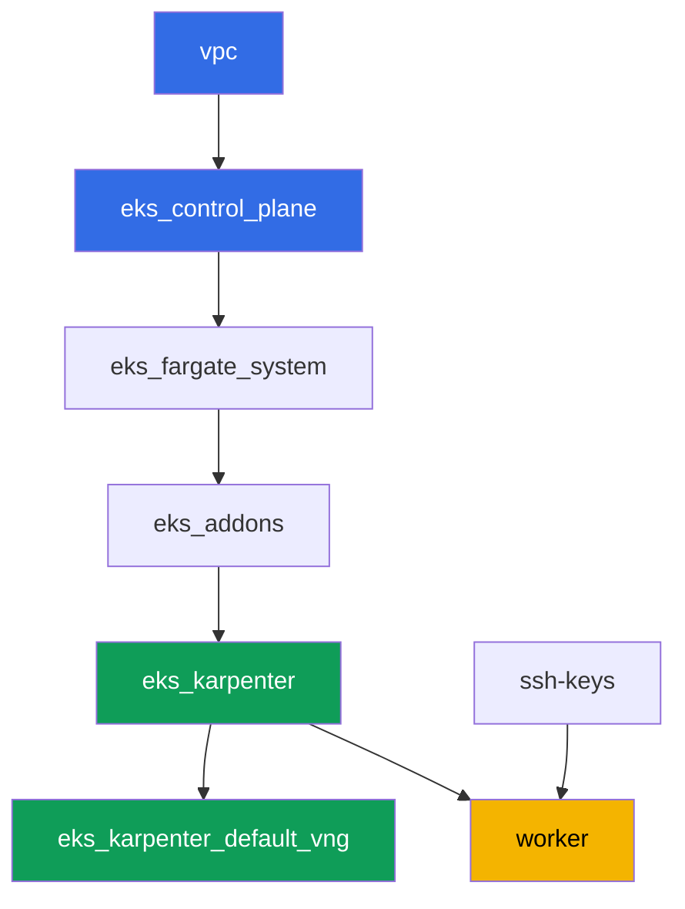

[Русская версия](README_RU.MD) · [Versión en español](README_ES.MD) · [Version française](README_FR.MD) · [Deutsche Version](README_DE.MD) · [ქართული ვერსია](README_GE.MD) · [繁體中文版](README_TW.MD) · [日本語版](README_JP.MD)

# Lab 110 - NetworkPolicy in EKS: the built-in VPC CNI network policy

## Description

In this lab you enable and verify the built-in east-west traffic control in VPC CNI: the
policy controller on the control plane and the eBPF-based `aws-network-policy-agent` agent
on every node. By default the `NetworkPolicy` object exists in EKS as an API object, but
nobody enforces it - all traffic between pods is allowed. You turn on enforcement via a
flag on the `vpc-cni` add-on, reproduce the symptom (connectivity allowed), then close it
with a default deny, open it back up selectively by label and by namespace, and restrict
outbound traffic with an explicit DNS exception. All of it with standard Kubernetes
`NetworkPolicy` syntax - no CRDs.

Tasks are written in a production style: a short statement plus acceptance criteria.
Checking is automatic, via the `check_result` command.

## Goal

Reinforce the material from the course chapters:

- [Chapter 8. Networking in detail: VPC CNI and alternative CNIs](../../course/08/ru.md) - the boundaries of the built-in network policy versus Cilium
- [Chapter 30. NetworkPolicy: rules, DNS, testing](../../course/30/ru.md) - default deny, allowing by label and namespace, egress

## What we're creating

The cluster is already deployed as code, the `vpc-cni` add-on is configured with
`enableNetworkPolicy = "true"`. You work with a ready-made enforcer and build workload and
policies on top of it.

| Object | What it is | Why it's in this lab |
|--------|---------|-------------------|
| Namespace `eks-110` | a cluster section for the lab's workload | keeps resources separate |
| Deployment `api` (2 replicas) + Service `api` | the ping_pong server | the target for checking policies |
| Deployment `client`, `frontend`, `client-other` | curl clients | different visibility by label |
| NetworkPolicy `default-deny-ingress` | denies ingress into `eks-110` | closes all east-west traffic |
| NetworkPolicy `allow-frontend-to-api` | allows by label | selective access `frontend` -> `api` |
| NetworkPolicy `restrict-egress` | restricts egress plus DNS | egress only to `api` and `kube-system:53` |

The resulting traffic picture in namespace `eks-110`:



## Infrastructure

The environment is deployed in AWS (`eu-central-1`) via Terragrunt. Each lab directory is
one component with its own `terragrunt.hcl`, which references a shared module in
`terraform/modules/` and declares dependencies through `dependency` blocks. Terragrunt
builds the dependency graph and applies components in the right order.

### Modules and dependencies

| Directory (component) | Module (`terraform/modules/`) | Depends on | What it creates |
|---------------------|-------------------------------|------------|-------------|
| `vpc` | `vpc_v3` | - | VPC `10.10.0.0/16`, subnets in two AZs, NAT |
| `ssh-keys` | `ssh-keys` | - | an SSH key pair for the worker machine and nodes |
| `eks_control_plane` | `eks_v2_control_plane` | `vpc` | EKS control plane `1.36`, OIDC |
| `eks_fargate_system` | `eks_v2_fargate` | `vpc`, `eks_control_plane` | Fargate profile for `kube-system` and `karpenter` |
| `eks_addons` | `eks_v2_addons` | `eks_control_plane`, `eks_fargate_system` | coredns, kube-proxy, vpc-cni (with `enableNetworkPolicy`), pod-identity |
| `eks_karpenter` | `eks_v2_karpenter` | `vpc`, `eks_control_plane`, `eks_addons`, `eks_fargate_system` | Karpenter controller, node IAM role |
| `eks_karpenter_default_vng` | `eks_v2_karpenter_vng` | `vpc`, `eks_control_plane`, `eks_karpenter` | default NodePool and EC2NodeClass |
| `worker` | `eks_v2_work_pc` | `ssh-keys`, `vpc`, `eks_control_plane`, `eks_karpenter` | worker machine, tests, `check_result` |

Dependency graph (what gets applied earlier is lower down the arrow):



### Where things are configured

`env.hcl` (shared environment parameters, read by all components):

| Parameter | Value in the lab | What it affects |
|----------|-----------------|---------------|
| `region` | `eu-central-1` | region for all resources |
| `prefix` | `eks-task110` | prefix for resource names and tags |
| `stack_name` | `eks110` | used to build `env_name` - the cluster name |
| `k8_version` | `1.36.0` | kubectl version on the worker machine |
| `instance_type_worker` | `t3.medium` | worker machine instance type |
| `ssh_password_enable`, `access_cidrs` | `true`, `0.0.0.0/0` | SSH access to the worker machine |

`inputs` in each component's `terragrunt.hcl` (parameters of a specific module):

| File | Key settings |
|------|--------------------|
| `eks_control_plane/terragrunt.hcl` | `eks.version = "1.36"` |
| `eks_addons/terragrunt.hcl` | add-on versions for 1.36; `vpc-cni` has an added `configuration = { enableNetworkPolicy = "true" }` block - the only difference between lab 110 and the base set |
| `eks_fargate_system/terragrunt.hcl` | namespace selectors for Fargate (`kube-system`, `karpenter`) |
| `eks_karpenter/terragrunt.hcl` | Karpenter version `1.8.1` |
| `eks_karpenter_default_vng/terragrunt.hcl` | NodePool `requirements`, `limits`, `disruption` |
| `worker/terragrunt.hcl` | `test_url` and `task_script_url` pointing to the lab 110 files |

`enableNetworkPolicy = "true"` turns on the Network Policy Controller on the control plane
(managed by AWS) and the `aws-network-policy-agent` agent in the `aws-node` DaemonSet on
every node - that's the one that actually programs rules via eBPF. The parameter requires
VPC CNI version `v1.14.0-eksbuild.3` or later; the lab has `v1.21.1-eksbuild.1` installed.

## Deployment

```bash
TASK=110 make run_eks_task
```

Deployment takes roughly 15-20 minutes. In the output, find the line with the SSH
connection to the worker machine and connect to it. kubectl there is already configured for
the right cluster.

Useful commands on the worker machine:

```bash
time_left       # how much environment time is left
check_result    # check the solution
```

> Environment security. `env.hcl` has `ssh_password_enable = true` and
> `access_cidrs = ["0.0.0.0/0"]` enabled - convenient for a training environment, but this
> is not something to do in production. Per the course standards (chapters 0.2, 2, 19),
> access to worker machines should go through AWS SSM Session Manager without exposing
> public SSH ports, and `access_cidrs` should be narrowed down to specific addresses. Here
> public SSH is left in place only to keep the setup simple.

## Tasks

---
|        **1**        | **Namespace for the lab's workload**                             |
| :-----------------: | :---------------------------------------------------------- |
| What to do          | Create a namespace named `eks-110`. All lab objects are created inside it. |
| Acceptance criteria    | - namespace `eks-110` exists. |
---
|        **2**        | **Checking that the network policy enforcer is enabled**           |
| :-----------------: | :---------------------------------------------------------- |
| What to do          | Make sure the policy agent is actually running on the nodes, not just declared in the configuration. Check two facts: the DaemonSet `aws-node` in `kube-system` contains a container `aws-network-policy-agent` (`kubectl describe daemonset aws-node -n kube-system`), and the `vpc-cni` add-on configuration confirms `enableNetworkPolicy: true` (`aws eks describe-addon --cluster-name <cluster> --addon-name vpc-cni --query "addon.configurationValues"`). Save both outputs to the file `/var/work/tests/artifacts/2/enforcer.txt`. |
| Acceptance criteria    | - the file is not empty;<br/>- it contains `aws-network-policy-agent`;<br/>- it contains `enableNetworkPolicy` and `true`. |
---
|        **3**        | **Symptom before any policy: connectivity is allowed by default**   |
| :-----------------: | :---------------------------------------------------------- |
| What to do          | In `eks-110` create Deployment `api` (image `viktoruj/ping_pong:latest`, `2` replicas) and Service `api` on port `8080`. Create Deployment `client` (image `curlimages/curl:latest`, command `sleep 3600` so you can `kubectl exec` into it). Wait for both to become ready. Via `kubectl exec` on `client` run `curl` against `api.eks-110.svc.cluster.local:8080` with `--connect-timeout` and `--max-time`, save the response code in the format `HTTP_CODE=<code>` to the file `/var/work/tests/artifacts/3/connectivity_before.txt`. Without a single NetworkPolicy, connectivity is allowed. |
| Acceptance criteria    | - Deployment `api`, `2` ready replicas, Service `api` port `8080`;<br/>- Deployment `client`, `1` ready replica;<br/>- file `3/connectivity_before.txt` contains `HTTP_CODE=200`. |
---
|        **4**        | **Default deny ingress**                                     |
| :-----------------: | :---------------------------------------------------------- |
| What to do          | Create NetworkPolicy `default-deny-ingress` in `eks-110` with `podSelector: {}` and `policyTypes: ["Ingress"]` (no `ingress` section) - this closes all inbound traffic for every pod in the namespace. Repeat the `curl` from `client` to `api` with the same timeout and save the response code to the file `/var/work/tests/artifacts/4/connectivity_denied.txt`. The request should now fail to reach its target. |
| Acceptance criteria    | - NetworkPolicy `default-deny-ingress` with `policyTypes: ["Ingress"]`;<br/>- file `4/connectivity_denied.txt` does not contain `HTTP_CODE=200`. |
---
|        **5**        | **Allowing by label**                                      |
| :-----------------: | :---------------------------------------------------------- |
| What to do          | Create NetworkPolicy `allow-frontend-to-api`: `podSelector.matchLabels.app: api`, `policyTypes: ["Ingress"]`, `ingress.from.podSelector.matchLabels.app: frontend`, port `8080`. Create Deployment `frontend` (image `curlimages/curl:latest`, `sleep 3600`) - it will automatically get the label `app: frontend`. Also create Deployment `client-other` (same image) without the `app: frontend` label - it will get `app: client-other`. Check `curl` from `frontend` to `api` (save to `5/allowed_frontend.txt`) and from `client-other` to `api` (save to `5/blocked_other.txt`). |
| Acceptance criteria    | - NetworkPolicy `allow-frontend-to-api` with the specified `podSelector` and `ingress.from`;<br/>- `frontend` is ready, label `app: frontend`;<br/>- `client-other` is ready, label differs from `frontend`;<br/>- file `5/allowed_frontend.txt` contains `HTTP_CODE=200`;<br/>- file `5/blocked_other.txt` does not contain `HTTP_CODE=200`. |
---
|        **6**        | **Egress with a DNS exception**                              |
| :-----------------: | :---------------------------------------------------------- |
| What to do          | Create NetworkPolicy `restrict-egress`: `podSelector.matchLabels.app: frontend`, `policyTypes: ["Egress"]`, `egress` allows only the direction to `podSelector.matchLabels.app: api` and the direction to `namespaceSelector.matchLabels: kubernetes.io/metadata.name: kube-system` on ports `53/UDP` and `53/TCP`. Check that `frontend` resolves the name `api` and gets `HTTP_CODE=200` (save to `6/egress_dns_api.txt`), and that a request to an arbitrary external address (for example `curl` to `1.1.1.1`) does not go through (save to `6/egress_external_blocked.txt`). |
| Acceptance criteria    | - NetworkPolicy `restrict-egress` with `policyTypes: ["Egress"]` and `podSelector.matchLabels.app: frontend`;<br/>- file `6/egress_dns_api.txt` contains `HTTP_CODE=200`;<br/>- file `6/egress_external_blocked.txt` does not contain `HTTP_CODE=200`. |
---

## Checking the result

On the worker machine, run the automatic check:

```bash
check_result
```

The script will run the tests and show the percentage of completed tasks.

## Solution

Reference solution: [worker/files/solutions/1.MD](worker/files/solutions/1.MD)

## Deleting the cluster and resources

> **First remove the workload and wait for the EC2 nodes to leave, then tear down the
> stand.** This lab does not create any AWS resources by hand - everything extra is
> Kubernetes objects (Deployments `api`, `client`, `frontend`, `client-other` and the
> NetworkPolicies in namespace `eks-110`). There is one danger: if you delete the cluster
> while workload is still running, the Karpenter EC2 node goes down with it, and the
> secondary ENI from VPC CNI is left in `available` state and holds on to the node security
> group - `destroy` hangs on
> `module.eks.aws_security_group.node[0]: Still destroying...` for tens of minutes.

```bash
# 1. Remove the lab's workload (NetworkPolicies go away with the namespace)
kubectl delete namespace eks-110 --ignore-not-found

# 2. Wait until Karpenter removes the NodeClaim and the EC2 node (only fargate-* should remain)
while kubectl get nodeclaims --no-headers 2>/dev/null | grep -q .; do
  echo "NodeClaim still alive, waiting..."; sleep 15
done
kubectl get nodes | grep -v fargate
```

Only after that tear down the stand:

```bash
TASK=110 make delete_eks_task
```

If `destroy` still gets stuck on the node security group, an orphaned ENI is left behind.
Find and delete it:

```bash
aws ec2 describe-network-interfaces --filters Name=status,Values=available \
  --query 'NetworkInterfaces[?Tags[?Key==`eks:eni:owner`]].[NetworkInterfaceId,Description]' \
  --output table
aws ec2 delete-network-interface --network-interface-id <eni-id>
```
