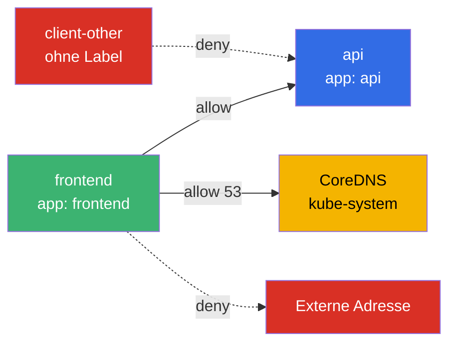
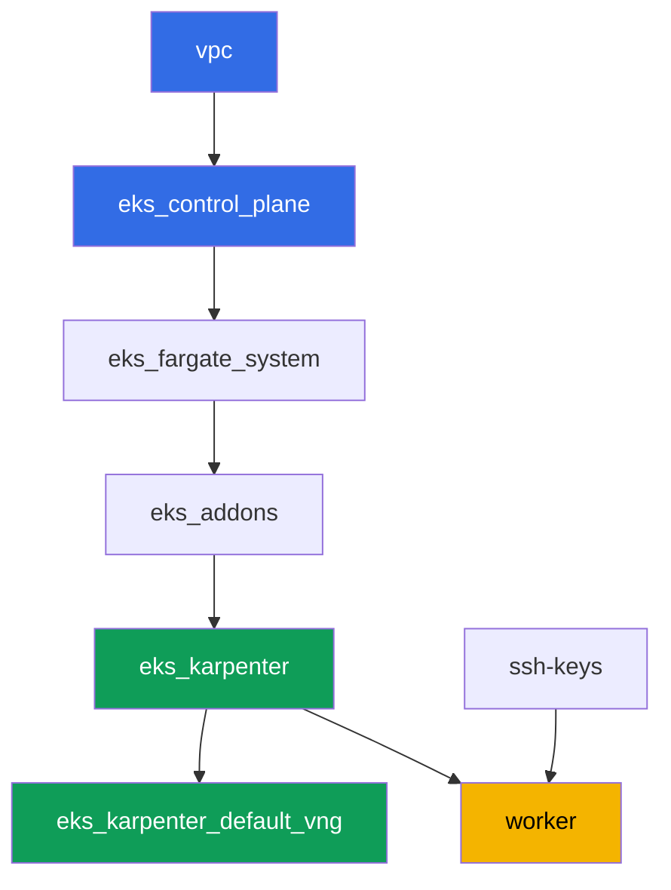

[Русская версия](README_RU.MD) · [Eng version](README.MD) · [Versión en español](README_ES.MD) · [Version française](README_FR.MD) · [ქართული ვერსია](README_GE.MD) · [繁體中文版](README_TW.MD) · [日本語版](README_JP.MD)

# Lab 110 - NetworkPolicy in EKS: die eingebaute VPC-CNI-Netzwerkrichtlinie

## Beschreibung

In diesem Lab aktivieren und überprüfen Sie die eingebaute Kontrolle des Ost-West-Traffics
in VPC CNI: den Policy-Controller auf der Control Plane und den eBPF-basierten Agenten
`aws-network-policy-agent` auf jedem Node. Standardmäßig existiert das Objekt
`NetworkPolicy` in EKS als API-Objekt, aber niemand setzt es durch - der gesamte Traffic
zwischen Pods ist erlaubt. Sie schalten die Durchsetzung über ein Flag am `vpc-cni`-Add-on
ein, reproduzieren das Symptom (Konnektivität ist erlaubt), schließen es dann mit einem
Default Deny, öffnen es gezielt nach Label und nach Namespace wieder, und schränken den
Egress-Traffic mit einer expliziten DNS-Ausnahme ein. Alles mit der Standard-Syntax der
Kubernetes-`NetworkPolicy` - ohne CRDs.

Die Aufgaben sind im Produktionsstil geschrieben: eine kurze Aufgabenstellung plus
Abnahmekriterien. Die Prüfung erfolgt automatisch über den Befehl `check_result`.

## Ziel

Den Stoff der folgenden Kurskapitel vertiefen:

- [Kapitel 8. Netzwerk im Detail: VPC CNI und alternative CNIs](../../course/08/de.md) - die Grenzen der eingebauten Netzwerkrichtlinie gegenüber Cilium
- [Kapitel 30. NetworkPolicy: Regeln, DNS, Testen](../../course/30/de.md) - Default Deny, Erlauben nach Label und Namespace, Egress

## Was wir erstellen

Der Cluster ist bereits als Code deployt, das `vpc-cni`-Add-on ist mit
`enableNetworkPolicy = "true"` konfiguriert. Sie arbeiten mit einem fertigen Enforcer und
bauen darauf Workload und Richtlinien auf.

| Objekt | Was es ist | Wofür in diesem Lab |
|--------|---------|-------------------|
| Namespace `eks-110` | ein Cluster-Bereich für die Lab-Workload | hält Ressourcen getrennt |
| Deployment `api` (2 Replicas) + Service `api` | der ping_pong-Server | das Ziel für die Prüfung der Richtlinien |
| Deployment `client`, `frontend`, `client-other` | curl-Clients | unterschiedliche Sichtbarkeit nach Label |
| NetworkPolicy `default-deny-ingress` | verweigert Ingress in `eks-110` | schließt den gesamten Ost-West-Traffic |
| NetworkPolicy `allow-frontend-to-api` | erlaubt nach Label | gezielter Zugriff `frontend` -> `api` |
| NetworkPolicy `restrict-egress` | schränkt Egress plus DNS ein | Egress nur zu `api` und `kube-system:53` |

Das resultierende Traffic-Bild im Namespace `eks-110`:



## Infrastruktur

Die Umgebung wird in AWS (`eu-central-1`) über Terragrunt deployt. Jedes Lab-Verzeichnis ist
eine Komponente mit eigenem `terragrunt.hcl`, das auf ein gemeinsames Modul in
`terraform/modules/` verweist und seine Abhängigkeiten über `dependency`-Blöcke deklariert.
Terragrunt baut den Abhängigkeitsgraphen und wendet die Komponenten in der richtigen
Reihenfolge an.

### Module und Abhängigkeiten

| Verzeichnis (Komponente) | Modul (`terraform/modules/`) | Abhängig von | Was es erstellt |
|---------------------|-------------------------------|------------|-------------|
| `vpc` | `vpc_v3` | - | VPC `10.10.0.0/16`, Subnetze in zwei AZ, NAT |
| `ssh-keys` | `ssh-keys` | - | ein SSH-Schlüsselpaar für die Worker-Maschine und die Nodes |
| `eks_control_plane` | `eks_v2_control_plane` | `vpc` | EKS Control Plane `1.36`, OIDC |
| `eks_fargate_system` | `eks_v2_fargate` | `vpc`, `eks_control_plane` | Fargate-Profil für `kube-system` und `karpenter` |
| `eks_addons` | `eks_v2_addons` | `eks_control_plane`, `eks_fargate_system` | coredns, kube-proxy, vpc-cni (mit `enableNetworkPolicy`), pod-identity |
| `eks_karpenter` | `eks_v2_karpenter` | `vpc`, `eks_control_plane`, `eks_addons`, `eks_fargate_system` | Karpenter-Controller, IAM-Rolle der Nodes |
| `eks_karpenter_default_vng` | `eks_v2_karpenter_vng` | `vpc`, `eks_control_plane`, `eks_karpenter` | Standard-NodePool und EC2NodeClass |
| `worker` | `eks_v2_work_pc` | `ssh-keys`, `vpc`, `eks_control_plane`, `eks_karpenter` | Worker-Maschine, Tests, `check_result` |

Abhängigkeitsgraph (was früher angewendet wird, steht weiter unten am Pfeil):



### Wo was konfiguriert wird

`env.hcl` (gemeinsame Umgebungsparameter, von allen Komponenten gelesen):

| Parameter | Wert im Lab | Was er beeinflusst |
|----------|-----------------|---------------|
| `region` | `eu-central-1` | Region aller Ressourcen |
| `prefix` | `eks-task110` | Präfix für Ressourcennamen und Tags |
| `stack_name` | `eks110` | wird verwendet, um `env_name` zu bilden - den Clusternamen |
| `k8_version` | `1.36.0` | kubectl-Version auf der Worker-Maschine |
| `instance_type_worker` | `t3.medium` | Instanztyp der Worker-Maschine |
| `ssh_password_enable`, `access_cidrs` | `true`, `0.0.0.0/0` | SSH-Zugriff auf die Worker-Maschine |

`inputs` im `terragrunt.hcl` jeder Komponente (Parameter eines bestimmten Moduls):

| Datei | Wichtige Einstellungen |
|------|--------------------|
| `eks_control_plane/terragrunt.hcl` | `eks.version = "1.36"` |
| `eks_addons/terragrunt.hcl` | Add-on-Versionen für 1.36; `vpc-cni` hat einen zusätzlichen Block `configuration = { enableNetworkPolicy = "true" }` - der einzige Unterschied zwischen Lab 110 und dem Basissatz |
| `eks_fargate_system/terragrunt.hcl` | Namespace-Selektoren für Fargate (`kube-system`, `karpenter`) |
| `eks_karpenter/terragrunt.hcl` | Karpenter-Version `1.8.1` |
| `eks_karpenter_default_vng/terragrunt.hcl` | NodePool `requirements`, `limits`, `disruption` |
| `worker/terragrunt.hcl` | `test_url` und `task_script_url`, die auf die Dateien von Lab 110 zeigen |

`enableNetworkPolicy = "true"` schaltet den Network Policy Controller auf der Control Plane
ein (verwaltet von AWS) sowie den Agenten `aws-network-policy-agent` im DaemonSet `aws-node`
auf jedem Node - dieser programmiert die Regeln tatsächlich über eBPF. Der Parameter
erfordert VPC CNI Version `v1.14.0-eksbuild.3` oder höher; im Lab ist `v1.21.1-eksbuild.1`
installiert.

## Deployment

```bash
TASK=110 make run_eks_task
```

Das Deployment dauert etwa 15-20 Minuten. Suchen Sie in der Ausgabe die Zeile mit der
SSH-Verbindung zur Worker-Maschine und verbinden Sie sich damit. kubectl ist dort bereits
für den richtigen Cluster konfiguriert.

Nützliche Befehle auf der Worker-Maschine:

```bash
time_left       # verbleibende Zeit der Umgebung
check_result    # Lösung prüfen
```

> Sicherheit der Testumgebung. In `env.hcl` sind `ssh_password_enable = true` und
> `access_cidrs = ["0.0.0.0/0"]` aktiviert - praktisch für eine Lernumgebung, aber so sollte
> man es in Produktion nicht machen. Nach den Standards des Kurses (Kapitel 0.2, 2, 19)
> sollte der Zugriff auf Worker-Maschinen über AWS SSM Session Manager erfolgen, ohne
> öffentliche SSH-Ports nach außen, und `access_cidrs` sollte auf konkrete Adressen
> eingeschränkt werden. Hier bleibt öffentliches SSH nur der Einfachheit halber bestehen.

## Aufgaben

---
|        **1**        | **Namespace für die Lab-Workload**                             |
| :-----------------: | :---------------------------------------------------------- |
| Was wir tun          | Erstellen Sie einen Namespace mit dem Namen `eks-110`. Alle Objekte des Labs werden darin erstellt. |
| Abnahmekriterien    | - Namespace `eks-110` existiert. |
---
|        **2**        | **Überprüfung, dass der Netzwerkrichtlinien-Enforcer aktiviert ist**           |
| :-----------------: | :---------------------------------------------------------- |
| Was wir tun          | Stellen Sie sicher, dass der Policy-Agent tatsächlich auf den Nodes läuft, nicht nur in der Konfiguration deklariert ist. Prüfen Sie zwei Tatsachen: dass das DaemonSet `aws-node` in `kube-system` einen Container `aws-network-policy-agent` enthält (`kubectl describe daemonset aws-node -n kube-system`), und dass die Konfiguration des `vpc-cni`-Add-ons `enableNetworkPolicy: true` bestätigt (`aws eks describe-addon --cluster-name <cluster> --addon-name vpc-cni --query "addon.configurationValues"`). Speichern Sie beide Ausgaben in der Datei `/var/work/tests/artifacts/2/enforcer.txt`. |
| Abnahmekriterien    | - die Datei ist nicht leer;<br/>- sie enthält `aws-network-policy-agent`;<br/>- sie enthält `enableNetworkPolicy` und `true`. |
---
|        **3**        | **Symptom vor jeder Richtlinie: Konnektivität ist standardmäßig erlaubt**   |
| :-----------------: | :---------------------------------------------------------- |
| Was wir tun          | Erstellen Sie in `eks-110` das Deployment `api` (Image `viktoruj/ping_pong:latest`, `2` Replicas) und den Service `api` auf Port `8080`. Erstellen Sie das Deployment `client` (Image `curlimages/curl:latest`, Befehl `sleep 3600`, damit Sie per `kubectl exec` hineingehen können). Warten Sie, bis beide bereit sind. Führen Sie per `kubectl exec` auf `client` `curl` gegen `api.eks-110.svc.cluster.local:8080` mit `--connect-timeout` und `--max-time` aus, speichern Sie den Antwortcode im Format `HTTP_CODE=<code>` in der Datei `/var/work/tests/artifacts/3/connectivity_before.txt`. Ohne eine einzige NetworkPolicy ist die Konnektivität erlaubt. |
| Abnahmekriterien    | - Deployment `api`, `2` bereite Replicas, Service `api` Port `8080`;<br/>- Deployment `client`, `1` bereite Replica;<br/>- die Datei `3/connectivity_before.txt` enthält `HTTP_CODE=200`. |
---
|        **4**        | **Default Deny Ingress**                                     |
| :-----------------: | :---------------------------------------------------------- |
| Was wir tun          | Erstellen Sie die NetworkPolicy `default-deny-ingress` in `eks-110` mit `podSelector: {}` und `policyTypes: ["Ingress"]` (ohne einen `ingress`-Abschnitt) - das schließt den gesamten eingehenden Traffic für jeden Pod im Namespace. Wiederholen Sie den `curl` von `client` zu `api` mit demselben Timeout und speichern Sie den Antwortcode in der Datei `/var/work/tests/artifacts/4/connectivity_denied.txt`. Die Anfrage sollte ihr Ziel jetzt nicht mehr erreichen. |
| Abnahmekriterien    | - NetworkPolicy `default-deny-ingress` mit `policyTypes: ["Ingress"]`;<br/>- die Datei `4/connectivity_denied.txt` enthält kein `HTTP_CODE=200`. |
---
|        **5**        | **Erlauben nach Label**                                      |
| :-----------------: | :---------------------------------------------------------- |
| Was wir tun          | Erstellen Sie die NetworkPolicy `allow-frontend-to-api`: `podSelector.matchLabels.app: api`, `policyTypes: ["Ingress"]`, `ingress.from.podSelector.matchLabels.app: frontend`, Port `8080`. Erstellen Sie das Deployment `frontend` (Image `curlimages/curl:latest`, `sleep 3600`) - es erhält automatisch das Label `app: frontend`. Erstellen Sie außerdem das Deployment `client-other` (dasselbe Image) ohne das Label `app: frontend` - es erhält `app: client-other`. Prüfen Sie `curl` von `frontend` zu `api` (speichern in `5/allowed_frontend.txt`) und von `client-other` zu `api` (speichern in `5/blocked_other.txt`). |
| Abnahmekriterien    | - NetworkPolicy `allow-frontend-to-api` mit dem angegebenen `podSelector` und `ingress.from`;<br/>- `frontend` ist bereit, Label `app: frontend`;<br/>- `client-other` ist bereit, Label unterscheidet sich von `frontend`;<br/>- die Datei `5/allowed_frontend.txt` enthält `HTTP_CODE=200`;<br/>- die Datei `5/blocked_other.txt` enthält kein `HTTP_CODE=200`. |
---
|        **6**        | **Egress mit einer DNS-Ausnahme**                              |
| :-----------------: | :---------------------------------------------------------- |
| Was wir tun          | Erstellen Sie die NetworkPolicy `restrict-egress`: `podSelector.matchLabels.app: frontend`, `policyTypes: ["Egress"]`, `egress` erlaubt nur die Richtung zu `podSelector.matchLabels.app: api` und die Richtung zu `namespaceSelector.matchLabels: kubernetes.io/metadata.name: kube-system` auf den Ports `53/UDP` und `53/TCP`. Prüfen Sie, dass `frontend` den Namen `api` auflöst und `HTTP_CODE=200` erhält (speichern in `6/egress_dns_api.txt`), und dass eine Anfrage an eine beliebige externe Adresse (zum Beispiel `curl` zu `1.1.1.1`) nicht durchgeht (speichern in `6/egress_external_blocked.txt`). |
| Abnahmekriterien    | - NetworkPolicy `restrict-egress` mit `policyTypes: ["Egress"]` und `podSelector.matchLabels.app: frontend`;<br/>- die Datei `6/egress_dns_api.txt` enthält `HTTP_CODE=200`;<br/>- die Datei `6/egress_external_blocked.txt` enthält kein `HTTP_CODE=200`. |
---

## Ergebnis prüfen

Führen Sie auf der Worker-Maschine die automatische Prüfung aus:

```bash
check_result
```

Das Skript führt die Tests aus und zeigt den Prozentsatz erledigter Aufgaben.

## Lösung

Referenzlösung: [worker/files/solutions/1_DE.MD](worker/files/solutions/1_DE.MD)

## Cluster und Ressourcen löschen

> **Entfernen Sie zuerst die Workload und warten Sie, bis die EC2-Nodes weg sind, bevor Sie
> den Stand abbauen.** Dieses Lab erstellt keine AWS-Ressourcen von Hand - alles Zusätzliche
> sind Kubernetes-Objekte (Deployments `api`, `client`, `frontend`, `client-other` und die
> NetworkPolicies im Namespace `eks-110`). Es gibt eine Gefahr: Wenn Sie den Cluster
> löschen, während noch Workload läuft, geht der Karpenter-EC2-Node mit ihm unter, und das
> sekundäre ENI von VPC CNI bleibt im Zustand `available` zurück und hält die
> Node-Security-Group fest - `destroy` hängt dann für Zehnminuten bei
> `module.eks.aws_security_group.node[0]: Still destroying...`.

```bash
# 1. Die Lab-Workload entfernen (die NetworkPolicies gehen mit dem Namespace weg)
kubectl delete namespace eks-110 --ignore-not-found

# 2. Warten, bis Karpenter den NodeClaim und den EC2-Node entfernt (nur fargate-* sollte übrig bleiben)
while kubectl get nodeclaims --no-headers 2>/dev/null | grep -q .; do
  echo "NodeClaim noch aktiv, warten..."; sleep 15
done
kubectl get nodes | grep -v fargate
```

Erst danach den Stand abbauen:

```bash
TASK=110 make delete_eks_task
```

Wenn `destroy` weiterhin bei der Node-Security-Group hängen bleibt, ist ein verwaistes ENI
zurückgeblieben. Finden und löschen Sie es:

```bash
aws ec2 describe-network-interfaces --filters Name=status,Values=available \
  --query 'NetworkInterfaces[?Tags[?Key==`eks:eni:owner`]].[NetworkInterfaceId,Description]' \
  --output table
aws ec2 delete-network-interface --network-interface-id <eni-id>
```
