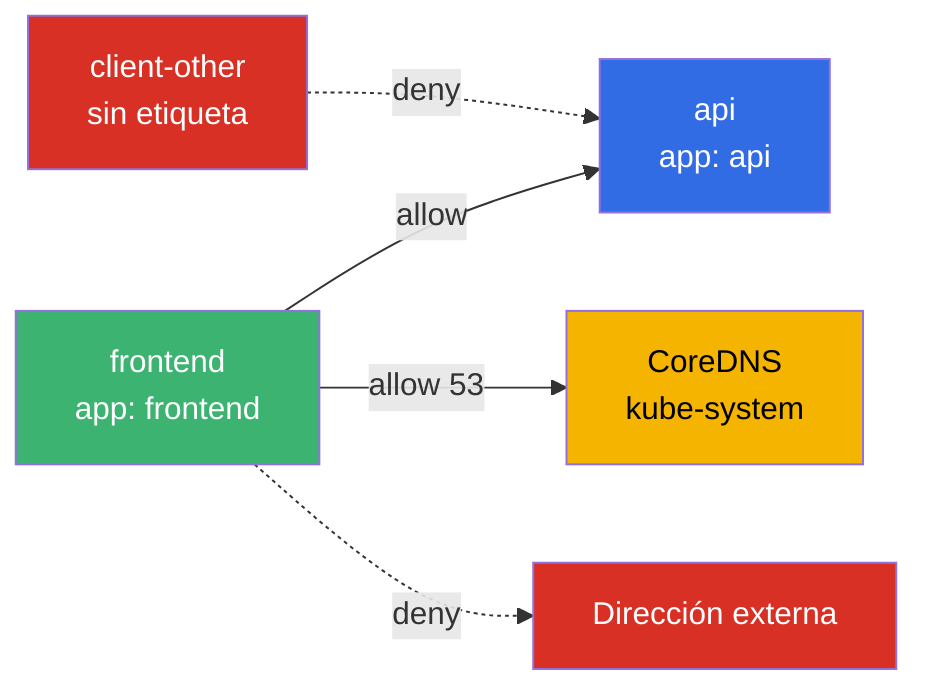
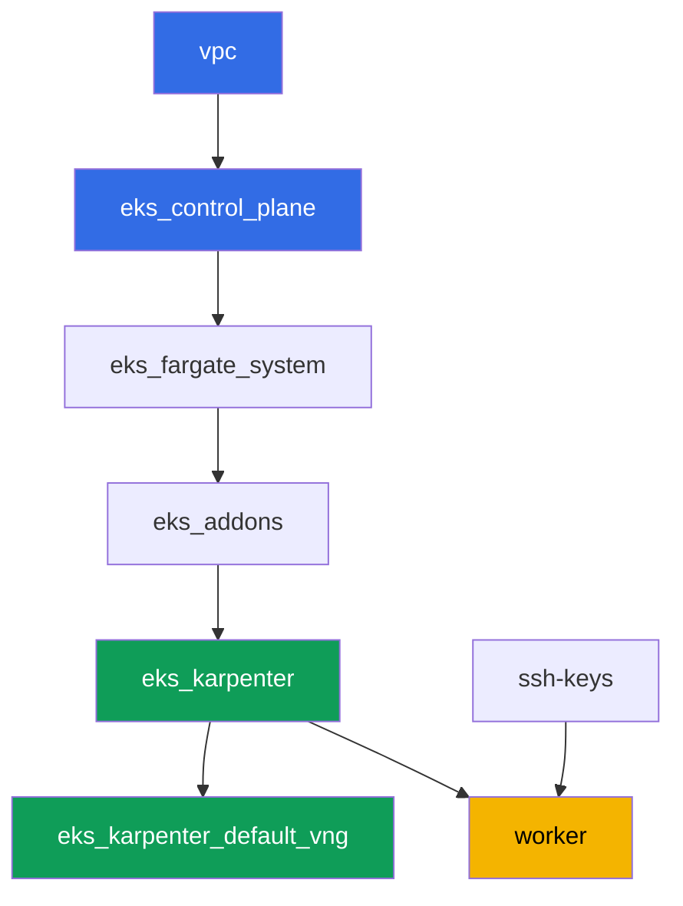

[Русская версия](README_RU.MD) · [Eng version](README.MD) · [Version française](README_FR.MD) · [Deutsche Version](README_DE.MD) · [ქართული ვერსია](README_GE.MD) · [繁體中文版](README_TW.MD) · [日本語版](README_JP.MD)

# Lab 110 - NetworkPolicy en EKS: la política de red integrada de VPC CNI

## Descripción

En este laboratorio activas y verificas el control de tráfico este-oeste integrado en VPC
CNI: el controlador de políticas en el control plane y el agente basado en eBPF
`aws-network-policy-agent` en cada nodo. Por defecto el objeto `NetworkPolicy` existe en EKS
como un objeto de la API, pero nadie lo aplica - todo el tráfico entre pods está permitido.
Activas la aplicación mediante una bandera en el add-on `vpc-cni`, reproduces el síntoma
(conectividad permitida), luego lo cierras con un default deny, lo vuelves a abrir de forma
selectiva por etiqueta y por namespace, y restringes el tráfico saliente con una excepción
explícita para DNS. Todo con la sintaxis estándar de `NetworkPolicy` de Kubernetes - sin
CRDs.

Las tareas están escritas en estilo de producción: un enunciado breve más criterios de
aceptación. La verificación es automática, mediante el comando `check_result`.

## Objetivo

Reforzar el material de los capítulos del curso:

- [Capítulo 8. Redes en detalle: VPC CNI y CNIs alternativos](../../course/08/es.md) - los límites de la política de red integrada frente a Cilium
- [Capítulo 30. NetworkPolicy: reglas, DNS, pruebas](../../course/30/es.md) - default deny, permitir por etiqueta y namespace, egress

## Qué vamos a crear

El clúster ya está desplegado como código, el add-on `vpc-cni` está configurado con
`enableNetworkPolicy = "true"`. Trabajas con un enforcer ya preparado y construyes la carga
de trabajo y las políticas sobre él.

| Objeto | Qué es | Para qué sirve en este laboratorio |
|--------|---------|-------------------|
| Namespace `eks-110` | una sección del clúster para la carga de trabajo del laboratorio | mantiene los recursos separados |
| Deployment `api` (2 réplicas) + Service `api` | el servidor ping_pong | el objetivo para comprobar las políticas |
| Deployment `client`, `frontend`, `client-other` | clientes curl | distinta visibilidad según la etiqueta |
| NetworkPolicy `default-deny-ingress` | deniega el ingress hacia `eks-110` | cierra todo el tráfico este-oeste |
| NetworkPolicy `allow-frontend-to-api` | permite por etiqueta | acceso selectivo `frontend` -> `api` |
| NetworkPolicy `restrict-egress` | restringe el egress más DNS | egress solo hacia `api` y `kube-system:53` |

La imagen resultante del tráfico en el namespace `eks-110`:



## Infraestructura

El entorno se despliega en AWS (`eu-central-1`) mediante Terragrunt. Cada carpeta del
laboratorio es un componente con su propio `terragrunt.hcl`, que hace referencia a un
módulo compartido en `terraform/modules/` y declara sus dependencias mediante bloques
`dependency`. Terragrunt construye el grafo de dependencias y aplica los componentes en el
orden correcto.

### Módulos y dependencias

| Carpeta (componente) | Módulo (`terraform/modules/`) | Depende de | Qué crea |
|---------------------|-------------------------------|------------|-------------|
| `vpc` | `vpc_v3` | - | VPC `10.10.0.0/16`, subredes en dos AZ, NAT |
| `ssh-keys` | `ssh-keys` | - | un par de claves SSH para la máquina de trabajo y los nodos |
| `eks_control_plane` | `eks_v2_control_plane` | `vpc` | control plane de EKS `1.36`, OIDC |
| `eks_fargate_system` | `eks_v2_fargate` | `vpc`, `eks_control_plane` | perfil de Fargate para `kube-system` y `karpenter` |
| `eks_addons` | `eks_v2_addons` | `eks_control_plane`, `eks_fargate_system` | coredns, kube-proxy, vpc-cni (con `enableNetworkPolicy`), pod-identity |
| `eks_karpenter` | `eks_v2_karpenter` | `vpc`, `eks_control_plane`, `eks_addons`, `eks_fargate_system` | controlador de Karpenter, rol IAM de los nodos |
| `eks_karpenter_default_vng` | `eks_v2_karpenter_vng` | `vpc`, `eks_control_plane`, `eks_karpenter` | NodePool y EC2NodeClass por defecto |
| `worker` | `eks_v2_work_pc` | `ssh-keys`, `vpc`, `eks_control_plane`, `eks_karpenter` | máquina de trabajo, tests, `check_result` |

Grafo de dependencias (lo que se aplica antes está más abajo en la flecha):



### Dónde se configura cada cosa

`env.hcl` (parámetros compartidos del entorno, leídos por todos los componentes):

| Parámetro | Valor en el laboratorio | Qué afecta |
|----------|-----------------|---------------|
| `region` | `eu-central-1` | región de todos los recursos |
| `prefix` | `eks-task110` | prefijo de nombres de recursos y etiquetas |
| `stack_name` | `eks110` | se usa para construir `env_name` - el nombre del clúster |
| `k8_version` | `1.36.0` | versión de kubectl en la máquina de trabajo |
| `instance_type_worker` | `t3.medium` | tipo de instancia de la máquina de trabajo |
| `ssh_password_enable`, `access_cidrs` | `true`, `0.0.0.0/0` | acceso SSH a la máquina de trabajo |

`inputs` en el `terragrunt.hcl` de cada componente (parámetros de un módulo específico):

| Archivo | Ajustes clave |
|------|--------------------|
| `eks_control_plane/terragrunt.hcl` | `eks.version = "1.36"` |
| `eks_addons/terragrunt.hcl` | versiones de los add-ons para 1.36; `vpc-cni` tiene añadido un bloque `configuration = { enableNetworkPolicy = "true" }` - la única diferencia entre el laboratorio 110 y el conjunto base |
| `eks_fargate_system/terragrunt.hcl` | selectores de namespace para Fargate (`kube-system`, `karpenter`) |
| `eks_karpenter/terragrunt.hcl` | versión de Karpenter `1.8.1` |
| `eks_karpenter_default_vng/terragrunt.hcl` | NodePool `requirements`, `limits`, `disruption` |
| `worker/terragrunt.hcl` | `test_url` y `task_script_url` apuntando a los archivos del laboratorio 110 |

`enableNetworkPolicy = "true"` activa el Network Policy Controller en el control plane
(gestionado por AWS) y el agente `aws-network-policy-agent` en el DaemonSet `aws-node` de
cada nodo - es el que realmente programa las reglas mediante eBPF. El parámetro requiere la
versión `v1.14.0-eksbuild.3` o posterior de VPC CNI; en el laboratorio está instalada la
`v1.21.1-eksbuild.1`.

## Despliegue

```bash
TASK=110 make run_eks_task
```

El despliegue tarda aproximadamente 15-20 minutos. En la salida, busca la línea con la
conexión SSH a la máquina de trabajo y conéctate a ella. kubectl ya está configurado allí
para el clúster correcto.

Comandos útiles en la máquina de trabajo:

```bash
time_left       # cuánto tiempo queda del entorno
check_result    # verificar la solución
```

> Seguridad del entorno. En `env.hcl` están activados `ssh_password_enable = true` y
> `access_cidrs = ["0.0.0.0/0"]` - cómodo para un entorno de formación, pero no es algo que
> se deba hacer en producción. Según los estándares del curso (capítulos 0.2, 2, 19), el
> acceso a las máquinas de trabajo se abre mediante AWS SSM Session Manager sin exponer
> puertos SSH públicos, y `access_cidrs` se restringe a direcciones concretas. Aquí se deja
> SSH público solo para simplificar el arranque.

## Tareas

---
|        **1**        | **Namespace para la carga del laboratorio**                             |
| :-----------------: | :---------------------------------------------------------- |
| Qué hacemos          | Crea un namespace llamado `eks-110`. Todos los objetos del laboratorio se crean dentro de él. |
| Criterios de aceptación    | - el namespace `eks-110` existe. |
---
|        **2**        | **Comprobación de que el enforcer de la política de red está activado**           |
| :-----------------: | :---------------------------------------------------------- |
| Qué hacemos          | Asegúrate de que el agente de políticas realmente está corriendo en los nodos, no solo declarado en la configuración. Comprueba dos hechos: que el DaemonSet `aws-node` en `kube-system` contiene un contenedor `aws-network-policy-agent` (`kubectl describe daemonset aws-node -n kube-system`), y que la configuración del add-on `vpc-cni` confirma `enableNetworkPolicy: true` (`aws eks describe-addon --cluster-name <cluster> --addon-name vpc-cni --query "addon.configurationValues"`). Guarda ambas salidas en el archivo `/var/work/tests/artifacts/2/enforcer.txt`. |
| Criterios de aceptación    | - el archivo no está vacío;<br/>- contiene `aws-network-policy-agent`;<br/>- contiene `enableNetworkPolicy` y `true`. |
---
|        **3**        | **Síntoma antes de cualquier política: la conectividad está permitida por defecto**   |
| :-----------------: | :---------------------------------------------------------- |
| Qué hacemos          | En `eks-110` crea el Deployment `api` (imagen `viktoruj/ping_pong:latest`, `2` réplicas) y el Service `api` en el puerto `8080`. Crea el Deployment `client` (imagen `curlimages/curl:latest`, comando `sleep 3600` para poder hacer `kubectl exec` dentro de él). Espera a que ambos queden listos. A través de `kubectl exec` en `client` ejecuta `curl` contra `api.eks-110.svc.cluster.local:8080` con `--connect-timeout` y `--max-time`, guarda el código de respuesta con el formato `HTTP_CODE=<code>` en el archivo `/var/work/tests/artifacts/3/connectivity_before.txt`. Sin ninguna NetworkPolicy, la conectividad está permitida. |
| Criterios de aceptación    | - Deployment `api`, `2` réplicas listas, Service `api` puerto `8080`;<br/>- Deployment `client`, `1` réplica lista;<br/>- el archivo `3/connectivity_before.txt` contiene `HTTP_CODE=200`. |
---
|        **4**        | **Default deny ingress**                                     |
| :-----------------: | :---------------------------------------------------------- |
| Qué hacemos          | Crea la NetworkPolicy `default-deny-ingress` en `eks-110` con `podSelector: {}` y `policyTypes: ["Ingress"]` (sin sección `ingress`) - esto cierra todo el tráfico entrante para cada pod del namespace. Repite el `curl` de `client` hacia `api` con el mismo timeout y guarda el código de respuesta en el archivo `/var/work/tests/artifacts/4/connectivity_denied.txt`. La petición ahora debería fallar al intentar alcanzar su destino. |
| Criterios de aceptación    | - NetworkPolicy `default-deny-ingress` con `policyTypes: ["Ingress"]`;<br/>- el archivo `4/connectivity_denied.txt` no contiene `HTTP_CODE=200`. |
---
|        **5**        | **Permitir por etiqueta**                                      |
| :-----------------: | :---------------------------------------------------------- |
| Qué hacemos          | Crea la NetworkPolicy `allow-frontend-to-api`: `podSelector.matchLabels.app: api`, `policyTypes: ["Ingress"]`, `ingress.from.podSelector.matchLabels.app: frontend`, puerto `8080`. Crea el Deployment `frontend` (imagen `curlimages/curl:latest`, `sleep 3600`) - obtendrá automáticamente la etiqueta `app: frontend`. Crea también el Deployment `client-other` (misma imagen) sin la etiqueta `app: frontend` - obtendrá `app: client-other`. Comprueba el `curl` de `frontend` hacia `api` (guárdalo en `5/allowed_frontend.txt`) y de `client-other` hacia `api` (guárdalo en `5/blocked_other.txt`). |
| Criterios de aceptación    | - NetworkPolicy `allow-frontend-to-api` con el `podSelector` y el `ingress.from` especificados;<br/>- `frontend` está listo, con la etiqueta `app: frontend`;<br/>- `client-other` está listo, con una etiqueta distinta de `frontend`;<br/>- el archivo `5/allowed_frontend.txt` contiene `HTTP_CODE=200`;<br/>- el archivo `5/blocked_other.txt` no contiene `HTTP_CODE=200`. |
---
|        **6**        | **Egress con una excepción de DNS**                              |
| :-----------------: | :---------------------------------------------------------- |
| Qué hacemos          | Crea la NetworkPolicy `restrict-egress`: `podSelector.matchLabels.app: frontend`, `policyTypes: ["Egress"]`, `egress` permite únicamente la dirección hacia `podSelector.matchLabels.app: api` y la dirección hacia `namespaceSelector.matchLabels: kubernetes.io/metadata.name: kube-system` en los puertos `53/UDP` y `53/TCP`. Comprueba que `frontend` resuelve el nombre `api` y obtiene `HTTP_CODE=200` (guárdalo en `6/egress_dns_api.txt`), y que una petición a una dirección externa arbitraria (por ejemplo, `curl` a `1.1.1.1`) no pasa (guárdalo en `6/egress_external_blocked.txt`). |
| Criterios de aceptación    | - NetworkPolicy `restrict-egress` con `policyTypes: ["Egress"]` y `podSelector.matchLabels.app: frontend`;<br/>- el archivo `6/egress_dns_api.txt` contiene `HTTP_CODE=200`;<br/>- el archivo `6/egress_external_blocked.txt` no contiene `HTTP_CODE=200`. |
---

## Verificación del resultado

En la máquina de trabajo, ejecuta la verificación automática:

```bash
check_result
```

El script ejecutará los tests y mostrará el porcentaje de tareas completadas.

## Solución

Solución de referencia: [worker/files/solutions/1_ES.MD](worker/files/solutions/1_ES.MD)

## Eliminación del clúster y los recursos

> **Primero elimina la carga de trabajo y espera a que los nodos EC2 se retiren, luego
> destruye el stand.** Este laboratorio no crea ningún recurso de AWS a mano - todo lo
> adicional son objetos de Kubernetes (Deployments `api`, `client`, `frontend`,
> `client-other` y las NetworkPolicies en el namespace `eks-110`). Hay un peligro: si
> eliminas el clúster mientras la carga de trabajo todavía está corriendo, el nodo EC2 de
> Karpenter se cae con él, y el ENI secundario de VPC CNI queda en estado `available` y
> retiene el security group del nodo - `destroy` se queda colgado en
> `module.eks.aws_security_group.node[0]: Still destroying...` durante decenas de minutos.

```bash
# 1. Elimina la carga de trabajo del laboratorio (las NetworkPolicies desaparecen con el namespace)
kubectl delete namespace eks-110 --ignore-not-found

# 2. Espera hasta que Karpenter elimine el NodeClaim y el nodo EC2 (solo deberían quedar los fargate-*)
while kubectl get nodeclaims --no-headers 2>/dev/null | grep -q .; do
  echo "NodeClaim todavía vivo, esperando..."; sleep 15
done
kubectl get nodes | grep -v fargate
```

Solo después de eso destruye el stand:

```bash
TASK=110 make delete_eks_task
```

Si `destroy` sigue atascado en el security group del nodo, ha quedado un ENI huérfano.
Búscalo y elimínalo:

```bash
aws ec2 describe-network-interfaces --filters Name=status,Values=available \
  --query 'NetworkInterfaces[?Tags[?Key==`eks:eni:owner`]].[NetworkInterfaceId,Description]' \
  --output table
aws ec2 delete-network-interface --network-interface-id <eni-id>
```
