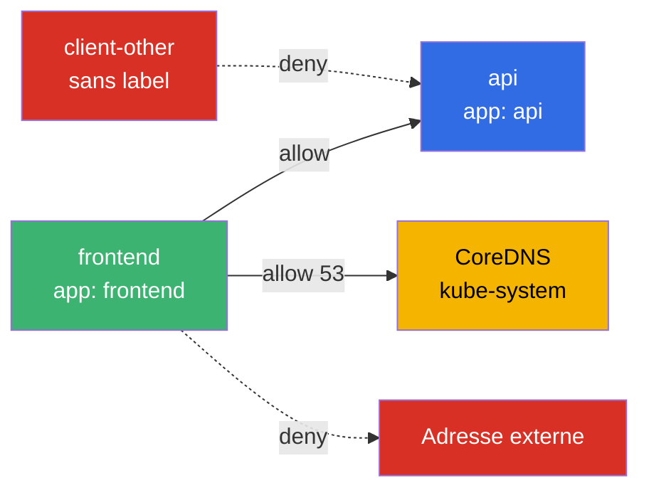
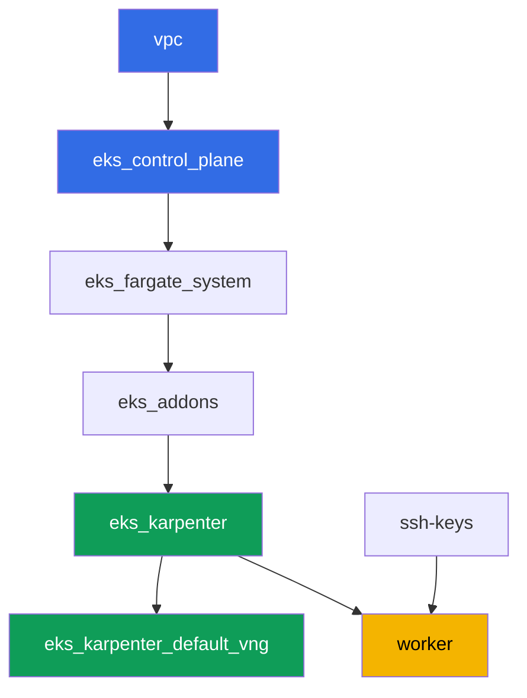

[Русская версия](README_RU.MD) · [Eng version](README.MD) · [Versión en español](README_ES.MD) · [Deutsche Version](README_DE.MD) · [ქართული ვერსია](README_GE.MD) · [繁體中文版](README_TW.MD) · [日本語版](README_JP.MD)

# Lab 110 - NetworkPolicy dans EKS : la politique réseau intégrée du VPC CNI

## Description

Dans ce laboratoire, vous activez et vérifiez le contrôle de trafic east-west intégré au
VPC CNI : le contrôleur de politique sur le control plane et l'agent basé sur eBPF
`aws-network-policy-agent` sur chaque nœud. Par défaut, l'objet `NetworkPolicy` existe dans
EKS en tant qu'objet API, mais personne ne l'applique - tout le trafic entre les pods est
autorisé. Vous activez l'application via un flag sur l'add-on `vpc-cni`, reproduisez le
symptôme (connectivité autorisée), puis vous la fermez avec un deny par défaut, la rouvrez
sélectivement par label et par namespace, et restreignez le trafic sortant avec une
exception DNS explicite. Tout cela avec la syntaxe standard `NetworkPolicy` de Kubernetes -
sans CRD.

Les tâches sont écrites dans un style de production : un énoncé court plus des critères
d'acceptation. La vérification est automatique, via la commande `check_result`.

## Objectif

Consolider le contenu des chapitres suivants du cours :

- [Chapitre 8. Le réseau en détail : VPC CNI et les CNI alternatifs](../../course/08/ru.md) - les limites de la politique réseau intégrée face à Cilium
- [Chapitre 30. NetworkPolicy : règles, DNS, tests](../../course/30/ru.md) - deny par défaut, autorisation par label et par namespace, egress

## Ce que nous créons

Le cluster est déjà déployé en tant que code, l'add-on `vpc-cni` est configuré avec
`enableNetworkPolicy = "true"`. Vous travaillez avec un enforcer déjà prêt et construisez
la charge de travail et les politiques par-dessus.

| Objet | Ce que c'est | Pourquoi dans ce laboratoire |
|--------|---------|-------------------|
| Namespace `eks-110` | une section du cluster pour la charge de travail du laboratoire | garde les ressources séparées |
| Deployment `api` (2 réplicas) + Service `api` | le serveur ping_pong | la cible pour vérifier les politiques |
| Deployment `client`, `frontend`, `client-other` | clients curl | visibilité différente selon le label |
| NetworkPolicy `default-deny-ingress` | refuse l'ingress dans `eks-110` | ferme tout le trafic east-west |
| NetworkPolicy `allow-frontend-to-api` | autorise par label | accès sélectif `frontend` -> `api` |
| NetworkPolicy `restrict-egress` | restreint l'egress plus DNS | egress uniquement vers `api` et `kube-system:53` |

Vue résultante du trafic dans le namespace `eks-110` :



## Infrastructure

L'environnement est déployé sur AWS (`eu-central-1`) via Terragrunt. Chaque dossier du
laboratoire est un composant avec son propre `terragrunt.hcl`, qui référence un module
partagé dans `terraform/modules/` et déclare ses dépendances via des blocs `dependency`.
Terragrunt construit le graphe de dépendances et applique les composants dans le bon ordre.

### Modules et dépendances

| Dossier (composant) | Module (`terraform/modules/`) | Dépend de | Ce qu'il crée |
|---------------------|-------------------------------|------------|-------------|
| `vpc` | `vpc_v3` | - | VPC `10.10.0.0/16`, sous-réseaux dans deux AZ, NAT |
| `ssh-keys` | `ssh-keys` | - | une paire de clés SSH pour la machine de travail et les nœuds |
| `eks_control_plane` | `eks_v2_control_plane` | `vpc` | control plane EKS `1.36`, OIDC |
| `eks_fargate_system` | `eks_v2_fargate` | `vpc`, `eks_control_plane` | profil Fargate pour `kube-system` et `karpenter` |
| `eks_addons` | `eks_v2_addons` | `eks_control_plane`, `eks_fargate_system` | coredns, kube-proxy, vpc-cni (avec `enableNetworkPolicy`), pod-identity |
| `eks_karpenter` | `eks_v2_karpenter` | `vpc`, `eks_control_plane`, `eks_addons`, `eks_fargate_system` | contrôleur Karpenter, rôle IAM des nœuds |
| `eks_karpenter_default_vng` | `eks_v2_karpenter_vng` | `vpc`, `eks_control_plane`, `eks_karpenter` | NodePool par défaut et EC2NodeClass |
| `worker` | `eks_v2_work_pc` | `ssh-keys`, `vpc`, `eks_control_plane`, `eks_karpenter` | machine de travail, tests, `check_result` |

Graphe de dépendances (ce qui est appliqué en premier est plus bas dans la flèche) :



### Où chaque chose est configurée

`env.hcl` (paramètres communs de l'environnement, lus par tous les composants) :

| Paramètre | Valeur dans le laboratoire | Ce qu'il affecte |
|----------|-----------------|---------------|
| `region` | `eu-central-1` | région de toutes les ressources |
| `prefix` | `eks-task110` | préfixe des noms de ressources et des tags |
| `stack_name` | `eks110` | permet de construire `env_name` - le nom du cluster |
| `k8_version` | `1.36.0` | version de kubectl sur la machine de travail |
| `instance_type_worker` | `t3.medium` | type d'instance de la machine de travail |
| `ssh_password_enable`, `access_cidrs` | `true`, `0.0.0.0/0` | accès SSH à la machine de travail |

`inputs` dans le `terragrunt.hcl` de chaque composant (paramètres d'un module spécifique) :

| Fichier | Réglages clés |
|------|--------------------|
| `eks_control_plane/terragrunt.hcl` | `eks.version = "1.36"` |
| `eks_addons/terragrunt.hcl` | versions des add-ons pour 1.36 ; `vpc-cni` a un bloc `configuration = { enableNetworkPolicy = "true" }` ajouté - la seule différence entre le laboratoire 110 et le socle de base |
| `eks_fargate_system/terragrunt.hcl` | sélecteurs de namespace pour Fargate (`kube-system`, `karpenter`) |
| `eks_karpenter/terragrunt.hcl` | version de Karpenter `1.8.1` |
| `eks_karpenter_default_vng/terragrunt.hcl` | `requirements`, `limits`, `disruption` du NodePool |
| `worker/terragrunt.hcl` | `test_url` et `task_script_url` pointant vers les fichiers du laboratoire 110 |

`enableNetworkPolicy = "true"` active le Network Policy Controller sur le control plane
(géré par AWS) et l'agent `aws-network-policy-agent` dans le DaemonSet `aws-node` sur
chaque nœud - c'est celui-ci qui programme réellement les règles via eBPF. Le paramètre
nécessite la version `v1.14.0-eksbuild.3` ou ultérieure du VPC CNI ; le laboratoire a
`v1.21.1-eksbuild.1` installée.

## Déploiement

```bash
TASK=110 make run_eks_task
```

Le déploiement prend environ 15 à 20 minutes. Dans la sortie, repérez la ligne avec la
connexion SSH vers la machine de travail et connectez-vous. kubectl y est déjà configuré
pour le bon cluster.

Commandes utiles sur la machine de travail :

```bash
time_left       # temps restant de l'environnement
check_result    # vérifier la solution
```

> Sécurité de l'environnement. Dans `env.hcl`, `ssh_password_enable = true` et
> `access_cidrs = ["0.0.0.0/0"]` sont activés - pratique pour un environnement de formation,
> mais à ne pas faire en production. Selon les standards du cours (chapitres 0.2, 2, 19),
> l'accès aux machines de travail devrait passer par AWS SSM Session Manager sans exposer
> de port SSH public, et `access_cidrs` devrait être restreint à des adresses précises.
> Ici, le SSH public est laissé en place uniquement pour garder la configuration simple.

## Tâches

---
|        **1**        | **Namespace pour la charge de travail du laboratoire**                             |
| :-----------------: | :---------------------------------------------------------- |
| Ce qu'on fait          | Créez un namespace nommé `eks-110`. Tous les objets du laboratoire sont créés à l'intérieur. |
| Critères d'acceptation    | - le namespace `eks-110` existe. |
---
|        **2**        | **Vérification que l'enforcer de politique réseau est activé**           |
| :-----------------: | :---------------------------------------------------------- |
| Ce qu'on fait          | Assurez-vous que l'agent de politique tourne réellement sur les nœuds, pas seulement déclaré dans la configuration. Vérifiez deux faits : le DaemonSet `aws-node` dans `kube-system` contient un conteneur `aws-network-policy-agent` (`kubectl describe daemonset aws-node -n kube-system`), et la configuration de l'add-on `vpc-cni` confirme `enableNetworkPolicy: true` (`aws eks describe-addon --cluster-name <cluster> --addon-name vpc-cni --query "addon.configurationValues"`). Enregistrez les deux sorties dans le fichier `/var/work/tests/artifacts/2/enforcer.txt`. |
| Critères d'acceptation    | - le fichier n'est pas vide ;<br/>- il contient `aws-network-policy-agent` ;<br/>- il contient `enableNetworkPolicy` et `true`. |
---
|        **3**        | **Symptôme avant toute politique : la connectivité est autorisée par défaut**   |
| :-----------------: | :---------------------------------------------------------- |
| Ce qu'on fait          | Dans `eks-110`, créez le Deployment `api` (image `viktoruj/ping_pong:latest`, `2` réplicas) et le Service `api` sur le port `8080`. Créez le Deployment `client` (image `curlimages/curl:latest`, commande `sleep 3600` pour pouvoir faire `kubectl exec` dans le pod). Attendez que les deux soient prêts. Via `kubectl exec` sur `client`, exécutez `curl` vers `api.eks-110.svc.cluster.local:8080` avec `--connect-timeout` et `--max-time`, enregistrez le code de réponse au format `HTTP_CODE=<code>` dans le fichier `/var/work/tests/artifacts/3/connectivity_before.txt`. Sans une seule NetworkPolicy, la connectivité est autorisée. |
| Critères d'acceptation    | - Deployment `api`, `2` réplicas prêts, Service `api` port `8080` ;<br/>- Deployment `client`, `1` réplica prêt ;<br/>- le fichier `3/connectivity_before.txt` contient `HTTP_CODE=200`. |
---
|        **4**        | **Deny par défaut de l'ingress**                                     |
| :-----------------: | :---------------------------------------------------------- |
| Ce qu'on fait          | Créez la NetworkPolicy `default-deny-ingress` dans `eks-110` avec `podSelector: {}` et `policyTypes: ["Ingress"]` (sans section `ingress`) - cela ferme tout le trafic entrant pour chaque pod du namespace. Répétez le `curl` de `client` vers `api` avec le même timeout et enregistrez le code de réponse dans le fichier `/var/work/tests/artifacts/4/connectivity_denied.txt`. La requête devrait maintenant échouer à atteindre sa cible. |
| Critères d'acceptation    | - NetworkPolicy `default-deny-ingress` avec `policyTypes: ["Ingress"]` ;<br/>- le fichier `4/connectivity_denied.txt` ne contient pas `HTTP_CODE=200`. |
---
|        **5**        | **Autoriser par label**                                      |
| :-----------------: | :---------------------------------------------------------- |
| Ce qu'on fait          | Créez la NetworkPolicy `allow-frontend-to-api` : `podSelector.matchLabels.app: api`, `policyTypes: ["Ingress"]`, `ingress.from.podSelector.matchLabels.app: frontend`, port `8080`. Créez le Deployment `frontend` (image `curlimages/curl:latest`, `sleep 3600`) - il obtiendra automatiquement le label `app: frontend`. Créez aussi le Deployment `client-other` (même image) sans le label `app: frontend` - il obtiendra `app: client-other`. Vérifiez le `curl` de `frontend` vers `api` (enregistré dans `5/allowed_frontend.txt`) et de `client-other` vers `api` (enregistré dans `5/blocked_other.txt`). |
| Critères d'acceptation    | - NetworkPolicy `allow-frontend-to-api` avec le `podSelector` et l'`ingress.from` spécifiés ;<br/>- `frontend` est prêt, label `app: frontend` ;<br/>- `client-other` est prêt, label différent de `frontend` ;<br/>- le fichier `5/allowed_frontend.txt` contient `HTTP_CODE=200` ;<br/>- le fichier `5/blocked_other.txt` ne contient pas `HTTP_CODE=200`. |
---
|        **6**        | **Egress avec une exception DNS**                              |
| :-----------------: | :---------------------------------------------------------- |
| Ce qu'on fait          | Créez la NetworkPolicy `restrict-egress` : `podSelector.matchLabels.app: frontend`, `policyTypes: ["Egress"]`, `egress` autorise uniquement la direction vers `podSelector.matchLabels.app: api` et la direction vers `namespaceSelector.matchLabels: kubernetes.io/metadata.name: kube-system` sur les ports `53/UDP` et `53/TCP`. Vérifiez que `frontend` résout le nom `api` et obtient `HTTP_CODE=200` (enregistré dans `6/egress_dns_api.txt`), et qu'une requête vers une adresse externe arbitraire (par exemple `curl` vers `1.1.1.1`) ne passe pas (enregistré dans `6/egress_external_blocked.txt`). |
| Critères d'acceptation    | - NetworkPolicy `restrict-egress` avec `policyTypes: ["Egress"]` et `podSelector.matchLabels.app: frontend` ;<br/>- le fichier `6/egress_dns_api.txt` contient `HTTP_CODE=200` ;<br/>- le fichier `6/egress_external_blocked.txt` ne contient pas `HTTP_CODE=200`. |
---

## Vérification du résultat

Sur la machine de travail, lancez la vérification automatique :

```bash
check_result
```

Le script exécutera les tests et affichera le pourcentage de tâches accomplies.

## Solution

Solution de référence : [worker/files/solutions/1_FR.MD](worker/files/solutions/1_FR.MD)

## Suppression du cluster et des ressources

> **Retirez d'abord la charge de travail et attendez que les nœuds EC2 partent, puis
> démantelez le stand.** Ce laboratoire ne crée aucune ressource AWS à la main - tout ce
> qui est en plus, ce sont des objets Kubernetes (Deployments `api`, `client`, `frontend`,
> `client-other` et les NetworkPolicies dans le namespace `eks-110`). Il y a un danger :
> si vous supprimez le cluster alors que la charge de travail tourne encore, le nœud EC2
> de Karpenter disparaît avec lui, et l'ENI secondaire du VPC CNI reste à l'état
> `available` et retient le security group du nœud - `destroy` reste bloqué sur
> `module.eks.aws_security_group.node[0]: Still destroying...` pendant des dizaines de
> minutes.

```bash
# 1. Retirer la charge de travail du laboratoire (les NetworkPolicies partent avec le namespace)
kubectl delete namespace eks-110 --ignore-not-found

# 2. Attendre que Karpenter retire le NodeClaim et le nœud EC2 (seuls les fargate-* doivent rester)
while kubectl get nodeclaims --no-headers 2>/dev/null | grep -q .; do
  echo "NodeClaim encore actif, en attente..."; sleep 15
done
kubectl get nodes | grep -v fargate
```

Ce n'est qu'après cela qu'il faut démanteler le stand :

```bash
TASK=110 make delete_eks_task
```

Si `destroy` reste toujours bloqué sur le security group du nœud, un ENI orphelin est
resté en place. Trouvez-le et supprimez-le :

```bash
aws ec2 describe-network-interfaces --filters Name=status,Values=available \
  --query 'NetworkInterfaces[?Tags[?Key==`eks:eni:owner`]].[NetworkInterfaceId,Description]' \
  --output table
aws ec2 delete-network-interface --network-interface-id <eni-id>
```
