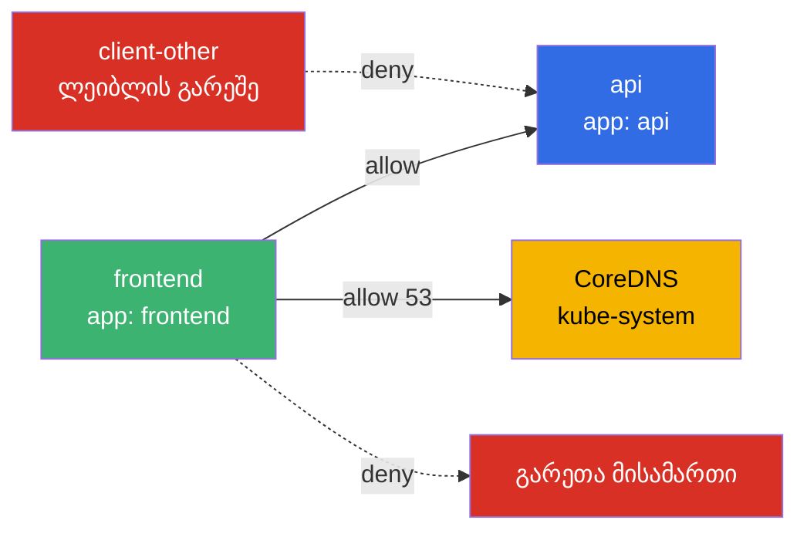
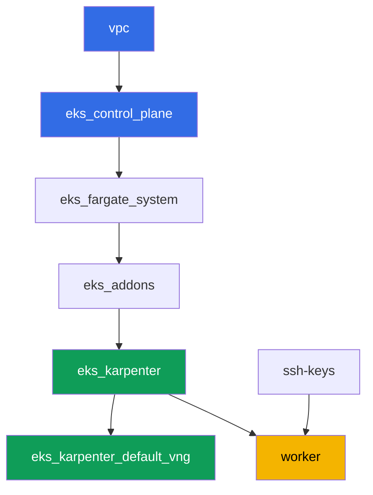

[Русская версия](README_RU.MD) · [Eng version](README.MD) · [Versión en español](README_ES.MD) · [Version française](README_FR.MD) · [Deutsche Version](README_DE.MD) · [繁體中文版](README_TW.MD) · [日本語版](README_JP.MD)

# ლაბა 110 - NetworkPolicy EKS-ში: ჩაშენებული VPC CNI ქსელური პოლიტიკა

## აღწერა

ამ ლაბაში ჩართავთ და ადასტურებთ ჩაშენებულ east-west ტრაფიკის კონტროლს VPC CNI-ში: პოლიტიკის
კონტროლერს control plane-ზე და eBPF-ზე დაფუძნებულ `aws-network-policy-agent` აგენტს
ყოველ ნოუდზე. ნაგულისხმევად `NetworkPolicy` ობიექტი EKS-ში არსებობს როგორც API ობიექტი,
მაგრამ არავინ ახდენს მის აღსრულებას - პოდებს შორის ყველა ტრაფიკი დაშვებულია. თქვენ
ჩართავთ აღსრულებას ფლაგით `vpc-cni` add-on-ზე, რეპროდუცირებთ სიმპტომს (კავშირი
დაშვებული), შემდეგ დახურავთ ნაგულისხმევი აკრძალვით, გახსნით ისევ სელექტიურად ლეიბლით და
namespace-ით, და შემოსფარგლავთ გამავალ ტრაფიკს ცალსახა DNS-გამონაკლისით. ეს ყველაფერი
სტანდარტული Kubernetes `NetworkPolicy` სინტაქსით - CRD-ების გარეშე.

დავალებები დაწერილია production-სტილში: მოკლე დავალება პლუს მიღების კრიტერიუმები.
შემოწმება ავტომატურია, ბრძანებით `check_result`.

## მიზანი

გავამყაროთ კურსის შემდეგი თავების მასალა:

- [თავი 8. ქსელი დეტალურად: VPC CNI და ალტერნატიული CNI-ები](../../course/08/ge.md) - ჩაშენებული ქსელური პოლიტიკის საზღვრები Cilium-თან შედარებით
- [თავი 30. NetworkPolicy: წესები, DNS, ტესტირება](../../course/30/ge.md) - ნაგულისხმევი აკრძალვა, დაშვება ლეიბლითა და namespace-ით, egress

## რას ვქმნით

კლასტერი უკვე დეპლოირებულია როგორც კოდი, `vpc-cni` add-on კონფიგურირებულია
`enableNetworkPolicy = "true"`-ით. თქვენ მუშაობთ მზა აღსრულებელთან და მასზე აშენებთ
დატვირთვასა და პოლიტიკებს.

| ობიექტი | რა არის ეს | რისთვის ამ ლაბაში |
|--------|---------|-------------------|
| Namespace `eks-110` | კლასტერის სექცია ლაბის დატვირთვისთვის | ინახავს რესურსებს განცალკევებულად |
| Deployment `api` (2 რეპლიკა) + Service `api` | ping_pong სერვერი | სამიზნე პოლიტიკების შემოწმებისთვის |
| Deployment `client`, `frontend`, `client-other` | curl კლიენტები | სხვადასხვა ხილვადობა ლეიბლის მიხედვით |
| NetworkPolicy `default-deny-ingress` | კრძალავს ingress-ს `eks-110`-ში | ხურავს ყველა east-west ტრაფიკს |
| NetworkPolicy `allow-frontend-to-api` | დაშვება ლეიბლის მიხედვით | სელექტიური წვდომა `frontend` -> `api` |
| NetworkPolicy `restrict-egress` | შემოსფარგლავს egress-ს პლუს DNS | egress მხოლოდ `api`-სა და `kube-system:53`-ზე |

ტრაფიკის საბოლოო სურათი namespace `eks-110`-ში:



## ინფრასტრუქტურა

გარემო დეპლოირდება AWS-ში (`eu-central-1`) Terragrunt-ის მეშვეობით. ლაბის ყოველი
დირექტორია ერთი კომპონენტია საკუთარი `terragrunt.hcl`-ით, რომელიც მიმართავს საერთო
მოდულს `terraform/modules/`-ში და აცხადებს დამოკიდებულებებს `dependency` ბლოკებით.
Terragrunt აგებს დამოკიდებულებების გრაფს და აპლიცირებს კომპონენტებს სწორი
თანმიმდევრობით.

### მოდულები და დამოკიდებულებები

| დირექტორია (კომპონენტი) | მოდული (`terraform/modules/`) | დამოკიდებულია | რას ქმნის |
|---------------------|-------------------------------|------------|-------------|
| `vpc` | `vpc_v3` | - | VPC `10.10.0.0/16`, ქვექსელები ორ AZ-ში, NAT |
| `ssh-keys` | `ssh-keys` | - | SSH-გასაღებების წყვილი სამუშაო მანქანისთვის და ნოუდებისთვის |
| `eks_control_plane` | `eks_v2_control_plane` | `vpc` | EKS control plane `1.36`, OIDC |
| `eks_fargate_system` | `eks_v2_fargate` | `vpc`, `eks_control_plane` | Fargate-პროფილი `kube-system`-ისთვის და `karpenter`-ისთვის |
| `eks_addons` | `eks_v2_addons` | `eks_control_plane`, `eks_fargate_system` | coredns, kube-proxy, vpc-cni (`enableNetworkPolicy`-ით), pod-identity |
| `eks_karpenter` | `eks_v2_karpenter` | `vpc`, `eks_control_plane`, `eks_addons`, `eks_fargate_system` | Karpenter-ის კონტროლერი, ნოუდების IAM-როლი |
| `eks_karpenter_default_vng` | `eks_v2_karpenter_vng` | `vpc`, `eks_control_plane`, `eks_karpenter` | ნაგულისხმევი NodePool და EC2NodeClass |
| `worker` | `eks_v2_work_pc` | `ssh-keys`, `vpc`, `eks_control_plane`, `eks_karpenter` | სამუშაო მანქანა, ტესტები, `check_result` |

დამოკიდებულებების გრაფი (რაც უფრო ადრე აპლიცირდება, ის ხრიხისკენ ქვემოთაა):



### სად რა კონფიგურირდება

`env.hcl` (გარემოს საერთო პარამეტრები, კითხულობს ყველა კომპონენტი):

| პარამეტრი | მნიშვნელობა ლაბაში | რაზე ახდენს გავლენას |
|----------|-----------------|---------------|
| `region` | `eu-central-1` | ყველა რესურსის რეგიონი |
| `prefix` | `eks-task110` | რესურსების სახელებისა და ტეგების პრეფიქსი |
| `stack_name` | `eks110` | მისგან იწყობა `env_name` - კლასტერის სახელი |
| `k8_version` | `1.36.0` | kubectl-ის ვერსია სამუშაო მანქანაზე |
| `instance_type_worker` | `t3.medium` | სამუშაო მანქანის instance-ის ტიპი |
| `ssh_password_enable`, `access_cidrs` | `true`, `0.0.0.0/0` | SSH-წვდომა სამუშაო მანქანაზე |

`inputs` თითოეული კომპონენტის `terragrunt.hcl`-ში (კონკრეტული მოდულის პარამეტრები):

| ფაილი | ძირითადი პარამეტრები |
|------|--------------------|
| `eks_control_plane/terragrunt.hcl` | `eks.version = "1.36"` |
| `eks_addons/terragrunt.hcl` | add-on-ების ვერსიები 1.36-ისთვის; `vpc-cni`-ს დამატებული აქვს `configuration = { enableNetworkPolicy = "true" }` ბლოკი - ეს არის ერთადერთი განსხვავება ლაბა 110-სა და საბაზისო ნაკრებს შორის |
| `eks_fargate_system/terragrunt.hcl` | namespace-სელექტორები Fargate-სთვის (`kube-system`, `karpenter`) |
| `eks_karpenter/terragrunt.hcl` | Karpenter-ის ვერსია `1.8.1` |
| `eks_karpenter_default_vng/terragrunt.hcl` | NodePool-ის `requirements`, `limits`, `disruption` |
| `worker/terragrunt.hcl` | `test_url` და `task_script_url`, რომლებიც უთითებენ ლაბა 110-ის ფაილებზე |

`enableNetworkPolicy = "true"` ჩართავს Network Policy Controller-ს control plane-ზე
(მართავს AWS) და `aws-network-policy-agent` აგენტს `aws-node` DaemonSet-ში ყოველ
ნოუდზე - ეს არის ის, რაც რეალურად პროგრამირებს წესებს eBPF-ის მეშვეობით. პარამეტრი
მოითხოვს VPC CNI ვერსია `v1.14.0-eksbuild.3`-ს ან უფრო ახალს; ლაბაში დაინსტალირებულია
`v1.21.1-eksbuild.1`.

## განლაგება

```bash
TASK=110 make run_eks_task
```

განლაგება გრძელდება დაახლოებით 15-20 წუთი. output-ში მოძებნეთ ხაზი SSH-შეერთებით
სამუშაო მანქანასთან და დაუკავშირდით მას. kubectl იქ უკვე კონფიგურირებულია საჭირო
კლასტერზე.

სასარგებლო ბრძანებები სამუშაო მანქანაზე:

```bash
time_left       # რამდენი დრო დარჩა გარემოს
check_result    # გადამოწმება
```

> გარემოს უსაფრთხოება. `env.hcl`-ში ჩართულია `ssh_password_enable = true` და
> `access_cidrs = ["0.0.0.0/0"]` - ეს მოსახერხებელია სასწავლო გარემოსთვის, მაგრამ ასე არ
> უნდა გავხადოთ production-ში. კურსის სტანდარტების მიხედვით (თავები 0.2, 2, 19) სამუშაო
> მანქანებზე წვდომა უნდა იხსნებოდეს AWS SSM Session Manager-ის მეშვეობით, საჯარო
> SSH-პორტების გარეთ გამოტანის გარეშე, ხოლო `access_cidrs` უნდა შევზღუდოთ კონკრეტულ
> მისამართებზე. აქ საჯარო SSH დარჩენილია მხოლოდ გაშვების გასამარტივებლად.

## დავალებები

---
|        **1**        | **Namespace ლაბის დატვირთვისთვის**                             |
| :-----------------: | :---------------------------------------------------------- |
| რას ვაკეთებთ          | შექმენით namespace სახელით `eks-110`. ლაბის ყველა ობიექტი შექმნილია მის შიგნით. |
| მიღების კრიტერიუმები    | - namespace `eks-110` არსებობს. |
---
|        **2**        | **შემოწმება, რომ ქსელური პოლიტიკის აღსრულებელი ჩართულია**           |
| :-----------------: | :---------------------------------------------------------- |
| რას ვაკეთებთ          | დარწმუნდით, რომ პოლიტიკის აგენტი რეალურად მუშაობს ნოუდებზე, არა მხოლოდ დეკლარირებულია კონფიგურაციაში. შეამოწმეთ ორი ფაქტი: DaemonSet `aws-node` `kube-system`-ში შეიცავს კონტეინერს `aws-network-policy-agent` (`kubectl describe daemonset aws-node -n kube-system`), და `vpc-cni` add-on-ის კონფიგურაცია ადასტურებს `enableNetworkPolicy: true` (`aws eks describe-addon --cluster-name <cluster> --addon-name vpc-cni --query "addon.configurationValues"`). შეინახეთ ორივე output ფაილში `/var/work/tests/artifacts/2/enforcer.txt`. |
| მიღების კრიტერიუმები    | - ფაილი არ არის ცარიელი;<br/>- შეიცავს `aws-network-policy-agent`-ს;<br/>- შეიცავს `enableNetworkPolicy`-ს და `true`-ს. |
---
|        **3**        | **სიმპტომი ყოველგვარი პოლიტიკის გარეშე: კავშირი ნაგულისხმევად დაშვებულია**   |
| :-----------------: | :---------------------------------------------------------- |
| რას ვაკეთებთ          | `eks-110`-ში შექმენით Deployment `api` (image `viktoruj/ping_pong:latest`, `2` რეპლიკა) და Service `api` პორტზე `8080`. შექმენით Deployment `client` (image `curlimages/curl:latest`, ბრძანება `sleep 3600`, რომ შესძლოთ `kubectl exec` მასში). დაელოდეთ, სანამ ორივე გახდება მზა. `kubectl exec`-ის მეშვეობით `client`-ზე გაუშვით `curl` `api.eks-110.svc.cluster.local:8080`-ის მიმართ `--connect-timeout`-ითა და `--max-time`-ით, შეინახეთ პასუხის კოდი ფორმატით `HTTP_CODE=<code>` ფაილში `/var/work/tests/artifacts/3/connectivity_before.txt`. ერთი NetworkPolicy-ის გარეშეც, კავშირი დაშვებულია. |
| მიღების კრიტერიუმები    | - Deployment `api`, `2` მზა რეპლიკა, Service `api` პორტზე `8080`;<br/>- Deployment `client`, `1` მზა რეპლიკა;<br/>- ფაილი `3/connectivity_before.txt` შეიცავს `HTTP_CODE=200`-ს. |
---
|        **4**        | **ნაგულისხმევი ingress-აკრძალვა**                                     |
| :-----------------: | :---------------------------------------------------------- |
| რას ვაკეთებთ          | შექმენით NetworkPolicy `default-deny-ingress` `eks-110`-ში `podSelector: {}`-ითა და `policyTypes: ["Ingress"]`-ით (`ingress` სექციის გარეშე) - ეს ხურავს ყველა შემომავალ ტრაფიკს namespace-ის ყველა პოდისთვის. გაიმეორეთ `curl` `client`-იდან `api`-ზე იმავე timeout-ით და შეინახეთ პასუხის კოდი ფაილში `/var/work/tests/artifacts/4/connectivity_denied.txt`. მოთხოვნა ახლა ვერ მიაღწევს სამიზნეს. |
| მიღების კრიტერიუმები    | - NetworkPolicy `default-deny-ingress` `policyTypes: ["Ingress"]`-ით;<br/>- ფაილი `4/connectivity_denied.txt` არ შეიცავს `HTTP_CODE=200`-ს. |
---
|        **5**        | **დაშვება ლეიბლის მიხედვით**                                      |
| :-----------------: | :---------------------------------------------------------- |
| რას ვაკეთებთ          | შექმენით NetworkPolicy `allow-frontend-to-api`: `podSelector.matchLabels.app: api`, `policyTypes: ["Ingress"]`, `ingress.from.podSelector.matchLabels.app: frontend`, პორტი `8080`. შექმენით Deployment `frontend` (image `curlimages/curl:latest`, `sleep 3600`) - მას ავტომატურად მიენიჭება ლეიბლი `app: frontend`. ასევე შექმენით Deployment `client-other` (იმავე image-ით) `app: frontend` ლეიბლის გარეშე - მას მიენიჭება `app: client-other`. შეამოწმეთ `curl` `frontend`-იდან `api`-ზე (შეინახეთ `5/allowed_frontend.txt`-ში) და `client-other`-იდან `api`-ზე (შეინახეთ `5/blocked_other.txt`-ში). |
| მიღების კრიტერიუმები    | - NetworkPolicy `allow-frontend-to-api` მითითებული `podSelector`-ითა და `ingress.from`-ით;<br/>- `frontend` მზაა, ლეიბლი `app: frontend`;<br/>- `client-other` მზაა, ლეიბლი განსხვავებულია `frontend`-ისგან;<br/>- ფაილი `5/allowed_frontend.txt` შეიცავს `HTTP_CODE=200`-ს;<br/>- ფაილი `5/blocked_other.txt` არ შეიცავს `HTTP_CODE=200`-ს. |
---
|        **6**        | **Egress DNS-გამონაკლისით**                              |
| :-----------------: | :---------------------------------------------------------- |
| რას ვაკეთებთ          | შექმენით NetworkPolicy `restrict-egress`: `podSelector.matchLabels.app: frontend`, `policyTypes: ["Egress"]`, `egress` აძლევს დაშვებას მხოლოდ მიმართულებას `podSelector.matchLabels.app: api`-ზე და მიმართულებას `namespaceSelector.matchLabels: kubernetes.io/metadata.name: kube-system`-ზე პორტებზე `53/UDP` და `53/TCP`. შეამოწმეთ, რომ `frontend` წარმატებით ხსნის სახელს `api` და იღებს `HTTP_CODE=200`-ს (შეინახეთ `6/egress_dns_api.txt`-ში), და რომ მოთხოვნა თვითნებურ გარეთა მისამართზე (მაგალითად `curl` `1.1.1.1`-ზე) არ გადის (შეინახეთ `6/egress_external_blocked.txt`-ში). |
| მიღების კრიტერიუმები    | - NetworkPolicy `restrict-egress` `policyTypes: ["Egress"]`-ითა და `podSelector.matchLabels.app: frontend`-ით;<br/>- ფაილი `6/egress_dns_api.txt` შეიცავს `HTTP_CODE=200`-ს;<br/>- ფაილი `6/egress_external_blocked.txt` არ შეიცავს `HTTP_CODE=200`-ს. |
---

## შედეგის შემოწმება

სამუშაო მანქანაზე გაუშვით ავტომატური შემოწმება:

```bash
check_result
```

სკრიპტი გაუშვებს ტესტებს და გამოაჩენს შესრულებული დავალებების პროცენტს.

## გადაწყვეტა

ეტალონური გადაწყვეტა: [worker/files/solutions/1_GE.MD](worker/files/solutions/1_GE.MD)

## კლასტერისა და რესურსების წაშლა

> **პირველად მოხსენით დატვირთვა და დაელოდეთ, სანამ EC2 ნოუდები დატოვებენ კლასტერს,
> მხოლოდ შემდეგ დაანგრიეთ სტენდი.** ეს ლაბა ხელით არ ქმნის რაიმე AWS რესურსს -
> ყველაფერი დამატებითი არის Kubernetes ობიექტები (Deployment-ები `api`, `client`,
> `frontend`, `client-other` და NetworkPolicy-ები namespace `eks-110`-ში). არსებობს ერთი
> საფრთხე: თუ წაშლით კლასტერს, სანამ დატვირთვა ჯერ კიდევ მუშაობს, Karpenter-ის EC2 ნოუდი
> ეცემა მასთან ერთად, და VPC CNI-ის მეორადი ENI რჩება `available` სტატუსში და ინარჩუნებს
> ნოუდის security group-ს - `destroy` ჩერდება
> `module.eks.aws_security_group.node[0]: Still destroying...`-ზე ათეულობით წუთის
> განმავლობაში.

```bash
# 1. მოვხსნათ ლაბის დატვირთვა (NetworkPolicy-ები წაიშლება namespace-თან ერთად)
kubectl delete namespace eks-110 --ignore-not-found

# 2. დაველოდოთ, სანამ Karpenter მოხსნის NodeClaim-სა და EC2 ნოუდს (მხოლოდ fargate-* უნდა დარჩეს)
while kubectl get nodeclaims --no-headers 2>/dev/null | grep -q .; do
  echo "NodeClaim ჯერ კიდევ ცოცხალია, ველოდებით..."; sleep 15
done
kubectl get nodes | grep -v fargate
```

მხოლოდ ამის შემდეგ დაანგრიეთ სტენდი:

```bash
TASK=110 make delete_eks_task
```

თუ `destroy` კვლავ ჩერდება ნოუდის security group-ზე, დარჩენილია მიმტოვებული ENI.
მოძებნეთ და წაშალეთ იგი:

```bash
aws ec2 describe-network-interfaces --filters Name=status,Values=available \
  --query 'NetworkInterfaces[?Tags[?Key==`eks:eni:owner`]].[NetworkInterfaceId,Description]' \
  --output table
aws ec2 delete-network-interface --network-interface-id <eni-id>
```
