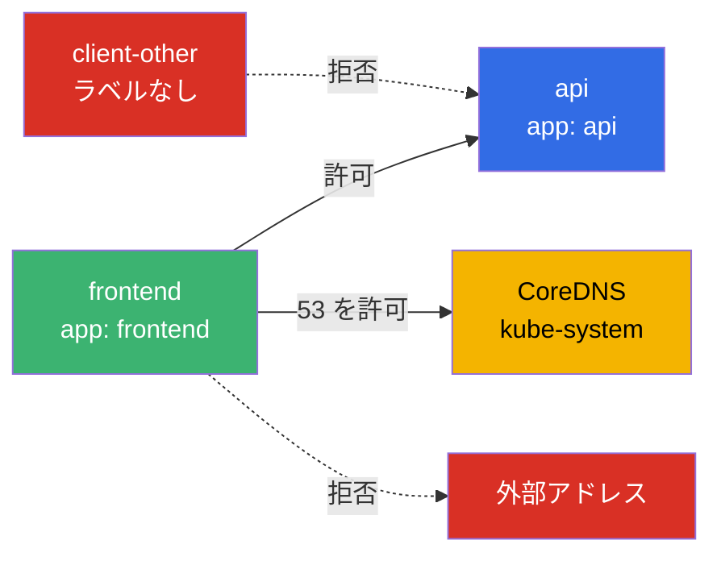
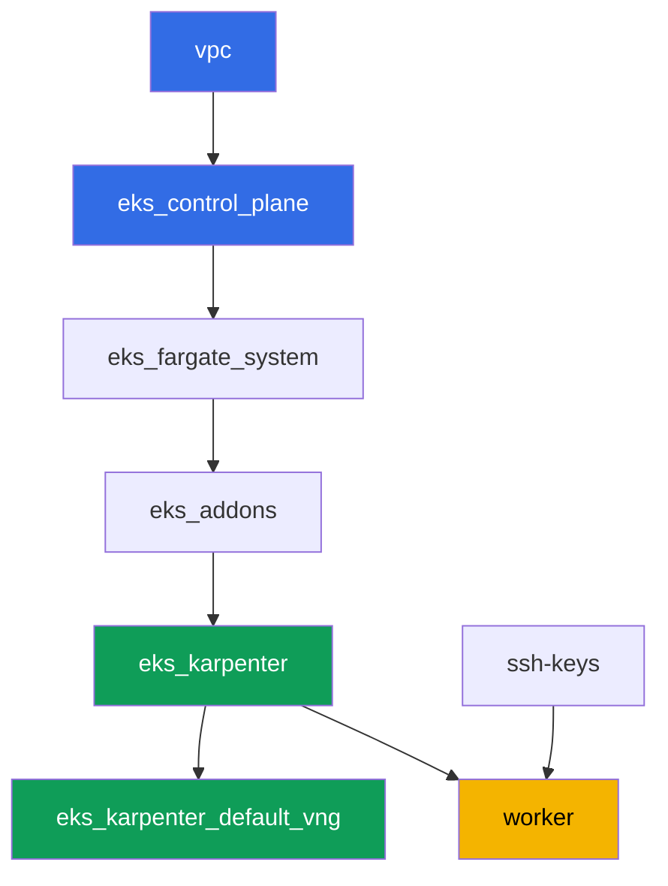

[Русская версия](README_RU.MD) · [Eng version](README.MD) · [Versión en español](README_ES.MD) · [Version française](README_FR.MD) · [Deutsche Version](README_DE.MD) · [ქართული ვერსია](README_GE.MD) · [繁體中文版](README_TW.MD)

# ラボ 110 - EKS における NetworkPolicy:VPC CNI 組み込みのネットワークポリシー

## 説明

このラボでは、VPC CNI に組み込まれた east-west トラフィック制御 - control plane 上の
ポリシーコントローラと、各ノード上で動作する eBPF ベースの `aws-network-policy-agent`
エージェント - を有効化し、動作を確認します。デフォルトでは、EKS 上に `NetworkPolicy`
オブジェクトは API オブジェクトとして存在しますが、誰もそれを強制していません -
Pod 間のすべてのトラフィックが許可されています。`vpc-cni` アドオンのフラグを通じて
強制を有効化し、症状(接続が許可されている状態)を再現したうえで、default deny で
閉じ、ラベルと namespace による選択的な許可で再び開き、明示的な DNS 例外で
アウトバウンドトラフィックを制限します。すべて標準の Kubernetes `NetworkPolicy` の
構文で行います - CRD は使いません。

タスクは production スタイルで書かれています:短い課題文とアクセプタンス基準。検証は
`check_result` コマンドによって自動的に行われます。

## 目的

コースの以下の章の内容を定着させます:

- [第 8 章。詳解ネットワーキング:VPC CNI と代替 CNI](../../course/08/ru.md) - 組み込みのネットワークポリシーと Cilium の境界
- [第 30 章。NetworkPolicy:ルール、DNS、テスト](../../course/30/ru.md) - default deny、ラベルと namespace による許可、egress

## 作成するもの

クラスタは既にコードとしてデプロイされており、`vpc-cni` アドオンには
`enableNetworkPolicy = "true"` が設定されています。あなたは既に用意された
エンフォーサーを使って、その上にワークロードとポリシーを構築します。

| オブジェクト | 何か | このラボでの目的 |
|--------|---------|-------------------|
| Namespace `eks-110` | ラボのワークロード用のクラスタ区画 | リソースを分離する |
| Deployment `api`(2 レプリカ)+ Service `api` | ping_pong サーバー | ポリシー確認の対象 |
| Deployment `client`、`frontend`、`client-other` | curl クライアント | ラベルによって可視性が異なる |
| NetworkPolicy `default-deny-ingress` | `eks-110` への ingress を拒否する | すべての east-west トラフィックを閉じる |
| NetworkPolicy `allow-frontend-to-api` | ラベルによって許可する | `frontend` -> `api` への選択的アクセス |
| NetworkPolicy `restrict-egress` | egress と DNS を制限する | `api` と `kube-system:53` へのみの egress |

namespace `eks-110` における最終的なトラフィックの構成図:



## インフラストラクチャ

環境は Terragrunt によって AWS(`eu-central-1`)にデプロイされます。ラボの各ディレクト
リは 1 つのコンポーネントであり、それぞれ独自の `terragrunt.hcl` を持ち、
`terraform/modules/` の共有モジュールを参照し、`dependency` ブロックで依存関係を宣言
します。Terragrunt が依存関係グラフを構築し、正しい順序でコンポーネントを適用します。

### モジュールと依存関係

| ディレクトリ(コンポーネント) | モジュール(`terraform/modules/`) | 依存先 | 作成されるもの |
|---------------------|-------------------------------|------------|-------------|
| `vpc` | `vpc_v3` | - | VPC `10.10.0.0/16`、2 つの AZ にあるサブネット、NAT |
| `ssh-keys` | `ssh-keys` | - | ワーカーマシンとノード用の SSH キーペア |
| `eks_control_plane` | `eks_v2_control_plane` | `vpc` | EKS control plane `1.36`、OIDC |
| `eks_fargate_system` | `eks_v2_fargate` | `vpc`、`eks_control_plane` | `kube-system` と `karpenter` 用の Fargate profile |
| `eks_addons` | `eks_v2_addons` | `eks_control_plane`、`eks_fargate_system` | coredns、kube-proxy、vpc-cni(`enableNetworkPolicy` 付き)、pod-identity |
| `eks_karpenter` | `eks_v2_karpenter` | `vpc`、`eks_control_plane`、`eks_addons`、`eks_fargate_system` | Karpenter コントローラ、ノードの IAM ロール |
| `eks_karpenter_default_vng` | `eks_v2_karpenter_vng` | `vpc`、`eks_control_plane`、`eks_karpenter` | デフォルトの NodePool と EC2NodeClass |
| `worker` | `eks_v2_work_pc` | `ssh-keys`、`vpc`、`eks_control_plane`、`eks_karpenter` | ワーカーマシン、テスト、`check_result` |

依存関係グラフ(先に適用されるものほど矢印の下側にある):



### どこで何が設定されるか

`env.hcl`(すべてのコンポーネントが読み込む共通の環境パラメータ):

| パラメータ | ラボでの値 | 影響範囲 |
|----------|-----------------|---------------|
| `region` | `eu-central-1` | すべてのリソースのリージョン |
| `prefix` | `eks-task110` | リソース名とタグのプレフィックス |
| `stack_name` | `eks110` | `env_name`(クラスタ名)を組み立てるために使われる |
| `k8_version` | `1.36.0` | ワーカーマシン上の kubectl のバージョン |
| `instance_type_worker` | `t3.medium` | ワーカーマシンのインスタンスタイプ |
| `ssh_password_enable`、`access_cidrs` | `true`、`0.0.0.0/0` | ワーカーマシンへの SSH アクセス |

各コンポーネントの `terragrunt.hcl` の `inputs`(個々のモジュールのパラメータ):

| ファイル | 主な設定 |
|------|--------------------|
| `eks_control_plane/terragrunt.hcl` | `eks.version = "1.36"` |
| `eks_addons/terragrunt.hcl` | 1.36 用のアドオンバージョン;`vpc-cni` には `configuration = { enableNetworkPolicy = "true" }` ブロックが追加されている - ラボ 110 とベースセットの唯一の違い |
| `eks_fargate_system/terragrunt.hcl` | Fargate 用の namespace セレクタ(`kube-system`、`karpenter`) |
| `eks_karpenter/terragrunt.hcl` | Karpenter バージョン `1.8.1` |
| `eks_karpenter_default_vng/terragrunt.hcl` | NodePool の `requirements`、`limits`、`disruption` |
| `worker/terragrunt.hcl` | ラボ 110 のファイルを指す `test_url` と `task_script_url` |

`enableNetworkPolicy = "true"` は、control plane 上の Network Policy Controller
(AWS が管理する)と、各ノード上の `aws-node` DaemonSet 内の `aws-network-policy-agent`
エージェント - eBPF を通じて実際にルールをプログラムするのはこちら - を有効化します。
このパラメータには VPC CNI バージョン `v1.14.0-eksbuild.3` 以降が必要です;このラボ
には `v1.21.1-eksbuild.1` がインストールされています。

## デプロイ

```bash
TASK=110 make run_eks_task
```

デプロイには約 15-20 分かかります。出力の中からワーカーマシンへの SSH 接続の行を見つけ
て接続してください。そこでは kubectl が既に正しいクラスタ向けに設定されています。

ワーカーマシン上で使える便利なコマンド:

```bash
time_left       # 環境の残り時間
check_result    # 解答の確認
```

> 検証環境のセキュリティについて。`env.hcl` では `ssh_password_enable = true` と
> `access_cidrs = ["0.0.0.0/0"]` が有効になっています。学習用環境としては便利ですが、
> 本番環境ではこのようにしてはいけません。コースの標準(第 0.2、2、19 章)によれば、
> ワーカーマシンへのアクセスは公開 SSH ポートを外に出さずに AWS SSM Session Manager を
> 経由して開き、`access_cidrs` は具体的なアドレスに絞り込みます。ここでは、セットアップ
> を簡単にするためだけに公開 SSH を残しています。

## タスク

---
|        **1**        | **ラボのワークロード用の Namespace**                             |
| :-----------------: | :---------------------------------------------------------- |
| やること          | `eks-110` という名前の namespace を作成してください。ラボのすべてのオブジェクトはこの中に作成されます。 |
| アクセプタンス基準    | - namespace `eks-110` が存在する。 |
---
|        **2**        | **ネットワークポリシーのエンフォーサーが有効になっていることの確認**           |
| :-----------------: | :---------------------------------------------------------- |
| やること          | ポリシーエージェントが設定上で宣言されているだけでなく、実際にノード上で動作していることを確認してください。2 つの事実を確認します:`kube-system` の DaemonSet `aws-node` にコンテナ `aws-network-policy-agent` が含まれていること(`kubectl describe daemonset aws-node -n kube-system`)、そして `vpc-cni` アドオンの設定で `enableNetworkPolicy: true` が確認できること(`aws eks describe-addon --cluster-name <cluster> --addon-name vpc-cni --query "addon.configurationValues"`)。両方の出力をファイル `/var/work/tests/artifacts/2/enforcer.txt` に保存してください。 |
| アクセプタンス基準    | - ファイルが空でない;<br/>- `aws-network-policy-agent` を含む;<br/>- `enableNetworkPolicy` と `true` を含む。 |
---
|        **3**        | **ポリシーがない状態での症状:デフォルトで接続が許可されている**   |
| :-----------------: | :---------------------------------------------------------- |
| やること          | `eks-110` に Deployment `api`(イメージ `viktoruj/ping_pong:latest`、レプリカ数 `2`)とポート `8080` の Service `api` を作成してください。Deployment `client`(イメージ `curlimages/curl:latest`、コマンド `sleep 3600` - `kubectl exec` で入れるようにするため)を作成してください。両方が Ready になるまで待ちます。`client` 上で `kubectl exec` を使い、`--connect-timeout` と `--max-time` を付けて `api.eks-110.svc.cluster.local:8080` に対して `curl` を実行し、レスポンスコードを `HTTP_CODE=<code>` という形式でファイル `/var/work/tests/artifacts/3/connectivity_before.txt` に保存してください。NetworkPolicy が 1 つもない状態では、接続は許可されます。 |
| アクセプタンス基準    | - Deployment `api`、`2` 個の Ready なレプリカ、Service `api` ポート `8080`;<br/>- Deployment `client`、`1` 個の Ready なレプリカ;<br/>- ファイル `3/connectivity_before.txt` が `HTTP_CODE=200` を含む。 |
---
|        **4**        | **デフォルトで ingress を拒否する**                                     |
| :-----------------: | :---------------------------------------------------------- |
| やること          | `eks-110` に、`podSelector: {}` と `policyTypes: ["Ingress"]`(`ingress` セクションなし)を持つ NetworkPolicy `default-deny-ingress` を作成してください - これは namespace 内のすべての Pod に対するインバウンドトラフィックをすべて閉じます。同じタイムアウトで `client` から `api` への `curl` を繰り返し、レスポンスコードをファイル `/var/work/tests/artifacts/4/connectivity_denied.txt` に保存してください。リクエストは今度は対象に到達できなくなるはずです。 |
| アクセプタンス基準    | - `policyTypes: ["Ingress"]` を持つ NetworkPolicy `default-deny-ingress`;<br/>- ファイル `4/connectivity_denied.txt` が `HTTP_CODE=200` を含まない。 |
---
|        **5**        | **ラベルによる許可**                                      |
| :-----------------: | :---------------------------------------------------------- |
| やること          | NetworkPolicy `allow-frontend-to-api` を作成してください:`podSelector.matchLabels.app: api`、`policyTypes: ["Ingress"]`、`ingress.from.podSelector.matchLabels.app: frontend`、ポート `8080`。Deployment `frontend`(イメージ `curlimages/curl:latest`、`sleep 3600`)を作成してください - これには自動的にラベル `app: frontend` が付きます。また、`app: frontend` ラベルを持たない Deployment `client-other`(同じイメージ)も作成してください - これには `app: client-other` が付きます。`frontend` から `api` への `curl`(`5/allowed_frontend.txt` に保存)と、`client-other` から `api` への `curl`(`5/blocked_other.txt` に保存)を確認してください。 |
| アクセプタンス基準    | - 指定された `podSelector` と `ingress.from` を持つ NetworkPolicy `allow-frontend-to-api`;<br/>- `frontend` が Ready で、ラベル `app: frontend` を持つ;<br/>- `client-other` が Ready で、ラベルが `frontend` と異なる;<br/>- ファイル `5/allowed_frontend.txt` が `HTTP_CODE=200` を含む;<br/>- ファイル `5/blocked_other.txt` が `HTTP_CODE=200` を含まない。 |
---
|        **6**        | **DNS 例外付きの egress**                              |
| :-----------------: | :---------------------------------------------------------- |
| やること          | NetworkPolicy `restrict-egress` を作成してください:`podSelector.matchLabels.app: frontend`、`policyTypes: ["Egress"]`、`egress` は `podSelector.matchLabels.app: api` への方向と、ポート `53/UDP` および `53/TCP` での `namespaceSelector.matchLabels: kubernetes.io/metadata.name: kube-system` への方向のみを許可します。`frontend` が名前 `api` を解決でき、`HTTP_CODE=200` を得られること(`6/egress_dns_api.txt` に保存)、そして任意の外部アドレス(例えば `1.1.1.1` への `curl`)へのリクエストが通らないこと(`6/egress_external_blocked.txt` に保存)を確認してください。 |
| アクセプタンス基準    | - `policyTypes: ["Egress"]` と `podSelector.matchLabels.app: frontend` を持つ NetworkPolicy `restrict-egress`;<br/>- ファイル `6/egress_dns_api.txt` が `HTTP_CODE=200` を含む;<br/>- ファイル `6/egress_external_blocked.txt` が `HTTP_CODE=200` を含まない。 |
---

## 結果の確認

ワーカーマシン上で自動チェックを実行してください:

```bash
check_result
```

スクリプトがテストを実行し、完了したタスクの割合を表示します。

## 解答

参考解答:[worker/files/solutions/1_JP.MD](worker/files/solutions/1_JP.MD)

## クラスタとリソースの削除

> **まず、ワークロードを削除して EC2 ノードが離脱するのを待ってから、スタンドを解体
> してください。** このラボは手動で AWS リソースを何も作成していません - 余分なもの
> はすべて Kubernetes オブジェクト(Deployment `api`、`client`、`frontend`、
> `client-other` と、namespace `eks-110` 内の NetworkPolicy)です。1 つだけ危険が
> あります:ワークロードがまだ動いている状態でクラスタを削除すると、Karpenter の
> EC2 ノードもそれと一緒に落ちてしまい、VPC CNI のセカンダリ ENI が `available`
> 状態のまま残ってノードの security group を保持し続けます - `destroy` は
> `module.eks.aws_security_group.node[0]: Still destroying...` のまま数十分間
> 止まってしまいます。

```bash
# 1. ラボのワークロードを削除する(NetworkPolicy は namespace と一緒に消える)
kubectl delete namespace eks-110 --ignore-not-found

# 2. Karpenter が NodeClaim と EC2 ノードを削除するまで待つ(fargate-* だけが残るはず)
while kubectl get nodeclaims --no-headers 2>/dev/null | grep -q .; do
  echo "NodeClaim はまだ存在しています。待機中..."; sleep 15
done
kubectl get nodes | grep -v fargate
```

その後にのみ、スタンドを解体してください:

```bash
TASK=110 make delete_eks_task
```

それでも `destroy` がノードの security group で止まってしまう場合、孤立した ENI が
残っています。それを見つけて削除してください:

```bash
aws ec2 describe-network-interfaces --filters Name=status,Values=available \
  --query 'NetworkInterfaces[?Tags[?Key==`eks:eni:owner`]].[NetworkInterfaceId,Description]' \
  --output table
aws ec2 delete-network-interface --network-interface-id <eni-id>
```
