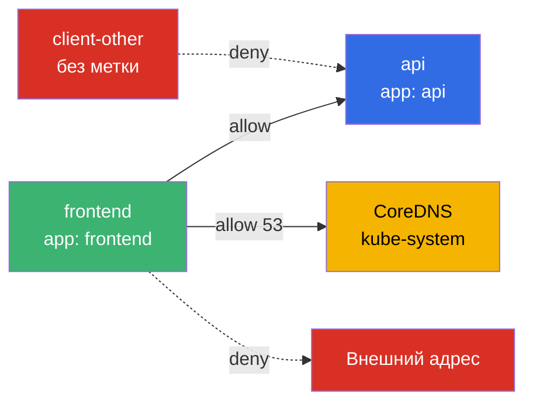
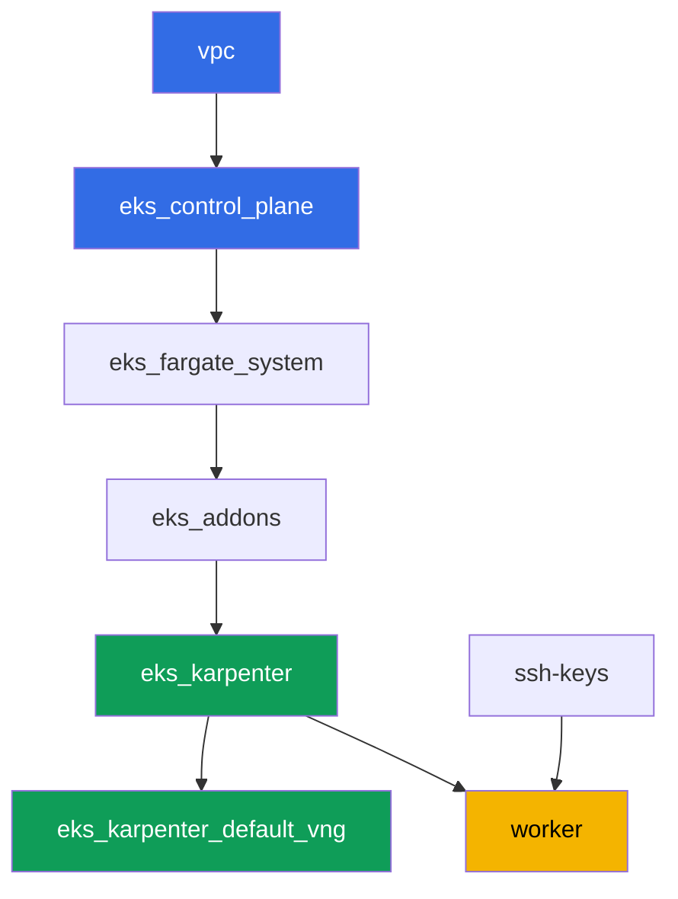

[Eng version](README.MD) · [Versión en español](README_ES.MD) · [Version française](README_FR.MD) · [Deutsche Version](README_DE.MD) · [ქართული ვერსია](README_GE.MD) · [繁體中文版](README_TW.MD) · [日本語版](README_JP.MD)

# Лаба 110 - NetworkPolicy в EKS: встроенная VPC CNI network policy

## Описание

В этой лабе вы включаете и проверяете встроенный контроль east-west трафика в VPC CNI:
контроллер политик на control plane и агент `aws-network-policy-agent` на eBPF в каждой
ноде. По умолчанию объект `NetworkPolicy` в EKS существует как API-объект, но никем не
применяется - весь трафик между подами разрешён. Вы включаете применение через флаг
аддона `vpc-cni`, воспроизводите симптом (связность разрешена), а затем закрываете её
default deny, открываете точечно по label и по namespace, и ограничиваете исходящий
трафик с явным исключением на DNS. Всё на стандартном синтаксисе Kubernetes
`NetworkPolicy` - без CRD.

Задания в продакшн-стиле: короткая постановка плюс критерии приёмки. Проверка -
автоматическая, командой `check_result`.

## Цель

Закрепить материал глав курса:

- [Глава 8. Сеть в деталях: VPC CNI и альтернативные CNI](../../course/08/ru.md) - границы
  встроенной network policy против Cilium
- [Глава 30. NetworkPolicy: правила, DNS, тестирование](../../course/30/ru.md) - default
  deny, разрешение по label и namespace, egress

## Что мы создаём

Кластер уже развёрнут как код, аддон `vpc-cni` настроен с `enableNetworkPolicy = "true"`.
Вы работаете с готовым enforcer-ом и создаёте нагрузку и политики поверх него.

| Объект | Что это | Зачем в этой лабе |
|--------|---------|-------------------|
| Namespace `eks-110` | раздел кластера под нагрузку лабы | держим ресурсы отдельно |
| Deployment `api` (2 реплики) + Service `api` | сервер ping_pong | цель для проверки политик |
| Deployment `client`, `frontend`, `client-other` | клиенты curl | разная видимость по label |
| NetworkPolicy `default-deny-ingress` | запрет входа в `eks-110` | закрываем весь east-west |
| NetworkPolicy `allow-frontend-to-api` | разрешение по label | точечный доступ `frontend` -> `api` |
| NetworkPolicy `restrict-egress` | ограничение выхода плюс DNS | egress только к `api` и `kube-system:53` |

Итоговая картина трафика в namespace `eks-110`:



## Инфраструктура

Окружение разворачивается в AWS (`eu-central-1`) через Terragrunt. Каждый каталог лабы -
это один компонент со своим `terragrunt.hcl`, который ссылается на общий модуль в
`terraform/modules/` и объявляет зависимости через блоки `dependency`. Terragrunt строит
граф зависимостей и применяет компоненты в правильном порядке.

### Модули и зависимости

| Каталог (компонент) | Модуль (`terraform/modules/`) | Зависит от | Что создаёт |
|---------------------|-------------------------------|------------|-------------|
| `vpc` | `vpc_v3` | - | VPC `10.10.0.0/16`, подсети в двух AZ, NAT |
| `ssh-keys` | `ssh-keys` | - | пара SSH-ключей для рабочей машины и нод |
| `eks_control_plane` | `eks_v2_control_plane` | `vpc` | control plane EKS `1.36`, OIDC |
| `eks_fargate_system` | `eks_v2_fargate` | `vpc`, `eks_control_plane` | Fargate-профиль для `kube-system` и `karpenter` |
| `eks_addons` | `eks_v2_addons` | `eks_control_plane`, `eks_fargate_system` | coredns, kube-proxy, vpc-cni (с `enableNetworkPolicy`), pod-identity |
| `eks_karpenter` | `eks_v2_karpenter` | `vpc`, `eks_control_plane`, `eks_addons`, `eks_fargate_system` | контроллер Karpenter, IAM-роль нод |
| `eks_karpenter_default_vng` | `eks_v2_karpenter_vng` | `vpc`, `eks_control_plane`, `eks_karpenter` | дефолтный NodePool и EC2NodeClass |
| `worker` | `eks_v2_work_pc` | `ssh-keys`, `vpc`, `eks_control_plane`, `eks_karpenter` | рабочая машина, тесты, `check_result` |

Граф зависимостей (что применяется раньше, то ниже по стрелке):



### Где что настраивается

`env.hcl` (общие параметры окружения, читаются всеми компонентами):

| Параметр | Значение в лабе | На что влияет |
|----------|-----------------|---------------|
| `region` | `eu-central-1` | регион всех ресурсов |
| `prefix` | `eks-task110` | префикс имён ресурсов и тегов |
| `stack_name` | `eks110` | из него собирается `env_name` - имя кластера |
| `k8_version` | `1.36.0` | версия kubectl на рабочей машине |
| `instance_type_worker` | `t3.medium` | тип инстанса рабочей машины |
| `ssh_password_enable`, `access_cidrs` | `true`, `0.0.0.0/0` | доступ по SSH к рабочей машине |

`inputs` в `terragrunt.hcl` каждого компонента (параметры конкретного модуля):

| Файл | Ключевые настройки |
|------|--------------------|
| `eks_control_plane/terragrunt.hcl` | `eks.version = "1.36"` |
| `eks_addons/terragrunt.hcl` | версии аддонов под 1.36; у `vpc-cni` добавлен блок `configuration = { enableNetworkPolicy = "true" }` - это единственное отличие лабы 110 от базового набора |
| `eks_fargate_system/terragrunt.hcl` | селекторы namespace для Fargate (`kube-system`, `karpenter`) |
| `eks_karpenter/terragrunt.hcl` | версия Karpenter `1.8.1` |
| `eks_karpenter_default_vng/terragrunt.hcl` | `requirements` NodePool, `limits`, `disruption` |
| `worker/terragrunt.hcl` | `test_url` и `task_script_url` на файлы лабы 110 |

`enableNetworkPolicy = "true"` включает Network Policy Controller на control plane (его
обслуживает AWS) и агент `aws-network-policy-agent` в DaemonSet `aws-node` на каждой
ноде - именно он программирует правила через eBPF. Параметр требует VPC CNI не ниже
`v1.14.0-eksbuild.3`, в лабе установлена версия `v1.21.1-eksbuild.1`.

## Развёртывание

```bash
TASK=110 make run_eks_task
```

Развёртывание занимает примерно 15-20 минут. В выводе найдите строку с SSH-подключением к
рабочей машине и подключитесь к ней. kubectl там уже настроен на нужный кластер.

Полезные команды на рабочей машине:

```bash
time_left       # сколько осталось времени окружения
check_result    # проверить решение
```

> Безопасность стенда. В `env.hcl` включены `ssh_password_enable = true` и
> `access_cidrs = ["0.0.0.0/0"]` - это удобно для учебного окружения, но так делать в
> продакшене нельзя. По стандартам курса (главы 0.2, 2, 19) доступ к рабочим машинам
> открывают через AWS SSM Session Manager без публичных SSH-портов наружу, а `access_cidrs`
> сужают до конкретных адресов. Здесь публичный SSH оставлен только ради простоты запуска.

## Задания

---
|        **1**        | **Namespace для нагрузки лабы**                             |
| :-----------------: | :---------------------------------------------------------- |
| Что делаем          | Создайте namespace с именем `eks-110`. Все объекты лабы создаются внутри него. |
| Критерии приёмки    | - namespace `eks-110` существует. |
---
|        **2**        | **Проверка, что enforcer network policy включён**           |
| :-----------------: | :---------------------------------------------------------- |
| Что делаем          | Убедитесь, что агент политик действительно работает на нодах, а не только объявлен в конфигурации. Проверьте два факта: DaemonSet `aws-node` в `kube-system` содержит контейнер `aws-network-policy-agent` (`kubectl describe daemonset aws-node -n kube-system`), и конфигурация аддона `vpc-cni` подтверждает `enableNetworkPolicy: true` (`aws eks describe-addon --cluster-name <cluster> --addon-name vpc-cni --query "addon.configurationValues"`). Сохраните оба вывода в файл `/var/work/tests/artifacts/2/enforcer.txt`. |
| Критерии приёмки    | - файл не пуст;<br/>- содержит `aws-network-policy-agent`;<br/>- содержит `enableNetworkPolicy` и `true`. |
---
|        **3**        | **Симптом до политики: связность разрешена по умолчанию**   |
| :-----------------: | :---------------------------------------------------------- |
| Что делаем          | В `eks-110` создайте Deployment `api` (образ `viktoruj/ping_pong:latest`, `2` реплики) и Service `api` на порту `8080`. Создайте Deployment `client` (образ `curlimages/curl:latest`, команда `sleep 3600`, чтобы можно было `kubectl exec`). Дождитесь готовности обоих. Через `kubectl exec` на `client` выполните `curl` к `api.eks-110.svc.cluster.local:8080` с `--connect-timeout` и `--max-time`, сохраните код ответа в формате `HTTP_CODE=<код>` в файл `/var/work/tests/artifacts/3/connectivity_before.txt`. Без единой NetworkPolicy связность разрешена. |
| Критерии приёмки    | - Deployment `api`, `2` готовые реплики, Service `api` порт `8080`;<br/>- Deployment `client`, `1` готовая реплика;<br/>- файл `3/connectivity_before.txt` содержит `HTTP_CODE=200`. |
---
|        **4**        | **Default deny ingress**                                     |
| :-----------------: | :---------------------------------------------------------- |
| Что делаем          | Создайте NetworkPolicy `default-deny-ingress` в `eks-110` с `podSelector: {}` и `policyTypes: ["Ingress"]` (без секции `ingress`) - это закрывает весь входящий трафик для всех подов namespace. Повторите `curl` от `client` к `api` с тем же таймаутом и сохраните код ответа в файл `/var/work/tests/artifacts/4/connectivity_denied.txt`. Теперь запрос должен не дойти. |
| Критерии приёмки    | - NetworkPolicy `default-deny-ingress` с `policyTypes: ["Ingress"]`;<br/>- файл `4/connectivity_denied.txt` не содержит `HTTP_CODE=200`. |
---
|        **5**        | **Разрешение по label**                                      |
| :-----------------: | :---------------------------------------------------------- |
| Что делаем          | Создайте NetworkPolicy `allow-frontend-to-api`: `podSelector.matchLabels.app: api`, `policyTypes: ["Ingress"]`, `ingress.from.podSelector.matchLabels.app: frontend`, порт `8080`. Создайте Deployment `frontend` (образ `curlimages/curl:latest`, `sleep 3600`) - у него автоматически будет метка `app: frontend`. Создайте также Deployment `client-other` (тот же образ) без метки `app: frontend` - у него будет `app: client-other`. Проверьте `curl` от `frontend` к `api` (сохраните в `5/allowed_frontend.txt`) и от `client-other` к `api` (сохраните в `5/blocked_other.txt`). |
| Критерии приёмки    | - NetworkPolicy `allow-frontend-to-api` с указанными `podSelector` и `ingress.from`;<br/>- `frontend` готов, метка `app: frontend`;<br/>- `client-other` готов, метка отличается от `frontend`;<br/>- файл `5/allowed_frontend.txt` содержит `HTTP_CODE=200`;<br/>- файл `5/blocked_other.txt` не содержит `HTTP_CODE=200`. |
---
|        **6**        | **Egress с исключением на DNS**                              |
| :-----------------: | :---------------------------------------------------------- |
| Что делаем          | Создайте NetworkPolicy `restrict-egress`: `podSelector.matchLabels.app: frontend`, `policyTypes: ["Egress"]`, `egress` разрешает только направление к `podSelector.matchLabels.app: api` и направление к `namespaceSelector.matchLabels: kubernetes.io/metadata.name: kube-system` на портах `53/UDP` и `53/TCP`. Проверьте, что `frontend` резолвит имя `api` и получает `HTTP_CODE=200` (сохраните в `6/egress_dns_api.txt`), а запрос на произвольный внешний адрес (например `curl` на `1.1.1.1`) не проходит (сохраните в `6/egress_external_blocked.txt`). |
| Критерии приёмки    | - NetworkPolicy `restrict-egress` с `policyTypes: ["Egress"]` и `podSelector.matchLabels.app: frontend`;<br/>- файл `6/egress_dns_api.txt` содержит `HTTP_CODE=200`;<br/>- файл `6/egress_external_blocked.txt` не содержит `HTTP_CODE=200`. |
---

## Проверка результата

На рабочей машине запустите автоматическую проверку:

```bash
check_result
```

Скрипт прогонит тесты и покажет процент выполненных заданий.

## Решение

Эталонное решение: [worker/files/solutions/1.MD](worker/files/solutions/1.MD)

## Удаление кластера и ресурсов

> **Сначала снимите нагрузку и дождитесь, пока уйдут EC2-ноды, потом сносите стенд.**
> AWS-ресурсов руками эта лаба не создаёт, всё лишнее - объекты Kubernetes (Deployment
> `api`, `client`, `frontend`, `client-other` и NetworkPolicy в namespace `eks-110`).
> Опасность одна: если удалять кластер с работающей нагрузкой, EC2-нода Karpenter уходит
> вместе с ним, а вторичный ENI от VPC CNI остаётся в состоянии `available` и держит
> security group нод - `destroy` зависает на
> `module.eks.aws_security_group.node[0]: Still destroying...` на десятки минут.

```bash
# 1. Снять нагрузку лабы (NetworkPolicy уходят вместе с namespace)
kubectl delete namespace eks-110 --ignore-not-found

# 2. Дождаться, пока Karpenter уберёт NodeClaim и EC2-ноду (останутся только fargate-*)
while kubectl get nodeclaims --no-headers 2>/dev/null | grep -q .; do
  echo "NodeClaim ещё жив, ждём..."; sleep 15
done
kubectl get nodes | grep -v fargate
```

Только после этого сносите стенд:

```bash
TASK=110 make delete_eks_task
```

Если `destroy` всё же встал на security group нод, значит остался осиротевший ENI. Найдите
и удалите его:

```bash
aws ec2 describe-network-interfaces --filters Name=status,Values=available \
  --query 'NetworkInterfaces[?Tags[?Key==`eks:eni:owner`]].[NetworkInterfaceId,Description]' \
  --output table
aws ec2 delete-network-interface --network-interface-id <eni-id>
```
