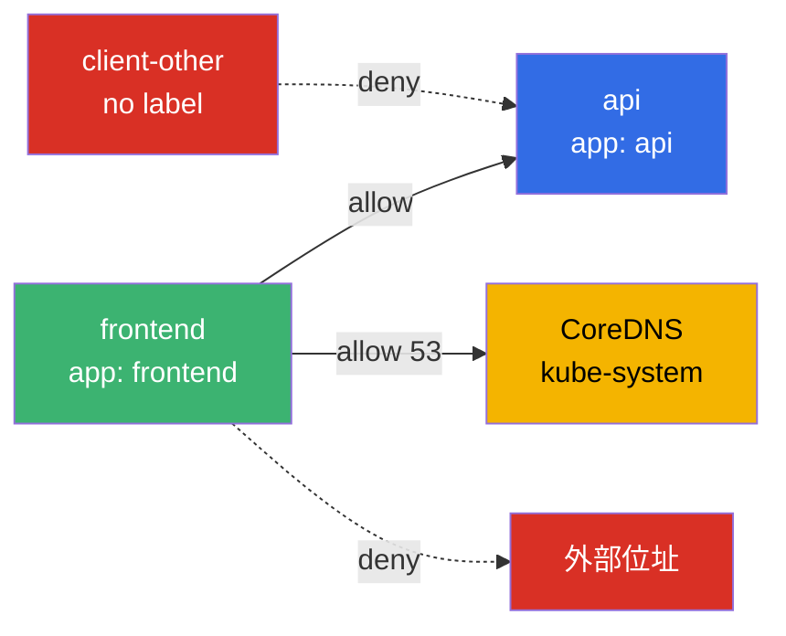
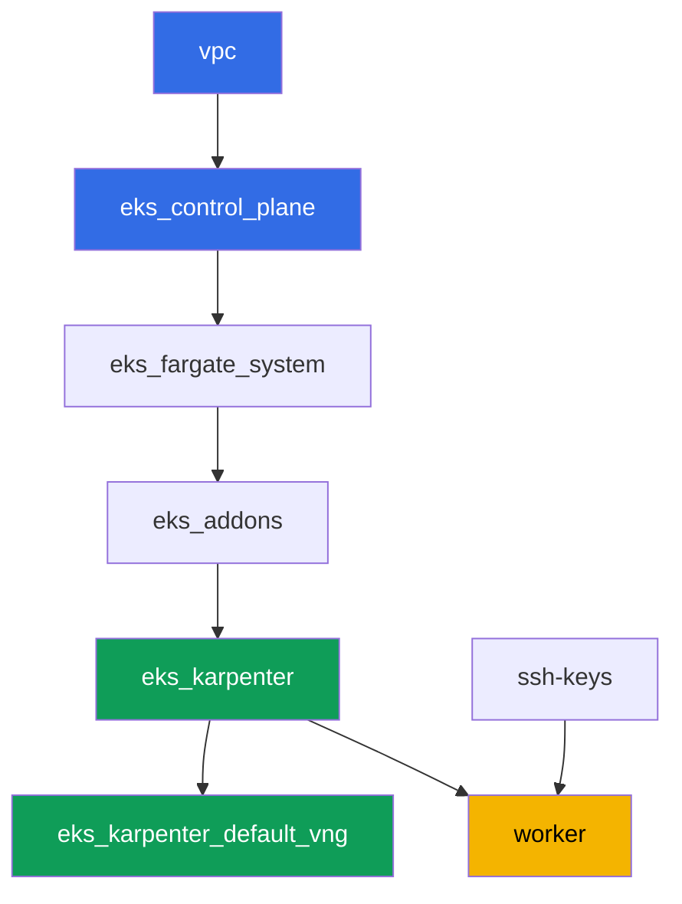

[Русская версия](README_RU.MD) · [Eng version](README.MD) · [Versión en español](README_ES.MD) · [Version française](README_FR.MD) · [Deutsche Version](README_DE.MD) · [ქართული ვერსია](README_GE.MD) · [日本語版](README_JP.MD)

# 實驗 110 - EKS 中的 NetworkPolicy:VPC CNI 內建的網路政策

## 說明

在這個實驗中你會啟用並驗證 VPC CNI 內建的東西向(east-west)流量控制:control plane
上的政策控制器,以及每個節點上基於 eBPF 的 `aws-network-policy-agent` 代理。預設情況下
`NetworkPolicy` 對象在 EKS 中作為一個 API 對象存在,但沒有任何東西強制執行它 - 所有 pod
之間的流量都是被允許的。你會透過 `vpc-cni` 附加元件上的一個旗標開啟強制執行,重現症狀
(連通性被允許),然後用預設拒絕(default deny)把它關閉,再依標籤與 namespace 選擇性
地重新開放,並用一個明確的 DNS 例外來限制出站流量。這一切都使用標準的 Kubernetes
`NetworkPolicy` 語法 -不需要任何 CRD。

任務以生產風格編寫:簡短的任務描述加驗收標準。驗證是自動的,透過 `check_result` 命令
完成。

## 目標

鞏固以下課程章節的內容:

- [第 8 章。深入了解網路:VPC CNI 與其他 CNI](../../course/08/ru.md) - 內建網路政策與 Cilium 的邊界
- [第 30 章。NetworkPolicy:規則、DNS、測試](../../course/30/ru.md) - 預設拒絕、依標籤與 namespace 允許、egress

## 我們要創建什麼

集群已經以代碼方式部署完成,`vpc-cni` 附加元件已配置 `enableNetworkPolicy = "true"`。
你要使用一個現成的強制執行器,並在它之上建立負載與政策。

| 對象 | 這是什麼 | 在這個實驗中的作用 |
|--------|---------|-------------------|
| Namespace `eks-110` | 供實驗負載使用的集群區域 | 讓資源保持隔離 |
| Deployment `api`(2 個副本)+ Service `api` | ping_pong 伺服器 | 用於檢查政策的目標 |
| Deployment `client`、`frontend`、`client-other` | curl 客戶端 | 依標籤區分不同的可見性 |
| NetworkPolicy `default-deny-ingress` | 拒絕進入 `eks-110` 的 ingress | 關閉所有東西向流量 |
| NetworkPolicy `allow-frontend-to-api` | 依標籤允許 | 選擇性存取 `frontend` -> `api` |
| NetworkPolicy `restrict-egress` | 限制 egress 並加上 DNS 例外 | egress 只允許到 `api` 與 `kube-system:53` |

namespace `eks-110` 中最終的流量圖景:



## 基礎設施

環境透過 Terragrunt 部署在 AWS(`eu-central-1`)。實驗中的每個目錄都是一個組件,擁有
自己的 `terragrunt.hcl`,它引用 `terraform/modules/` 中的共用模組,並透過 `dependency`
區塊聲明依賴關係。Terragrunt 會構建依賴關係圖,並依正確的順序套用各個組件。

### 模組與依賴關係

| 目錄(組件) | 模組(`terraform/modules/`) | 依賴於 | 創建了什麼 |
|---------------------|-------------------------------|------------|-------------|
| `vpc` | `vpc_v3` | - | VPC `10.10.0.0/16`,兩個 AZ 中的子網,NAT |
| `ssh-keys` | `ssh-keys` | - | 供工作機與節點使用的一對 SSH 金鑰 |
| `eks_control_plane` | `eks_v2_control_plane` | `vpc` | EKS control plane `1.36`、OIDC |
| `eks_fargate_system` | `eks_v2_fargate` | `vpc`、`eks_control_plane` | `kube-system` 與 `karpenter` 的 Fargate 配置檔 |
| `eks_addons` | `eks_v2_addons` | `eks_control_plane`、`eks_fargate_system` | coredns、kube-proxy、vpc-cni(帶有 `enableNetworkPolicy`)、pod-identity |
| `eks_karpenter` | `eks_v2_karpenter` | `vpc`、`eks_control_plane`、`eks_addons`、`eks_fargate_system` | Karpenter 控制器、節點 IAM 角色 |
| `eks_karpenter_default_vng` | `eks_v2_karpenter_vng` | `vpc`、`eks_control_plane`、`eks_karpenter` | 預設的 NodePool 與 EC2NodeClass |
| `worker` | `eks_v2_work_pc` | `ssh-keys`、`vpc`、`eks_control_plane`、`eks_karpenter` | 工作機、測試、`check_result` |

依賴關係圖(較早套用的組件位於箭頭下方):



### 各項設定在哪裡配置

`env.hcl`(共用的環境參數,所有組件都會讀取):

| 參數 | 實驗中的值 | 影響什麼 |
|----------|-----------------|---------------|
| `region` | `eu-central-1` | 所有資源的區域 |
| `prefix` | `eks-task110` | 資源名稱與標籤的前綴 |
| `stack_name` | `eks110` | 用於構建 `env_name` - 集群名稱 |
| `k8_version` | `1.36.0` | 工作機上 kubectl 的版本 |
| `instance_type_worker` | `t3.medium` | 工作機的 instance 類型 |
| `ssh_password_enable`、`access_cidrs` | `true`、`0.0.0.0/0` | 對工作機的 SSH 存取 |

每個組件 `terragrunt.hcl` 中的 `inputs`(特定模組的參數):

| 檔案 | 關鍵設定 |
|------|--------------------|
| `eks_control_plane/terragrunt.hcl` | `eks.version = "1.36"` |
| `eks_addons/terragrunt.hcl` | 適用於 1.36 的附加元件版本;`vpc-cni` 多了一個 `configuration = { enableNetworkPolicy = "true" }` 區塊 - 這是實驗 110 與基本組合唯一的差異 |
| `eks_fargate_system/terragrunt.hcl` | Fargate 的 namespace 選擇器(`kube-system`、`karpenter`) |
| `eks_karpenter/terragrunt.hcl` | Karpenter 版本 `1.8.1` |
| `eks_karpenter_default_vng/terragrunt.hcl` | NodePool 的 `requirements`、`limits`、`disruption` |
| `worker/terragrunt.hcl` | 指向實驗 110 檔案的 `test_url` 與 `task_script_url` |

`enableNetworkPolicy = "true"` 會在 control plane 上啟用 Network Policy Controller
(由 AWS 管理),並在每個節點的 `aws-node` DaemonSet 中啟用 `aws-network-policy-agent`
代理 - 實際透過 eBPF 編寫規則的正是這個代理。此參數需要 VPC CNI 版本
`v1.14.0-eksbuild.3` 或更新;這個實驗安裝的是 `v1.21.1-eksbuild.1`。

## 部署

```bash
TASK=110 make run_eks_task
```

部署大約需要 15-20 分鐘。在輸出中找到連接工作機的 SSH 那一行並連接上去。kubectl 在那
裡已經配置好指向正確的集群。

工作機上的常用命令:

```bash
time_left       # 環境剩餘的時間
check_result    # 檢查解答
```

> 環境的安全性。`env.hcl` 中啟用了 `ssh_password_enable = true` 和
> `access_cidrs = ["0.0.0.0/0"]` - 這對於學習環境很方便,但在生產環境中不應該這樣做。
> 依照課程標準(第 0.2、2、19 章),對工作機的存取應透過 AWS SSM Session Manager 進行,
> 不對外暴露公開的 SSH 端口,並將 `access_cidrs` 限制到具體的位址。這裡保留公開 SSH 只
> 是為了簡化啟動流程。

## 任務

---
|        **1**        | **供實驗負載使用的 Namespace**                             |
| :-----------------: | :---------------------------------------------------------- |
| 我們要做什麼          | 創建一個名為 `eks-110` 的 namespace。實驗中的所有對象都在其中創建。 |
| 驗收標準    | - namespace `eks-110` 存在。 |
---
|        **2**        | **檢查網路政策強制執行器是否已啟用**           |
| :-----------------: | :---------------------------------------------------------- |
| 我們要做什麼          | 確認政策代理確實在節點上運行,而不只是在配置中被聲明。檢查兩個事實:`kube-system` 中的 DaemonSet `aws-node` 包含一個容器 `aws-network-policy-agent`(`kubectl describe daemonset aws-node -n kube-system`),以及 `vpc-cni` 附加元件的配置確認了 `enableNetworkPolicy: true`(`aws eks describe-addon --cluster-name <cluster> --addon-name vpc-cni --query "addon.configurationValues"`)。將兩個輸出都保存到檔案 `/var/work/tests/artifacts/2/enforcer.txt`。 |
| 驗收標準    | - 檔案不為空;<br/>- 包含 `aws-network-policy-agent`;<br/>- 包含 `enableNetworkPolicy` 和 `true`。 |
---
|        **3**        | **在任何政策之前的症狀:預設允許連通性**   |
| :-----------------: | :---------------------------------------------------------- |
| 我們要做什麼          | 在 `eks-110` 中創建 Deployment `api`(映像 `viktoruj/ping_pong:latest`,`2` 個副本)以及 Service `api`,端口 `8080`。創建 Deployment `client`(映像 `curlimages/curl:latest`,命令 `sleep 3600`,以便可以對它執行 `kubectl exec`)。等待兩者都變為就緒。透過在 `client` 上執行 `kubectl exec`,對 `api.eks-110.svc.cluster.local:8080` 執行 `curl`,帶上 `--connect-timeout` 和 `--max-time`,將回應碼以 `HTTP_CODE=<code>` 的格式保存到檔案 `/var/work/tests/artifacts/3/connectivity_before.txt`。在沒有任何 NetworkPolicy 的情況下,連通性是被允許的。 |
| 驗收標準    | - Deployment `api`,`2` 個就緒副本,Service `api` 端口 `8080`;<br/>- Deployment `client`,`1` 個就緒副本;<br/>- 檔案 `3/connectivity_before.txt` 包含 `HTTP_CODE=200`。 |
---
|        **4**        | **預設拒絕 ingress**                                     |
| :-----------------: | :---------------------------------------------------------- |
| 我們要做什麼          | 在 `eks-110` 中創建 NetworkPolicy `default-deny-ingress`,設定 `podSelector: {}` 和 `policyTypes: ["Ingress"]`(不包含 `ingress` 區塊) - 這會關閉 namespace 中每個 pod 的所有入站流量。用相同的超時再次對 `api` 從 `client` 執行 `curl`,並將回應碼保存到檔案 `/var/work/tests/artifacts/4/connectivity_denied.txt`。此時該請求應該無法到達目標。 |
| 驗收標準    | - NetworkPolicy `default-deny-ingress`,`policyTypes: ["Ingress"]`;<br/>- 檔案 `4/connectivity_denied.txt` 不包含 `HTTP_CODE=200`。 |
---
|        **5**        | **依標籤允許**                                      |
| :-----------------: | :---------------------------------------------------------- |
| 我們要做什麼          | 創建 NetworkPolicy `allow-frontend-to-api`:`podSelector.matchLabels.app: api`、`policyTypes: ["Ingress"]`、`ingress.from.podSelector.matchLabels.app: frontend`,端口 `8080`。創建 Deployment `frontend`(映像 `curlimages/curl:latest`,`sleep 3600`) - 它會自動獲得標籤 `app: frontend`。再創建 Deployment `client-other`(相同映像),不帶 `app: frontend` 標籤 - 它會獲得 `app: client-other`。檢查從 `frontend` 到 `api` 的 `curl`(保存到 `5/allowed_frontend.txt`)以及從 `client-other` 到 `api` 的 `curl`(保存到 `5/blocked_other.txt`)。 |
| 驗收標準    | - NetworkPolicy `allow-frontend-to-api`,帶有指定的 `podSelector` 和 `ingress.from`;<br/>- `frontend` 已就緒,標籤 `app: frontend`;<br/>- `client-other` 已就緒,標籤與 `frontend` 不同;<br/>- 檔案 `5/allowed_frontend.txt` 包含 `HTTP_CODE=200`;<br/>- 檔案 `5/blocked_other.txt` 不包含 `HTTP_CODE=200`。 |
---
|        **6**        | **帶有 DNS 例外的 Egress**                              |
| :-----------------: | :---------------------------------------------------------- |
| 我們要做什麼          | 創建 NetworkPolicy `restrict-egress`:`podSelector.matchLabels.app: frontend`、`policyTypes: ["Egress"]`,`egress` 只允許前往 `podSelector.matchLabels.app: api` 的方向,以及前往 `namespaceSelector.matchLabels: kubernetes.io/metadata.name: kube-system` 的方向(端口 `53/UDP` 和 `53/TCP`)。檢查 `frontend` 能否解析名稱 `api` 並得到 `HTTP_CODE=200`(保存到 `6/egress_dns_api.txt`),以及對任意外部位址(例如 `curl` 到 `1.1.1.1`)的請求是否無法通過(保存到 `6/egress_external_blocked.txt`)。 |
| 驗收標準    | - NetworkPolicy `restrict-egress`,帶有 `policyTypes: ["Egress"]` 和 `podSelector.matchLabels.app: frontend`;<br/>- 檔案 `6/egress_dns_api.txt` 包含 `HTTP_CODE=200`;<br/>- 檔案 `6/egress_external_blocked.txt` 不包含 `HTTP_CODE=200`。 |
---

## 檢查結果

在工作機上執行自動檢查:

```bash
check_result
```

腳本會執行測試並顯示已完成任務的百分比。

## 解答

參考解答:[worker/files/solutions/1_TW.MD](worker/files/solutions/1_TW.MD)

## 刪除集群與資源

> **先移除負載並等待 EC2 節點離開,然後才拆除環境。** 這個實驗不會手動創建任何 AWS
> 資源 - 額外的一切都是 Kubernetes 對象(Deployment `api`、`client`、`frontend`、
> `client-other` 以及 namespace `eks-110` 中的 NetworkPolicy)。有一個危險之處:如果
> 你在負載仍在運行時就刪除集群,Karpenter 的 EC2 節點會跟著一起消失,而來自 VPC CNI
> 的次要 ENI 會停留在 `available` 狀態,並持續佔用節點的 security group -
> `destroy` 會卡在
> `module.eks.aws_security_group.node[0]: Still destroying...` 好幾十分鐘。

```bash
# 1. 移除實驗的負載(NetworkPolicy 會隨 namespace 一起消失)
kubectl delete namespace eks-110 --ignore-not-found

# 2. 等待 Karpenter 移除 NodeClaim 和 EC2 節點(只應該剩下 fargate-*)
while kubectl get nodeclaims --no-headers 2>/dev/null | grep -q .; do
  echo "NodeClaim still alive, waiting..."; sleep 15
done
kubectl get nodes | grep -v fargate
```

只有完成之後才拆除環境:

```bash
TASK=110 make delete_eks_task
```

如果 `destroy` 仍然卡在節點的 security group 上,說明留下了一個孤兒 ENI。找到並刪除
它:

```bash
aws ec2 describe-network-interfaces --filters Name=status,Values=available \
  --query 'NetworkInterfaces[?Tags[?Key==`eks:eni:owner`]].[NetworkInterfaceId,Description]' \
  --output table
aws ec2 delete-network-interface --network-interface-id <eni-id>
```
