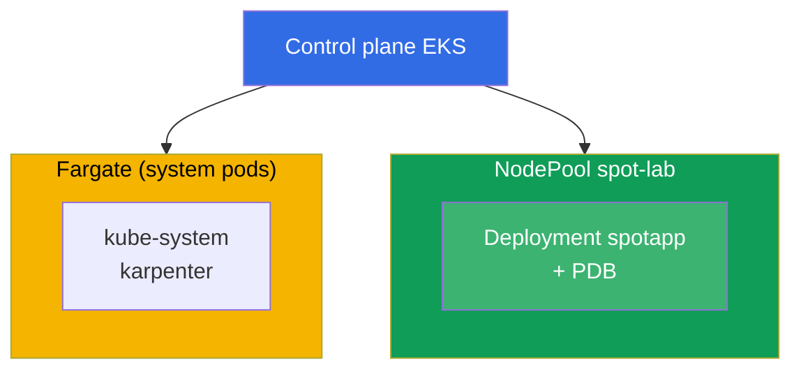
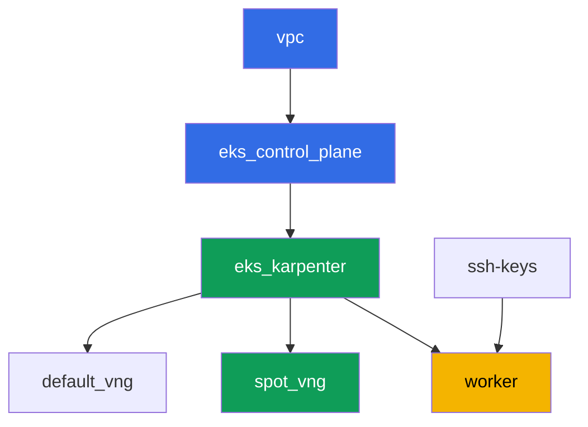

[Русская версия](README_RU.MD) · [Versión en español](README_ES.MD) · [Version française](README_FR.MD) · [Deutsche Version](README_DE.MD) · [ქართული ვერსია](README_GE.MD) · [繁體中文版](README_TW.MD) · [日本語版](README_JP.MD)

# Lab 111 - Spot nodes: diversification, interruption handling, graceful drain

## Description

We practice operating spot capacity in EKS: why a homogeneous set of instance types in a
single zone is a risk of losing the whole pool at once, how Karpenter provides
diversification through `requirements`, what a PDB actually protects during voluntary
eviction, and where the line runs between voluntary drain and a forced spot reclaim by AWS
itself.

Tasks are written in a production style: a short statement plus acceptance criteria.
Checking is automatic, via the `check_result` command.

## Goal

Reinforce the material from the course chapter:

- [Chapter 13. Spot instances: interruptions, diversification](../../course/13/ru.md) -
  event handling

## What we're creating

The cluster is already deployed as code (base - same as in lab 101), with a second
NodePool for spot workload with a taint added on top. You create a deployment that can
live on this pool and check the PDB's protection during eviction.

| Object | What it is | Why it's in this lab |
|--------|---------|-------------------|
| NodePool `spot-lab` | second Karpenter NodePool, `spot` only, taint `dedicated=spot-lab` | a clean spot pool diversified across c/m/r categories |
| Namespace `eks-111` | a cluster section for the lab's workload | keeps resources separate from system ones |
| Deployment `spotapp` (4 replicas) | ping_pong application with a toleration, `terminationGracePeriodSeconds: 60`, `preStop` | workload ready for a spot interruption (chapter 13) |
| Artifacts `nodes.txt`, `nodepool.txt` | a node snapshot and NodePool requirements | confirm capacity-type=spot and type diversification |
| PodDisruptionBudget `spotapp-pdb` | `minAvailable: 3` out of 4 replicas | protection against excessive voluntary eviction |
| Artifact `drain.txt` | the drain-blocked-by-PDB symptom and an explanation | responsibility boundary: PDB vs. a forced reclaim |
| Artifact `interruption.txt` | confirmation that Karpenter handles interruptions | Karpenter reacts to interruptions itself via a queue |

The resulting cluster picture:



## Infrastructure

The environment is deployed in AWS (`eu-central-1`) via Terragrunt. Each lab directory is
one component with its own `terragrunt.hcl`, which references a shared module in
`terraform/modules/` and declares dependencies through `dependency` blocks. Terragrunt
builds the dependency graph and applies the components in the right order.

### Modules and dependencies

| Directory (component) | Module (`terraform/modules/`) | Depends on | What it creates |
|---------------------|-------------------------------|------------|-------------|
| `vpc` | `vpc_v3` | - | VPC `10.10.0.0/16`, public and private subnets in two AZs, NAT |
| `ssh-keys` | `ssh-keys` | - | an SSH key pair for the worker machine and nodes |
| `eks_control_plane` | `eks_v2_control_plane` | `vpc` | EKS control plane `1.36`, OIDC, security groups |
| `eks_fargate_system` | `eks_v2_fargate` | `vpc`, `eks_control_plane` | Fargate profile for `kube-system` and `karpenter` |
| `eks_addons` | `eks_v2_addons` | `eks_control_plane`, `eks_fargate_system` | coredns, kube-proxy, vpc-cni, pod-identity add-ons |
| `eks_karpenter` | `eks_v2_karpenter` | `vpc`, `eks_control_plane`, `eks_addons`, `eks_fargate_system` | Karpenter controller, node IAM role, interruption queue |
| `eks_karpenter_default_vng` | `eks_v2_karpenter_vng` | `vpc`, `eks_control_plane`, `eks_karpenter` | default NodePool `default` (spot and on-demand) |
| `eks_karpenter_spot_vng` | `eks_v2_karpenter_vng` | `vpc`, `eks_control_plane`, `eks_karpenter` | NodePool `spot-lab`: spot only, taint, a wide set of types |
| `worker` | `eks_v2_work_pc` | `ssh-keys`, `vpc`, `eks_control_plane`, `eks_karpenter` | worker machine with kubectl, tests and `check_result` |

Dependency graph (what gets applied earlier is lower down the arrow):



Components `eks_fargate_system` and `eks_addons` are not shown in the graph due to the
8-node limit, but in fact sit between `eks_control_plane` and `eks_karpenter` (see the
table above).

### NodePool `spot-lab` settings

Key `requirements` in `eks_karpenter_spot_vng/terragrunt.hcl`:

| Requirement | Value | Why |
|-------------|----------|-------|
| `karpenter.sh/capacity-type` | `In ["spot"]` | spot only, the training goal is a clean spot pool |
| `karpenter.k8s.aws/instance-category` | `In ["c", "m", "r"]` | three families - type diversification |
| `karpenter.k8s.aws/instance-generation` | `Gt ["2"]` | don't take outdated generations |
| `karpenter.k8s.aws/instance-size` | `In ["medium", "large", "xlarge"]` | a reasonable size range |
| taint | `dedicated=spot-lab:NoSchedule` | only pods with a toleration land on the pool |
| `disruption.consolidationPolicy` | `WhenEmptyOrUnderutilized`, `consolidateAfter: 30s` | fast consolidation of empty nodes |
| `budgets` | `nodes: 33%` | limit on the share of nodes disrupted at the same time |

The rest of the parameters (region, network, versions, prefixes) are read from `env.hcl`,
same as in lab 101; there's no need to change their logic.

## Deployment

```bash
TASK=111 make run_eks_task
```

Deployment takes roughly 15-20 minutes. In the output, find the line with the SSH connection
to the worker machine and connect to it. kubectl there is already configured for the right
cluster.

Useful commands on the worker machine:

```bash
time_left       # how much environment time is left
check_result    # check the solution
```

> Environment security. `env.hcl` has `ssh_password_enable = true` and
> `access_cidrs = ["0.0.0.0/0"]` enabled - convenient for a training environment, but this
> is not something to do in production. Per the course standards (chapters 0.2, 2, 19),
> access to worker machines should go through AWS SSM Session Manager without exposing
> public SSH ports, and `access_cidrs` should be narrowed down to specific addresses. Here
> public SSH is left in place only to keep the setup simple.

## Tasks

---
|        **1**        | **Namespace for the lab's workload**                             |
| :-----------------: | :---------------------------------------------------------- |
| What to do          | Create a namespace named `eks-111`. All lab objects are created inside it. |
| Acceptance criteria    | - namespace `eks-111` exists. |
---
|        **2**        | **A deployment ready for a spot interruption**                   |
| :-----------------: | :---------------------------------------------------------- |
| What to do          | In namespace `eks-111`, create Deployment `spotapp`, image `viktoruj/ping_pong:latest`, `4` replicas. NodePool `spot-lab` is closed off with the taint `dedicated=spot-lab:NoSchedule`, so add the matching toleration to the pod. Set `terminationGracePeriodSeconds: 60` (less than the two-minute spot interruption window) and a `preStop` with `sleep 5` to give the load balancer time to drain traffic. Wait for `4` Ready replicas on nodes labeled `karpenter.sh/capacity-type=spot`. |
| Acceptance criteria    | - Deployment `spotapp` in `eks-111`, image `viktoruj/ping_pong`, `4` ready replicas;<br/>- a toleration for `dedicated=spot-lab:NoSchedule`;<br/>- `terminationGracePeriodSeconds: 60` and `preStop` are set;<br/>- all `spotapp` pods are on nodes with `capacity-type=spot`. |
---
|        **3**        | **Artifact: spot nodes and NodePool diversification**            |
| :-----------------: | :---------------------------------------------------------- |
| What to do          | Save `kubectl get nodes -L karpenter.sh/capacity-type -L karpenter.k8s.aws/instance-category` to file `/var/work/tests/artifacts/3/nodes.txt`. Separately, save the `requirements` of NodePool `spot-lab` (`kubectl get nodepool spot-lab -o yaml`, the fragment of interest with `instance-category`) to file `/var/work/tests/artifacts/3/nodepool.txt`. Confirm that the `spotapp` node(s) are `spot`, and that the NodePool provides diversification (three instance categories `c`, `m`, `r`). |
| Acceptance criteria    | - file `nodes.txt` is not empty and contains an entry `spot`;<br/>- file `nodepool.txt` is not empty and contains the categories `c`, `m`, `r`. |
---
|        **4**        | **PodDisruptionBudget on `spotapp`**                        |
| :-----------------: | :---------------------------------------------------------- |
| What to do          | Create a `PodDisruptionBudget` named `spotapp-pdb` in namespace `eks-111`: `minAvailable: 3` (out of `4` replicas), selector on label `app: spotapp`. |
| Acceptance criteria    | - object `spotapp-pdb` exists in `eks-111`;<br/>- `spec.minAvailable` equals `3`;<br/>- the selector targets `app: spotapp`. |
---
|        **5**        | **Symptom: drain gets blocked by PDB, but not a forced reclaim** |
| :-----------------: | :---------------------------------------------------------- |
| What to do          | Pick a node with a `spotapp` pod, run `kubectl cordon` on it and try `kubectl drain <node> --ignore-daemonsets --dry-run=client`. Check `kubectl get pdb spotapp-pdb -n eks-111 -o jsonpath='{.status.disruptionsAllowed}'` - with `4` replicas and `minAvailable: 3` the budget allows evicting no more than one replica at a time. Save an explanation to `/var/work/tests/artifacts/5/drain.txt`: PDB protects only voluntary eviction (drain, node upgrades, Karpenter consolidation), not a forced reclaim of a spot instance by AWS itself. The text must contain the words `PDB` and `voluntary`. |
| Acceptance criteria    | - `spotapp-pdb.status.disruptionsAllowed` is no more than `1`;<br/>- file `/var/work/tests/artifacts/5/drain.txt` is not empty and contains `PDB` and `voluntary`. |
---
|        **6**        | **Checking Karpenter's interruption handling**                 |
| :-----------------: | :---------------------------------------------------------- |
| What to do          | Confirm that Karpenter's spot interruption handling mechanism is configured: look at the controller logs (`kubectl logs -n karpenter -l app.kubernetes.io/name=karpenter \| grep -i interrupt`). If there are no permissions for `aws sqs list-queues` - that's expected, use only `kubectl logs`. Save the result (events, or an explanation that the mechanism is configured via an interruption queue) to file `/var/work/tests/artifacts/6/interruption.txt`. |
| Acceptance criteria    | - file `/var/work/tests/artifacts/6/interruption.txt` is not empty and contains the word `interrupt`. |
---

## Checking the result

On the worker machine, run the automatic check:

```bash
check_result
```

The script will run the tests and show the percentage of completed tasks.

## Solution

Reference solution: [worker/files/solutions/1.MD](worker/files/solutions/1.MD)

## Deleting the cluster and resources

> Before deleting. Karpenter creates the EC2 nodes of NodePools `default` and `spot-lab`
> directly through the EC2 API (`NodeClaim`) - they aren't in the terraform state. If the
> control plane is deleted before Karpenter properly terminates the instances, the nodes
> will be left orphaned: they hold ENIs in the private subnets, and `aws_subnet`/`aws_vpc`
> will get stuck in `Still destroying...` (the same pattern as with ALB/NLB in labs
> 108-109). Delete the workload and the `NodeClaim`, letting Karpenter terminate the EC2
> instances itself, BEFORE `terragrunt destroy`:
>
> ```bash
> kubectl delete deployment spotapp -n eks-111 --ignore-not-found
> kubectl delete pdb spotapp-pdb -n eks-111 --ignore-not-found
> kubectl delete nodeclaim --all
> kubectl wait --for=delete nodeclaim --all --timeout=180s
> ```
>
> Check that no EC2 node is left:
>
> ```bash
> kubectl get nodes   # only fargate-* nodes should remain
> ```
>
> If the control plane is already deleted (Karpenter can no longer process the deletion),
> find and terminate the orphaned instances manually via AWS CLI:
>
> ```bash
> CLUSTER=eks111--
> aws ec2 describe-instances --filters "Name=tag:eks:eks-cluster-name,Values=${CLUSTER}" \
>   "Name=instance-state-name,Values=running,pending" \
>   --query 'Reservations[].Instances[].InstanceId' --output text | \
>   xargs -r aws ec2 terminate-instances --instance-ids
> ```

```bash
TASK=111 make delete_eks_task
```
