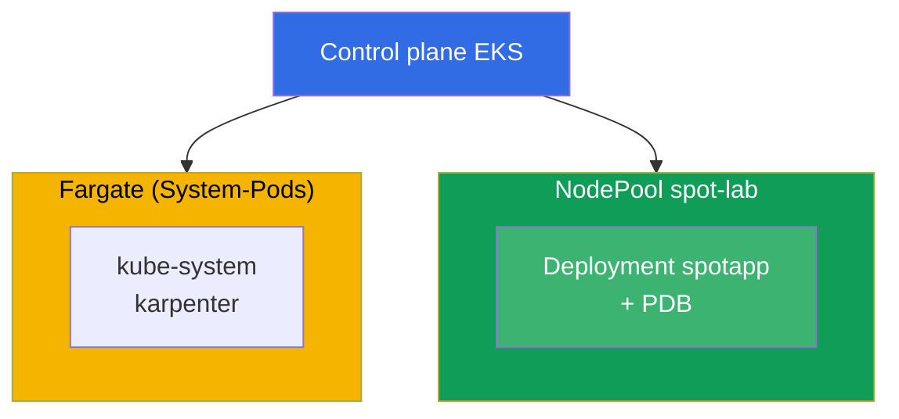
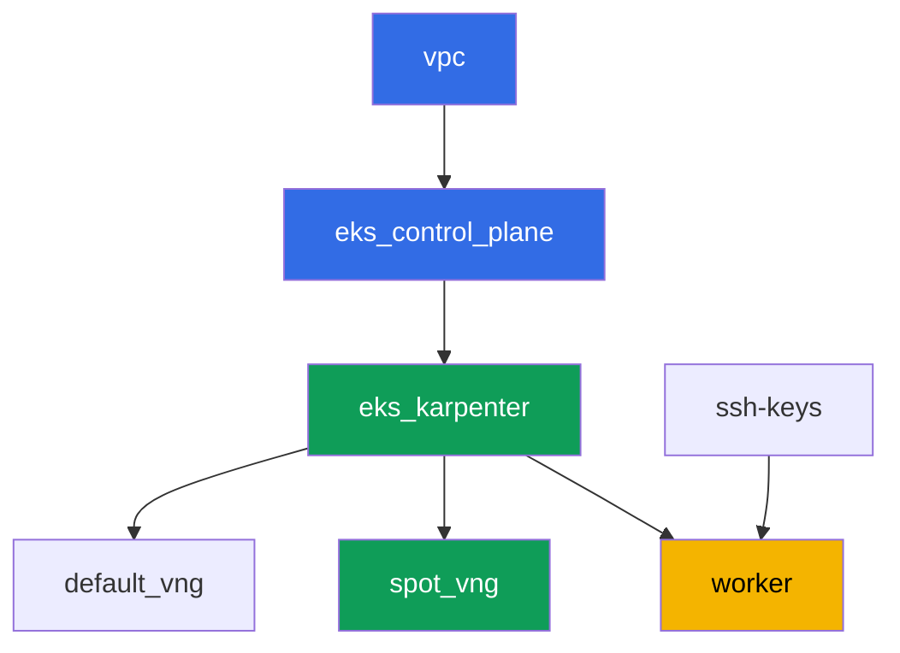

[Русская версия](README_RU.MD) · [Eng version](README.MD) · [Versión en español](README_ES.MD) · [Version française](README_FR.MD) · [ქართული ვერსია](README_GE.MD) · [繁體中文版](README_TW.MD) · [日本語版](README_JP.MD)

# Lab 111 - Spot-Nodes: Diversifizierung, Umgang mit Interruptions, graceful drain

## Beschreibung

Wir üben den Betrieb von Spot-Kapazität in EKS: warum ein homogener Satz von
Instance-Typen in einer einzigen Zone das Risiko birgt, den ganzen Pool auf einmal zu
verlieren, wie Karpenter über `requirements` Diversifizierung bietet, was ein PDB während
einer voluntären Eviction tatsächlich schützt, und wo die Grenze zwischen voluntärem
drain und einem forcierten Spot-Reclaim durch AWS selbst verläuft.

Die Aufgaben sind im Produktionsstil geschrieben: eine kurze Aufgabenstellung plus
Abnahmekriterien. Die Prüfung erfolgt automatisch über den Befehl `check_result`.

## Ziel

Den Stoff des folgenden Kurskapitels vertiefen:

- [Chapter 13. Spot instances: interruptions, diversification](../../course/13/ru.md) -
  Umgang mit Events

## Was wir erstellen

Der Cluster ist bereits als Code deployt (Basis - dieselbe wie in Lab 101), mit einem
zweiten NodePool für Spot-Workload und einem zusätzlichen taint darauf. Sie erstellen ein
Deployment, das auf diesem Pool leben kann, und prüfen den Schutz des PDB während einer
Eviction.

| Objekt | Was es ist | Wofür in diesem Lab |
|--------|---------|-------------------|
| NodePool `spot-lab` | zweiter Karpenter-NodePool, nur `spot`, taint `dedicated=spot-lab` | ein saubere Spot-Pool, diversifiziert über c/m/r-Kategorien |
| Namespace `eks-111` | ein Cluster-Bereich für die Lab-Workload | hält Ressourcen getrennt von den System-Ressourcen |
| Deployment `spotapp` (4 Replicas) | ping_pong-Anwendung mit einer toleration, `terminationGracePeriodSeconds: 60`, `preStop` | Workload bereit für eine Spot-Interruption (Kapitel 13) |
| Artefakte `nodes.txt`, `nodepool.txt` | ein Node-Snapshot und NodePool-requirements | bestätigen capacity-type=spot und Typ-Diversifizierung |
| PodDisruptionBudget `spotapp-pdb` | `minAvailable: 3` von 4 Replicas | Schutz gegen übermäßige voluntäre Eviction |
| Artefakt `drain.txt` | das Symptom „drain wird durch PDB blockiert" und eine Erklärung | Verantwortungsgrenze: PDB gegen einen forcierten Reclaim |
| Artefakt `interruption.txt` | Bestätigung, dass Karpenter Interruptions handhabt | Karpenter reagiert selbst über eine Queue auf Interruptions |

Das resultierende Cluster-Bild:



## Infrastruktur

Die Umgebung wird in AWS (`eu-central-1`) über Terragrunt deployt. Jedes Lab-Verzeichnis
ist eine Komponente mit eigenem `terragrunt.hcl`, das auf ein gemeinsames Modul in
`terraform/modules/` verweist und seine Abhängigkeiten über `dependency`-Blöcke deklariert.
Terragrunt baut den Abhängigkeitsgraphen und wendet die Komponenten in der richtigen
Reihenfolge an.

### Module und Abhängigkeiten

| Verzeichnis (Komponente) | Modul (`terraform/modules/`) | Abhängig von | Was es erstellt |
|---------------------|-------------------------------|------------|-------------|
| `vpc` | `vpc_v3` | - | VPC `10.10.0.0/16`, öffentliche und private Subnetze in zwei AZ, NAT |
| `ssh-keys` | `ssh-keys` | - | ein SSH-Schlüsselpaar für die Worker-Maschine und die Nodes |
| `eks_control_plane` | `eks_v2_control_plane` | `vpc` | EKS Control Plane `1.36`, OIDC, Security Groups |
| `eks_fargate_system` | `eks_v2_fargate` | `vpc`, `eks_control_plane` | Fargate-Profil für `kube-system` und `karpenter` |
| `eks_addons` | `eks_v2_addons` | `eks_control_plane`, `eks_fargate_system` | coredns, kube-proxy, vpc-cni, pod-identity Add-ons |
| `eks_karpenter` | `eks_v2_karpenter` | `vpc`, `eks_control_plane`, `eks_addons`, `eks_fargate_system` | Karpenter-Controller, Node-IAM-Rolle, Interruption-Queue |
| `eks_karpenter_default_vng` | `eks_v2_karpenter_vng` | `vpc`, `eks_control_plane`, `eks_karpenter` | Standard-NodePool `default` (spot und on-demand) |
| `eks_karpenter_spot_vng` | `eks_v2_karpenter_vng` | `vpc`, `eks_control_plane`, `eks_karpenter` | NodePool `spot-lab`: nur spot, taint, ein breiter Satz von Typen |
| `worker` | `eks_v2_work_pc` | `ssh-keys`, `vpc`, `eks_control_plane`, `eks_karpenter` | Worker-Maschine mit kubectl, Tests und `check_result` |

Abhängigkeitsgraph (was früher angewendet wird, steht weiter unten am Pfeil):



Die Komponenten `eks_fargate_system` und `eks_addons` sind aufgrund der 8-Node-Grenze
nicht im Graphen dargestellt, liegen aber tatsächlich zwischen `eks_control_plane` und
`eks_karpenter` (siehe die Tabelle oben).

### Einstellungen des NodePool `spot-lab`

Wichtige `requirements` in `eks_karpenter_spot_vng/terragrunt.hcl`:

| Requirement | Wert | Warum |
|-------------|----------|-------|
| `karpenter.sh/capacity-type` | `In ["spot"]` | nur spot, das Trainingsziel ist ein sauberer Spot-Pool |
| `karpenter.k8s.aws/instance-category` | `In ["c", "m", "r"]` | drei Familien - Typ-Diversifizierung |
| `karpenter.k8s.aws/instance-generation` | `Gt ["2"]` | keine veralteten Generationen verwenden |
| `karpenter.k8s.aws/instance-size` | `In ["medium", "large", "xlarge"]` | ein sinnvoller Größenbereich |
| taint | `dedicated=spot-lab:NoSchedule` | nur Pods mit einer toleration landen auf dem Pool |
| `disruption.consolidationPolicy` | `WhenEmptyOrUnderutilized`, `consolidateAfter: 30s` | schnelle Konsolidierung leerer Nodes |
| `budgets` | `nodes: 33%` | Grenze für den Anteil gleichzeitig gestörter Nodes |

Die restlichen Parameter (Region, Netzwerk, Versionen, Präfixe) werden aus `env.hcl`
gelesen, genauso wie in Lab 101; ihre Logik muss nicht geändert werden.

## Deployment

```bash
TASK=111 make run_eks_task
```

Das Deployment dauert etwa 15-20 Minuten. Suchen Sie in der Ausgabe die Zeile mit der
SSH-Verbindung zur Worker-Maschine und verbinden Sie sich damit. kubectl ist dort bereits
für den richtigen Cluster konfiguriert.

Nützliche Befehle auf der Worker-Maschine:

```bash
time_left       # verbleibende Zeit der Umgebung
check_result    # Lösung prüfen
```

> Sicherheit der Testumgebung. In `env.hcl` sind `ssh_password_enable = true` und
> `access_cidrs = ["0.0.0.0/0"]` aktiviert - praktisch für eine Lernumgebung, aber so
> sollte man es in Produktion nicht machen. Nach den Standards des Kurses (Kapitel 0.2, 2,
> 19) wird der Zugriff auf Worker-Maschinen über AWS SSM Session Manager geöffnet, ohne
> öffentliche SSH-Ports nach außen, und `access_cidrs` wird auf konkrete Adressen
> eingeschränkt. Hier bleibt öffentliches SSH nur der Einfachheit halber bestehen.

## Aufgaben

---
|        **1**        | **Namespace für die Lab-Workload**                             |
| :-----------------: | :---------------------------------------------------------- |
| Was wir tun          | Erstellen Sie einen Namespace mit dem Namen `eks-111`. Alle Objekte des Labs werden darin erstellt. |
| Abnahmekriterien    | - Namespace `eks-111` existiert. |
---
|        **2**        | **Ein für eine Spot-Interruption bereites Deployment**                   |
| :-----------------: | :---------------------------------------------------------- |
| Was wir tun          | Erstellen Sie im Namespace `eks-111` das Deployment `spotapp`, Image `viktoruj/ping_pong:latest`, `4` Replicas. Der NodePool `spot-lab` ist mit dem taint `dedicated=spot-lab:NoSchedule` abgeschottet, fügen Sie also die passende toleration zum Pod hinzu. Setzen Sie `terminationGracePeriodSeconds: 60` (weniger als das zweiminütige Fenster einer Spot-Interruption) und ein `preStop` mit `sleep 5`, damit der Load Balancer Zeit hat, den Traffic abzuziehen. Warten Sie auf `4` Ready-Replicas auf Nodes mit dem Label `karpenter.sh/capacity-type=spot`. |
| Abnahmekriterien    | - Deployment `spotapp` in `eks-111`, Image `viktoruj/ping_pong`, `4` bereite Replicas;<br/>- eine toleration für `dedicated=spot-lab:NoSchedule`;<br/>- `terminationGracePeriodSeconds: 60` und `preStop` sind gesetzt;<br/>- alle `spotapp`-Pods sind auf Nodes mit `capacity-type=spot`. |
---
|        **3**        | **Artefakt: Spot-Nodes und NodePool-Diversifizierung**            |
| :-----------------: | :---------------------------------------------------------- |
| Was wir tun          | Speichern Sie `kubectl get nodes -L karpenter.sh/capacity-type -L karpenter.k8s.aws/instance-category` in die Datei `/var/work/tests/artifacts/3/nodes.txt`. Speichern Sie separat die `requirements` des NodePool `spot-lab` (`kubectl get nodepool spot-lab -o yaml`, das relevante Fragment mit `instance-category`) in die Datei `/var/work/tests/artifacts/3/nodepool.txt`. Bestätigen Sie, dass die `spotapp`-Node(s) `spot` sind, und dass der NodePool Diversifizierung bietet (drei Instance-Kategorien `c`, `m`, `r`). |
| Abnahmekriterien    | - die Datei `nodes.txt` ist nicht leer und enthält einen Eintrag `spot`;<br/>- die Datei `nodepool.txt` ist nicht leer und enthält die Kategorien `c`, `m`, `r`. |
---
|        **4**        | **PodDisruptionBudget auf `spotapp`**                        |
| :-----------------: | :---------------------------------------------------------- |
| Was wir tun          | Erstellen Sie ein `PodDisruptionBudget` mit dem Namen `spotapp-pdb` im Namespace `eks-111`: `minAvailable: 3` (von `4` Replicas), Selector auf das Label `app: spotapp`. |
| Abnahmekriterien    | - das Objekt `spotapp-pdb` existiert in `eks-111`;<br/>- `spec.minAvailable` ist gleich `3`;<br/>- der Selector zielt auf `app: spotapp`. |
---
|        **5**        | **Symptom: drain wird durch PDB blockiert, aber nicht ein forcierter Reclaim** |
| :-----------------: | :---------------------------------------------------------- |
| Was wir tun          | Wählen Sie eine Node mit einem `spotapp`-Pod aus, führen Sie `kubectl cordon` darauf aus und versuchen Sie `kubectl drain <node> --ignore-daemonsets --dry-run=client`. Prüfen Sie `kubectl get pdb spotapp-pdb -n eks-111 -o jsonpath='{.status.disruptionsAllowed}'` - bei `4` Replicas und `minAvailable: 3` erlaubt das budget, nicht mehr als eine Replica gleichzeitig zu evicten. Speichern Sie eine Erklärung in `/var/work/tests/artifacts/5/drain.txt`: PDB schützt nur eine voluntäre Eviction (drain, Node-Upgrades, Karpenter-Konsolidierung), nicht einen forcierten Reclaim einer Spot-Instance durch AWS selbst. Der Text muss die Wörter `PDB` und `добровольн` (oder `voluntary`) enthalten. |
| Abnahmekriterien    | - `spotapp-pdb.status.disruptionsAllowed` ist nicht mehr als `1`;<br/>- die Datei `/var/work/tests/artifacts/5/drain.txt` ist nicht leer und enthält `PDB` und `добровольн`/`voluntary`. |
---
|        **6**        | **Prüfung des Interruption-Handlings von Karpenter**                 |
| :-----------------: | :---------------------------------------------------------- |
| Was wir tun          | Bestätigen Sie, dass der Mechanismus für Karpenters Spot-Interruption-Handling konfiguriert ist: sehen Sie sich die Controller-Logs an (`kubectl logs -n karpenter -l app.kubernetes.io/name=karpenter \| grep -i interrupt`). Wenn keine Berechtigungen für `aws sqs list-queues` vorhanden sind - das ist erwartet, verwenden Sie nur `kubectl logs`. Speichern Sie das Ergebnis (Events, oder eine Erklärung, dass der Mechanismus über eine Interruption-Queue konfiguriert ist) in die Datei `/var/work/tests/artifacts/6/interruption.txt`. |
| Abnahmekriterien    | - die Datei `/var/work/tests/artifacts/6/interruption.txt` ist nicht leer und enthält das Wort `interrupt`. |
---

## Ergebnis prüfen

Führen Sie auf der Worker-Maschine die automatische Prüfung aus:

```bash
check_result
```

Das Skript führt die Tests aus und zeigt den Prozentsatz erledigter Aufgaben.

## Lösung

Referenzlösung: [worker/files/solutions/1_DE.MD](worker/files/solutions/1_DE.MD)

## Cluster und Ressourcen löschen

> Vor dem Löschen. Karpenter erstellt die EC2-Nodes der NodePools `default` und `spot-lab`
> direkt über die EC2-API (`NodeClaim`) - sie stehen nicht im terraform state. Wenn die
> Control Plane gelöscht wird, bevor Karpenter die Instances ordnungsgemäß terminiert hat,
> bleiben die Nodes verwaist: sie halten ENIs in den privaten Subnetzen fest, und
> `aws_subnet`/`aws_vpc` bleiben bei `Still destroying...` hängen (dasselbe Muster wie bei
> ALB/NLB in den Labs 108-109). Löschen Sie die Workload und die `NodeClaim`, und lassen
> Sie Karpenter die EC2-Instances selbst terminieren, VOR `terragrunt destroy`:
>
> ```bash
> kubectl delete deployment spotapp -n eks-111 --ignore-not-found
> kubectl delete pdb spotapp-pdb -n eks-111 --ignore-not-found
> kubectl delete nodeclaim --all
> kubectl wait --for=delete nodeclaim --all --timeout=180s
> ```
>
> Prüfen Sie, dass keine EC2-Node übrig geblieben ist:
>
> ```bash
> kubectl get nodes   # nur fargate-*-Nodes sollten übrig bleiben
> ```
>
> Wenn die Control Plane bereits gelöscht ist (Karpenter kann die Löschung nicht mehr
> verarbeiten), suchen Sie die verwaisten Instances und terminieren Sie sie manuell über
> AWS CLI:
>
> ```bash
> CLUSTER=eks111--
> aws ec2 describe-instances --filters "Name=tag:eks:eks-cluster-name,Values=${CLUSTER}" \
>   "Name=instance-state-name,Values=running,pending" \
>   --query 'Reservations[].Instances[].InstanceId' --output text | \
>   xargs -r aws ec2 terminate-instances --instance-ids
> ```

```bash
TASK=111 make delete_eks_task
```
