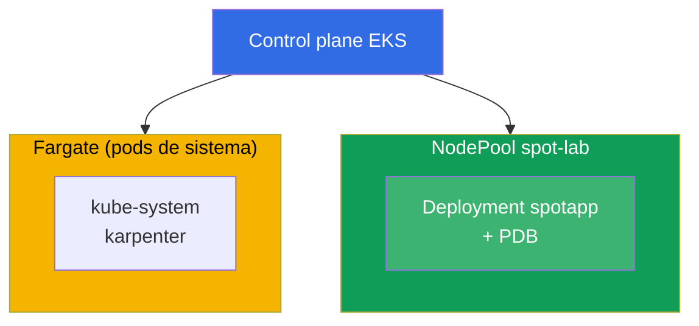
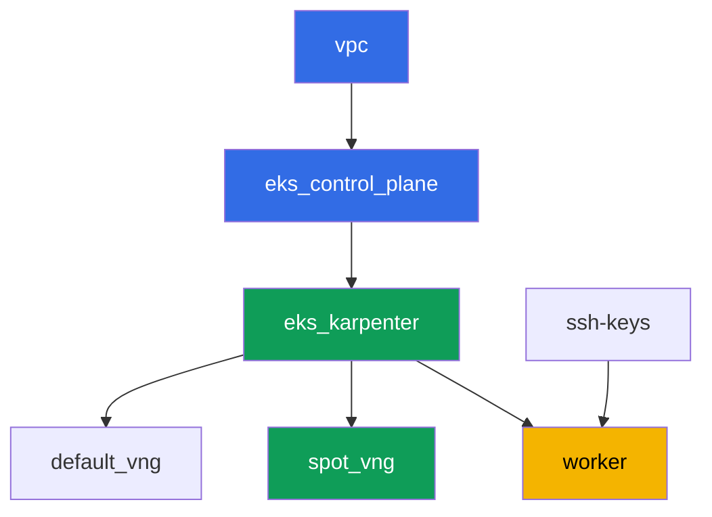

[Русская версия](README_RU.MD) · [Eng version](README.MD) · [Version française](README_FR.MD) · [Deutsche Version](README_DE.MD) · [ქართული ვერსია](README_GE.MD) · [繁體中文版](README_TW.MD) · [日本語版](README_JP.MD)

# Lab 111 - Nodos spot: diversificación, gestión de interrupciones, graceful drain

## Descripción

Practicamos la operación de capacidad spot en EKS: por qué un conjunto homogéneo de tipos
de instancia en una sola zona es un riesgo de perder todo el pool de golpe, cómo Karpenter
ofrece diversificación mediante `requirements`, qué protege realmente un PDB durante una
expulsión voluntaria, y dónde está la línea entre un drain voluntario y una reclamación
forzada del spot por parte de AWS mismo.

Las tareas están escritas en estilo de producción: un enunciado breve más criterios de
aceptación. La verificación es automática, mediante el comando `check_result`.

## Objetivo

Reforzar el material del siguiente capítulo del curso:

- [Capítulo 13. Instancias spot: interrupciones, diversificación](../../course/13/ru.md) -
  gestión de eventos

## Qué vamos a crear

El clúster ya está desplegado como código (base - igual que en la lab 101), con un segundo
NodePool para carga de trabajo spot con un taint añadido encima. Creas un deployment que
puede vivir en este pool y compruebas la protección del PDB durante una expulsión.

| Objeto | Qué es | Para qué sirve en este laboratorio |
|--------|---------|-------------------|
| NodePool `spot-lab` | segundo NodePool de Karpenter, solo `spot`, taint `dedicated=spot-lab` | un pool spot limpio y diversificado entre categorías c/m/r |
| Namespace `eks-111` | una sección del clúster para la carga del laboratorio | mantiene los recursos separados de los de sistema |
| Deployment `spotapp` (4 réplicas) | aplicación ping_pong con una toleration, `terminationGracePeriodSeconds: 60`, `preStop` | carga de trabajo lista para una interrupción spot (capítulo 13) |
| Artefactos `nodes.txt`, `nodepool.txt` | una instantánea de nodos y los requirements del NodePool | confirman capacity-type=spot y la diversificación de tipos |
| PodDisruptionBudget `spotapp-pdb` | `minAvailable: 3` de 4 réplicas | protección contra una expulsión voluntaria excesiva |
| Artefacto `drain.txt` | el síntoma de drain bloqueado por PDB y una explicación | frontera de responsabilidad: PDB frente a una reclamación forzada |
| Artefacto `interruption.txt` | confirmación de que Karpenter gestiona las interrupciones | Karpenter reacciona a las interrupciones por sí mismo mediante una cola |

Imagen final del clúster:



## Infraestructura

El entorno se despliega en AWS (`eu-central-1`) mediante Terragrunt. Cada carpeta del
laboratorio es un componente con su propio `terragrunt.hcl`, que hace referencia a un
módulo compartido en `terraform/modules/` y declara sus dependencias mediante bloques
`dependency`. Terragrunt construye el grafo de dependencias y aplica los componentes en el
orden correcto.

### Módulos y dependencias

| Carpeta (componente) | Módulo (`terraform/modules/`) | Depende de | Qué crea |
|---------------------|-------------------------------|------------|-------------|
| `vpc` | `vpc_v3` | - | VPC `10.10.0.0/16`, subredes públicas y privadas en dos AZ, NAT |
| `ssh-keys` | `ssh-keys` | - | un par de claves SSH para la máquina de trabajo y los nodos |
| `eks_control_plane` | `eks_v2_control_plane` | `vpc` | control plane de EKS `1.36`, OIDC, security groups |
| `eks_fargate_system` | `eks_v2_fargate` | `vpc`, `eks_control_plane` | perfil de Fargate para `kube-system` y `karpenter` |
| `eks_addons` | `eks_v2_addons` | `eks_control_plane`, `eks_fargate_system` | add-ons coredns, kube-proxy, vpc-cni, pod-identity |
| `eks_karpenter` | `eks_v2_karpenter` | `vpc`, `eks_control_plane`, `eks_addons`, `eks_fargate_system` | controlador de Karpenter, rol IAM de los nodos, cola de interrupciones |
| `eks_karpenter_default_vng` | `eks_v2_karpenter_vng` | `vpc`, `eks_control_plane`, `eks_karpenter` | NodePool por defecto `default` (spot y on-demand) |
| `eks_karpenter_spot_vng` | `eks_v2_karpenter_vng` | `vpc`, `eks_control_plane`, `eks_karpenter` | NodePool `spot-lab`: solo spot, taint, un conjunto amplio de tipos |
| `worker` | `eks_v2_work_pc` | `ssh-keys`, `vpc`, `eks_control_plane`, `eks_karpenter` | máquina de trabajo con kubectl, tests y `check_result` |

Grafo de dependencias (lo que se aplica antes está más abajo en la flecha):



Los componentes `eks_fargate_system` y `eks_addons` no se muestran en el grafo por el
límite de 8 nodos, pero en realidad se sitúan entre `eks_control_plane` y `eks_karpenter`
(ver la tabla anterior).

### Configuración del NodePool `spot-lab`

Los `requirements` clave en `eks_karpenter_spot_vng/terragrunt.hcl`:

| Requirement | Valor | Por qué |
|-------------|----------|-------|
| `karpenter.sh/capacity-type` | `In ["spot"]` | solo spot, el objetivo de la formación es un pool spot limpio |
| `karpenter.k8s.aws/instance-category` | `In ["c", "m", "r"]` | tres familias - diversificación de tipos |
| `karpenter.k8s.aws/instance-generation` | `Gt ["2"]` | no tomar generaciones obsoletas |
| `karpenter.k8s.aws/instance-size` | `In ["medium", "large", "xlarge"]` | un rango de tamaños razonable |
| taint | `dedicated=spot-lab:NoSchedule` | solo los pods con una toleration se ubican en el pool |
| `disruption.consolidationPolicy` | `WhenEmptyOrUnderutilized`, `consolidateAfter: 30s` | consolidación rápida de nodos vacíos |
| `budgets` | `nodes: 33%` | límite en la proporción de nodos interrumpidos al mismo tiempo |

El resto de los parámetros (región, red, versiones, prefijos) se leen desde `env.hcl`,
igual que en la lab 101; no es necesario cambiar su lógica.

## Despliegue

```bash
TASK=111 make run_eks_task
```

El despliegue tarda aproximadamente 15-20 minutos. En la salida, busca la línea con la
conexión SSH a la máquina de trabajo y conéctate a ella. kubectl ya está configurado allí
para el clúster correcto.

Comandos útiles en la máquina de trabajo:

```bash
time_left       # cuánto tiempo queda del entorno
check_result    # verificar la solución
```

> Seguridad del entorno. En `env.hcl` están activados `ssh_password_enable = true` y
> `access_cidrs = ["0.0.0.0/0"]` - cómodo para un entorno de formación, pero no es algo que
> se deba hacer en producción. Según los estándares del curso (capítulos 0.2, 2, 19), el
> acceso a las máquinas de trabajo se abre mediante AWS SSM Session Manager sin puertos SSH
> públicos hacia el exterior, y `access_cidrs` se restringe a direcciones concretas. Aquí se
> deja SSH público solo para simplificar el arranque.

## Tareas

---
|        **1**        | **Namespace para la carga del laboratorio**                             |
| :-----------------: | :---------------------------------------------------------- |
| Qué hacemos          | Crea un namespace llamado `eks-111`. Todos los objetos del laboratorio se crean dentro de él. |
| Criterios de aceptación    | - el namespace `eks-111` existe. |
---
|        **2**        | **Un deployment listo para una interrupción spot**                   |
| :-----------------: | :---------------------------------------------------------- |
| Qué hacemos          | En el namespace `eks-111`, crea el Deployment `spotapp`, imagen `viktoruj/ping_pong:latest`, `4` réplicas. El NodePool `spot-lab` está cerrado con el taint `dedicated=spot-lab:NoSchedule`, así que añade la toleration correspondiente al pod. Configura `terminationGracePeriodSeconds: 60` (menor que la ventana de dos minutos de la interrupción spot) y un `preStop` con `sleep 5` para dar tiempo al balanceador a drenar el tráfico. Espera `4` réplicas Ready en nodos etiquetados con `karpenter.sh/capacity-type=spot`. |
| Criterios de aceptación    | - Deployment `spotapp` en `eks-111`, imagen `viktoruj/ping_pong`, `4` réplicas listas;<br/>- una toleration para `dedicated=spot-lab:NoSchedule`;<br/>- `terminationGracePeriodSeconds: 60` y `preStop` están configurados;<br/>- todos los pods de `spotapp` están en nodos con `capacity-type=spot`. |
---
|        **3**        | **Artefacto: nodos spot y diversificación del NodePool**            |
| :-----------------: | :---------------------------------------------------------- |
| Qué hacemos          | Guarda `kubectl get nodes -L karpenter.sh/capacity-type -L karpenter.k8s.aws/instance-category` en el archivo `/var/work/tests/artifacts/3/nodes.txt`. Por separado, guarda los `requirements` del NodePool `spot-lab` (`kubectl get nodepool spot-lab -o yaml`, el fragmento de interés con `instance-category`) en el archivo `/var/work/tests/artifacts/3/nodepool.txt`. Confirma que el/los nodo(s) de `spotapp` son `spot`, y que el NodePool ofrece diversificación (tres categorías de instancia `c`, `m`, `r`). |
| Criterios de aceptación    | - el archivo `nodes.txt` no está vacío y contiene una entrada `spot`;<br/>- el archivo `nodepool.txt` no está vacío y contiene las categorías `c`, `m`, `r`. |
---
|        **4**        | **PodDisruptionBudget en `spotapp`**                        |
| :-----------------: | :---------------------------------------------------------- |
| Qué hacemos          | Crea un `PodDisruptionBudget` llamado `spotapp-pdb` en el namespace `eks-111`: `minAvailable: 3` (de `4` réplicas), selector sobre la etiqueta `app: spotapp`. |
| Criterios de aceptación    | - el objeto `spotapp-pdb` existe en `eks-111`;<br/>- `spec.minAvailable` es igual a `3`;<br/>- el selector apunta a `app: spotapp`. |
---
|        **5**        | **Síntoma: el drain queda bloqueado por PDB, pero no una reclamación forzada** |
| :-----------------: | :---------------------------------------------------------- |
| Qué hacemos          | Elige un nodo con un pod de `spotapp`, ejecuta `kubectl cordon` sobre él e intenta `kubectl drain <node> --ignore-daemonsets --dry-run=client`. Comprueba `kubectl get pdb spotapp-pdb -n eks-111 -o jsonpath='{.status.disruptionsAllowed}'` - con `4` réplicas y `minAvailable: 3` el presupuesto permite expulsar como máximo una réplica a la vez. Guarda una explicación en `/var/work/tests/artifacts/5/drain.txt`: el PDB protege solo la expulsión voluntaria (drain, actualizaciones de nodos, consolidación de Karpenter), no una reclamación forzada de una instancia spot por parte de AWS mismo. El texto debe contener las palabras `PDB` y `добровольн` (o `voluntary`). |
| Criterios de aceptación    | - `spotapp-pdb.status.disruptionsAllowed` no es mayor que `1`;<br/>- el archivo `/var/work/tests/artifacts/5/drain.txt` no está vacío y contiene `PDB` y `добровольн`/`voluntary`. |
---
|        **6**        | **Comprobación de la gestión de interrupciones de Karpenter**                 |
| :-----------------: | :---------------------------------------------------------- |
| Qué hacemos          | Confirma que el mecanismo de gestión de interrupciones spot de Karpenter está configurado: revisa los logs del controlador (`kubectl logs -n karpenter -l app.kubernetes.io/name=karpenter \| grep -i interrupt`). Si no hay permisos para `aws sqs list-queues` - eso es esperado, usa solo `kubectl logs`. Guarda el resultado (eventos, o una explicación de que el mecanismo está configurado mediante una cola de interrupciones) en el archivo `/var/work/tests/artifacts/6/interruption.txt`. |
| Criterios de aceptación    | - el archivo `/var/work/tests/artifacts/6/interruption.txt` no está vacío y contiene la palabra `interrupt`. |
---

## Verificación del resultado

En la máquina de trabajo, ejecuta la verificación automática:

```bash
check_result
```

El script ejecutará los tests y mostrará el porcentaje de tareas completadas.

## Solución

Solución de referencia: [worker/files/solutions/1_ES.MD](worker/files/solutions/1_ES.MD)

## Eliminación del clúster y los recursos

> Antes de eliminar. Karpenter crea los nodos EC2 de los NodePools `default` y `spot-lab`
> directamente a través de la API de EC2 (`NodeClaim`) - no están en el state de terraform.
> Si el control plane se elimina antes de que Karpenter termine correctamente las
> instancias, los nodos quedarán huérfanos: retienen ENI en las subredes privadas, y
> `aws_subnet`/`aws_vpc` se quedarán atascados en `Still destroying...` (el mismo patrón que
> con ALB/NLB en las labs 108-109). Elimina la carga de trabajo y el `NodeClaim`, dejando
> que Karpenter termine las instancias EC2 por sí mismo, ANTES de `terragrunt destroy`:
>
> ```bash
> kubectl delete deployment spotapp -n eks-111 --ignore-not-found
> kubectl delete pdb spotapp-pdb -n eks-111 --ignore-not-found
> kubectl delete nodeclaim --all
> kubectl wait --for=delete nodeclaim --all --timeout=180s
> ```
>
> Comprueba que no queda ningún nodo EC2:
>
> ```bash
> kubectl get nodes   # solo deben quedar nodos fargate-*
> ```
>
> Si el control plane ya está eliminado (Karpenter ya no puede procesar la eliminación),
> encuentra y termina las instancias huérfanas a mano mediante AWS CLI:
>
> ```bash
> CLUSTER=eks111--
> aws ec2 describe-instances --filters "Name=tag:eks:eks-cluster-name,Values=${CLUSTER}" \
>   "Name=instance-state-name,Values=running,pending" \
>   --query 'Reservations[].Instances[].InstanceId' --output text | \
>   xargs -r aws ec2 terminate-instances --instance-ids
> ```

```bash
TASK=111 make delete_eks_task
```
