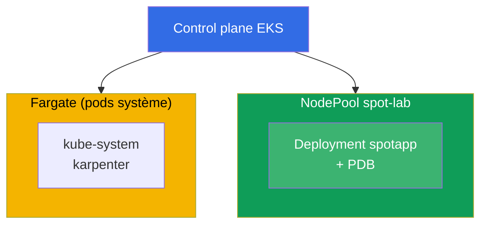
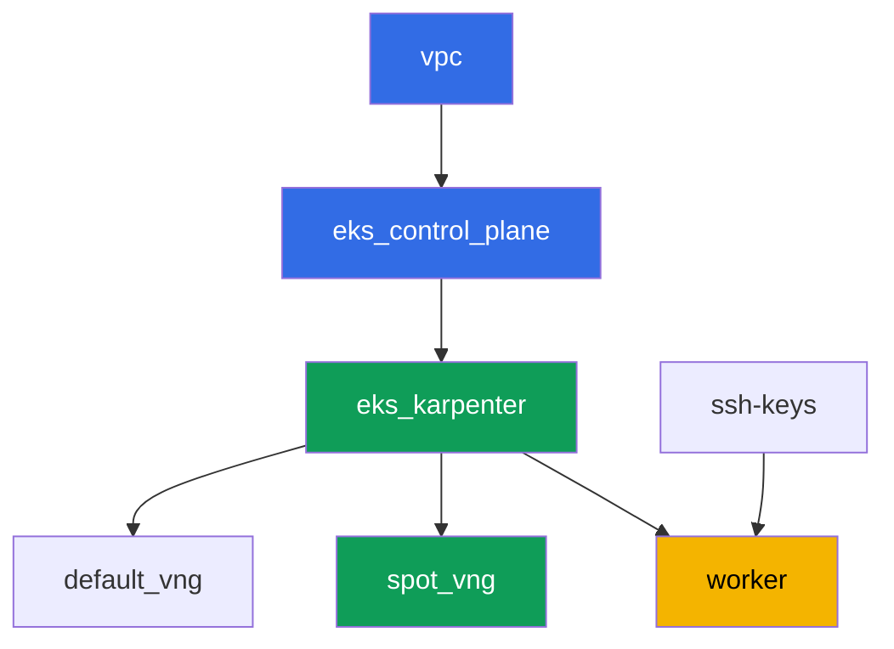

[Русская версия](README_RU.MD) · [Eng version](README.MD) · [Versión en español](README_ES.MD) · [Deutsche Version](README_DE.MD) · [ქართული ვერსია](README_GE.MD) · [繁體中文版](README_TW.MD) · [日本語版](README_JP.MD)

# Lab 111 - Spot nodes : diversification, gestion des interruptions, graceful drain

## Description

Nous mettons en pratique l'exploitation de la capacité spot dans EKS : pourquoi un
ensemble homogène de types d'instances dans une seule zone est un risque de perdre tout le
pool à la fois, comment Karpenter assure la diversification via `requirements`, ce qu'un
PDB protège réellement pendant une éviction voluntaire, et où passe la frontière entre un
drain volontaire et une reprise forcée du spot par AWS lui-même.

Les tâches sont écrites dans un style de production : un énoncé court plus des critères
d'acceptation. La vérification est automatique, via la commande `check_result`.

## Objectif

Consolider le contenu du chapitre suivant du cours :

- [Chapitre 13. Instances spot : interruptions, diversification](../../course/13/ru.md) -
  gestion des événements

## Ce que nous créons

Le cluster est déjà déployé en tant que code (base - identique au laboratoire 101), avec un
second NodePool pour la charge de travail spot, doté d'un taint en plus. Vous créez un
deployment capable de vivre sur ce pool et vérifiez la protection du PDB pendant l'éviction.

| Objet | Ce que c'est | Pourquoi dans ce laboratoire |
|--------|---------|-------------------|
| NodePool `spot-lab` | second NodePool Karpenter, `spot` uniquement, taint `dedicated=spot-lab` | un pool spot propre diversifié entre les catégories c/m/r |
| Namespace `eks-111` | une section du cluster pour la charge du laboratoire | garde les ressources séparées de celles du système |
| Deployment `spotapp` (4 réplicas) | application ping_pong avec une toleration, `terminationGracePeriodSeconds: 60`, `preStop` | charge de travail prête pour une interruption spot (chapitre 13) |
| Artefacts `nodes.txt`, `nodepool.txt` | un instantané des nœuds et les requirements du NodePool | confirment capacity-type=spot et la diversification des types |
| PodDisruptionBudget `spotapp-pdb` | `minAvailable: 3` sur 4 réplicas | protection contre une éviction volontaire excessive |
| Artefact `drain.txt` | le symptôme du drain bloqué par le PDB et une explication | frontière de responsabilité : PDB contre une reprise forcée |
| Artefact `interruption.txt` | confirmation que Karpenter gère les interruptions | Karpenter réagit lui-même aux interruptions via une queue |

Vue finale du cluster :



## Infrastructure

L'environnement est déployé sur AWS (`eu-central-1`) via Terragrunt. Chaque dossier du
laboratoire est un composant avec son propre `terragrunt.hcl`, qui référence un module
partagé dans `terraform/modules/` et déclare ses dépendances via des blocs `dependency`.
Terragrunt construit le graphe de dépendances et applique les composants dans le bon ordre.

### Modules et dépendances

| Dossier (composant) | Module (`terraform/modules/`) | Dépend de | Ce qu'il crée |
|---------------------|-------------------------------|------------|-------------|
| `vpc` | `vpc_v3` | - | VPC `10.10.0.0/16`, sous-réseaux publics et privés dans deux AZ, NAT |
| `ssh-keys` | `ssh-keys` | - | une paire de clés SSH pour la machine de travail et les nœuds |
| `eks_control_plane` | `eks_v2_control_plane` | `vpc` | control plane EKS `1.36`, OIDC, security groups |
| `eks_fargate_system` | `eks_v2_fargate` | `vpc`, `eks_control_plane` | profil Fargate pour `kube-system` et `karpenter` |
| `eks_addons` | `eks_v2_addons` | `eks_control_plane`, `eks_fargate_system` | add-ons coredns, kube-proxy, vpc-cni, pod-identity |
| `eks_karpenter` | `eks_v2_karpenter` | `vpc`, `eks_control_plane`, `eks_addons`, `eks_fargate_system` | contrôleur Karpenter, rôle IAM des nœuds, queue d'interruption |
| `eks_karpenter_default_vng` | `eks_v2_karpenter_vng` | `vpc`, `eks_control_plane`, `eks_karpenter` | NodePool par défaut `default` (spot et on-demand) |
| `eks_karpenter_spot_vng` | `eks_v2_karpenter_vng` | `vpc`, `eks_control_plane`, `eks_karpenter` | NodePool `spot-lab` : spot uniquement, taint, un large ensemble de types |
| `worker` | `eks_v2_work_pc` | `ssh-keys`, `vpc`, `eks_control_plane`, `eks_karpenter` | machine de travail avec kubectl, tests et `check_result` |

Graphe de dépendances (ce qui est appliqué en premier est plus bas dans la flèche) :



Les composants `eks_fargate_system` et `eks_addons` ne sont pas affichés dans le graphe en
raison de la limite de 8 nœuds, mais se situent en fait entre `eks_control_plane` et
`eks_karpenter` (voir le tableau ci-dessus).

### Réglages du NodePool `spot-lab`

Les `requirements` clés dans `eks_karpenter_spot_vng/terragrunt.hcl` :

| Requirement | Valeur | Pourquoi |
|-------------|----------|-------|
| `karpenter.sh/capacity-type` | `In ["spot"]` | spot uniquement, l'objectif de formation est un pool spot propre |
| `karpenter.k8s.aws/instance-category` | `In ["c", "m", "r"]` | trois familles - diversification des types |
| `karpenter.k8s.aws/instance-generation` | `Gt ["2"]` | ne pas prendre de générations obsolètes |
| `karpenter.k8s.aws/instance-size` | `In ["medium", "large", "xlarge"]` | une plage de tailles raisonnable |
| taint | `dedicated=spot-lab:NoSchedule` | seuls les pods avec une toleration atterrissent sur le pool |
| `disruption.consolidationPolicy` | `WhenEmptyOrUnderutilized`, `consolidateAfter: 30s` | consolidation rapide des nœuds vides |
| `budgets` | `nodes: 33%` | limite sur la part des nœuds perturbés en même temps |

Le reste des paramètres (région, réseau, versions, préfixes) est lu depuis `env.hcl`,
comme dans le laboratoire 101 ; il n'y a pas besoin de changer leur logique.

## Déploiement

```bash
TASK=111 make run_eks_task
```

Le déploiement prend environ 15 à 20 minutes. Dans la sortie, repérez la ligne avec la
connexion SSH vers la machine de travail et connectez-vous. kubectl y est déjà configuré
pour le bon cluster.

Commandes utiles sur la machine de travail :

```bash
time_left       # temps restant de l'environnement
check_result    # vérifier la solution
```

> Sécurité du banc de test. Dans `env.hcl`, `ssh_password_enable = true` et
> `access_cidrs = ["0.0.0.0/0"]` sont activés - pratique pour un environnement de formation,
> mais à ne pas faire en production. Selon les standards du cours (chapitres 0.2, 2, 19),
> l'accès aux machines de travail devrait passer par AWS SSM Session Manager sans exposer
> de ports SSH publics, et `access_cidrs` devrait être restreint à des adresses précises.
> Ici, le SSH public est laissé uniquement pour simplifier le démarrage.

## Tâches

---
|        **1**        | **Namespace pour la charge du laboratoire**                             |
| :-----------------: | :---------------------------------------------------------- |
| Ce qu'on fait          | Créez un namespace nommé `eks-111`. Tous les objets du laboratoire sont créés à l'intérieur. |
| Critères d'acceptation    | - le namespace `eks-111` existe. |
---
|        **2**        | **Un deployment prêt pour une interruption spot**                   |
| :-----------------: | :---------------------------------------------------------- |
| Ce qu'on fait          | Dans le namespace `eks-111`, créez le Deployment `spotapp`, image `viktoruj/ping_pong:latest`, `4` réplicas. Le NodePool `spot-lab` est fermé par le taint `dedicated=spot-lab:NoSchedule`, ajoutez donc la toleration correspondante au pod. Définissez `terminationGracePeriodSeconds: 60` (inférieur à la fenêtre d'interruption spot de deux minutes) et un `preStop` avec `sleep 5` pour laisser le load balancer le temps de drainer le trafic. Attendez `4` réplicas Ready sur des nœuds étiquetés `karpenter.sh/capacity-type=spot`. |
| Critères d'acceptation    | - Deployment `spotapp` dans `eks-111`, image `viktoruj/ping_pong`, `4` réplicas prêts ;<br/>- une toleration pour `dedicated=spot-lab:NoSchedule` ;<br/>- `terminationGracePeriodSeconds: 60` et `preStop` sont définis ;<br/>- tous les pods `spotapp` sont sur des nœuds avec `capacity-type=spot`. |
---
|        **3**        | **Artefact : nœuds spot et diversification du NodePool**            |
| :-----------------: | :---------------------------------------------------------- |
| Ce qu'on fait          | Enregistrez `kubectl get nodes -L karpenter.sh/capacity-type -L karpenter.k8s.aws/instance-category` dans le fichier `/var/work/tests/artifacts/3/nodes.txt`. Séparément, enregistrez les `requirements` du NodePool `spot-lab` (`kubectl get nodepool spot-lab -o yaml`, le fragment concerné avec `instance-category`) dans le fichier `/var/work/tests/artifacts/3/nodepool.txt`. Confirmez que le(s) nœud(s) `spotapp` sont `spot`, et que le NodePool assure la diversification (trois catégories d'instances `c`, `m`, `r`). |
| Critères d'acceptation    | - le fichier `nodes.txt` n'est pas vide et contient une entrée `spot` ;<br/>- le fichier `nodepool.txt` n'est pas vide et contient les catégories `c`, `m`, `r`. |
---
|        **4**        | **PodDisruptionBudget sur `spotapp`**                        |
| :-----------------: | :---------------------------------------------------------- |
| Ce qu'on fait          | Créez un `PodDisruptionBudget` nommé `spotapp-pdb` dans le namespace `eks-111` : `minAvailable: 3` (sur `4` réplicas), sélecteur sur le label `app: spotapp`. |
| Critères d'acceptation    | - l'objet `spotapp-pdb` existe dans `eks-111` ;<br/>- `spec.minAvailable` est égal à `3` ;<br/>- le sélecteur cible `app: spotapp`. |
---
|        **5**        | **Symptôme : le drain est bloqué par le PDB, mais pas une reprise forcée** |
| :-----------------: | :---------------------------------------------------------- |
| Ce qu'on fait          | Choisissez un nœud avec un pod `spotapp`, exécutez `kubectl cordon` sur celui-ci et essayez `kubectl drain <node> --ignore-daemonsets --dry-run=client`. Vérifiez `kubectl get pdb spotapp-pdb -n eks-111 -o jsonpath='{.status.disruptionsAllowed}'` - avec `4` réplicas et `minAvailable: 3`, le budget permet d'évincer au plus une réplique à la fois. Enregistrez une explication dans `/var/work/tests/artifacts/5/drain.txt` : le PDB protège uniquement l'éviction volontaire (drain, mises à niveau des nœuds, consolidation Karpenter), pas une reprise forcée d'une instance spot par AWS lui-même. Le texte doit contenir les mots `PDB` et `voluntary`. |
| Critères d'acceptation    | - `spotapp-pdb.status.disruptionsAllowed` n'est pas supérieur à `1` ;<br/>- le fichier `/var/work/tests/artifacts/5/drain.txt` n'est pas vide et contient `PDB` et `voluntary`. |
---
|        **6**        | **Vérification de la gestion des interruptions par Karpenter**                 |
| :-----------------: | :---------------------------------------------------------- |
| Ce qu'on fait          | Confirmez que le mécanisme de gestion des interruptions spot de Karpenter est configuré : regardez les logs du contrôleur (`kubectl logs -n karpenter -l app.kubernetes.io/name=karpenter \| grep -i interrupt`). S'il n'y a pas de permissions pour `aws sqs list-queues` - c'est attendu, utilisez uniquement `kubectl logs`. Enregistrez le résultat (événements, ou une explication indiquant que le mécanisme est configuré via une queue d'interruption) dans le fichier `/var/work/tests/artifacts/6/interruption.txt`. |
| Critères d'acceptation    | - le fichier `/var/work/tests/artifacts/6/interruption.txt` n'est pas vide et contient le mot `interrupt`. |
---

## Vérification du résultat

Sur la machine de travail, lancez la vérification automatique :

```bash
check_result
```

Le script exécutera les tests et affichera le pourcentage de tâches accomplies.

## Solution

Solution de référence : [worker/files/solutions/1_FR.MD](worker/files/solutions/1_FR.MD)

## Suppression du cluster et des ressources

> Avant de supprimer. Karpenter crée les nœuds EC2 des NodePools `default` et `spot-lab`
> directement via l'API EC2 (`NodeClaim`) - ils ne figurent pas dans le state terraform. Si
> le control plane est supprimé avant que Karpenter ait correctement terminé les instances,
> les nœuds resteront orphelins : ils retiennent des ENI dans les sous-réseaux privés, et
> `aws_subnet`/`aws_vpc` resteront bloqués sur `Still destroying...` (le même schéma qu'avec
> ALB/NLB dans les laboratoires 108-109). Supprimez la charge de travail et les
> `NodeClaim`, en laissant Karpenter terminer lui-même les instances EC2, AVANT
> `terragrunt destroy` :
>
> ```bash
> kubectl delete deployment spotapp -n eks-111 --ignore-not-found
> kubectl delete pdb spotapp-pdb -n eks-111 --ignore-not-found
> kubectl delete nodeclaim --all
> kubectl wait --for=delete nodeclaim --all --timeout=180s
> ```
>
> Vérifiez qu'aucun nœud EC2 ne reste :
>
> ```bash
> kubectl get nodes   # seuls les nœuds fargate-* devraient rester
> ```
>
> Si le control plane est déjà supprimé (Karpenter ne peut plus traiter la suppression),
> trouvez et terminez manuellement les instances orphelines via AWS CLI :
>
> ```bash
> CLUSTER=eks111--
> aws ec2 describe-instances --filters "Name=tag:eks:eks-cluster-name,Values=${CLUSTER}" \
>   "Name=instance-state-name,Values=running,pending" \
>   --query 'Reservations[].Instances[].InstanceId' --output text | \
>   xargs -r aws ec2 terminate-instances --instance-ids
> ```

```bash
TASK=111 make delete_eks_task
```
