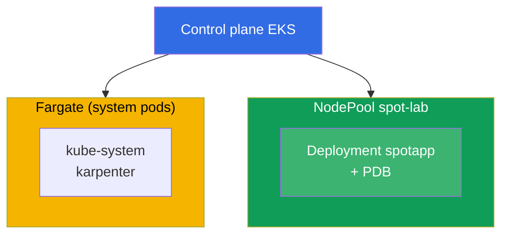
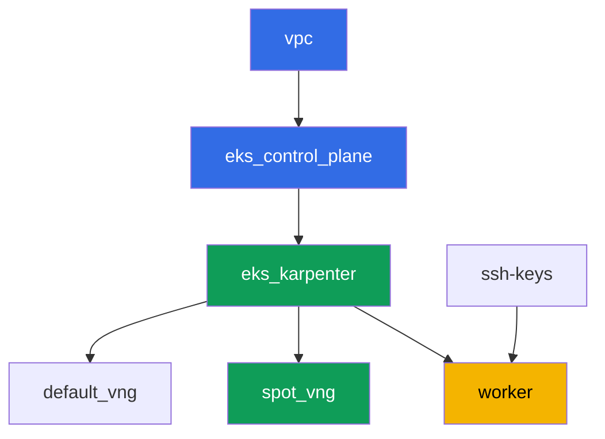

[Русская версия](README_RU.MD) · [Eng version](README.MD) · [Versión en español](README_ES.MD) · [Version française](README_FR.MD) · [Deutsche Version](README_DE.MD) · [繁體中文版](README_TW.MD) · [日本語版](README_JP.MD)

# ლაბა 111 - Spot-ნოუდები: დივერსიფიკაცია, წყვეტის დამუშავება, graceful drain

## აღწერა

ვვარჯიშობთ EKS-ში spot-ტევადობის მართვაზე: რატომ არის ერთგვაროვანი instance-ტიპების
ნაკრები ერთ zone-ში რისკი, რომ ერთბაშად დავკარგოთ მთელი პული, როგორ ანხორციელებს
Karpenter დივერსიფიკაციას `requirements`-ის მეშვეობით, რას იცავს რეალურად PDB
voluntary evict-ის დროს, და სად გაივლის საზღვარი voluntary drain-სა და AWS-ის მიერ
თავად spot-ის ფორსირებულ ჩამორთმევას შორის.

დავალებები დაწერილია production-სტილში: მოკლე დავალება პლუს მიღების კრიტერიუმები.
შემოწმება ავტომატურია, ბრძანებით `check_result`.

## მიზანი

გავამყაროთ კურსის შემდეგი თავის მასალა:

- [თავი 13. Spot instances: წყვეტები, დივერსიფიკაცია](../../course/13/ru.md) -
  event-ების დამუშავება

## რას ვქმნით

კლასტერი უკვე დეპლოირებულია როგორც კოდი (ბაზა - ისეთივე, როგორც 101-ე ლაბაში), მეორე
NodePool-ით spot-დატვირთვისთვის, ზემოდან დამატებული taint-ით. თქვენ ქმნით deployment-ს,
რომელს შეუძლია ცხოვრება ამ პულზე, და ამოწმებთ PDB-ის დაცვას eviction-ის დროს.

| ობიექტი | რა არის ეს | რისთვის ამ ლაბაში |
|--------|---------|-------------------|
| NodePool `spot-lab` | მეორე Karpenter NodePool, მხოლოდ `spot`, taint `dedicated=spot-lab` | სუფთა spot-პული, დივერსიფიცირებული c/m/r კატეგორიებზე |
| Namespace `eks-111` | კლასტერის სექცია ლაბის დატვირთვისთვის | ინახავს რესურსებს განცალკევებულად სისტემურებისგან |
| Deployment `spotapp` (4 რეპლიკა) | ping_pong აპლიკაცია toleration-ით, `terminationGracePeriodSeconds: 60`, `preStop` | დატვირთვა, მზადყოფნაში spot-წყვეტისთვის (თავი 13) |
| არტეფაქტები `nodes.txt`, `nodepool.txt` | ნოუდების ჩანაწერი და NodePool-ის requirements | ადასტურებენ capacity-type=spot-ს და ტიპების დივერსიფიკაციას |
| PodDisruptionBudget `spotapp-pdb` | `minAvailable: 3` 4 რეპლიკიდან | დაცვა ჭარბი voluntary eviction-ისგან |
| არტეფაქტი `drain.txt` | drain-ის PDB-ის მიერ დაბლოკვის სიმპტომი და განმარტება | პასუხისმგებლობის საზღვარი: PDB vs. ფორსირებული ჩამორთმევა |
| არტეფაქტი `interruption.txt` | დადასტურება, რომ Karpenter-ი ამუშავებს წყვეტებს | Karpenter თავად რეაგირებს წყვეტებზე queue-ის მეშვეობით |

კლასტერის საბოლოო სურათი:



## ინფრასტრუქტურა

გარემო დეპლოირდება AWS-ში (`eu-central-1`) Terragrunt-ის მეშვეობით. ლაბის ყოველი
დირექტორია ერთი კომპონენტია საკუთარი `terragrunt.hcl`-ით, რომელიც მიმართავს საერთო
მოდულს `terraform/modules/`-ში და აცხადებს დამოკიდებულებებს `dependency` ბლოკებით.
Terragrunt აწყობს დამოკიდებულებების გრაფს და აპლიცირებს კომპონენტებს სწორი
თანმიმდევრობით.

### მოდულები და დამოკიდებულებები

| დირექტორია (კომპონენტი) | მოდული (`terraform/modules/`) | დამოკიდებულია | რას ქმნის |
|---------------------|-------------------------------|------------|-------------|
| `vpc` | `vpc_v3` | - | VPC `10.10.0.0/16`, საჯარო და პრივატული ქვექსელები ორ AZ-ში, NAT |
| `ssh-keys` | `ssh-keys` | - | SSH-გასაღებების წყვილი სამუშაო მანქანისა და ნოუდებისთვის |
| `eks_control_plane` | `eks_v2_control_plane` | `vpc` | EKS control plane `1.36`, OIDC, security groups |
| `eks_fargate_system` | `eks_v2_fargate` | `vpc`, `eks_control_plane` | Fargate-პროფილი `kube-system`-ისთვის და `karpenter`-ისთვის |
| `eks_addons` | `eks_v2_addons` | `eks_control_plane`, `eks_fargate_system` | coredns, kube-proxy, vpc-cni, pod-identity add-on-ები |
| `eks_karpenter` | `eks_v2_karpenter` | `vpc`, `eks_control_plane`, `eks_addons`, `eks_fargate_system` | Karpenter-ის კონტროლერი, ნოუდების IAM-როლი, წყვეტის queue |
| `eks_karpenter_default_vng` | `eks_v2_karpenter_vng` | `vpc`, `eks_control_plane`, `eks_karpenter` | ნაგულისხმევი NodePool `default` (spot და on-demand) |
| `eks_karpenter_spot_vng` | `eks_v2_karpenter_vng` | `vpc`, `eks_control_plane`, `eks_karpenter` | NodePool `spot-lab`: მხოლოდ spot, taint, ტიპების ფართო ნაკრები |
| `worker` | `eks_v2_work_pc` | `ssh-keys`, `vpc`, `eks_control_plane`, `eks_karpenter` | სამუშაო მანქანა kubectl-ით, ტესტებით და `check_result`-ით |

დამოკიდებულებების გრაფი (რაც უფრო ადრე აპლიცირდება, ის ხრიხისკენ ქვემოთაა):



კომპონენტები `eks_fargate_system` და `eks_addons` არ არის ნაჩვენები გრაფში 8-კვანძის
ლიმიტის გამო, მაგრამ სინამდვილეში ისხედან `eks_control_plane`-სა და `eks_karpenter`-ს
შორის (იხილეთ ცხრილი ზემოთ).

### NodePool `spot-lab`-ის პარამეტრები

ძირითადი `requirements` `eks_karpenter_spot_vng/terragrunt.hcl`-ში:

| Requirement | მნიშვნელობა | რატომ |
|-------------|----------|-------|
| `karpenter.sh/capacity-type` | `In ["spot"]` | მხოლოდ spot, სასწავლო მიზანია სუფთა spot-პული |
| `karpenter.k8s.aws/instance-category` | `In ["c", "m", "r"]` | სამი ფამილია - ტიპების დივერსიფიკაცია |
| `karpenter.k8s.aws/instance-generation` | `Gt ["2"]` | არ ავიღოთ მოძველებული თაობები |
| `karpenter.k8s.aws/instance-size` | `In ["medium", "large", "xlarge"]` | ზომების საღი დიაპაზონი |
| taint | `dedicated=spot-lab:NoSchedule` | პულზე ხვდება მხოლოდ toleration-იანი პოდები |
| `disruption.consolidationPolicy` | `WhenEmptyOrUnderutilized`, `consolidateAfter: 30s` | ცარიელი ნოუდების სწრაფი კონსოლიდაცია |
| `budgets` | `nodes: 33%` | ლიმიტი ერთდროულად disrupt-ული ნოუდების წილზე |

დანარჩენი პარამეტრები (რეგიონი, ქსელი, ვერსიები, პრეფიქსები) იკითხება `env.hcl`-იდან,
ისეთივე, როგორც 101-ე ლაბაში; მათი ლოგიკის შეცვლა საჭირო არაა.

## განლაგება

```bash
TASK=111 make run_eks_task
```

განლაგება გრძელდება დაახლოებით 15-20 წუთი. output-ში მოძებნეთ ხაზი SSH-შეერთებით
სამუშაო მანქანასთან და დაუკავშირდით მას. kubectl იქ უკვე კონფიგურირებულია საჭირო
კლასტერზე.

სასარგებლო ბრძანებები სამუშაო მანქანაზე:

```bash
time_left       # რამდენი დრო დარჩა გარემოს
check_result    # გადამოწმება
```

> გარემოს უსაფრთხოება. `env.hcl`-ში ჩართულია `ssh_password_enable = true` და
> `access_cidrs = ["0.0.0.0/0"]` - ეს მოსახერხებელია სასწავლო გარემოსთვის, მაგრამ ასე
> არ უნდა გავხადოთ production-ში. კურსის სტანდარტების მიხედვით (თავები 0.2, 2, 19)
> სამუშაო მანქანებზე წვდომა იხსნება AWS SSM Session Manager-ის მეშვეობით, საჯარო
> SSH-პორტების გარეთ გამოტანის გარეშე, ხოლო `access_cidrs` ვიწროვდება კონკრეტულ
> მისამართებზე. აქ საჯარო SSH დარჩენილია მხოლოდ გაშვების გასამარტივებლად.

## დავალებები

---
|        **1**        | **Namespace ლაბის დატვირთვისთვის**                             |
| :-----------------: | :---------------------------------------------------------- |
| რას ვაკეთებთ          | შექმენით namespace სახელით `eks-111`. ლაბის ყველა ობიექტი შექმნილია მის შიგნით. |
| მიღების კრიტერიუმები    | - namespace `eks-111` არსებობს. |
---
|        **2**        | **Deployment, მზადყოფნაში spot-წყვეტისთვის**                   |
| :-----------------: | :---------------------------------------------------------- |
| რას ვაკეთებთ          | Namespace `eks-111`-ში შექმენით Deployment `spotapp`, image `viktoruj/ping_pong:latest`, `4` რეპლიკა. NodePool `spot-lab` დაცულია taint-ით `dedicated=spot-lab:NoSchedule`, ამიტომ დაუმატეთ პოდს შესატყვისი toleration. დააყენეთ `terminationGracePeriodSeconds: 60` (ორწუთიან spot-წყვეტის ფანჯარაზე ნაკლები) და `preStop` `sleep 5`-ით, რომ ბალანსერს დროზე მოასწროს ტრაფიკის გადმოტანა. დაელოდეთ `4` Ready რეპლიკას ნოუდებზე, დანიშნულ ლეიბლით `karpenter.sh/capacity-type=spot`. |
| მიღების კრიტერიუმები    | - Deployment `spotapp` `eks-111`-ში, image `viktoruj/ping_pong`, `4` მზა რეპლიკა;<br/>- toleration `dedicated=spot-lab:NoSchedule`-სთვის;<br/>- `terminationGracePeriodSeconds: 60` და `preStop` დაყენებული;<br/>- `spotapp`-ის ყველა პოდი ნოუდებზეა `capacity-type=spot`-ით. |
---
|        **3**        | **არტეფაქტი: spot-ნოუდები და NodePool-ის დივერსიფიკაცია**            |
| :-----------------: | :---------------------------------------------------------- |
| რას ვაკეთებთ          | შეინახეთ `kubectl get nodes -L karpenter.sh/capacity-type -L karpenter.k8s.aws/instance-category` ფაილში `/var/work/tests/artifacts/3/nodes.txt`. ცალკე შეინახეთ NodePool `spot-lab`-ის `requirements` (`kubectl get nodepool spot-lab -o yaml`, საინტერესო ფრაგმენტი `instance-category`-ით) ფაილში `/var/work/tests/artifacts/3/nodepool.txt`. დაადასტურეთ, რომ `spotapp`-ის ნოუდ(ებ)ი არის `spot`, და რომ NodePool უზრუნველყოფს დივერსიფიკაციას (სამი instance-კატეგორია `c`, `m`, `r`). |
| მიღების კრიტერიუმები    | - ფაილი `nodes.txt` არ არის ცარიელი და შეიცავს ჩანაწერს `spot`;<br/>- ფაილი `nodepool.txt` არ არის ცარიელი და შეიცავს კატეგორიებს `c`, `m`, `r`. |
---
|        **4**        | **PodDisruptionBudget `spotapp`-ზე**                        |
| :-----------------: | :---------------------------------------------------------- |
| რას ვაკეთებთ          | შექმენით `PodDisruptionBudget` სახელით `spotapp-pdb` namespace `eks-111`-ში: `minAvailable: 3` (`4` რეპლიკიდან), სელექტორი ლეიბლზე `app: spotapp`. |
| მიღების კრიტერიუმები    | - ობიექტი `spotapp-pdb` არსებობს `eks-111`-ში;<br/>- `spec.minAvailable` ტოლია `3`-ის;<br/>- სელექტორი მიმართულია `app: spotapp`-ზე. |
---
|        **5**        | **სიმპტომი: drain ბლოკირდება PDB-ის მიერ, მაგრამ ეს არ არის ფორსირებული ჩამორთმევა** |
| :-----------------: | :---------------------------------------------------------- |
| რას ვაკეთებთ          | აარჩიეთ ნოუდი `spotapp`-ის პოდით, გაუშვით მასზე `kubectl cordon` და მოსინჯეთ `kubectl drain <node> --ignore-daemonsets --dry-run=client`. შეამოწმეთ `kubectl get pdb spotapp-pdb -n eks-111 -o jsonpath='{.status.disruptionsAllowed}'` - `4` რეპლიკითა და `minAvailable: 3`-ით ბიუჯეტი უშვებს ერთდროულად არაუმეტეს ერთი რეპლიკის evict-ს. შეინახეთ განმარტება `/var/work/tests/artifacts/5/drain.txt`-ში: PDB იცავს მხოლოდ voluntary eviction-ს (drain, ნოუდების განახლება, Karpenter-ის კონსოლიდაცია), არა AWS-ის მიერ თავად spot-instance-ის ფორსირებულ ჩამორთმევას. ტექსტი უნდა შეიცავდეს სიტყვებს `PDB` და `voluntary`. |
| მიღების კრიტერიუმები    | - `spotapp-pdb.status.disruptionsAllowed` არაუმეტეს `1`-ისა;<br/>- ფაილი `/var/work/tests/artifacts/5/drain.txt` არ არის ცარიელი და შეიცავს `PDB`-ს და `voluntary`-ს. |
---
|        **6**        | **Karpenter-ის წყვეტების დამუშავების შემოწმება**                 |
| :-----------------: | :---------------------------------------------------------- |
| რას ვაკეთებთ          | დაადასტურეთ, რომ Karpenter-ის spot-წყვეტის დამუშავების მექანიზმი კონფიგურირებულია: გადახედეთ კონტროლერის ლოგებს (`kubectl logs -n karpenter -l app.kubernetes.io/name=karpenter \| grep -i interrupt`). თუ არ არის უფლება `aws sqs list-queues`-ზე - ეს მოსალოდნელია, გამოიყენეთ მხოლოდ `kubectl logs`. შეინახეთ შედეგი (event-ები, ან განმარტება, რომ მექანიზმი კონფიგურირებულია წყვეტის queue-ის მეშვეობით) ფაილში `/var/work/tests/artifacts/6/interruption.txt`. |
| მიღების კრიტერიუმები    | - ფაილი `/var/work/tests/artifacts/6/interruption.txt` არ არის ცარიელი და შეიცავს სიტყვას `interrupt`. |
---

## შედეგის შემოწმება

სამუშაო მანქანაზე გაუშვით ავტომატური შემოწმება:

```bash
check_result
```

სკრიპტი გაუშვებს ტესტებს და გამოაჩენს შესრულებული დავალებების პროცენტს.

## გადაწყვეტა

ეტალონური გადაწყვეტა: [worker/files/solutions/1_GE.MD](worker/files/solutions/1_GE.MD)

## კლასტერისა და რესურსების წაშლა

> წაშლის წინ. Karpenter ქმნის NodePool `default`-ისა და `spot-lab`-ის EC2-ნოუდებს
> პირდაპირ EC2 API-ის მეშვეობით (`NodeClaim`) - ისინი არ არიან terraform state-ში. თუ
> control plane წაშლილია მანამ, სანამ Karpenter სწორად დაასრულებდა instance-ების
> terminate-ს, ნოუდები დარჩება მიმტოვებული: მათ ეჭირავს ENI-ები პრივატულ ქვექსელებში,
> და `aws_subnet`/`aws_vpc` გაჩერდება `Still destroying...`-ზე (იგივე პატერნი, რაც
> ALB/NLB-ით 108-109 ლაბებში). წაშალეთ დატვირთვა და `NodeClaim`, დაანებეთ Karpenter-ს
> თავად EC2-instance-ების terminate, `terragrunt destroy`-მდე:
>
> ```bash
> kubectl delete deployment spotapp -n eks-111 --ignore-not-found
> kubectl delete pdb spotapp-pdb -n eks-111 --ignore-not-found
> kubectl delete nodeclaim --all
> kubectl wait --for=delete nodeclaim --all --timeout=180s
> ```
>
> შეამოწმეთ, რომ ვერცერთი EC2-ნოუდი არ დარჩა:
>
> ```bash
> kubectl get nodes   # უნდა დარჩეს მხოლოდ fargate-* ნოუდები
> ```
>
> თუ control plane უკვე წაშლილია (Karpenter-ს არ შეუძლია წაშლის დამუშავება), იპოვეთ და
> terminate გაუკეთეთ მიმტოვებულ instance-ებს ხელით AWS CLI-ის მეშვეობით:
>
> ```bash
> CLUSTER=eks111--
> aws ec2 describe-instances --filters "Name=tag:eks:eks-cluster-name,Values=${CLUSTER}" \
>   "Name=instance-state-name,Values=running,pending" \
>   --query 'Reservations[].Instances[].InstanceId' --output text | \
>   xargs -r aws ec2 terminate-instances --instance-ids
> ```

```bash
TASK=111 make delete_eks_task
```
