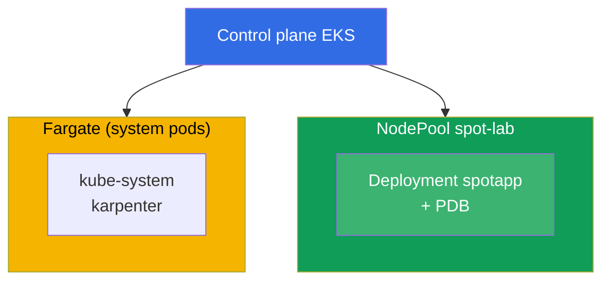
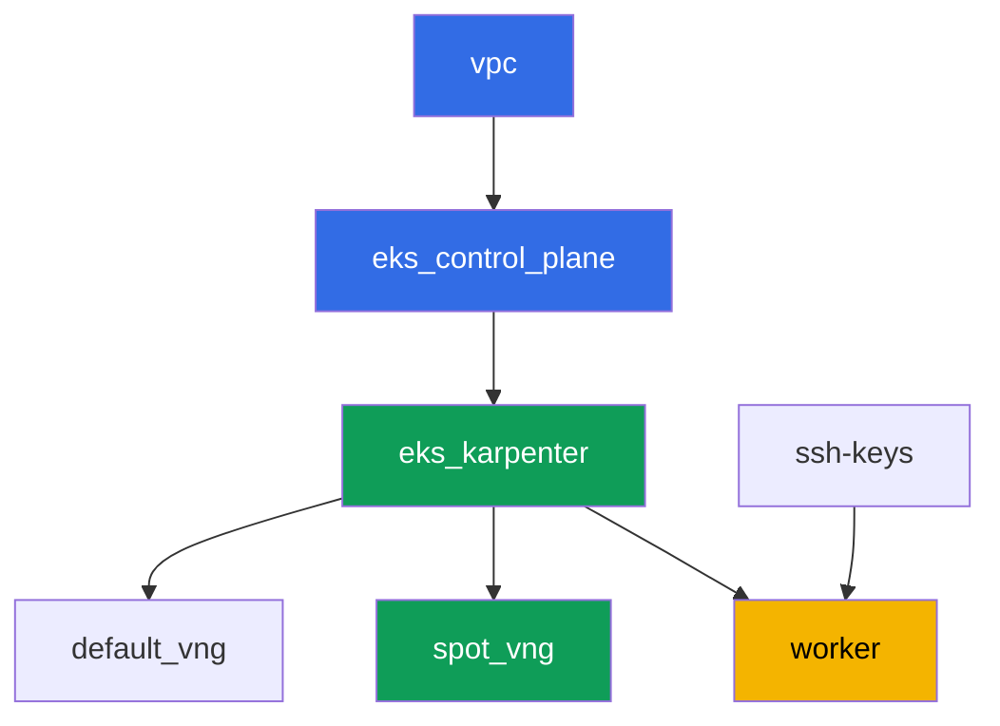

[Русская версия](README_RU.MD) · [Eng version](README.MD) · [Versión en español](README_ES.MD) · [Version française](README_FR.MD) · [Deutsche Version](README_DE.MD) · [ქართული ვერსია](README_GE.MD) · [繁體中文版](README_TW.MD)

# ラボ 111 - Spot ノード:多様化、割り込み処理、graceful drain

## 説明

EKS で spot キャパシティを運用する実践です。単一ゾーンで均質なインスタンスタイプの
集合を使うことがなぜプール全体を一度に失うリスクになるのか、Karpenter が
`requirements` を通じてどのように多様化を提供するのか、PDB が実際に何を保護するのか
(voluntary eviction 中)、そして voluntary drain と AWS 自身による強制的な spot
reclaim との境界線がどこにあるのかを学びます。

タスクは production スタイルで書かれています:短い課題文とアクセプタンス基準。検証は
`check_result` コマンドによって自動的に行われます。

## 目的

コースの以下の章の内容を定着させます:

- [第 13 章。Spot インスタンス:割り込みと多様化](../../course/13/ru.md) -
  イベント処理

## 作成するもの

クラスタは既にコードとしてデプロイされています(ベースはラボ 101 と同じ)。spot
ワークロード用の 2 番目の NodePool に taint が追加されています。あなたはこのプールに
配置できる deployment を作成し、eviction 中の PDB の保護を確認します。

| オブジェクト | 何か | このラボでの目的 |
|--------|---------|-------------------|
| NodePool `spot-lab` | 2 番目の Karpenter NodePool、`spot` のみ、taint `dedicated=spot-lab` | c/m/r カテゴリにまたがる多様化された clean な spot プール |
| Namespace `eks-111` | ラボのワークロード用のクラスタ区画 | システムのリソースと分離する |
| Deployment `spotapp`(4 レプリカ) | toleration、`terminationGracePeriodSeconds: 60`、`preStop` を持つ ping_pong アプリケーション | spot 割り込みに対応済みのワークロード(第 13 章) |
| アーティファクト `nodes.txt`、`nodepool.txt` | ノードのスナップショットと NodePool の requirements | capacity-type=spot とタイプの多様化を確認する |
| PodDisruptionBudget `spotapp-pdb` | 4 レプリカ中 `minAvailable: 3` | 過剰な voluntary eviction に対する保護 |
| アーティファクト `drain.txt` | PDB によって drain がブロックされる症状とその説明 | 責任の境界:PDB 対 強制的な reclaim |
| アーティファクト `interruption.txt` | Karpenter が割り込みを処理していることの確認 | Karpenter はキューを通じて割り込みに自ら反応する |

最終的なクラスタの構成図:



## インフラストラクチャ

環境は Terragrunt によって AWS(`eu-central-1`)にデプロイされます。ラボの各ディレクト
リは 1 つのコンポーネントであり、それぞれ独自の `terragrunt.hcl` を持ち、
`terraform/modules/` の共有モジュールを参照し、`dependency` ブロックで依存関係を宣言
します。Terragrunt は依存関係グラフを構築し、正しい順序でコンポーネントを適用します。

### モジュールと依存関係

| ディレクトリ(コンポーネント) | モジュール(`terraform/modules/`) | 依存先 | 作成されるもの |
|---------------------|-------------------------------|------------|-------------|
| `vpc` | `vpc_v3` | - | VPC `10.10.0.0/16`、2 つの AZ にあるパブリック/プライベートサブネット、NAT |
| `ssh-keys` | `ssh-keys` | - | ワーカーマシンとノード用の SSH キーペア |
| `eks_control_plane` | `eks_v2_control_plane` | `vpc` | EKS control plane `1.36`、OIDC、security group |
| `eks_fargate_system` | `eks_v2_fargate` | `vpc`、`eks_control_plane` | `kube-system` と `karpenter` 用の Fargate profile |
| `eks_addons` | `eks_v2_addons` | `eks_control_plane`、`eks_fargate_system` | coredns、kube-proxy、vpc-cni、pod-identity アドオン |
| `eks_karpenter` | `eks_v2_karpenter` | `vpc`、`eks_control_plane`、`eks_addons`、`eks_fargate_system` | Karpenter コントローラ、ノードの IAM ロール、割り込みキュー |
| `eks_karpenter_default_vng` | `eks_v2_karpenter_vng` | `vpc`、`eks_control_plane`、`eks_karpenter` | デフォルト NodePool `default`(spot と on-demand) |
| `eks_karpenter_spot_vng` | `eks_v2_karpenter_vng` | `vpc`、`eks_control_plane`、`eks_karpenter` | NodePool `spot-lab`:spot のみ、taint、幅広いタイプのセット |
| `worker` | `eks_v2_work_pc` | `ssh-keys`、`vpc`、`eks_control_plane`、`eks_karpenter` | kubectl、テスト、`check_result` を備えたワーカーマシン |

依存関係グラフ(先に適用されるものほど矢印の下側にある):



コンポーネント `eks_fargate_system` と `eks_addons` は、ノード数を 8 個以内に収める
ため上記のグラフには表示されていませんが、実際には `eks_control_plane` と
`eks_karpenter` の間に位置します(上の表を参照)。

### NodePool `spot-lab` の設定

`eks_karpenter_spot_vng/terragrunt.hcl` の主な `requirements`:

| Requirement | 値 | 理由 |
|-------------|----------|-------|
| `karpenter.sh/capacity-type` | `In ["spot"]` | spot のみ、学習目標は clean な spot プール |
| `karpenter.k8s.aws/instance-category` | `In ["c", "m", "r"]` | 3 つのファミリー - タイプの多様化 |
| `karpenter.k8s.aws/instance-generation` | `Gt ["2"]` | 古い世代は使わない |
| `karpenter.k8s.aws/instance-size` | `In ["medium", "large", "xlarge"]` | 妥当なサイズ範囲 |
| taint | `dedicated=spot-lab:NoSchedule` | toleration を持つ Pod だけがこのプールに配置される |
| `disruption.consolidationPolicy` | `WhenEmptyOrUnderutilized`、`consolidateAfter: 30s` | 空のノードの高速な統合 |
| `budgets` | `nodes: 33%` | 同時に disrupt されるノードの割合の上限 |

その他のパラメータ(region、network、versions、prefixes)は `env.hcl` から読み込まれ
ます。ラボ 101 と同様で、そのロジックを変更する必要はありません。

## デプロイ

```bash
TASK=111 make run_eks_task
```

デプロイには約 15-20 分かかります。出力の中からワーカーマシンへの SSH 接続の行を見つけ
て接続してください。そこでは kubectl が既に正しいクラスタ向けに設定されています。

ワーカーマシン上で使える便利なコマンド:

```bash
time_left       # 環境の残り時間
check_result    # 解答の確認
```

> 検証環境のセキュリティについて。`env.hcl` では `ssh_password_enable = true` と
> `access_cidrs = ["0.0.0.0/0"]` が有効になっています。学習用環境としては便利ですが、
> 本番環境ではこのようにしてはいけません。コースの標準(第 0.2、2、19 章)によれば、
> ワーカーマシンへのアクセスは公開 SSH ポートを外に出さずに AWS SSM Session Manager を
> 経由して開き、`access_cidrs` は具体的なアドレスに絞り込みます。ここでは、セットアップ
> を簡単にするためだけに公開 SSH を残しています。

## タスク

---
|        **1**        | **ラボのワークロード用の Namespace**                             |
| :-----------------: | :---------------------------------------------------------- |
| やること          | `eks-111` という名前の namespace を作成してください。ラボのすべてのオブジェクトはこの中に作成されます。 |
| アクセプタンス基準    | - namespace `eks-111` が存在する。 |
---
|        **2**        | **spot 割り込みに対応済みの deployment**                   |
| :-----------------: | :---------------------------------------------------------- |
| やること          | namespace `eks-111` に、Deployment `spotapp` をイメージ `viktoruj/ping_pong:latest`、`4` レプリカで作成してください。NodePool `spot-lab` は taint `dedicated=spot-lab:NoSchedule` で閉じられているため、Pod に対応する toleration を追加してください。spot 割り込みの 2 分間のウィンドウより短い `terminationGracePeriodSeconds: 60` と、ロードバランサーがトラフィックを drain する時間を確保するための `sleep 5` を持つ `preStop` を設定してください。`karpenter.sh/capacity-type=spot` のラベルが付いたノード上で `4` 個の Ready なレプリカを待ってください。 |
| アクセプタンス基準    | - `eks-111` に Deployment `spotapp`、イメージ `viktoruj/ping_pong`、`4` 個の Ready なレプリカ;<br/>- `dedicated=spot-lab:NoSchedule` に対する toleration;<br/>- `terminationGracePeriodSeconds: 60` と `preStop` が設定されている;<br/>- すべての `spotapp` Pod が `capacity-type=spot` のノード上にある。 |
---
|        **3**        | **アーティファクト:spot ノードと NodePool の多様化**            |
| :-----------------: | :---------------------------------------------------------- |
| やること          | `kubectl get nodes -L karpenter.sh/capacity-type -L karpenter.k8s.aws/instance-category` をファイル `/var/work/tests/artifacts/3/nodes.txt` に保存してください。別途、NodePool `spot-lab` の `requirements`(`kubectl get nodepool spot-lab -o yaml`、`instance-category` を含む該当箇所)をファイル `/var/work/tests/artifacts/3/nodepool.txt` に保存してください。`spotapp` のノードが `spot` であること、そして NodePool が多様化(3 つの instance category `c`、`m`、`r`)を提供していることを確認してください。 |
| アクセプタンス基準    | - ファイル `nodes.txt` が空でなく、`spot` というエントリを含む;<br/>- ファイル `nodepool.txt` が空でなく、カテゴリ `c`、`m`、`r` を含む。 |
---
|        **4**        | **`spotapp` に対する PodDisruptionBudget**                        |
| :-----------------: | :---------------------------------------------------------- |
| やること          | namespace `eks-111` に、`spotapp-pdb` という名前の `PodDisruptionBudget` を作成してください:`minAvailable: 3`(`4` レプリカ中)、ラベル `app: spotapp` に対するセレクタ。 |
| アクセプタンス基準    | - `eks-111` にオブジェクト `spotapp-pdb` が存在する;<br/>- `spec.minAvailable` が `3` に等しい;<br/>- セレクタが `app: spotapp` を対象としている。 |
---
|        **5**        | **症状:drain は PDB によってブロックされるが、強制的な reclaim は防げない** |
| :-----------------: | :---------------------------------------------------------- |
| やること          | `spotapp` の Pod があるノードを選び、`kubectl cordon` を実行し、`kubectl drain <node> --ignore-daemonsets --dry-run=client` を試してください。`kubectl get pdb spotapp-pdb -n eks-111 -o jsonpath='{.status.disruptionsAllowed}'` を確認してください - `4` レプリカと `minAvailable: 3` では、この予算は一度に 1 つのレプリカしか eviction を許可しません。`/var/work/tests/artifacts/5/drain.txt` に説明を保存してください:PDB は voluntary eviction(drain、ノードのアップグレード、Karpenter の consolidation)のみを保護し、AWS 自身による spot インスタンスの強制的な reclaim は保護しません。テキストには `PDB` と `voluntary` という単語を含める必要があります。 |
| アクセプタンス基準    | - `spotapp-pdb.status.disruptionsAllowed` が `1` を超えない;<br/>- ファイル `/var/work/tests/artifacts/5/drain.txt` が空でなく、`PDB` と `voluntary` を含む。 |
---
|        **6**        | **Karpenter の割り込み処理の確認**                 |
| :-----------------: | :---------------------------------------------------------- |
| やること          | Karpenter の spot 割り込み処理メカニズムが設定されていることを確認してください:コントローラのログを見てください(`kubectl logs -n karpenter -l app.kubernetes.io/name=karpenter \| grep -i interrupt`)。`aws sqs list-queues` に対する権限がない場合 - それは想定通りです、`kubectl logs` だけを使ってください。結果(イベント、またはメカニズムが割り込みキューを通じて設定されているという説明)をファイル `/var/work/tests/artifacts/6/interruption.txt` に保存してください。 |
| アクセプタンス基準    | - ファイル `/var/work/tests/artifacts/6/interruption.txt` が空でなく、単語 `interrupt` を含む。 |
---

## 結果の確認

ワーカーマシン上で自動チェックを実行してください:

```bash
check_result
```

スクリプトがテストを実行し、完了したタスクの割合を表示します。

## 解答

参考解答:[worker/files/solutions/1_JP.MD](worker/files/solutions/1_JP.MD)

## クラスタとリソースの削除

> 削除の前に。Karpenter は NodePool `default` と `spot-lab` の EC2 ノードを terraform
> ではなく EC2 API(`NodeClaim`)を通じて直接作成します - それらは terraform の state
> の中にはありません。control plane が Karpenter がインスタンスを正しく終了させる前に
> 削除されると、ノードは孤立したまま残ります:プライベートサブネットの ENI を保持し
> 続け、`aws_subnet`/`aws_vpc` は `Still destroying...` のまま止まってしまいます
> (ラボ 108-109 の ALB/NLB と同じパターンです)。`terragrunt destroy` の前に、ワークロード
> と `NodeClaim` を削除し、Karpenter 自身に EC2 インスタンスを終了させてください:
>
> ```bash
> kubectl delete deployment spotapp -n eks-111 --ignore-not-found
> kubectl delete pdb spotapp-pdb -n eks-111 --ignore-not-found
> kubectl delete nodeclaim --all
> kubectl wait --for=delete nodeclaim --all --timeout=180s
> ```
>
> EC2 ノードが残っていないことを確認してください:
>
> ```bash
> kubectl get nodes   # fargate-* ノードだけが残っているはず
> ```
>
> control plane が既に削除されている場合(Karpenter はもう削除を処理できません)、
> AWS CLI で孤立したインスタンスを手動で見つけて終了させてください:
>
> ```bash
> CLUSTER=eks111--
> aws ec2 describe-instances --filters "Name=tag:eks:eks-cluster-name,Values=${CLUSTER}" \
>   "Name=instance-state-name,Values=running,pending" \
>   --query 'Reservations[].Instances[].InstanceId' --output text | \
>   xargs -r aws ec2 terminate-instances --instance-ids
> ```

```bash
TASK=111 make delete_eks_task
```
