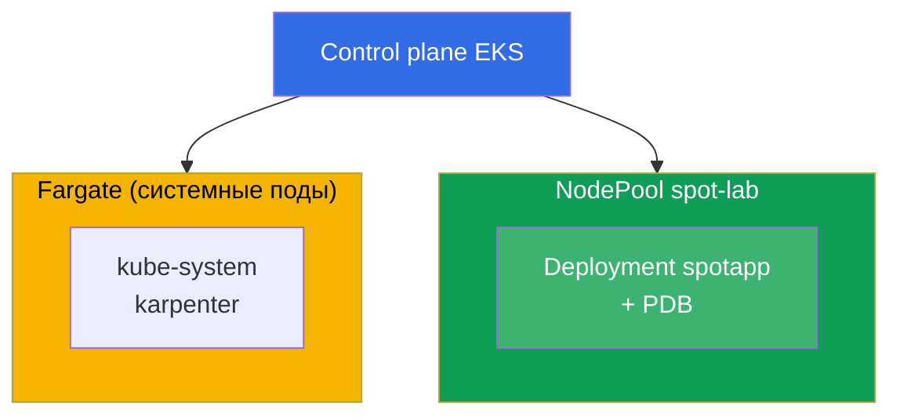
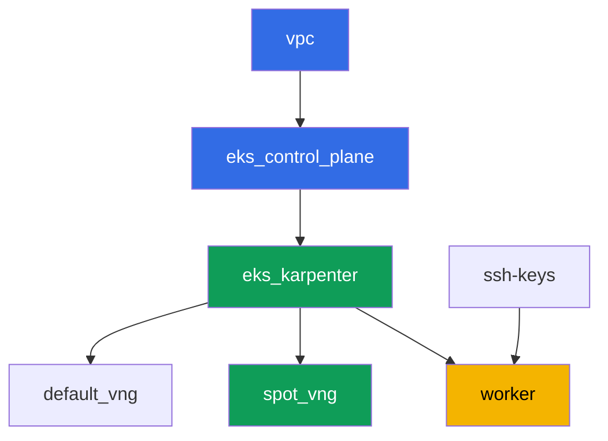

# Лаба 111 - Spot-ноды: диверсификация, обработка прерываний, graceful drain

## Описание

Отрабатываем эксплуатацию spot-ёмкости в EKS: почему однородный набор типов инстансов
в одной зоне - это риск потерять пул разом, как Karpenter даёт диверсификацию через
`requirements`, что реально защищает PDB при добровольном выселении, и где проходит
граница между добровольным дренажем и форсированным изъятием spot самим AWS.

Задания в продакшн-стиле: короткая постановка плюс критерии приёмки. Проверка -
автоматическая, командой `check_result`.

## Цель

Закрепить материал главы курса:

- [Глава 13. Spot-инстансы: прерывания, диверсификация](../../course/13/ru.md) -
  обработка событий

## Что мы создаём

Кластер уже развёрнут как код (база - как в лабе 101), поверх него добавлен второй
NodePool под spot-нагрузку с taint. Вы создаёте deployment, который умеет жить на этом
пуле, и проверяете защиту PDB при выселении.

| Объект | Что это | Зачем в этой лабе |
|--------|---------|-------------------|
| NodePool `spot-lab` | второй Karpenter NodePool, только `spot`, taint `dedicated=spot-lab` | чистый spot-пул с диверсификацией по категориям c/m/r |
| Namespace `eks-111` | раздел кластера под нагрузку лабы | держим ресурсы отдельно от системных |
| Deployment `spotapp` (4 реплики) | приложение ping_pong с toleration, `terminationGracePeriodSeconds: 60`, `preStop` | нагрузка, готовая к spot-прерыванию (глава 13) |
| Артефакт `nodes.txt`, `nodepool.txt` | срез нод и requirements NodePool | подтверждаем capacity-type=spot и диверсификацию типов |
| PodDisruptionBudget `spotapp-pdb` | `minAvailable: 3` из 4 реплик | защита от избыточного добровольного выселения |
| Артефакт `drain.txt` | симптом блокировки drain PDB и объяснение | граница ответственности: PDB против форсированного изъятия |
| Артефакт `interruption.txt` | подтверждение обработки прерываний Karpenter | Karpenter реагирует на прерывания сам через очередь |

Итоговая картина кластера:



## Инфраструктура

Окружение разворачивается в AWS (`eu-central-1`) через Terragrunt. Каждый каталог лабы -
это один компонент со своим `terragrunt.hcl`, который ссылается на общий модуль в
`terraform/modules/` и объявляет зависимости через блоки `dependency`. Terragrunt строит
граф зависимостей и применяет компоненты в правильном порядке.

### Модули и зависимости

| Каталог (компонент) | Модуль (`terraform/modules/`) | Зависит от | Что создаёт |
|---------------------|-------------------------------|------------|-------------|
| `vpc` | `vpc_v3` | - | VPC `10.10.0.0/16`, публичные и приватные подсети в двух AZ, NAT |
| `ssh-keys` | `ssh-keys` | - | пара SSH-ключей для рабочей машины и нод |
| `eks_control_plane` | `eks_v2_control_plane` | `vpc` | control plane EKS `1.36`, OIDC, security groups |
| `eks_fargate_system` | `eks_v2_fargate` | `vpc`, `eks_control_plane` | Fargate-профиль для `kube-system` и `karpenter` |
| `eks_addons` | `eks_v2_addons` | `eks_control_plane`, `eks_fargate_system` | аддоны coredns, kube-proxy, vpc-cni, pod-identity |
| `eks_karpenter` | `eks_v2_karpenter` | `vpc`, `eks_control_plane`, `eks_addons`, `eks_fargate_system` | контроллер Karpenter, IAM-роль нод, очередь прерываний |
| `eks_karpenter_default_vng` | `eks_v2_karpenter_vng` | `vpc`, `eks_control_plane`, `eks_karpenter` | дефолтный NodePool `default` (spot и on-demand) |
| `eks_karpenter_spot_vng` | `eks_v2_karpenter_vng` | `vpc`, `eks_control_plane`, `eks_karpenter` | NodePool `spot-lab`: только spot, taint, широкий набор типов |
| `worker` | `eks_v2_work_pc` | `ssh-keys`, `vpc`, `eks_control_plane`, `eks_karpenter` | рабочая машина с kubectl, тестами и `check_result` |

Граф зависимостей (что применяется раньше, то ниже по стрелке):



Компоненты `eks_fargate_system` и `eks_addons` на графе не показаны ради лимита в 8
узлов, но по факту стоят между `eks_control_plane` и `eks_karpenter` (см. таблицу выше).

### Настройки NodePool `spot-lab`

Ключевые `requirements` в `eks_karpenter_spot_vng/terragrunt.hcl`:

| Requirement | Значение | Зачем |
|-------------|----------|-------|
| `karpenter.sh/capacity-type` | `In ["spot"]` | только spot, учебная цель - чистый spot-пул |
| `karpenter.k8s.aws/instance-category` | `In ["c", "m", "r"]` | три семейства - диверсификация типов |
| `karpenter.k8s.aws/instance-generation` | `Gt ["2"]` | не брать устаревшие поколения |
| `karpenter.k8s.aws/instance-size` | `In ["medium", "large", "xlarge"]` | разумный диапазон размеров |
| taint | `dedicated=spot-lab:NoSchedule` | на пул попадают только поды с toleration |
| `disruption.consolidationPolicy` | `WhenEmptyOrUnderutilized`, `consolidateAfter: 30s` | быстрая консолидация пустых нод |
| `budgets` | `nodes: 33%` | ограничение доли одновременно прерываемых нод |

Остальные параметры (регион, сеть, версии, префиксы) читаются из `env.hcl`, как в
лабе 101; менять их логику не нужно.

## Развёртывание

```bash
TASK=111 make run_eks_task
```

Развёртывание занимает примерно 15-20 минут. В выводе найдите строку с SSH-подключением к
рабочей машине и подключитесь к ней. kubectl там уже настроен на нужный кластер.

Полезные команды на рабочей машине:

```bash
time_left       # сколько осталось времени окружения
check_result    # проверить решение
```

> Безопасность стенда. В `env.hcl` включены `ssh_password_enable = true` и
> `access_cidrs = ["0.0.0.0/0"]` - это удобно для учебного окружения, но так делать в
> продакшене нельзя. По стандартам курса (главы 0.2, 2, 19) доступ к рабочим машинам
> открывают через AWS SSM Session Manager без публичных SSH-портов наружу, а `access_cidrs`
> сужают до конкретных адресов. Здесь публичный SSH оставлен только ради простоты запуска.

## Задания

---
|        **1**        | **Namespace для нагрузки лабы**                             |
| :-----------------: | :---------------------------------------------------------- |
| Что делаем          | Создайте namespace с именем `eks-111`. Все объекты лабы создаются внутри него. |
| Критерии приёмки    | - namespace `eks-111` существует. |
---
|        **2**        | **Deployment, готовый к spot-прерыванию**                   |
| :-----------------: | :---------------------------------------------------------- |
| Что делаем          | В namespace `eks-111` создайте Deployment `spotapp`, образ `viktoruj/ping_pong:latest`, `4` реплики. NodePool `spot-lab` закрыт taint'ом `dedicated=spot-lab:NoSchedule`, поэтому добавьте под соответствующий toleration. Задайте `terminationGracePeriodSeconds: 60` (меньше двухминутного окна spot-прерывания) и `preStop` с `sleep 5`, чтобы дать балансировщику время увести трафик. Дождитесь `4` Ready реплик на нодах с меткой `karpenter.sh/capacity-type=spot`. |
| Критерии приёмки    | - Deployment `spotapp` в `eks-111`, образ `viktoruj/ping_pong`, `4` готовые реплики;<br/>- toleration на `dedicated=spot-lab:NoSchedule`;<br/>- `terminationGracePeriodSeconds: 60` и `preStop` заданы;<br/>- все поды `spotapp` на нодах с `capacity-type=spot`. |
---
|        **3**        | **Артефакт: spot-ноды и диверсификация NodePool**            |
| :-----------------: | :---------------------------------------------------------- |
| Что делаем          | Сохраните `kubectl get nodes -L karpenter.sh/capacity-type -L karpenter.k8s.aws/instance-category` в файл `/var/work/tests/artifacts/3/nodes.txt`. Отдельно сохраните `requirements` NodePool `spot-lab` (`kubectl get nodepool spot-lab -o yaml`, интересующий фрагмент с `instance-category`) в файл `/var/work/tests/artifacts/3/nodepool.txt`. Подтвердите, что нода(ы) `spotapp` - `spot`, и что NodePool даёт диверсификацию (три категории инстансов `c`, `m`, `r`). |
| Критерии приёмки    | - файл `nodes.txt` не пуст и содержит запись `spot`;<br/>- файл `nodepool.txt` не пуст и содержит категории `c`, `m`, `r`. |
---
|        **4**        | **PodDisruptionBudget на `spotapp`**                        |
| :-----------------: | :---------------------------------------------------------- |
| Что делаем          | Создайте `PodDisruptionBudget` с именем `spotapp-pdb` в namespace `eks-111`: `minAvailable: 3` (из `4` реплик), селектор по label `app: spotapp`. |
| Критерии приёмки    | - объект `spotapp-pdb` существует в `eks-111`;<br/>- `spec.minAvailable` равен `3`;<br/>- селектор указывает на `app: spotapp`. |
---
|        **5**        | **Симптом: drain блокируется PDB, но не форсированное изъятие** |
| :-----------------: | :---------------------------------------------------------- |
| Что делаем          | Возьмите ноду с подом `spotapp`, выполните `kubectl cordon` на ней и попробуйте `kubectl drain <node> --ignore-daemonsets --dry-run=client`. Проверьте `kubectl get pdb spotapp-pdb -n eks-111 -o jsonpath='{.status.disruptionsAllowed}'` - при `4` репликах и `minAvailable: 3` бюджет разрешает выселить не больше одной реплики за раз. Сохраните в `/var/work/tests/artifacts/5/drain.txt` объяснение: PDB защищает только добровольное выселение (drain, апгрейд нод, консолидацию Karpenter), а не форсированное изъятие spot-инстанса самим AWS. В тексте должны быть слова `PDB` и `добровольн` (или `voluntary`). |
| Критерии приёмки    | - `spotapp-pdb.status.disruptionsAllowed` не больше `1`;<br/>- файл `/var/work/tests/artifacts/5/drain.txt` не пуст, содержит `PDB` и `добровольн`/`voluntary`. |
---
|        **6**        | **Проверка обработки прерываний Karpenter**                 |
| :-----------------: | :---------------------------------------------------------- |
| Что делаем          | Убедитесь, что механизм обработки spot-прерываний у Karpenter настроен: посмотрите логи контроллера (`kubectl logs -n karpenter -l app.kubernetes.io/name=karpenter \| grep -i interrupt`). Если прав на `aws sqs list-queues` нет - это ожидаемо, используйте только `kubectl logs`. Сохраните результат (события или объяснение, что механизм настроен через очередь прерываний) в файл `/var/work/tests/artifacts/6/interruption.txt`. |
| Критерии приёмки    | - файл `/var/work/tests/artifacts/6/interruption.txt` не пуст и содержит слово `interrupt`. |
---

## Проверка результата

На рабочей машине запустите автоматическую проверку:

```bash
check_result
```

Скрипт прогонит тесты и покажет процент выполненных заданий.

## Решение

Эталонное решение: [worker/files/solutions/1.MD](worker/files/solutions/1.MD)

## Удаление кластера и ресурсов

> Перед удалением. EC2-ноды NodePool `default` и `spot-lab` создаёт Karpenter напрямую
> через EC2 API (`NodeClaim`) - в terraform state их нет. Если удалить control plane
> раньше, чем Karpenter корректно завершит инстансы, ноды останутся осиротевшими: они
> держат ENI в приватных подсетях, и `aws_subnet`/`aws_vpc` зависнут в
> `Still destroying...` (тот же паттерн, что с ALB/NLB в лабах 108-109). Удалите нагрузку
> и `NodeClaim`, дав Karpenter самому терминировать EC2-инстансы, ДО `terragrunt destroy`:
>
> ```bash
> kubectl delete deployment spotapp -n eks-111 --ignore-not-found
> kubectl delete pdb spotapp-pdb -n eks-111 --ignore-not-found
> kubectl delete nodeclaim --all
> kubectl wait --for=delete nodeclaim --all --timeout=180s
> ```
>
> Проверьте, что ни одной EC2-ноды не осталось:
>
> ```bash
> kubectl get nodes   # должны остаться только fargate-* ноды
> ```
>
> Если control plane уже удалён раньше (Karpenter больше не может обработать удаление),
> найдите и завершите осиротевшие инстансы вручную через AWS CLI:
>
> ```bash
> CLUSTER=eks111--
> aws ec2 describe-instances --filters "Name=tag:eks:eks-cluster-name,Values=${CLUSTER}" \
>   "Name=instance-state-name,Values=running,pending" \
>   --query 'Reservations[].Instances[].InstanceId' --output text | \
>   xargs -r aws ec2 terminate-instances --instance-ids
> ```

```bash
TASK=111 make delete_eks_task
```
