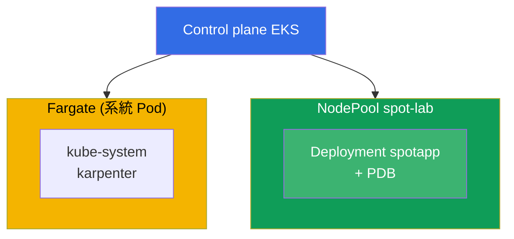
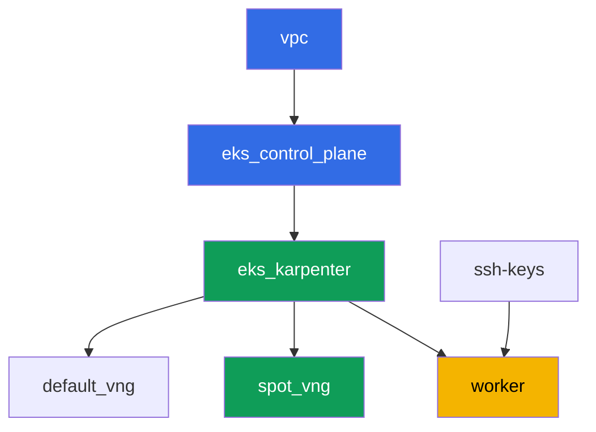

[Русская версия](README_RU.MD) · [Eng version](README.MD) · [Versión en español](README_ES.MD) · [Version française](README_FR.MD) · [Deutsche Version](README_DE.MD) · [ქართული ვერსია](README_GE.MD) · [日本語版](README_JP.MD)

# 實驗 111 - Spot 節點:diversification、中斷處理、graceful drain

## 說明

我們練習在 EKS 中操作 spot 容量:為什麼在單一可用區中使用同質的 instance type 集合是
一次性失去整個資源池的風險,Karpenter 如何透過 `requirements` 提供 diversification,
PDB 在 voluntary eviction 期間實際上保護的是什麼,以及 voluntary drain 與 AWS 自身
強制回收 spot 之間的界線在哪裡。

任務以生產風格編寫:簡短的任務描述加驗收標準。驗證是自動的,透過 `check_result` 命令
完成。

## 目標

鞏固以下課程章節的內容:

- [第 13 章。Spot instance:中斷、diversification](../../course/13/ru.md) - 事件處理

## 我們要創建什麼

集群已經以代碼方式部署完成(基礎部分與實驗 101 相同),並在其之上為 spot 負載額外
建立了第二個帶有 taint 的 NodePool。你要建立一個能夠運行在這個資源池上的 deployment,
並在 eviction 期間檢查 PDB 的保護作用。

| 對象 | 這是什麼 | 在這個實驗中的作用 |
|--------|---------|-------------------|
| NodePool `spot-lab` | 第二個 Karpenter NodePool,僅限 `spot`,附加 taint `dedicated=spot-lab` | 一個跨 c/m/r 類別做 diversification 的乾淨 spot 資源池 |
| Namespace `eks-111` | 供實驗負載使用的集群區域 | 讓資源與系統資源保持隔離 |
| Deployment `spotapp`(4 個副本) | 帶有 toleration、`terminationGracePeriodSeconds: 60`、`preStop` 的 ping_pong 應用程式 | 為 spot 中斷做好準備的負載(第 13 章) |
| 產物 `nodes.txt`、`nodepool.txt` | 節點快照與 NodePool 的 requirements | 確認 capacity-type=spot 以及 type diversification |
| PodDisruptionBudget `spotapp-pdb` | `minAvailable: 3`,共 4 個副本 | 防止過度的 voluntary eviction |
| 產物 `drain.txt` | drain 被 PDB 阻擋的症狀與說明 | 職責邊界:PDB 對比強制回收 |
| 產物 `interruption.txt` | 確認 Karpenter 有處理中斷的機制 | Karpenter 透過佇列自行對中斷做出反應 |

最終的集群圖景:



## 基礎設施

環境透過 Terragrunt 部署在 AWS(`eu-central-1`)。實驗中的每個目錄都是一個組件,擁有
自己的 `terragrunt.hcl`,它引用 `terraform/modules/` 中的共用模組,並透過 `dependency`
區塊聲明依賴關係。Terragrunt 會建立依賴關係圖,並依照正確的順序套用各個組件。

### 模組與依賴關係

| 目錄(組件) | 模組(`terraform/modules/`) | 依賴於 | 創建了什麼 |
|---------------------|-------------------------------|------------|-------------|
| `vpc` | `vpc_v3` | - | VPC `10.10.0.0/16`,兩個 AZ 中的公有與私有子網,NAT |
| `ssh-keys` | `ssh-keys` | - | 供工作機與節點使用的一對 SSH 金鑰 |
| `eks_control_plane` | `eks_v2_control_plane` | `vpc` | EKS control plane `1.36`、OIDC、security group |
| `eks_fargate_system` | `eks_v2_fargate` | `vpc`、`eks_control_plane` | `kube-system` 與 `karpenter` 的 Fargate 配置檔 |
| `eks_addons` | `eks_v2_addons` | `eks_control_plane`、`eks_fargate_system` | coredns、kube-proxy、vpc-cni、pod-identity 附加元件 |
| `eks_karpenter` | `eks_v2_karpenter` | `vpc`、`eks_control_plane`、`eks_addons`、`eks_fargate_system` | Karpenter 控制器、節點 IAM 角色、中斷佇列 |
| `eks_karpenter_default_vng` | `eks_v2_karpenter_vng` | `vpc`、`eks_control_plane`、`eks_karpenter` | 預設 NodePool `default`(spot 與 on-demand) |
| `eks_karpenter_spot_vng` | `eks_v2_karpenter_vng` | `vpc`、`eks_control_plane`、`eks_karpenter` | NodePool `spot-lab`:僅限 spot、附加 taint、涵蓋範圍廣泛的 type 集合 |
| `worker` | `eks_v2_work_pc` | `ssh-keys`、`vpc`、`eks_control_plane`、`eks_karpenter` | 帶有 kubectl、測試腳本和 `check_result` 的工作機 |

依賴關係圖(較早套用的組件位於箭頭下方):



組件 `eks_fargate_system` 與 `eks_addons` 因為節點數量上限為 8 個而沒有顯示在圖中,
但實際上它們位於 `eks_control_plane` 與 `eks_karpenter` 之間(見上方表格)。

### NodePool `spot-lab` 的設定

`eks_karpenter_spot_vng/terragrunt.hcl` 中的關鍵 `requirements`:

| Requirement | 值 | 為什麼 |
|-------------|----------|-------|
| `karpenter.sh/capacity-type` | `In ["spot"]` | 僅限 spot,訓練目標是一個乾淨的 spot 資源池 |
| `karpenter.k8s.aws/instance-category` | `In ["c", "m", "r"]` | 三個系列 - type diversification |
| `karpenter.k8s.aws/instance-generation` | `Gt ["2"]` | 不使用過時的世代 |
| `karpenter.k8s.aws/instance-size` | `In ["medium", "large", "xlarge"]` | 合理的尺寸範圍 |
| taint | `dedicated=spot-lab:NoSchedule` | 只有帶 toleration 的 pod 才會落到這個資源池上 |
| `disruption.consolidationPolicy` | `WhenEmptyOrUnderutilized`、`consolidateAfter: 30s` | 快速整合空節點 |
| `budgets` | `nodes: 33%` | 限制同時被中斷的節點比例 |

其餘的參數(region、網路、版本、前綴)都是從 `env.hcl` 讀取的,與實驗 101 相同,不需要
更改它們的邏輯。

## 部署

```bash
TASK=111 make run_eks_task
```

部署大約需要 15-20 分鐘。在輸出中找到連接工作機的 SSH 那一行並連接上去。kubectl 在那
裡已經配置好指向正確的集群。

工作機上的常用命令:

```bash
time_left       # 環境剩餘的時間
check_result    # 檢查解答
```

> 測試環境的安全性。`env.hcl` 中啟用了 `ssh_password_enable = true` 和
> `access_cidrs = ["0.0.0.0/0"]` - 這對於學習環境很方便,但在生產環境中不應該這樣做。
> 依照課程標準(第 0.2、2、19 章),對工作機的存取應透過 AWS SSM Session Manager 進行,
> 不對外暴露公開的 SSH 端口,並將 `access_cidrs` 限制到具體的位址。這裡保留公開 SSH 只
> 是為了簡化啟動流程。

## 任務

---
|        **1**        | **供實驗負載使用的 Namespace**                             |
| :-----------------: | :---------------------------------------------------------- |
| 我們要做什麼          | 創建一個名為 `eks-111` 的 namespace。實驗中的所有對象都在其中創建。 |
| 驗收標準    | - namespace `eks-111` 存在。 |
---
|        **2**        | **為 spot 中斷做好準備的 deployment**                   |
| :-----------------: | :---------------------------------------------------------- |
| 我們要做什麼          | 在 namespace `eks-111` 中創建 Deployment `spotapp`,映像 `viktoruj/ping_pong:latest`,`4` 個副本。NodePool `spot-lab` 被 taint `dedicated=spot-lab:NoSchedule` 封閉,因此要為 pod 加上對應的 toleration。設定 `terminationGracePeriodSeconds: 60`(小於兩分鐘的 spot 中斷窗口)以及帶有 `sleep 5` 的 `preStop`,讓負載平衡器有時間在停止前把流量引走。等待 `4` 個 Ready 副本落在標籤為 `karpenter.sh/capacity-type=spot` 的節點上。 |
| 驗收標準    | - Deployment `spotapp` 位於 `eks-111`,映像 `viktoruj/ping_pong`,`4` 個就緒副本;<br/>- 帶有針對 `dedicated=spot-lab:NoSchedule` 的 toleration;<br/>- 設定了 `terminationGracePeriodSeconds: 60` 與 `preStop`;<br/>- 所有 `spotapp` pod 都在 `capacity-type=spot` 的節點上。 |
---
|        **3**        | **產物:spot 節點與 NodePool 的 diversification**            |
| :-----------------: | :---------------------------------------------------------- |
| 我們要做什麼          | 將 `kubectl get nodes -L karpenter.sh/capacity-type -L karpenter.k8s.aws/instance-category` 保存到檔案 `/var/work/tests/artifacts/3/nodes.txt`。另外將 NodePool `spot-lab` 的 `requirements`(`kubectl get nodepool spot-lab -o yaml`,取包含 `instance-category` 的片段)保存到檔案 `/var/work/tests/artifacts/3/nodepool.txt`。確認 `spotapp` 所在的節點是 `spot`,並確認 NodePool 提供了 diversification(三個 instance category `c`、`m`、`r`)。 |
| 驗收標準    | - 檔案 `nodes.txt` 不為空,且包含 `spot` 這個條目;<br/>- 檔案 `nodepool.txt` 不為空,且包含 `c`、`m`、`r` 這三個類別。 |
---
|        **4**        | **針對 `spotapp` 的 PodDisruptionBudget**                        |
| :-----------------: | :---------------------------------------------------------- |
| 我們要做什麼          | 在 namespace `eks-111` 中創建一個名為 `spotapp-pdb` 的 `PodDisruptionBudget`:`minAvailable: 3`(共 `4` 個副本),選擇器指向標籤 `app: spotapp`。 |
| 驗收標準    | - 物件 `spotapp-pdb` 存在於 `eks-111`;<br/>- `spec.minAvailable` 等於 `3`;<br/>- 選擇器指向 `app: spotapp`。 |
---
|        **5**        | **症狀:drain 被 PDB 阻擋,但強制回收不會被阻擋** |
| :-----------------: | :---------------------------------------------------------- |
| 我們要做什麼          | 找出一個帶有 `spotapp` pod 的節點,對它執行 `kubectl cordon`,並嘗試 `kubectl drain <node> --ignore-daemonsets --dry-run=client`。查看 `kubectl get pdb spotapp-pdb -n eks-111 -o jsonpath='{.status.disruptionsAllowed}'` - 在 `4` 個副本、`minAvailable: 3` 的情況下,budget 一次最多只允許驅逐一個副本。將說明保存到 `/var/work/tests/artifacts/5/drain.txt`:PDB 只保護 voluntary eviction(drain、節點升級、Karpenter consolidation),不保護 AWS 自身對 spot instance 的強制回收。文字中必須包含 `PDB` 和 `voluntary` 這兩個詞。 |
| 驗收標準    | - `spotapp-pdb.status.disruptionsAllowed` 不超過 `1`;<br/>- 檔案 `/var/work/tests/artifacts/5/drain.txt` 不為空,且包含 `PDB` 和 `voluntary`。 |
---
|        **6**        | **檢查 Karpenter 的中斷處理**                 |
| :-----------------: | :---------------------------------------------------------- |
| 我們要做什麼          | 確認 Karpenter 的 spot 中斷處理機制已經配置好:查看控制器日誌(`kubectl logs -n karpenter -l app.kubernetes.io/name=karpenter \| grep -i interrupt`)。如果沒有 `aws sqs list-queues` 的權限 - 這是預期之中的,只使用 `kubectl logs` 即可。將結果(事件,或說明該機制是透過中斷佇列配置的)保存到檔案 `/var/work/tests/artifacts/6/interruption.txt`。 |
| 驗收標準    | - 檔案 `/var/work/tests/artifacts/6/interruption.txt` 不為空,且包含 `interrupt` 這個詞。 |
---

## 檢查結果

在工作機上執行自動檢查:

```bash
check_result
```

腳本會執行測試並顯示已完成任務的百分比。

## 解答

參考解答:[worker/files/solutions/1_TW.MD](worker/files/solutions/1_TW.MD)

## 刪除集群與資源

> 刪除之前。Karpenter 直接透過 EC2 API(`NodeClaim`)創建 NodePool `default` 與
> `spot-lab` 的 EC2 節點 - 它們並不在 terraform state 中。如果在 Karpenter 正確終止
> 這些 instance 之前就刪除 control plane,這些節點會變成孤兒:它們會佔用私有子網中的
> ENI,而 `aws_subnet`/`aws_vpc` 會卡在 `Still destroying...`(與實驗 108-109 中
> ALB/NLB 的情況相同)。在 `terragrunt destroy` 之前,先刪除負載與 `NodeClaim`,讓
> Karpenter 自己終止 EC2 instance:
>
> ```bash
> kubectl delete deployment spotapp -n eks-111 --ignore-not-found
> kubectl delete pdb spotapp-pdb -n eks-111 --ignore-not-found
> kubectl delete nodeclaim --all
> kubectl wait --for=delete nodeclaim --all --timeout=180s
> ```
>
> 檢查是否還有殘留的 EC2 節點:
>
> ```bash
> kubectl get nodes   # 應該只剩下 fargate-* 節點
> ```
>
> 如果 control plane 已經被刪除(Karpenter 已經無法處理刪除操作),請透過 AWS CLI
> 手動找出並終止孤兒 instance:
>
> ```bash
> CLUSTER=eks111--
> aws ec2 describe-instances --filters "Name=tag:eks:eks-cluster-name,Values=${CLUSTER}" \
>   "Name=instance-state-name,Values=running,pending" \
>   --query 'Reservations[].Instances[].InstanceId' --output text | \
>   xargs -r aws ec2 terminate-instances --instance-ids
> ```

```bash
TASK=111 make delete_eks_task
```
