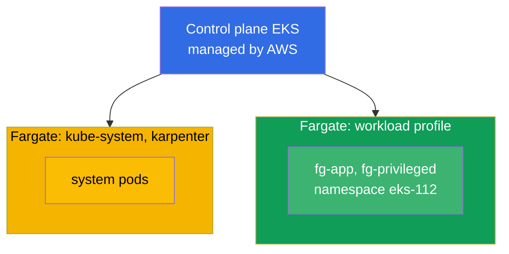
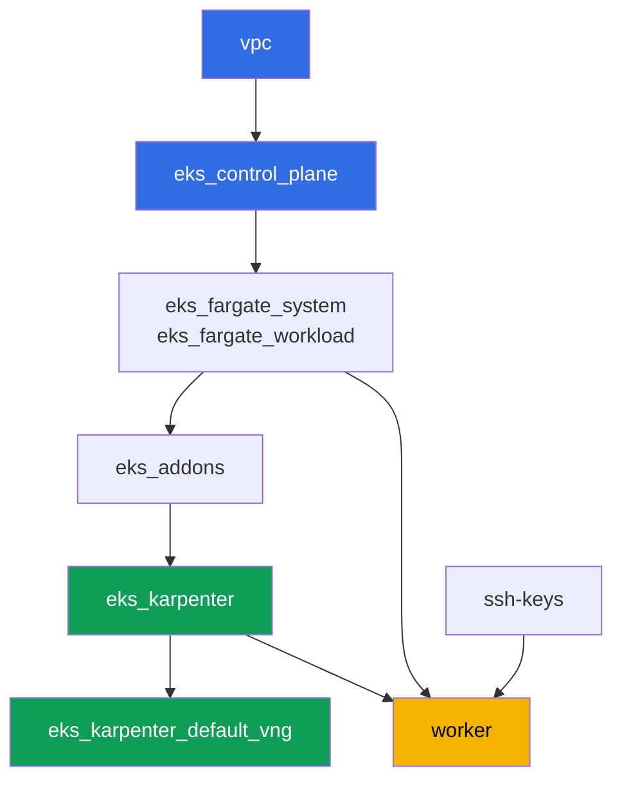

[Русская версия](README_RU.MD) · [Versión en español](README_ES.MD) · [Version française](README_FR.MD) · [Deutsche Version](README_DE.MD) · [ქართული ვერსია](README_GE.MD) · [繁體中文版](README_TW.MD) · [日本語版](README_JP.MD)

# Lab 112 - Fargate profiles: what works, what breaks, cost comparison

## Description

The cluster is already deployed as code, system pods run on Fargate, and Karpenter brings
up the worker nodes. In this lab you add a second Fargate profile for your own workload and
check the boundaries of this mode in practice: which pods start normally on Fargate, which
resource requests Fargate rounds up and to what, what is flatly forbidden (privileged), and
how the Fargate payment model differs from the node group payment model.

Tasks are written in a production style: a short statement plus acceptance criteria.
Checking is automatic, via the `check_result` command.

## Goal

Reinforce the material from this course chapter:

- [Chapter 15. Fargate: profiles, limitations, cost, usage scenarios](../../course/15/en.md)

## What we're creating

The cluster is already deployed. You add a workload namespace and create pods in it that
probe different edges of Fargate: normal startup, capacity rounding, the privileged ban,
extending the ephemeral disk.

| Object | What it is | Why it's in this lab |
|--------|---------|-------------------|
| Fargate profile `workload` | new component `eks_fargate_workload` | matches the whole `eks-112` namespace onto Fargate |
| Namespace `eks-112` | a cluster section for the lab's workload | falls under the `workload` profile selector |
| Deployment `fg-app` (2 replicas) | the ping_pong application, requests = limits | shows a Guaranteed pod actually running on Fargate |
| Artifact `capacity.txt` | the `CapacityProvisioned` annotation | shows the capacity Fargate rounded the request to |
| Pod `fg-privileged` + artifact `privileged.txt` | a pod with `privileged: true` | catches the rejection symptom and explains the Fargate boundary |
| `fg-app` with `ephemeral-storage: 30Gi` | an extended ephemeral disk | verifies that more than the 20 GiB default is also Guaranteed |
| Artifact `costmodel.txt` | a comparison of the payment structure | records the difference between Fargate and node group |

The resulting cluster picture:



## Infrastructure

The environment is deployed in AWS (`eu-central-1`) via Terragrunt. Each lab directory is
one component with its own `terragrunt.hcl`, which references a shared module in
`terraform/modules/` and declares dependencies through `dependency` blocks. Terragrunt
builds a dependency graph and applies the components in the right order.

### Modules and dependencies

| Directory (component) | Module (`terraform/modules/`) | Depends on | What it creates |
|---------------------|-------------------------------|------------|-------------|
| `vpc` | `vpc_v3` | - | VPC `10.10.0.0/16`, public and private subnets in two AZs, NAT |
| `ssh-keys` | `ssh-keys` | - | an SSH key pair for the worker machine and nodes |
| `eks_control_plane` | `eks_v2_control_plane` | `vpc` | EKS control plane `1.36`, OIDC, security groups |
| `eks_fargate_system` | `eks_v2_fargate` | `vpc`, `eks_control_plane` | Fargate profile for `kube-system` and `karpenter` |
| `eks_fargate_workload` | `eks_v2_fargate` | `vpc`, `eks_control_plane` | Fargate profile `workload` for namespace `eks-112` |
| `eks_addons` | `eks_v2_addons` | `eks_control_plane`, `eks_fargate_system` | coredns, kube-proxy, vpc-cni, pod-identity add-ons |
| `eks_karpenter` | `eks_v2_karpenter` | `vpc`, `eks_control_plane`, `eks_addons`, `eks_fargate_system` | Karpenter controller, node IAM role |
| `eks_karpenter_default_vng` | `eks_v2_karpenter_vng` | `vpc`, `eks_control_plane`, `eks_karpenter` | default NodePool `default` and EC2NodeClass on AL2023 |
| `worker` | `eks_v2_work_pc` | `ssh-keys`, `vpc`, `eks_control_plane`, `eks_karpenter`, `eks_fargate_workload` | worker machine with kubectl, tests, and `check_result` |

Dependency graph (what gets applied earlier is lower down the arrow). For clarity, node `fg`
on the diagram combines both Fargate profiles - the system one (`eks_fargate_system`) and
the workload one (`eks_fargate_workload`); the table above lists them as separate rows:



The `workload` profile must exist before the `eks-112` pods appear in the cluster, so
`worker` declares a dependency on `eks_fargate_workload` - Terragrunt applies the profile
before the student creates their objects on the worker machine.

### Where things are configured

Settings are split across two levels: the shared `env.hcl` and each component's `inputs`.

`env.hcl` (shared environment parameters, read by all components):

| Parameter | Value in the lab | What it affects |
|----------|-----------------|---------------|
| `region` | `eu-central-1` | region for all resources |
| `vpc_default_cidr`, `subnets` | `10.10.0.0/16`, subnets per AZ | VPC address plan and subnet tags |
| `prefix` | `eks-task112` | prefix for resource names and tags |
| `stack_name` | `eks112` | used to build `env_name` - the cluster name |
| `k8_version` | `1.36.0` | kubectl version on the worker machine |
| `instance_type_worker` | `t3.medium` | worker machine instance type |
| `ssh_password_enable`, `access_cidrs` | `true`, `0.0.0.0/0` | SSH access to the worker machine |
| `root_volume` | `gp3`, `10` | worker machine root disk |

`inputs` in each component's `terragrunt.hcl` (settings specific to that module):

| File | Key settings |
|------|--------------------|
| `eks_control_plane/terragrunt.hcl` | `eks.version = "1.36"`, private subnets for nodes |
| `eks_addons/terragrunt.hcl` | add-on versions for 1.36: kube-proxy, coredns, vpc-cni, pod-identity |
| `eks_fargate_system/terragrunt.hcl` | selectors for `kube-system`, `karpenter` |
| `eks_fargate_workload/terragrunt.hcl` | `fargate.name = "workload"`, selector `namespace = "eks-112"` |
| `eks_karpenter/terragrunt.hcl` | Karpenter version `1.8.1`, controller resources |
| `eks_karpenter_default_vng/terragrunt.hcl` | NodePool `requirements`, `limits`, `disruption` |
| `worker/terragrunt.hcl` | `test_url` and `task_script_url` for the lab 112 files, dependency on `eks_fargate_workload` |

The `eks_fargate_workload` selector matches only `namespace = "eks-112"`, with no `labels`.
That means any pod in this namespace lands on Fargate entirely - no exceptions.

## Deployment

```bash
TASK=112 make run_eks_task
```

Deployment takes roughly 15-20 minutes. In the output, find the line with the SSH connection
to the worker machine and connect to it. kubectl there is already configured for the right
cluster.

Useful commands on the worker machine:

```bash
time_left       # how much environment time is left
check_result    # check the solution
```

> Environment security. `env.hcl` has `ssh_password_enable = true` and
> `access_cidrs = ["0.0.0.0/0"]` enabled - convenient for a training environment, but this
> is not something to do in production. Per the course standards (chapters 0.2, 2, 19),
> access to worker machines should go through AWS SSM Session Manager without exposing
> public SSH ports, and `access_cidrs` should be narrowed down to specific addresses. Here
> public SSH is left in place only to keep the setup simple.

## Tasks

---
|        **1**        | **Namespace for the lab's workload**                             |
| :-----------------: | :---------------------------------------------------------- |
| What to do          | Create a namespace named `eks-112`. It falls under the Fargate `workload` profile selector (the selector is namespace only, no labels), so every pod inside it goes to Fargate. |
| Acceptance criteria    | - namespace `eks-112` exists. |
---
|        **2**        | **A Guaranteed pod on Fargate**                                |
| :-----------------: | :---------------------------------------------------------- |
| What to do          | In namespace `eks-112`, create Deployment `fg-app`, image `viktoruj/ping_pong:latest`, `2` replicas. The container's `resources.requests` and `resources.limits` must be EQUAL, e.g. `cpu: 500m`, `memory: 1Gi` - Fargate requires the pod to be `Guaranteed`. Wait until all replicas are ready and confirm the pods land on a `fargate-...` node, not `ip-...`. |
| Acceptance criteria    | - Deployment `fg-app` in `eks-112`, image `viktoruj/ping_pong`;<br/>- `2` ready replicas;<br/>- `requests.cpu == limits.cpu`;<br/>- each pod's node name starts with `fargate-`. |
---
|        **3**        | **The actually provisioned capacity**                                 |
| :-----------------: | :---------------------------------------------------------- |
| What to do          | Fargate rounds the request up to one of a set of fixed vCPU/memory combinations, adding `256 MB` for system components (`kubelet`, `kube-proxy`, `containerd`). Take any `fg-app` pod and save the `CapacityProvisioned` annotation to `/var/work/tests/artifacts/3/capacity.txt`.<br/>Format hint: `kubectl get pod <pod> -n eks-112 -o jsonpath='{.metadata.annotations.CapacityProvisioned}'` - the file should end up with a line like `0.5vCPU 1GB`. |
| Acceptance criteria    | - the file is not empty;<br/>- it contains `vCPU` and `GB`. |
---
|        **4**        | **Symptom: a privileged pod won't start**                   |
| :-----------------: | :---------------------------------------------------------- |
| What to do          | Fargate does not support privileged containers. In `eks-112`, create Pod `fg-privileged` (image `viktoruj/ping_pong:latest`) with `securityContext.privileged: true`. The pod must NOT reach `Running`. Investigate the cause via `kubectl describe pod fg-privileged -n eks-112` (the `Events` section) and save the explanation to `/var/work/tests/artifacts/4/privileged.txt`. The text must contain the words `privileged` and `Fargate`. |
| Acceptance criteria    | - Pod `fg-privileged` in `eks-112` is not in `Running` state;<br/>- the file `/var/work/tests/artifacts/4/privileged.txt` is not empty and contains the words `privileged` and `Fargate`. |
---
|        **5**        | **Extending the ephemeral disk**                               |
| :-----------------: | :---------------------------------------------------------- |
| What to do          | By default Fargate provides `20 GiB` of ephemeral disk. Recreate `fg-app` with `resources.requests.ephemeral-storage` and `resources.limits.ephemeral-storage` both equal to `30Gi` (requests must equal limits, same as for cpu/memory). Confirm the pod starts normally. |
| Acceptance criteria    | - Deployment `fg-app` has `ephemeral-storage` `30Gi` in both `requests` and `limits`;<br/>- at least one `fg-app` replica is ready. |
---
|        **6**        | **Cost structure: Fargate versus node group**            |
| :-----------------: | :---------------------------------------------------------- |
| What to do          | Describe the difference in the payment model in `3-5` sentences: Fargate charges for the vCPU and memory of the POD ITSELF for its lifetime, with no charge for idle capacity; a node group charges for the whole instance, including the time it's under-utilized. Save the text to `/var/work/tests/artifacts/6/costmodel.txt`. No dollar amounts - just the billing structure. The check looks for the word `pod` alongside `vCPU`, so make sure your explanation mentions both `pod` and `vCPU`. |
| Acceptance criteria    | - the file is not empty;<br/>- it contains the words `vCPU`, `pod`, and `node group`. |
---

## Checking the result

On the worker machine, run the automatic check:

```bash
check_result
```

The script will run the tests and show the percentage of completed tasks.

## Solution

Reference solution: [worker/files/solutions/1.MD](worker/files/solutions/1.MD)

## Deleting the cluster and resources

> **First remove the workload and wait for the Fargate pods to disappear, then tear down
> the stack.** All of the `eks-112` workload lives on Fargate, this lab doesn't bring up any
> Karpenter EC2 nodes - so there's no risk of an orphaned ENI from VPC CNI here. But there
> is another risk: AWS won't let you delete a Fargate profile while pods are still running
> on it (`terraform destroy` on the `eks_fargate_workload` component will fail with an error
> that the profile is still in use).

```bash
# 1. Remove the lab's workload (fg-app, fg-privileged) and wait for the Fargate pods to disappear
kubectl delete namespace eks-112 --ignore-not-found
while kubectl get pods -A -o wide 2>/dev/null | grep -q 'eks-112'; do
  echo "eks-112 pods are still terminating, waiting..."; sleep 10
done
```

Only after that, tear down the stack:

```bash
TASK=112 make delete_eks_task
```

If `destroy` still fails on the `eks_fargate_workload` component with an error about active
pods, the namespace hasn't finished being removed - check `kubectl get pods -n eks-112` and
retry `TASK=112 make delete_eks_task` once there are no pods left.
