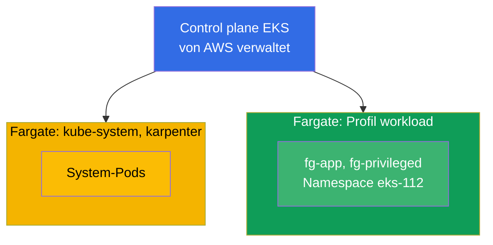
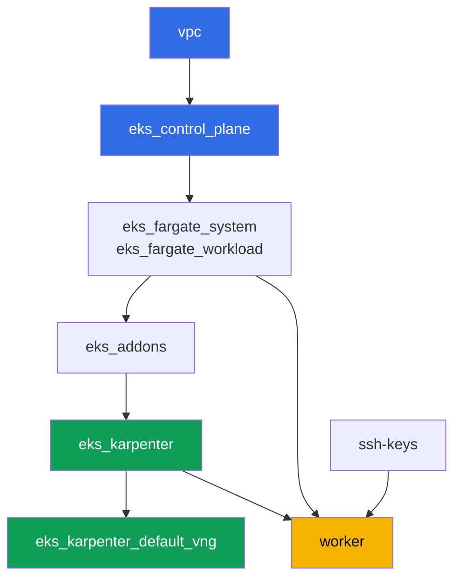

[Русская версия](README_RU.MD) · [Eng version](README.MD) · [Versión en español](README_ES.MD) · [Version française](README_FR.MD) · [ქართული ვერსია](README_GE.MD) · [繁體中文版](README_TW.MD) · [日本語版](README_JP.MD)

# Lab 112 - Fargate-Profile: was funktioniert, was bricht, Kostenvergleich

## Beschreibung

Der Cluster ist bereits als Code deployt, System-Pods laufen auf Fargate, und Karpenter
fährt die Worker-Nodes hoch. In diesem Lab fügen Sie ein zweites Fargate-Profil für Ihre
eigene Workload hinzu und prüfen die Grenzen dieses Modus in der Praxis: welche Pods auf
Fargate normal starten, welche Ressourcenanforderungen Fargate aufrundet und auf wie viel,
was grundsätzlich verboten ist (privileged), und worin sich das Bezahlmodell von Fargate von
dem einer Node Group unterscheidet.

Die Aufgaben sind im Produktionsstil geschrieben: eine kurze Aufgabenstellung plus
Abnahmekriterien. Die Prüfung erfolgt automatisch über den Befehl `check_result`.

## Ziel

Den Stoff dieses Kurskapitels vertiefen:

- [Kapitel 15. Fargate: Profile, Einschränkungen, Kosten, Einsatzszenarien](../../course/15/de.md)

## Was wir erstellen

Der Cluster ist bereits deployt. Sie fügen einen Workload-Namespace hinzu und erstellen
darin Pods, die verschiedene Facetten von Fargate testen: normaler Start, Kapazitätsrundung,
Verbot von privileged, Erweiterung der ephemeren Disk.

| Objekt | Was es ist | Wofür in diesem Lab |
|--------|---------|-------------------|
| Fargate-Profil `workload` | neue Komponente `eks_fargate_workload` | ordnet den gesamten Namespace `eks-112` Fargate zu |
| Namespace `eks-112` | ein Cluster-Bereich für die Lab-Workload | fällt unter den Selektor des Profils `workload` |
| Deployment `fg-app` (2 Replicas) | die ping_pong-Anwendung, requests = limits | zeigt einen Guaranteed-Pod, der tatsächlich auf Fargate läuft |
| Artefakt `capacity.txt` | die Annotation `CapacityProvisioned` | zeigt, auf welche Kapazität Fargate die Anfrage aufgerundet hat |
| Pod `fg-privileged` + Artefakt `privileged.txt` | ein Pod mit `privileged: true` | erfasst das Ablehnungssymptom und erklärt die Grenze von Fargate |
| `fg-app` mit `ephemeral-storage: 30Gi` | erweiterte ephemere Disk | prüft, dass auch mehr als die standardmäßigen 20 GiB Guaranteed bleibt |
| Artefakt `costmodel.txt` | Vergleich der Bezahlstruktur | hält den Unterschied zwischen Fargate und einer Node Group fest |

Das resultierende Bild des Clusters:



## Infrastruktur

Die Umgebung wird in AWS (`eu-central-1`) über Terragrunt deployt. Jedes Lab-Verzeichnis ist
eine Komponente mit eigenem `terragrunt.hcl`, das auf ein gemeinsames Modul in
`terraform/modules/` verweist und seine Abhängigkeiten über `dependency`-Blöcke deklariert.
Terragrunt baut einen Abhängigkeitsgraphen und wendet die Komponenten in der richtigen
Reihenfolge an.

### Module und Abhängigkeiten

| Verzeichnis (Komponente) | Modul (`terraform/modules/`) | Abhängig von | Was es erstellt |
|---------------------|-------------------------------|------------|-------------|
| `vpc` | `vpc_v3` | - | VPC `10.10.0.0/16`, öffentliche und private Subnetze in zwei AZ, NAT |
| `ssh-keys` | `ssh-keys` | - | ein SSH-Schlüsselpaar für die Worker-Maschine und die Nodes |
| `eks_control_plane` | `eks_v2_control_plane` | `vpc` | EKS Control Plane `1.36`, OIDC, Security Groups |
| `eks_fargate_system` | `eks_v2_fargate` | `vpc`, `eks_control_plane` | Fargate-Profil für `kube-system` und `karpenter` |
| `eks_fargate_workload` | `eks_v2_fargate` | `vpc`, `eks_control_plane` | Fargate-Profil `workload` für den Namespace `eks-112` |
| `eks_addons` | `eks_v2_addons` | `eks_control_plane`, `eks_fargate_system` | Add-ons coredns, kube-proxy, vpc-cni, pod-identity |
| `eks_karpenter` | `eks_v2_karpenter` | `vpc`, `eks_control_plane`, `eks_addons`, `eks_fargate_system` | Karpenter-Controller, IAM-Rolle der Nodes |
| `eks_karpenter_default_vng` | `eks_v2_karpenter_vng` | `vpc`, `eks_control_plane`, `eks_karpenter` | Standard-NodePool `default` und EC2NodeClass auf AL2023 |
| `worker` | `eks_v2_work_pc` | `ssh-keys`, `vpc`, `eks_control_plane`, `eks_karpenter`, `eks_fargate_workload` | Worker-Maschine mit kubectl, Tests und `check_result` |

Abhängigkeitsgraph (was früher angewendet wird, steht weiter unten am Pfeil). Zur
Verdeutlichung fasst der Knoten `fg` im Diagramm beide Fargate-Profile zusammen - das
System-Profil (`eks_fargate_system`) und das Workload-Profil (`eks_fargate_workload`); in
der Tabelle oben sind sie auf getrennten Zeilen aufgeführt:



Das Profil `workload` muss existieren, bevor die `eks-112`-Pods im Cluster erscheinen,
daher deklariert `worker` eine Abhängigkeit von `eks_fargate_workload` - Terragrunt wendet
das Profil an, bevor der Student seine Objekte auf der Worker-Maschine erstellt.

### Wo was konfiguriert wird

Die Einstellungen sind auf zwei Ebenen verteilt: das gemeinsame `env.hcl` und die `inputs`
jeder Komponente.

`env.hcl` (gemeinsame Umgebungsparameter, von allen Komponenten gelesen):

| Parameter | Wert im Lab | Was er beeinflusst |
|----------|-----------------|---------------|
| `region` | `eu-central-1` | Region aller Ressourcen |
| `vpc_default_cidr`, `subnets` | `10.10.0.0/16`, Subnetze pro AZ | Adressplan der VPC und Subnetz-Tags |
| `prefix` | `eks-task112` | Präfix für Ressourcennamen und Tags |
| `stack_name` | `eks112` | daraus wird `env_name` - der Clustername - gebildet |
| `k8_version` | `1.36.0` | kubectl-Version auf der Worker-Maschine |
| `instance_type_worker` | `t3.medium` | Instanztyp der Worker-Maschine |
| `ssh_password_enable`, `access_cidrs` | `true`, `0.0.0.0/0` | SSH-Zugriff auf die Worker-Maschine |
| `root_volume` | `gp3`, `10` | Root-Disk der Worker-Maschine |

`inputs` im `terragrunt.hcl` jeder Komponente (Parameter des jeweiligen Moduls):

| Datei | Wichtige Einstellungen |
|------|--------------------|
| `eks_control_plane/terragrunt.hcl` | `eks.version = "1.36"`, private Subnetze für Nodes |
| `eks_addons/terragrunt.hcl` | Add-on-Versionen für 1.36: kube-proxy, coredns, vpc-cni, pod-identity |
| `eks_fargate_system/terragrunt.hcl` | Selektoren `kube-system`, `karpenter` |
| `eks_fargate_workload/terragrunt.hcl` | `fargate.name = "workload"`, Selektor `namespace = "eks-112"` |
| `eks_karpenter/terragrunt.hcl` | Karpenter-Version `1.8.1`, Controller-Ressourcen |
| `eks_karpenter_default_vng/terragrunt.hcl` | `requirements` des NodePool, `limits`, `disruption` |
| `worker/terragrunt.hcl` | `test_url` und `task_script_url` für die Lab-112-Dateien, Abhängigkeit von `eks_fargate_workload` |

Der Selektor von `eks_fargate_workload` passt nur auf `namespace = "eks-112"`, ohne
`labels`. Das bedeutet, dass jeder Pod in diesem Namespace vollständig auf Fargate landet -
ohne Ausnahmen.

## Deployment

```bash
TASK=112 make run_eks_task
```

Das Deployment dauert etwa 15-20 Minuten. Suchen Sie in der Ausgabe die Zeile mit der
SSH-Verbindung zur Worker-Maschine und verbinden Sie sich damit. kubectl ist dort bereits
für den richtigen Cluster konfiguriert.

Nützliche Befehle auf der Worker-Maschine:

```bash
time_left       # verbleibende Zeit der Umgebung
check_result    # Lösung prüfen
```

> Sicherheit der Testumgebung. In `env.hcl` sind `ssh_password_enable = true` und
> `access_cidrs = ["0.0.0.0/0"]` aktiviert - praktisch für eine Lernumgebung, aber so sollte
> man es in Produktion nicht machen. Nach den Standards des Kurses (Kapitel 0.2, 2, 19) wird
> der Zugriff auf Worker-Maschinen über AWS SSM Session Manager geöffnet, ohne öffentliche
> SSH-Ports nach außen, und `access_cidrs` wird auf konkrete Adressen eingeschränkt. Hier
> bleibt öffentliches SSH nur der Einfachheit halber bestehen.

## Aufgaben

---
|        **1**        | **Namespace für die Lab-Workload**                             |
| :-----------------: | :---------------------------------------------------------- |
| Was wir tun          | Erstellen Sie einen Namespace mit dem Namen `eks-112`. Er fällt unter den Selektor des Fargate-Profils `workload` (der Selektor betrifft nur den Namespace, ohne Labels), daher gehen alle Pods darin auf Fargate. |
| Abnahmekriterien    | - Namespace `eks-112` existiert. |
---
|        **2**        | **Ein Guaranteed-Pod auf Fargate**                                |
| :-----------------: | :---------------------------------------------------------- |
| Was wir tun          | Erstellen Sie im Namespace `eks-112` das Deployment `fg-app`, Image `viktoruj/ping_pong:latest`, `2` Replicas. Die `resources.requests` und `resources.limits` des Containers müssen GLEICH sein, z. B. `cpu: 500m`, `memory: 1Gi` - Fargate verlangt, dass der Pod `Guaranteed` ist. Warten Sie, bis alle Replicas bereit sind, und stellen Sie sicher, dass die Pods auf einem Node `fargate-...` landen, nicht auf `ip-...`. |
| Abnahmekriterien    | - Deployment `fg-app` in `eks-112`, Image `viktoruj/ping_pong`;<br/>- `2` bereite Replicas;<br/>- `requests.cpu == limits.cpu`;<br/>- der Node-Name jedes Pods beginnt mit `fargate-`. |
---
|        **3**        | **Die tatsächlich zugewiesene Kapazität**                                 |
| :-----------------: | :---------------------------------------------------------- |
| Was wir tun          | Fargate rundet die Anfrage auf eine der festen vCPU/Speicher-Kombinationen auf und fügt `256 MB` für Systemkomponenten (`kubelet`, `kube-proxy`, `containerd`) hinzu. Nehmen Sie einen beliebigen `fg-app`-Pod und speichern Sie die Annotation `CapacityProvisioned` in die Datei `/var/work/tests/artifacts/3/capacity.txt`.<br/>Format-Hinweis: `kubectl get pod <pod> -n eks-112 -o jsonpath='{.metadata.annotations.CapacityProvisioned}'` - in der Datei sollte eine Zeile wie `0.5vCPU 1GB` stehen. |
| Abnahmekriterien    | - die Datei ist nicht leer;<br/>- sie enthält `vCPU` und `GB`. |
---
|        **4**        | **Symptom: ein privileged-Pod startet nicht**                   |
| :-----------------: | :---------------------------------------------------------- |
| Was wir tun          | Fargate unterstützt keine privilegierten Container. Erstellen Sie in `eks-112` den Pod `fg-privileged` (Image `viktoruj/ping_pong:latest`) mit `securityContext.privileged: true`. Der Pod darf NICHT `Running` erreichen. Untersuchen Sie die Ursache über `kubectl describe pod fg-privileged -n eks-112` (Abschnitt `Events`) und speichern Sie die Erklärung in `/var/work/tests/artifacts/4/privileged.txt`. Der Text muss die Wörter `privileged` und `Fargate` enthalten. |
| Abnahmekriterien    | - Pod `fg-privileged` in `eks-112` ist nicht im Zustand `Running`;<br/>- die Datei `/var/work/tests/artifacts/4/privileged.txt` ist nicht leer und enthält die Wörter `privileged` und `Fargate`. |
---
|        **5**        | **Erweiterung der ephemeren Disk**                               |
| :-----------------: | :---------------------------------------------------------- |
| Was wir tun          | Standardmäßig stellt Fargate `20 GiB` ephemere Disk bereit. Erstellen Sie `fg-app` neu mit `resources.requests.ephemeral-storage` und `resources.limits.ephemeral-storage`, beide gleich `30Gi` (requests muss gleich limits sein, wie bei cpu/memory). Stellen Sie sicher, dass der Pod normal startet. |
| Abnahmekriterien    | - Deployment `fg-app` hat `ephemeral-storage` `30Gi` sowohl in `requests` als auch in `limits`;<br/>- mindestens eine `fg-app`-Replica ist bereit. |
---
|        **6**        | **Kostenstruktur: Fargate versus Node Group**            |
| :-----------------: | :---------------------------------------------------------- |
| Was wir tun          | Beschreiben Sie den Unterschied im Bezahlmodell in `3-5` Sätzen: Fargate berechnet vCPU und Speicher des PODS SELBST für die Dauer seiner Lebenszeit, ohne Gebühr für ungenutzte Kapazität; eine Node Group berechnet die ganze Instanz, einschließlich der Zeit, in der sie unterausgelastet ist. Speichern Sie den Text in `/var/work/tests/artifacts/6/costmodel.txt`. Ohne Dollarbeträge - nur die Abrechnungsstruktur. Die automatische Prüfung sucht das Wort `pod` neben `vCPU`, achten Sie also darauf, dass Ihre Erklärung sowohl `pod` als auch `vCPU` enthält. |
| Abnahmekriterien    | - die Datei ist nicht leer;<br/>- sie enthält `vCPU`, `pod` und `node group`. |
---

## Ergebnis prüfen

Führen Sie auf der Worker-Maschine die automatische Prüfung aus:

```bash
check_result
```

Das Skript führt die Tests aus und zeigt den Prozentsatz erledigter Aufgaben.

## Lösung

Referenzlösung: [worker/files/solutions/1_DE.MD](worker/files/solutions/1_DE.MD)

## Cluster und Ressourcen löschen

> **Entfernen Sie zuerst die Workload und warten Sie, bis die Fargate-Pods verschwunden
> sind, erst dann reißen Sie die Umgebung ab.** Die gesamte `eks-112`-Workload lebt auf
> Fargate, dieses Lab fährt keine Karpenter-EC2-Nodes hoch - hier besteht also kein Risiko
> eines verwaisten ENI von VPC CNI. Es gibt aber ein anderes Risiko: AWS lässt es nicht zu,
> ein Fargate-Profil zu löschen, solange darauf noch Pods laufen (`terraform destroy` auf der
> Komponente `eks_fargate_workload` schlägt mit einem Fehler fehl, dass das Profil noch
> benutzt wird).

```bash
# 1. Lab-Workload entfernen (fg-app, fg-privileged) und warten, bis die Fargate-Pods verschwunden sind
kubectl delete namespace eks-112 --ignore-not-found
while kubectl get pods -A -o wide 2>/dev/null | grep -q 'eks-112'; do
  echo "eks-112-Pods werden noch beendet, warte..."; sleep 10
done
```

Erst danach die Umgebung abreißen:

```bash
TASK=112 make delete_eks_task
```

Falls `destroy` trotzdem auf der Komponente `eks_fargate_workload` mit einem Fehler zu
aktiven Pods fehlschlägt, ist der Namespace noch nicht vollständig entfernt - prüfen Sie
`kubectl get pods -n eks-112` und wiederholen Sie `TASK=112 make delete_eks_task`, sobald
keine Pods mehr übrig sind.
