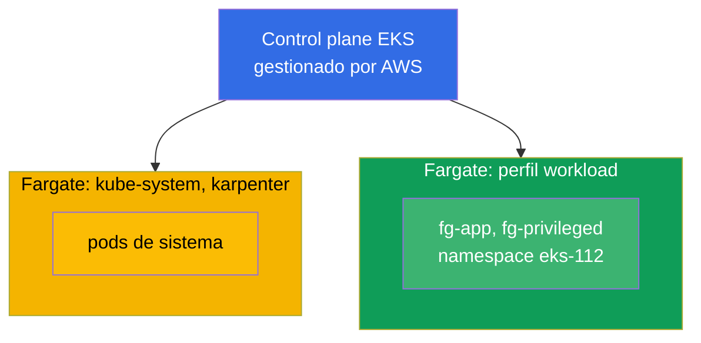
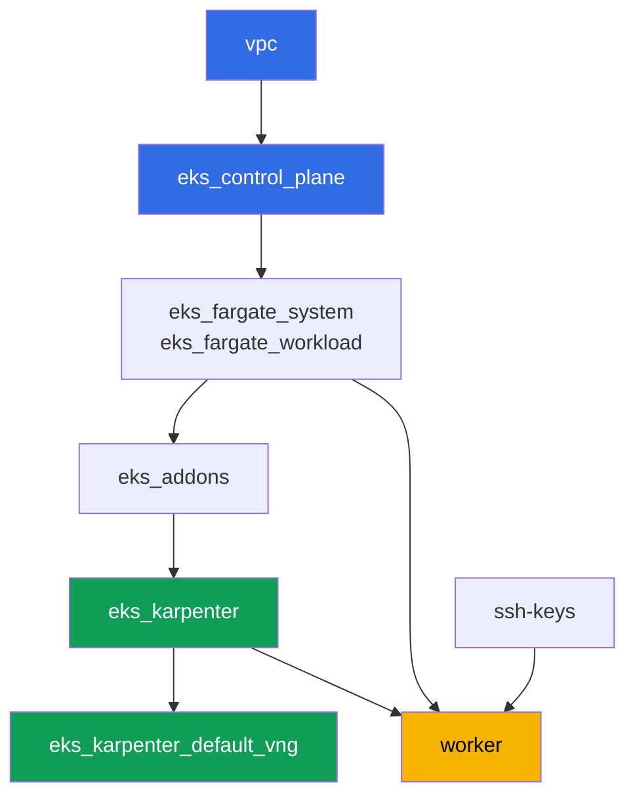

[Русская версия](README_RU.MD) · [Eng version](README.MD) · [Version française](README_FR.MD) · [Deutsche Version](README_DE.MD) · [ქართული ვერსია](README_GE.MD) · [繁體中文版](README_TW.MD) · [日本語版](README_JP.MD)

# Lab 112 - Perfiles de Fargate: qué funciona, qué se rompe, comparación de costes

## Descripción

El clúster ya está desplegado como código, los pods de sistema corren en Fargate, y
Karpenter levanta los nodos de trabajo. En este laboratorio añades un segundo perfil de
Fargate para tu propia carga de trabajo y comprueba en la práctica los límites de este
modo: qué pods arrancan con normalidad en Fargate, qué peticiones de recursos redondea
Fargate y hasta cuánto, qué está prohibido de raíz (privileged), y en qué se diferencia el
modelo de pago de Fargate del modelo de pago de un node group.

Las tareas están escritas en estilo de producción: un enunciado breve más criterios de
aceptación. La verificación es automática, mediante el comando `check_result`.

## Objetivo

Reforzar el material de este capítulo del curso:

- [Capítulo 15. Fargate: perfiles, limitaciones, coste, escenarios de uso](../../course/15/es.md)

## Qué vamos a crear

El clúster ya está desplegado. Añades un namespace de carga de trabajo y creas en él pods
que ponen a prueba distintas facetas de Fargate: arranque normal, redondeo de capacidad,
prohibición de privileged, ampliación del disco efímero.

| Objeto | Qué es | Para qué sirve en este laboratorio |
|--------|---------|-------------------|
| Perfil de Fargate `workload` | nuevo componente `eks_fargate_workload` | asocia todo el namespace `eks-112` a Fargate |
| Namespace `eks-112` | una sección del clúster para la carga del laboratorio | cae bajo el selector del perfil `workload` |
| Deployment `fg-app` (2 réplicas) | la aplicación ping_pong, requests = limits | vemos un pod Guaranteed corriendo realmente en Fargate |
| Artefacto `capacity.txt` | la anotación `CapacityProvisioned` | vemos a qué capacidad redondeó Fargate la petición |
| Pod `fg-privileged` + artefacto `privileged.txt` | un pod con `privileged: true` | capturamos el síntoma del rechazo y explicamos el límite de Fargate |
| `fg-app` con `ephemeral-storage: 30Gi` | disco efímero ampliado | comprobamos que más de los 20 GiB por defecto también es Guaranteed |
| Artefacto `costmodel.txt` | comparación de la estructura de pago | fijamos la diferencia entre Fargate y un node group |

Imagen final del clúster:



## Infraestructura

El entorno se despliega en AWS (`eu-central-1`) mediante Terragrunt. Cada carpeta del
laboratorio es un componente con su propio `terragrunt.hcl`, que hace referencia a un
módulo compartido en `terraform/modules/` y declara sus dependencias mediante bloques
`dependency`. Terragrunt construye un grafo de dependencias y aplica los componentes en el
orden correcto.

### Módulos y dependencias

| Carpeta (componente) | Módulo (`terraform/modules/`) | Depende de | Qué crea |
|---------------------|-------------------------------|------------|-------------|
| `vpc` | `vpc_v3` | - | VPC `10.10.0.0/16`, subredes públicas y privadas en dos AZ, NAT |
| `ssh-keys` | `ssh-keys` | - | un par de claves SSH para la máquina de trabajo y los nodos |
| `eks_control_plane` | `eks_v2_control_plane` | `vpc` | control plane de EKS `1.36`, OIDC, security groups |
| `eks_fargate_system` | `eks_v2_fargate` | `vpc`, `eks_control_plane` | perfil de Fargate para `kube-system` y `karpenter` |
| `eks_fargate_workload` | `eks_v2_fargate` | `vpc`, `eks_control_plane` | perfil de Fargate `workload` para el namespace `eks-112` |
| `eks_addons` | `eks_v2_addons` | `eks_control_plane`, `eks_fargate_system` | add-ons de coredns, kube-proxy, vpc-cni, pod-identity |
| `eks_karpenter` | `eks_v2_karpenter` | `vpc`, `eks_control_plane`, `eks_addons`, `eks_fargate_system` | controlador de Karpenter, rol IAM de los nodos |
| `eks_karpenter_default_vng` | `eks_v2_karpenter_vng` | `vpc`, `eks_control_plane`, `eks_karpenter` | NodePool por defecto `default` y EC2NodeClass sobre AL2023 |
| `worker` | `eks_v2_work_pc` | `ssh-keys`, `vpc`, `eks_control_plane`, `eks_karpenter`, `eks_fargate_workload` | máquina de trabajo con kubectl, tests y `check_result` |

Grafo de dependencias (lo que se aplica antes está más abajo en la flecha). Para mayor
claridad, el nodo `fg` del diagrama agrupa ambos perfiles de Fargate - el de sistema
(`eks_fargate_system`) y el de carga de trabajo (`eks_fargate_workload`); en la tabla de
arriba aparecen en filas separadas:



El perfil `workload` debe existir antes de que aparezcan en el clúster los pods de
`eks-112`, por eso `worker` declara una dependencia con `eks_fargate_workload` - Terragrunt
aplicará el perfil antes de que el estudiante cree sus objetos en la máquina de trabajo.

### Dónde se configura cada cosa

Los ajustes están repartidos en dos niveles: el `env.hcl` compartido y los `inputs` de cada
componente.

`env.hcl` (parámetros comunes del entorno, leídos por todos los componentes):

| Parámetro | Valor en el laboratorio | Qué afecta |
|----------|-----------------|---------------|
| `region` | `eu-central-1` | región de todos los recursos |
| `vpc_default_cidr`, `subnets` | `10.10.0.0/16`, subredes por AZ | plan de direcciones de la VPC y etiquetas de subredes |
| `prefix` | `eks-task112` | prefijo de nombres de recursos y etiquetas |
| `stack_name` | `eks112` | con él se construye `env_name`, el nombre del clúster |
| `k8_version` | `1.36.0` | versión de kubectl en la máquina de trabajo |
| `instance_type_worker` | `t3.medium` | tipo de instancia de la máquina de trabajo |
| `ssh_password_enable`, `access_cidrs` | `true`, `0.0.0.0/0` | acceso SSH a la máquina de trabajo |
| `root_volume` | `gp3`, `10` | disco raíz de la máquina de trabajo |

`inputs` en el `terragrunt.hcl` de cada componente (parámetros del módulo concreto):

| Archivo | Ajustes clave |
|------|--------------------|
| `eks_control_plane/terragrunt.hcl` | `eks.version = "1.36"`, subredes privadas para los nodos |
| `eks_addons/terragrunt.hcl` | versiones de add-ons para 1.36: kube-proxy, coredns, vpc-cni, pod-identity |
| `eks_fargate_system/terragrunt.hcl` | selectores `kube-system`, `karpenter` |
| `eks_fargate_workload/terragrunt.hcl` | `fargate.name = "workload"`, selector `namespace = "eks-112"` |
| `eks_karpenter/terragrunt.hcl` | versión de Karpenter `1.8.1`, recursos del controlador |
| `eks_karpenter_default_vng/terragrunt.hcl` | `requirements` del NodePool, `limits`, `disruption` |
| `worker/terragrunt.hcl` | `test_url` y `task_script_url` de los archivos del laboratorio 112, dependencia con `eks_fargate_workload` |

El selector de `eks_fargate_workload` solo coincide con `namespace = "eks-112"`, sin
`labels`. Esto significa que cualquier pod de este namespace va entero a Fargate - sin
excepciones.

## Despliegue

```bash
TASK=112 make run_eks_task
```

El despliegue tarda aproximadamente 15-20 minutos. En la salida, busca la línea con la
conexión SSH a la máquina de trabajo y conéctate a ella. kubectl ya está configurado allí
para el clúster correcto.

Comandos útiles en la máquina de trabajo:

```bash
time_left       # cuánto tiempo queda del entorno
check_result    # verificar la solución
```

> Seguridad del entorno. En `env.hcl` están activados `ssh_password_enable = true` y
> `access_cidrs = ["0.0.0.0/0"]` - cómodo para un entorno de formación, pero no es algo que
> se deba hacer en producción. Según los estándares del curso (capítulos 0.2, 2, 19), el
> acceso a las máquinas de trabajo se abre mediante AWS SSM Session Manager sin puertos SSH
> públicos hacia el exterior, y `access_cidrs` se restringe a direcciones concretas. Aquí se
> deja SSH público solo para simplificar el arranque.

## Tareas

---
|        **1**        | **Namespace para la carga del laboratorio**                             |
| :-----------------: | :---------------------------------------------------------- |
| Qué hacemos          | Crea un namespace llamado `eks-112`. Cae bajo el selector del perfil de Fargate `workload` (el selector es solo el namespace, sin labels), así que todos los pods dentro de él van a Fargate. |
| Criterios de aceptación    | - el namespace `eks-112` existe. |
---
|        **2**        | **Un pod Guaranteed en Fargate**                                |
| :-----------------: | :---------------------------------------------------------- |
| Qué hacemos          | En el namespace `eks-112` crea el Deployment `fg-app`, imagen `viktoruj/ping_pong:latest`, `2` réplicas. Los `resources.requests` y `resources.limits` del contenedor deben ser IGUALES, por ejemplo `cpu: 500m`, `memory: 1Gi` - Fargate exige que el pod sea `Guaranteed`. Espera a que todas las réplicas estén listas y comprueba que los pods van a un nodo `fargate-...`, no a `ip-...`. |
| Criterios de aceptación    | - Deployment `fg-app` en `eks-112`, imagen `viktoruj/ping_pong`;<br/>- `2` réplicas listas;<br/>- `requests.cpu == limits.cpu`;<br/>- el nombre de nodo de cada pod empieza por `fargate-`. |
---
|        **3**        | **La capacidad realmente asignada**                                 |
| :-----------------: | :---------------------------------------------------------- |
| Qué hacemos          | Fargate redondea la petición a una de las combinaciones fijas de vCPU y memoria, añadiendo `256 MB` para los componentes de sistema (`kubelet`, `kube-proxy`, `containerd`). Toma cualquier pod `fg-app` y guarda la anotación `CapacityProvisioned` en el archivo `/var/work/tests/artifacts/3/capacity.txt`.<br/>Pista de formato: `kubectl get pod <pod> -n eks-112 -o jsonpath='{.metadata.annotations.CapacityProvisioned}'` - en el archivo debe quedar una línea del tipo `0.5vCPU 1GB`. |
| Criterios de aceptación    | - el archivo no está vacío;<br/>- contiene `vCPU` y `GB`. |
---
|        **4**        | **Síntoma: un pod privileged no arranca**                   |
| :-----------------: | :---------------------------------------------------------- |
| Qué hacemos          | Fargate no admite contenedores privilegiados. En `eks-112` crea el Pod `fg-privileged` (imagen `viktoruj/ping_pong:latest`) con `securityContext.privileged: true`. El pod NO debe llegar a `Running`. Investiga la causa con `kubectl describe pod fg-privileged -n eks-112` (sección `Events`) y guarda la explicación en `/var/work/tests/artifacts/4/privileged.txt`. El texto debe contener las palabras `privileged` y `Fargate`. |
| Criterios de aceptación    | - el Pod `fg-privileged` en `eks-112` no está en estado `Running`;<br/>- el archivo `/var/work/tests/artifacts/4/privileged.txt` no está vacío y contiene las palabras `privileged` y `Fargate`. |
---
|        **5**        | **Ampliación del disco efímero**                               |
| :-----------------: | :---------------------------------------------------------- |
| Qué hacemos          | Por defecto Fargate entrega `20 GiB` de disco efímero. Recrea `fg-app` con `resources.requests.ephemeral-storage` y `resources.limits.ephemeral-storage` iguales a `30Gi` (requests debe ser igual a limits, igual que para cpu/memory). Comprueba que el pod arranca con normalidad. |
| Criterios de aceptación    | - el Deployment `fg-app` tiene `ephemeral-storage` `30Gi` tanto en `requests` como en `limits`;<br/>- al menos una réplica de `fg-app` está lista. |
---
|        **6**        | **Estructura de coste: Fargate contra node group**            |
| :-----------------: | :---------------------------------------------------------- |
| Qué hacemos          | Describe la diferencia del modelo de pago en `3-5` frases: Fargate tarifica la vCPU y la memoria del PROPIO POD durante el tiempo que vive, sin cobrar por capacidad ociosa; un node group tarifica la instancia entera, incluido el tiempo en que está infrautilizada. Guarda el texto en `/var/work/tests/artifacts/6/costmodel.txt`. Sin cifras en dólares - solo la estructura de tarificación. La verificación automática busca la palabra `pod` junto a `vCPU`, así que asegúrate de que tu explicación mencione tanto `pod` como `vCPU`. |
| Criterios de aceptación    | - el archivo no está vacío;<br/>- contiene `vCPU`, `pod` y `node group`. |
---

## Verificación del resultado

En la máquina de trabajo, ejecuta la verificación automática:

```bash
check_result
```

El script ejecutará los tests y mostrará el porcentaje de tareas completadas.

## Solución

Solución de referencia: [worker/files/solutions/1_ES.MD](worker/files/solutions/1_ES.MD)

## Eliminación del clúster y los recursos

> **Primero retira la carga de trabajo y espera a que desaparezcan los pods de Fargate,
> luego destruye el entorno.** Toda la carga de `eks-112` vive en Fargate, este laboratorio
> no levanta ningún nodo EC2 de Karpenter - así que aquí no hay riesgo de un ENI huérfano de
> VPC CNI. Pero hay otro riesgo: AWS no permite eliminar un perfil de Fargate mientras aún
> tenga pods en marcha (`terraform destroy` sobre el componente `eks_fargate_workload`
> fallará con un error indicando que el perfil todavía está en uso).

```bash
# 1. Retirar la carga del laboratorio (fg-app, fg-privileged) y esperar a que desaparezcan los pods de Fargate
kubectl delete namespace eks-112 --ignore-not-found
while kubectl get pods -A -o wide 2>/dev/null | grep -q 'eks-112'; do
  echo "los pods de eks-112 todavía se están terminando, esperando..."; sleep 10
done
```

Solo después de esto, destruye el entorno:

```bash
TASK=112 make delete_eks_task
```

Si `destroy` aun así falla en el componente `eks_fargate_workload` con un error sobre pods
activos, el namespace no ha terminado de eliminarse - comprueba `kubectl get pods -n
eks-112` y repite `TASK=112 make delete_eks_task` una vez que no queden pods.
