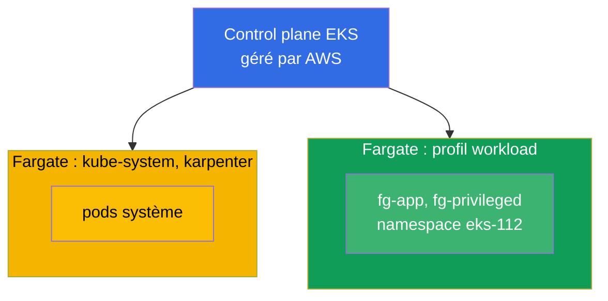
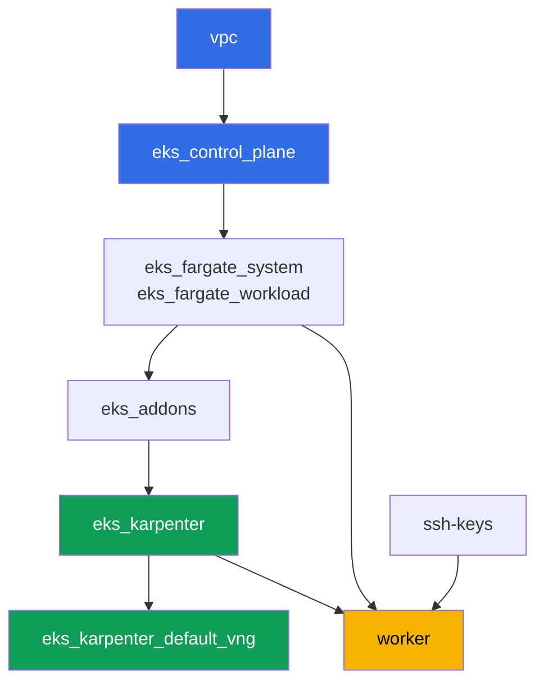

[Русская версия](README_RU.MD) · [Eng version](README.MD) · [Versión en español](README_ES.MD) · [Deutsche Version](README_DE.MD) · [ქართული ვერსია](README_GE.MD) · [繁體中文版](README_TW.MD) · [日本語版](README_JP.MD)

# Lab 112 - Profils Fargate : ce qui marche, ce qui casse, comparaison des coûts

## Description

Le cluster est déjà déployé comme du code, les pods système tournent sur Fargate, et
Karpenter monte les nœuds de travail. Dans ce laboratoire, vous ajoutez un deuxième profil
Fargate pour votre propre charge de travail et vous vérifiez en pratique les limites de ce
mode : quels pods démarrent normalement sur Fargate, quelles requêtes de ressources Fargate
arrondit et jusqu'à combien, ce qui est strictement interdit (privileged), et en quoi le
modèle de facturation de Fargate diffère de celui d'un node group.

Les tâches sont écrites dans un style de production : un énoncé court plus des critères
d'acceptation. La vérification est automatique, via la commande `check_result`.

## Objectif

Consolider le contenu de ce chapitre du cours :

- [Chapitre 15. Fargate : profils, limitations, coût, scénarios d'usage](../../course/15/ru.md)

## Ce que nous créons

Dans ce laboratoire, le cluster est déjà déployé. Vous ajoutez un namespace de charge de
travail et créez à l'intérieur des pods qui mettent à l'épreuve différentes facettes de
Fargate : démarrage normal, arrondi de capacité, interdiction du privileged, extension du
disque éphémère.

| Objet | Ce que c'est | Pourquoi dans ce laboratoire |
|--------|---------|-------------------|
| Profil Fargate `workload` | nouveau composant `eks_fargate_workload` | associe tout le namespace `eks-112` à Fargate |
| Namespace `eks-112` | une section du cluster pour la charge du laboratoire | tombe sous le sélecteur du profil `workload` |
| Deployment `fg-app` (2 réplicas) | l'application ping_pong, requests = limits | on voit un pod Guaranteed réellement exécuté sur Fargate |
| Artefact `capacity.txt` | l'annotation `CapacityProvisioned` | on voit à quelle capacité Fargate a arrondi la requête |
| Pod `fg-privileged` + artefact `privileged.txt` | un pod avec `privileged: true` | on capture le symptôme du rejet et on explique la limite de Fargate |
| `fg-app` avec `ephemeral-storage: 30Gi` | disque éphémère étendu | on vérifie que plus que les 20 GiB par défaut reste aussi Guaranteed |
| Artefact `costmodel.txt` | comparaison de la structure de facturation | on consigne la différence entre Fargate et un node group |

Vue finale du cluster :



## Infrastructure

L'environnement est déployé sur AWS (`eu-central-1`) via Terragrunt. Chaque dossier du
laboratoire est un composant avec son propre `terragrunt.hcl`, qui référence un module
partagé dans `terraform/modules/` et déclare ses dépendances via des blocs `dependency`.
Terragrunt construit un graphe de dépendances et applique les composants dans le bon ordre.

### Modules et dépendances

| Dossier (composant) | Module (`terraform/modules/`) | Dépend de | Ce qu'il crée |
|---------------------|-------------------------------|------------|-------------|
| `vpc` | `vpc_v3` | - | VPC `10.10.0.0/16`, sous-réseaux publics et privés dans deux AZ, NAT |
| `ssh-keys` | `ssh-keys` | - | une paire de clés SSH pour la machine de travail et les nœuds |
| `eks_control_plane` | `eks_v2_control_plane` | `vpc` | control plane EKS `1.36`, OIDC, security groups |
| `eks_fargate_system` | `eks_v2_fargate` | `vpc`, `eks_control_plane` | profil Fargate pour `kube-system` et `karpenter` |
| `eks_fargate_workload` | `eks_v2_fargate` | `vpc`, `eks_control_plane` | profil Fargate `workload` pour le namespace `eks-112` |
| `eks_addons` | `eks_v2_addons` | `eks_control_plane`, `eks_fargate_system` | add-ons coredns, kube-proxy, vpc-cni, pod-identity |
| `eks_karpenter` | `eks_v2_karpenter` | `vpc`, `eks_control_plane`, `eks_addons`, `eks_fargate_system` | contrôleur Karpenter, rôle IAM des nœuds |
| `eks_karpenter_default_vng` | `eks_v2_karpenter_vng` | `vpc`, `eks_control_plane`, `eks_karpenter` | NodePool par défaut `default` et EC2NodeClass sur AL2023 |
| `worker` | `eks_v2_work_pc` | `ssh-keys`, `vpc`, `eks_control_plane`, `eks_karpenter`, `eks_fargate_workload` | machine de travail avec kubectl, tests et `check_result` |

Graphe de dépendances (ce qui est appliqué en premier est plus bas dans la flèche). Pour
plus de clarté, le nœud `fg` du diagramme regroupe les deux profils Fargate - celui du
système (`eks_fargate_system`) et celui de la charge de travail (`eks_fargate_workload`) ;
dans le tableau ci-dessus, ils apparaissent sur des lignes séparées :



Le profil `workload` doit exister avant que les pods `eks-112` n'apparaissent dans le
cluster, donc `worker` déclare une dépendance envers `eks_fargate_workload` - Terragrunt
appliquera le profil avant que l'étudiant ne crée ses objets sur la machine de travail.

### Où chaque chose est configurée

Les réglages sont répartis sur deux niveaux : l'`env.hcl` commun et les `inputs` de chaque
composant.

`env.hcl` (paramètres communs de l'environnement, lus par tous les composants) :

| Paramètre | Valeur dans le laboratoire | Ce qu'il affecte |
|----------|-----------------|---------------|
| `region` | `eu-central-1` | région de toutes les ressources |
| `vpc_default_cidr`, `subnets` | `10.10.0.0/16`, sous-réseaux par AZ | plan d'adressage du VPC et tags des sous-réseaux |
| `prefix` | `eks-task112` | préfixe des noms de ressources et des tags |
| `stack_name` | `eks112` | permet de construire `env_name`, le nom du cluster |
| `k8_version` | `1.36.0` | version de kubectl sur la machine de travail |
| `instance_type_worker` | `t3.medium` | type d'instance de la machine de travail |
| `ssh_password_enable`, `access_cidrs` | `true`, `0.0.0.0/0` | accès SSH à la machine de travail |
| `root_volume` | `gp3`, `10` | disque racine de la machine de travail |

`inputs` dans le `terragrunt.hcl` de chaque composant (paramètres du module concerné) :

| Fichier | Réglages clés |
|------|--------------------|
| `eks_control_plane/terragrunt.hcl` | `eks.version = "1.36"`, sous-réseaux privés pour les nœuds |
| `eks_addons/terragrunt.hcl` | versions des add-ons pour 1.36 : kube-proxy, coredns, vpc-cni, pod-identity |
| `eks_fargate_system/terragrunt.hcl` | sélecteurs `kube-system`, `karpenter` |
| `eks_fargate_workload/terragrunt.hcl` | `fargate.name = "workload"`, sélecteur `namespace = "eks-112"` |
| `eks_karpenter/terragrunt.hcl` | version de Karpenter `1.8.1`, ressources du contrôleur |
| `eks_karpenter_default_vng/terragrunt.hcl` | `requirements` du NodePool, `limits`, `disruption` |
| `worker/terragrunt.hcl` | `test_url` et `task_script_url` des fichiers du laboratoire 112, dépendance envers `eks_fargate_workload` |

Le sélecteur de `eks_fargate_workload` ne correspond qu'à `namespace = "eks-112"`, sans
`labels`. Cela signifie que n'importe quel pod de ce namespace va entièrement sur Fargate -
sans exception.

## Déploiement

```bash
TASK=112 make run_eks_task
```

Le déploiement prend environ 15 à 20 minutes. Dans la sortie, repérez la ligne avec la
connexion SSH vers la machine de travail et connectez-vous. kubectl y est déjà configuré
pour le bon cluster.

Commandes utiles sur la machine de travail :

```bash
time_left       # temps restant de l'environnement
check_result    # vérifier la solution
```

> Sécurité du banc de test. Dans `env.hcl`, `ssh_password_enable = true` et
> `access_cidrs = ["0.0.0.0/0"]` sont activés - pratique pour un environnement de formation,
> mais à ne pas faire en production. Selon les standards du cours (chapitres 0.2, 2, 19),
> l'accès aux machines de travail passe par AWS SSM Session Manager sans port SSH public
> exposé, et `access_cidrs` est restreint à des adresses précises. Ici, le SSH public est
> laissé uniquement pour simplifier le démarrage.

## Tâches

---
|        **1**        | **Namespace pour la charge du laboratoire**                             |
| :-----------------: | :---------------------------------------------------------- |
| Ce qu'on fait          | Créez un namespace nommé `eks-112`. Il tombe sous le sélecteur du profil Fargate `workload` (le sélecteur porte uniquement sur le namespace, sans labels), donc tous les pods à l'intérieur vont sur Fargate. |
| Critères d'acceptation    | - le namespace `eks-112` existe. |
---
|        **2**        | **Un pod Guaranteed sur Fargate**                                |
| :-----------------: | :---------------------------------------------------------- |
| Ce qu'on fait          | Dans le namespace `eks-112`, créez le Deployment `fg-app`, image `viktoruj/ping_pong:latest`, `2` réplicas. Les `resources.requests` et `resources.limits` du conteneur doivent être ÉGAUX, par exemple `cpu: 500m`, `memory: 1Gi` - Fargate exige que le pod soit `Guaranteed`. Attendez que tous les réplicas soient prêts et vérifiez que les pods vont sur un nœud `fargate-...`, pas `ip-...`. |
| Critères d'acceptation    | - Deployment `fg-app` dans `eks-112`, image `viktoruj/ping_pong` ;<br/>- `2` réplicas prêts ;<br/>- `requests.cpu == limits.cpu` ;<br/>- le nom de nœud de chaque pod commence par `fargate-`. |
---
|        **3**        | **La capacité réellement fournie**                                 |
| :-----------------: | :---------------------------------------------------------- |
| Ce qu'on fait          | Fargate arrondit la requête à l'une des combinaisons fixes de vCPU et mémoire, en ajoutant `256 MB` pour les composants système (`kubelet`, `kube-proxy`, `containerd`). Prenez n'importe quel pod `fg-app` et enregistrez l'annotation `CapacityProvisioned` dans le fichier `/var/work/tests/artifacts/3/capacity.txt`.<br/>Indice de format : `kubectl get pod <pod> -n eks-112 -o jsonpath='{.metadata.annotations.CapacityProvisioned}'` - le fichier doit contenir une ligne du type `0.5vCPU 1GB`. |
| Critères d'acceptation    | - le fichier n'est pas vide ;<br/>- il contient `vCPU` et `GB`. |
---
|        **4**        | **Symptôme : un pod privileged ne démarre pas**                   |
| :-----------------: | :---------------------------------------------------------- |
| Ce qu'on fait          | Fargate ne prend pas en charge les conteneurs privilégiés. Dans `eks-112`, créez le Pod `fg-privileged` (image `viktoruj/ping_pong:latest`) avec `securityContext.privileged: true`. Le pod ne doit PAS atteindre `Running`. Analysez la cause via `kubectl describe pod fg-privileged -n eks-112` (section `Events`) et enregistrez l'explication dans `/var/work/tests/artifacts/4/privileged.txt`. Le texte doit contenir les mots `privileged` et `Fargate`. |
| Critères d'acceptation    | - le Pod `fg-privileged` dans `eks-112` n'est pas à l'état `Running` ;<br/>- le fichier `/var/work/tests/artifacts/4/privileged.txt` n'est pas vide et contient les mots `privileged` et `Fargate`. |
---
|        **5**        | **Extension du disque éphémère**                               |
| :-----------------: | :---------------------------------------------------------- |
| Ce qu'on fait          | Par défaut Fargate fournit `20 GiB` de disque éphémère. Recréez `fg-app` avec `resources.requests.ephemeral-storage` et `resources.limits.ephemeral-storage` égaux à `30Gi` (requests doit être égal à limits, comme pour cpu/memory). Vérifiez que le pod démarre normalement. |
| Critères d'acceptation    | - le Deployment `fg-app` a `ephemeral-storage` `30Gi` à la fois dans `requests` et dans `limits` ;<br/>- au moins un réplica `fg-app` est prêt. |
---
|        **6**        | **Structure de coût : Fargate contre node group**            |
| :-----------------: | :---------------------------------------------------------- |
| Ce qu'on fait          | Décrivez la différence du modèle de facturation en `3 à 5` phrases : Fargate facture la vCPU et la mémoire du POD LUI-MÊME pendant sa durée de vie, sans facturer la capacité inactive ; un node group facture l'instance entière, y compris le temps où elle est sous-utilisée. Enregistrez le texte dans `/var/work/tests/artifacts/6/costmodel.txt`. Sans montants en dollars - uniquement la structure de facturation. La vérification automatique recherche le mot `pod` accolé à `vCPU`, veillez donc à ce que votre explication mentionne à la fois `pod` et `vCPU`. |
| Critères d'acceptation    | - le fichier n'est pas vide ;<br/>- il contient `vCPU`, `pod` et `node group`. |
---

## Vérification du résultat

Sur la machine de travail, lancez la vérification automatique :

```bash
check_result
```

Le script exécutera les tests et affichera le pourcentage de tâches accomplies.

## Solution

Solution de référence : [worker/files/solutions/1_FR.MD](worker/files/solutions/1_FR.MD)

## Suppression du cluster et des ressources

> **Retirez d'abord la charge de travail et attendez la disparition des pods Fargate, puis
> détruisez le banc de test.** Toute la charge d'`eks-112` vit sur Fargate, ce laboratoire
> ne monte aucun nœud EC2 Karpenter - il n'y a donc aucun risque d'ENI orphelin de VPC CNI
> ici. Mais il existe un autre risque : AWS ne permet pas de supprimer un profil Fargate
> tant que des pods y tournent encore (`terraform destroy` sur le composant
> `eks_fargate_workload` échouera avec une erreur indiquant que le profil est encore
> utilisé).

```bash
# 1. Retirer la charge du laboratoire (fg-app, fg-privileged) et attendre la disparition des pods Fargate
kubectl delete namespace eks-112 --ignore-not-found
while kubectl get pods -A -o wide 2>/dev/null | grep -q 'eks-112'; do
  echo "les pods eks-112 sont encore en train de se terminer, on attend..."; sleep 10
done
```

Ce n'est qu'ensuite que vous détruisez le banc de test :

```bash
TASK=112 make delete_eks_task
```

Si `destroy` échoue malgré tout sur le composant `eks_fargate_workload` avec une erreur sur
des pods actifs, c'est que le namespace n'a pas fini d'être supprimé - vérifiez `kubectl get
pods -n eks-112` et relancez `TASK=112 make delete_eks_task` une fois qu'il ne reste plus de
pods.
