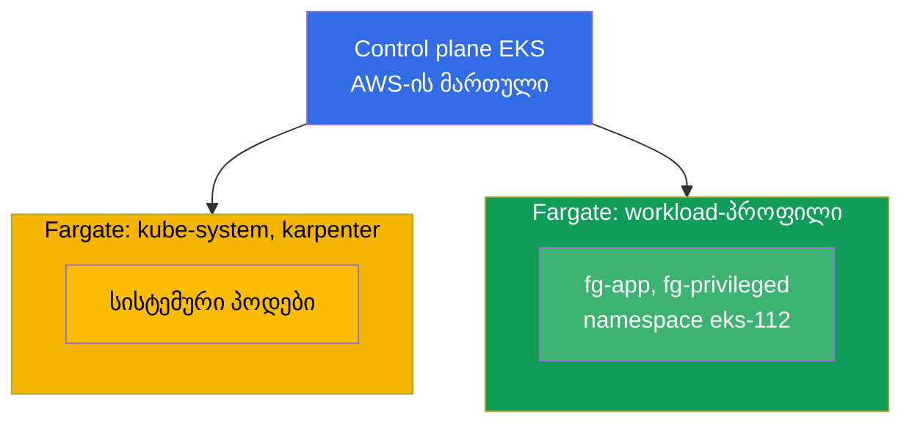
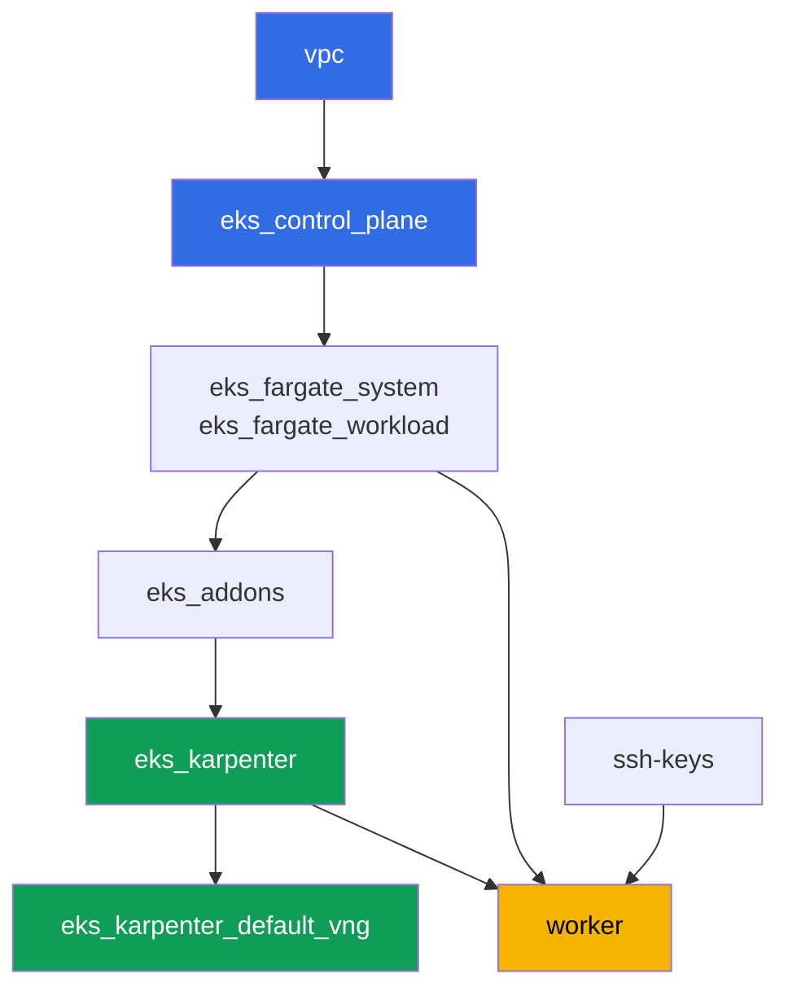

[Русская версия](README_RU.MD) · [Eng version](README.MD) · [Versión en español](README_ES.MD) · [Version française](README_FR.MD) · [Deutsche Version](README_DE.MD) · [繁體中文版](README_TW.MD) · [日本語版](README_JP.MD)

# ლაბა 112 - Fargate-პროფილები: რა მუშაობს, რა ტყდება, ღირებულების შედარება

## აღწერა

კლასტერი უკვე დეპლოირებულია როგორც კოდი, სისტემური პოდები მუშაობენ Fargate-ზე, ხოლო
სამუშაო ნოუდებს ამართავს Karpenter. ამ ლაბაში თქვენ ამატებთ მეორე Fargate-პროფილს საკუთარი
დატვირთვისთვის და ამოწმებთ ამ რეჯიმის საზღვრებს პრაქტიკაში: რომელი პოდები სტარტავს
ნორმალურად Fargate-ზე, რომელ რესურსების მოთხოვნებს ამრგვალებს Fargate და რამდენით, რა
აკრძალულია პრინციპში (privileged), და რით განსხვავდება Fargate-ის გადახდის მოდელი
node group-ის გადახდის მოდელისგან.

დავალებები დაწერილია production-სტილში: მოკლე დავალება პლუს მიღების კრიტერიუმები.
შემოწმება ავტომატურია, ბრძანებით `check_result`.

## მიზანი

გავამყაროთ კურსის ამ თავის მასალა:

- [თავი 15. Fargate: პროფილები, შეზღუდვები, ღირებულება, გამოყენების სცენარები](../../course/15/ge.md)

## რას ვქმნით

კლასტერი უკვე დეპლოირებულია. თქვენ ამატებთ დატვირთვის namespace-ს და ქმნით მასში პოდებს,
რომლებიც ამოწმებენ Fargate-ის სხვადასხვა კიდეებს: ნორმალურ სტარტს, ტევადობის დამრგვალებას,
privileged-ის აკრძალვას, ეფემერული დისკის გაფართოებას.

| ობიექტი | რა არის ეს | რისთვის ამ ლაბაში |
|--------|---------|-------------------|
| Fargate-პროფილი `workload` | ახალი კომპონენტი `eks_fargate_workload` | მატჩავს მთელ namespace `eks-112`-ს Fargate-ზე |
| Namespace `eks-112` | კლასტერის სექცია ლაბის დატვირთვისთვის | ხვდება პროფილ `workload`-ის სელექტორის ქვეშ |
| Deployment `fg-app` (2 რეპლიკა) | ping_pong აპლიკაცია, requests = limits | ვხედავთ Guaranteed-პოდს, რომელი რეალურად მუშაობს Fargate-ზე |
| არტეფაქტი `capacity.txt` | ანოტაცია `CapacityProvisioned` | ვხედავთ, რა ტევადობამდე დამრგვალა Fargate-მ მოთხოვნა |
| Pod `fg-privileged` + არტეფაქტი `privileged.txt` | პოდი `privileged: true`-ით | ვიჭერთ უარის სიმპტომს და ვხსნით Fargate-ის საზღვარს |
| `fg-app` `ephemeral-storage: 30Gi`-ით | გაფართოებული ეფემერული დისკი | ვამოწმებთ, რომ ნაგულისხმევ 20 GiB-ზე მეტიც Guaranteed-ია |
| არტეფაქტი `costmodel.txt` | გადახდის სტრუქტურის შედარება | ვაფიქსირებთ განსხვავებას Fargate-სა და node group-ს შორის |

კლასტერის საბოლოო სურათი:



## ინფრასტრუქტურა

გარემო დეპლოირდება AWS-ში (`eu-central-1`) Terragrunt-ის მეშვეობით. ლაბის ყოველი
დირექტორია ერთი კომპონენტია საკუთარი `terragrunt.hcl`-ით, რომელიც მიმართავს საერთო
მოდულს `terraform/modules/`-ში და აცხადებს დამოკიდებულებებს `dependency` ბლოკებით.
Terragrunt აწყობს დამოკიდებულებების გრაფს და აპლიკებს კომპონენტებს სწორი
თანმიმდევრობით.

### მოდულები და დამოკიდებულებები

| დირექტორია (კომპონენტი) | მოდული (`terraform/modules/`) | დამოკიდებულია | რას ქმნის |
|---------------------|-------------------------------|------------|-------------|
| `vpc` | `vpc_v3` | - | VPC `10.10.0.0/16`, საჯარო და პრივატული ქვექსელები ორ AZ-ში, NAT |
| `ssh-keys` | `ssh-keys` | - | SSH-გასაღებების წყვილი სამუშაო მანქანისა და ნოუდებისთვის |
| `eks_control_plane` | `eks_v2_control_plane` | `vpc` | control plane EKS `1.36`, OIDC, security groups |
| `eks_fargate_system` | `eks_v2_fargate` | `vpc`, `eks_control_plane` | Fargate-პროფილი `kube-system`-ისთვის და `karpenter`-ისთვის |
| `eks_fargate_workload` | `eks_v2_fargate` | `vpc`, `eks_control_plane` | Fargate-პროფილი `workload` namespace `eks-112`-ისთვის |
| `eks_addons` | `eks_v2_addons` | `eks_control_plane`, `eks_fargate_system` | დამატებები coredns, kube-proxy, vpc-cni, pod-identity |
| `eks_karpenter` | `eks_v2_karpenter` | `vpc`, `eks_control_plane`, `eks_addons`, `eks_fargate_system` | Karpenter-ის კონტროლერი, ნოუდების IAM-როლი |
| `eks_karpenter_default_vng` | `eks_v2_karpenter_vng` | `vpc`, `eks_control_plane`, `eks_karpenter` | ნაგულისხმევი NodePool `default` და EC2NodeClass AL2023-ზე |
| `worker` | `eks_v2_work_pc` | `ssh-keys`, `vpc`, `eks_control_plane`, `eks_karpenter`, `eks_fargate_workload` | სამუშაო მანქანა kubectl-ით, ტესტებით და `check_result`-ით |

დამოკიდებულებების გრაფი (რაც უფრო ადრე აპლიცირდება, ის ხრიხისკენ ქვემოთაა). სიცხადისთვის,
დიაგრამაზე კვანძი `fg` აერთიანებს ორივე Fargate-პროფილს - სისტემურს (`eks_fargate_system`)
და workload-ის პროფილს (`eks_fargate_workload`); ზემოთ ცხრილში ისინი ცალკე მწკრივებში არის:



პროფილი `workload` უნდა არსებობდეს, სანამ `eks-112`-ის პოდები კლასტერში გამოჩნდება,
ამიტომ `worker` აცხადებს დამოკიდებულებას `eks_fargate_workload`-ზე - Terragrunt აპლიცირებს
პროფილს უფრო ადრე, ვიდრე სტუდენტი სამუშაო მანქანაზე შექმნის თავის ობიექტებს.

### სად რა კონფიგურირდება

პარამეტრები გადანაწილებულია ორ დონეზე: საერთო `env.hcl` და თითოეული კომპონენტის
`inputs`.

`env.hcl` (გარემოს საერთო პარამეტრები, წაკითხული ყველა კომპონენტის მიერ):

| პარამეტრი | მნიშვნელობა ლაბაში | რაზე ახდენს გავლენას |
|----------|-----------------|---------------|
| `region` | `eu-central-1` | ყველა რესურსის რეგიონი |
| `vpc_default_cidr`, `subnets` | `10.10.0.0/16`, ქვექსელები AZ-ების მიხედვით | VPC-ის მისამართების გეგმა და ქვექსელების ტეგები |
| `prefix` | `eks-task112` | რესურსების სახელებისა და ტეგების პრეფიქსი |
| `stack_name` | `eks112` | მისგან იწყობა `env_name` - კლასტერის სახელი |
| `k8_version` | `1.36.0` | kubectl-ის ვერსია სამუშაო მანქანაზე |
| `instance_type_worker` | `t3.medium` | სამუშაო მანქანის instance-ის ტიპი |
| `ssh_password_enable`, `access_cidrs` | `true`, `0.0.0.0/0` | SSH-წვდომა სამუშაო მანქანაზე |
| `root_volume` | `gp3`, `10` | სამუშაო მანქანის root-დისკი |

`inputs` თითოეული კომპონენტის `terragrunt.hcl`-ში (კონკრეტული მოდულის პარამეტრები):

| ფაილი | ძირითადი პარამეტრები |
|------|--------------------|
| `eks_control_plane/terragrunt.hcl` | `eks.version = "1.36"`, პრივატული ქვექსელები ნოუდებისთვის |
| `eks_addons/terragrunt.hcl` | დამატებების ვერსიები 1.36-ისთვის: kube-proxy, coredns, vpc-cni, pod-identity |
| `eks_fargate_system/terragrunt.hcl` | სელექტორები `kube-system`, `karpenter` |
| `eks_fargate_workload/terragrunt.hcl` | `fargate.name = "workload"`, სელექტორი `namespace = "eks-112"` |
| `eks_karpenter/terragrunt.hcl` | Karpenter-ის ვერსია `1.8.1`, კონტროლერის რესურსები |
| `eks_karpenter_default_vng/terragrunt.hcl` | NodePool-ის `requirements`, `limits`, `disruption` |
| `worker/terragrunt.hcl` | `test_url` და `task_script_url` ლაბა 112-ის ფაილებზე, დამოკიდებულება `eks_fargate_workload`-ზე |

`eks_fargate_workload`-ის სელექტორი მატჩავს მხოლოდ `namespace = "eks-112"`-ს, `labels`-ის
გარეშე. ეს ნიშნავს, რომ ამ namespace-ში ნებისმიერი პოდი მთლიანად ხვდება Fargate-ზე -
გამონაკლისების გარეშე.

## განლაგება

```bash
TASK=112 make run_eks_task
```

განლაგება გრძელდება დაახლოებით 15-20 წუთი. output-ში მოძებნეთ ხაზი SSH-შეერთებით
სამუშაო მანქანასთან და დაუკავშირდით მას. kubectl იქ უკვე კონფიგურირებულია საჭირო
კლასტერზე.

სასარგებლო ბრძანებები სამუშაო მანქანაზე:

```bash
time_left       # რამდენი დრო დარჩა გარემოს
check_result    # გადამოწმება
```

> სტენდის უსაფრთხოება. `env.hcl`-ში ჩართულია `ssh_password_enable = true` და
> `access_cidrs = ["0.0.0.0/0"]` - ეს მოსახერხებელია სასწავლო გარემოსთვის, მაგრამ ასე არ
> უნდა გავხადოთ production-ში. კურსის სტანდარტების მიხედვით (თავები 0.2, 2, 19) სამუშაო
> მანქანებზე წვდომა იხსნება AWS SSM Session Manager-ის მეშვეობით, საჯარო SSH-პორტების
> გარეთ გამოტანის გარეშე, ხოლო `access_cidrs` ვიწროვდება კონკრეტულ მისამართებზე. აქ
> საჯარო SSH დარჩენილია მხოლოდ გაშვების გასამარტივებლად.

## დავალებები

---
|        **1**        | **Namespace ლაბის დატვირთვისთვის**                             |
| :-----------------: | :---------------------------------------------------------- |
| რას ვაკეთებთ          | შექმენით namespace სახელით `eks-112`. ის ხვდება Fargate-პროფილ `workload`-ის სელექტორის ქვეშ (სელექტორი მხოლოდ namespace-ია, labels-ის გარეშე), ამიტომ მასში ყველა პოდი ხვდება Fargate-ზე. |
| მიღების კრიტერიუმები    | - namespace `eks-112` არსებობს. |
---
|        **2**        | **Guaranteed-პოდი Fargate-ზე**                                |
| :-----------------: | :---------------------------------------------------------- |
| რას ვაკეთებთ          | Namespace `eks-112`-ში შექმენით Deployment `fg-app`, image `viktoruj/ping_pong:latest`, `2` რეპლიკა. კონტეინერის `resources.requests` და `resources.limits` უნდა იყოს ტოლი, მაგალითად `cpu: 500m`, `memory: 1Gi` - Fargate მოითხოვს, რომ პოდი იყოს `Guaranteed`. დაელოდეთ, სანამ ყველა რეპლიკა გახდება მზა, და დარწმუნდით, რომ პოდები ხვდებიან ნოუდზე `fargate-...`, არა `ip-...`-ზე. |
| მიღების კრიტერიუმები    | - Deployment `fg-app` `eks-112`-ში, image `viktoruj/ping_pong`;<br/>- `2` მზა რეპლიკა;<br/>- `requests.cpu == limits.cpu`;<br/>- ყოველი პოდის ნოუდის სახელი იწყება `fargate-`-ით. |
---
|        **3**        | **რეალურად გამოყოფილი ტევადობა**                                 |
| :-----------------: | :---------------------------------------------------------- |
| რას ვაკეთებთ          | Fargate ამრგვალებს მოთხოვნას ერთ-ერთ ფიქსირებულ vCPU/მეხსიერების კომბინაციამდე, ამატებს `256 MB`-ს სისტემურ კომპონენტებზე (`kubelet`, `kube-proxy`, `containerd`). აიღეთ ნებისმიერი `fg-app` პოდი და შეინახეთ ანოტაცია `CapacityProvisioned` ფაილში `/var/work/tests/artifacts/3/capacity.txt`.<br/>ფორმატის მინიშნება: `kubectl get pod <pod> -n eks-112 -o jsonpath='{.metadata.annotations.CapacityProvisioned}'` - ფაილში უნდა დარჩეს ხაზი ტიპის `0.5vCPU 1GB`. |
| მიღების კრიტერიუმები    | - ფაილი არ არის ცარიელი;<br/>- შეიცავს `vCPU`-ს და `GB`-ს. |
---
|        **4**        | **სიმპტომი: privileged-პოდი არ სტარტავს**                   |
| :-----------------: | :---------------------------------------------------------- |
| რას ვაკეთებთ          | Fargate არ უჭერს მხარს პრივილეგირებულ კონტეინერებს. `eks-112`-ში შექმენით Pod `fg-privileged` (image `viktoruj/ping_pong:latest`) `securityContext.privileged: true`-ით. პოდი არ უნდა გადავიდეს `Running`-ში. გაარკვიეთ მიზეზი `kubectl describe pod fg-privileged -n eks-112`-ის მეშვეობით (სექცია `Events`) და შეინახეთ განმარტება ფაილში `/var/work/tests/artifacts/4/privileged.txt`. ტექსტში უნდა იყოს სიტყვები `privileged` და `Fargate`. |
| მიღების კრიტერიუმები    | - Pod `fg-privileged` `eks-112`-ში არ არის `Running` მდგომარეობაში;<br/>- ფაილი `/var/work/tests/artifacts/4/privileged.txt` არ არის ცარიელი და შეიცავს სიტყვებს `privileged` და `Fargate`. |
---
|        **5**        | **ეფემერული დისკის გაფართოება**                               |
| :-----------------: | :---------------------------------------------------------- |
| რას ვაკეთებთ          | ნაგულისხმევად Fargate გამოყოფს `20 GiB` ეფემერულ დისკს. ხელახლა შექმენით `fg-app` `resources.requests.ephemeral-storage`-ით და `resources.limits.ephemeral-storage`-ით, ორივე `30Gi`-ის ტოლი (requests უნდა უტოლდებოდეს limits-ს, როგორც cpu/memory-სთვის). დარწმუნდით, რომ პოდი ჩვეულებრივად სტარტავს. |
| მიღების კრიტერიუმები    | - Deployment `fg-app`-ს აქვს `ephemeral-storage` `30Gi` როგორც `requests`-ში, ისევე `limits`-ში;<br/>- `fg-app`-ის მინიმუმ ერთი რეპლიკა მზადაა. |
---
|        **6**        | **ღირებულების სტრუქტურა: Fargate და node group**            |
| :-----------------: | :---------------------------------------------------------- |
| რას ვაკეთებთ          | აღწერეთ გადახდის მოდელის განსხვავება `3-5` წინადადებაში: Fargate ტარიფდება vCPU-სა და მეხსიერებაზე თვითონ ᲙᲘ პოდის მიხედვით, მისი ცხოვრების ხანგრძლივობის განმავლობაში, უსაქმური ტევადობის გადასახადის გარეშე; node group ტარიფდება მთელ ინსტანსზე, იმ დროის ჩათვლით, როცა ის არასრულად არის დატვირთული. შეინახეთ ტექსტი ფაილში `/var/work/tests/artifacts/6/costmodel.txt`. დოლარებში ჯამების გარეშე - მხოლოდ ტარიფიკაციის სტრუქტურა. ავტომატური შემოწმება ეძებს სიტყვას `pod`-ს `vCPU`-ს გვერდით, ამიტომ დარწმუნდით, რომ თქვენი განმარტება შეიცავს როგორც `pod`-ს, ისე `vCPU`-ს. |
| მიღების კრიტერიუმები    | - ფაილი არ არის ცარიელი;<br/>- შეიცავს `vCPU`-ს, `pod`-ს და `node group`-ს. |
---

## შედეგის შემოწმება

სამუშაო მანქანაზე გაუშვით ავტომატური შემოწმება:

```bash
check_result
```

სკრიპტი გაუშვებს ტესტებს და გამოაჩენს შესრულებული დავალებების პროცენტს.

## გადაწყვეტა

ეტალონური გადაწყვეტა: [worker/files/solutions/1_GE.MD](worker/files/solutions/1_GE.MD)

## კლასტერისა და რესურსების წაშლა

> **ჯერ მოხსენით დატვირთვა და დაელოდეთ, სანამ Fargate-პოდები არ გაქრება, მხოლოდ მერე
> დაანგრიეთ სტენდი.** მთელი `eks-112`-ის დატვირთვა ცხოვრობს Fargate-ზე, ეს ლაბა არ
> ამართავს Karpenter-ის EC2-ნოუდებს - აქ VPC CNI-ის მიერ დაუპატრონებელი ENI-ის რისკი არ
> არსებობს. მაგრამ არსებობს სხვა რისკი: AWS არ აძლევს უფლებას წაშალოთ Fargate-პროფილი,
> სანამ მასზე მუშა პოდები არსებობს (`terraform destroy` კომპონენტ `eks_fargate_workload`-ზე
> ჩავარდება შეცდომით, რომ პროფილი კვლავ გამოიყენება).

```bash
# 1. ლაბის დატვირთვის მოხსნა (fg-app, fg-privileged) და დაელოდეთ, სანამ Fargate-პოდები არ გაქრება
kubectl delete namespace eks-112 --ignore-not-found
while kubectl get pods -A -o wide 2>/dev/null | grep -q 'eks-112'; do
  echo "eks-112-ის პოდები ჯერ კიდევ ჩერდება, ველოდებით..."; sleep 10
done
```

მხოლოდ ამის შემდეგ დაანგრიეთ სტენდი:

```bash
TASK=112 make delete_eks_task
```

თუ `destroy` მაინც ჩავარდა კომპონენტ `eks_fargate_workload`-ზე შეცდომით აქტიური პოდების
შესახებ, ესე იგი namespace ბოლომდე არ წაშლილა - შეამოწმეთ `kubectl get pods -n eks-112` და
გაიმეორეთ `TASK=112 make delete_eks_task`, როცა პოდები არ დარჩება.
