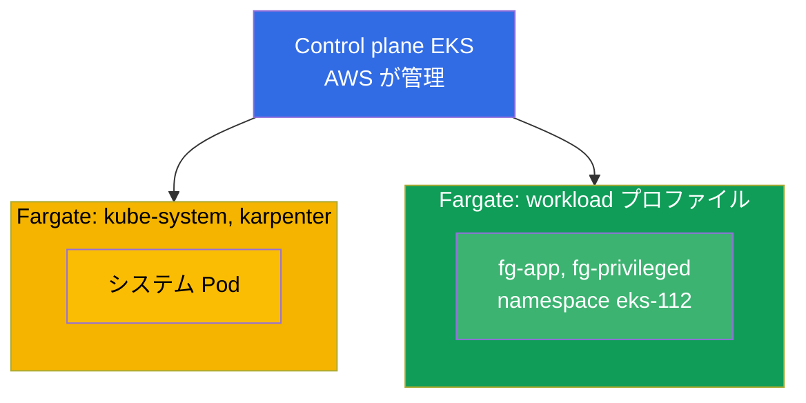
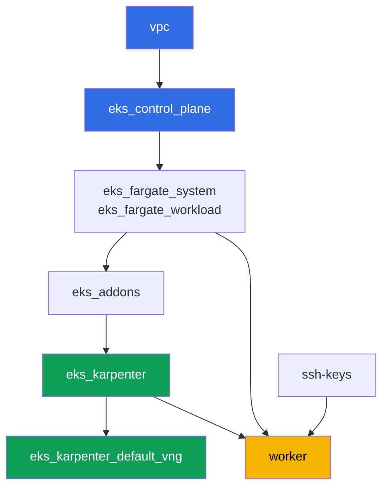

[Русская версия](README_RU.MD) · [Eng version](README.MD) · [Versión en español](README_ES.MD) · [Version française](README_FR.MD) · [Deutsche Version](README_DE.MD) · [ქართული ვერსია](README_GE.MD) · [繁體中文版](README_TW.MD)

# ラボ 112 - Fargate プロファイル:何が動き、何が壊れるか、コスト比較

## 説明

クラスタは既にコードとしてデプロイされており、システム Pod は Fargate 上で、ワーカー
ノードは Karpenter によって立ち上げられます。このラボでは、自分のワークロード用に 2
つ目の Fargate プロファイルを追加し、このモードの境界を実践的に確認します。どの Pod が
Fargate 上で正常に起動するか、どのリソースリクエストを Fargate がどこまで切り上げる
か、原則として何が禁止されているか(privileged)、そして Fargate の課金モデルが node
group の課金モデルとどう異なるかを見ていきます。

タスクは production スタイルで書かれています:短い課題文とアクセプタンス基準。検証は
`check_result` コマンドによって自動的に行われます。

## 目的

コースの以下の章の内容を定着させます:

- [第 15 章。Fargate:プロファイル、制限、コスト、利用シナリオ](../../course/15/ru.md)

## 作成するもの

このラボでは、クラスタは既にデプロイ済みです。ワークロード用の namespace を追加し、
その中に Fargate のさまざまな側面を確かめる Pod を作成します:正常な起動、キャパシティ
の切り上げ、privileged の禁止、エフェメラルディスクの拡張。

| オブジェクト | 何か | このラボでの目的 |
|--------|---------|-------------------|
| Fargate プロファイル `workload` | 新しいコンポーネント `eks_fargate_workload` | namespace `eks-112` 全体を Fargate にマッチさせる |
| Namespace `eks-112` | ラボのワークロード用のクラスタ区画 | `workload` プロファイルのセレクタの対象になる |
| Deployment `fg-app`(2 レプリカ) | ping_pong アプリケーション、requests = limits | Guaranteed Pod が実際に Fargate 上で動いていることを確認する |
| アーティファクト `capacity.txt` | `CapacityProvisioned` アノテーション | Fargate がリクエストをどのキャパシティに切り上げたかを確認する |
| Pod `fg-privileged` + アーティファクト `privileged.txt` | `privileged: true` を持つ Pod | 拒否される症状を捉え、Fargate の境界を説明する |
| `ephemeral-storage: 30Gi` を持つ `fg-app` | 拡張されたエフェメラルディスク | デフォルトの 20 GiB を超える場合も Guaranteed であることを確認する |
| アーティファクト `costmodel.txt` | 課金構造の比較 | Fargate と node group の違いを記録する |

クラスタの最終的な構成図:



## インフラストラクチャ

環境は Terragrunt によって AWS(`eu-central-1`)にデプロイされます。ラボの各ディレクト
リは 1 つのコンポーネントであり、それぞれ独自の `terragrunt.hcl` を持ち、
`terraform/modules/` の共有モジュールを参照し、`dependency` ブロックで依存関係を宣言
します。Terragrunt は依存関係グラフを構築し、正しい順序でコンポーネントを適用します。

### モジュールと依存関係

| ディレクトリ(コンポーネント) | モジュール(`terraform/modules/`) | 依存先 | 作成されるもの |
|---------------------|-------------------------------|------------|-------------|
| `vpc` | `vpc_v3` | - | VPC `10.10.0.0/16`、2 つの AZ にあるパブリックとプライベートのサブネット、NAT |
| `ssh-keys` | `ssh-keys` | - | ワーカーマシンとノード用の SSH キーペア |
| `eks_control_plane` | `eks_v2_control_plane` | `vpc` | EKS control plane `1.36`、OIDC、security groups |
| `eks_fargate_system` | `eks_v2_fargate` | `vpc`、`eks_control_plane` | `kube-system` と `karpenter` 用の Fargate profile |
| `eks_fargate_workload` | `eks_v2_fargate` | `vpc`、`eks_control_plane` | namespace `eks-112` 用の Fargate profile `workload` |
| `eks_addons` | `eks_v2_addons` | `eks_control_plane`、`eks_fargate_system` | coredns、kube-proxy、vpc-cni、pod-identity のアドオン |
| `eks_karpenter` | `eks_v2_karpenter` | `vpc`、`eks_control_plane`、`eks_addons`、`eks_fargate_system` | Karpenter コントローラ、ノードの IAM ロール |
| `eks_karpenter_default_vng` | `eks_v2_karpenter_vng` | `vpc`、`eks_control_plane`、`eks_karpenter` | デフォルトの NodePool `default` と AL2023 上の EC2NodeClass |
| `worker` | `eks_v2_work_pc` | `ssh-keys`、`vpc`、`eks_control_plane`、`eks_karpenter`、`eks_fargate_workload` | kubectl、テスト、`check_result` を備えたワーカーマシン |

依存関係グラフ(先に適用されるものほど矢印の下側にある)。分かりやすくするため、図の中
のノード `fg` は 2 つの Fargate プロファイル(システム用の `eks_fargate_system` とワー
クロード用の `eks_fargate_workload`)をまとめて表示しています。上の表ではそれぞれ別の
行として分けています:



`workload` プロファイルは、クラスタに `eks-112` の Pod が現れる前に存在していなければ
ならないため、`worker` は `eks_fargate_workload` への依存を宣言しています。これにより
Terragrunt は、学生がワーカーマシン上で自分のオブジェクトを作成する前にこのプロファイ
ルを適用します。

### どこで何が設定されるか

設定は 2 つのレベルに分かれています:共通の `env.hcl` と各コンポーネントの `inputs`。

`env.hcl`(すべてのコンポーネントが読み込む共通の環境パラメータ):

| パラメータ | ラボでの値 | 影響範囲 |
|----------|-----------------|---------------|
| `region` | `eu-central-1` | すべてのリソースのリージョン |
| `vpc_default_cidr`、`subnets` | `10.10.0.0/16`、AZ ごとのサブネット | VPC のアドレス計画とサブネットのタグ |
| `prefix` | `eks-task112` | リソース名とタグのプレフィックス |
| `stack_name` | `eks112` | ここから `env_name`(クラスタ名)が組み立てられる |
| `k8_version` | `1.36.0` | ワーカーマシン上の kubectl のバージョン |
| `instance_type_worker` | `t3.medium` | ワーカーマシンのインスタンスタイプ |
| `ssh_password_enable`、`access_cidrs` | `true`、`0.0.0.0/0` | ワーカーマシンへの SSH アクセス |
| `root_volume` | `gp3`、`10` | ワーカーマシンのルートディスク |

各コンポーネントの `terragrunt.hcl` の `inputs`(そのモジュール固有のパラメータ):

| ファイル | 主な設定 |
|------|--------------------|
| `eks_control_plane/terragrunt.hcl` | `eks.version = "1.36"`、ノード用のプライベートサブネット |
| `eks_addons/terragrunt.hcl` | 1.36 用のアドオンバージョン:kube-proxy、coredns、vpc-cni、pod-identity |
| `eks_fargate_system/terragrunt.hcl` | セレクタ `kube-system`、`karpenter` |
| `eks_fargate_workload/terragrunt.hcl` | `fargate.name = "workload"`、セレクタ `namespace = "eks-112"` |
| `eks_karpenter/terragrunt.hcl` | Karpenter のバージョン `1.8.1`、コントローラのリソース |
| `eks_karpenter_default_vng/terragrunt.hcl` | NodePool の `requirements`、`limits`、`disruption` |
| `worker/terragrunt.hcl` | ラボ 112 のファイルを指す `test_url` と `task_script_url`、`eks_fargate_workload` への依存 |

`eks_fargate_workload` のセレクタは `namespace = "eks-112"` のみにマッチし、`labels`
はありません。つまり、この namespace の中のどの Pod も、例外なく全体が Fargate に配置
されます。

## デプロイ

```bash
TASK=112 make run_eks_task
```

デプロイには約 15-20 分かかります。出力の中からワーカーマシンへの SSH 接続の行を見つけ
て接続してください。そこでは kubectl が既に正しいクラスタ向けに設定されています。

ワーカーマシン上で使える便利なコマンド:

```bash
time_left       # 環境の残り時間
check_result    # 解答の確認
```

> 検証環境のセキュリティについて。`env.hcl` では `ssh_password_enable = true` と
> `access_cidrs = ["0.0.0.0/0"]` が有効になっています。学習用環境としては便利ですが、
> 本番環境ではこのようにしてはいけません。コースの標準(第 0.2、2、19 章)によれば、
> ワーカーマシンへのアクセスは公開 SSH ポートを外に出さずに AWS SSM Session Manager を
> 経由して開き、`access_cidrs` は具体的なアドレスに絞り込みます。ここでは、セットアップ
> を簡単にするためだけに公開 SSH を残しています。

## タスク

---
|        **1**        | **ラボのワークロード用の Namespace**                             |
| :-----------------: | :---------------------------------------------------------- |
| やること          | `eks-112` という名前の namespace を作成してください。これは Fargate プロファイル `workload` のセレクタの対象になります(セレクタは namespace のみでラベルはありません)、そのためこの中のすべての Pod は Fargate に配置されます。 |
| アクセプタンス基準    | - namespace `eks-112` が存在する。 |
---
|        **2**        | **Fargate 上の Guaranteed Pod**                                |
| :-----------------: | :---------------------------------------------------------- |
| やること          | namespace `eks-112` に Deployment `fg-app` を作成してください。イメージは `viktoruj/ping_pong:latest`、レプリカ数は `2` です。コンテナの `resources.requests` と `resources.limits` は等しくなければなりません。例えば `cpu: 500m`、`memory: 1Gi` です - Fargate は Pod が `Guaranteed` であることを要求します。すべてのレプリカが Ready になるまで待ち、Pod が `ip-...` ではなく `fargate-...` ノードに配置されていることを確認してください。 |
| アクセプタンス基準    | - `eks-112` に Deployment `fg-app`、イメージ `viktoruj/ping_pong`;<br/>- `2` 個の Ready なレプリカ;<br/>- `requests.cpu == limits.cpu`;<br/>- 各 Pod のノード名が `fargate-` で始まること。 |
---
|        **3**        | **実際に割り当てられたキャパシティ**                                 |
| :-----------------: | :---------------------------------------------------------- |
| やること          | Fargate はリクエストを固定された vCPU/メモリの組み合わせのいずれかに切り上げ、システムコンポーネント(`kubelet`、`kube-proxy`、`containerd`)用に `256 MB` を追加します。任意の `fg-app` Pod を選び、`CapacityProvisioned` アノテーションを `/var/work/tests/artifacts/3/capacity.txt` に保存してください。<br/>フォーマットのヒント:`kubectl get pod <pod> -n eks-112 -o jsonpath='{.metadata.annotations.CapacityProvisioned}'` - ファイルには `0.5vCPU 1GB` のような行が残るはずです。 |
| アクセプタンス基準    | - ファイルが空でないこと;<br/>- `vCPU` と `GB` を含むこと。 |
---
|        **4**        | **症状:privileged Pod が起動しない**                   |
| :-----------------: | :---------------------------------------------------------- |
| やること          | Fargate は privileged コンテナをサポートしていません。`eks-112` に `securityContext.privileged: true` を持つ Pod `fg-privileged`(イメージ `viktoruj/ping_pong:latest`)を作成してください。この Pod は `Running` に到達してはいけません。`kubectl describe pod fg-privileged -n eks-112`(`Events` セクション)で原因を調べ、その説明を `/var/work/tests/artifacts/4/privileged.txt` に保存してください。本文には `privileged` と `Fargate` という単語を含める必要があります。 |
| アクセプタンス基準    | - `eks-112` の Pod `fg-privileged` が `Running` 状態でないこと;<br/>- ファイル `/var/work/tests/artifacts/4/privileged.txt` が空でなく、`privileged` と `Fargate` という単語を含むこと。 |
---
|        **5**        | **エフェメラルディスクの拡張**                               |
| :-----------------: | :---------------------------------------------------------- |
| やること          | デフォルトでは Fargate は `20 GiB` のエフェメラルディスクを提供します。`fg-app` を、`resources.requests.ephemeral-storage` と `resources.limits.ephemeral-storage` の両方を `30Gi` に設定して再作成してください(cpu/memory と同様に requests は limits と等しくなければなりません)。Pod が正常に起動することを確認してください。 |
| アクセプタンス基準    | - Deployment `fg-app` の `requests` と `limits` の両方に `ephemeral-storage` `30Gi` が設定されていること;<br/>- `fg-app` のレプリカが少なくとも 1 つ Ready であること。 |
---
|        **6**        | **コスト構造:Fargate 対 node group**            |
| :-----------------: | :---------------------------------------------------------- |
| やること          | 課金モデルの違いを `3-5` 文で説明してください:Fargate は POD 自体の vCPU とメモリに対して、その稼働時間だけ課金し、アイドル状態のキャパシティには課金しません。node group はインスタンス全体に対して課金し、それが十分に利用されていない時間も含まれます。テキストを `/var/work/tests/artifacts/6/costmodel.txt` に保存してください。ドルの金額は不要です - 課金の構造だけを記述してください。自動チェックは `vCPU` の隣にある単語 `pod` を探すので、説明に `pod` と `vCPU` の両方を含めるようにしてください。 |
| アクセプタンス基準    | - ファイルが空でないこと;<br/>- `vCPU`、`pod`、`node group` を含むこと。 |
---

## 結果の確認

ワーカーマシン上で自動チェックを実行してください:

```bash
check_result
```

スクリプトがテストを実行し、完了したタスクの割合を表示します。

## 解答

参考解答:[worker/files/solutions/1_JP.MD](worker/files/solutions/1_JP.MD)

## クラスタとリソースの削除

> **まずワークロードを外し、Fargate Pod がいなくなるのを待ってから、環境を破棄してくだ
> さい。** `eks-112` のワークロードはすべて Fargate 上で動いており、このラボは
> Karpenter の EC2 ノードを一切立ち上げません - そのため、ここでは VPC CNI の孤立 ENI
> のリスクはありません。しかし別のリスクがあります。Fargate プロファイル上でまだ Pod
> が動いている間は、AWS はそのプロファイルの削除を許可しません(コンポーネント
> `eks_fargate_workload` に対する `terraform destroy` は、プロファイルがまだ使用中であ
> るというエラーで失敗します)。

```bash
# 1. ラボのワークロード(fg-app、fg-privileged)を外し、Fargate Pod がいなくなるのを待つ
kubectl delete namespace eks-112 --ignore-not-found
while kubectl get pods -A -o wide 2>/dev/null | grep -q 'eks-112'; do
  echo "eks-112 の Pod はまだ終了処理中です、待機中..."; sleep 10
done
```

これが終わってから、環境を破棄してください:

```bash
TASK=112 make delete_eks_task
```

それでも `destroy` が `eks_fargate_workload` コンポーネントでアクティブな Pod に関する
エラーで失敗する場合は、namespace の削除が完全に終わっていません。`kubectl get pods -n
eks-112` を確認し、Pod が残っていない状態になってから `TASK=112 make delete_eks_task`
を再実行してください。
