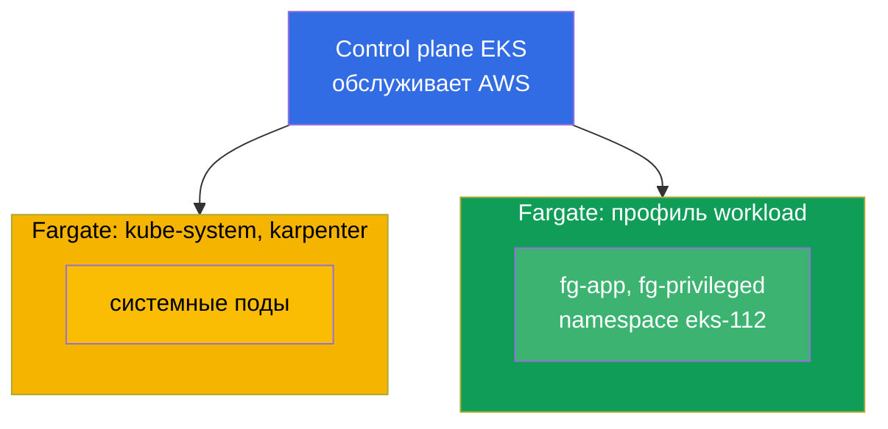
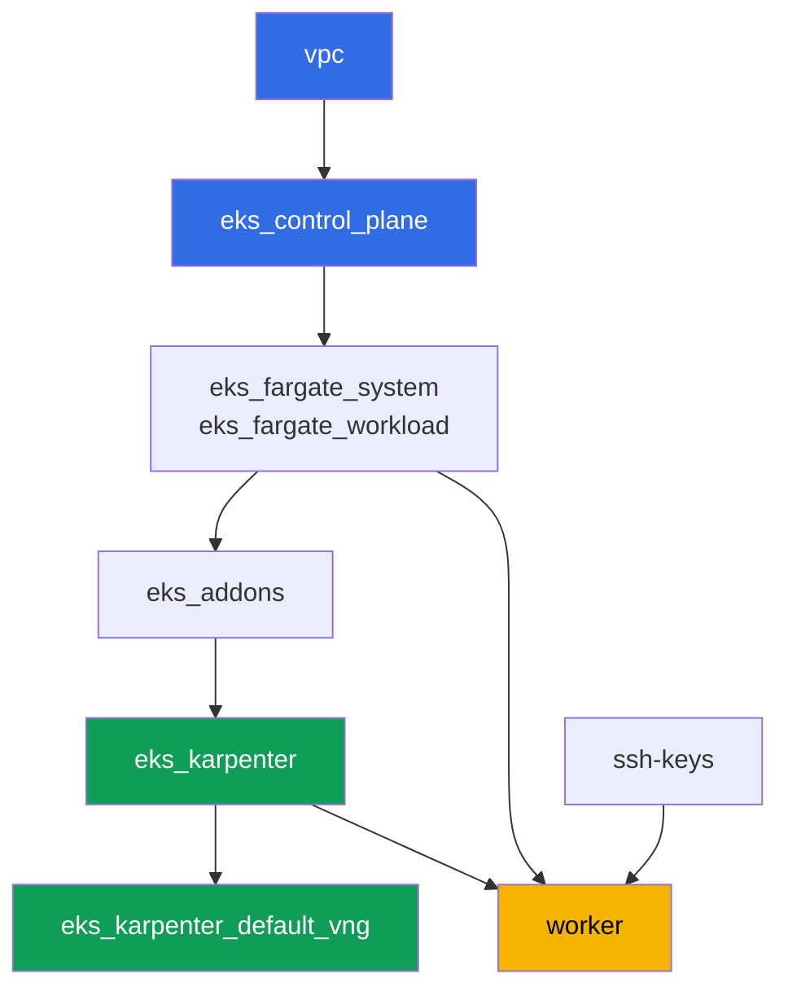

# Лаба 112 - Fargate-профили: что работает, что ломается, сравнение стоимости

## Описание

Кластер уже развёрнут как код, системные поды идут на Fargate, а рабочие ноды поднимает
Karpenter. В этой лабе вы добавляете второй Fargate-профиль под собственную нагрузку и
проверяете границы этого режима на практике: какие поды на Fargate стартуют нормально,
какие запросы ресурсов Fargate округляет и до чего, что запрещено в принципе (privileged),
и чем модель оплаты Fargate отличается от модели оплаты node group.

Задания в продакшн-стиле: короткая постановка плюс критерии приёмки. Проверка -
автоматическая, командой `check_result`.

## Цель

Закрепить материал главы курса:

- [Глава 15. Fargate: профили, ограничения, стоимость, сценарии применения](../../course/15/ru.md)

## Что мы создаём

Кластер уже развёрнут. Вы добавляете namespace нагрузки и создаёте в нём поды, которые
проверяют разные грани Fargate: нормальный запуск, округление ёмкости, запрет privileged,
расширение эфемерного диска.

| Объект | Что это | Зачем в этой лабе |
|--------|---------|-------------------|
| Fargate-профиль `workload` | новый компонент `eks_fargate_workload` | матчит весь namespace `eks-112` на Fargate |
| Namespace `eks-112` | раздел кластера под нагрузку лабы | попадает под селектор профиля `workload` |
| Deployment `fg-app` (2 реплики) | приложение ping_pong, requests = limits | видим Guaranteed-под, реально запущенный на Fargate |
| Артефакт `capacity.txt` | аннотация `CapacityProvisioned` | видим, до какой ёмкости Fargate округлил запрос |
| Pod `fg-privileged` + артефакт `privileged.txt` | под с `privileged: true` | ловим симптом отказа и объясняем границу Fargate |
| `fg-app` с `ephemeral-storage: 30Gi` | расширенный эфемерный диск | проверяем, что больше 20 GiB по умолчанию тоже Guaranteed |
| Артефакт `costmodel.txt` | сравнение структуры оплаты | фиксируем разницу Fargate против node group |

Итоговая картина кластера:



## Инфраструктура

Окружение разворачивается в AWS (`eu-central-1`) через Terragrunt. Каждый каталог лабы -
это один компонент со своим `terragrunt.hcl`, который ссылается на общий модуль в
`terraform/modules/` и объявляет зависимости через блоки `dependency`. Terragrunt строит
граф зависимостей и применяет компоненты в правильном порядке.

### Модули и зависимости

| Каталог (компонент) | Модуль (`terraform/modules/`) | Зависит от | Что создаёт |
|---------------------|-------------------------------|------------|-------------|
| `vpc` | `vpc_v3` | - | VPC `10.10.0.0/16`, публичные и приватные подсети в двух AZ, NAT |
| `ssh-keys` | `ssh-keys` | - | пара SSH-ключей для рабочей машины и нод |
| `eks_control_plane` | `eks_v2_control_plane` | `vpc` | control plane EKS `1.36`, OIDC, security groups |
| `eks_fargate_system` | `eks_v2_fargate` | `vpc`, `eks_control_plane` | Fargate-профиль для `kube-system` и `karpenter` |
| `eks_fargate_workload` | `eks_v2_fargate` | `vpc`, `eks_control_plane` | Fargate-профиль `workload` для namespace `eks-112` |
| `eks_addons` | `eks_v2_addons` | `eks_control_plane`, `eks_fargate_system` | аддоны coredns, kube-proxy, vpc-cni, pod-identity |
| `eks_karpenter` | `eks_v2_karpenter` | `vpc`, `eks_control_plane`, `eks_addons`, `eks_fargate_system` | контроллер Karpenter, IAM-роль нод |
| `eks_karpenter_default_vng` | `eks_v2_karpenter_vng` | `vpc`, `eks_control_plane`, `eks_karpenter` | дефолтный NodePool `default` и EC2NodeClass на AL2023 |
| `worker` | `eks_v2_work_pc` | `ssh-keys`, `vpc`, `eks_control_plane`, `eks_karpenter`, `eks_fargate_workload` | рабочая машина с kubectl, тестами и `check_result` |

Граф зависимостей (что применяется раньше, то ниже по стрелке). Для наглядности узел `fg`
на диаграмме объединяет оба Fargate-профиля - системный (`eks_fargate_system`) и
профиль нагрузки (`eks_fargate_workload`), в таблице выше они разведены по строкам:



Профиль `workload` должен существовать до того, как в кластере появляются поды `eks-112`,
поэтому `worker` объявляет зависимость от `eks_fargate_workload` - Terragrunt применит
профиль раньше, чем студент на рабочей машине создаст свои объекты.

### Где что настраивается

Настройки разнесены по двум уровням: общий `env.hcl` и `inputs` каждого компонента.

`env.hcl` (общие параметры окружения, читаются всеми компонентами):

| Параметр | Значение в лабе | На что влияет |
|----------|-----------------|---------------|
| `region` | `eu-central-1` | регион всех ресурсов |
| `vpc_default_cidr`, `subnets` | `10.10.0.0/16`, подсети по AZ | адресный план VPC и теги подсетей |
| `prefix` | `eks-task112` | префикс имён ресурсов и тегов |
| `stack_name` | `eks112` | из него собирается `env_name` - имя кластера |
| `k8_version` | `1.36.0` | версия kubectl на рабочей машине |
| `instance_type_worker` | `t3.medium` | тип инстанса рабочей машины |
| `ssh_password_enable`, `access_cidrs` | `true`, `0.0.0.0/0` | доступ по SSH к рабочей машине |
| `root_volume` | `gp3`, `10` | корневой диск рабочей машины |

`inputs` в `terragrunt.hcl` каждого компонента (параметры конкретного модуля):

| Файл | Ключевые настройки |
|------|--------------------|
| `eks_control_plane/terragrunt.hcl` | `eks.version = "1.36"`, приватные подсети под ноды |
| `eks_addons/terragrunt.hcl` | версии аддонов под 1.36: kube-proxy, coredns, vpc-cni, pod-identity |
| `eks_fargate_system/terragrunt.hcl` | селекторы `kube-system`, `karpenter` |
| `eks_fargate_workload/terragrunt.hcl` | `fargate.name = "workload"`, селектор `namespace = "eks-112"` |
| `eks_karpenter/terragrunt.hcl` | версия Karpenter `1.8.1`, ресурсы контроллера |
| `eks_karpenter_default_vng/terragrunt.hcl` | `requirements` NodePool, `limits`, `disruption` |
| `worker/terragrunt.hcl` | `test_url` и `task_script_url` на файлы лабы 112, зависимость от `eks_fargate_workload` |

Селектор `eks_fargate_workload` матчит только `namespace = "eks-112"`, без `labels`.
Это значит, что любой под в этом namespace попадает на Fargate целиком - без исключений.

## Развёртывание

```bash
TASK=112 make run_eks_task
```

Развёртывание занимает примерно 15-20 минут. В выводе найдите строку с SSH-подключением к
рабочей машине и подключитесь к ней. kubectl там уже настроен на нужный кластер.

Полезные команды на рабочей машине:

```bash
time_left       # сколько осталось времени окружения
check_result    # проверить решение
```

> Безопасность стенда. В `env.hcl` включены `ssh_password_enable = true` и
> `access_cidrs = ["0.0.0.0/0"]` - это удобно для учебного окружения, но так делать в
> продакшене нельзя. По стандартам курса (главы 0.2, 2, 19) доступ к рабочим машинам
> открывают через AWS SSM Session Manager без публичных SSH-портов наружу, а `access_cidrs`
> сужают до конкретных адресов. Здесь публичный SSH оставлен только ради простоты запуска.

## Задания

---
|        **1**        | **Namespace для нагрузки лабы**                             |
| :-----------------: | :---------------------------------------------------------- |
| Что делаем          | Создайте namespace с именем `eks-112`. Он попадает под селектор Fargate-профиля `workload` (селектор - только namespace, без labels), поэтому все поды внутри него уходят на Fargate. |
| Критерии приёмки    | - namespace `eks-112` существует. |
---
|        **2**        | **Guaranteed-под на Fargate**                                |
| :-----------------: | :---------------------------------------------------------- |
| Что делаем          | В namespace `eks-112` создайте Deployment `fg-app`, образ `viktoruj/ping_pong:latest`, `2` реплики. У контейнера `resources.requests` и `resources.limits` должны быть РАВНЫ, например `cpu: 500m`, `memory: 1Gi` - Fargate требует, чтобы под был `Guaranteed`. Дождитесь готовности всех реплик и убедитесь, что поды идут на ноду `fargate-...`, а не `ip-...`. |
| Критерии приёмки    | - Deployment `fg-app` в `eks-112`, образ `viktoruj/ping_pong`;<br/>- `2` готовые реплики;<br/>- `requests.cpu == limits.cpu`;<br/>- имя ноды каждого пода начинается с `fargate-`. |
---
|        **3**        | **Реально выданная ёмкость**                                 |
| :-----------------: | :---------------------------------------------------------- |
| Что делаем          | Fargate округляет запрос до одной из фиксированных комбинаций vCPU и памяти, добавляя `256 MB` на системные компоненты (`kubelet`, `kube-proxy`, `containerd`). Возьмите любой под `fg-app` и сохраните аннотацию `CapacityProvisioned` в файл `/var/work/tests/artifacts/3/capacity.txt`.<br/>Подсказка по формату: `kubectl get pod <pod> -n eks-112 -o jsonpath='{.metadata.annotations.CapacityProvisioned}'` - в файле должна остаться строка вида `0.5vCPU 1GB`. |
| Критерии приёмки    | - файл не пуст;<br/>- содержит `vCPU` и `GB`. |
---
|        **4**        | **Симптом: privileged-под не запускается**                   |
| :-----------------: | :---------------------------------------------------------- |
| Что делаем          | Fargate не поддерживает привилегированные контейнеры. В `eks-112` создайте Pod `fg-privileged` (образ `viktoruj/ping_pong:latest`) с `securityContext.privileged: true`. Под НЕ должен перейти в `Running`. Разберите причину через `kubectl describe pod fg-privileged -n eks-112` (секция `Events`) и сохраните объяснение в файл `/var/work/tests/artifacts/4/privileged.txt`. В тексте обязательно должны быть слова `privileged` и `Fargate`. |
| Критерии приёмки    | - Pod `fg-privileged` в `eks-112` не в состоянии `Running`;<br/>- файл `/var/work/tests/artifacts/4/privileged.txt` не пуст и содержит слова `privileged` и `Fargate`. |
---
|        **5**        | **Расширение эфемерного диска**                               |
| :-----------------: | :---------------------------------------------------------- |
| Что делаем          | По умолчанию Fargate выдаёт `20 GiB` эфемерного диска. Пересоздайте `fg-app` с `resources.requests.ephemeral-storage` и `resources.limits.ephemeral-storage`, равными `30Gi` (requests должны равняться limits, как и для cpu/memory). Убедитесь, что под запускается нормально. |
| Критерии приёмки    | - Deployment `fg-app` имеет `ephemeral-storage` `30Gi` и в `requests`, и в `limits`;<br/>- хотя бы одна реплика `fg-app` готова. |
---
|        **6**        | **Структура стоимости: Fargate против node group**            |
| :-----------------: | :---------------------------------------------------------- |
| Что делаем          | Опишите разницу модели оплаты в `3-5` предложениях: Fargate тарифицирует vCPU и память САМОГО ПОДА за время его жизни, без платы за простаивающую ёмкость; node group тарифицирует целый инстанс, включая время, когда он недогружен. Сохраните текст в файл `/var/work/tests/artifacts/6/costmodel.txt`. Без сумм в долларах - только структура тарификации. |
| Критерии приёмки    | - файл не пуст;<br/>- содержит слова `vCPU`, `под` и хотя бы одно из `node group` / `нод` / `инстанс`. |
---

## Проверка результата

На рабочей машине запустите автоматическую проверку:

```bash
check_result
```

Скрипт прогонит тесты и покажет процент выполненных заданий.

## Решение

Эталонное решение: [worker/files/solutions/1.MD](worker/files/solutions/1.MD)

## Удаление кластера и ресурсов

```bash
TASK=112 make delete_eks_task
```
