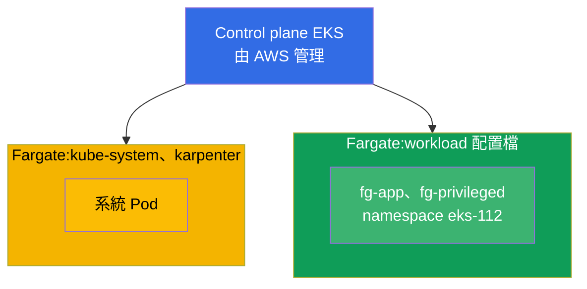
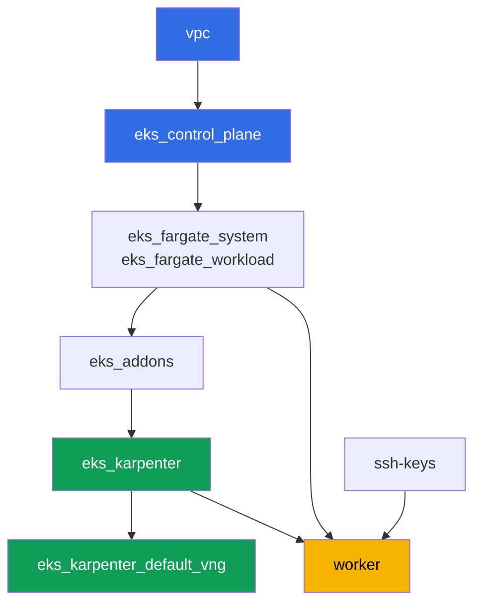

[Русская версия](README_RU.MD) · [Eng version](README.MD) · [Versión en español](README_ES.MD) · [Version française](README_FR.MD) · [Deutsche Version](README_DE.MD) · [ქართული ვერსია](README_GE.MD) · [日本語版](README_JP.MD)

# 實驗 112 - Fargate 配置檔:什麼能用,什麼會壞,成本比較

## 說明

集群已經以代碼方式部署完成,系統 Pod 運行在 Fargate 上,而工作節點由 Karpenter 負責啟
動。在這個實驗中,你會為自己的負載新增第二個 Fargate 配置檔,並在實踐中檢驗這個模式的
邊界:哪些 Pod 能在 Fargate 上正常啟動,Fargate 會把哪些資源請求向上取整,取整到多少,
什麼是原則上被禁止的(privileged),以及 Fargate 的計費模型與 node group 的計費模型有
什麼不同。

任務以生產風格編寫:簡短的任務描述加驗收標準。驗證是自動的,透過 `check_result` 命令
完成。

## 目標

鞏固以下課程章節的內容:

- [第 15 章。Fargate:配置檔、限制、成本、使用場景](../../course/15/ru.md)

## 我們要創建什麼

集群已經部署完成。你要新增一個負載 namespace,並在其中創建一些 Pod,用來測試 Fargate
的各個方面:正常啟動、容量取整、privileged 的禁止、暫存磁碟的擴展。

| 對象 | 這是什麼 | 在這個實驗中的作用 |
|--------|---------|-------------------|
| Fargate 配置檔 `workload` | 新組件 `eks_fargate_workload` | 將整個 `eks-112` namespace 匹配到 Fargate |
| Namespace `eks-112` | 供實驗負載使用的集群區域 | 落入 `workload` 配置檔的選擇器範圍 |
| Deployment `fg-app`(2 個副本) | ping_pong 應用程式,requests = limits | 觀察一個 Guaranteed Pod 真正運行在 Fargate 上 |
| 產物 `capacity.txt` | `CapacityProvisioned` 注解 | 觀察 Fargate 把請求取整到了什麼容量 |
| Pod `fg-privileged` + 產物 `privileged.txt` | 一個帶有 `privileged: true` 的 Pod | 捕捉被拒絕的症狀,並解釋 Fargate 的邊界 |
| 帶有 `ephemeral-storage: 30Gi` 的 `fg-app` | 擴展後的暫存磁碟 | 驗證超過預設 20 GiB 的配置同樣屬於 Guaranteed |
| 產物 `costmodel.txt` | 計費結構的比較 | 記錄 Fargate 與 node group 之間的差異 |

集群的最終圖景:



## 基礎設施

環境透過 Terragrunt 部署在 AWS(`eu-central-1`)。實驗中的每個目錄都是一個組件,擁有
自己的 `terragrunt.hcl`,它引用 `terraform/modules/` 中的共用模組,並透過 `dependency`
區塊聲明依賴關係。Terragrunt 會構建依賴關係圖並按正確的順序套用各個組件。

### 模組與依賴關係

| 目錄(組件) | 模組(`terraform/modules/`) | 依賴於 | 創建了什麼 |
|---------------------|-------------------------------|------------|-------------|
| `vpc` | `vpc_v3` | - | VPC `10.10.0.0/16`,兩個 AZ 中的公有與私有子網,NAT |
| `ssh-keys` | `ssh-keys` | - | 供工作機與節點使用的一對 SSH 金鑰 |
| `eks_control_plane` | `eks_v2_control_plane` | `vpc` | EKS control plane `1.36`、OIDC、security groups |
| `eks_fargate_system` | `eks_v2_fargate` | `vpc`、`eks_control_plane` | `kube-system` 與 `karpenter` 的 Fargate 配置檔 |
| `eks_fargate_workload` | `eks_v2_fargate` | `vpc`、`eks_control_plane` | 供 namespace `eks-112` 使用的 Fargate 配置檔 `workload` |
| `eks_addons` | `eks_v2_addons` | `eks_control_plane`、`eks_fargate_system` | coredns、kube-proxy、vpc-cni、pod-identity 附加元件 |
| `eks_karpenter` | `eks_v2_karpenter` | `vpc`、`eks_control_plane`、`eks_addons`、`eks_fargate_system` | Karpenter 控制器、節點 IAM 角色 |
| `eks_karpenter_default_vng` | `eks_v2_karpenter_vng` | `vpc`、`eks_control_plane`、`eks_karpenter` | 預設 NodePool `default` 以及基於 AL2023 的 EC2NodeClass |
| `worker` | `eks_v2_work_pc` | `ssh-keys`、`vpc`、`eks_control_plane`、`eks_karpenter`、`eks_fargate_workload` | 帶有 kubectl、測試腳本和 `check_result` 的工作機 |

依賴關係圖(較早套用的組件位於箭頭下方)。為了清晰起見,圖中的節點 `fg` 把兩個
Fargate 配置檔合併在一起顯示 - 系統配置檔(`eks_fargate_system`)與負載配置檔
(`eks_fargate_workload`);上面的表格中它們是分開列出的:



`workload` 配置檔必須在 `eks-112` 的 Pod 出現在集群之前就存在,因此 `worker` 聲明了對
`eks_fargate_workload` 的依賴 - Terragrunt 會在學生在工作機上創建自己的對象之前先套用
這個配置檔。

### 各項設定在哪裡配置

設定分佈在兩個層級:共用的 `env.hcl` 以及每個組件各自的 `inputs`。

`env.hcl`(所有組件共用並讀取的環境參數):

| 參數 | 實驗中的值 | 影響什麼 |
|----------|-----------------|---------------|
| `region` | `eu-central-1` | 所有資源的區域 |
| `vpc_default_cidr`、`subnets` | `10.10.0.0/16`,依 AZ 劃分的子網 | VPC 的位址規劃與子網標籤 |
| `prefix` | `eks-task112` | 資源名稱與標籤的前綴 |
| `stack_name` | `eks112` | 用於構建 `env_name` - 集群名稱 |
| `k8_version` | `1.36.0` | 工作機上 kubectl 的版本 |
| `instance_type_worker` | `t3.medium` | 工作機的 instance 類型 |
| `ssh_password_enable`、`access_cidrs` | `true`、`0.0.0.0/0` | 對工作機的 SSH 存取 |
| `root_volume` | `gp3`、`10` | 工作機的根磁碟 |

每個組件 `terragrunt.hcl` 中的 `inputs`(該模組特定的參數):

| 檔案 | 關鍵設定 |
|------|--------------------|
| `eks_control_plane/terragrunt.hcl` | `eks.version = "1.36"`,節點使用的私有子網 |
| `eks_addons/terragrunt.hcl` | 針對 1.36 的附加元件版本:kube-proxy、coredns、vpc-cni、pod-identity |
| `eks_fargate_system/terragrunt.hcl` | 選擇器 `kube-system`、`karpenter` |
| `eks_fargate_workload/terragrunt.hcl` | `fargate.name = "workload"`,選擇器 `namespace = "eks-112"` |
| `eks_karpenter/terragrunt.hcl` | Karpenter 版本 `1.8.1`,控制器資源 |
| `eks_karpenter_default_vng/terragrunt.hcl` | NodePool 的 `requirements`、`limits`、`disruption` |
| `worker/terragrunt.hcl` | 指向實驗 112 檔案的 `test_url` 與 `task_script_url`,對 `eks_fargate_workload` 的依賴 |

`eks_fargate_workload` 的選擇器只匹配 `namespace = "eks-112"`,沒有 `labels`。這意味著
這個 namespace 中的任何 Pod 都會完全落到 Fargate 上 - 沒有例外。

## 部署

```bash
TASK=112 make run_eks_task
```

部署大約需要 15-20 分鐘。在輸出中找到連接工作機的 SSH 那一行並連接上去。kubectl 在那
裡已經配置好指向正確的集群。

工作機上的常用命令:

```bash
time_left       # 環境剩餘的時間
check_result    # 檢查解答
```

> 測試環境的安全性。`env.hcl` 中啟用了 `ssh_password_enable = true` 和
> `access_cidrs = ["0.0.0.0/0"]` - 這對於學習環境很方便,但在生產環境中不應該這樣做。
> 依照課程標準(第 0.2、2、19 章),對工作機的存取應透過 AWS SSM Session Manager 進行,
> 不對外暴露公開的 SSH 端口,並將 `access_cidrs` 限制到具體的位址。這裡保留公開 SSH 只
> 是為了簡化啟動流程。

## 任務

---
|        **1**        | **供實驗負載使用的 Namespace**                             |
| :-----------------: | :---------------------------------------------------------- |
| 我們要做什麼          | 創建一個名為 `eks-112` 的 namespace。它落入 Fargate 配置檔 `workload` 的選擇器範圍(該選擇器只針對 namespace,沒有 labels),因此其中的每個 Pod 都會落到 Fargate 上。 |
| 驗收標準    | - namespace `eks-112` 存在。 |
---
|        **2**        | **Fargate 上的一個 Guaranteed Pod**                                |
| :-----------------: | :---------------------------------------------------------- |
| 我們要做什麼          | 在 `eks-112` namespace 中創建 Deployment `fg-app`,映像 `viktoruj/ping_pong:latest`,`2` 個副本。容器的 `resources.requests` 與 `resources.limits` 必須相等,例如 `cpu: 500m`、`memory: 1Gi` - Fargate 要求 Pod 必須是 `Guaranteed`。等待所有副本就緒,並確認 Pod 落在名稱為 `fargate-...` 的節點上,而不是 `ip-...`。 |
| 驗收標準    | - Deployment `fg-app` 位於 `eks-112`,映像為 `viktoruj/ping_pong`;<br/>- `2` 個就緒副本;<br/>- `requests.cpu == limits.cpu`;<br/>- 每個 Pod 的節點名稱都以 `fargate-` 開頭。 |
---
|        **3**        | **實際分配到的容量**                                 |
| :-----------------: | :---------------------------------------------------------- |
| 我們要做什麼          | Fargate 會把請求向上取整到一組固定的 vCPU/記憶體組合之一,並為系統元件(`kubelet`、`kube-proxy`、`containerd`)額外加上 `256 MB`。取任意一個 `fg-app` Pod,把 `CapacityProvisioned` 注解保存到 `/var/work/tests/artifacts/3/capacity.txt`。<br/>格式提示:`kubectl get pod <pod> -n eks-112 -o jsonpath='{.metadata.annotations.CapacityProvisioned}'` - 檔案中應留下類似 `0.5vCPU 1GB` 的一行。 |
| 驗收標準    | - 檔案不為空;<br/>- 包含 `vCPU` 和 `GB`。 |
---
|        **4**        | **症狀:privileged Pod 無法啟動**                   |
| :-----------------: | :---------------------------------------------------------- |
| 我們要做什麼          | Fargate 不支援 privileged 容器。在 `eks-112` 中創建 Pod `fg-privileged`(映像 `viktoruj/ping_pong:latest`),設定 `securityContext.privileged: true`。該 Pod 不應進入 `Running` 狀態。透過 `kubectl describe pod fg-privileged -n eks-112`(`Events` 部分)分析原因,並將解釋保存到 `/var/work/tests/artifacts/4/privileged.txt`。文字中必須包含 `privileged` 和 `Fargate` 這兩個詞。 |
| 驗收標準    | - Pod `fg-privileged` 在 `eks-112` 中不處於 `Running` 狀態;<br/>- 檔案 `/var/work/tests/artifacts/4/privileged.txt` 不為空,並包含 `privileged` 和 `Fargate` 這兩個詞。 |
---
|        **5**        | **擴展暫存磁碟**                               |
| :-----------------: | :---------------------------------------------------------- |
| 我們要做什麼          | 預設情況下 Fargate 提供 `20 GiB` 的暫存磁碟。重新創建 `fg-app`,將 `resources.requests.ephemeral-storage` 和 `resources.limits.ephemeral-storage` 都設為 `30Gi`(requests 必須等於 limits,與 cpu/memory 一樣)。確認 Pod 能正常啟動。 |
| 驗收標準    | - Deployment `fg-app` 在 `requests` 和 `limits` 中都有 `ephemeral-storage` `30Gi`;<br/>- `fg-app` 至少有一個副本就緒。 |
---
|        **6**        | **成本結構:Fargate 對比 node group**            |
| :-----------------: | :---------------------------------------------------------- |
| 我們要做什麼          | 用 `3-5` 句話描述計費模型的差異:Fargate 是按 POD 自身的 vCPU 和記憶體、按其生命週期收費,不為閒置容量付費;node group 是按整個 instance 收費,包括它未被充分利用的時間。將文字保存到 `/var/work/tests/artifacts/6/costmodel.txt`。不需要具體的美元金額 - 只需描述計費結構。自動檢查會在檔案中尋找 `vCPU` 旁邊的字面詞 `под`(俄語的 "pod"),所以請確保檔案中除了中文說明之外,還包含這個字面詞 `под`。 |
| 驗收標準    | - 檔案不為空;<br/>- 包含 `vCPU`、`под`(自動檢查要求的字面俄語詞)以及 `node group` / `нод` / `инстанс` 中的至少一個。 |
---

## 檢查結果

在工作機上執行自動檢查:

```bash
check_result
```

腳本會執行測試並顯示已完成任務的百分比。

## 解答

參考解答:[worker/files/solutions/1_TW.MD](worker/files/solutions/1_TW.MD)

## 刪除集群與資源

> **先移除負載,等 Fargate Pod 消失後,才能拆除環境。** `eks-112` 的所有負載都運行在
> Fargate 上,這個實驗不會啟動任何 Karpenter EC2 節點 - 所以這裡沒有 VPC CNI 孤立 ENI
> 的風險。但存在另一個風險:當 Fargate 配置檔上還有正在運行的 Pod 時,AWS 不允許刪除
> 該配置檔(在組件 `eks_fargate_workload` 上執行 `terraform destroy` 會失敗,並提示該
> 配置檔仍在使用中)。

```bash
# 1. 移除實驗負載(fg-app、fg-privileged),並等待 Fargate Pod 消失
kubectl delete namespace eks-112 --ignore-not-found
while kubectl get pods -A -o wide 2>/dev/null | grep -q 'eks-112'; do
  echo "eks-112 的 Pod 仍在終止中,等待中..."; sleep 10
done
```

只有在這之後,才能拆除環境:

```bash
TASK=112 make delete_eks_task
```

如果 `destroy` 仍然在 `eks_fargate_workload` 組件上因為有活動 Pod 的錯誤而失敗,說明
namespace 還沒有徹底刪除完成 - 檢查 `kubectl get pods -n eks-112`,等到沒有 Pod 剩下後
再重新執行 `TASK=112 make delete_eks_task`。
