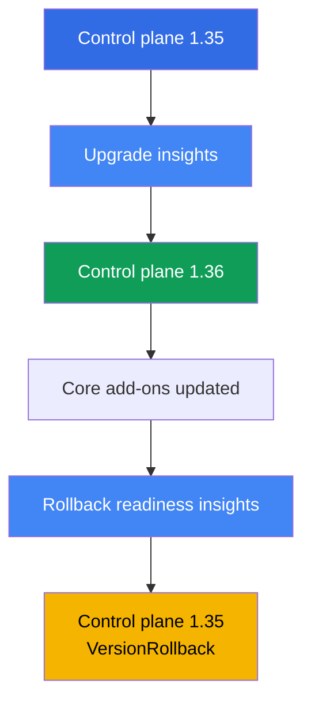
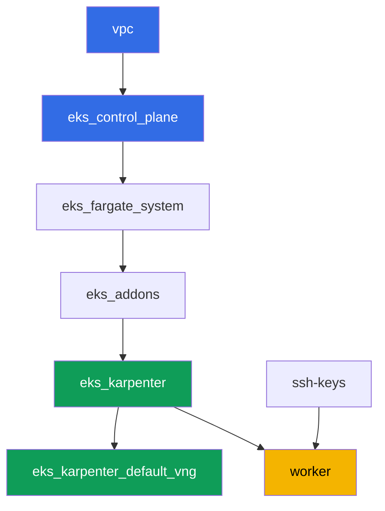

[Русская версия](README_RU.MD) · [Versión en español](README_ES.MD) · [Version française](README_FR.MD) · [Deutsche Version](README_DE.MD) · [ქართული ვერსია](README_GE.MD) · [繁體中文版](README_TW.MD) · [日本語版](README_JP.MD)

# Lab 113 - Cluster upgrade and rollback: control plane, add-ons, deprecated APIs

## Description

A cluster lives for years, while Kubernetes versions change every few months. In this lab
you go through a full minor version upgrade cycle for EKS on a live cluster: you check
upgrade readiness, move the control plane one minor version up, update the core add-ons to
compatible versions, then make sure the way back is still open and roll the control plane
back - all through the standard insights and `aws eks update-cluster-version`, without
recreating the cluster.

Tasks are written in a production style: a short statement plus acceptance criteria.
Checking is automatic, via the `check_result` command. Some steps (the upgrade and rollback
of the control plane themselves) take tens of minutes of waiting - that's normal behavior
for a managed control plane, not a stuck command.

## Goal

Reinforce the material from these course chapters:

- [Chapter 37. EKS add-ons: managed add-ons vs. Helm, versions and update order](../../course/37/en.md) - who owns the add-on version
- [Chapter 38. Cluster upgrade: in-place by version, blue/green clusters, deprecated APIs](../../course/38/en.md) - the order of an in-place upgrade and finding deprecated APIs
- [Chapter 39. Cluster version rollback: rollback readiness insights, the 7-day window, rollback order](../../course/39/en.md) - the standard control plane rollback

## What we're creating

The cluster starts on version `1.35` (one minor below the current GA `1.36`), so that in
this lab you can actually upgrade the control plane and then roll it back within the
7-day window.

| Object | What it is | Why it's in this lab |
|--------|---------|-------------------|
| Namespace `eks-113` | a cluster section for the lab's artifacts | keeps task results separate (chapter 4) |
| Artifact `upgrade_insights.json` | upgrade insights output | checking upgrade readiness before starting it (chapter 38) |
| Control plane `1.35 -> 1.36` | in-place upgrade by one minor | the actual process of updating a managed control plane (chapter 38) |
| Core add-ons on `1.36`-compatible versions | kube-proxy, coredns, vpc-cni, pod-identity | updating add-ons following the control plane (chapter 37) |
| Artifact `rollback_readiness.json` | rollback readiness insights output | checking rollback readiness within the 7-day window (chapter 39) |
| Control plane `1.36 -> 1.35` | `VersionRollback` rollback | standard control plane rollback without recreating the cluster (chapter 39) |

Order of operations in the lab:



## Infrastructure

The environment is deployed in AWS (`eu-central-1`) via Terragrunt. Each lab directory is
one component with its own `terragrunt.hcl`, which references a shared module in
`terraform/modules/` and declares dependencies through `dependency` blocks. Terragrunt
builds a dependency graph and applies the components in the right order. The upgrade and
rollback of the cluster version in this lab are performed **not through terraform**, but
directly on the live cluster via `aws eks update-cluster-version` and
`aws eks update-addon` - terraform only deploys the starting state on version `1.35`.

### Modules and dependencies

| Directory (component) | Module (`terraform/modules/`) | Depends on | What it creates |
|---------------------|-------------------------------|------------|-------------|
| `vpc` | `vpc_v3` | - | VPC `10.10.0.0/16`, public and private subnets in two AZs, NAT |
| `ssh-keys` | `ssh-keys` | - | an SSH key pair for the worker machine and nodes |
| `eks_control_plane` | `eks_v2_control_plane` | `vpc` | EKS control plane `1.35`, OIDC, security groups |
| `eks_fargate_system` | `eks_v2_fargate` | `vpc`, `eks_control_plane` | Fargate profile for `kube-system` and `karpenter` |
| `eks_addons` | `eks_v2_addons` | `eks_control_plane`, `eks_fargate_system` | coredns, kube-proxy, vpc-cni, pod-identity add-ons on `1.35` |
| `eks_karpenter` | `eks_v2_karpenter` | `vpc`, `eks_control_plane`, `eks_addons`, `eks_fargate_system` | Karpenter controller, node IAM role |
| `eks_karpenter_default_vng` | `eks_v2_karpenter_vng` | `vpc`, `eks_control_plane`, `eks_karpenter` | default NodePool `default` and EC2NodeClass |
| `worker` | `eks_v2_work_pc` | `ssh-keys`, `vpc`, `eks_control_plane`, `eks_karpenter` | worker machine with kubectl, aws cli, tests, and `check_result` |

Dependency graph (what gets applied earlier is lower down the arrow):



### Where things are configured

`env.hcl` (shared environment parameters, read by all components):

| Parameter | Value in the lab | What it affects |
|----------|-----------------|---------------|
| `region` | `eu-central-1` | region for all resources |
| `prefix` | `eks-task113` | prefix for resource names and tags |
| `stack_name` | `eks113` | used to build `env_name` - the cluster name |
| `k8_version` | `1.35.0` | kubectl version on the worker machine, matches the control plane's starting version |
| `ssh_password_enable`, `access_cidrs` | `true`, `0.0.0.0/0` | SSH access to the worker machine |

`inputs` in each component's `terragrunt.hcl`:

| File | Key settings |
|------|--------------------|
| `eks_control_plane/terragrunt.hcl` | `eks.version = "1.35"` - the lab's starting control plane version |
| `eks_addons/terragrunt.hcl` | add-on versions for `1.35`: kube-proxy `v1.35.3-eksbuild.13`, coredns `v1.14.3-eksbuild.3`, vpc-cni `v1.22.4-eksbuild.3`, eks-pod-identity-agent `v1.3.10-eksbuild.2` (a comment in the file is a reminder to double-check via `aws eks describe-addon-versions --kubernetes-version 1.35`) |
| `worker/terragrunt.hcl` | `test_url` and `task_script_url` pointing to the lab 113 files, `exam_time_minutes = "900"` (extra time for the long upgrade and rollback) |

All other settings (network, Karpenter, add-ons as managed add-ons) are no different from the
base lab 101 - only the control plane version and the core add-on versions for it matter here.

## Deployment

```bash
TASK=113 make run_eks_task
```

Deployment takes roughly 15-20 minutes. In the output, find the line with the SSH connection
to the worker machine and connect to it. kubectl and aws cli there are already configured for
the right cluster.

> A note about time. Tasks 3 (upgrading the control plane to `1.36`) and 6 (rolling it back to
> `1.35`) are performed by AWS itself, and each of these operations can take **20-40 minutes**.
> That's normal: `update-cluster-version` only starts the update and immediately returns an
> `id`, while the actual update runs in the background. Don't interrupt the command or
> recreate the cluster if the response doesn't come instantly - wait for the `Successful`
> status via `describe-update`.

Useful commands on the worker machine:

```bash
time_left       # how much environment time is left
check_result    # check the solution
```

> Environment security. `env.hcl` has `ssh_password_enable = true` and
> `access_cidrs = ["0.0.0.0/0"]` enabled - convenient for a training environment, but this
> is not something to do in production. Per the course standards (chapters 0.2, 2, 19),
> access to worker machines should go through AWS SSM Session Manager without exposing
> public SSH ports, and `access_cidrs` should be narrowed down to specific addresses. Here
> public SSH is left in place only to keep the setup simple.

## Tasks

---
|        **1**        | **Namespace and the cluster's starting version**             |
| :-----------------: | :----------------------------------------------------------- |
| What to do          | Create namespace `eks-113`. Make sure the control plane is currently on version `1.35`: `aws eks describe-cluster --name <cluster> --query 'cluster.version'`. Get the cluster name via `aws eks list-clusters`. |
| Acceptance criteria    | - namespace `eks-113` exists;<br/>- `cluster.version` equals `1.35`. |
---
|        **2**        | **Checking upgrade readiness**                                |
| :-----------------: | :----------------------------------------------------------- |
| What to do          | Run upgrade insights: `aws eks list-insights --cluster-name <cluster>` (without `--filter` it shows all categories, including upgrade readiness). Save the output to file `/var/work/tests/artifacts/2/upgrade_insights.json`. Make sure there isn't a single insight with status `ERROR` in the list - that status blocks the upgrade until the issue is fixed. |
| Acceptance criteria    | - file `/var/work/tests/artifacts/2/upgrade_insights.json` is not empty;<br/>- it has no entries with status `ERROR`. |
---
|        **3**        | **Upgrading the control plane to `1.36`**                     |
| :-----------------: | :----------------------------------------------------------- |
| What to do          | Start the upgrade: `aws eks update-cluster-version --name <cluster> --kubernetes-version 1.36`. Wait for it to finish via `aws eks describe-update --name <cluster> --update-id <id>` (status `Successful`) - this can take 20-40 minutes. Confirm that `cluster.version` became `1.36`. |
| Acceptance criteria    | - `aws eks describe-cluster --name <cluster> --query 'cluster.version'` returns `1.36`. |
---
|        **4**        | **Upgrading the core add-ons to `1.36`-compatible versions**  |
| :-----------------: | :----------------------------------------------------------- |
| What to do          | Update `kube-proxy` and `coredns` to versions compatible with `1.36` (same as in lab 101: kube-proxy `v1.36.0-eksbuild.14`, coredns `v1.14.3-eksbuild.3`), with `aws eks update-addon --cluster-name <cluster> --addon-name <name> --addon-version <version>`. Wait for `ACTIVE` status for each add-on via `aws eks describe-addon`. |
| Acceptance criteria    | - the `kube-proxy` add-on version starts with `v1.36.`;<br/>- the `coredns` add-on version is compatible with the current minor (`v1.14.`). |
---
|        **5**        | **Checking rollback readiness**                                |
| :-----------------: | :----------------------------------------------------------- |
| What to do          | Run rollback readiness insights: `aws eks list-insights --cluster-name <cluster> --filter '{"categories": ["ROLLBACK_READINESS"]}'`. Save the output to file `/var/work/tests/artifacts/5/rollback_readiness.json`. Make sure there is no insight with status `ERROR` or `UNKNOWN` - both block the rollback (they can only be bypassed with the `--force` flag, which doesn't cancel the time window limit or the "one minor" rule). |
| Acceptance criteria    | - file `/var/work/tests/artifacts/5/rollback_readiness.json` is not empty;<br/>- it has no entries with status `ERROR` or `UNKNOWN`. |
---
|        **6**        | **Rolling the control plane back to `1.35`**                  |
| :-----------------: | :----------------------------------------------------------- |
| What to do          | Because of the `kube-proxy` upgrade in task 4, a direct control plane rollback will be blocked by the rollback readiness insight `kube-proxy version rollback compatibility` (`ERROR`: version skew, `kube-proxy` on `1.36` is newer than the control plane on `1.35`). First roll `kube-proxy` itself back to the `1.35`-compatible version (`v1.35.3-eksbuild.13`) and wait for `ACTIVE`. Then start the control plane rollback: `aws eks update-cluster-version --name <cluster> --kubernetes-version 1.35`. Wait for `Successful` via `describe-update` - again 20-40 minutes. Confirm that `cluster.version` returned to `1.35`. Save the update type from the `update-cluster-version` response (or from `describe-update`) to file `/var/work/tests/artifacts/6/rollback_update.txt` - it must be `VersionRollback`, not a regular upgrade. |
| Acceptance criteria    | - `cluster.version` equals `1.35` again;<br/>- file `/var/work/tests/artifacts/6/rollback_update.txt` is not empty and contains `VersionRollback`. |
---

## Checking the result

On the worker machine, run the automatic check:

```bash
check_result
```

The script will run the tests and show the percentage of completed tasks. Tasks 3 and 6 only
check the final result (the cluster's current version) - the actual waiting for the upgrade
or rollback isn't tested, but it still has to run to completion, otherwise the version won't
change.

## Solution

Reference solution: [worker/files/solutions/1.MD](worker/files/solutions/1.MD)

## Deleting the cluster and resources

> **Wait until the control plane leaves the `UPDATING` state, then tear down the stack.**
> The upgrade and rollback in this lab bypass terraform, going directly through
> `aws eks update-cluster-version`. Until the last such operation finishes (`Successful` in
> `describe-update`), EKS responds to other calls with `409 ResourceInUseException ...
> currently has an update in progress`, and `destroy` will either fail on that error or go
> into retries (the root `terraform/environments/terragrunt.hcl` has `retryable_errors`
> configured exactly for this case). You don't have to restore the control plane version
> before deleting - terraform doesn't store the cluster version as the desired state for the
> `destroy` diff, so an unfinished upgrade to `1.36` doesn't block deletion, only slows it
> down.

```bash
# 1. Remove the lab's artifacts
kubectl delete namespace eks-113 --ignore-not-found

# 2. Wait until the cluster leaves UPDATING (relevant if the upgrade or rollback
#    from tasks 3/6 is still in progress)
CLUSTER=$(aws eks list-clusters --query 'clusters[0]' --output text)
while [ "$(aws eks describe-cluster --name "$CLUSTER" --query 'cluster.status' --output text)" != "ACTIVE" ]; do
  echo "control plane still UPDATING, waiting..."; sleep 30
done
```

Only after that, tear down the stack:

```bash
TASK=113 make delete_eks_task
```

If `destroy` still failed with `409 ResourceInUseException`, the cluster is still updating
- wait and repeat `TASK=113 make delete_eks_task`, the command is idempotent.
