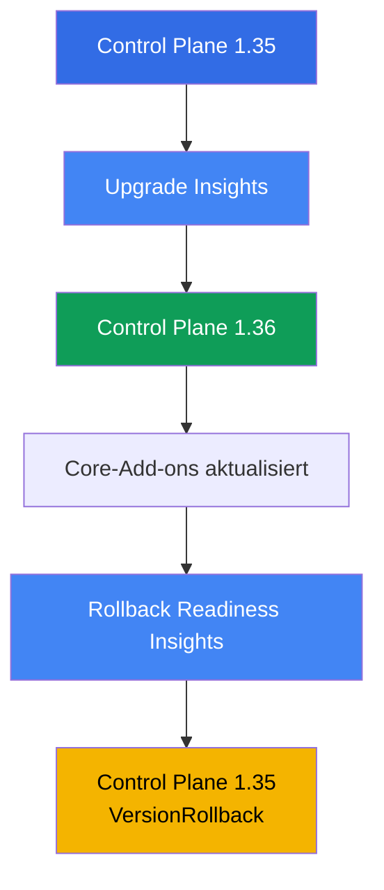
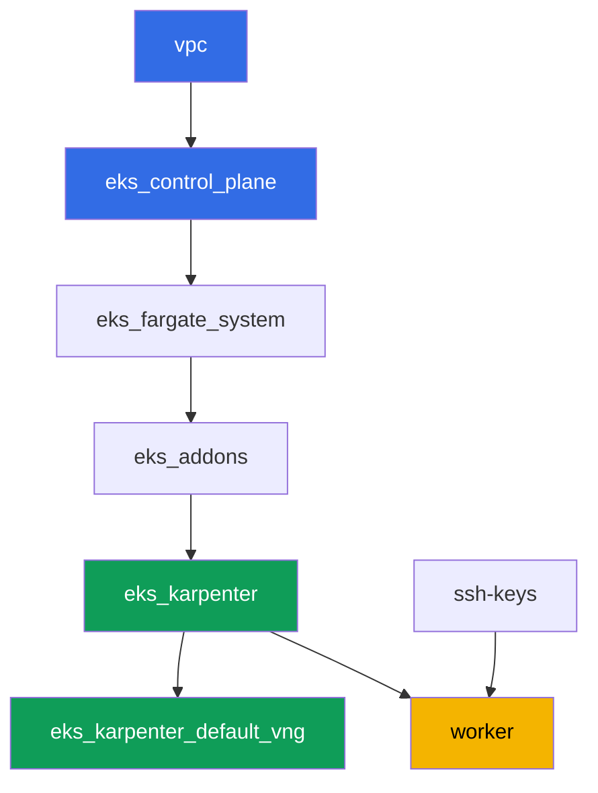

[Русская версия](README_RU.MD) · [Eng version](README.MD) · [Versión en español](README_ES.MD) · [Version française](README_FR.MD) · [ქართული ვერსია](README_GE.MD) · [繁體中文版](README_TW.MD) · [日本語版](README_JP.MD)

# Lab 113 - Cluster-Upgrade und Rollback: Control Plane, Add-ons, veraltete APIs

## Beschreibung

Ein Cluster lebt jahrelang, während sich Kubernetes-Versionen alle paar Monate ändern. In
diesem Lab durchlaufen Sie einen vollständigen Minor-Version-Upgrade-Zyklus für EKS auf
einem laufenden Cluster: Sie prüfen die Upgrade-Bereitschaft, heben die Control Plane um
eine Minor-Version an, aktualisieren die Core-Add-ons auf kompatible Versionen, stellen dann
sicher, dass der Weg zurück noch offen ist, und rollen die Control Plane wieder zurück -
alles über die Standard-Insights und `aws eks update-cluster-version`, ohne den Cluster neu
zu erstellen.

Die Aufgaben sind im Produktionsstil geschrieben: eine kurze Aufgabenstellung plus
Abnahmekriterien. Die Prüfung erfolgt automatisch über den Befehl `check_result`. Manche
Schritte (das Upgrade und der Rollback der Control Plane selbst) dauern zig Minuten
Wartezeit - das ist normales Verhalten für eine managed control plane, kein hängender Befehl.

## Ziel

Den Stoff dieser Kurskapitel vertiefen:

- [Kapitel 37. EKS-Add-ons: managed add-ons vs. Helm, Versionen und Update-Reihenfolge](../../course/37/de.md) - wem die Add-on-Version gehört
- [Kapitel 38. Cluster-Upgrade: in-place nach Version, Blue/Green-Cluster, veraltete APIs](../../course/38/de.md) - die Reihenfolge eines In-Place-Upgrades und das Finden veralteter APIs
- [Kapitel 39. Cluster-Version-Rollback: rollback readiness insights, das 7-Tage-Fenster, Rollback-Reihenfolge](../../course/39/de.md) - der Standard-Rollback der Control Plane

## Was wir erstellen

Der Cluster startet auf Version `1.35` (eine Minor-Version unter der aktuellen GA-Version
`1.36`), damit Sie in diesem Lab die Control Plane tatsächlich anheben und anschließend
innerhalb des 7-Tage-Fensters wieder zurückrollen können.

| Objekt | Was es ist | Wofür in diesem Lab |
|--------|---------|-------------------|
| Namespace `eks-113` | ein Cluster-Bereich für die Lab-Artefakte | hält die Ergebnisse der Aufgaben getrennt (Kapitel 4) |
| Artefakt `upgrade_insights.json` | Ausgabe der upgrade insights | prüft die Upgrade-Bereitschaft vor dem Start (Kapitel 38) |
| Control Plane `1.35 -> 1.36` | In-Place-Upgrade um eine Minor-Version | der eigentliche Prozess der Aktualisierung einer managed control plane (Kapitel 38) |
| Core-Add-ons auf `1.36`-kompatiblen Versionen | kube-proxy, coredns, vpc-cni, pod-identity | Aktualisierung der Add-ons im Anschluss an die Control Plane (Kapitel 37) |
| Artefakt `rollback_readiness.json` | Ausgabe der rollback readiness insights | prüft die Rollback-Bereitschaft innerhalb des 7-Tage-Fensters (Kapitel 39) |
| Control Plane `1.36 -> 1.35` | `VersionRollback`-Rollback | Standard-Rollback der Control Plane ohne Neuerstellung des Clusters (Kapitel 39) |

Reihenfolge der Vorgänge in diesem Lab:



## Infrastruktur

Die Umgebung wird in AWS (`eu-central-1`) über Terragrunt deployt. Jedes Lab-Verzeichnis ist
eine Komponente mit eigenem `terragrunt.hcl`, das auf ein gemeinsames Modul in
`terraform/modules/` verweist und seine Abhängigkeiten über `dependency`-Blöcke deklariert.
Terragrunt baut einen Abhängigkeitsgraphen und wendet die Komponenten in der richtigen
Reihenfolge an. Das Upgrade und der Rollback der Cluster-Version in diesem Lab erfolgen
**nicht über terraform**, sondern direkt am laufenden Cluster über
`aws eks update-cluster-version` und `aws eks update-addon` - terraform deployt nur den
Ausgangszustand auf Version `1.35`.

### Module und Abhängigkeiten

| Verzeichnis (Komponente) | Modul (`terraform/modules/`) | Abhängig von | Was es erstellt |
|---------------------|-------------------------------|------------|-------------|
| `vpc` | `vpc_v3` | - | VPC `10.10.0.0/16`, öffentliche und private Subnetze in zwei AZ, NAT |
| `ssh-keys` | `ssh-keys` | - | ein SSH-Schlüsselpaar für die Worker-Maschine und die Nodes |
| `eks_control_plane` | `eks_v2_control_plane` | `vpc` | EKS Control Plane `1.35`, OIDC, Security Groups |
| `eks_fargate_system` | `eks_v2_fargate` | `vpc`, `eks_control_plane` | Fargate-Profil für `kube-system` und `karpenter` |
| `eks_addons` | `eks_v2_addons` | `eks_control_plane`, `eks_fargate_system` | Add-ons coredns, kube-proxy, vpc-cni, pod-identity auf `1.35` |
| `eks_karpenter` | `eks_v2_karpenter` | `vpc`, `eks_control_plane`, `eks_addons`, `eks_fargate_system` | Karpenter-Controller, IAM-Rolle der Nodes |
| `eks_karpenter_default_vng` | `eks_v2_karpenter_vng` | `vpc`, `eks_control_plane`, `eks_karpenter` | Standard-NodePool `default` und EC2NodeClass |
| `worker` | `eks_v2_work_pc` | `ssh-keys`, `vpc`, `eks_control_plane`, `eks_karpenter` | Worker-Maschine mit kubectl, aws cli, Tests und `check_result` |

Abhängigkeitsgraph (was früher angewendet wird, steht weiter unten am Pfeil):



### Wo was konfiguriert wird

`env.hcl` (gemeinsame Umgebungsparameter, von allen Komponenten gelesen):

| Parameter | Wert im Lab | Was er beeinflusst |
|----------|-----------------|---------------|
| `region` | `eu-central-1` | Region aller Ressourcen |
| `prefix` | `eks-task113` | Präfix für Ressourcennamen und Tags |
| `stack_name` | `eks113` | daraus wird `env_name` - der Clustername - gebildet |
| `k8_version` | `1.35.0` | kubectl-Version auf der Worker-Maschine, entspricht der Startversion der Control Plane |
| `ssh_password_enable`, `access_cidrs` | `true`, `0.0.0.0/0` | SSH-Zugriff auf die Worker-Maschine |

`inputs` im `terragrunt.hcl` jeder Komponente:

| Datei | Wichtige Einstellungen |
|------|--------------------|
| `eks_control_plane/terragrunt.hcl` | `eks.version = "1.35"` - die Startversion der Control Plane in diesem Lab |
| `eks_addons/terragrunt.hcl` | Add-on-Versionen für `1.35`: kube-proxy `v1.35.3-eksbuild.13`, coredns `v1.14.3-eksbuild.3`, vpc-cni `v1.22.4-eksbuild.3`, eks-pod-identity-agent `v1.3.10-eksbuild.2` (ein Kommentar in der Datei erinnert daran, dies über `aws eks describe-addon-versions --kubernetes-version 1.35` zu prüfen) |
| `worker/terragrunt.hcl` | `test_url` und `task_script_url` für die Lab-113-Dateien, `exam_time_minutes = "900"` (zusätzliche Zeit für das lange Upgrade und den Rollback) |

Alle übrigen Einstellungen (Netzwerk, Karpenter, Add-ons als managed add-ons) unterscheiden
sich nicht vom Basis-Lab 101 - hier zählen nur die Version der Control Plane und die dazu
passenden Versionen der Core-Add-ons.

## Deployment

```bash
TASK=113 make run_eks_task
```

Das Deployment dauert etwa 15-20 Minuten. Suchen Sie in der Ausgabe die Zeile mit der
SSH-Verbindung zur Worker-Maschine und verbinden Sie sich damit. kubectl und aws cli sind
dort bereits für den richtigen Cluster konfiguriert.

> Ein Hinweis zur Zeit. Die Aufgaben 3 (Upgrade der Control Plane auf `1.36`) und 6
> (Rollback auf `1.35`) werden von AWS selbst ausgeführt, und jede dieser Operationen kann
> **20-40 Minuten** dauern. Das ist normal: `update-cluster-version` startet nur das Update
> und liefert sofort eine `id` zurück, während das eigentliche Update im Hintergrund läuft.
> Unterbrechen Sie den Befehl nicht und erstellen Sie den Cluster nicht neu, wenn die
> Antwort nicht sofort kommt - warten Sie auf den Status `Successful` über `describe-update`.

Nützliche Befehle auf der Worker-Maschine:

```bash
time_left       # verbleibende Zeit der Umgebung
check_result    # Lösung prüfen
```

> Sicherheit der Testumgebung. In `env.hcl` sind `ssh_password_enable = true` und
> `access_cidrs = ["0.0.0.0/0"]` aktiviert - praktisch für eine Lernumgebung, aber so sollte
> man es in Produktion nicht machen. Nach den Standards des Kurses (Kapitel 0.2, 2, 19)
> sollte der Zugriff auf Worker-Maschinen über AWS SSM Session Manager erfolgen, ohne
> öffentliche SSH-Ports nach außen, und `access_cidrs` sollte auf konkrete Adressen
> eingeschränkt werden. Hier bleibt öffentliches SSH nur der Einfachheit halber bestehen.

## Aufgaben

---
|        **1**        | **Namespace und die Startversion des Clusters**             |
| :-----------------: | :----------------------------------------------------------- |
| Was wir tun          | Erstellen Sie den Namespace `eks-113`. Stellen Sie sicher, dass die Control Plane aktuell auf Version `1.35` läuft: `aws eks describe-cluster --name <cluster> --query 'cluster.version'`. Den Clusternamen erhalten Sie über `aws eks list-clusters`. |
| Abnahmekriterien    | - Namespace `eks-113` existiert;<br/>- `cluster.version` entspricht `1.35`. |
---
|        **2**        | **Upgrade-Bereitschaft prüfen**                                |
| :-----------------: | :----------------------------------------------------------- |
| Was wir tun          | Führen Sie die upgrade insights aus: `aws eks list-insights --cluster-name <cluster>` (ohne `--filter` zeigt der Befehl alle Kategorien, einschließlich der Upgrade-Bereitschaft). Speichern Sie die Ausgabe in der Datei `/var/work/tests/artifacts/2/upgrade_insights.json`. Stellen Sie sicher, dass kein einziger Insight mit Status `ERROR` in der Liste steht - dieser Status blockiert das Upgrade, bis das Problem behoben ist. |
| Abnahmekriterien    | - die Datei `/var/work/tests/artifacts/2/upgrade_insights.json` ist nicht leer;<br/>- sie enthält keine Einträge mit Status `ERROR`. |
---
|        **3**        | **Upgrade der Control Plane auf `1.36`**                     |
| :-----------------: | :----------------------------------------------------------- |
| Was wir tun          | Starten Sie das Upgrade: `aws eks update-cluster-version --name <cluster> --kubernetes-version 1.36`. Warten Sie den Abschluss über `aws eks describe-update --name <cluster> --update-id <id>` ab (Status `Successful`) - das kann 20-40 Minuten dauern. Bestätigen Sie, dass `cluster.version` zu `1.36` wurde. |
| Abnahmekriterien    | - `aws eks describe-cluster --name <cluster> --query 'cluster.version'` liefert `1.36`. |
---
|        **4**        | **Upgrade der Core-Add-ons auf `1.36`-kompatible Versionen**  |
| :-----------------: | :----------------------------------------------------------- |
| Was wir tun          | Aktualisieren Sie `kube-proxy` und `coredns` auf Versionen, die mit `1.36` kompatibel sind (wie in Lab 101: kube-proxy `v1.36.0-eksbuild.14`, coredns `v1.14.3-eksbuild.3`), mit `aws eks update-addon --cluster-name <cluster> --addon-name <name> --addon-version <version>`. Warten Sie für jedes Add-on auf den Status `ACTIVE` über `aws eks describe-addon`. |
| Abnahmekriterien    | - die Version des `kube-proxy`-Add-ons beginnt mit `v1.36.`;<br/>- die Version des `coredns`-Add-ons ist mit der aktuellen Minor-Version kompatibel (`v1.14.`). |
---
|        **5**        | **Rollback-Bereitschaft prüfen**                                |
| :-----------------: | :----------------------------------------------------------- |
| Was wir tun          | Führen Sie die rollback readiness insights aus: `aws eks list-insights --cluster-name <cluster> --filter '{"categories": ["ROLLBACK_READINESS"]}'`. Speichern Sie die Ausgabe in der Datei `/var/work/tests/artifacts/5/rollback_readiness.json`. Stellen Sie sicher, dass kein Insight mit Status `ERROR` oder `UNKNOWN` vorliegt - beide blockieren den Rollback (sie lassen sich nur mit dem Flag `--force` umgehen, das aber weder die Fenstergrenze noch die "eine Minor-Version"-Regel aufhebt). |
| Abnahmekriterien    | - die Datei `/var/work/tests/artifacts/5/rollback_readiness.json` ist nicht leer;<br/>- sie enthält keine Einträge mit Status `ERROR` oder `UNKNOWN`. |
---
|        **6**        | **Rollback der Control Plane auf `1.35`**                  |
| :-----------------: | :----------------------------------------------------------- |
| Was wir tun          | Wegen des `kube-proxy`-Upgrades in Aufgabe 4 wird ein direkter Rollback der Control Plane durch den rollback readiness insight `kube-proxy version rollback compatibility` blockiert (`ERROR`: version skew, `kube-proxy` auf `1.36` ist neuer als die Control Plane auf `1.35`). Rollen Sie zuerst `kube-proxy` selbst auf die `1.35`-kompatible Version zurück (`v1.35.3-eksbuild.13`) und warten Sie auf `ACTIVE`. Starten Sie dann den Rollback der Control Plane: `aws eks update-cluster-version --name <cluster> --kubernetes-version 1.35`. Warten Sie auf `Successful` über `describe-update` - wieder 20-40 Minuten. Bestätigen Sie, dass `cluster.version` wieder `1.35` ist. Speichern Sie den Update-Typ aus der Antwort von `update-cluster-version` (oder aus `describe-update`) in der Datei `/var/work/tests/artifacts/6/rollback_update.txt` - er muss `VersionRollback` sein, kein reguläres Upgrade. |
| Abnahmekriterien    | - `cluster.version` entspricht wieder `1.35`;<br/>- die Datei `/var/work/tests/artifacts/6/rollback_update.txt` ist nicht leer und enthält `VersionRollback`. |
---

## Ergebnis prüfen

Führen Sie auf der Worker-Maschine die automatische Prüfung aus:

```bash
check_result
```

Das Skript führt die Tests aus und zeigt den Prozentsatz erledigter Aufgaben. Die Aufgaben 3
und 6 prüfen nur das Endergebnis (die aktuelle Version des Clusters) - das tatsächliche
Warten auf das Upgrade oder den Rollback wird nicht getestet, muss aber trotzdem vollständig
ablaufen, sonst ändert sich die Version nicht.

## Lösung

Referenzlösung: [worker/files/solutions/1_DE.MD](worker/files/solutions/1_DE.MD)

## Cluster und Ressourcen löschen

> **Warten Sie, bis die Control Plane den Zustand `UPDATING` verlässt, erst dann reißen Sie
> den Stack ab.** Das Upgrade und der Rollback in diesem Lab umgehen terraform und laufen
> direkt über `aws eks update-cluster-version`. Bis der letzte solche Vorgang abgeschlossen
> ist (`Successful` in `describe-update`), antwortet EKS auf andere Aufrufe mit `409
> ResourceInUseException ... currently has an update in progress`, und `destroy` schlägt
> entweder mit diesem Fehler fehl oder geht in Wiederholungsversuche (das
> `retryable_errors` im root `terraform/environments/terragrunt.hcl` ist genau für diesen
> Fall konfiguriert). Sie müssen die Version der Control Plane vor dem Löschen nicht
> zurücksetzen - terraform speichert die Cluster-Version nicht als gewünschten Zustand für
> den `destroy`-Diff, daher blockiert ein unvollendetes Upgrade auf `1.36` das Löschen
> nicht, sondern verzögert es nur.

```bash
# 1. Lab-Artefakte entfernen
kubectl delete namespace eks-113 --ignore-not-found

# 2. Warten, bis der Cluster UPDATING verlässt (relevant, falls das Upgrade oder der
#    Rollback aus Aufgabe 3/6 noch läuft)
CLUSTER=$(aws eks list-clusters --query 'clusters[0]' --output text)
while [ "$(aws eks describe-cluster --name "$CLUSTER" --query 'cluster.status' --output text)" != "ACTIVE" ]; do
  echo "control plane immer noch UPDATING, warten..."; sleep 30
done
```

Erst danach die Umgebung abreißen:

```bash
TASK=113 make delete_eks_task
```

Schlägt `destroy` weiterhin mit `409 ResourceInUseException` fehl, aktualisiert sich der
Cluster noch - warten Sie und wiederholen Sie `TASK=113 make delete_eks_task`, der Befehl
ist idempotent.
