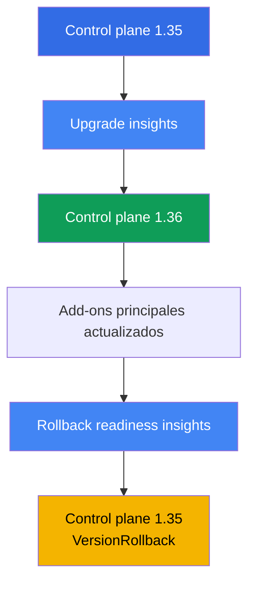
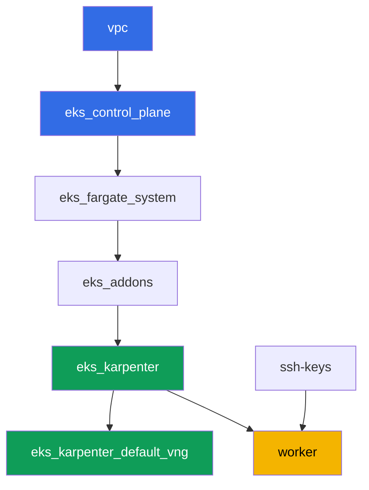

[Русская версия](README_RU.MD) · [Eng version](README.MD) · [Version française](README_FR.MD) · [Deutsche Version](README_DE.MD) · [ქართული ვერსია](README_GE.MD) · [繁體中文版](README_TW.MD) · [日本語版](README_JP.MD)

# Lab 113 - Actualización y rollback del clúster: control plane, add-ons, APIs obsoletas

## Descripción

Un clúster vive años, mientras que las versiones de Kubernetes cambian cada pocos meses. En
este laboratorio recorres un ciclo completo de actualización de versión menor de EKS en un
clúster real: compruebas la upgrade readiness, subes el control plane una versión menor,
actualizas los add-ons principales a versiones compatibles, y después te aseguras de que el
camino de vuelta sigue abierto y haces el rollback del control plane - todo a través de los
insights estándar y `aws eks update-cluster-version`, sin recrear el clúster.

Las tareas están escritas en estilo de producción: un enunciado breve más criterios de
aceptación. La verificación es automática, mediante el comando `check_result`. Algunos pasos
(la propia actualización y el rollback del control plane) tardan decenas de minutos de
espera - es el comportamiento normal de un control plane gestionado, no un comando colgado.

## Objetivo

Reforzar el material de estos capítulos del curso:

- [Capítulo 37. Add-ons de EKS: add-ons gestionados frente a Helm, versiones y orden de actualización](../../course/37/ru.md) - quién es responsable de la versión del add-on
- [Capítulo 38. Actualización del clúster: in-place por versión, clústeres blue/green, APIs obsoletas](../../course/38/ru.md) - el orden de una actualización in-place y cómo encontrar APIs obsoletas
- [Capítulo 39. Rollback de versión del clúster: rollback readiness insights, la ventana de 7 días, orden del rollback](../../course/39/ru.md) - el rollback estándar del control plane

## Qué vamos a crear

El clúster arranca en la versión `1.35` (una versión menor por debajo de la GA actual
`1.36`), de modo que en este laboratorio puedas realmente actualizar el control plane y luego
hacer el rollback dentro de la ventana de 7 días.

| Objeto | Qué es | Para qué sirve en este laboratorio |
|--------|---------|-------------------|
| Namespace `eks-113` | una sección del clúster para los artefactos del laboratorio | mantiene los resultados de las tareas separados (capítulo 4) |
| Artefacto `upgrade_insights.json` | salida de upgrade insights | comprobar la upgrade readiness antes de empezar (capítulo 38) |
| Control plane `1.35 -> 1.36` | actualización in-place de una versión menor | el proceso real de actualizar un control plane gestionado (capítulo 38) |
| Add-ons principales en versiones compatibles con `1.36` | kube-proxy, coredns, vpc-cni, pod-identity | actualizar los add-ons siguiendo al control plane (capítulo 37) |
| Artefacto `rollback_readiness.json` | salida de rollback readiness insights | comprobar la rollback readiness dentro de la ventana de 7 días (capítulo 39) |
| Control plane `1.36 -> 1.35` | rollback de tipo `VersionRollback` | rollback estándar del control plane sin recrear el clúster (capítulo 39) |

Orden de las operaciones en el laboratorio:



## Infraestructura

El entorno se despliega en AWS (`eu-central-1`) mediante Terragrunt. Cada carpeta del
laboratorio es un componente con su propio `terragrunt.hcl`, que hace referencia a un módulo
compartido en `terraform/modules/` y declara sus dependencias mediante bloques `dependency`.
Terragrunt construye un grafo de dependencias y aplica los componentes en el orden correcto.
La actualización y el rollback de la versión del clúster en este laboratorio se realizan **no
a través de terraform**, sino directamente sobre el clúster en vivo mediante
`aws eks update-cluster-version` y `aws eks update-addon` - terraform solo despliega el
estado inicial en la versión `1.35`.

### Módulos y dependencias

| Carpeta (componente) | Módulo (`terraform/modules/`) | Depende de | Qué crea |
|---------------------|-------------------------------|------------|-------------|
| `vpc` | `vpc_v3` | - | VPC `10.10.0.0/16`, subredes públicas y privadas en dos AZ, NAT |
| `ssh-keys` | `ssh-keys` | - | un par de claves SSH para la máquina de trabajo y los nodos |
| `eks_control_plane` | `eks_v2_control_plane` | `vpc` | control plane de EKS `1.35`, OIDC, security groups |
| `eks_fargate_system` | `eks_v2_fargate` | `vpc`, `eks_control_plane` | perfil de Fargate para `kube-system` y `karpenter` |
| `eks_addons` | `eks_v2_addons` | `eks_control_plane`, `eks_fargate_system` | add-ons de coredns, kube-proxy, vpc-cni, pod-identity en `1.35` |
| `eks_karpenter` | `eks_v2_karpenter` | `vpc`, `eks_control_plane`, `eks_addons`, `eks_fargate_system` | controlador de Karpenter, rol IAM de los nodos |
| `eks_karpenter_default_vng` | `eks_v2_karpenter_vng` | `vpc`, `eks_control_plane`, `eks_karpenter` | NodePool por defecto `default` y EC2NodeClass |
| `worker` | `eks_v2_work_pc` | `ssh-keys`, `vpc`, `eks_control_plane`, `eks_karpenter` | máquina de trabajo con kubectl, aws cli, tests y `check_result` |

Grafo de dependencias (lo que se aplica antes está más abajo en la flecha):



### Dónde se configura cada cosa

`env.hcl` (parámetros comunes del entorno, leídos por todos los componentes):

| Parámetro | Valor en el laboratorio | Qué afecta |
|----------|-----------------|---------------|
| `region` | `eu-central-1` | región de todos los recursos |
| `prefix` | `eks-task113` | prefijo de nombres de recursos y etiquetas |
| `stack_name` | `eks113` | se usa para construir `env_name`, el nombre del clúster |
| `k8_version` | `1.35.0` | versión de kubectl en la máquina de trabajo, coincide con la versión inicial del control plane |
| `ssh_password_enable`, `access_cidrs` | `true`, `0.0.0.0/0` | acceso SSH a la máquina de trabajo |

`inputs` en el `terragrunt.hcl` de cada componente:

| Archivo | Ajustes clave |
|------|--------------------|
| `eks_control_plane/terragrunt.hcl` | `eks.version = "1.35"`, la versión inicial del control plane del laboratorio |
| `eks_addons/terragrunt.hcl` | versiones de add-ons para `1.35`: kube-proxy `v1.35.3-eksbuild.13`, coredns `v1.14.3-eksbuild.3`, vpc-cni `v1.22.4-eksbuild.3`, eks-pod-identity-agent `v1.3.10-eksbuild.2` (un comentario en el archivo recuerda comprobarlo mediante `aws eks describe-addon-versions --kubernetes-version 1.35`) |
| `worker/terragrunt.hcl` | `test_url` y `task_script_url` que apuntan a los archivos del laboratorio 113, `exam_time_minutes = "900"` (tiempo extra para la larga actualización y el rollback) |

El resto de los ajustes (red, Karpenter, add-ons como add-ons gestionados) no se diferencian
del laboratorio base 101 - aquí solo importan la versión del control plane y las versiones de
los add-ons principales para esa versión.

## Despliegue

```bash
TASK=113 make run_eks_task
```

El despliegue tarda aproximadamente 15-20 minutos. En la salida, busca la línea con la
conexión SSH a la máquina de trabajo y conéctate a ella. kubectl y aws cli ya están
configurados allí para el clúster correcto.

> Una nota sobre el tiempo. Las tareas 3 (actualizar el control plane a `1.36`) y 6 (hacer el
> rollback a `1.35`) las ejecuta AWS por sí mismo, y cada una de estas operaciones puede
> tardar **20-40 minutos**. Esto es normal: `update-cluster-version` solo inicia la
> actualización y devuelve de inmediato un `id`, mientras que la actualización real se
> ejecuta en segundo plano. No interrumpas el comando ni recrees el clúster si la respuesta
> no llega al instante - espera al estado `Successful` mediante `describe-update`.

Comandos útiles en la máquina de trabajo:

```bash
time_left       # cuánto tiempo queda del entorno
check_result    # verificar la solución
```

> Seguridad del entorno. En `env.hcl` están activados `ssh_password_enable = true` y
> `access_cidrs = ["0.0.0.0/0"]` - cómodo para un entorno de formación, pero no es algo que
> se deba hacer en producción. Según los estándares del curso (capítulos 0.2, 2, 19), el
> acceso a las máquinas de trabajo se abre mediante AWS SSM Session Manager sin puertos SSH
> públicos hacia el exterior, y `access_cidrs` se restringe a direcciones concretas. Aquí se
> deja SSH público solo para simplificar el arranque.

## Tareas

---
|        **1**        | **Namespace y la versión inicial del clúster**             |
| :-----------------: | :----------------------------------------------------------- |
| Qué hacemos          | Crea el namespace `eks-113`. Comprueba que el control plane está actualmente en la versión `1.35`: `aws eks describe-cluster --name <cluster> --query 'cluster.version'`. Obtén el nombre del clúster mediante `aws eks list-clusters`. |
| Criterios de aceptación    | - el namespace `eks-113` existe;<br/>- `cluster.version` es igual a `1.35`. |
---
|        **2**        | **Comprobar la upgrade readiness**                                |
| :-----------------: | :----------------------------------------------------------- |
| Qué hacemos          | Ejecuta upgrade insights: `aws eks list-insights --cluster-name <cluster>` (sin `--filter` muestra todas las categorías, incluida la upgrade readiness). Guarda la salida en el archivo `/var/work/tests/artifacts/2/upgrade_insights.json`. Comprueba que no haya ningún insight con estado `ERROR` en la lista - ese estado bloquea la actualización hasta que se corrija el problema. |
| Criterios de aceptación    | - el archivo `/var/work/tests/artifacts/2/upgrade_insights.json` no está vacío;<br/>- no tiene entradas con estado `ERROR`. |
---
|        **3**        | **Actualizar el control plane a `1.36`**                     |
| :-----------------: | :----------------------------------------------------------- |
| Qué hacemos          | Inicia la actualización: `aws eks update-cluster-version --name <cluster> --kubernetes-version 1.36`. Espera a que termine mediante `aws eks describe-update --name <cluster> --update-id <id>` (estado `Successful`) - esto puede tardar 20-40 minutos. Confirma que `cluster.version` pasó a ser `1.36`. |
| Criterios de aceptación    | - `aws eks describe-cluster --name <cluster> --query 'cluster.version'` devuelve `1.36`. |
---
|        **4**        | **Actualizar los add-ons principales a versiones compatibles con `1.36`**  |
| :-----------------: | :----------------------------------------------------------- |
| Qué hacemos          | Actualiza `kube-proxy` y `coredns` a versiones compatibles con `1.36` (igual que en el laboratorio 101: kube-proxy `v1.36.0-eksbuild.14`, coredns `v1.14.3-eksbuild.3`), con `aws eks update-addon --cluster-name <cluster> --addon-name <name> --addon-version <version>`. Espera al estado `ACTIVE` para cada add-on mediante `aws eks describe-addon`. |
| Criterios de aceptación    | - la versión del add-on `kube-proxy` empieza por `v1.36.`;<br/>- la versión del add-on `coredns` es compatible con la versión menor actual (`v1.14.`). |
---
|        **5**        | **Comprobar la rollback readiness**                                |
| :-----------------: | :----------------------------------------------------------- |
| Qué hacemos          | Ejecuta rollback readiness insights: `aws eks list-insights --cluster-name <cluster> --filter '{"categories": ["ROLLBACK_READINESS"]}'`. Guarda la salida en el archivo `/var/work/tests/artifacts/5/rollback_readiness.json`. Comprueba que no haya ningún insight con estado `ERROR` o `UNKNOWN` - ambos bloquean el rollback (solo se pueden evitar con el flag `--force`, que no anula el límite de la ventana de tiempo ni la regla de "una sola versión menor"). |
| Criterios de aceptación    | - el archivo `/var/work/tests/artifacts/5/rollback_readiness.json` no está vacío;<br/>- no tiene entradas con estado `ERROR` o `UNKNOWN`. |
---
|        **6**        | **Hacer el rollback del control plane a `1.35`**                  |
| :-----------------: | :----------------------------------------------------------- |
| Qué hacemos          | Debido a la actualización de `kube-proxy` en la tarea 4, un rollback directo del control plane quedará bloqueado por el insight de rollback readiness `kube-proxy version rollback compatibility` (`ERROR`: version skew, `kube-proxy` en `1.36` es más nuevo que el control plane en `1.35`). Primero haz el rollback del propio `kube-proxy` a la versión compatible con `1.35` (`v1.35.3-eksbuild.13`) y espera a `ACTIVE`. Luego inicia el rollback del control plane: `aws eks update-cluster-version --name <cluster> --kubernetes-version 1.35`. Espera a `Successful` mediante `describe-update` - de nuevo 20-40 minutos. Confirma que `cluster.version` volvió a `1.35`. Guarda el tipo de actualización de la respuesta de `update-cluster-version` (o de `describe-update`) en el archivo `/var/work/tests/artifacts/6/rollback_update.txt` - debe ser `VersionRollback`, no una actualización normal. |
| Criterios de aceptación    | - `cluster.version` vuelve a ser `1.35`;<br/>- el archivo `/var/work/tests/artifacts/6/rollback_update.txt` no está vacío y contiene `VersionRollback`. |
---

## Verificación del resultado

En la máquina de trabajo, ejecuta la verificación automática:

```bash
check_result
```

El script ejecutará los tests y mostrará el porcentaje de tareas completadas. Las tareas 3 y
6 solo comprueban el resultado final (la versión actual del clúster) - la espera real de la
actualización o el rollback no se verifica, pero de todas formas tiene que completarse, de lo
contrario la versión no cambiará.

## Solución

Solución de referencia: [worker/files/solutions/1_ES.MD](worker/files/solutions/1_ES.MD)

## Eliminación del clúster y los recursos

> **Espera a que el control plane salga del estado `UPDATING`, y luego destruye el entorno.**
> La actualización y el rollback en este laboratorio evitan terraform y van directamente a
> través de `aws eks update-cluster-version`. Hasta que termine la última de estas
> operaciones (`Successful` en `describe-update`), EKS responde a otras llamadas con `409
> ResourceInUseException ... currently has an update in progress`, y `destroy` fallará con
> ese error o entrará en reintentos (el `terraform/environments/terragrunt.hcl` raíz tiene
> `retryable_errors` configurado justo para este caso). No es necesario restaurar la versión
> del control plane antes de eliminar - terraform no guarda la versión del clúster como
> estado deseado para el diff de `destroy`, así que una actualización a `1.36` sin terminar
> no bloquea la eliminación, solo la ralentiza.

```bash
# 1. Eliminar los artefactos del laboratorio
kubectl delete namespace eks-113 --ignore-not-found

# 2. Esperar a que el clúster salga de UPDATING (relevante si la actualización o el
#    rollback de las tareas 3/6 sigue en curso)
CLUSTER=$(aws eks list-clusters --query 'clusters[0]' --output text)
while [ "$(aws eks describe-cluster --name "$CLUSTER" --query 'cluster.status' --output text)" != "ACTIVE" ]; do
  echo "el control plane sigue en UPDATING, esperando..."; sleep 30
done
```

Solo después de esto, destruye el entorno:

```bash
TASK=113 make delete_eks_task
```

Si `destroy` sigue fallando con `409 ResourceInUseException`, el clúster todavía se está
actualizando - espera y repite `TASK=113 make delete_eks_task`, el comando es idempotente.
