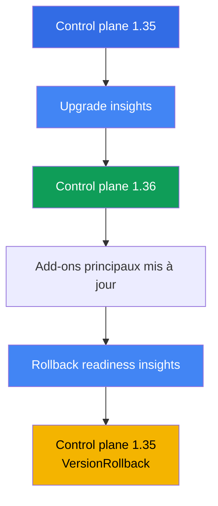
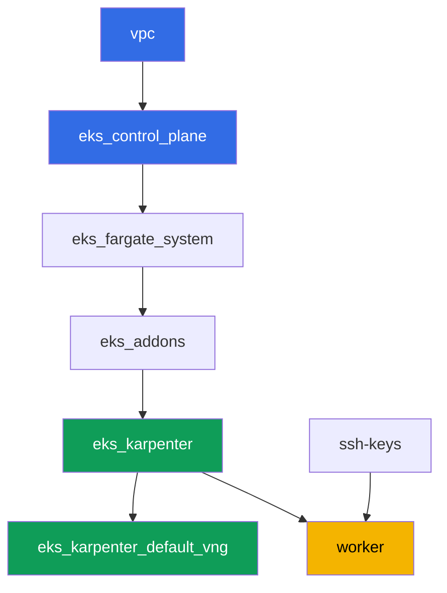

[Русская версия](README_RU.MD) · [Eng version](README.MD) · [Versión en español](README_ES.MD) · [Deutsche Version](README_DE.MD) · [ქართული ვერსია](README_GE.MD) · [繁體中文版](README_TW.MD) · [日本語版](README_JP.MD)

# Lab 113 - Mise à niveau et rollback du cluster : control plane, add-ons, API dépréciées

## Description

Un cluster vit pendant des années, alors que les versions de Kubernetes changent tous les
quelques mois. Dans ce laboratoire, vous parcourez un cycle complet de mise à niveau d'une
version mineure pour EKS sur un cluster vivant : vous vérifiez la disponibilité de la mise à
niveau (upgrade readiness), vous faites avancer le control plane d'une version mineure, vous
mettez à jour les add-ons principaux vers des versions compatibles, puis vous vous assurez
que le chemin de retour est toujours ouvert et vous ramenez le control plane en arrière -
tout cela via les insights standard et `aws eks update-cluster-version`, sans recréer le
cluster.

Les tâches sont écrites dans un style de production : un énoncé court plus des critères
d'acceptation. La vérification est automatique, via la commande `check_result`. Certaines
étapes (la mise à niveau et le rollback du control plane elles-mêmes) prennent des dizaines
de minutes d'attente - c'est un comportement normal pour un control plane managé, pas une
commande bloquée.

## Objectif

Consolider le contenu des chapitres suivants du cours :

- [Chapitre 37. Add-ons EKS : add-ons managés vs. Helm, versions et ordre de mise à jour](../../course/37/ru.md) - qui possède la version de l'add-on
- [Chapitre 38. Mise à niveau du cluster : sur place par version, clusters blue/green, API dépréciées](../../course/38/ru.md) - l'ordre d'une mise à niveau sur place et la recherche des API dépréciées
- [Chapitre 39. Rollback de la version du cluster : rollback readiness insights, la fenêtre de 7 jours, ordre du rollback](../../course/39/ru.md) - le rollback standard du control plane

## Ce que nous créons

Le cluster démarre sur la version `1.35` (une version mineure sous la GA actuelle `1.36`),
afin que dans ce laboratoire vous puissiez réellement mettre à niveau le control plane, puis
le ramener en arrière dans la fenêtre de 7 jours.

| Objet | Ce que c'est | Pourquoi dans ce laboratoire |
|--------|---------|-------------------|
| Namespace `eks-113` | une section du cluster pour les artefacts du laboratoire | garde les résultats des tâches séparés (chapitre 4) |
| Artefact `upgrade_insights.json` | sortie des upgrade insights | vérifier la disponibilité de la mise à niveau avant de la démarrer (chapitre 38) |
| Control plane `1.35 -> 1.36` | mise à niveau sur place d'une version mineure | le processus réel de mise à jour d'un control plane managé (chapitre 38) |
| Add-ons principaux sur des versions compatibles avec `1.36` | kube-proxy, coredns, vpc-cni, pod-identity | mise à jour des add-ons à la suite du control plane (chapitre 37) |
| Artefact `rollback_readiness.json` | sortie des rollback readiness insights | vérifier la disponibilité du rollback dans la fenêtre de 7 jours (chapitre 39) |
| Control plane `1.36 -> 1.35` | rollback `VersionRollback` | rollback standard du control plane sans recréer le cluster (chapitre 39) |

Ordre des opérations dans le laboratoire :



## Infrastructure

L'environnement est déployé sur AWS (`eu-central-1`) via Terragrunt. Chaque dossier du
laboratoire est un composant avec son propre `terragrunt.hcl`, qui référence un module
partagé dans `terraform/modules/` et déclare ses dépendances via des blocs `dependency`.
Terragrunt construit un graphe de dépendances et applique les composants dans le bon ordre.
La mise à niveau et le rollback de la version du cluster dans ce laboratoire sont effectués
**pas via terraform**, mais directement sur le cluster vivant via
`aws eks update-cluster-version` et `aws eks update-addon` - terraform ne déploie que l'état
de départ sur la version `1.35`.

### Modules et dépendances

| Dossier (composant) | Module (`terraform/modules/`) | Dépend de | Ce qu'il crée |
|---------------------|-------------------------------|------------|-------------|
| `vpc` | `vpc_v3` | - | VPC `10.10.0.0/16`, sous-réseaux publics et privés dans deux AZ, NAT |
| `ssh-keys` | `ssh-keys` | - | une paire de clés SSH pour la machine de travail et les nœuds |
| `eks_control_plane` | `eks_v2_control_plane` | `vpc` | control plane EKS `1.35`, OIDC, security groups |
| `eks_fargate_system` | `eks_v2_fargate` | `vpc`, `eks_control_plane` | profil Fargate pour `kube-system` et `karpenter` |
| `eks_addons` | `eks_v2_addons` | `eks_control_plane`, `eks_fargate_system` | add-ons coredns, kube-proxy, vpc-cni, pod-identity sur `1.35` |
| `eks_karpenter` | `eks_v2_karpenter` | `vpc`, `eks_control_plane`, `eks_addons`, `eks_fargate_system` | contrôleur Karpenter, rôle IAM des nœuds |
| `eks_karpenter_default_vng` | `eks_v2_karpenter_vng` | `vpc`, `eks_control_plane`, `eks_karpenter` | NodePool par défaut `default` et EC2NodeClass |
| `worker` | `eks_v2_work_pc` | `ssh-keys`, `vpc`, `eks_control_plane`, `eks_karpenter` | machine de travail avec kubectl, aws cli, tests et `check_result` |

Graphe de dépendances (ce qui est appliqué en premier est plus bas dans la flèche) :



### Où chaque chose est configurée

`env.hcl` (paramètres communs de l'environnement, lus par tous les composants) :

| Paramètre | Valeur dans le laboratoire | Ce qu'il affecte |
|----------|-----------------|---------------|
| `region` | `eu-central-1` | région de toutes les ressources |
| `prefix` | `eks-task113` | préfixe des noms de ressources et des tags |
| `stack_name` | `eks113` | permet de construire `env_name` - le nom du cluster |
| `k8_version` | `1.35.0` | version de kubectl sur la machine de travail, correspond à la version de départ du control plane |
| `ssh_password_enable`, `access_cidrs` | `true`, `0.0.0.0/0` | accès SSH à la machine de travail |

`inputs` dans le `terragrunt.hcl` de chaque composant :

| Fichier | Réglages clés |
|------|--------------------|
| `eks_control_plane/terragrunt.hcl` | `eks.version = "1.35"` - la version de départ du control plane pour ce laboratoire |
| `eks_addons/terragrunt.hcl` | versions des add-ons pour `1.35` : kube-proxy `v1.35.3-eksbuild.13`, coredns `v1.14.3-eksbuild.3`, vpc-cni `v1.22.4-eksbuild.3`, eks-pod-identity-agent `v1.3.10-eksbuild.2` (un commentaire dans le fichier rappelle de vérifier via `aws eks describe-addon-versions --kubernetes-version 1.35`) |
| `worker/terragrunt.hcl` | `test_url` et `task_script_url` pointant vers les fichiers du laboratoire 113, `exam_time_minutes = "900"` (temps supplémentaire pour la longue mise à niveau et le rollback) |

Tous les autres réglages (réseau, Karpenter, add-ons en tant qu'add-ons managés) ne diffèrent
pas du laboratoire de base 101 - seules la version du control plane et les versions des
add-ons principaux qui lui correspondent comptent ici.

## Déploiement

```bash
TASK=113 make run_eks_task
```

Le déploiement prend environ 15 à 20 minutes. Dans la sortie, repérez la ligne avec la
connexion SSH vers la machine de travail et connectez-vous. kubectl et aws cli y sont déjà
configurés pour le bon cluster.

> Une remarque sur le temps. Les tâches 3 (mise à niveau du control plane vers `1.36`) et 6
> (rollback vers `1.35`) sont effectuées par AWS lui-même, et chacune de ces opérations peut
> prendre **20 à 40 minutes**. C'est normal : `update-cluster-version` ne fait que démarrer
> la mise à jour et retourne immédiatement un `id`, tandis que la mise à jour réelle
> s'exécute en arrière-plan. N'interrompez pas la commande et ne recréez pas le cluster si la
> réponse n'arrive pas instantanément - attendez le statut `Successful` via `describe-update`.

Commandes utiles sur la machine de travail :

```bash
time_left       # temps restant de l'environnement
check_result    # vérifier la solution
```

> Sécurité du banc de test. Dans `env.hcl`, `ssh_password_enable = true` et
> `access_cidrs = ["0.0.0.0/0"]` sont activés - pratique pour un environnement de formation,
> mais à ne pas faire en production. Selon les standards du cours (chapitres 0.2, 2, 19),
> l'accès aux machines de travail passe par AWS SSM Session Manager sans port SSH public
> exposé, et `access_cidrs` est restreint à des adresses précises. Ici, le SSH public est
> laissé uniquement pour simplifier le montage.

## Tâches

---
|        **1**        | **Namespace et la version de départ du cluster**             |
| :-----------------: | :----------------------------------------------------------- |
| Ce qu'on fait          | Créez le namespace `eks-113`. Assurez-vous que le control plane est actuellement sur la version `1.35` : `aws eks describe-cluster --name <cluster> --query 'cluster.version'`. Récupérez le nom du cluster via `aws eks list-clusters`. |
| Critères d'acceptation    | - le namespace `eks-113` existe ;<br/>- `cluster.version` est égal à `1.35`. |
---
|        **2**        | **Vérification de la disponibilité de la mise à niveau**                                |
| :-----------------: | :----------------------------------------------------------- |
| Ce qu'on fait          | Lancez les upgrade insights : `aws eks list-insights --cluster-name <cluster>` (sans `--filter` cela affiche toutes les catégories, y compris la disponibilité de la mise à niveau). Enregistrez la sortie dans le fichier `/var/work/tests/artifacts/2/upgrade_insights.json`. Assurez-vous qu'il n'y a pas un seul insight avec le statut `ERROR` dans la liste - ce statut bloque la mise à niveau jusqu'à ce que le problème soit corrigé. |
| Critères d'acceptation    | - le fichier `/var/work/tests/artifacts/2/upgrade_insights.json` n'est pas vide ;<br/>- il ne contient aucune entrée avec le statut `ERROR`. |
---
|        **3**        | **Mise à niveau du control plane vers `1.36`**                     |
| :-----------------: | :----------------------------------------------------------- |
| Ce qu'on fait          | Démarrez la mise à niveau : `aws eks update-cluster-version --name <cluster> --kubernetes-version 1.36`. Attendez qu'elle se termine via `aws eks describe-update --name <cluster> --update-id <id>` (statut `Successful`) - cela peut prendre 20 à 40 minutes. Confirmez que `cluster.version` est devenu `1.36`. |
| Critères d'acceptation    | - `aws eks describe-cluster --name <cluster> --query 'cluster.version'` retourne `1.36`. |
---
|        **4**        | **Mise à niveau des add-ons principaux vers des versions compatibles avec `1.36`**  |
| :-----------------: | :----------------------------------------------------------- |
| Ce qu'on fait          | Mettez à jour `kube-proxy` et `coredns` vers des versions compatibles avec `1.36` (comme dans le laboratoire 101 : kube-proxy `v1.36.0-eksbuild.14`, coredns `v1.14.3-eksbuild.3`), avec `aws eks update-addon --cluster-name <cluster> --addon-name <name> --addon-version <version>`. Attendez le statut `ACTIVE` pour chaque add-on via `aws eks describe-addon`. |
| Critères d'acceptation    | - la version de l'add-on `kube-proxy` commence par `v1.36.` ;<br/>- la version de l'add-on `coredns` est compatible avec la version mineure actuelle (`v1.14.`). |
---
|        **5**        | **Vérification de la disponibilité du rollback**                                |
| :-----------------: | :----------------------------------------------------------- |
| Ce qu'on fait          | Lancez les rollback readiness insights : `aws eks list-insights --cluster-name <cluster> --filter '{"categories": ["ROLLBACK_READINESS"]}'`. Enregistrez la sortie dans le fichier `/var/work/tests/artifacts/5/rollback_readiness.json`. Assurez-vous qu'il n'y a aucun insight avec le statut `ERROR` ou `UNKNOWN` - les deux bloquent le rollback (ils ne peuvent être contournés qu'avec le drapeau `--force`, qui n'annule ni la limite de la fenêtre temporelle ni la règle « une version mineure »). |
| Critères d'acceptation    | - le fichier `/var/work/tests/artifacts/5/rollback_readiness.json` n'est pas vide ;<br/>- il ne contient aucune entrée avec le statut `ERROR` ou `UNKNOWN`. |
---
|        **6**        | **Rollback du control plane vers `1.35`**                  |
| :-----------------: | :----------------------------------------------------------- |
| Ce qu'on fait          | En raison de la mise à niveau de `kube-proxy` dans la tâche 4, un rollback direct du control plane sera bloqué par le rollback readiness insight `kube-proxy version rollback compatibility` (`ERROR` : version skew, `kube-proxy` sur `1.36` est plus récent que le control plane sur `1.35`). Ramenez d'abord `kube-proxy` lui-même vers la version compatible avec `1.35` (`v1.35.3-eksbuild.13`) et attendez `ACTIVE`. Démarrez ensuite le rollback du control plane : `aws eks update-cluster-version --name <cluster> --kubernetes-version 1.35`. Attendez `Successful` via `describe-update` - à nouveau 20 à 40 minutes. Confirmez que `cluster.version` est revenu à `1.35`. Enregistrez le type de mise à jour de la réponse `update-cluster-version` (ou de `describe-update`) dans le fichier `/var/work/tests/artifacts/6/rollback_update.txt` - il doit s'agir de `VersionRollback`, et non d'une mise à niveau ordinaire. |
| Critères d'acceptation    | - `cluster.version` est de nouveau égal à `1.35` ;<br/>- le fichier `/var/work/tests/artifacts/6/rollback_update.txt` n'est pas vide et contient `VersionRollback`. |
---

## Vérification du résultat

Sur la machine de travail, lancez la vérification automatique :

```bash
check_result
```

Le script exécutera les tests et affichera le pourcentage de tâches accomplies. Les tâches 3
et 6 ne vérifient que le résultat final (la version actuelle du cluster) - l'attente réelle de
la mise à niveau ou du rollback n'est pas testée, mais elle doit tout de même aller jusqu'au
bout, sinon la version ne changera pas.

## Solution

Solution de référence : [worker/files/solutions/1_FR.MD](worker/files/solutions/1_FR.MD)

## Suppression du cluster et des ressources

> **Attendez que le control plane quitte l'état `UPDATING`, puis détruisez le banc de
> test.** La mise à niveau et le rollback dans ce laboratoire contournent terraform, en
> passant directement par `aws eks update-cluster-version`. Jusqu'à ce que la dernière
> opération de ce type se termine (`Successful` dans `describe-update`), EKS répond aux
> autres appels par `409 ResourceInUseException ... currently has an update in progress`, et
> `destroy` échouera sur cette erreur ou entrera en boucle de nouvelles tentatives (le
> `terraform/environments/terragrunt.hcl` racine a `retryable_errors` configuré exactement
> pour ce cas). Vous n'avez pas besoin de restaurer la version du control plane avant de
> supprimer - terraform ne stocke pas la version du cluster comme état désiré pour le diff de
> `destroy`, donc une mise à niveau inachevée vers `1.36` ne bloque pas la suppression, elle
> la ralentit seulement.

```bash
# 1. Retirer les artefacts du laboratoire
kubectl delete namespace eks-113 --ignore-not-found

# 2. Attendre que le cluster quitte UPDATING (pertinent si la mise à niveau ou le rollback
#    des tâches 3/6 est encore en cours)
CLUSTER=$(aws eks list-clusters --query 'clusters[0]' --output text)
while [ "$(aws eks describe-cluster --name "$CLUSTER" --query 'cluster.status' --output text)" != "ACTIVE" ]; do
  echo "control plane still UPDATING, waiting..."; sleep 30
done
```

Ce n'est qu'ensuite que vous détruisez le banc de test :

```bash
TASK=113 make delete_eks_task
```

Si `destroy` échoue encore avec `409 ResourceInUseException`, le cluster est encore en train
de se mettre à jour - attendez et répétez `TASK=113 make delete_eks_task`, la commande est
idempotente.
