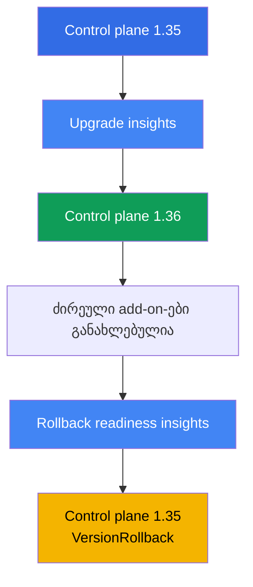
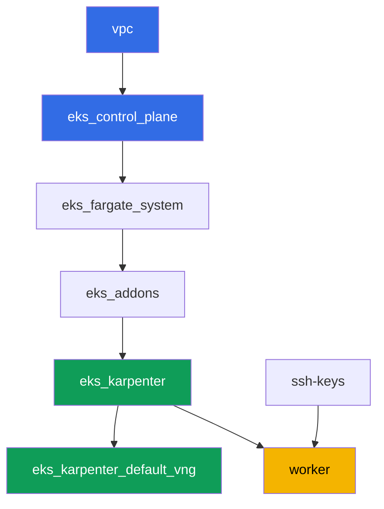

[Русская версия](README_RU.MD) · [Eng version](README.MD) · [Versión en español](README_ES.MD) · [Version française](README_FR.MD) · [Deutsche Version](README_DE.MD) · [繁體中文版](README_TW.MD) · [日本語版](README_JP.MD)

# ლაბა 113 - კლასტერის upgrade და rollback: control plane, add-on-ები, deprecated API-ები

## აღწერა

კლასტერი ცხოვრობს წლობით, ხოლო Kubernetes-ის ვერსიები იცვლება ყოველ რამდენიმე თვეში. ამ
ლაბაში თქვენ გაივლით EKS-ის სრულ minor-ვერსიის upgrade-ციკლს ცოცხალ კლასტერზე: ამოწმებთ
upgrade readiness-ს, გადაატანთ control plane-ს ერთი minor-ვერსით წინ, განაახლებთ
ძირეულ add-on-ებს თანხვედრილ ვერსიებზე, შემდეგ დარწმუნდებით, რომ გზა უკან ჯერ კიდევ
ღიაა და დააბრუნებთ control plane-ს - ეს ყველაფერი სტანდარტული insights-ისა და
`aws eks update-cluster-version`-ის მეშვეობით, კლასტერის ხელახლა შექმნის გარეშე.

დავალებები დაწერილია production-სტილში: მოკლე დავალება პლუს მიღების კრიტერიუმები.
შემოწმება ავტომატურია, ბრძანებით `check_result`. ზოგიერთი ნაბიჯი (control plane-ის
თავადი upgrade და rollback) მოითხოვს ათეულ წუთს ლოდინს - ეს ნორმალური ქცევაა
managed control plane-სთვის, არა გაჭედილი ბრძანება.

## მიზანი

გავამყაროთ კურსის ამ თავების მასალა:

- [თავი 37. EKS add-on-ები: managed add-on-ები vs. Helm, ვერსიები და განახლების რიგი](../../course/37/ru.md) - ვისი პასუხისმგებლობაა add-on-ის ვერსია
- [თავი 38. კლასტერის upgrade: in-place ვერსიის მიხედვით, blue/green კლასტერები, deprecated API-ები](../../course/38/ru.md) - in-place upgrade-ის რიგი და deprecated API-ების პოვნა
- [თავი 39. კლასტერის ვერსიის rollback: rollback readiness insights, 7-დღიანი ფანჯარა, rollback-ის რიგი](../../course/39/ru.md) - control plane-ის სტანდარტული rollback

## რას ვქმნით

კლასტერი იწყება ვერსიაზე `1.35` (ერთი minor ქვემოთ მიმდინარე GA-ვერსიაზე `1.36`-ზე),
რათა ამ ლაბაში ფაქტობრივად შეძლოთ control plane-ის upgrade და შემდეგ მისი rollback
7-დღიან ფანჯარაში.

| ობიექტი | რა არის ეს | რისთვის ამ ლაბაში |
|--------|---------|-------------------|
| Namespace `eks-113` | კლასტერის სექცია ლაბის არტეფაქტებისთვის | ინახავს დავალების შედეგებს განცალკევებულად (თავი 4) |
| არტეფაქტი `upgrade_insights.json` | upgrade insights-ის output | upgrade readiness-ის შემოწმება მის დაწყებამდე (თავი 38) |
| Control plane `1.35 -> 1.36` | in-place upgrade ერთი minor-ით | managed control plane-ის განახლების ფაქტობრივი პროცესი (თავი 38) |
| ძირეული add-on-ები `1.36`-თანხვედრილ ვერსიებზე | kube-proxy, coredns, vpc-cni, pod-identity | add-on-ების განახლება control plane-ის შემდეგ (თავი 37) |
| არტეფაქტი `rollback_readiness.json` | rollback readiness insights-ის output | rollback readiness-ის შემოწმება 7-დღიან ფანჯარაში (თავი 39) |
| Control plane `1.36 -> 1.35` | `VersionRollback` rollback | control plane-ის სტანდარტული rollback კლასტერის ხელახლა შექმნის გარეშე (თავი 39) |

ოპერაციების რიგი ლაბაში:



## ინფრასტრუქტურა

გარემო დეპლოირდება AWS-ში (`eu-central-1`) Terragrunt-ის მეშვეობით. ლაბის ყოველი
დირექტორია ერთი კომპონენტია საკუთარი `terragrunt.hcl`-ით, რომელიც მიმართავს საერთო
მოდულს `terraform/modules/`-ში და აცხადებს დამოკიდებულებებს `dependency` ბლოკებით.
Terragrunt აწყობს დამოკიდებულებების გრაფს და აპლიკებს კომპონენტებს სწორი
თანმიმდევრობით. კლასტერის ვერსიის upgrade და rollback ამ ლაბაში სრულდება
**არა terraform-ის მეშვეობით**, არამედ პირდაპირ ცოცხალ კლასტერზე `aws eks
update-cluster-version`-ისა და `aws eks update-addon`-ის მეშვეობით - terraform მხოლოდ
საწყის მდგომარეობას დეპლოირებს ვერსიაზე `1.35`.

### მოდულები და დამოკიდებულებები

| დირექტორია (კომპონენტი) | მოდული (`terraform/modules/`) | დამოკიდებულია | რას ქმნის |
|---------------------|-------------------------------|------------|-------------|
| `vpc` | `vpc_v3` | - | VPC `10.10.0.0/16`, საჯარო და პრივატული ქვექსელები ორ AZ-ში, NAT |
| `ssh-keys` | `ssh-keys` | - | SSH-გასაღებების წყვილი სამუშაო მანქანისა და ნოუდებისთვის |
| `eks_control_plane` | `eks_v2_control_plane` | `vpc` | EKS control plane `1.35`, OIDC, security groups |
| `eks_fargate_system` | `eks_v2_fargate` | `vpc`, `eks_control_plane` | Fargate-პროფილი `kube-system`-ისთვის და `karpenter`-ისთვის |
| `eks_addons` | `eks_v2_addons` | `eks_control_plane`, `eks_fargate_system` | coredns, kube-proxy, vpc-cni, pod-identity add-on-ები ვერსიაზე `1.35` |
| `eks_karpenter` | `eks_v2_karpenter` | `vpc`, `eks_control_plane`, `eks_addons`, `eks_fargate_system` | Karpenter-ის კონტროლერი, ნოუდების IAM-როლი |
| `eks_karpenter_default_vng` | `eks_v2_karpenter_vng` | `vpc`, `eks_control_plane`, `eks_karpenter` | ნაგულისხმევი NodePool `default` და EC2NodeClass |
| `worker` | `eks_v2_work_pc` | `ssh-keys`, `vpc`, `eks_control_plane`, `eks_karpenter` | სამუშაო მანქანა kubectl-ით, aws cli-ით, ტესტებით და `check_result`-ით |

დამოკიდებულებების გრაფი (რაც უფრო ადრე აპლიცირდება, ის ხრიხისკენ ქვემოთაა):



### სად რა კონფიგურირდება

`env.hcl` (გარემოს საერთო პარამეტრები, წაკითხული ყველა კომპონენტის მიერ):

| პარამეტრი | მნიშვნელობა ლაბაში | რაზე ახდენს გავლენას |
|----------|-----------------|---------------|
| `region` | `eu-central-1` | ყველა რესურსის რეგიონი |
| `prefix` | `eks-task113` | რესურსების სახელებისა და ტეგების პრეფიქსი |
| `stack_name` | `eks113` | მისგან იწყობა `env_name` - კლასტერის სახელი |
| `k8_version` | `1.35.0` | kubectl-ის ვერსია სამუშაო მანქანაზე, ემთხვევა control plane-ის საწყის ვერსიას |
| `ssh_password_enable`, `access_cidrs` | `true`, `0.0.0.0/0` | SSH-წვდომა სამუშაო მანქანაზე |

`inputs` თითოეული კომპონენტის `terragrunt.hcl`-ში:

| ფაილი | ძირითადი პარამეტრები |
|------|--------------------|
| `eks_control_plane/terragrunt.hcl` | `eks.version = "1.35"` - ლაბის control plane-ის საწყისი ვერსია |
| `eks_addons/terragrunt.hcl` | add-on-ების ვერსიები `1.35`-ისთვის: kube-proxy `v1.35.3-eksbuild.13`, coredns `v1.14.3-eksbuild.3`, vpc-cni `v1.22.4-eksbuild.3`, eks-pod-identity-agent `v1.3.10-eksbuild.2` (ფაილში კომენტარი შეხსენებაა, გადამოწმდეს `aws eks describe-addon-versions --kubernetes-version 1.35`-ით) |
| `worker/terragrunt.hcl` | `test_url` და `task_script_url` მიმართავს ლაბა 113-ის ფაილებზე, `exam_time_minutes = "900"` (დამატებითი დრო ხანგრძლივი upgrade-სა და rollback-სთვის) |

ყველა სხვა პარამეტრი (ქსელი, Karpenter, add-on-ები როგორც managed add-on-ები) არაფრით
განსხვავდება საბაზისო ლაბა 101-ისგან - მხოლოდ control plane-ის ვერსია და მისი ძირეული
add-on-ების ვერსიები აქ მნიშვნელობს.

## განლაგება

```bash
TASK=113 make run_eks_task
```

განლაგება გრძელდება დაახლოებით 15-20 წუთი. output-ში მოძებნეთ ხაზი SSH-შეერთებით
სამუშაო მანქანასთან და დაუკავშირდით მას. kubectl და aws cli იქ უკვე კონფიგურირებულია
საჭირო კლასტერზე.

> შენიშვნა დროის შესახებ. დავალება 3 (control plane-ის upgrade `1.36`-ზე) და 6 (მისი
> rollback `1.35`-ზე) სრულდება თავად AWS-ის მიერ, და თითოეულ ამ ოპერაციას შესაძლოა
> დასჭირდეს **20-40 წუთი**. ეს ნორმალურია: `update-cluster-version` მხოლოდ იწყებს
> განახლებას და დაუყოვნებლივ აბრუნებს `id`-ს, ხოლო ფაქტობრივი განახლება მიდის
> ფონურად. არ შეაწყვეტინოთ ბრძანება და არ ხელახლა შექმნათ კლასტერი, თუ პასუხი
> მყისვე არ მოვიდა - დაელოდეთ სტატუსს `Successful` `describe-update`-ის მეშვეობით.

სასარგებლო ბრძანებები სამუშაო მანქანაზე:

```bash
time_left       # რამდენი დრო დარჩა გარემოს
check_result    # გადამოწმება
```

> სტენდის უსაფრთხოება. `env.hcl`-ში ჩართულია `ssh_password_enable = true` და
> `access_cidrs = ["0.0.0.0/0"]` - ეს მოსახერხებელია სასწავლო გარემოსთვის, მაგრამ ასე არ
> უნდა გავხადოთ production-ში. კურსის სტანდარტების მიხედვით (თავები 0.2, 2, 19) სამუშაო
> მანქანებზე წვდომა უნდა იხსნებოდეს AWS SSM Session Manager-ის მეშვეობით, საჯარო
> SSH-პორტების გარეთ გამოტანის გარეშე, ხოლო `access_cidrs` უნდა ვიწროვდებოდეს
> კონკრეტულ მისამართებზე. აქ საჯარო SSH დარჩენილია მხოლოდ გაშვების გასამარტივებლად.

## დავალებები

---
|        **1**        | **Namespace და კლასტერის საწყისი ვერსია**                     |
| :-----------------: | :---------------------------------------------------------- |
| რას ვაკეთებთ          | შექმენით namespace სახელით `eks-113`. დარწმუნდით, რომ control plane ამჯერად ვერსიაზეა `1.35`: `aws eks describe-cluster --name <cluster> --query 'cluster.version'`. კლასტერის სახელი მიიღეთ `aws eks list-clusters`-ით. |
| მიღების კრიტერიუმები    | - namespace `eks-113` არსებობს;<br/>- `cluster.version` ტოლია `1.35`. |
---
|        **2**        | **Upgrade readiness-ის შემოწმება**                             |
| :-----------------: | :---------------------------------------------------------- |
| რას ვაკეთებთ          | გაუშვით upgrade insights: `aws eks list-insights --cluster-name <cluster>` (`--filter`-ის გარეშე ჩანს ყველა კატეგორია, upgrade readiness-ის ჩათვლით). შეინახეთ output ფაილში `/var/work/tests/artifacts/2/upgrade_insights.json`. დარწმუნდით, რომ სიაში არაფერს აქვს სტატუსი `ERROR` - ეს სტატუსი აჩერებს upgrade-ს, სანამ პრობლემა არ გამოსწორდება. |
| მიღების კრიტერიუმები    | - ფაილი `/var/work/tests/artifacts/2/upgrade_insights.json` არ არის ცარიელი;<br/>- მასში არ არსებობს ჩანაწერები სტატუსით `ERROR`. |
---
|        **3**        | **Control plane-ის upgrade `1.36`-ზე**                        |
| :-----------------: | :---------------------------------------------------------- |
| რას ვაკეთებთ          | დაუშვათ upgrade: `aws eks update-cluster-version --name <cluster> --kubernetes-version 1.36`. დაელოდეთ დასრულებას `aws eks describe-update --name <cluster> --update-id <id>`-ის მეშვეობით (სტატუსი `Successful`) - ეს შესაძლოა დასჭირდეს 20-40 წუთს. დარწმუნდით, რომ `cluster.version` გახდა `1.36`. |
| მიღების კრიტერიუმები    | - `aws eks describe-cluster --name <cluster> --query 'cluster.version'` აბრუნებს `1.36`-ს. |
---
|        **4**        | **ძირეული add-on-ების upgrade `1.36`-თანხვედრილ ვერსიებზე**    |
| :-----------------: | :---------------------------------------------------------- |
| რას ვაკეთებთ          | განაახლეთ `kube-proxy` და `coredns` `1.36`-თან თანხვედრილ ვერსიებზე (როგორც ლაბა 101-ში: kube-proxy `v1.36.0-eksbuild.14`, coredns `v1.14.3-eksbuild.3`), `aws eks update-addon --cluster-name <cluster> --addon-name <name> --addon-version <version>`-ის მეშვეობით. დაელოდეთ სტატუსს `ACTIVE` თითოეული add-on-ისთვის `aws eks describe-addon`-ის მეშვეობით. |
| მიღების კრიტერიუმები    | - `kube-proxy` add-on-ის ვერსია იწყება `v1.36.`-ით;<br/>- `coredns` add-on-ის ვერსია თანხვედრილია მიმდინარე minor-თან (`v1.14.`). |
---
|        **5**        | **Rollback readiness-ის შემოწმება**                            |
| :-----------------: | :---------------------------------------------------------- |
| რას ვაკეთებთ          | გაუშვით rollback readiness insights: `aws eks list-insights --cluster-name <cluster> --filter '{"categories": ["ROLLBACK_READINESS"]}'`. შეინახეთ output ფაილში `/var/work/tests/artifacts/5/rollback_readiness.json`. დარწმუნდით, რომ არაფერს აქვს სტატუსი `ERROR` ან `UNKNOWN` - ორივე აჩერებს rollback-ს (შემოვლა შესაძლებელია მხოლოდ `--force` flag-ით, რომელიც არ აქარწყლებს დროის ფანჯარის ლიმიტს ან "ერთი minor"-ის წესს). |
| მიღების კრიტერიუმები    | - ფაილი `/var/work/tests/artifacts/5/rollback_readiness.json` არ არის ცარიელი;<br/>- მასში არ არსებობს ჩანაწერები სტატუსით `ERROR` ან `UNKNOWN`. |
---
|        **6**        | **Control plane-ის rollback `1.35`-ზე**                        |
| :-----------------: | :---------------------------------------------------------- |
| რას ვაკეთებთ          | დავალება 4-ში `kube-proxy`-ის upgrade-ის გამო, control plane-ის პირდაპირ rollback დაბლოკილი იქნება rollback readiness insight-ით `kube-proxy version rollback compatibility` (`ERROR`: version skew, `kube-proxy` ვერსიაზე `1.36` უფრო ახალია, ვიდრე control plane ვერსიაზე `1.35`). ჯერ დააბრუნეთ `kube-proxy` თავად `1.35`-თან თანხვედრილ ვერსიაზე (`v1.35.3-eksbuild.13`) და დაელოდეთ `ACTIVE`-ს. შემდეგ დაუშვათ control plane-ის rollback: `aws eks update-cluster-version --name <cluster> --kubernetes-version 1.35`. დაელოდეთ `Successful`-ს `describe-update`-ის მეშვეობით - ისევ 20-40 წუთი. დარწმუნდით, რომ `cluster.version` დაბრუნდა `1.35`-ზე. შეინახეთ update-ის ტიპი `update-cluster-version`-ის პასუხიდან (ან `describe-update`-იდან) ფაილში `/var/work/tests/artifacts/6/rollback_update.txt` - ის უნდა იყოს `VersionRollback`, არა ჩვეულებრივი upgrade. |
| მიღების კრიტერიუმები    | - `cluster.version` ისევ ტოლია `1.35`;<br/>- ფაილი `/var/work/tests/artifacts/6/rollback_update.txt` არ არის ცარიელი და შეიცავს `VersionRollback`-ს. |
---

## შედეგის შემოწმება

სამუშაო მანქანაზე გაუშვით ავტომატური შემოწმება:

```bash
check_result
```

სკრიპტი გაუშვებს ტესტებს და გამოაჩენს შესრულებული დავალებების პროცენტს. დავალებები 3 და 6
ამოწმებენ მხოლოდ საბოლოო შედეგს (კლასტერის მიმდინარე ვერსიას) - upgrade-ის ან rollback-ის
ფაქტობრივი ლოდინი არ ტესტირდება, მაგრამ მან მაინც უნდა დასრულდეს, სხვა შემთხვევაში
ვერსია არ შეიცვლება.

## გადაწყვეტა

ეტალონური გადაწყვეტა: [worker/files/solutions/1_GE.MD](worker/files/solutions/1_GE.MD)

## კლასტერისა და რესურსების წაშლა

> **დაელოდეთ, სანამ control plane არ გამოვა `UPDATING` მდგომარეობიდან, მხოლოდ მერე
> დაანგრიეთ სტენდი.** ამ ლაბაში upgrade და rollback გვერდს უვლის terraform-ს და
> სრულდება პირდაპირ `aws eks update-cluster-version`-ის მეშვეობით. სანამ ბოლო ასეთი
> ოპერაცია არ დასრულდება (`Successful` `describe-update`-ში), EKS სხვა გამოძახებებზე
> პასუხობს `409 ResourceInUseException ... currently has an update in progress`-ით, და
> `destroy` ან ჩავარდება ამ შეცდომაზე, ან გადავა retry-ებში (root
> `terraform/environments/terragrunt.hcl`-ში `retryable_errors` კონფიგურირებულია ზუსტად
> ამ შემთხვევისთვის). არ არის საჭირო control plane-ის ვერსიის აღდგენა წაშლამდე -
> terraform არ ინახავს კლასტერის ვერსიას როგორც სასურველ მდგომარეობას `destroy`-diff-ისთვის,
> ამიტომ დაუსრულებელი upgrade `1.36`-ზე არ ბლოკავს წაშლას, მხოლოდ ანელებს მას.

```bash
# 1. ლაბის არტეფაქტების მოხსნა
kubectl delete namespace eks-113 --ignore-not-found

# 2. დაელოდეთ, სანამ კლასტერი არ გამოვა UPDATING-იდან (მნიშვნელოვანია, თუ upgrade ან
#    rollback დავალება 3/6-იდან ჯერ კიდევ მიმდინარეობს)
CLUSTER=$(aws eks list-clusters --query 'clusters[0]' --output text)
while [ "$(aws eks describe-cluster --name "$CLUSTER" --query 'cluster.status' --output text)" != "ACTIVE" ]; do
  echo "control plane still UPDATING, waiting..."; sleep 30
done
```

მხოლოდ ამის შემდეგ დაანგრიეთ სტენდი:

```bash
TASK=113 make delete_eks_task
```

თუ `destroy` მაინც ჩავარდა `409 ResourceInUseException`-ზე, კლასტერი ჯერ კიდევ
განახლდება - დაელოდეთ და გაიმეორეთ `TASK=113 make delete_eks_task`, ბრძანება
იდემპოტენტურია.
