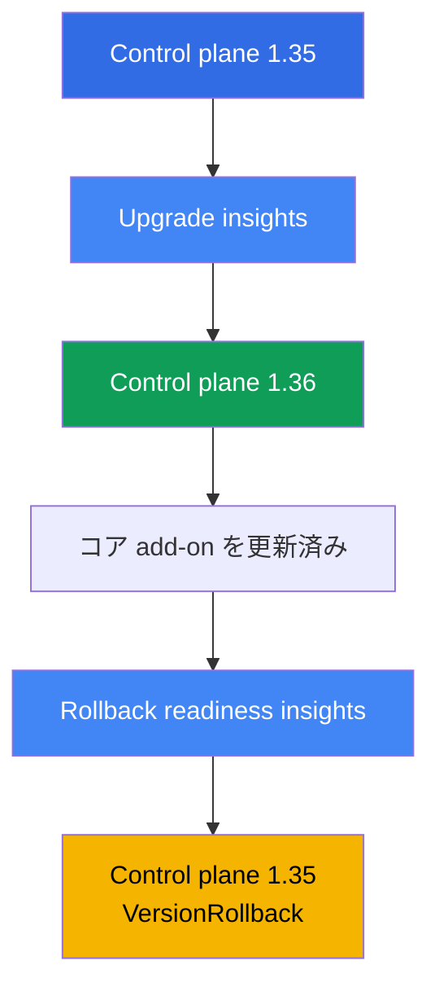
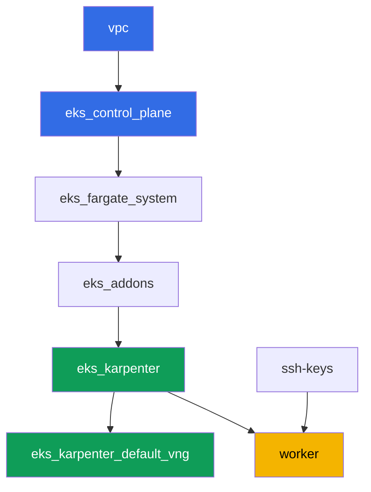

[Русская версия](README_RU.MD) · [Eng version](README.MD) · [Versión en español](README_ES.MD) · [Version française](README_FR.MD) · [Deutsche Version](README_DE.MD) · [ქართული ვერსია](README_GE.MD) · [繁體中文版](README_TW.MD)

# ラボ 113 - クラスタのアップグレードとロールバック:control plane、add-on、非推奨 API

## 説明

クラスタは何年も稼働し続けますが、Kubernetes のバージョンは数ヶ月ごとに変わります。この
ラボでは、稼働中の EKS クラスタに対してマイナーバージョンのアップグレードサイクルを一通り
実行します:アップグレードの準備状況を確認し、control plane を 1 マイナー上に進め、コア
add-on を互換バージョンに更新し、それから戻り道がまだ開いていることを確認して control
plane をロールバックします - すべて標準の insights と `aws eks update-cluster-version`
を通じて行い、クラスタを再作成することはありません。

タスクは production スタイルで書かれています:短い課題文とアクセプタンス基準。検証は
`check_result` コマンドによって自動的に行われます。一部のステップ(control plane 自体の
アップグレードとロールバック)は数十分の待機を伴います - これはマネージドな control
plane の正常な挙動であり、コマンドが止まっているわけではありません。

## 目的

コースの以下の章の内容を定着させます:

- [第 37 章。EKS add-on:managed add-on と Helm の違い、バージョンと更新順序](../../course/37/ru.md) - add-on のバージョンを誰が管理しているか
- [第 38 章。クラスタのアップグレード:バージョン単位のインプレース更新、blue/green クラスタ、非推奨 API](../../course/38/ru.md) - インプレースアップグレードの順序と非推奨 API の見つけ方
- [第 39 章。クラスタバージョンのロールバック:rollback readiness insights、7 日間の期限、ロールバックの順序](../../course/39/ru.md) - 標準的な control plane のロールバック

## 作成するもの

クラスタはバージョン `1.35`(現行の GA である `1.36` より 1 マイナー低い)から始まるため、
このラボでは実際に control plane をアップグレードし、その後 7 日間の期限内にロールバック
することができます。

| オブジェクト | 何か | このラボでの目的 |
|--------|---------|-------------------|
| Namespace `eks-113` | ラボのアーティファクト用のクラスタ区画 | タスクの結果を分離しておく(第 4 章) |
| アーティファクト `upgrade_insights.json` | upgrade insights の出力 | アップグレードを始める前に準備状況を確認する(第 38 章) |
| Control plane `1.35 -> 1.36` | 1 マイナー分のインプレースアップグレード | マネージドな control plane を更新する実際のプロセス(第 38 章) |
| `1.36` 互換バージョンのコア add-on | kube-proxy、coredns、vpc-cni、pod-identity | control plane に追従して add-on を更新する(第 37 章) |
| アーティファクト `rollback_readiness.json` | rollback readiness insights の出力 | 7 日間の期限内でロールバックの準備状況を確認する(第 39 章) |
| Control plane `1.36 -> 1.35` | `VersionRollback` ロールバック | クラスタを再作成せずに行う標準的な control plane のロールバック(第 39 章) |

このラボにおける作業の順序:



## インフラストラクチャ

環境は Terragrunt によって AWS(`eu-central-1`)にデプロイされます。ラボの各ディレクトリ
は 1 つのコンポーネントであり、それぞれ独自の `terragrunt.hcl` を持ち、
`terraform/modules/` の共有モジュールを参照し、`dependency` ブロックで依存関係を宣言し
ます。Terragrunt は依存関係グラフを構築し、正しい順序でコンポーネントを適用します。この
ラボにおけるクラスタバージョンのアップグレードとロールバックは **terraform を経由せず**、
稼働中のクラスタに対して直接 `aws eks update-cluster-version` と `aws eks update-addon`
で行います - terraform がデプロイするのはバージョン `1.35` の初期状態のみです。

### モジュールと依存関係

| ディレクトリ(コンポーネント) | モジュール(`terraform/modules/`) | 依存先 | 作成されるもの |
|---------------------|-------------------------------|------------|-------------|
| `vpc` | `vpc_v3` | - | VPC `10.10.0.0/16`、2 つの AZ にあるパブリックとプライベートのサブネット、NAT |
| `ssh-keys` | `ssh-keys` | - | ワーカーマシンとノード用の SSH キーペア |
| `eks_control_plane` | `eks_v2_control_plane` | `vpc` | EKS control plane `1.35`、OIDC、security groups |
| `eks_fargate_system` | `eks_v2_fargate` | `vpc`、`eks_control_plane` | `kube-system` と `karpenter` 用の Fargate profile |
| `eks_addons` | `eks_v2_addons` | `eks_control_plane`、`eks_fargate_system` | `1.35` 上の coredns、kube-proxy、vpc-cni、pod-identity アドオン |
| `eks_karpenter` | `eks_v2_karpenter` | `vpc`、`eks_control_plane`、`eks_addons`、`eks_fargate_system` | Karpenter コントローラ、ノードの IAM ロール |
| `eks_karpenter_default_vng` | `eks_v2_karpenter_vng` | `vpc`、`eks_control_plane`、`eks_karpenter` | デフォルトの NodePool `default` と EC2NodeClass |
| `worker` | `eks_v2_work_pc` | `ssh-keys`、`vpc`、`eks_control_plane`、`eks_karpenter` | kubectl、aws cli、テスト、`check_result` を備えたワーカーマシン |

依存関係グラフ(先に適用されるものほど矢印の下側にある):



### どこで何が設定されるか

`env.hcl`(すべてのコンポーネントが読み込む共通の環境パラメータ):

| パラメータ | ラボでの値 | 影響範囲 |
|----------|-----------------|---------------|
| `region` | `eu-central-1` | すべてのリソースのリージョン |
| `prefix` | `eks-task113` | リソース名とタグのプレフィックス |
| `stack_name` | `eks113` | ここから `env_name`(クラスタ名)が組み立てられる |
| `k8_version` | `1.35.0` | ワーカーマシン上の kubectl のバージョン、control plane の開始バージョンに一致 |
| `ssh_password_enable`、`access_cidrs` | `true`、`0.0.0.0/0` | ワーカーマシンへの SSH アクセス |

各コンポーネントの `terragrunt.hcl` の `inputs`:

| ファイル | 主な設定 |
|------|--------------------|
| `eks_control_plane/terragrunt.hcl` | `eks.version = "1.35"` - このラボの control plane の開始バージョン |
| `eks_addons/terragrunt.hcl` | `1.35` 用の add-on バージョン:kube-proxy `v1.35.3-eksbuild.13`、coredns `v1.14.3-eksbuild.3`、vpc-cni `v1.22.4-eksbuild.3`、eks-pod-identity-agent `v1.3.10-eksbuild.2`(ファイル内のコメントは `aws eks describe-addon-versions --kubernetes-version 1.35` で再確認するようにという注記) |
| `worker/terragrunt.hcl` | ラボ 113 のファイルを指す `test_url` と `task_script_url`、`exam_time_minutes = "900"`(長いアップグレードとロールバックのための追加時間) |

その他の設定(ネットワーク、Karpenter、managed add-on としての add-on)はすべて基礎とな
るラボ 101 と変わりません - ここで重要なのは control plane のバージョンと、それに対応す
るコア add-on のバージョンだけです。

## デプロイ

```bash
TASK=113 make run_eks_task
```

デプロイには約 15-20 分かかります。出力の中からワーカーマシンへの SSH 接続の行を見つけて
接続してください。そこでは kubectl と aws cli が既に正しいクラスタ向けに設定されています。

> 時間についての注記。タスク 3(control plane を `1.36` にアップグレードする)とタスク
> 6(`1.35` にロールバックする)は AWS 自身によって実行され、それぞれの操作に **20-40
> 分** かかることがあります。これは正常です:`update-cluster-version` はアップデートを
> 開始するだけで即座に `id` を返し、実際の更新はバックグラウンドで進みます。応答がすぐ
> に返ってこなくてもコマンドを中断したりクラスタを再作成したりせず、`describe-update`
> で `Successful` ステータスになるまで待ってください。

ワーカーマシン上で使える便利なコマンド:

```bash
time_left       # 環境の残り時間
check_result    # 解答の確認
```

> 検証環境のセキュリティについて。`env.hcl` では `ssh_password_enable = true` と
> `access_cidrs = ["0.0.0.0/0"]` が有効になっています - 学習用環境としては便利ですが、
> 本番環境ではこのようにしてはいけません。コースの標準(第 0.2、2、19 章)によれば、
> ワーカーマシンへのアクセスは公開 SSH ポートを外に出さずに AWS SSM Session Manager を
> 経由して開き、`access_cidrs` は具体的なアドレスに絞り込みます。ここでは、セットアップ
> を簡単にするためだけに公開 SSH を残しています。

## タスク

---
|        **1**        | **Namespace とクラスタの開始バージョン**             |
| :-----------------: | :----------------------------------------------------------- |
| やること          | Namespace `eks-113` を作成してください。control plane が現在バージョン `1.35` であることを確認してください:`aws eks describe-cluster --name <cluster> --query 'cluster.version'`。クラスタ名は `aws eks list-clusters` で取得します。 |
| アクセプタンス基準    | - namespace `eks-113` が存在する;<br/>- `cluster.version` が `1.35` に等しい。 |
---
|        **2**        | **アップグレード準備状況の確認**                                |
| :-----------------: | :----------------------------------------------------------- |
| やること          | upgrade insights を実行してください:`aws eks list-insights --cluster-name <cluster>`(`--filter` なしではアップグレード準備を含むすべてのカテゴリが表示されます)。出力をファイル `/var/work/tests/artifacts/2/upgrade_insights.json` に保存してください。リストの中にステータス `ERROR` の insight が 1 つもないことを確認してください - このステータスは問題が修正されるまでアップグレードをブロックします。 |
| アクセプタンス基準    | - ファイル `/var/work/tests/artifacts/2/upgrade_insights.json` が空でない;<br/>- ステータス `ERROR` のエントリがない。 |
---
|        **3**        | **control plane を `1.36` にアップグレードする**                     |
| :-----------------: | :----------------------------------------------------------- |
| やること          | アップグレードを開始してください:`aws eks update-cluster-version --name <cluster> --kubernetes-version 1.36`。`aws eks describe-update --name <cluster> --update-id <id>` で完了(ステータス `Successful`)を待ってください - これには 20-40 分かかることがあります。`cluster.version` が `1.36` になったことを確認してください。 |
| アクセプタンス基準    | - `aws eks describe-cluster --name <cluster> --query 'cluster.version'` が `1.36` を返す。 |
---
|        **4**        | **コア add-on を `1.36` 互換バージョンにアップグレードする**  |
| :-----------------: | :----------------------------------------------------------- |
| やること          | `kube-proxy` と `coredns` を `1.36` 互換のバージョン(ラボ 101 と同じ:kube-proxy `v1.36.0-eksbuild.14`、coredns `v1.14.3-eksbuild.3`)に、`aws eks update-addon --cluster-name <cluster> --addon-name <name> --addon-version <version>` で更新してください。各 add-on について `aws eks describe-addon` で `ACTIVE` ステータスを待ってください。 |
| アクセプタンス基準    | - `kube-proxy` add-on のバージョンが `v1.36.` で始まる;<br/>- `coredns` add-on のバージョンが現在のマイナー(`v1.14.`)と互換である。 |
---
|        **5**        | **ロールバック準備状況の確認**                                |
| :-----------------: | :----------------------------------------------------------- |
| やること          | rollback readiness insights を実行してください:`aws eks list-insights --cluster-name <cluster> --filter '{"categories": ["ROLLBACK_READINESS"]}'`。出力をファイル `/var/work/tests/artifacts/5/rollback_readiness.json` に保存してください。ステータス `ERROR` または `UNKNOWN` の insight がないことを確認してください - どちらもロールバックをブロックします(`--force` フラグでのみ回避できますが、これは期限や「1 マイナーまで」というルールを取り消すものではありません)。 |
| アクセプタンス基準    | - ファイル `/var/work/tests/artifacts/5/rollback_readiness.json` が空でない;<br/>- ステータス `ERROR` または `UNKNOWN` のエントリがない。 |
---
|        **6**        | **control plane を `1.35` にロールバックする**                  |
| :-----------------: | :----------------------------------------------------------- |
| やること          | タスク 4 での `kube-proxy` のアップグレードにより、control plane を直接ロールバックすると rollback readiness insight の `kube-proxy version rollback compatibility`(`ERROR`:version skew。`kube-proxy` が `1.36` で control plane が `1.35` だと `kube-proxy` の方が新しくなる)によってブロックされます。まず `kube-proxy` 自体を `1.35` 互換バージョン(`v1.35.3-eksbuild.13`)に戻し、`ACTIVE` を待ってください。その後 control plane のロールバックを開始します:`aws eks update-cluster-version --name <cluster> --kubernetes-version 1.35`。`describe-update` で `Successful` を待ってください - こちらも 20-40 分かかります。`cluster.version` が `1.35` に戻ったことを確認してください。`update-cluster-version` のレスポンス(または `describe-update`)からアップデートの種類をファイル `/var/work/tests/artifacts/6/rollback_update.txt` に保存してください - 通常のアップグレードではなく `VersionRollback` である必要があります。 |
| アクセプタンス基準    | - `cluster.version` が再び `1.35` に等しい;<br/>- ファイル `/var/work/tests/artifacts/6/rollback_update.txt` が空でなく `VersionRollback` を含む。 |
---

## 結果の確認

ワーカーマシン上で自動チェックを実行してください:

```bash
check_result
```

スクリプトがテストを実行し、完了したタスクの割合を表示します。タスク 3 と 6 は最終結果
(クラスタの現在のバージョン)のみを確認します - アップグレードやロールバックの実際の待
機自体は検証対象ではありませんが、それでも最後まで完了させないとバージョンは変わりません。

## 解答

参考解答:[worker/files/solutions/1_JP.MD](worker/files/solutions/1_JP.MD)

## クラスタとリソースの削除

> **control plane が `UPDATING` 状態から抜けるのを待ってから、スタックを破棄してくださ
> い。** このラボにおけるアップグレードとロールバックは terraform を経由せず、
> `aws eks update-cluster-version` を直接呼び出します。最後の操作が完了する
> (`describe-update` で `Successful`)まで、EKS は他の呼び出しに対して
> `409 ResourceInUseException ... currently has an update in progress` を返し、
> `destroy` はこのエラーで失敗するかリトライに入ります(ルートの
> `terraform/environments/terragrunt.hcl` にはまさにこのケース用の `retryable_errors`
> が設定されています)。削除の前に control plane のバージョンを元に戻す必要はありません
> - terraform は `destroy` の diff において望ましい状態としてクラスタバージョンを保持
> していないため、`1.36` への未完了のアップグレードは削除をブロックせず、遅らせるだけ
> です。

```bash
# 1. ラボのアーティファクトを削除する
kubectl delete namespace eks-113 --ignore-not-found

# 2. クラスタが UPDATING から抜けるのを待つ(タスク 3/6 のアップグレードや
#    ロールバックがまだ進行中の場合に関係する)
CLUSTER=$(aws eks list-clusters --query 'clusters[0]' --output text)
while [ "$(aws eks describe-cluster --name "$CLUSTER" --query 'cluster.status' --output text)" != "ACTIVE" ]; do
  echo "control plane はまだ UPDATING、待機中..."; sleep 30
done
```

それが終わってから、スタックを破棄してください:

```bash
TASK=113 make delete_eks_task
```

それでも `destroy` が `409 ResourceInUseException` で失敗する場合、クラスタはまだ更新
中です - 少し待ってから `TASK=113 make delete_eks_task` を再実行してください、このコマ
ンドは冪等です。
