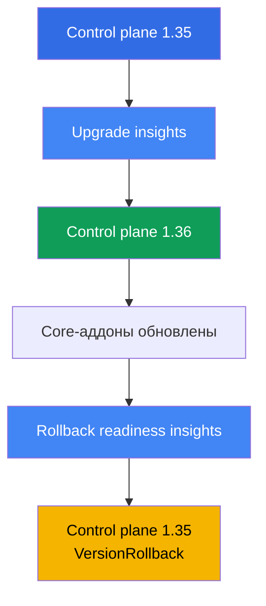
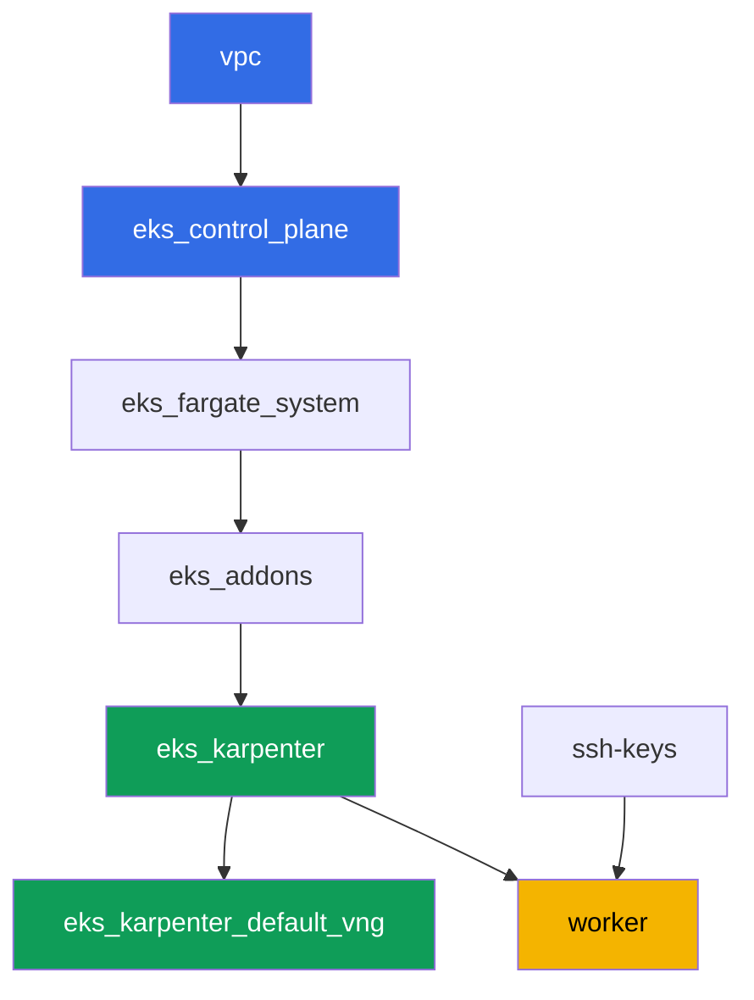

# Лаба 113 - Апгрейд и откат кластера: control plane, аддоны, устаревшие API

## Описание

Кластер живёт годами, а версии Kubernetes сменяются каждые несколько месяцев. В этой лабе
вы проходите полный цикл минорного обновления EKS на живом кластере: проверяете готовность
к апгрейду, поднимаете control plane на один минор вверх, обновляете core-аддоны до
совместимых версий, а затем убеждаетесь, что путь назад ещё открыт, и откатываете control
plane обратно - всё через штатные insights и `aws eks update-cluster-version`, без
пересоздания кластера.

Задания в продакшн-стиле: короткая постановка плюс критерии приёмки. Проверка -
автоматическая, командой `check_result`. Часть шагов (сам апгрейд и откат control plane)
занимают десятки минут ожидания - это нормальное поведение managed control plane, а не
зависшая команда.

## Цель

Закрепить материал глав курса:

- [Глава 37. Аддоны EKS: managed addons против Helm, версии и порядок обновления](../../course/37/ru.md) - кто владеет версией аддонов
- [Глава 38. Обновление кластера: in-place по версиям, blue/green кластеры, устаревшие API](../../course/38/ru.md) - порядок in-place апгрейда и поиск устаревших API
- [Глава 39. Откат версии кластера: rollback readiness insights, окно 7 дней, порядок отката](../../course/39/ru.md) - штатный откат control plane

## Что мы создаём

Кластер стартует на версии `1.35` (на минор ниже актуальной GA `1.36`), чтобы в лабе можно
было реально апгрейднуть control plane вверх и затем откатить его назад в течение
7-дневного окна.

| Объект | Что это | Зачем в этой лабе |
|--------|---------|-------------------|
| Namespace `eks-113` | раздел кластера под артефакты лабы | держим результаты заданий отдельно (глава 4) |
| Артефакт `upgrade_insights.json` | вывод upgrade insights | проверка готовности к апгрейду до его запуска (глава 38) |
| Control plane `1.35 -> 1.36` | in-place апгрейд на один минор | сам процесс обновления managed control plane (глава 38) |
| Core-аддоны на версиях под `1.36` | kube-proxy, coredns, vpc-cni, pod-identity | обновление аддонов вслед за control plane (глава 37) |
| Артефакт `rollback_readiness.json` | вывод rollback readiness insights | проверка готовности к откату внутри окна 7 дней (глава 39) |
| Control plane `1.36 -> 1.35` | откат `VersionRollback` | штатный откат control plane без пересоздания кластера (глава 39) |

Порядок операций лабы:



## Инфраструктура

Окружение разворачивается в AWS (`eu-central-1`) через Terragrunt. Каждый каталог лабы -
это один компонент со своим `terragrunt.hcl`, который ссылается на общий модуль в
`terraform/modules/` и объявляет зависимости через блоки `dependency`. Terragrunt строит
граф зависимостей и применяет компоненты в правильном порядке. Апгрейд и откат версии
кластера в этой лабе выполняются **не через terraform**, а прямо на живом кластере через
`aws eks update-cluster-version` и `aws eks update-addon` - terraform только разворачивает
стартовое состояние на версии `1.35`.

### Модули и зависимости

| Каталог (компонент) | Модуль (`terraform/modules/`) | Зависит от | Что создаёт |
|---------------------|-------------------------------|------------|-------------|
| `vpc` | `vpc_v3` | - | VPC `10.10.0.0/16`, публичные и приватные подсети в двух AZ, NAT |
| `ssh-keys` | `ssh-keys` | - | пара SSH-ключей для рабочей машины и нод |
| `eks_control_plane` | `eks_v2_control_plane` | `vpc` | control plane EKS `1.35`, OIDC, security groups |
| `eks_fargate_system` | `eks_v2_fargate` | `vpc`, `eks_control_plane` | Fargate-профиль для `kube-system` и `karpenter` |
| `eks_addons` | `eks_v2_addons` | `eks_control_plane`, `eks_fargate_system` | аддоны coredns, kube-proxy, vpc-cni, pod-identity под `1.35` |
| `eks_karpenter` | `eks_v2_karpenter` | `vpc`, `eks_control_plane`, `eks_addons`, `eks_fargate_system` | контроллер Karpenter, IAM-роль нод |
| `eks_karpenter_default_vng` | `eks_v2_karpenter_vng` | `vpc`, `eks_control_plane`, `eks_karpenter` | дефолтный NodePool `default` и EC2NodeClass |
| `worker` | `eks_v2_work_pc` | `ssh-keys`, `vpc`, `eks_control_plane`, `eks_karpenter` | рабочая машина с kubectl, aws cli, тестами и `check_result` |

Граф зависимостей (что применяется раньше, то ниже по стрелке):



### Где что настраивается

`env.hcl` (общие параметры окружения, читаются всеми компонентами):

| Параметр | Значение в лабе | На что влияет |
|----------|-----------------|---------------|
| `region` | `eu-central-1` | регион всех ресурсов |
| `prefix` | `eks-task113` | префикс имён ресурсов и тегов |
| `stack_name` | `eks113` | из него собирается `env_name` - имя кластера |
| `k8_version` | `1.35.0` | версия kubectl на рабочей машине, соответствует стартовой версии control plane |
| `ssh_password_enable`, `access_cidrs` | `true`, `0.0.0.0/0` | доступ по SSH к рабочей машине |

`inputs` в `terragrunt.hcl` каждого компонента:

| Файл | Ключевые настройки |
|------|--------------------|
| `eks_control_plane/terragrunt.hcl` | `eks.version = "1.35"` - стартовая версия control plane лабы |
| `eks_addons/terragrunt.hcl` | версии аддонов под `1.35`: kube-proxy `v1.35.3-eksbuild.13`, coredns `v1.14.3-eksbuild.3`, vpc-cni `v1.22.4-eksbuild.3`, eks-pod-identity-agent `v1.3.10-eksbuild.2` (комментарий в файле напоминает сверить через `aws eks describe-addon-versions --kubernetes-version 1.35`) |
| `worker/terragrunt.hcl` | `test_url` и `task_script_url` на файлы лабы 113, `exam_time_minutes = "900"` (запас времени под долгий апгрейд и откат) |

Все остальные настройки (сеть, Karpenter, аддоны как managed addons) не отличаются от базовой
лабы 101 - здесь важна только версия control plane и версии core-аддонов под неё.

## Развёртывание

```bash
TASK=113 make run_eks_task
```

Развёртывание занимает примерно 15-20 минут. В выводе найдите строку с SSH-подключением к
рабочей машине и подключитесь к ней. kubectl и aws cli там уже настроены на нужный кластер.

> Важно про время. Задания 3 (апгрейд control plane на `1.36`) и 6 (откат обратно на `1.35`)
> выполняет сама AWS, и каждая из этих операций может занять **20-40 минут**. Это нормально:
> `update-cluster-version` только запускает обновление и сразу возвращает `id`, а само
> обновление идёт в фоне. Не прерывайте команду и не пересоздавайте кластер, если ответ не
> пришёл мгновенно - дождитесь статуса `Successful` через `describe-update`.

Полезные команды на рабочей машине:

```bash
time_left       # сколько осталось времени окружения
check_result    # проверить решение
```

> Безопасность стенда. В `env.hcl` включены `ssh_password_enable = true` и
> `access_cidrs = ["0.0.0.0/0"]` - это удобно для учебного окружения, но так делать в
> продакшене нельзя. По стандартам курса (главы 0.2, 2, 19) доступ к рабочим машинам
> открывают через AWS SSM Session Manager без публичных SSH-портов наружу, а `access_cidrs`
> сужают до конкретных адресов. Здесь публичный SSH оставлен только ради простоты запуска.

## Задания

---
|        **1**        | **Namespace и стартовая версия кластера**                    |
| :-----------------: | :----------------------------------------------------------- |
| Что делаем          | Создайте namespace `eks-113`. Убедитесь, что control plane сейчас на версии `1.35`: `aws eks describe-cluster --name <cluster> --query 'cluster.version'`. Имя кластера возьмите через `aws eks list-clusters`. |
| Критерии приёмки    | - namespace `eks-113` существует;<br/>- `cluster.version` равен `1.35`. |
---
|        **2**        | **Проверка готовности к апгрейду**                           |
| :-----------------: | :----------------------------------------------------------- |
| Что делаем          | Прогоните upgrade insights: `aws eks list-insights --cluster-name <cluster>` (без `--filter` покажет все категории, включая готовность к апгрейду). Сохраните вывод в файл `/var/work/tests/artifacts/2/upgrade_insights.json`. Убедитесь, что в списке нет ни одного insight со статусом `ERROR` - такой статус блокирует апгрейд, пока проблему не починят. |
| Критерии приёмки    | - файл `/var/work/tests/artifacts/2/upgrade_insights.json` не пуст;<br/>- в нём нет записей со статусом `ERROR`. |
---
|        **3**        | **Апгрейд control plane на `1.36`**                          |
| :-----------------: | :----------------------------------------------------------- |
| Что делаем          | Запустите апгрейд: `aws eks update-cluster-version --name <cluster> --kubernetes-version 1.36`. Дождитесь завершения через `aws eks describe-update --name <cluster> --update-id <id>` (статус `Successful`) - это может занять 20-40 минут. Подтвердите, что `cluster.version` стал `1.36`. |
| Критерии приёмки    | - `aws eks describe-cluster --name <cluster> --query 'cluster.version'` возвращает `1.36`. |
---
|        **4**        | **Апгрейд core-аддонов до версий под `1.36`**                |
| :-----------------: | :----------------------------------------------------------- |
| Что делаем          | Обновите `kube-proxy` и `coredns` до версий, совместимых с `1.36` (как в лабе 101: kube-proxy `v1.36.0-eksbuild.14`, coredns `v1.14.3-eksbuild.3`), командой `aws eks update-addon --cluster-name <cluster> --addon-name <name> --addon-version <version>`. Дождитесь статуса `ACTIVE` для каждого аддона через `aws eks describe-addon`. |
| Критерии приёмки    | - версия аддона `kube-proxy` начинается с `v1.36.`;<br/>- версия аддона `coredns` совместима с текущим минором (`v1.14.`). |
---
|        **5**        | **Проверка готовности к откату**                             |
| :-----------------: | :----------------------------------------------------------- |
| Что делаем          | Прогоните rollback readiness insights: `aws eks list-insights --cluster-name <cluster> --filter '{"categories": ["ROLLBACK_READINESS"]}'`. Сохраните вывод в файл `/var/work/tests/artifacts/5/rollback_readiness.json`. Убедитесь, что нет insight со статусом `ERROR` или `UNKNOWN` - оба блокируют откат (обходятся только флагом `--force`, который не отменяет ограничение по времени и правило «один минор»). |
| Критерии приёмки    | - файл `/var/work/tests/artifacts/5/rollback_readiness.json` не пуст;<br/>- в нём нет записей со статусом `ERROR` или `UNKNOWN`. |
---
|        **6**        | **Откат control plane на `1.35`**                            |
| :-----------------: | :----------------------------------------------------------- |
| Что делаем          | Запустите откат: `aws eks update-cluster-version --name <cluster> --kubernetes-version 1.35`. Дождитесь `Successful` через `describe-update` - это снова 20-40 минут. Подтвердите, что `cluster.version` вернулся к `1.35`. Сохраните в файл `/var/work/tests/artifacts/6/rollback_update.txt` тип обновления из ответа `update-cluster-version` (или из `describe-update`) - должен быть `VersionRollback`, а не обычный апгрейд. |
| Критерии приёмки    | - `cluster.version` снова равен `1.35`;<br/>- файл `/var/work/tests/artifacts/6/rollback_update.txt` не пуст и содержит `VersionRollback`. |
---

## Проверка результата

На рабочей машине запустите автоматическую проверку:

```bash
check_result
```

Скрипт прогонит тесты и покажет процент выполненных заданий. Задания 3 и 6 проверяют только
финальный результат (текущую версию кластера) - сам процесс ожидания апгрейда или отката не
тестируется, но выполнить его нужно полностью, иначе версия не изменится.

## Решение

Эталонное решение: [worker/files/solutions/1.MD](worker/files/solutions/1.MD)

## Удаление кластера и ресурсов

```bash
TASK=113 make delete_eks_task
```
