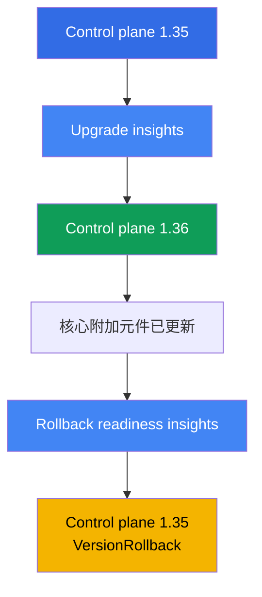
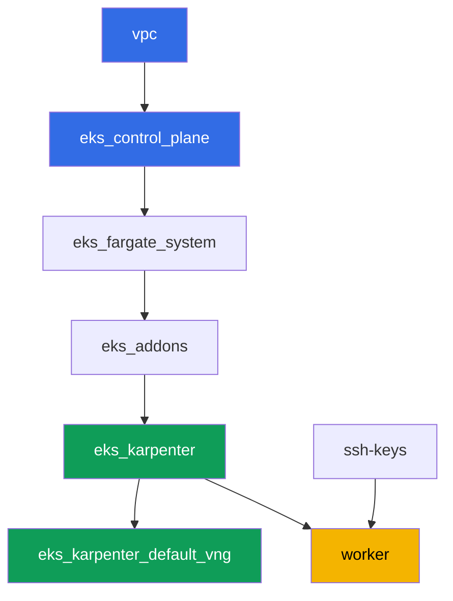

[Русская версия](README_RU.MD) · [Eng version](README.MD) · [Versión en español](README_ES.MD) · [Version française](README_FR.MD) · [Deutsche Version](README_DE.MD) · [ქართული ვერსია](README_GE.MD) · [日本語版](README_JP.MD)

# 實驗 113 - 集群升級與回滾:control plane、附加元件、已棄用的 API

## 說明

集群的生命週期以年計算,而 Kubernetes 版本每幾個月就會變動。在這個實驗中,你會在一個
運行中的集群上完整走過 EKS 的一次小版本升級週期:檢查升級就緒狀態,將 control plane
往上升一個小版本,把核心附加元件更新到相容版本,然後確認退路仍然暢通並將 control plane
回滾 - 這一切都透過標準的 insights 與 `aws eks update-cluster-version` 完成,不需要重建
集群。

任務以生產風格編寫:簡短的任務描述加驗收標準。驗證是自動的,透過 `check_result` 命令
完成。有些步驟(control plane 本身的升級與回滾)需要等待數十分鐘 - 這是受管理 control
plane 的正常行為,不是命令卡住了。

## 目標

鞏固以下課程章節的內容:

- [第 37 章。EKS 附加元件:managed add-ons 與 Helm 的對比、版本與更新順序](../../course/37/ru.md) - 附加元件版本由誰負責
- [第 38 章。集群升級:按版本原地升級、blue/green 集群、已棄用的 API](../../course/38/ru.md) - 原地升級的順序,以及如何找出已棄用的 API
- [第 39 章。集群版本回滾:rollback readiness insights、7 天視窗、回滾順序](../../course/39/ru.md) - 標準的 control plane 回滾

## 我們要創建什麼

集群一開始運行在版本 `1.35` 上(比目前的 GA 版本 `1.36` 低一個小版本),這樣你才能在這
個實驗中實際升級 control plane,然後在 7 天視窗內將它回滾。

| 對象 | 這是什麼 | 在這個實驗中的作用 |
|--------|---------|-------------------|
| Namespace `eks-113` | 供實驗產物使用的集群區域 | 讓任務結果保持隔離(第 4 章) |
| 產物 `upgrade_insights.json` | upgrade insights 的輸出 | 在開始升級前檢查升級就緒狀態(第 38 章) |
| Control plane `1.35 -> 1.36` | 按一個小版本原地升級 | 更新受管理 control plane 的實際過程(第 38 章) |
| 相容 `1.36` 版本的核心附加元件 | kube-proxy、coredns、vpc-cni、pod-identity | 在 control plane 之後更新附加元件(第 37 章) |
| 產物 `rollback_readiness.json` | rollback readiness insights 的輸出 | 在 7 天視窗內檢查回滾就緒狀態(第 39 章) |
| Control plane `1.36 -> 1.35` | `VersionRollback` 回滾 | 不重建集群的標準 control plane 回滾(第 39 章) |

實驗中的操作順序:



## 基礎設施

環境透過 Terragrunt 部署在 AWS(`eu-central-1`)。實驗中的每個目錄都是一個組件,擁有
自己的 `terragrunt.hcl`,它引用 `terraform/modules/` 中的共用模組,並透過 `dependency`
區塊聲明依賴關係。Terragrunt 會構建依賴關係圖並按正確的順序套用各個組件。這個實驗中集群
版本的升級與回滾**不是透過 terraform** 進行的,而是直接在運行中的集群上透過
`aws eks update-cluster-version` 和 `aws eks update-addon` 完成 - terraform 只部署版本
`1.35` 的初始狀態。

### 模組與依賴關係

| 目錄(組件) | 模組(`terraform/modules/`) | 依賴於 | 創建了什麼 |
|---------------------|-------------------------------|------------|-------------|
| `vpc` | `vpc_v3` | - | VPC `10.10.0.0/16`,兩個 AZ 中的公有與私有子網,NAT |
| `ssh-keys` | `ssh-keys` | - | 供工作機與節點使用的一對 SSH 金鑰 |
| `eks_control_plane` | `eks_v2_control_plane` | `vpc` | EKS control plane `1.35`、OIDC、security groups |
| `eks_fargate_system` | `eks_v2_fargate` | `vpc`、`eks_control_plane` | `kube-system` 與 `karpenter` 的 Fargate 配置檔 |
| `eks_addons` | `eks_v2_addons` | `eks_control_plane`、`eks_fargate_system` | `1.35` 版本上的 coredns、kube-proxy、vpc-cni、pod-identity 附加元件 |
| `eks_karpenter` | `eks_v2_karpenter` | `vpc`、`eks_control_plane`、`eks_addons`、`eks_fargate_system` | Karpenter 控制器、節點 IAM 角色 |
| `eks_karpenter_default_vng` | `eks_v2_karpenter_vng` | `vpc`、`eks_control_plane`、`eks_karpenter` | 預設 NodePool `default` 以及 EC2NodeClass |
| `worker` | `eks_v2_work_pc` | `ssh-keys`、`vpc`、`eks_control_plane`、`eks_karpenter` | 帶有 kubectl、aws cli、測試腳本和 `check_result` 的工作機 |

依賴關係圖(較早套用的組件位於箭頭下方):



### 各項設定在哪裡配置

`env.hcl`(所有組件共用並讀取的環境參數):

| 參數 | 實驗中的值 | 影響什麼 |
|----------|-----------------|---------------|
| `region` | `eu-central-1` | 所有資源的區域 |
| `prefix` | `eks-task113` | 資源名稱與標籤的前綴 |
| `stack_name` | `eks113` | 用於構建 `env_name` - 集群名稱 |
| `k8_version` | `1.35.0` | 工作機上 kubectl 的版本,與 control plane 的起始版本一致 |
| `ssh_password_enable`、`access_cidrs` | `true`、`0.0.0.0/0` | 對工作機的 SSH 存取 |

每個組件 `terragrunt.hcl` 中的 `inputs`:

| 檔案 | 關鍵設定 |
|------|--------------------|
| `eks_control_plane/terragrunt.hcl` | `eks.version = "1.35"` - 實驗起始的 control plane 版本 |
| `eks_addons/terragrunt.hcl` | `1.35` 的附加元件版本:kube-proxy `v1.35.3-eksbuild.13`、coredns `v1.14.3-eksbuild.3`、vpc-cni `v1.22.4-eksbuild.3`、eks-pod-identity-agent `v1.3.10-eksbuild.2`(檔案中的一段註解提醒要透過 `aws eks describe-addon-versions --kubernetes-version 1.35` 再次確認) |
| `worker/terragrunt.hcl` | 指向實驗 113 檔案的 `test_url` 和 `task_script_url`、`exam_time_minutes = "900"`(為漫長的升級與回滾預留的額外時間) |

其他所有設定(網路、Karpenter、以受管理附加元件形式存在的附加元件)與基礎實驗 101
沒有區別 - 這裡只有 control plane 版本以及對應的核心附加元件版本才重要。

## 部署

```bash
TASK=113 make run_eks_task
```

部署大約需要 15-20 分鐘。在輸出中找到連接工作機的 SSH 那一行並連接上去。那裡的
kubectl 和 aws cli 已經配置好指向正確的集群。

> 關於時間的說明。任務 3(將 control plane 升級到 `1.36`)和任務 6(將它回滾到
> `1.35`)由 AWS 自己執行,這兩個操作每一個都可能需要 **20-40 分鐘**。這是正常的:
> `update-cluster-version` 只會啟動更新並立即回傳一個 `id`,實際的更新在背景中運行。如
> 果回應沒有立即返回,不要中斷命令或重建集群 - 請透過 `describe-update` 等待
> `Successful` 狀態。

工作機上的常用命令:

```bash
time_left       # 環境剩餘的時間
check_result    # 檢查解答
```

> 測試環境的安全性。`env.hcl` 中啟用了 `ssh_password_enable = true` 和
> `access_cidrs = ["0.0.0.0/0"]` - 這對於學習環境很方便,但在生產環境中不應該這樣做。
> 依照課程標準(第 0.2、2、19 章),對工作機的存取應透過 AWS SSM Session Manager 進行,
> 不對外暴露公開的 SSH 端口,並將 `access_cidrs` 限制到具體的位址。這裡保留公開 SSH 只
> 是為了簡化設定流程。

## 任務

---
|        **1**        | **Namespace 與集群的起始版本**             |
| :-----------------: | :----------------------------------------------------------- |
| 我們要做什麼          | 創建 namespace `eks-113`。確認 control plane 目前運行在版本 `1.35` 上:`aws eks describe-cluster --name <cluster> --query 'cluster.version'`。透過 `aws eks list-clusters` 取得集群名稱。 |
| 驗收標準    | - namespace `eks-113` 存在;<br/>- `cluster.version` 等於 `1.35`。 |
---
|        **2**        | **檢查升級就緒狀態**                                |
| :-----------------: | :----------------------------------------------------------- |
| 我們要做什麼          | 執行 upgrade insights 檢查:`aws eks list-insights --cluster-name <cluster>`(不加 `--filter` 會顯示所有類別,包括升級就緒狀態)。將輸出保存到檔案 `/var/work/tests/artifacts/2/upgrade_insights.json`。確認列表中沒有任何一個 insight 的狀態是 `ERROR` - 這個狀態會阻擋升級,直到問題被修復。 |
| 驗收標準    | - 檔案 `/var/work/tests/artifacts/2/upgrade_insights.json` 不為空;<br/>- 其中沒有狀態為 `ERROR` 的項目。 |
---
|        **3**        | **將 control plane 升級到 `1.36`**                     |
| :-----------------: | :----------------------------------------------------------- |
| 我們要做什麼          | 啟動升級:`aws eks update-cluster-version --name <cluster> --kubernetes-version 1.36`。透過 `aws eks describe-update --name <cluster> --update-id <id>`(狀態 `Successful`)等待它完成 - 這可能需要 20-40 分鐘。確認 `cluster.version` 變成了 `1.36`。 |
| 驗收標準    | - `aws eks describe-cluster --name <cluster> --query 'cluster.version'` 回傳 `1.36`。 |
---
|        **4**        | **將核心附加元件升級到與 `1.36` 相容的版本**  |
| :-----------------: | :----------------------------------------------------------- |
| 我們要做什麼          | 使用 `aws eks update-addon --cluster-name <cluster> --addon-name <name> --addon-version <version>`,將 `kube-proxy` 和 `coredns` 更新到與 `1.36` 相容的版本(與實驗 101 中相同:kube-proxy `v1.36.0-eksbuild.14`、coredns `v1.14.3-eksbuild.3`)。透過 `aws eks describe-addon` 等待每個附加元件都變為 `ACTIVE` 狀態。 |
| 驗收標準    | - `kube-proxy` 附加元件的版本以 `v1.36.` 開頭;<br/>- `coredns` 附加元件的版本與目前的小版本相容(`v1.14.`)。 |
---
|        **5**        | **檢查回滾就緒狀態**                                |
| :-----------------: | :----------------------------------------------------------- |
| 我們要做什麼          | 執行 rollback readiness insights 檢查:`aws eks list-insights --cluster-name <cluster> --filter '{"categories": ["ROLLBACK_READINESS"]}'`。將輸出保存到檔案 `/var/work/tests/artifacts/5/rollback_readiness.json`。確認沒有任何 insight 的狀態是 `ERROR` 或 `UNKNOWN` - 這兩種狀態都會阻擋回滾(只能用 `--force` 旗標繞過,但這不會取消時間視窗限制或「一個小版本」規則)。 |
| 驗收標準    | - 檔案 `/var/work/tests/artifacts/5/rollback_readiness.json` 不為空;<br/>- 其中沒有狀態為 `ERROR` 或 `UNKNOWN` 的項目。 |
---
|        **6**        | **將 control plane 回滾到 `1.35`**                  |
| :-----------------: | :----------------------------------------------------------- |
| 我們要做什麼          | 由於任務 4 中升級了 `kube-proxy`,直接回滾 control plane 會被 rollback readiness insight `kube-proxy version rollback compatibility` 阻擋(`ERROR`:version skew,`kube-proxy` 在 `1.36` 上比 control plane 的 `1.35` 更新)。先將 `kube-proxy` 本身回滾到與 `1.35` 相容的版本(`v1.35.3-eksbuild.13`),並等待 `ACTIVE`。然後啟動 control plane 的回滾:`aws eks update-cluster-version --name <cluster> --kubernetes-version 1.35`。透過 `describe-update` 等待 `Successful` - 同樣需要 20-40 分鐘。確認 `cluster.version` 回到了 `1.35`。將 `update-cluster-version` 回應(或 `describe-update`)中的更新類型保存到檔案 `/var/work/tests/artifacts/6/rollback_update.txt` - 必須是 `VersionRollback`,而不是常規的升級。 |
| 驗收標準    | - `cluster.version` 再次等於 `1.35`;<br/>- 檔案 `/var/work/tests/artifacts/6/rollback_update.txt` 不為空,且包含 `VersionRollback`。 |
---

## 檢查結果

在工作機上執行自動檢查:

```bash
check_result
```

腳本會執行測試並顯示已完成任務的百分比。任務 3 和 6 只檢查最終結果(集群目前的版
本) - 升級或回滾本身的等待過程不會被測試,但它仍然必須運行到完成,否則版本不會改
變。

## 解答

參考解答:[worker/files/solutions/1_TW.MD](worker/files/solutions/1_TW.MD)

## 刪除集群與資源

> **等到 control plane 離開 `UPDATING` 狀態後,才能拆除環境。** 這個實驗中的升級與
> 回滾繞過了 terraform,直接透過 `aws eks update-cluster-version` 進行。在最後一次這樣
> 的操作完成之前(`describe-update` 中的 `Successful`),EKS 會對其他呼叫回應
> `409 ResourceInUseException ... currently has an update in progress`,而 `destroy` 會
> 因為這個錯誤失敗,或者進入重試(根目錄的 `terraform/environments/terragrunt.hcl` 中
> 配置的 `retryable_errors` 正是為了應付這種情況)。刪除前不必把 control plane 版本還
> 原回去 - terraform 不會把集群版本當作 `destroy` diff 的期望狀態,所以尚未完成的
> `1.36` 升級不會阻擋刪除,只會拖慢它。

```bash
# 1. 移除實驗的產物
kubectl delete namespace eks-113 --ignore-not-found

# 2. 等待集群離開 UPDATING 狀態(如果任務 3/6 的升級或回滾仍在進行中,這一步才有意
#    義)
CLUSTER=$(aws eks list-clusters --query 'clusters[0]' --output text)
while [ "$(aws eks describe-cluster --name "$CLUSTER" --query 'cluster.status' --output text)" != "ACTIVE" ]; do
  echo "control plane 仍在 UPDATING 中,等待中..."; sleep 30
done
```

只有在這之後,才能拆除環境:

```bash
TASK=113 make delete_eks_task
```

如果 `destroy` 仍然因為 `409 ResourceInUseException` 失敗,說明集群還在更新中
- 請等待並重複執行 `TASK=113 make delete_eks_task`,這個命令是冪等的。
