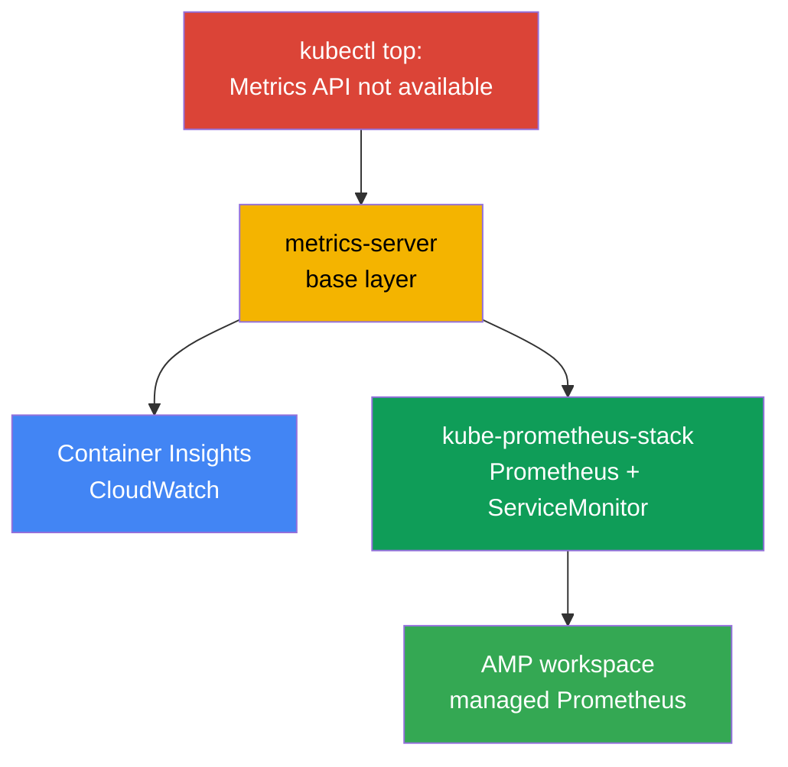
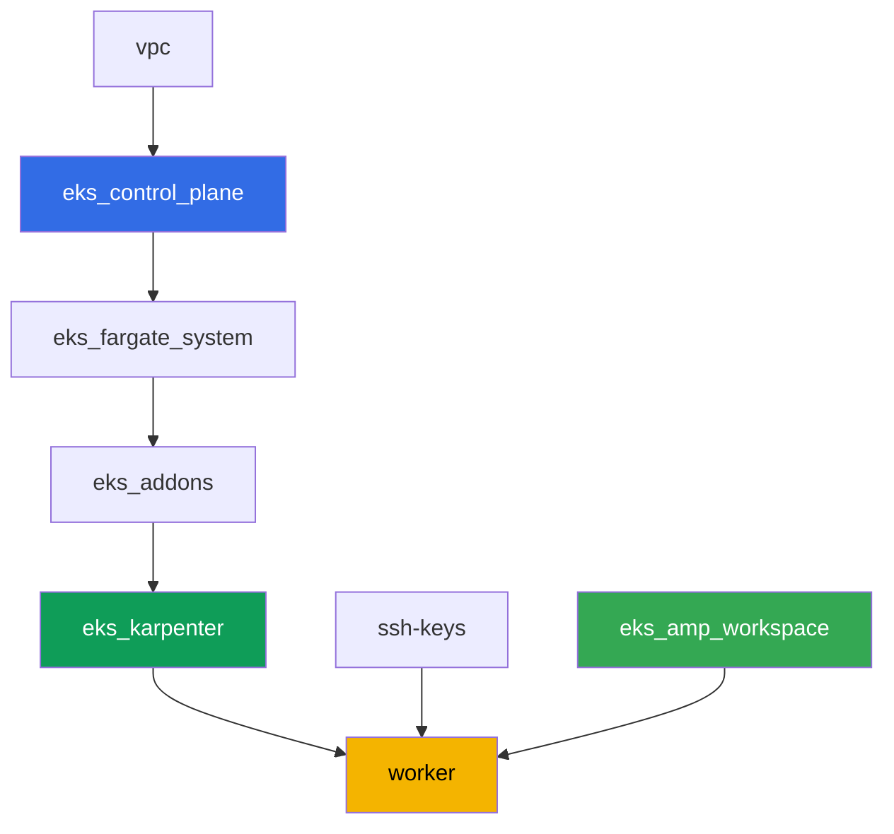

[Русская версия](README_RU.MD) · [Versión en español](README_ES.MD) · [Version française](README_FR.MD) · [Deutsche Version](README_DE.MD) · [ქართული ვერსია](README_GE.MD) · [繁體中文版](README_TW.MD) · [日本語版](README_JP.MD)

# Lab 114 - Observability: Container Insights and Managed Prometheus with Grafana

## Description

The cluster has just been deployed, and the on-call engineer's very first question -
"how much CPU and memory are the nodes and pods eating right now" - goes unanswered:
`kubectl top` fails with "Metrics API not available". In this lab you walk the path from
symptom to working observability: first you fix the base layer (metrics-server), then you
stand up the AWS-native path (CloudWatch Container Insights via a managed addon) and the
Kubernetes-native path (kube-prometheus-stack with a real application under a
ServiceMonitor). At the end you confirm that a managed Prometheus-compatible store (Amazon
Managed Prometheus) is already ready to accept metrics.

Tasks are written in a production style: a short problem statement plus acceptance
criteria. Checking is automatic, via the `check_result` command.

## Goal

Reinforce the material from the course chapter:

- [Chapter 33. Metrics: Container Insights, Managed Prometheus and Grafana](../../course/33/ru.md)

## What we're creating

The cluster from lab 101 is already deployed. In this lab you add three observability
layers on top of it plus one managed backend ready to accept metrics.

| Object | What it is | Why it's in this lab |
|--------|---------|-------------------|
| Namespace `eks-114` | a section of the cluster for the lab's workload | keeps resources separate |
| Artifact `2/kubectl_top_before.txt` | output of `kubectl top nodes` on an empty cluster | captures the "Metrics API not available" symptom |
| Addon `metrics-server` | base Metrics API layer | fixes `kubectl top` and feeds the HPA |
| Artifact `3/kubectl_top_after.txt` | output of `kubectl top nodes` after the fix | confirms the base layer works |
| Addon `amazon-cloudwatch-observability` | CloudWatch agent in the cluster | Container Insights: node/pod metrics in CloudWatch |
| Artifact `4/cloudwatch_agent_pods.txt` | CloudWatch agent pods | confirms the AWS-native path is deployed |
| kube-prometheus-stack (`monitoring`) | Prometheus, Grafana, kube-state-metrics | Kubernetes-native metrics path |
| Deployment `ping-app` + `ServiceMonitor` | application with `/metrics` and its scrape config | real application metrics collection via the Operator's CRD |
| Artifact `5/prom_query.txt` | Prometheus API response to a PromQL query | confirms the application metric made it to Prometheus |
| AMP workspace (terraform) | managed Prometheus-compatible backend | third metrics path: managed storage without your own server |
| Artifact `6/amp_endpoint.txt` | output of `describe-workspace` | confirms the workspace is ready to accept remote-write |

Three metrics paths you walk through in this lab:



## Infrastructure

The environment is deployed in AWS (`eu-central-1`) via Terragrunt, same as in lab 101.
Each lab directory is a single component with its own `terragrunt.hcl`, which references a
shared module in `terraform/modules/` and declares dependencies through `dependency`
blocks. Terragrunt builds the dependency graph and applies components in the right order.
The component specific to this lab is just the AMP workspace; the observability addons and
kube-prometheus-stack are installed via Helm/AWS CLI directly from the worker machine as
part of the tasks.

### Modules and dependencies

| Directory (component) | Module (`terraform/modules/`) | Depends on | What it creates |
|---------------------|-------------------------------|------------|-------------|
| `vpc` | `vpc_v3` | - | VPC `10.10.0.0/16`, subnets in two AZs, NAT |
| `ssh-keys` | `ssh-keys` | - | SSH key pair for the worker machine and nodes |
| `eks_control_plane` | `eks_v2_control_plane` | `vpc` | EKS control plane `1.36`, OIDC, security groups |
| `eks_fargate_system` | `eks_v2_fargate` | `vpc`, `eks_control_plane` | Fargate profile for `kube-system` and `karpenter` |
| `eks_addons` | `eks_v2_addons` | `eks_control_plane`, `eks_fargate_system` | coredns, kube-proxy, vpc-cni, pod-identity |
| `eks_karpenter` | `eks_v2_karpenter` | `vpc`, `eks_control_plane`, `eks_addons`, `eks_fargate_system` | Karpenter controller, node IAM role |
| `eks_karpenter_default_vng` | `eks_v2_karpenter_vng` | `vpc`, `eks_control_plane`, `eks_karpenter` | default NodePool `default` on AL2023 |
| `eks_amp_workspace` | `eks_v2_amp_workspace` | - | Amazon Managed Prometheus workspace |
| `worker` | `eks_v2_work_pc` | `ssh-keys`, `vpc`, `eks_control_plane`, `eks_karpenter`, `eks_amp_workspace` | worker machine with kubectl, helm, tests and `check_result` |

The `eks_amp_workspace` component creates an AMP workspace with a predictable alias
`<prefix>-amp`, so the worker can find it without reading terraform output.

Dependency graph (what's applied earlier is lower along the arrow):



### Where things are configured

`env.hcl` (shared environment parameters, read by all components):

| Parameter | Value in the lab | What it affects |
|----------|-----------------|---------------|
| `region` | `eu-central-1` | region of all resources, including the AMP workspace |
| `prefix` | `eks-task114` | resource name prefix, including the AMP workspace alias |
| `stack_name` | `eks114` | used to build `env_name` - the cluster name |
| `k8_version` | `1.36.0` | kubectl version on the worker machine |
| `instance_type_worker` | `t3.medium` | worker machine instance type |
| `ssh_password_enable`, `access_cidrs` | `true`, `0.0.0.0/0` | SSH access to the worker machine |

The `inputs` in each component's `terragrunt.hcl` (module-specific parameters) match lab
101: control plane and addon versions under `1.36`, Karpenter controller `1.8.1`.
Differences: `eks_amp_workspace/terragrunt.hcl` (a new component that only creates the
workspace) and `test_url`/`task_script_url` in `worker/terragrunt.hcl`, pointing to this
lab's files.

> The worker machine's IAM permissions (`terraform/modules/eks_v2_work_pc/iam.tf`) are
> extended with one additive Sid `ObservabilityReadForMetricsLabs`:
> `cloudwatch:ListMetrics/GetMetricData/GetMetricStatistics/DescribeAlarms` and
> `aps:ListWorkspaces/DescribeWorkspace/ListRuleGroupsNamespaces/DescribeRuleGroupsNamespace`
> - read-only, no write access. These are permissions at the level of the worker's IAM role
> (the person with SSH access), not the CloudWatch agent - it has its own role via
> `CloudWatchAgentServerPolicy` on the Karpenter node role (see task 4).

## Deployment

```bash
TASK=114 make run_eks_task
```

Deployment takes roughly 15-20 minutes. In the output, find the line with the SSH
connection to the worker machine and connect to it. kubectl and helm are already configured
there, and the AMP workspace name and alias are in the file `~/lab114_hints.txt`.

Useful commands on the worker machine:

```bash
time_left       # how much environment time is left
check_result    # check the solution
cat ~/lab114_hints.txt   # cluster_name, AMP workspace alias and endpoint
```

> Time for Helm installs. Installing kube-prometheus-stack is heavier than a regular
> Deployment: Prometheus, Alertmanager, kube-state-metrics, node-exporter and the operator
> all come up, which takes roughly 3-5 minutes until all pods are ready.

> Environment security. In `env.hcl`, `ssh_password_enable = true` and
> `access_cidrs = ["0.0.0.0/0"]` are enabled - convenient for a training environment, but
> this must not be done in production. Per the course standards (chapters 0.2, 2, 19),
> access to worker machines should go through AWS SSM Session Manager without exposing
> public SSH ports, and `access_cidrs` should be narrowed to specific addresses. Here public
> SSH is left in place only to keep the launch simple.

## Tasks

---
|        **1**        | **Namespace for the lab's workload**                             |
| :-----------------: | :---------------------------------------------------------- |
| What to do          | Create a namespace named `eks-114`. All objects in the lab are created inside it. |
| Acceptance criteria    | - namespace `eks-114` exists. |
---
|        **2**        | **Symptom: no metrics at all**                              |
| :-----------------: | :---------------------------------------------------------- |
| What to do          | On the fresh cluster, run `kubectl top nodes` and `kubectl top pods -A`. Both commands fail with "Metrics API not available" - the Metrics API (`metrics.k8s.io`) is not yet registered in the cluster because metrics-server is not installed. Save the full output (both commands) to `/var/work/tests/artifacts/2/kubectl_top_before.txt`. |
| Acceptance criteria    | - file `2/kubectl_top_before.txt` is not empty;<br/>- contains `Metrics API not available`. |
---
|        **3**        | **Base layer: the metrics-server addon**                      |
| :-----------------: | :---------------------------------------------------------- |
| What to do          | Install the managed addon `metrics-server`: `aws eks create-addon --cluster-name <cluster> --addon-name metrics-server`. Wait for the addon status `ACTIVE` (`aws eks describe-addon ... --query addon.status`) and make sure `kubectl top nodes` starts returning usage (without the "not available" line). Save the output of `kubectl top nodes` to `/var/work/tests/artifacts/3/kubectl_top_after.txt`. |
| Acceptance criteria    | - addon `metrics-server` is in state `ACTIVE`;<br/>- file `3/kubectl_top_after.txt` is not empty and does not contain "not available". |
---
|        **4**        | **Container Insights: the amazon-cloudwatch-observability addon** |
| :-----------------: | :---------------------------------------------------------- |
| What to do          | The addon needs permissions to publish metrics to CloudWatch. Create an IAM role with a name containing `-test-` (for example `eks-task114-test-cw-agent`), with a trust policy for the principal `pods.eks.amazonaws.com` (EKS Pod Identity, no OIDC), and attach the managed policy `CloudWatchAgentServerPolicy` to it. Install the managed addon with this role via Pod Identity: `aws eks create-addon --cluster-name <cluster> --addon-name amazon-cloudwatch-observability --pod-identity-associations serviceAccount=cloudwatch-agent,roleArn=<role-arn>`. The addon deploys the CloudWatch Observability Operator and the CloudWatch agent into the `amazon-cloudwatch` namespace. Wait for the addon status `ACTIVE` and for the CloudWatch agent pods to be `Running`: `kubectl get pods -n amazon-cloudwatch`. Save this output to `/var/work/tests/artifacts/4/cloudwatch_agent_pods.txt`. |
| Acceptance criteria    | - addon `amazon-cloudwatch-observability` is in state `ACTIVE`;<br/>- pods with label `app.kubernetes.io/name=cloudwatch-agent` in `amazon-cloudwatch` are `Running`;<br/>- file `4/cloudwatch_agent_pods.txt` is not empty and mentions `cloudwatch-agent`. |
---
|        **5**        | **kube-prometheus-stack: real application metrics collection**  |
| :-----------------: | :---------------------------------------------------------- |
| What to do          | Install `kube-prometheus-stack` via Helm into the `monitoring` namespace (repository `prometheus-community`), with the values `prometheus.prometheusSpec.serviceMonitorSelectorNilUsesHelmValues=false` (otherwise Prometheus will only see the ServiceMonitor from its own Helm release). Wait for the Prometheus pods to be ready. In `eks-114`, create a Deployment `ping-app` (image `viktoruj/ping_pong:latest`, `1` replica) and a Service `ping-app` exposing the `metrics` port (`9090` -> `9090`, the application serves Prometheus metrics on `/metrics` on this port). Create a `ServiceMonitor` `ping-app` in `eks-114` with `selector.matchLabels.app: ping-app`, `endpoints[0].port: metrics`, `path: /metrics`. Wait until Prometheus picks up the target, then via `kubectl port-forward` to the `<release-name>-prometheus` service and `curl` (the `prometheus` container image has no shell utilities, `kubectl exec` with `wget`/`curl` won't work) run a query to `/api/v1/query` with `query=requests_total` and save the JSON response to `/var/work/tests/artifacts/5/prom_query.txt`. |
| Acceptance criteria    | - Prometheus pods in `monitoring` are `Running` and `Ready`;<br/>- Deployment `ping-app` in `eks-114`, image `viktoruj/ping_pong`, `1` ready replica;<br/>- `ServiceMonitor` `ping-app` with `endpoints[0].port: metrics`;<br/>- file `5/prom_query.txt` is not empty, contains `requests_total` and `"metric"`. |
---
|        **6**        | **Managed Prometheus: the workspace is ready to accept metrics**   |
| :-----------------: | :---------------------------------------------------------- |
| What to do          | The AMP workspace has already been created by terraform (alias in `~/lab114_hints.txt`). Find its ID (`aws amp list-workspaces --alias <alias> --query 'workspaces[0].workspaceId' --output text`) and get the remote-write endpoint (`aws amp describe-workspace --workspace-id <id> --query "workspace.prometheusEndpoint" --output text`). Save the full output of `describe-workspace` to `/var/work/tests/artifacts/6/amp_endpoint.txt`. A full remote-write pipeline (managed collector or ADOT) is out of scope for this lab - it's enough to show that the managed Prometheus-compatible backend has been created and its endpoint obtained. |
| Acceptance criteria    | - AMP workspace with alias `<prefix>-amp` exists;<br/>- file `6/amp_endpoint.txt` is not empty and contains `aps-workspaces`. |
---

## Checking the result

On the worker machine, run the automatic check:

```bash
check_result
```

Tests 3-5 wait for addons and pods to become ready in time-bounded loops (up to several
minutes), so don't be surprised if `check_result` takes longer than usual.

## Solution

Reference solution: [worker/files/solutions/1.MD](worker/files/solutions/1.MD)

## Removing the cluster and resources

In this lab, several objects were created directly via AWS CLI/Helm rather than terraform:
the managed addons `metrics-server` and `amazon-cloudwatch-observability`, the IAM role
`eks-task114-test-cw-agent`, and the EC2 nodes that Karpenter brought up for the CloudWatch
agent DaemonSet and for kube-prometheus-stack. Terraform doesn't know about them and won't
delete them - if you start `destroy` too early, orphaned EC2 nodes hold onto ENIs and block
deletion of the VPC/subnets (the same pattern as in labs 108, 109, 111). Clean them up
manually before `destroy`:

```bash
CLUSTER=$(aws eks list-clusters --query 'clusters[0]' --output text)

# 1. Remove the workload that caused Karpenter to bring up EC2 nodes
helm uninstall kube-prometheus-stack -n monitoring
kubectl delete namespace eks-114 monitoring amazon-cloudwatch

# 2. Remove the managed addons installed manually in tasks 3 and 4
aws eks delete-addon --cluster-name "$CLUSTER" --addon-name amazon-cloudwatch-observability
aws eks delete-addon --cluster-name "$CLUSTER" --addon-name metrics-server

# 3. Remove the CloudWatch agent IAM role created in task 4
aws iam detach-role-policy --role-name eks-task114-test-cw-agent \
  --policy-arn arn:aws:iam::aws:policy/CloudWatchAgentServerPolicy
aws iam delete-role --role-name eks-task114-test-cw-agent

# 4. Wait for Karpenter to remove the EC2 nodes itself (not just delete the Node object,
#    but actually terminate the EC2 instance) - both outputs below should be empty
for i in $(seq 1 30); do
  nc=$(kubectl get nodeclaims --no-headers 2>/dev/null | wc -l)
  ec2=$(aws ec2 describe-instances \
    --filters "Name=tag:karpenter.sh/nodepool,Values=default" \
      "Name=instance-state-name,Values=running,pending,stopping,stopped" \
    --query 'Reservations[].Instances[]' --output text)
  echo "nodeclaims=$nc ec2_instances=[$ec2]"
  [[ "$nc" == "0" ]] && [[ -z "$ec2" ]] && break
  sleep 10
done
```

Only after `nodeclaims=0` and the EC2 instance list is empty, run the terraform resource
deletion:

```bash
TASK=114 make delete_eks_task
```
