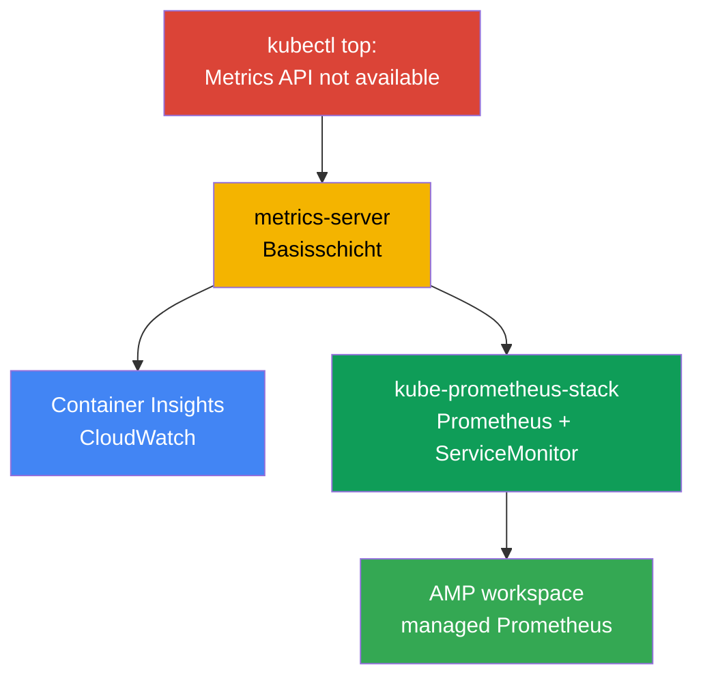
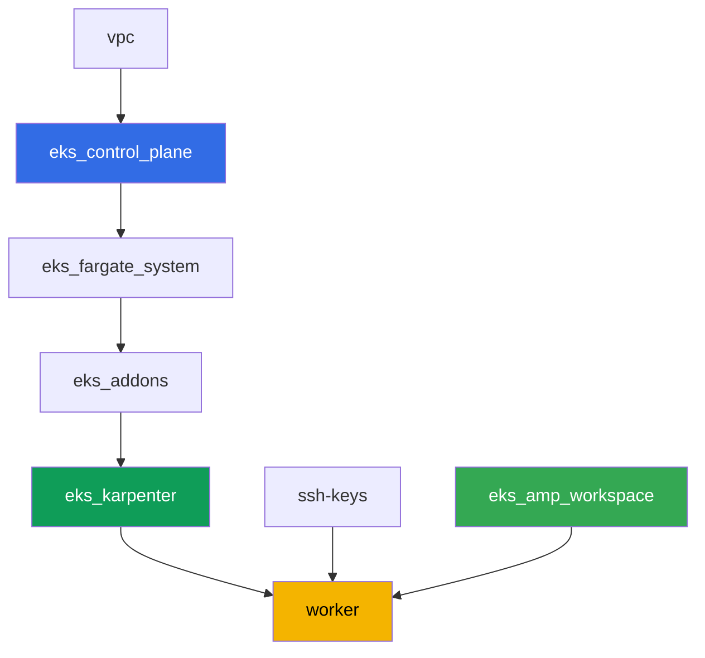

[Русская версия](README_RU.MD) · [Eng version](README.MD) · [Versión en español](README_ES.MD) · [Version française](README_FR.MD) · [ქართული ვერსია](README_GE.MD) · [繁體中文版](README_TW.MD) · [日本語版](README_JP.MD)

# Lab 114 - Observability: Container Insights und Managed Prometheus mit Grafana

## Beschreibung

Der Cluster ist gerade erst ausgerollt, und die erste Frage des Dienst-Engineers - "wie viel
CPU und Speicher verbrauchen die Nodes und Pods gerade" - bleibt unbeantwortet: `kubectl top`
schlägt fehl mit "Metrics API not available". In dieser Lab gehen Sie den Weg vom Symptom zu
funktionierender Observability: zuerst reparieren Sie die Basisschicht (metrics-server), dann
bauen Sie den AWS-nativen Weg auf (CloudWatch Container Insights über einen verwalteten
Addon) und den Kubernetes-nativen Weg (kube-prometheus-stack mit einer echten Anwendung unter
einem ServiceMonitor). Am Ende stellen Sie sicher, dass ein managed Prometheus-kompatibler
Speicher (Amazon Managed Prometheus) bereits bereit ist, Metriken zu empfangen.

Die Aufgaben sind im Produktionsstil gehalten: eine kurze Aufgabenstellung plus
Abnahmekriterien. Die Prüfung erfolgt automatisch über den Befehl `check_result`.

## Ziel

Den Stoff des Kurskapitels vertiefen:

- [Kapitel 33. Metriken: Container Insights, Managed Prometheus und Grafana](../../course/33/de.md)

## Was wir erstellen

Der Cluster aus Lab 101 ist bereits ausgerollt. In dieser Lab fügen Sie drei
Observability-Schichten darüber hinzu und ein managed Backend, das bereit ist, Metriken zu
empfangen.

| Objekt | Was das ist | Warum in dieser Lab |
|--------|---------|-------------------|
| Namespace `eks-114` | Bereich des Clusters für die Last der Lab | Ressourcen getrennt halten |
| Artefakt `2/kubectl_top_before.txt` | Ausgabe von `kubectl top nodes` auf einem leeren Cluster | hält das Symptom "Metrics API not available" fest |
| Addon `metrics-server` | Basisschicht der Metrics API | repariert `kubectl top` und versorgt HPA |
| Artefakt `3/kubectl_top_after.txt` | Ausgabe von `kubectl top nodes` nach dem Fix | bestätigt, dass die Basisschicht funktioniert |
| Addon `amazon-cloudwatch-observability` | CloudWatch agent im Cluster | Container Insights: Node-/Pod-Metriken in CloudWatch |
| Artefakt `4/cloudwatch_agent_pods.txt` | Pods des CloudWatch agent | bestätigt, dass der AWS-native Weg ausgerollt ist |
| kube-prometheus-stack (`monitoring`) | Prometheus, Grafana, kube-state-metrics | Kubernetes-nativer Weg der Metriken |
| Deployment `ping-app` + `ServiceMonitor` | Anwendung mit `/metrics` und ihr Scraping | echtes Sammeln von Anwendungsmetriken über den CRD-Operator |
| Artefakt `5/prom_query.txt` | Antwort der Prometheus API auf eine PromQL-Abfrage | bestätigt, dass die Anwendungsmetrik bei Prometheus angekommen ist |
| AMP workspace (terraform) | managed Prometheus-kompatibles Backend | dritter Weg: managed Speicher ohne eigenen Server |
| Artefakt `6/amp_endpoint.txt` | Ausgabe von `describe-workspace` | bestätigt die Bereitschaft des workspace, remote-write zu empfangen |

Drei Metrikwege, die Sie in dieser Lab durchlaufen:



## Infrastruktur

Die Umgebung wird in AWS (`eu-central-1`) über Terragrunt ausgerollt, wie in Lab 101. Jedes
Lab-Verzeichnis ist eine Komponente mit eigener `terragrunt.hcl`, die auf ein gemeinsames
Modul in `terraform/modules/` verweist und Abhängigkeiten über `dependency`-Blöcke deklariert.
Terragrunt baut den Abhängigkeitsgraphen und wendet die Komponenten in der richtigen
Reihenfolge an. Die für diese Lab spezifische Komponente ist nur der AMP workspace; die
Observability-Addons und kube-prometheus-stack werden per Helm/AWS CLI direkt von der
Worker-Maschine im Rahmen der Aufgaben installiert.

### Module und Abhängigkeiten

| Verzeichnis (Komponente) | Modul (`terraform/modules/`) | Abhängig von | Was erstellt wird |
|---------------------|-------------------------------|------------|-------------|
| `vpc` | `vpc_v3` | - | VPC `10.10.0.0/16`, Subnetze in zwei AZs, NAT |
| `ssh-keys` | `ssh-keys` | - | SSH-Schlüsselpaar für Worker-Maschine und Nodes |
| `eks_control_plane` | `eks_v2_control_plane` | `vpc` | EKS control plane `1.36`, OIDC, Security Groups |
| `eks_fargate_system` | `eks_v2_fargate` | `vpc`, `eks_control_plane` | Fargate-Profil für `kube-system` und `karpenter` |
| `eks_addons` | `eks_v2_addons` | `eks_control_plane`, `eks_fargate_system` | coredns, kube-proxy, vpc-cni, pod-identity |
| `eks_karpenter` | `eks_v2_karpenter` | `vpc`, `eks_control_plane`, `eks_addons`, `eks_fargate_system` | Karpenter-Controller, IAM-Rolle der Nodes |
| `eks_karpenter_default_vng` | `eks_v2_karpenter_vng` | `vpc`, `eks_control_plane`, `eks_karpenter` | Standard-NodePool `default` auf AL2023 |
| `eks_amp_workspace` | `eks_v2_amp_workspace` | - | workspace Amazon Managed Prometheus |
| `worker` | `eks_v2_work_pc` | `ssh-keys`, `vpc`, `eks_control_plane`, `eks_karpenter`, `eks_amp_workspace` | Worker-Maschine mit kubectl, helm, Tests und `check_result` |

Die Komponente `eks_amp_workspace` erstellt einen AMP workspace mit einem vorhersagbaren
Alias `<prefix>-amp`, damit der worker ihn ohne Lesen des terraform-Outputs findet.

Abhängigkeitsgraph (was früher angewendet wird, steht weiter unten in der Pfeilrichtung):



### Wo was konfiguriert wird

`env.hcl` (gemeinsame Umgebungsparameter, von allen Komponenten gelesen):

| Parameter | Wert in der Lab | Wirkung |
|----------|-----------------|---------------|
| `region` | `eu-central-1` | Region aller Ressourcen, einschließlich AMP workspace |
| `prefix` | `eks-task114` | Präfix der Ressourcennamen, auch des Alias des AMP workspace |
| `stack_name` | `eks114` | daraus wird `env_name` gebildet - der Cluster-Name |
| `k8_version` | `1.36.0` | Version von kubectl auf der Worker-Maschine |
| `instance_type_worker` | `t3.medium` | Instanztyp der Worker-Maschine |
| `ssh_password_enable`, `access_cidrs` | `true`, `0.0.0.0/0` | SSH-Zugriff auf die Worker-Maschine |

Die `inputs` in der `terragrunt.hcl` jeder Komponente (Parameter des konkreten Moduls)
stimmen mit Lab 101 überein: Versionen von control plane und Addons unter `1.36`, Karpenter-
Controller `1.8.1`. Unterschiede: `eks_amp_workspace/terragrunt.hcl` (neue Komponente, erstellt
nur den workspace) und `test_url`/`task_script_url` in `worker/terragrunt.hcl`, die auf die
Dateien dieser Lab verweisen.

> Die IAM-Rechte der Worker-Maschine (`terraform/modules/eks_v2_work_pc/iam.tf`) wurden um
> einen zusätzlichen Sid `ObservabilityReadForMetricsLabs` ergänzt: `cloudwatch:ListMetrics/
> GetMetricData/GetMetricStatistics/DescribeAlarms` und `aps:ListWorkspaces/DescribeWorkspace/
> ListRuleGroupsNamespaces/DescribeRuleGroupsNamespace` - nur Lesezugriff, ohne Schreibrechte.
> Das sind Rechte auf Ebene der IAM-Rolle des Workers (der Person mit SSH-Zugriff), nicht des
> CloudWatch agent - dieser hat seine eigene Rolle über `CloudWatchAgentServerPolicy` auf der
> Rolle der Karpenter-Node (siehe Aufgabe 4).

## Ausrollen

```bash
TASK=114 make run_eks_task
```

Das Ausrollen dauert etwa 15-20 Minuten. Suchen Sie in der Ausgabe die Zeile mit der
SSH-Verbindung zur Worker-Maschine und verbinden Sie sich mit ihr. kubectl und helm sind dort
bereits konfiguriert, und Name und Alias des AMP workspace stehen in der Datei
`~/lab114_hints.txt`.

Nützliche Befehle auf der Worker-Maschine:

```bash
time_left       # wie viel Zeit der Umgebung noch übrig ist
check_result    # Lösung prüfen
cat ~/lab114_hints.txt   # cluster_name, Alias und Endpoint des AMP workspace
```

> Zeit für Helm-Installationen. Die Installation von kube-prometheus-stack ist schwerer als
> ein gewöhnliches Deployment: Prometheus, Alertmanager, kube-state-metrics, node-exporter und
> der operator werden gestartet, das dauert etwa 3-5 Minuten bis alle Pods bereit sind.

> Sicherheit der Umgebung. In `env.hcl` sind `ssh_password_enable = true` und
> `access_cidrs = ["0.0.0.0/0"]` aktiviert - das ist praktisch für eine Lernumgebung, aber so
> sollte man es in der Produktion nicht machen. Nach den Standards des Kurses (Kapitel 0.2, 2,
> 19) wird der Zugriff auf Worker-Maschinen über AWS SSM Session Manager ohne öffentliche
> SSH-Ports nach außen geöffnet, und `access_cidrs` werden auf konkrete Adressen eingeschränkt.
> Hier ist öffentliches SSH nur der Einfachheit des Starts halber belassen.

## Aufgaben

---
|        **1**        | **Namespace für die Last der Lab**                             |
| :-----------------: | :---------------------------------------------------------- |
| Was zu tun ist          | Erstellen Sie einen Namespace mit dem Namen `eks-114`. Alle Objekte der Lab werden innerhalb dieses Namespace erstellt. |
| Abnahmekriterien    | - Namespace `eks-114` existiert. |
---
|        **2**        | **Symptom: es gibt überhaupt keine Metriken**                              |
| :-----------------: | :---------------------------------------------------------- |
| Was zu tun ist          | Führen Sie auf dem frischen Cluster `kubectl top nodes` und `kubectl top pods -A` aus. Beide Befehle schlagen mit dem Fehler "Metrics API not available" fehl - die Metrics API (`metrics.k8s.io`) ist im Cluster noch nicht registriert, weil metrics-server nicht installiert ist. Speichern Sie die vollständige Ausgabe (beide Befehle) in `/var/work/tests/artifacts/2/kubectl_top_before.txt`. |
| Abnahmekriterien    | - Datei `2/kubectl_top_before.txt` ist nicht leer;<br/>- enthält `Metrics API not available`. |
---
|        **3**        | **Basisschicht: der Addon metrics-server**                      |
| :-----------------: | :---------------------------------------------------------- |
| Was zu tun ist          | Installieren Sie den managed Addon `metrics-server`: `aws eks create-addon --cluster-name <cluster> --addon-name metrics-server`. Warten Sie auf den Addon-Status `ACTIVE` (`aws eks describe-addon ... --query addon.status`) und stellen Sie sicher, dass `kubectl top nodes` beginnt, die Auslastung anzuzeigen (ohne die Zeile "not available"). Speichern Sie die Ausgabe von `kubectl top nodes` in `/var/work/tests/artifacts/3/kubectl_top_after.txt`. |
| Abnahmekriterien    | - Addon `metrics-server` im Status `ACTIVE`;<br/>- Datei `3/kubectl_top_after.txt` ist nicht leer und enthält kein "not available". |
---
|        **4**        | **Container Insights: der Addon amazon-cloudwatch-observability** |
| :-----------------: | :---------------------------------------------------------- |
| Was zu tun ist          | Der Addon benötigt Rechte zum Veröffentlichen von Metriken in CloudWatch. Erstellen Sie eine IAM-Rolle mit einem Namen, der `-test-` enthält (z. B. `eks-task114-test-cw-agent`), mit einer trust policy für den Principal `pods.eks.amazonaws.com` (EKS Pod Identity, ohne OIDC), und hängen Sie die managed policy `CloudWatchAgentServerPolicy` daran. Installieren Sie den managed Addon mit dieser Rolle über Pod Identity: `aws eks create-addon --cluster-name <cluster> --addon-name amazon-cloudwatch-observability --pod-identity-associations serviceAccount=cloudwatch-agent,roleArn=<role-arn>`. Der Addon rollt den CloudWatch Observability Operator und den CloudWatch agent im Namespace `amazon-cloudwatch` aus. Warten Sie auf den Addon-Status `ACTIVE` und die Pods des CloudWatch agent im Status `Running`: `kubectl get pods -n amazon-cloudwatch`. Speichern Sie diese Ausgabe in `/var/work/tests/artifacts/4/cloudwatch_agent_pods.txt`. |
| Abnahmekriterien    | - Addon `amazon-cloudwatch-observability` im Status `ACTIVE`;<br/>- Pods mit dem Label `app.kubernetes.io/name=cloudwatch-agent` in `amazon-cloudwatch` im Status `Running`;<br/>- Datei `4/cloudwatch_agent_pods.txt` ist nicht leer und erwähnt `cloudwatch-agent`. |
---
|        **5**        | **kube-prometheus-stack: echtes Sammeln von Anwendungsmetriken**  |
| :-----------------: | :---------------------------------------------------------- |
| Was zu tun ist          | Installieren Sie `kube-prometheus-stack` per Helm im Namespace `monitoring` (Repository `prometheus-community`), mit den values `prometheus.prometheusSpec.serviceMonitorSelectorNilUsesHelmValues=false` (sonst sieht Prometheus nur den ServiceMonitor aus seinem eigenen Helm-Release). Warten Sie auf die Bereitschaft der Prometheus-Pods. Erstellen Sie in `eks-114` ein Deployment `ping-app` (Image `viktoruj/ping_pong:latest`, `1` Replica) und einen Service `ping-app`, der den Port `metrics` veröffentlicht (`9090` -> `9090`, die Anwendung liefert Prometheus-Metriken über `/metrics` auf diesem Port). Erstellen Sie einen `ServiceMonitor` `ping-app` in `eks-114` mit `selector.matchLabels.app: ping-app`, `endpoints[0].port: metrics`, `path: /metrics`. Warten Sie, bis Prometheus das Target aufnimmt, dann führen Sie über `kubectl port-forward` auf den Service `<release-name>-prometheus` und `curl` (das Container-Image `prometheus` ist minimal und enthält keine Shell-Tools, `kubectl exec` mit `wget`/`curl` funktioniert nicht) eine Abfrage an `/api/v1/query` mit `query=requests_total` aus und speichern Sie die JSON-Antwort in `/var/work/tests/artifacts/5/prom_query.txt`. |
| Abnahmekriterien    | - Prometheus-Pods in `monitoring` `Running` und `Ready`;<br/>- Deployment `ping-app` in `eks-114`, Image `viktoruj/ping_pong`, `1` bereite Replica;<br/>- `ServiceMonitor` `ping-app` mit `endpoints[0].port: metrics`;<br/>- Datei `5/prom_query.txt` ist nicht leer, enthält `requests_total` und `"metric"`. |
---
|        **6**        | **Managed Prometheus: workspace ist bereit, Metriken zu empfangen**   |
| :-----------------: | :---------------------------------------------------------- |
| Was zu tun ist          | Der AMP workspace ist bereits von terraform erstellt (Alias in `~/lab114_hints.txt`). Finden Sie seine ID (`aws amp list-workspaces --alias <alias> --query 'workspaces[0].workspaceId' --output text`) und holen Sie den remote-write Endpoint (`aws amp describe-workspace --workspace-id <id> --query "workspace.prometheusEndpoint" --output text`). Speichern Sie die vollständige Ausgabe von `describe-workspace` in `/var/work/tests/artifacts/6/amp_endpoint.txt`. Eine vollständige remote-write Pipeline (managed collector oder ADOT) gehört nicht zum Umfang dieser Lab - es reicht zu zeigen, dass ein managed Prometheus-kompatibles Backend erstellt und sein Endpoint ermittelt wurde. |
| Abnahmekriterien    | - AMP workspace mit Alias `<prefix>-amp` existiert;<br/>- Datei `6/amp_endpoint.txt` ist nicht leer und enthält `aps-workspaces`. |
---

## Ergebnisprüfung

Führen Sie auf der Worker-Maschine die automatische Prüfung aus:

```bash
check_result
```

Die Tests 3-5 warten in Schleifen mit Zeitbegrenzung (bis zu einigen Minuten) auf die
Bereitschaft der Addons und Pods, lassen Sie sich also nicht davon irritieren, wenn
`check_result` länger als gewöhnlich läuft.

## Lösung

Referenzlösung: [worker/files/solutions/1_DE.MD](worker/files/solutions/1_DE.MD)

## Löschen des Clusters und der Ressourcen

In dieser Lab wurden mehrere Objekte direkt über AWS CLI/Helm erstellt, nicht über terraform:
die managed Addons `metrics-server` und `amazon-cloudwatch-observability`, die IAM-Rolle
`eks-task114-test-cw-agent` und die EC2-Nodes, die Karpenter für das DaemonSet des CloudWatch
agent und für kube-prometheus-stack hochgefahren hat. Terraform weiß nichts davon und wird sie
nicht löschen - wenn man `destroy` vorher startet, halten verwaiste EC2-Nodes ENIs und
blockieren das Löschen von VPC/Subnetzen (dasselbe Muster wie in den Labs 108, 109, 111).
Räumen Sie diese vor `destroy` manuell auf:

```bash
CLUSTER=$(aws eks list-clusters --query 'clusters[0]' --output text)

# 1. Last entfernen, wegen der Karpenter EC2-Nodes hochgefahren hat
helm uninstall kube-prometheus-stack -n monitoring
kubectl delete namespace eks-114 monitoring amazon-cloudwatch

# 2. Managed Addons löschen, die in den Aufgaben 3 und 4 manuell installiert wurden
aws eks delete-addon --cluster-name "$CLUSTER" --addon-name amazon-cloudwatch-observability
aws eks delete-addon --cluster-name "$CLUSTER" --addon-name metrics-server

# 3. IAM-Rolle des CloudWatch agent löschen, die in Aufgabe 4 erstellt wurde
aws iam detach-role-policy --role-name eks-task114-test-cw-agent \
  --policy-arn arn:aws:iam::aws:policy/CloudWatchAgentServerPolicy
aws iam delete-role --role-name eks-task114-test-cw-agent

# 4. Warten, bis Karpenter selbst die EC2-Nodes entfernt (nicht nur das Node-Objekt löscht,
#    sondern die EC2-Instanz tatsächlich beendet) - beide Ausgaben sollten leer sein
for i in $(seq 1 30); do
  nc=$(kubectl get nodeclaims --no-headers 2>/dev/null | wc -l)
  ec2=$(aws ec2 describe-instances \
    --filters "Name=tag:karpenter.sh/nodepool,Values=default" \
      "Name=instance-state-name,Values=running,pending,stopping,stopped" \
    --query 'Reservations[].Instances[]' --output text)
  echo "nodeclaims=$nc ec2_instances=[$ec2]"
  [[ "$nc" == "0" ]] && [[ -z "$ec2" ]] && break
  sleep 10
done
```

Erst nachdem `nodeclaims=0` ist und die Liste der EC2-Instanzen leer ist, starten Sie das
Löschen der terraform-Ressourcen:

```bash
TASK=114 make delete_eks_task
```
