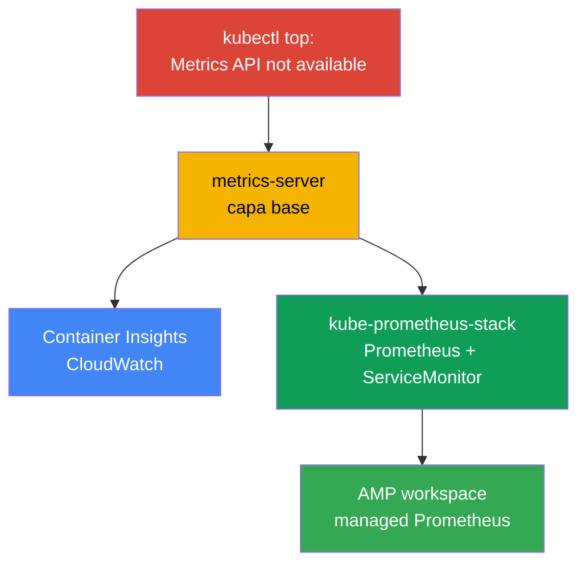
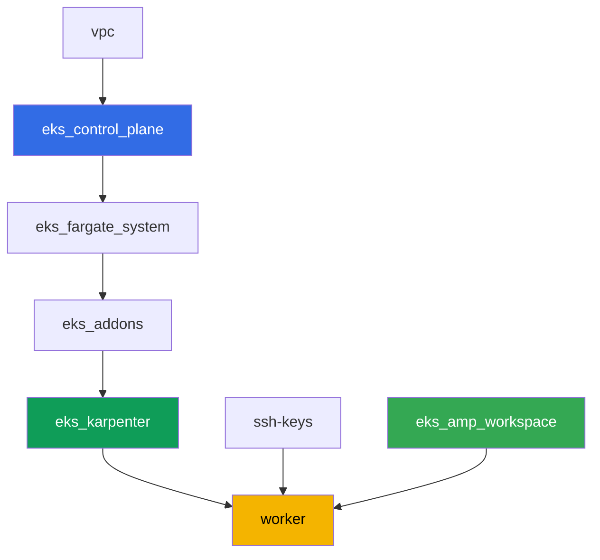

[Русская версия](README_RU.MD) · [Eng version](README.MD) · [Version française](README_FR.MD) · [Deutsche Version](README_DE.MD) · [ქართული ვერსია](README_GE.MD) · [繁體中文版](README_TW.MD) · [日本語版](README_JP.MD)

# Lab 114 - Observabilidad: Container Insights y Managed Prometheus con Grafana

## Descripción

El clúster acaba de desplegarse y la primera pregunta del ingeniero de guardia - "¿cuánta
CPU y memoria consumen ahora los nodes y pods" - se queda sin respuesta: `kubectl top` falla
con "Metrics API not available". En esta laba recorres el camino desde el síntoma hasta una
observabilidad funcional: primero arreglas la capa base (metrics-server), luego levantas el
camino AWS-native (CloudWatch Container Insights a través de un addon administrado) y el
camino Kubernetes-native (kube-prometheus-stack con una aplicación real bajo ServiceMonitor).
Al final te aseguras de que el almacenamiento compatible con Prometheus administrado (Amazon
Managed Prometheus) ya está listo para recibir métricas.

Tareas en estilo producción: un planteamiento breve más criterios de aceptación. La
verificación es automática, con el comando `check_result`.

## Objetivo

Consolidar el material del capítulo del curso:

- [Capítulo 33. Métricas: Container Insights, Managed Prometheus y Grafana](../../course/33/es.md)

## Qué vamos a crear

El clúster de la laba 101 ya está desplegado. En esta laba añades tres capas de
observabilidad sobre él y un backend managed listo para recibir métricas.

| Objeto | Qué es | Para qué sirve en esta laba |
|--------|---------|-------------------|
| Namespace `eks-114` | sección del clúster para la carga de la laba | mantenemos los recursos separados |
| Artefacto `2/kubectl_top_before.txt` | salida de `kubectl top nodes` en un clúster vacío | registramos el síntoma "Metrics API not available" |
| Addon `metrics-server` | capa base de Metrics API | arregla `kubectl top` y alimenta HPA |
| Artefacto `3/kubectl_top_after.txt` | salida de `kubectl top nodes` tras el arreglo | confirmamos que la capa base funciona |
| Addon `amazon-cloudwatch-observability` | CloudWatch agent en el clúster | Container Insights: métricas de nodes/pods en CloudWatch |
| Artefacto `4/cloudwatch_agent_pods.txt` | pods de CloudWatch agent | confirmamos que el camino AWS-native se desplegó |
| kube-prometheus-stack (`monitoring`) | Prometheus, Grafana, kube-state-metrics | camino Kubernetes-native de métricas |
| Deployment `ping-app` + `ServiceMonitor` | aplicación con `/metrics` y su scrape | recolección real de métricas de la aplicación mediante el CRD del Operator |
| Artefacto `5/prom_query.txt` | respuesta de la API de Prometheus a una consulta PromQL | confirmamos que la métrica de la aplicación llegó a Prometheus |
| AMP workspace (terraform) | backend managed compatible con Prometheus | tercer camino: almacenamiento managed sin servidor propio |
| Artefacto `6/amp_endpoint.txt` | salida de `describe-workspace` | confirmamos que el workspace está listo para recibir remote-write |

Los tres caminos de métricas que recorres en esta laba:



## Infraestructura

El entorno se despliega en AWS (`eu-central-1`) mediante Terragrunt, igual que en la laba
101. Cada carpeta de laba es un componente con su propio `terragrunt.hcl`, que referencia un
módulo común en `terraform/modules/` y declara dependencias mediante bloques `dependency`.
Terragrunt construye el grafo de dependencias y aplica los componentes en el orden correcto.
El componente específico de esta laba es solo el AMP workspace; los addons de observabilidad
y kube-prometheus-stack se instalan con Helm/AWS CLI directamente desde la máquina de trabajo
como parte de las tareas.

### Módulos y dependencias

| Carpeta (componente) | Módulo (`terraform/modules/`) | Depende de | Qué crea |
|---------------------|-------------------------------|------------|-------------|
| `vpc` | `vpc_v3` | - | VPC `10.10.0.0/16`, subredes en dos AZ, NAT |
| `ssh-keys` | `ssh-keys` | - | par de claves SSH para la máquina de trabajo y los nodes |
| `eks_control_plane` | `eks_v2_control_plane` | `vpc` | control plane EKS `1.36`, OIDC, security groups |
| `eks_fargate_system` | `eks_v2_fargate` | `vpc`, `eks_control_plane` | perfil Fargate para `kube-system` y `karpenter` |
| `eks_addons` | `eks_v2_addons` | `eks_control_plane`, `eks_fargate_system` | coredns, kube-proxy, vpc-cni, pod-identity |
| `eks_karpenter` | `eks_v2_karpenter` | `vpc`, `eks_control_plane`, `eks_addons`, `eks_fargate_system` | controlador Karpenter, rol IAM de los nodes |
| `eks_karpenter_default_vng` | `eks_v2_karpenter_vng` | `vpc`, `eks_control_plane`, `eks_karpenter` | NodePool por defecto `default` en AL2023 |
| `eks_amp_workspace` | `eks_v2_amp_workspace` | - | workspace de Amazon Managed Prometheus |
| `worker` | `eks_v2_work_pc` | `ssh-keys`, `vpc`, `eks_control_plane`, `eks_karpenter`, `eks_amp_workspace` | máquina de trabajo con kubectl, helm, tests y `check_result` |

El componente `eks_amp_workspace` crea el AMP workspace con un alias predecible
`<prefix>-amp`, así que el worker lo encuentra sin leer el output de terraform.

Grafo de dependencias (lo que se aplica antes queda más abajo en la flecha):



### Dónde se configura qué

`env.hcl` (parámetros comunes del entorno, leídos por todos los componentes):

| Parámetro | Valor en la laba | Qué afecta |
|----------|-----------------|---------------|
| `region` | `eu-central-1` | región de todos los recursos, incluido el AMP workspace |
| `prefix` | `eks-task114` | prefijo de nombres de recursos, incluido el alias del AMP workspace |
| `stack_name` | `eks114` | de él se compone `env_name` - el nombre del clúster |
| `k8_version` | `1.36.0` | versión de kubectl en la máquina de trabajo |
| `instance_type_worker` | `t3.medium` | tipo de instancia de la máquina de trabajo |
| `ssh_password_enable`, `access_cidrs` | `true`, `0.0.0.0/0` | acceso SSH a la máquina de trabajo |

Los `inputs` en el `terragrunt.hcl` de cada componente (parámetros del módulo concreto)
coinciden con la laba 101: versiones de control plane y addons bajo `1.36`, controlador
Karpenter `1.8.1`. Las diferencias son: `eks_amp_workspace/terragrunt.hcl` (componente nuevo,
crea solo el workspace) y `test_url`/`task_script_url` en `worker/terragrunt.hcl`, que apuntan
a los archivos de esta laba.

> Los permisos IAM de la máquina de trabajo (`terraform/modules/eks_v2_work_pc/iam.tf`) se
> ampliaron con un Sid additivo `ObservabilityReadForMetricsLabs`: `cloudwatch:ListMetrics/
> GetMetricData/GetMetricStatistics/DescribeAlarms` y `aps:ListWorkspaces/DescribeWorkspace/
> ListRuleGroupsNamespaces/DescribeRuleGroupsNamespace` - solo lectura, sin escritura. Son
> permisos a nivel del rol IAM del worker (la persona con acceso SSH), no del CloudWatch
> agent - este tiene su propio rol mediante `CloudWatchAgentServerPolicy` en el rol del node
> de Karpenter (ver tarea 4).

## Despliegue

```bash
TASK=114 make run_eks_task
```

El despliegue tarda aproximadamente 15-20 minutos. En la salida busca la línea con la
conexión SSH a la máquina de trabajo y conéctate a ella. kubectl y helm ya están configurados
ahí, y el nombre y alias del AMP workspace están en el archivo `~/lab114_hints.txt`.

Comandos útiles en la máquina de trabajo:

```bash
time_left       # cuánto tiempo queda del entorno
check_result    # verificar la solución
cat ~/lab114_hints.txt   # cluster_name, alias y endpoint del AMP workspace
```

> Tiempo para las instalaciones Helm. La instalación de kube-prometheus-stack es más pesada
> que un Deployment habitual: se levantan Prometheus, Alertmanager, kube-state-metrics,
> node-exporter y el operator, esto tarda aproximadamente 3-5 minutos hasta que todos los
> pods están listos.

> Seguridad del stand. En `env.hcl` están habilitados `ssh_password_enable = true` y
> `access_cidrs = ["0.0.0.0/0"]` - esto es cómodo para un entorno educativo, pero no se debe
> hacer así en producción. Según los estándares del curso (capítulos 0.2, 2, 19) el acceso a
> las máquinas de trabajo se abre mediante AWS SSM Session Manager sin puertos SSH públicos
> hacia afuera, y `access_cidrs` se restringen a direcciones concretas. Aquí se deja SSH
> público solo por simplicidad de lanzamiento.

## Tareas

---
|        **1**        | **Namespace para la carga de la laba**                             |
| :-----------------: | :---------------------------------------------------------- |
| Qué hacemos          | Crea un namespace con el nombre `eks-114`. Todos los objetos de la laba se crean dentro de él. |
| Criterios de aceptación    | - el namespace `eks-114` existe. |
---
|        **2**        | **Síntoma: no hay métricas en absoluto**                              |
| :-----------------: | :---------------------------------------------------------- |
| Qué hacemos          | En un clúster recién creado ejecuta `kubectl top nodes` y `kubectl top pods -A`. Ambos comandos fallan con el error "Metrics API not available" - la Metrics API (`metrics.k8s.io`) todavía no está registrada en el clúster, porque metrics-server no está instalado. Guarda la salida completa (ambos comandos) en `/var/work/tests/artifacts/2/kubectl_top_before.txt`. |
| Criterios de aceptación    | - el archivo `2/kubectl_top_before.txt` no está vacío;<br/>- contiene `Metrics API not available`. |
---
|        **3**        | **Capa base: addon metrics-server**                      |
| :-----------------: | :---------------------------------------------------------- |
| Qué hacemos          | Instala el addon administrado `metrics-server`: `aws eks create-addon --cluster-name <cluster> --addon-name metrics-server`. Espera al estado `ACTIVE` del addon (`aws eks describe-addon ... --query addon.status`) y asegúrate de que `kubectl top nodes` empiece a devolver el consumo (sin la línea "not available"). Guarda la salida de `kubectl top nodes` en `/var/work/tests/artifacts/3/kubectl_top_after.txt`. |
| Criterios de aceptación    | - el addon `metrics-server` en estado `ACTIVE`;<br/>- el archivo `3/kubectl_top_after.txt` no está vacío y no contiene "not available". |
---
|        **4**        | **Container Insights: addon amazon-cloudwatch-observability** |
| :-----------------: | :---------------------------------------------------------- |
| Qué hacemos          | El addon necesita permisos para publicar métricas en CloudWatch. Crea un rol IAM con un nombre que contenga `-test-` (por ejemplo `eks-task114-test-cw-agent`), con trust policy hacia el principal `pods.eks.amazonaws.com` (EKS Pod Identity, sin OIDC), y adjúntale la managed policy `CloudWatchAgentServerPolicy`. Instala el addon administrado con este rol mediante Pod Identity: `aws eks create-addon --cluster-name <cluster> --addon-name amazon-cloudwatch-observability --pod-identity-associations serviceAccount=cloudwatch-agent,roleArn=<role-arn>`. El addon despliega el CloudWatch Observability Operator y el CloudWatch agent en el namespace `amazon-cloudwatch`. Espera al estado `ACTIVE` del addon y a que los pods de CloudWatch agent estén en estado `Running`: `kubectl get pods -n amazon-cloudwatch`. Guarda esta salida en `/var/work/tests/artifacts/4/cloudwatch_agent_pods.txt`. |
| Criterios de aceptación    | - el addon `amazon-cloudwatch-observability` en estado `ACTIVE`;<br/>- los pods con label `app.kubernetes.io/name=cloudwatch-agent` en `amazon-cloudwatch` en estado `Running`;<br/>- el archivo `4/cloudwatch_agent_pods.txt` no está vacío y menciona `cloudwatch-agent`. |
---
|        **5**        | **kube-prometheus-stack: recolección real de métricas de la aplicación**  |
| :-----------------: | :---------------------------------------------------------- |
| Qué hacemos          | Instala `kube-prometheus-stack` mediante Helm en el namespace `monitoring` (repositorio `prometheus-community`), con el value `prometheus.prometheusSpec.serviceMonitorSelectorNilUsesHelmValues=false` (de lo contrario Prometheus solo verá el ServiceMonitor de su propio Helm release). Espera a que los pods de Prometheus estén listos. En `eks-114` crea un Deployment `ping-app` (imagen `viktoruj/ping_pong:latest`, `1` réplica) y un Service `ping-app` que publique el puerto `metrics` (`9090` -> `9090`, la aplicación expone métricas de Prometheus en `/metrics` en ese puerto). Crea un `ServiceMonitor` `ping-app` en `eks-114` con `selector.matchLabels.app: ping-app`, `endpoints[0].port: metrics`, `path: /metrics`. Espera a que Prometheus recoja el target, luego mediante `kubectl port-forward` al servicio `<nombre-release>-prometheus` y `curl` (la imagen del contenedor `prometheus` no tiene utilidades de shell, `kubectl exec` con `wget`/`curl` no funcionará) haz una consulta a `/api/v1/query` con `query=requests_total` y guarda la respuesta JSON en `/var/work/tests/artifacts/5/prom_query.txt`. |
| Criterios de aceptación    | - los pods de Prometheus en `monitoring` en `Running` y `Ready`;<br/>- Deployment `ping-app` en `eks-114`, imagen `viktoruj/ping_pong`, `1` réplica lista;<br/>- `ServiceMonitor` `ping-app` con `endpoints[0].port: metrics`;<br/>- el archivo `5/prom_query.txt` no está vacío, contiene `requests_total` y `"metric"`. |
---
|        **6**        | **Managed Prometheus: el workspace está listo para recibir métricas**   |
| :-----------------: | :---------------------------------------------------------- |
| Qué hacemos          | El AMP workspace ya fue creado por terraform (alias en `~/lab114_hints.txt`). Encuentra su ID (`aws amp list-workspaces --alias <alias> --query 'workspaces[0].workspaceId' --output text`) y obtén el endpoint de remote-write (`aws amp describe-workspace --workspace-id <id> --query "workspace.prometheusEndpoint" --output text`). Guarda la salida completa de `describe-workspace` en `/var/work/tests/artifacts/6/amp_endpoint.txt`. Un pipeline completo de remote-write (managed collector o ADOT) no forma parte del alcance de esta laba - basta con demostrar que el backend compatible con Prometheus managed está creado y su endpoint obtenido. |
| Criterios de aceptación    | - el AMP workspace con alias `<prefix>-amp` existe;<br/>- el archivo `6/amp_endpoint.txt` no está vacío y contiene `aps-workspaces`. |
---

## Verificación del resultado

En la máquina de trabajo ejecuta la verificación automática:

```bash
check_result
```

Los tests 3-5 esperan a que los addons y pods estén listos mediante ciclos con límite de
tiempo (hasta varios minutos), así que no te preocupes si `check_result` tarda más de lo
habitual.

## Solución

Solución de referencia: [worker/files/solutions/1_ES.MD](worker/files/solutions/1_ES.MD)

## Eliminación del clúster y los recursos

En esta laba varios objetos se crearon directamente mediante AWS CLI/Helm y no con terraform:
los addons administrados `metrics-server` y `amazon-cloudwatch-observability`, el rol IAM
`eks-task114-test-cw-agent` y los nodes EC2 que Karpenter levantó para el DaemonSet de
CloudWatch agent y para kube-prometheus-stack. Terraform no sabe de ellos y no los elimina -
si se inicia `destroy` antes, los nodes EC2 huérfanos retienen ENI y bloquean la eliminación
de VPC/subredes (el mismo patrón que en las labas 108, 109, 111). Antes de `destroy` límpialos
manualmente:

```bash
CLUSTER=$(aws eks list-clusters --query 'clusters[0]' --output text)

# 1. Quitamos la carga que hizo que Karpenter levantara nodes EC2
helm uninstall kube-prometheus-stack -n monitoring
kubectl delete namespace eks-114 monitoring amazon-cloudwatch

# 2. Eliminamos los addons administrados instalados manualmente en las tareas 3 y 4
aws eks delete-addon --cluster-name "$CLUSTER" --addon-name amazon-cloudwatch-observability
aws eks delete-addon --cluster-name "$CLUSTER" --addon-name metrics-server

# 3. Eliminamos el rol IAM de CloudWatch agent, creado en la tarea 4
aws iam detach-role-policy --role-name eks-task114-test-cw-agent \
  --policy-arn arn:aws:iam::aws:policy/CloudWatchAgentServerPolicy
aws iam delete-role --role-name eks-task114-test-cw-agent

# 4. Esperamos a que Karpenter elimine él mismo los nodes EC2 (no solo elimine el objeto
#    Node, sino que termine la propia instancia EC2) - debe quedar vacío en ambas salidas
for i in $(seq 1 30); do
  nc=$(kubectl get nodeclaims --no-headers 2>/dev/null | wc -l)
  ec2=$(aws ec2 describe-instances \
    --filters "Name=tag:karpenter.sh/nodepool,Values=default" \
      "Name=instance-state-name,Values=running,pending,stopping,stopped" \
    --query 'Reservations[].Instances[]' --output text)
  echo "nodeclaims=$nc ec2_instances=[$ec2]"
  [[ "$nc" == "0" ]] && [[ -z "$ec2" ]] && break
  sleep 10
done
```

Solo después de que `nodeclaims=0` y la lista de instancias EC2 esté vacía, inicia la
eliminación de los recursos de terraform:

```bash
TASK=114 make delete_eks_task
```
