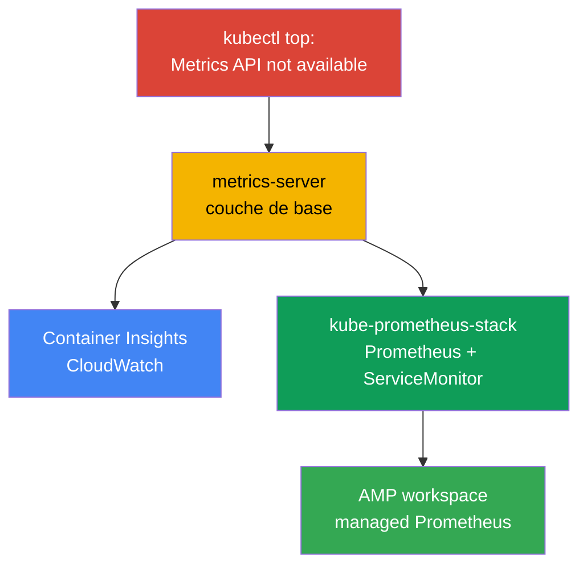
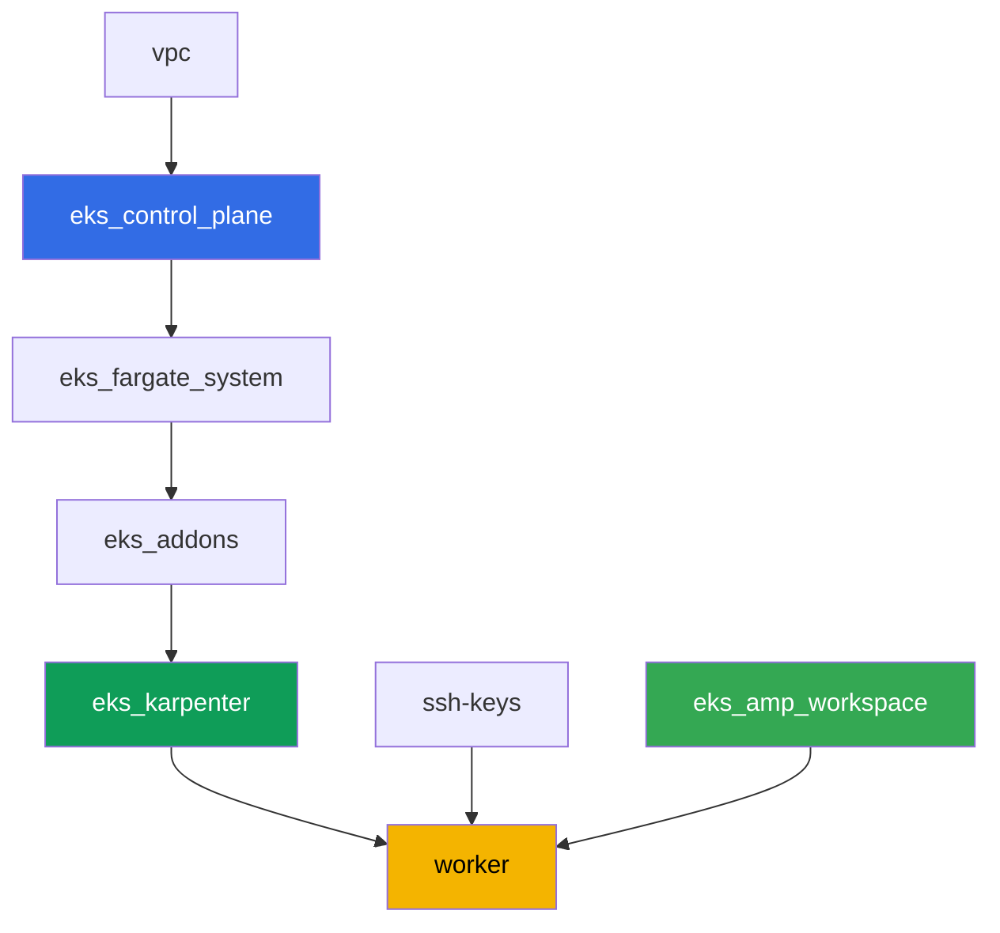

[Русская версия](README_RU.MD) · [Eng version](README.MD) · [Versión en español](README_ES.MD) · [Deutsche Version](README_DE.MD) · [ქართული ვერსია](README_GE.MD) · [繁體中文版](README_TW.MD) · [日本語版](README_JP.MD)

# Lab 114 - Observabilité : Container Insights et Managed Prometheus avec Grafana

## Description

Le cluster vient juste d'être déployé, et la première question de l'ingénieur de garde -
« combien de CPU et de mémoire consomment actuellement les nodes et les pods » - reste
sans réponse : `kubectl top` échoue avec « Metrics API not available ». Dans cette lab,
vous parcourez le chemin du symptôme jusqu'à une observabilité opérationnelle : d'abord
vous réparez la couche de base (metrics-server), puis vous mettez en place le chemin
AWS-native (CloudWatch Container Insights via un addon managé) et le chemin
Kubernetes-native (kube-prometheus-stack avec une vraie application sous ServiceMonitor).
Pour finir, vous vérifiez que le backend managé compatible Prometheus (Amazon Managed
Prometheus) est déjà prêt à recevoir des métriques.

Les tâches sont dans un style production : un énoncé court plus des critères d'acceptation.
La vérification est automatique, via la commande `check_result`.

## Objectif

Consolider la matière du chapitre du cours :

- [Chapitre 33. Métriques : Container Insights, Managed Prometheus et Grafana](../../course/33/ru.md)

## Ce que nous créons

Le cluster de la lab 101 est déjà déployé. Dans cette lab, vous ajoutez trois couches
d'observabilité par-dessus, ainsi qu'un backend managé prêt à recevoir des métriques.

| Objet | Ce que c'est | Pourquoi dans cette lab |
|--------|---------|-------------------|
| Namespace `eks-114` | section du cluster pour la charge de la lab | on garde les ressources séparées |
| Artefact `2/kubectl_top_before.txt` | sortie de `kubectl top nodes` sur un cluster vide | on fixe le symptôme « Metrics API not available » |
| Addon `metrics-server` | couche de base Metrics API | répare `kubectl top` et alimente le HPA |
| Artefact `3/kubectl_top_after.txt` | sortie de `kubectl top nodes` après le correctif | on confirme que la couche de base fonctionne |
| Addon `amazon-cloudwatch-observability` | CloudWatch agent dans le cluster | Container Insights : métriques des nodes/pods dans CloudWatch |
| Artefact `4/cloudwatch_agent_pods.txt` | pods du CloudWatch agent | on confirme que le chemin AWS-native s'est déployé |
| kube-prometheus-stack (`monitoring`) | Prometheus, Grafana, kube-state-metrics | chemin Kubernetes-native des métriques |
| Deployment `ping-app` + `ServiceMonitor` | application avec `/metrics` et son scrape | collecte réelle des métriques applicatives via le CRD de l'Operator |
| Artefact `5/prom_query.txt` | réponse de l'API Prometheus à une requête PromQL | on confirme que la métrique applicative est bien arrivée jusqu'à Prometheus |
| AMP workspace (terraform) | backend managé compatible Prometheus | troisième chemin : stockage managé sans serveur à gérer |
| Artefact `6/amp_endpoint.txt` | sortie de `describe-workspace` | on confirme que le workspace est prêt à recevoir du remote-write |

Les trois chemins de métriques que vous parcourez dans cette lab :



## Infrastructure

L'environnement est déployé sur AWS (`eu-central-1`) via Terragrunt, comme dans la lab 101.
Chaque répertoire de lab est un composant avec son propre `terragrunt.hcl`, qui référence
un module commun dans `terraform/modules/` et déclare ses dépendances via des blocs
`dependency`. Terragrunt construit le graphe de dépendances et applique les composants
dans le bon ordre. Le composant spécifique à cette lab est uniquement le AMP workspace ;
les addons d'observabilité et kube-prometheus-stack sont installés via Helm/AWS CLI
directement depuis la machine worker dans le cadre des tâches.

### Modules et dépendances

| Répertoire (composant) | Module (`terraform/modules/`) | Dépend de | Ce qu'il crée |
|---------------------|-------------------------------|------------|-------------|
| `vpc` | `vpc_v3` | - | VPC `10.10.0.0/16`, subnets dans deux AZ, NAT |
| `ssh-keys` | `ssh-keys` | - | paire de clés SSH pour la machine worker et les nodes |
| `eks_control_plane` | `eks_v2_control_plane` | `vpc` | control plane EKS `1.36`, OIDC, security groups |
| `eks_fargate_system` | `eks_v2_fargate` | `vpc`, `eks_control_plane` | profil Fargate pour `kube-system` et `karpenter` |
| `eks_addons` | `eks_v2_addons` | `eks_control_plane`, `eks_fargate_system` | coredns, kube-proxy, vpc-cni, pod-identity |
| `eks_karpenter` | `eks_v2_karpenter` | `vpc`, `eks_control_plane`, `eks_addons`, `eks_fargate_system` | contrôleur Karpenter, rôle IAM des nodes |
| `eks_karpenter_default_vng` | `eks_v2_karpenter_vng` | `vpc`, `eks_control_plane`, `eks_karpenter` | NodePool par défaut `default` sur AL2023 |
| `eks_amp_workspace` | `eks_v2_amp_workspace` | - | workspace Amazon Managed Prometheus |
| `worker` | `eks_v2_work_pc` | `ssh-keys`, `vpc`, `eks_control_plane`, `eks_karpenter`, `eks_amp_workspace` | machine worker avec kubectl, helm, les tests et `check_result` |

Le composant `eks_amp_workspace` crée le AMP workspace avec un alias prévisible
`<prefix>-amp`, ce qui permet au worker de le retrouver sans lire de terraform output.

Graphe de dépendances (ce qui est appliqué en premier est plus bas dans la flèche) :



### Où configurer quoi

`env.hcl` (paramètres communs de l'environnement, lus par tous les composants) :

| Paramètre | Valeur dans la lab | Ce que ça affecte |
|----------|-----------------|---------------|
| `region` | `eu-central-1` | région de toutes les ressources, y compris le AMP workspace |
| `prefix` | `eks-task114` | préfixe des noms de ressources, y compris l'alias du AMP workspace |
| `stack_name` | `eks114` | à partir de lui on construit `env_name` - le nom du cluster |
| `k8_version` | `1.36.0` | version de kubectl sur la machine worker |
| `instance_type_worker` | `t3.medium` | type d'instance de la machine worker |
| `ssh_password_enable`, `access_cidrs` | `true`, `0.0.0.0/0` | accès SSH à la machine worker |

Les `inputs` dans le `terragrunt.hcl` de chaque composant (paramètres du module concerné)
correspondent à la lab 101 : versions du control plane et des addons sur `1.36`, contrôleur
Karpenter `1.8.1`. Différences : `eks_amp_workspace/terragrunt.hcl` (nouveau composant, crée
uniquement le workspace) et `test_url`/`task_script_url` dans `worker/terragrunt.hcl`, qui
pointent vers les fichiers de cette lab.

> Les droits IAM de la machine worker (`terraform/modules/eks_v2_work_pc/iam.tf`) ont été
> complétés par un Sid additif `ObservabilityReadForMetricsLabs` : `cloudwatch:ListMetrics/
> GetMetricData/GetMetricStatistics/DescribeAlarms` et `aps:ListWorkspaces/DescribeWorkspace/
> ListRuleGroupsNamespaces/DescribeRuleGroupsNamespace` - lecture uniquement, sans écriture.
> Ce sont des droits au niveau du rôle IAM du worker (la personne avec un accès SSH), et non
> du CloudWatch agent - celui-ci a son propre rôle via `CloudWatchAgentServerPolicy` sur le
> rôle du node Karpenter (voir la tâche 4).

## Déploiement

```bash
TASK=114 make run_eks_task
```

Le déploiement prend environ 15 à 20 minutes. Dans la sortie, trouvez la ligne de
connexion SSH à la machine worker et connectez-vous. kubectl et helm y sont déjà
configurés, et le nom ainsi que l'alias du AMP workspace se trouvent dans le fichier
`~/lab114_hints.txt`.

Commandes utiles sur la machine worker :

```bash
time_left       # temps restant de l'environnement
check_result    # vérifier la solution
cat ~/lab114_hints.txt   # cluster_name, alias et endpoint du AMP workspace
```

> Temps pour les installations Helm. L'installation de kube-prometheus-stack est plus
> lourde qu'un Deployment classique : Prometheus, Alertmanager, kube-state-metrics,
> node-exporter et l'operator se lancent, ce qui prend environ 3 à 5 minutes avant que
> tous les pods soient prêts.

> Sécurité du stand. Dans `env.hcl`, `ssh_password_enable = true` et
> `access_cidrs = ["0.0.0.0/0"]` sont activés - c'est pratique pour un environnement
> pédagogique, mais ne doit jamais être fait en production. Selon les standards du cours
> (chapitres 0.2, 2, 19), l'accès aux machines worker se fait via AWS SSM Session Manager
> sans ports SSH publics ouverts vers l'extérieur, et `access_cidrs` est restreint à des
> adresses précises. Ici, le SSH public n'est laissé que par simplicité de lancement.

## Tâches

---
|        **1**        | **Namespace pour la charge de la lab**                             |
| :-----------------: | :---------------------------------------------------------- |
| Ce qu'on fait          | Créez un namespace nommé `eks-114`. Tous les objets de la lab sont créés à l'intérieur. |
| Critères d'acceptation    | - le namespace `eks-114` existe. |
---
|        **2**        | **Symptôme : aucune métrique du tout**                              |
| :-----------------: | :---------------------------------------------------------- |
| Ce qu'on fait          | Sur un cluster tout neuf, exécutez `kubectl top nodes` et `kubectl top pods -A`. Les deux commandes échouent avec l'erreur « Metrics API not available » - la Metrics API (`metrics.k8s.io`) n'est pas encore enregistrée dans le cluster, car metrics-server n'est pas installé. Enregistrez la sortie complète (les deux commandes) dans `/var/work/tests/artifacts/2/kubectl_top_before.txt`. |
| Critères d'acceptation    | - le fichier `2/kubectl_top_before.txt` n'est pas vide ;<br/>- il contient `Metrics API not available`. |
---
|        **3**        | **Couche de base : addon metrics-server**                      |
| :-----------------: | :---------------------------------------------------------- |
| Ce qu'on fait          | Installez l'addon managé `metrics-server` : `aws eks create-addon --cluster-name <cluster> --addon-name metrics-server`. Attendez que l'addon soit dans l'état `ACTIVE` (`aws eks describe-addon ... --query addon.status`) et vérifiez que `kubectl top nodes` commence à renvoyer une charge réelle (sans la ligne « not available »). Enregistrez la sortie de `kubectl top nodes` dans `/var/work/tests/artifacts/3/kubectl_top_after.txt`. |
| Critères d'acceptation    | - l'addon `metrics-server` est dans l'état `ACTIVE` ;<br/>- le fichier `3/kubectl_top_after.txt` n'est pas vide et ne contient pas « not available ». |
---
|        **4**        | **Container Insights : addon amazon-cloudwatch-observability** |
| :-----------------: | :---------------------------------------------------------- |
| Ce qu'on fait          | L'addon a besoin de droits pour publier des métriques dans CloudWatch. Créez un rôle IAM avec un nom contenant `-test-` (par exemple `eks-task114-test-cw-agent`), avec une trust policy pour le principal `pods.eks.amazonaws.com` (EKS Pod Identity, sans OIDC), et attachez-lui la managed policy `CloudWatchAgentServerPolicy`. Installez l'addon managé avec ce rôle via Pod Identity : `aws eks create-addon --cluster-name <cluster> --addon-name amazon-cloudwatch-observability --pod-identity-associations serviceAccount=cloudwatch-agent,roleArn=<role-arn>`. L'addon déploie le CloudWatch Observability Operator et le CloudWatch agent dans le namespace `amazon-cloudwatch`. Attendez que l'addon soit dans l'état `ACTIVE` et que les pods du CloudWatch agent soient dans le statut `Running` : `kubectl get pods -n amazon-cloudwatch`. Enregistrez cette sortie dans `/var/work/tests/artifacts/4/cloudwatch_agent_pods.txt`. |
| Critères d'acceptation    | - l'addon `amazon-cloudwatch-observability` est dans l'état `ACTIVE` ;<br/>- les pods avec le label `app.kubernetes.io/name=cloudwatch-agent` dans `amazon-cloudwatch` sont dans le statut `Running` ;<br/>- le fichier `4/cloudwatch_agent_pods.txt` n'est pas vide et mentionne `cloudwatch-agent`. |
---
|        **5**        | **kube-prometheus-stack : collecte réelle des métriques applicatives**  |
| :-----------------: | :---------------------------------------------------------- |
| Ce qu'on fait          | Installez `kube-prometheus-stack` via Helm dans le namespace `monitoring` (dépôt `prometheus-community`), avec la value `prometheus.prometheusSpec.serviceMonitorSelectorNilUsesHelmValues=false` (sinon Prometheus ne verra que le ServiceMonitor de son propre release Helm). Attendez que les pods de Prometheus soient prêts. Dans `eks-114`, créez un Deployment `ping-app` (image `viktoruj/ping_pong:latest`, `1` réplica) et un Service `ping-app` qui publie le port `metrics` (`9090` -> `9090`, l'application expose ses métriques Prometheus sur `/metrics` à ce port). Créez un `ServiceMonitor` `ping-app` dans `eks-114` avec `selector.matchLabels.app: ping-app`, `endpoints[0].port: metrics`, `path: /metrics`. Attendez que Prometheus prenne en compte la cible, puis via `kubectl port-forward` sur le service `<nom-du-release>-prometheus` et `curl` (l'image du conteneur `prometheus` n'a pas d'utilitaires shell, `kubectl exec` avec `wget`/`curl` ne fonctionnera pas) exécutez une requête vers `/api/v1/query` avec `query=requests_total` et enregistrez la réponse JSON dans `/var/work/tests/artifacts/5/prom_query.txt`. |
| Critères d'acceptation    | - les pods de Prometheus dans `monitoring` sont `Running` et `Ready` ;<br/>- le Deployment `ping-app` dans `eks-114`, image `viktoruj/ping_pong`, `1` réplica prêt ;<br/>- le `ServiceMonitor` `ping-app` avec `endpoints[0].port: metrics` ;<br/>- le fichier `5/prom_query.txt` n'est pas vide, contient `requests_total` et `"metric"`. |
---
|        **6**        | **Managed Prometheus : le workspace est prêt à recevoir des métriques**   |
| :-----------------: | :---------------------------------------------------------- |
| Ce qu'on fait          | Le AMP workspace a déjà été créé par terraform (alias dans `~/lab114_hints.txt`). Trouvez son ID (`aws amp list-workspaces --alias <alias> --query 'workspaces[0].workspaceId' --output text`) et récupérez le endpoint remote-write (`aws amp describe-workspace --workspace-id <id> --query "workspace.prometheusEndpoint" --output text`). Enregistrez la sortie complète de `describe-workspace` dans `/var/work/tests/artifacts/6/amp_endpoint.txt`. Un pipeline remote-write complet (managed collector ou ADOT) n'entre pas dans le périmètre de cette lab - il suffit de montrer que le backend managé compatible Prometheus est créé et que son endpoint a été récupéré. |
| Critères d'acceptation    | - le AMP workspace avec l'alias `<prefix>-amp` existe ;<br/>- le fichier `6/amp_endpoint.txt` n'est pas vide et contient `aps-workspaces`. |
---

## Vérification du résultat

Sur la machine worker, lancez la vérification automatique :

```bash
check_result
```

Les tests 3 à 5 attendent que les addons et les pods soient prêts via des boucles avec une
limite de temps (jusqu'à plusieurs minutes), donc ne vous inquiétez pas si `check_result`
prend plus de temps que d'habitude.

## Solution

Solution de référence : [worker/files/solutions/1_FR.MD](worker/files/solutions/1_FR.MD)

## Suppression du cluster et des ressources

Dans cette lab, plusieurs objets ont été créés directement via AWS CLI/Helm et non par
terraform : les addons managés `metrics-server` et `amazon-cloudwatch-observability`, le
rôle IAM `eks-task114-test-cw-agent` et les nodes EC2 que Karpenter a lancés pour le
DaemonSet du CloudWatch agent et pour kube-prometheus-stack. Terraform n'en a pas
connaissance et ne les supprimera pas - si vous lancez `destroy` trop tôt, les nodes EC2
orphelins retiennent des ENI et bloquent la suppression du VPC/des subnets (le même schéma
que dans les labs 108, 109, 111). Avant `destroy`, nettoyez-les manuellement :

```bash
CLUSTER=$(aws eks list-clusters --query 'clusters[0]' --output text)

# 1. On retire la charge à cause de laquelle Karpenter a lancé des nodes EC2
helm uninstall kube-prometheus-stack -n monitoring
kubectl delete namespace eks-114 monitoring amazon-cloudwatch

# 2. On supprime les addons managés installés manuellement dans les tâches 3 et 4
aws eks delete-addon --cluster-name "$CLUSTER" --addon-name amazon-cloudwatch-observability
aws eks delete-addon --cluster-name "$CLUSTER" --addon-name metrics-server

# 3. On supprime le rôle IAM du CloudWatch agent, créé dans la tâche 4
aws iam detach-role-policy --role-name eks-task114-test-cw-agent \
  --policy-arn arn:aws:iam::aws:policy/CloudWatchAgentServerPolicy
aws iam delete-role --role-name eks-task114-test-cw-agent

# 4. On attend que Karpenter retire lui-même les nodes EC2 (pas seulement supprimer
#    l'objet Node, mais terminer l'instance EC2 elle-même) - les deux sorties doivent
#    être vides
for i in $(seq 1 30); do
  nc=$(kubectl get nodeclaims --no-headers 2>/dev/null | wc -l)
  ec2=$(aws ec2 describe-instances \
    --filters "Name=tag:karpenter.sh/nodepool,Values=default" \
      "Name=instance-state-name,Values=running,pending,stopping,stopped" \
    --query 'Reservations[].Instances[]' --output text)
  echo "nodeclaims=$nc ec2_instances=[$ec2]"
  [[ "$nc" == "0" ]] && [[ -z "$ec2" ]] && break
  sleep 10
done
```

Seulement après que `nodeclaims=0` et que la liste des instances EC2 soit vide, lancez la
suppression des ressources terraform :

```bash
TASK=114 make delete_eks_task
```
