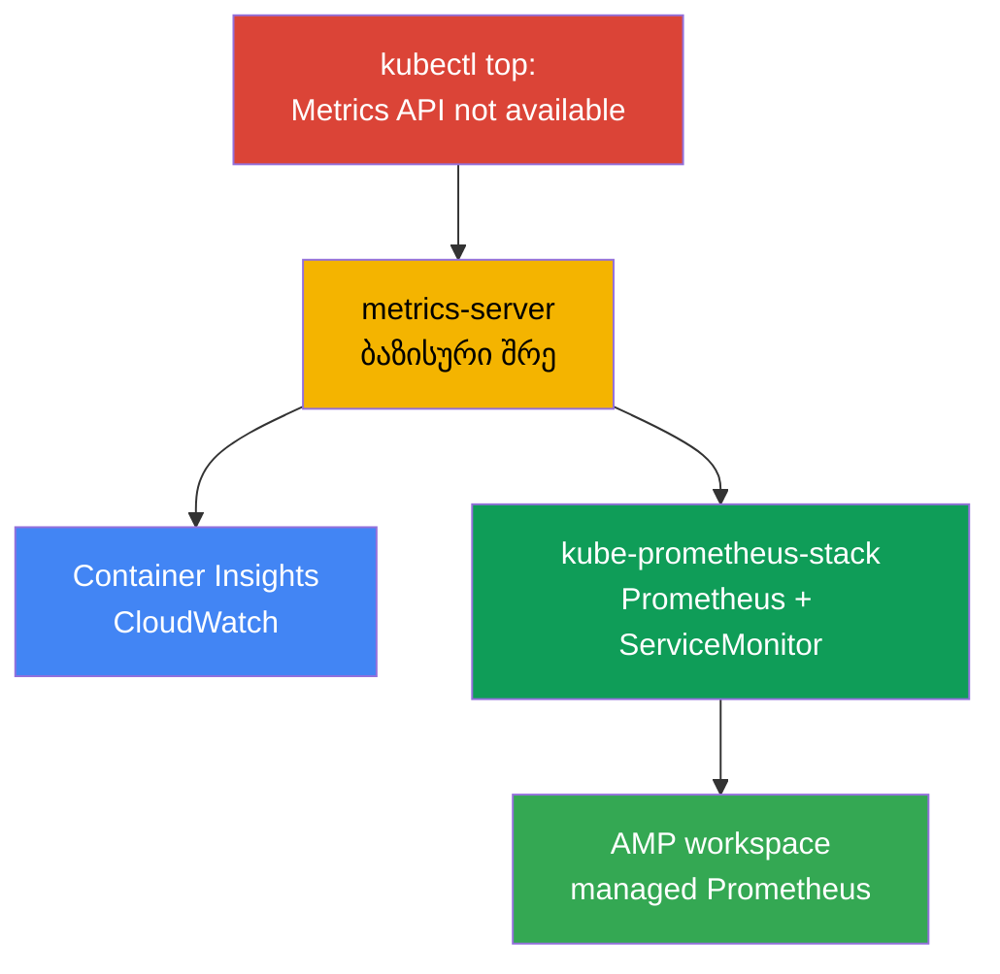
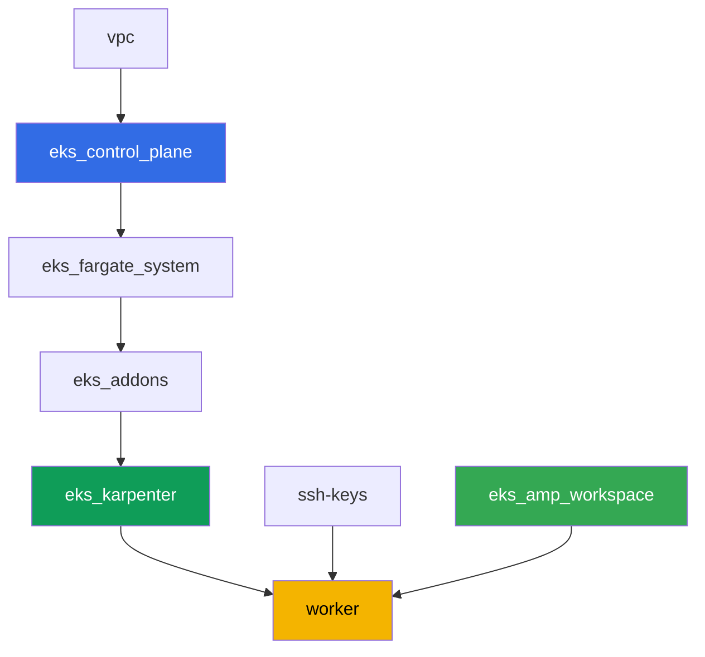

[Русская версия](README_RU.MD) · [Eng version](README.MD) · [Versión en español](README_ES.MD) · [Version française](README_FR.MD) · [Deutsche Version](README_DE.MD) · [繁體中文版](README_TW.MD) · [日本語版](README_JP.MD)

# ლაბა 114 - დაკვირვებადობა: Container Insights და Managed Prometheus Grafana-სთან

## აღწერა

კლასტერი ახლახან დეპლოირებულია, და დეჟურ ინჟინრის პირველივე კითხვას - "რამდენი CPU და
მეხსიერება ახლა ეხმარება ნოუდებს და პოდებს" - პასუხი არ ეძლევა: `kubectl top` ეცემა
"Metrics API not available"-ით. ამ ლაბაში თქვენ გაივლით გზას სიმპტომიდან სამუშაო
დაკვირვებადობამდე: ჯერ ვასწორებთ ბაზისურ შრეს (metrics-server), შემდეგ ავამართავთ
AWS-native გზას (CloudWatch Container Insights მართული აddon-ის მეშვეობით) და
Kubernetes-native გზას (kube-prometheus-stack რეალურ აპლიკაციასთან ServiceMonitor-ის
ქვეშ). ბოლოს ვრწმუნდებით, რომ managed Prometheus-თან თანხმლები საცავი (Amazon Managed
Prometheus) უკვე მზადაა მეტრიკების მისაღებად.

დავალებები production-სტილში: მოკლე დავალება პლუს მიღების კრიტერიუმები. შემოწმება -
ავტომატური, ბრძანებით `check_result`.

## მიზანი

გავამყაროთ კურსის თავის მასალა:

- [თავი 33. მეტრიკები: Container Insights, Managed Prometheus და Grafana](../../course/33/ge.md)

## რას ვქმნით

ლაბა 101-ის კლასტერი უკვე დეპლოირებულია. ამ ლაბაში თქვენ ამატებთ დაკვირვებადობის სამ შრეს
მასზე ზემოთ და ერთ managed backend-ს, რომელიც მზადაა მეტრიკების მისაღებად.

| ობიექტი | რა არის ეს | რისთვის ამ ლაბაში |
|--------|---------|-------------------|
| Namespace `eks-114` | კლასტერის სექცია ლაბის დატვირთვისთვის | ვინახავთ რესურსებს განცალკევებულად |
| არტეფაქტი `2/kubectl_top_before.txt` | `kubectl top nodes`-ის output ცარიელ კლასტერზე | ვაფიქსირებთ სიმპტომს "Metrics API not available" |
| Addon `metrics-server` | Metrics API-ის ბაზისური შრე | ასწორებს `kubectl top`-ს და კვებავს HPA-ს |
| არტეფაქტი `3/kubectl_top_after.txt` | `kubectl top nodes`-ის output ფიქსის შემდეგ | ვადასტურებთ, რომ ბაზისური შრე მუშაობს |
| Addon `amazon-cloudwatch-observability` | CloudWatch agent კლასტერში | Container Insights: ნოუდების/პოდების მეტრიკები CloudWatch-ში |
| არტეფაქტი `4/cloudwatch_agent_pods.txt` | CloudWatch agent-ის პოდები | ვადასტურებთ, რომ AWS-native გზა ავამართეთ |
| kube-prometheus-stack (`monitoring`) | Prometheus, Grafana, kube-state-metrics | Kubernetes-native მეტრიკების გზა |
| Deployment `ping-app` + `ServiceMonitor` | აპლიკაცია `/metrics`-ით და მისი scrape | აპლიკაციის მეტრიკების რეალური შეგროვება CRD Operator-ის მეშვეობით |
| არტეფაქტი `5/prom_query.txt` | Prometheus API-ის პასუხი PromQL-request-ზე | ვადასტურებთ, რომ აპლიკაციის მეტრიკა მიწვდა Prometheus-ს |
| AMP workspace (terraform) | managed Prometheus-თან თანხმლები backend | მესამე გზა: managed საცავი საკუთარი სერვერის გარეშე |
| არტეფაქტი `6/amp_endpoint.txt` | `describe-workspace`-ის output | ვადასტურებთ workspace-ის მზადყოფნას remote-write-ის მისაღებად |

მეტრიკების სამი გზა, რომელსაც გაივლით ამ ლაბაში:



## ინფრასტრუქტურა

გარემო დეპლოირდება AWS-ში (`eu-central-1`) Terragrunt-ის მეშვეობით, როგორც ლაბა 101-ში.
ლაბის ყოველი დირექტორია - ეს ერთი კომპონენტია საკუთარი `terragrunt.hcl`-ით, რომელიც
მიმართავს საერთო მოდულს `terraform/modules/`-ში და აცხადებს დამოკიდებულებებს
`dependency` ბლოკებით. Terragrunt აწყობს დამოკიდებულებების გრაფს და აპლიკებს
კომპონენტებს სწორი თანმიმდევრობით. ამ ლაბისთვის სპეციფიკურია მხოლოდ AMP workspace-ის
კომპონენტი; დაკვირვებადობის addon-ები და kube-prometheus-stack ყენდება Helm/AWS CLI-ით
პირდაპირ სამუშაო მანქანიდან დავალებების ფარგლებში.

### მოდულები და დამოკიდებულებები

| დირექტორია (კომპონენტი) | მოდული (`terraform/modules/`) | დამოკიდებულია | რას ქმნის |
|---------------------|-------------------------------|------------|-------------|
| `vpc` | `vpc_v3` | - | VPC `10.10.0.0/16`, ქვექსელები ორ AZ-ში, NAT |
| `ssh-keys` | `ssh-keys` | - | SSH-გასაღებების წყვილი სამუშაო მანქანისა და ნოუდებისთვის |
| `eks_control_plane` | `eks_v2_control_plane` | `vpc` | EKS control plane `1.36`, OIDC, security groups |
| `eks_fargate_system` | `eks_v2_fargate` | `vpc`, `eks_control_plane` | Fargate-პროფილი `kube-system`-ისთვის და `karpenter`-ისთვის |
| `eks_addons` | `eks_v2_addons` | `eks_control_plane`, `eks_fargate_system` | coredns, kube-proxy, vpc-cni, pod-identity |
| `eks_karpenter` | `eks_v2_karpenter` | `vpc`, `eks_control_plane`, `eks_addons`, `eks_fargate_system` | Karpenter-ის კონტროლერი, ნოუდების IAM-როლი |
| `eks_karpenter_default_vng` | `eks_v2_karpenter_vng` | `vpc`, `eks_control_plane`, `eks_karpenter` | ნაგულისხმევი NodePool `default` AL2023-ზე |
| `eks_amp_workspace` | `eks_v2_amp_workspace` | - | Amazon Managed Prometheus-ის workspace |
| `worker` | `eks_v2_work_pc` | `ssh-keys`, `vpc`, `eks_control_plane`, `eks_karpenter`, `eks_amp_workspace` | სამუშაო მანქანა kubectl-ით, helm-ით, ტესტებით და `check_result`-ით |

კომპონენტი `eks_amp_workspace` ქმნის AMP workspace-ს პროგნოზირებადი alias-ით
`<prefix>-amp`, ამიტომ worker პოულობს მას terraform output-ის წაკითხვის გარეშე.

დამოკიდებულებების გრაფი (რაც უფრო ადრე აპლიცირდება, ის ხრიხისკენ ქვემოთაა):



### სად რა კონფიგურირდება

`env.hcl` (გარემოს საერთო პარამეტრები, წაკითხული ყველა კომპონენტის მიერ):

| პარამეტრი | მნიშვნელობა ლაბაში | რაზე ახდენს გავლენას |
|----------|-----------------|---------------|
| `region` | `eu-central-1` | ყველა რესურსის რეგიონი, მათ შორის AMP workspace |
| `prefix` | `eks-task114` | რესურსების სახელების პრეფიქსი, მათ შორის AMP workspace-ის alias |
| `stack_name` | `eks114` | მისგან იწყობა `env_name` - კლასტერის სახელი |
| `k8_version` | `1.36.0` | kubectl-ის ვერსია სამუშაო მანქანაზე |
| `instance_type_worker` | `t3.medium` | სამუშაო მანქანის instance-ის ტიპი |
| `ssh_password_enable`, `access_cidrs` | `true`, `0.0.0.0/0` | SSH-წვდომა სამუშაო მანქანაზე |

`inputs` თითოეული კომპონენტის `terragrunt.hcl`-ში (კონკრეტული მოდულის პარამეტრები)
ემთხვევა ლაბა 101-ს: control plane-ისა და addon-ების ვერსიები `1.36`-ზე, Karpenter-ის
კონტროლერი `1.8.1`. განსხვავებები: `eks_amp_workspace/terragrunt.hcl` (ახალი კომპონენტი,
ქმნის მხოლოდ workspace-ს) და `test_url`/`task_script_url` `worker/terragrunt.hcl`-ში,
რომლებიც ამ ლაბის ფაილებზეა მიმართული.

> სამუშაო მანქანის IAM-უფლებები (`terraform/modules/eks_v2_work_pc/iam.tf`) დამატებულია
> ერთი additive Sid-ით `ObservabilityReadForMetricsLabs`: `cloudwatch:ListMetrics/
> GetMetricData/GetMetricStatistics/DescribeAlarms` და `aps:ListWorkspaces/
> DescribeWorkspace/ListRuleGroupsNamespaces/DescribeRuleGroupsNamespace` - მხოლოდ
> წაკითხვა, ჩაწერის გარეშე. ეს არის worker-ის (SSH-წვდომის მქონე ადამიანის) IAM-როლის
> დონის უფლებები, არა CloudWatch agent-ის - მას საკუთარი როლი აქვს
> `CloudWatchAgentServerPolicy`-ის მეშვეობით Karpenter-ის ნოუდის როლზე (იხილეთ
> დავალება 4).

## განლაგება

```bash
TASK=114 make run_eks_task
```

განლაგება გრძელდება დაახლოებით 15-20 წუთი. output-ში მოძებნეთ ხაზი SSH-შეერთებით
სამუშაო მანქანასთან და დაუკავშირდით მას. kubectl და helm იქ უკვე კონფიგურირებულია, ხოლო
AMP workspace-ის სახელი და alias - ფაილში `~/lab114_hints.txt`.

სასარგებლო ბრძანებები სამუშაო მანქანაზე:

```bash
time_left       # რამდენი დრო დარჩა გარემოს
check_result    # გადამოწმება
cat ~/lab114_hints.txt   # cluster_name, AMP workspace-ის alias და endpoint
```

> დრო Helm-ინსტალაციებზე. kube-prometheus-stack-ის დაყენება უფრო მძიმეა ჩვეულებრივ
> Deployment-ზე: ავამართავთ Prometheus, Alertmanager, kube-state-metrics, node-exporter
> და operator-ს, ეს გრძელდება დაახლოებით 3-5 წუთი ყველა პოდის მზადყოფნამდე.

> სტენდის უსაფრთხოება. `env.hcl`-ში ჩართულია `ssh_password_enable = true` და
> `access_cidrs = ["0.0.0.0/0"]` - ეს მოსახერხებელია სასწავლო გარემოსთვის, მაგრამ ასე არ
> უნდა გავხადოთ production-ში. კურსის სტანდარტების მიხედვით (თავები 0.2, 2, 19) სამუშაო
> მანქანებზე წვდომა იხსნება AWS SSM Session Manager-ის მეშვეობით, საჯარო SSH-პორტების
> გარეთ გამოტანის გარეშე, ხოლო `access_cidrs` ვიწროვდება კონკრეტულ მისამართებზე. აქ
> საჯარო SSH დარჩენილია მხოლოდ გაშვების გასამარტივებლად.

## დავალებები

---
|        **1**        | **Namespace ლაბის დატვირთვისთვის**                             |
| :-----------------: | :---------------------------------------------------------- |
| რას ვაკეთებთ          | შექმენით namespace სახელით `eks-114`. ლაბის ყველა ობიექტი შექმნილია მის შიგნით. |
| მიღების კრიტერიუმები    | - namespace `eks-114` არსებობს. |
---
|        **2**        | **სიმპტომი: მეტრიკები არ არსებობს საერთოდ**                              |
| :-----------------: | :---------------------------------------------------------- |
| რას ვაკეთებთ          | ახალ კლასტერზე შეასრულეთ `kubectl top nodes` და `kubectl top pods -A`. ორივე ბრძანება ეცემა შეცდომით "Metrics API not available" - Metrics API (`metrics.k8s.io`) კლასტერში ჯერ არ არის დარეგისტრირებული, რადგან metrics-server არ დაყენებულა. შეინახეთ სრული output (ორივე ბრძანება) ფაილში `/var/work/tests/artifacts/2/kubectl_top_before.txt`. |
| მიღების კრიტერიუმები    | - ფაილი `2/kubectl_top_before.txt` არ არის ცარიელი;<br/>- შეიცავს `Metrics API not available`. |
---
|        **3**        | **ბაზისური შრე: addon metrics-server**                      |
| :-----------------: | :---------------------------------------------------------- |
| რას ვაკეთებთ          | დაყენეთ managed-addon `metrics-server`: `aws eks create-addon --cluster-name <cluster> --addon-name metrics-server`. დაელოდეთ addon-ის მდგომარეობას `ACTIVE` (`aws eks describe-addon ... --query addon.status`) და დარწმუნდით, რომ `kubectl top nodes` დაიწყო დატვირთვის დაბრუნებას (სტრიქონის "not available"-ის გარეშე). შეინახეთ `kubectl top nodes`-ის output ფაილში `/var/work/tests/artifacts/3/kubectl_top_after.txt`. |
| მიღების კრიტერიუმები    | - addon `metrics-server` მდგომარეობაშია `ACTIVE`;<br/>- ფაილი `3/kubectl_top_after.txt` არ არის ცარიელი და არ შეიცავს "not available". |
---
|        **4**        | **Container Insights: addon amazon-cloudwatch-observability** |
| :-----------------: | :---------------------------------------------------------- |
| რას ვაკეთებთ          | Addon-ს სჭირდება უფლებები CloudWatch-ში მეტრიკების გამოსაქვეყნებლად. შექმენით IAM-როლი სახელით, რომელიც შეიცავს `-test-`-ს (მაგალითად `eks-task114-test-cw-agent`), trust policy-ით პრინციპალზე `pods.eks.amazonaws.com` (EKS Pod Identity, OIDC-ის გარეშე), და მიამაგრეთ მასზე managed policy `CloudWatchAgentServerPolicy`. დაყენეთ managed-addon ამ როლით Pod Identity-ის მეშვეობით: `aws eks create-addon --cluster-name <cluster> --addon-name amazon-cloudwatch-observability --pod-identity-associations serviceAccount=cloudwatch-agent,roleArn=<role-arn>`. Addon ავამართავს CloudWatch Observability Operator-ს და CloudWatch agent-ს namespace `amazon-cloudwatch`-ში. დაელოდეთ addon-ის მდგომარეობას `ACTIVE` და CloudWatch agent-ის პოდებს სტატუსში `Running`: `kubectl get pods -n amazon-cloudwatch`. შეინახეთ ეს output ფაილში `/var/work/tests/artifacts/4/cloudwatch_agent_pods.txt`. |
| მიღების კრიტერიუმები    | - addon `amazon-cloudwatch-observability` მდგომარეობაშია `ACTIVE`;<br/>- პოდები label-ით `app.kubernetes.io/name=cloudwatch-agent` `amazon-cloudwatch`-ში სტატუსშია `Running`;<br/>- ფაილი `4/cloudwatch_agent_pods.txt` არ არის ცარიელი და ახსენებს `cloudwatch-agent`-ს. |
---
|        **5**        | **kube-prometheus-stack: აპლიკაციის მეტრიკების რეალური შეგროვება**  |
| :-----------------: | :---------------------------------------------------------- |
| რას ვაკეთებთ          | დაყენეთ `kube-prometheus-stack` Helm-ის მეშვეობით namespace `monitoring`-ში (რეპოზიტორი `prometheus-community`), values-ით `prometheus.prometheusSpec.serviceMonitorSelectorNilUsesHelmValues=false` (ამის გარეშე Prometheus დაინახავს მხოლოდ ServiceMonitor-ს საკუთარი Helm-რელიზიდან). დაელოდეთ Prometheus-ის პოდების მზადყოფნას. `eks-114`-ში შექმენით Deployment `ping-app` (image `viktoruj/ping_pong:latest`, `1` რეპლიკა) და Service `ping-app`, რომელიც აქვეყნებს port `metrics`-ს (`9090` -> `9090`, აპლიკაცია აბრუნებს Prometheus-ის მეტრიკებს `/metrics`-ზე ამ port-ზე). შექმენით `ServiceMonitor` `ping-app` `eks-114`-ში `selector.matchLabels.app: ping-app`-ით, `endpoints[0].port: metrics`-ით, `path: /metrics`-ით. დაელოდეთ, სანამ Prometheus დაიჭერს target-ს, შემდეგ `kubectl port-forward`-ის მეშვეობით სერვისზე `<რელიზის-სახელი>-prometheus` და `curl`-ით (კონტეინერის image `prometheus` shell-utility-ების გარეშეა, `kubectl exec` `wget`/`curl`-ით არ იმუშავებს) შეასრულეთ request `/api/v1/query`-ზე `query=requests_total`-ით და შეინახეთ JSON-პასუხი ფაილში `/var/work/tests/artifacts/5/prom_query.txt`. |
| მიღების კრიტერიუმები    | - Prometheus-ის პოდები `monitoring`-ში `Running` და `Ready`;<br/>- Deployment `ping-app` `eks-114`-ში, image `viktoruj/ping_pong`, `1` მზა რეპლიკა;<br/>- `ServiceMonitor` `ping-app` `endpoints[0].port: metrics`-ით;<br/>- ფაილი `5/prom_query.txt` არ არის ცარიელი, შეიცავს `requests_total`-ს და `"metric"`-ს. |
---
|        **6**        | **Managed Prometheus: workspace მზადაა მეტრიკების მისაღებად**   |
| :-----------------: | :---------------------------------------------------------- |
| რას ვაკეთებთ          | AMP workspace უკვე შექმნილია terraform-ის მიერ (alias ფაილში `~/lab114_hints.txt`). იპოვეთ მისი ID (`aws amp list-workspaces --alias <alias> --query 'workspaces[0].workspaceId' --output text`) და მიიღეთ remote-write endpoint (`aws amp describe-workspace --workspace-id <id> --query "workspace.prometheusEndpoint" --output text`). შეინახეთ `describe-workspace`-ის სრული output ფაილში `/var/work/tests/artifacts/6/amp_endpoint.txt`. სრულფასოვანი remote-write pipeline (managed collector ან ADOT) ამ ლაბის ფარგლებში არ შედის - საკმარისია ვაჩვენოთ, რომ managed Prometheus-თან თანხმლები backend შექმნილია და მისი endpoint მიღებულია. |
| მიღების კრიტერიუმები    | - AMP workspace alias `<prefix>-amp`-ით არსებობს;<br/>- ფაილი `6/amp_endpoint.txt` არ არის ცარიელი და შეიცავს `aps-workspaces`-ს. |
---

## შედეგის შემოწმება

სამუშაო მანქანაზე გაუშვით ავტომატური შემოწმება:

```bash
check_result
```

ტესტები 3-5 ელოდებიან addon-ებისა და პოდების მზადყოფნას ციკლებით დროის შეზღუდვით (რამდენიმე
წუთამდე), ამიტომ არ შეგეშინდეთ, თუ `check_result` ჩვეულებრივზე მეტ ხანს სრულდება.

## გადაწყვეტა

ეტალონური გადაწყვეტა: [worker/files/solutions/1_GE.MD](worker/files/solutions/1_GE.MD)

## კლასტერისა და რესურსების წაშლა

ამ ლაბაში რამდენიმე ობიექტი შექმნილია პირდაპირ AWS CLI/Helm-ის მეშვეობით, არა
terraform-ით: managed-addon-ები `metrics-server` და `amazon-cloudwatch-observability`,
IAM-როლი `eks-task114-test-cw-agent` და EC2-ნოუდები, რომლებიც Karpenter-მა ავამართა
CloudWatch agent-ის DaemonSet-ისთვის და kube-prometheus-stack-ისთვის. Terraform არ იცის
მათ შესახებ და არ წაშლის - თუ `destroy` ადრე დაიწყება, მიტოვებული EC2-ნოუდები ინახავენ
ENI-ს და ბლოკავენ VPC/ქვექსელების წაშლას (ის იგივე პატერნი, რაც ლაბებში 108, 109, 111).
`destroy`-ის წინ ხელით გაასუფთავეთ ისინი:

```bash
CLUSTER=$(aws eks list-clusters --query 'clusters[0]' --output text)

# 1. ვხსნით დატვირთვას, რომლის გამო Karpenter-მა ავამართა EC2-ნოუდები
helm uninstall kube-prometheus-stack -n monitoring
kubectl delete namespace eks-114 monitoring amazon-cloudwatch

# 2. ვშლით managed-addon-ებს, დაყენებულს ხელით დავალებებში 3 და 4
aws eks delete-addon --cluster-name "$CLUSTER" --addon-name amazon-cloudwatch-observability
aws eks delete-addon --cluster-name "$CLUSTER" --addon-name metrics-server

# 3. ვშლით CloudWatch agent-ის IAM-როლს, შექმნილს დავალება 4-ში
aws iam detach-role-policy --role-name eks-task114-test-cw-agent \
  --policy-arn arn:aws:iam::aws:policy/CloudWatchAgentServerPolicy
aws iam delete-role --role-name eks-task114-test-cw-agent

# 4. ველოდებით, სანამ Karpenter თავადვე მოაშორებს EC2-ნოუდებს (არა უბრალოდ წაშლის
#    Node ობიექტს, არამედ დაასრულებს თავად EC2-instance-ს) - ორივე output ცარიელი
#    უნდა იყოს
for i in $(seq 1 30); do
  nc=$(kubectl get nodeclaims --no-headers 2>/dev/null | wc -l)
  ec2=$(aws ec2 describe-instances \
    --filters "Name=tag:karpenter.sh/nodepool,Values=default" \
      "Name=instance-state-name,Values=running,pending,stopping,stopped" \
    --query 'Reservations[].Instances[]' --output text)
  echo "nodeclaims=$nc ec2_instances=[$ec2]"
  [[ "$nc" == "0" ]] && [[ -z "$ec2" ]] && break
  sleep 10
done
```

მხოლოდ მას შემდეგ, რაც `nodeclaims=0` და EC2-instance-ების სია ცარიელია, გაუშვით
terraform-რესურსების წაშლა:

```bash
TASK=114 make delete_eks_task
```
